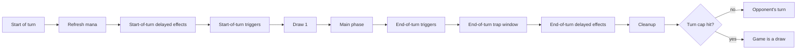
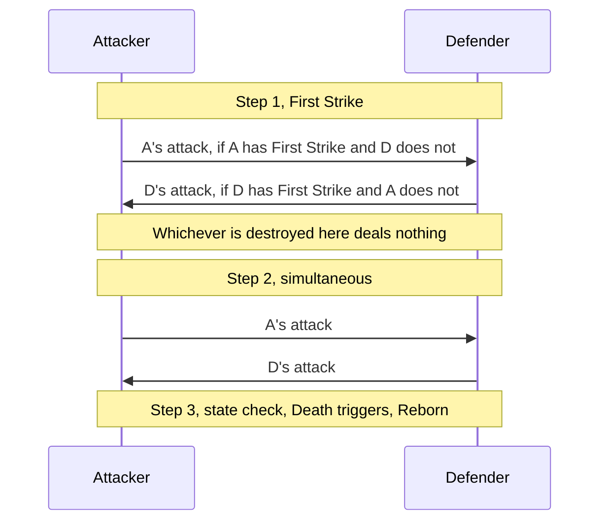
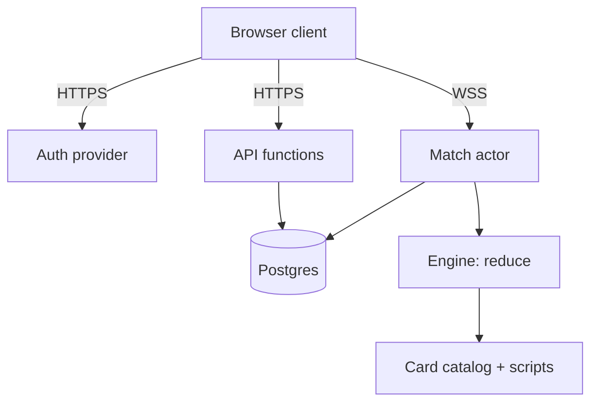
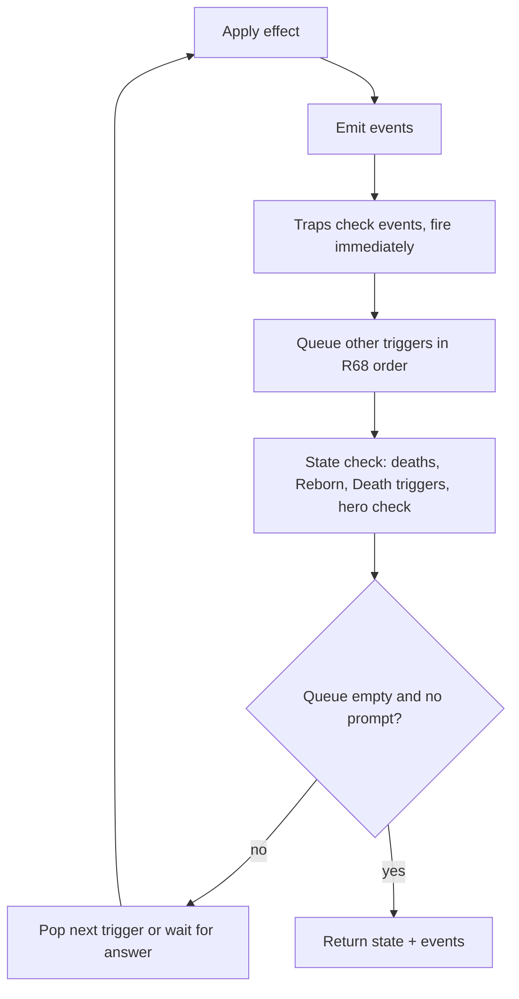

# JackiOh — Master Game Specification

2026-09-16, revision 5 of 2026-09-17 · @Someone

## 1. Overview

JackiOh is a 1v1 collectible card game: a Hearthstone-style mana curve, combat math and keyword vocabulary, played on Yu-Gi-Oh-style lanes with a hidden backrow of traps. This document is the complete specification: the rules, all 100 Core cards and 9 tokens described by what they do to game state, and the architecture and engine they run on.

Design pillars:

- Short, sharp games: 20-card decks with no duplicates, 4 max mana, 30 hero health, a 30-turn cap.
- Two combat axes: Attack/Defense position (Defense = Taunt + Armor) layered over Hearthstone-style free-target attacking.
- Radiant: every card has an upgraded form, and upgrading cards mid-game is a core resource loop (the Glowy Jelly Bean family, Radiant Saintess, Gifted Program, Eugenics).
- Lanes matter: 5 shared lanes give adjacency (Cleave, Hit Job, Collateral Damage), rotation (Silly Silas) and per-lane traps (Zoomerbin Oomen).
- Chaos is a feature: coin flips, random keywords, Call to Chaos, Pocket Chaos, Transmogulate. All of it must run on a seeded RNG so any match replays exactly.

How to read this spec: sections 2 to 7 are the rules; 8 is the card catalog (mechanics, not flavor text), with each card's rarity assigned by mechanical complexity; 9 and 10 are the architecture and the engine design; 11 collects every ruling this spec makes where the source was silent or ambiguous, with the ones still open marked decide.

Source material: the original JackiOh design notes (a mechanics sheet, the Core card list and a CCG architecture document), referred to below as "the source". Wherever this spec goes beyond them it is marked **Ruling:** in place, and the same item appears in section 11 so it can be confirmed or overturned in one place.

## 2. Core systems

A game is two players with 30-health heroes and 20-card decks, alternating turns until a hero hits 0 or the turn cap ends it in a draw.

### 2.1 Setup

1. Both decks are shuffled with the match seed.
2. Player 1 draws 3, Player 2 draws 4 (the Nth player draws N+2, so the engine should treat this as a table, not two constants). Any Quickdraw card in a deck replaces one of these draws (section 6).
3. Mulligan: each player sees their opening hand, marks any subset to return, draws that many replacements from the top of the library, then the returned cards are shuffled back in. **Ruling:** replacements are drawn before the returned cards go back, which is what "without replacement" means in the source.
4. Start-of-game effects resolve: every Heroic Power in either player's hand or library picks its random power, including one the mulligan returned (R43).
5. Player 1 takes the first turn and does draw on turn 1 (**Ruling**, Hearthstone convention).

### 2.2 Turn loop



This is the only turn sequence; §6.2 and §10.3 follow it (R62). Start-of-turn delayed effects (Kpop Fanatic's steal) resolve first, then start-of-turn triggers in queue order (R68), then the draw, so start-of-turn triggers fire before the draw. At the end of the turn, end-of-turn triggers resolve first (Combo-Index and the "add this back to your hand" spells included); then the end-of-turn trap window, where the Field Traps that watch turn ends (Bread and Butter, Intern Stimmy) fire on both sides; then end-of-turn delayed effects (Recycling Initiative, /fullsend's exile); then cleanup. Main-phase actions are: play a card (pay cost, pick modes and targets), attack with a unit, switch a unit's position, activate Heroic Power, offer or answer a draw, concede, end turn. Actions resolve one at a time; the engine never has two in flight. Cleanup expires every "this turn" effect (the Lunar Eclipse discount, /fullsend's modifiers, Professor Curvature's discount on its turn); Twinspell's pending Echo is not turn-scoped and survives cleanup.

### 2.3 Mana

- Max mana = min(number of turns you have started, 4), plus persistent modifiers. It refreshes to max at the start of your turn. Turn 1: 1 mana; turn 4 onward: 4.
- Temporary mana (Mana Well, Fed Fauci, Efficiency Dividend, /fullsend, Genn's Greed, Call to Chaos) adds to current mana and can exceed 4. GIGA Glowy Jelly Bean costs 6 and is castable only after such gains.
- Hinder subtracts from the opponent's next refresh. Mana never goes below 0.
- X-cost cards: X is chosen at play time, 0 ≤ X ≤ current mana, and is stored on the played instance. Heroic Power is the exception: its X is fixed by its power (R43). Cost modifiers never apply to an X-cost card (R65). Embiggen cards offer two prices; the choice is stored the same way and drives the card's effect.
- Cost modifiers stack additively and floor at 0, in the order given by Cost in §6.3 (R65); a temporary modifier ("this turn", "next turn") is stored with an expiry turn number.

### 2.4 Drawing, fatigue, hand size

- One draw at the start of every turn. Cast-on-draw cards resolve immediately and the draw repeats, which can chain (CN-Virus into CN-Virus). A cast-on-draw card is cast even when the hand is full, since it never enters the hand. **Ruling (R58):** one draw casts at most `CAST_ON_DRAW_CHAIN_CAP` (20) cast-on-draw cards; the next cast-on-draw card drawn in that chain goes to the hand uncast (burned if the hand is full), which ends the chain. "Draw N" is N separate draws, each with its own chain, and "draw your whole library" draws the library size as it was when the effect started.
- Fatigue: the source names it but not its effect. **Ruling:** the Nth draw from an empty library deals N damage to your hero (Hearthstone). Infinite Reserves replaces each such draw with a Rush Token card.
- Hand size: unspecified. **Ruling:** 10. A card drawn or added to a full hand is sent to the graveyard ("burned"), and Call to Chaos's "draw your deck" respects this.
- Decks may exceed 20 during play (Unstable Clone Machine, CN-Virus); 20 is a deckbuilding limit only. **Ruling (R80):** a library holds at most `LIBRARY_CAP` (60) cards; a card that would be shuffled into a full library is not created, and an existing card goes to its owner's graveyard instead.

### 2.5 Ending the game

| Condition | Result |
| --- | --- |
| A hero at 0 or less health at a state check | That player loses |
| Both heroes at 0 or less in the same check | Draw |
| Concede | That player loses |
| Disconnect grace period expires | That player loses (section 9.5) |
| Draw offered and accepted | Draw |
| End of the 30th turn | Draw ("auto-draw") |
| Hard match ceiling reached (60 minutes) | Draw (R79) |

**Ruling:** the cap counts player-turns, so 30 means 15 turns each; that lines up with a 20-card deck (3 or 4 opening cards plus 15 draws) and keeps fatigue rare. Draw offers: once per player per turn, and a declined offer blocks that player from offering again for 3 of their turns; both numbers are config values. If at any point in their main phase a player's only legal actions are ending the turn, conceding and draw offers, the turn auto-ends (R82). Only the active player offers a draw, during their main phase; the opponent answers it (R36). When the active player's turn clock runs out, their open prompts are answered by the AI policy and the turn ends. A prompt held by the non-active player has its own clock, which on expiry answers only that prompt (R79).

### 2.6 Deckbuilding

Exactly 20 cards, no duplicate card ids, no Token-tagged cards. With the architecture's three-deck loadout rule (section 9), a player needs 60 distinct cards across their loadout; Core has 100 non-token cards, so this is satisfiable.

## 3. Zones and board layout

Each player owns a hand, a library, a graveyard, an exile pile, a hero, 5 unit zones and 5 backrow zones; a lane is a column of four zones, two yours and two the opponent's.

| Zone | Holds | Visible to | Ordering | Engine notes |
| --- | --- | --- | --- | --- |
| Hand | Any card | Owner | Index order for triggers (R68); random picks are uniform | Cap 10 (ruling) |
| Library | Any card | Nobody; count is public | Top to bottom | Recruit scans top down; "bottom card" = last |
| Graveyard (GY) | Cards that were destroyed, discarded or resolved, except unit tokens (R11) | Both | Chronological | Unit tokens never enter it; spell tokens do |
| Exile | Exiled cards | Both | Chronological | Count feeds Echoes of the Forgotten and Spiteful Stab |
| Unit zone x5 | Units, or a Stack pile | Both | Lane 1 to 5, left to right from the owner's seat | Lock flag per zone |
| Backrow zone x5 | Field Spells, Traps, Field Traps | Field Spells: both; Traps: the controller only, and the other player sees a face-down card even if they own it (R33) | Lane 1 to 5 | Lock flag per zone; traps hidden until they fire |
| Hero | Health, hero armor, Heroic Power | Both |  | Health has no upper cap |

### 3.1 Lanes and adjacency

Your lane N faces the opponent's lane N. "This lane" (Zoomerbin Oomen) means the backrow zone in the same column as the unit. Adjacent means index N-1 and N+1 on the same side and same row: Cleave hits the units beside the target, radiant Hit Job destroys the units beside the target, radiant Collateral Damage exiles the permanents beside the target in its row.

**Ruling:** attacks are not lane-restricted. Any unit may attack any enemy unit or the enemy hero, subject to Taunt. Lanes only matter for adjacency, lane-targeted summons, and Silly Silas's rotation.

**Ruling (rotation topology):** for Silly Silas the ten unit zones form a ring: your lane 1 to 5, then the opponent's lane 5 down to 1, and back to your lane 1; the backrow forms a second ring the same way. "Rotate right" moves every card one step around its ring, so your lane-5 card becomes the opponent's lane-5 card and changes control. Both rings rotate together.

### 3.2 Zone rules

- A summon with no named zone goes to the leftmost empty, unlocked zone of the right row (R64). A summon into a full row fails silently and the effect that summoned it continues. A summon aimed at a specific zone ("this lane", Reborn's original zone) fails if that zone is occupied or Locked. A zone reserved for a dying Reborn unit (§4.5) counts as occupied for every other card that would enter it.
- Playing a Unit, Field Spell or Trap from hand requires an empty, unlocked zone in the right row; the player picks the zone.
- Lock: the zone accepts no summons until the game ends (nothing in Core unlocks). The current occupant is unaffected and the lock persists after it leaves.
- Stack: a Stack card may be played onto an occupied zone of the right row. The zone becomes an ordered pile whose top card is the only active one: it attacks, is targeted, and projects auras. Cards underneath are dormant: not "on the field" for effects, not targetable, keep their damage. When the top card leaves, the next card resumes. **Ruling:** Felinor Fiender's "including those under a Stack" is the one exception where dormant cards count.
- Unit tokens cease to exist when they leave the field for any reason (bounce, destroy, exile, transform), so "Bounce all units" clears them; a unit-token card in hand or library (Infinite Reserves, or a copy made by Unstable Clone Machine, Recycling Initiative or Combo-Index) ceases to exist if it leaves that zone other than by being drawn or played, burning included (R11). Spell tokens (section 7) behave as ordinary hand and library cards. Sheep Tokens are worth 2 Tributes while on the field, and a Radiant one is worth 3 (section 7), so the value is read off the face that is up rather than off the definition.
- Control vs ownership: Steal and rotation change the controller of a card on the field. Off the field a card always goes to its owner's hand, library, graveyard or exile; Pocket Chaos's library swap is the one effect that changes owners (R73). **Ruling:** a stolen unit that dies goes to its owner's graveyard.
- Backrow cards go to the owner's graveyard when their effect ends (Twinspell after it fires, traps after firing unless Field Trap).

## 4. Combat

A unit has Attack, Max Health and Damage; current health = max health minus damage, and a unit at 0 or less is destroyed at the next state check. Damage stays on a unit between turns: no phase and no cleanup step clears it, and only a heal (§6.3) or leaving the field (R78) takes it off.

### 4.1 Positions and exertion

- Units enter in Attack Position. Defense Position grants Taunt and Armor +1, stacking with printed Armor and Big D-fender's aura.
- Each unit has one exertion per turn: one attack or one position switch. Deft Duelist may do both.
- **Ruling:** only Attack-Position units may attack. A unit that switched to Attack this turn has spent its exertion and cannot attack (except Deft Duelist).
- Summoning sickness: a unit cannot attack the turn it entered the field. Rush lifts this for unit targets only; Charge lifts it for units and the hero. A sick unit may still switch to Defense. A unit that enters the field again, a Reborn body included, entered it on that turn like any other (R83). A unit whose controller changes (stolen, swapped with the board, or rotated across the centre line) has entered its new controller's side on that turn: it is summoning sick in exactly the same way, and its exertion is fresh for its new controller. A unit that only moves between lanes on its own side has not entered anything (R171).
- **Ruling:** a unit with 0 attack cannot declare an attack; it still deals 0 back when attacked. Spikey Pillow cannot be switched to Defense.

### 4.2 Declaring an attack

1. Choose an attacker that can attack (exertion unspent, Attack Position, not sick or has Rush/Charge, attack above 0, no "can't attack").
2. Choose a target: an enemy unit, or the enemy hero (not with Rush on the summon turn).
3. Taunt check: if any enemy unit has Taunt (printed, granted, or from Defense Position), the target must be one of them.
4. Declaring the attack has now spent the attacker's exertion, before any damage. Trap window: My Pawn checks whether the hit would be lethal and, if so, cancels the attack; the exertion is not given back, so the attack is gone either way (R44).
5. Resolve combat, then run the state check.

Forced attacks (Moths to the Flame, Bear Honeypot) skip steps 1 to 3: the named units attack the named target in lane order, regardless of position or sickness, without spending their exertion, and stop when the target is gone. Each forced attack is a separate combat followed by its own state check (R53).

### 4.3 Combat resolution



First Strike moves **that unit's** strike into step 1, on whichever side of the combat it is: an attacker with it hits a defender without it before that defender answers, and a defender with it hits an attacker without it before that attacker's blow lands. Either way the unit that struck in step 1 takes nothing back if its target falls there — §6.1's "deals damage before non-First-Strike units", stated as a sequence. Both units with First Strike strike simultaneously in step 1. When the defender is a hero, only the attacker deals damage. A defender in Defense Position still strikes back with its full attack.

### 4.4 One damage instance

Every point of damage in the game (combat, Cry, spell, end-of-turn, fatigue) goes through this pipeline, in this order. A hit whose amount is 0 before step 1, such as a 0-attack unit striking back, is not a damage instance: nothing happens and Divine Shield stays (R63).

1. Divine Shield: if the target has it, negate the whole hit and remove the shield. Stop.
2. Armor: subtract the target's total Armor (printed + Defense +1 + auras; hero uses Going Long's value). "Ignores armor" (True Strike) skips this. Floor at 0.
3. Hero cap: if the target is a hero with Anti-oneshot Armor, clamp to 5 (radiant 3).
4. Indestructible: takes no damage; stop.
5. Apply damage; emit `damage` with source, target and amount dealt. The amount dealt is not capped at the target's health, except that a Trample source's damage to a unit counts only up to that unit's health, the rest being the step 9 instance (R63).
6. On-damage triggers (Fed Fauci gains a Plague Token, Corpse Eater does not, that is a GY trigger).
7. Poisonous: if the source is a unit with Poisonous, the target is a unit, and 1 or more was dealt, mark the target destroyed.
8. Lifesteal: if the source has Lifesteal, or the effect stated that its own damage has Lifesteal (R85), heal the source's controller's hero by the amount dealt.
9. Trample: if the source is a unit with Trample and the target is a unit, the amount dealt beyond the target's health before this hit goes to the target's controller's hero as a new damage instance. This applies to any damage the unit deals, not only combat (R63).
10. Cleave (combat only): if the attacker has Cleave, deal its attack to each unit adjacent to the target as separate instances.

If the amount is 0 after step 3, the hit stops there: no `damage` event and none of steps 5 to 9, so Fed Fauci gains no Plague Token. Cleave belongs to the attack rather than to the hit, so it still happens when step 1, step 4 or this zero rule stopped the hit on the defender (R63).

### 4.5 Deaths and the state check

The check runs after every resolved action, every fully resolved effect or trigger (a card's whole Cry, spell, trap or triggered script, or one cast-on-draw cast), and every combat (Trample and Cleave hits included; each forced attack is its own combat, R53). It never runs between the damage instances of a single effect, so every hit of Jlockeed Shredder lands before anything dies (R59).

1. Collect units with health 0 or less or marked destroyed, and backrow cards marked destroyed; move them all to their owners' graveyards at once (tokens vanish). A collected unit with Reborn reserves its zone until step 4 (R64). Indestructible units take no damage and ignore destroy marks; a marked Indestructible unit instead switches to Attack Position and loses Taunt until end of turn (R46). An Indestructible unit whose max health is 0 or less (Suppressive Aura) is collected like any other unit; one at 0 or less health whose max health is still above 0 stays (R69).
2. Check heroes: 0 or less health ends the game (both = draw).
3. Fire Death triggers of the collected units in R68 order; each reads its unit's last-known state from just before it left (R78); every other trigger reads the `destroyed` event instead, which carries what the unit was as it died (R89).
4. Reborn: each collected unit that had Reborn returns to its reserved zone (unless the zone was Locked meanwhile) at 1 health without Reborn, as a reset instance (R78); its Cry does not fire, and because it has entered the field again it is summoning sick for the rest of that turn (R83).
5. Repeat until nothing changes, and at most `STATE_CHECK_PASS_CAP` (100) times. A check still finding work on the hundredth pass is an engine bug rather than a game state, so the engine throws there instead of returning a state no rule produced.

**Ruling:** Death triggers fire on both deaths of a Reborn unit, so radiant Right-house defender summons a base copy on its first death and again on its second.

## 5. Card anatomy and card types

A card is a definition in the catalog plus an instance in a game; the definition carries both the base form and the Radiant form, and the instance carries a `radiant` flag.

Every card carries the fields below; the catalog stores the base and Radiant forms under one id, and the Radiant form always has the same cost.

| Field | Values in Core | Catalog field |
| --- | --- | --- |
| Cost | 0 to 6, 100 (Ceaseless Void), X, or "A embiggen B" | `cost: number or 'X' or {base, embiggen}` |
| Type | Unit, Spell, Field Spell, Trap, Field Trap | `type` |
| Tribes and tags | Human, Felinor, KY, CN, Fruit, Call to Chaos, Quickdraw, Token | `tags: string[]` |
| Rarity | Common, Rare, Epic, Legendary, Mythic; Token for every token | `rarity` |
| Set | Core (Classic, Boss, Boss-X reserved) | `set` |
| Index | 1 to 100; tokens N.1 when card N defines them, T-name when shared (Rush, Sheep, Felinor, Bread) | `index: string` |
| Stats | Attack/Health, base and radiant | `base.stats`, `radiant.stats` |
| Text | keywords + scripted effects, base and radiant | `base.script`, `radiant.script` |

### 5.1 Types

- Unit: a permanent in a unit zone with stats; does combat.
- Spell: one-shot. Resolves, then goes to the graveyard, or to exile when it says "exile this". Spells with "End of turn: add this back to your hand" are flagged `returnToHandAtEndOfTurn` when played and return from the graveyard at the end of that turn, as graveyard triggers (R68).
- Field Spell: a permanent in the backrow with a lasting effect. May have a Cry (Anti-oneshot Armor), start/end-of-turn triggers, or an activated ability (Heroic Power).
- Trap: paid for and placed face-down in the backrow. Fires automatically the moment its condition is met, on either player's turn, then goes to the graveyard. Only its controller sees its identity before it fires; the other player sees a face-down card, even if they own it (R33).
- Field Trap: a Trap that stays after firing and can fire again.
- Permanent = anything occupying a unit or backrow zone.
- Token: generated only when a card names it. Random pools ("a random card", "Discover a (2) cost card") never include Token-tagged cards, and never include the generating card's own definition, unless the card names the pool itself (Call to Chaos's "cast a random Call to Chaos" draws from the Call to Chaos tag, which includes #95).

Rarity, tribe and set are pure filter tags. The catalog needs one query function, `catalog.query({type, cost, costRange, tags, notTags, rarity, set, excludeIndex})`, that every random-generation and Discover effect uses.

### 5.2 Radiant

The source defines Radiant only as "upgraded versions of normal cards". Rulings that make it implementable (R74):

- Radiant is a boolean on an instance, never a separate card id. Making a card Radiant sets it; nothing in Core un-sets it.
- In hand or library: cost unchanged, stats and text swap to the radiant form.
- On the field (Radiant Saintess, Knockoff Temu Glowy Jelly Bean, radiant GIGA Glowy Jelly Bean, Snom Bunny Mind Control): the base-stat layer swaps immediately, damage taken and buffs are kept, newly gained keywords apply at once, ongoing triggers use the radiant text from then on, and Cry does not re-fire.
- A copy of a Radiant card is Radiant. A card an effect generates "Radiant" is Radiant. Tokens can be Radiant (Radiant CN-Virus, Radiant Reminisce).
- Cards with no listed Radiant form (Quickstriker, Zao Gao, Combo-Fodder, Chaos Golem and My Pawn) are unchanged by becoming Radiant; the flag still sets so counting effects behave. The four unit tokens are NOT in that list any more — §7 gives each of them a Radiant face, so making a token Radiant now changes it.

### 5.3 Catalog data decisions

Places where the source card list was inconsistent, with the value the catalog uses; section 11 records them together as R75, and #94's reading as R26.

| Card | Issue in source | Catalog value used here |
| --- | --- | --- |
| #2 Bigot | No set listed | Core |
| #15 Me and Mr Token, #16 Hit Job | Radiant separator is `~~` | Treated as `~~~` |
| #12, #31, #51 | Header typos: tag "Felinors", name "KY’s, …" | Tag Felinor; names as in section 8 |
| #68 Twisted Sorcerer | Listed as "Spell, Unit" with stats | Unit |
| #90.1 | Named "CN-Viral Injection" like #90 | Named CN-Virus |
| #94 Genn's Greed | "exile all cost cards" is garbled | Exile all odd-cost cards (Genn Greymane reference) |
| #29 GIGA Glowy Jelly Bean | Cost 6 exceeds max mana 4 | Kept at 6; only castable with mana gain |
| #15, #34, #66, #86, #99, #100 | No card type in the header | Unit, Spell, Unit, Unit, Spell, Unit, from stats and text |

## 6. Keyword glossary

Every keyword below maps to one engine primitive; a card script only ever composes these primitives.

### 6.1 Unit keywords (computed as a set per unit)

| Keyword | Rule | Engine semantics | Core cards |
| --- | --- | --- | --- |
| Taunt | Enemies must attack Taunt units first | Attack-target validator; Defense Position adds it | #19, #55, #56, all units in Defense |
| Armor X | Reduce each damage instance by X | Pipeline step 2; stacks (printed + Defense 1 + auras); "Armor 1" when unnumbered | #1 aura, #9r, #25, #45r, #55, #84 (hero) |
| Rush | May attack units, not heroes, on summon turn | Sickness exemption for unit targets | #11, #14, #32, #56, #89, #91, Rush Token, Chaos Golem |
| Charge | May attack units and heroes on summon turn | Full sickness exemption | #11r, #45, #56r, #92r, #100r |
| First Strike | Deals damage before non-First-Strike units | Combat step 1 | #11, #14, #20, Chaos Golem |
| Poisonous | Destroys any unit it damages | Pipeline step 7 | Random-keyword pool only |
| Lifesteal | Damage dealt heals your hero | Pipeline step 8; also on spells (#93 A, Combo-Fodder) | #56, #93, #93.1, Chaos Golem |
| Reborn | First death: return at 1 health without Reborn | State check step 4 | #3, #81r |
| Divine Shield | Negate the first damage instance, then lose it | Pipeline step 1 | #3, #20r, #50r, #56, #89r, Chaos Golem |
| Trample | Excess damage hits the hero | Pipeline step 9; any damage the unit deals (R63) | Random-keyword pool only |
| Cleave | Also damages units adjacent to the target | Pipeline step 10, combat only, belongs to the attack (R63) | #32r |
| Indestructible | Can't be destroyed or damaged; can be exiled or sacrificed | Pipeline step 4; state check skips it unless its max health is 0 or less (R69); on would-destroy: Attack Position, lose Taunt this turn | #25r, #55r, #56r, #66, #98 |
| Immutable | Text can't be changed or transformed | Blocks Transform, Vanilla, Fuse-onto, Silence-like effects; Radiant still allowed (it is the card's own text) | #8, #19r, #66r |
| Stack | May be played onto an occupied zone | Zone becomes a pile; only the top is active (section 3.2) | #92 |
| Lucky X | Repeat a luck-based roll X extra times, keep the best | RNG helper `lucky(x, roll, better)` with a per-effect comparator | #23r, #42r |
| Can't attack | Cannot declare attacks | Attack validator flag | #86 |

**Ruling (random keyword pool):** Plastic Surgery and Zao Gao draw from Taunt, Armor 1, Rush, Charge, First Strike, Poisonous, Lifesteal, Reborn, Divine Shield, Trample, Cleave. Indestructible, Immutable, Stack and Lucky are excluded as too swingy or meaningless on a token. A unit never gets a keyword it already has.

### 6.2 Triggers and timing words

| Keyword | Rule | Engine semantics |
| --- | --- | --- |
| Cry | When a card enters the field for the first time | **Ruling:** fires only when played from hand (or by Cast on draw / Echo / Call to Chaos casting). Copies, Recruit, Reborn, tokens and Transform results do not fire it; otherwise Duplicating Felinors fills the board for 2 mana. Targets are chosen at play time. |
| Death | When sent from the field to the GY | Fires on destroy, sacrifice or combat death; not on bounce, exile, transform or steal. A token with Death would still fire it after vanishing (none in Core). |
| Cry and Death | Both hooks share one script | #81 |
| Start of turn | Controller's turn start, before the draw | Delayed effects first (Kpop Fanatic's steal), then the trigger queue in R68 order (§2.2, R62) |
| End of turn | Controller's turn end, before cleanup | Same queue; "add this back to hand" spells and Combo-Index resolve here; then the end-of-turn trap window (Bread and Butter, Intern Stimmy), then end-of-turn delayed effects (§2.2, R62) |
| Start of Game | After mulligan, before turn 1 | Only Heroic Power |
| Once per Turn | Activated ability limit | The instance stores the turn it was last used (`memory.usedTurn`, R43) |
| Aura | Effect while in play | Static modifier layer, recomputed on every state change (section 10.4) |
| Combo X | Extra effect if X or more cards were played earlier this turn | `turnLog.cardsPlayed` counter checked at play time; X defaults to 1 |
| Echo X | Recast this card X more times | Play resolves, then the same instance re-resolves X times with fresh mode/target prompts; Twinspell grants Echo +1 to the next spell. The repeats outstanding live in `state.echoQueue` and resolve one at a time in the resolution loop, so a prompt inside one repeat pauses the rest until it is answered (§10.5 step 6) |
| Cast on draw | Plays itself on draw, then draw again | Draw pipeline hook; a Cast (§6.3): costs nothing, counts as played (R40, R70); chains capped by R58 |
| Targets chosen randomly | The effect picks its own target | Random target from the legal set (used by AI turns and My Pawn) |
| Quickdraw | Starts in your opening hand instead of a draw | Setup step 2 |
| Fatigue | Drawing from an empty library | Nth fatigue draw deals N damage (ruling) |

### 6.3 Actions and verbs

| Verb | Rule | Engine semantics |
| --- | --- | --- |
| Summon | Put onto the field from anywhere else | `summon(card, controller, zone?)`; with no zone named, the leftmost empty unlocked zone of its row (R64); fails if there is none; no Cry |
| Play | Pay cost and cast from hand | `play(instance, X?, embiggen?, targets, modes)`; increments play counters; fires Cry |
| Destroy | Field to GY | Marks destroyed; state check moves it; Indestructible ignores |
| Sacrifice | Your own card (or an enemy unit a Tribute allows, #55), field to GY, bypasses Indestructible | `sacrifice(instance)`; counts as a death |
| Exile | To the exile pile from anywhere | Increments the game exile counter; no Death trigger |
| Bounce | Return to owner's hand | Tokens vanish; hand cap applies; the instance resets per R78 (buffs and damage included) |
| Discard | Hand to GY, except a unit-token card, which ceases to exist instead (§3.2, R11) | **Ruling:** the player chooses unless "random" is stated (Zao Gao is chosen) |
| Counter | Cancel a summoned card entirely | Card goes to GY, no Cry, no Death, and is treated as never played (the source's reading; no Core card counters) |
| Steal | Take control | Moves the card to the stealer's side, same lane if free else first free zone (ruling); excess stay put |
| Transform | Replace a card with another in place | New instance in the same zone, no Cry; blocked by Immutable |
| Vanilla | Remove a unit's text | Clears printed keywords and scripts; keeps stats, buffs and damage |
| Heal X | Remove up to X damage from a unit, or give a hero X health with no cap | `heal(target, x)`; "Heal to full" removes all damage; "Heal up to 30" sets health to max(current, 30) |
| Recruit | Summon from library, scanning top down | First permanent card (Unit, Field Spell, Trap, Field Trap) that matches the filter, summoned into its row per R64, traps face-down; then the library keeps its order |
| Discover | Choose 1 of 3 options | Pending choice; options drawn without replacement from the stated pool, shown only to the chooser. "Reveal N matching cards, then choose one" (KY's Private Tutor) is this same primitive with the library as the pool: the revealed cards are that prompt's options, so only the chooser ever sees them (§10.8) |
| Tribute X | As an additional cost of playing a card, sacrifice X of your units; a card whose own text tributes (Carnivorous Cube) sacrifices what that text names instead, which may be any of your other permanents, backrow included (R41) | The play-time cost is the play validator's, and the choice travels in the play action (R81); the Sheep Token counts as 2 toward that X while it is on the field, or 3 if it is Radiant (§3.2, §7), and Lava Golem may pick enemy units. A tribute written into a card's script is an ordinary Sacrifice of the permanent that script names, where the Sheep Token's 2 never applies |
| Fuse | Combine effects, stats and cost, cost capped at 4 | A new transient definition and instance per R77: summed stats, union of keywords, concatenated scripts, cost min(sum, 4); a target already on the field survives as the fused card and the other ingredients cease to exist |
| Embiggen | Two prices, bigger effect for the bigger one | Play-time choice stored on the instance; scripts read `instance.embiggened` |
| Lock | Zone can't be summoned into | Zone flag |
| Choose one | Modal effect | Pending choice with the listed modes |
| Plague Token | Counter on a permanent, any number, reset on leaving the field | `instance.counters.plague` |
| Mana / gain mana | Add to current mana this turn | May exceed 4; "next turn" mana is stored as a modifier for the next refresh |
| Damage | Deal X damage to a unit or hero | `damage(source, target, x)`: one instance through §4.4 |
| Lose health | A hero loses X health | Lowers hero health directly: no pipeline, no Armor, no cap, no on-damage effects (R18) |
| Draw | Take the top card of your library | §2.4: cast on draw, fatigue, hand cap, chain cap (R58) |
| Add to hand | Put a card into a hand | Creates or moves the card; a full hand burns it (§2.4), and a unit-token card burned that way ceases to exist instead of reaching the graveyard (§3.2, R11) |
| Shuffle into | Put a card into a library | Inserted at a uniformly random position drawn from the match rng |
| Make Radiant | Upgrade a card | Sets `radiant` (§5.2); no effect on a Radiant card; random picks follow R60 |
| Switch position | Flip Attack and Defense | As a player action it spends exertion (§4.1); as an effect it does not (R20); Spikey Pillow never enters Defense |
| Forced attack | Named units attack a named target, whether or not they could have declared it | `forceAttack` / `forceAttacksOn`: skips §4.2 steps 1 to 3, so position, summoning sickness and Taunt are all ignored and no exertion is spent; the target still strikes back; the named attackers go in lane order, each attack its own combat followed by its own state check, and the run stops once the target has left the field (R53); a card dormant under a Stack neither attacks nor is hit (R13) |
| Cancel an attack | Call off an attack already declared, before any damage | `cancelAttack`, inside §4.2 step 4's trap window: marks the open `declaredAttack` cancelled, so no combat resolves and `attackCancelled` is emitted in its place; the attacker's exertion was spent on the declaration, so the attack is gone either way (R44) |
| Cost | What a card costs to play now | `effectiveCost`: start from `costOverride`, else the printed cost (Ceaseless Void's computed cost, the chosen embiggen price); add the instance's `costMod`; add player discounts (this-turn, next-spell); then apply Professor Curvature if the result is 4; floor at 0. X-cost cards cost exactly X and ignore modifiers (R65) |
| Cast | Play a card without paying for it | Free; counts as a play for every rule that counts or reacts to plays, with cost paid 0; fires the Cry or spell script; the caster picks targets and modes (R70) |
| Swap | Exchange something between the two players | Pocket Chaos: hero health, board contents lane by lane, or library contents (R73) |
| Rotate | Move every card on the field one step around its ring | Silly Silas: the two rings of §3.1; control changes on crossing; damage and buffs travel; a Locked destination bounces the card to its owner's hand (R14), as it does for any effect that moves a whole board at once (R88) |
| Replace | Put a new card where an old one was | New instance in the same zone and position, with the old card's owner and controller; on the field this is a Transform; the old card's fate is per card (R31, R35) |

The source also defines Flicker; no Core card uses it, so the engine has no primitive for it.

## 7. Tokens

Nine token definitions cover every token any Core card can generate; a token is only ever created by an effect that names it, or as a copy of one. A unit token vanishes when it leaves the field; a spell token lives in hand and library like a real card and goes to the graveyard after it resolves.

| Token | Index | Cost | Type | Stats and text | Radiant form | Generated by |
| --- | --- | --- | --- | --- | --- | --- |
| Rush Token | T-rush | 1 | Unit | 3/3, Rush | 6/6, Rush | #15, #58, #60, #74 (X/X), #75, #80, #95 (Radiant), #98 |
| Sheep Token | T-sheep | 1 | Unit | 1/1, worth 2 Tributes | 2/2, worth 3 Tributes | #41 |
| Felinor Token | T-felinor | 1 | Unit, Felinor | 1/1 | 2/2 | #62, #98 |
| Bread Token | T-bread | 0 | Unit | Printed 0/0; always summoned as X/X through `statsOverride` (X = unspent mana, or 3X); no text | X/X, Armor X — the same X, carried as `armorOverride` beside the stats because the printed `n` can no more be known at print time than the printed 0/0 | #18 |
| KY's Empty Notebook | 51.1 | 1 | Spell, KY | Draw 1 | Draw 2 | #51 |
| Spikey Pillow | 65.1 | 1 | Unit | 0/2, cannot be in Defense Position, your units have -2 attack | 0/4, cannot be in Defense Position, your non-Spikey-Pillow units have -2 attack | #65 |
| CN-Virus | 90.1 | 1 | Spell, CN | Cast on draw: take 1 damage, shuffle 2 copies into your deck | 3 copies | #90, and itself on each draw |
| Combo-Fodder | 93.1 | 0 | Spell | Deal 2 damage, Lifesteal | none | #93 radiant |
| Chaos Golem | 95.1 | 4 | Unit | 10/10, Rush, Lifesteal, Divine Shield, First Strike | none | #95 |

Token rules:

- Stat overrides: Adaptive UI summons a Rush Token with X/X (or 3X/3X) instead of 3/3; Rush Token Farm radiant gives all your Rush Tokens +3/+3 as an aura. Implement as the Rush Token definition plus a `statsOverride` on summon. Call to Chaos is NOT one of these any more: it summons the token's own Radiant face (6/6) rather than a bespoke 5/5, so the only card that invented a Rush Token size no longer does.
- Bread Token has no name in the source ("a X/X Token"). **Ruling:** name it Bread Token, no keywords, cost 0, and it counts as a Token for every filter.
- Spell tokens (Notebook, CN-Virus, Combo-Fodder) live in hand and library like real cards and go to the graveyard after resolving; they are still excluded from random pools and from Discover unless named. **Ruling:** Reminisce can Discover a spell token from the graveyard because it discovers "a card in your GY", not from a pool.
- CN-Virus damage is a normal damage instance to your own hero (Armor and Anti-oneshot Armor apply). Its "shuffle copies" makes an opponent's deck grow without bound; the cast-on-draw chain cap (R58) keeps each draw finite and the turn cap keeps the game finite.
- "Fill your board" summons into every empty, unlocked unit zone left to right (R64).
- Zao Gao's Rush Tokens each roll 2 distinct keywords from the random-keyword pool (section 6.1).

## 8. Complete card catalog

All 100 Core cards plus the 5 tokens a card defines (index N.1), in index order (the 4 shared tokens are in section 7), described by what they do to the game state rather than by their printed text; stats read base → radiant, and the Engine column names the primitive from section 6 or the ruling from section 11 that the implementation depends on.

Conventions: "target" means the player picks at play time from all legal units and heroes on either side unless narrowed. "Your" means the controller. A Cry or spell whose target set is empty fizzles: the unit still enters, the spell still counts as played. Damage always goes through the pipeline in section 4.4; "lose health" does not. Reading a Radiant cell: a cell that lists keywords without "Plus" gives the radiant form's complete keyword list; "Plus X" adds keyword X to the base keywords; a cell that names no keywords keeps the base keywords. A clause the cell restates replaces the base version and every base clause it does not restate is kept; a cell that changes only a number ("+10 attack", "5 damage") changes only that number. "same" says so explicitly, and "Also" and "Then" add effects.

Rarity is assigned by mechanical complexity and game impact, and is the value the catalog's `rarity` field carries. Common: keywords only, one primitive with at most one target, or one fixed start-of-turn, end-of-turn or cast-on-draw effect. Rare: a trigger that reads state or asks for a choice, a modal choice or prompt, a cost or mana modifier, or a simple trap. Epic: chained prompts, delayed or cross-turn effects, traps that act on the opponent's turn, or effects that read several zones. Legendary: control changes across the board, zone-wide rewrites, recursion, or a stat layer that exists for one card. Mythic: a subsystem of its own. Distribution: 35 Common, 37 Rare, 16 Epic, 7 Legendary, 5 Mythic. This supersedes the rarities printed in the source list (#1–20 Common, #21–50 Rare, #51–80 Epic, #81–95 Legendary, #96–100 Mythic); a review comparing catalog to source should treat that difference as intended.

### 8.1 Cards #1–20

| # | Name | Rarity | Cost | Type, tags | Stats | Base effect | Radiant effect | Engine |
| --- | --- | --- | --- | --- | --- | --- | --- | --- |
| 1 | Big D-fender | Common | 2 | Unit, Human | 0/8 → 0/16 | Aura: your units in Defense Position have +2 Armor | +4 Armor | Aura layer keyed on `position == DEF`; 0 attack so it never attacks |
| 2 | Bigot | Common | 2 | Unit, Human | 6/1 → 12/2 | Cry: destroy target enemy non-Human unit | Cry: destroy all enemy non-Human units | Targeted Cry with tag filter |
| 3 | Right-house defender | Common | 1 | Unit, Human | 1/1 → 2/2 | Taunt, Divine Shield, Reborn | Taunt, Divine Shield, Reborn; Death: summon a base Right-house defender | Death fires on both deaths (4.5); the summoned card is a new base Right-house defender (not a copy) with its own Reborn, so the chain ends; it is placed per R64 while the dying one's zone stays reserved |
| 4 | Gary the Gambler | Common | 1 | Unit, Human | 1/1 → 2/2 | Cry: flip 5 coins; +1 attack per heads, +1 max health per tails | 7 coins; +2 per heads, +2 per tails | 5 or 7 seeded rolls; permanent buff layer; Lucky has no defined "best" here so does not apply |
| 5 | Stockpile | Common | 1 | Spell |  | Draw 2; heal your hero 2 | Draw 5; heal 5 | Hand cap applies |
| 6 | Mana Well | Common | 3 | Field Spell |  | Start of turn: gain 1 mana | Gain 2 | Temporary mana, may exceed 4 |
| 7 | Jewelosco Scarab | Rare | 1 | Unit | 1/1 → 2/2 | Cry: Discover a 2-cost card | Cry: Discover a 3-cost card; it costs 1 less | `catalog.query({cost, notTags:[Token], excludeIndex:7})` with costs read per R65 (embiggen cards at their base price, X cards as 0); permanent −1 `costMod` on the chosen instance |
| 8 | Mr. Vanilla | Common | 1 | Unit, Human | 3/3 → 7/7 | Immutable | Immutable | Blocks Vanilla, Transform, Fuse-onto |
| 9 | Moths to the Flame | Rare | 2 | Unit | 1/14 → 2/28 | Start of turn: every enemy unit attacks this | Armor 1; same | Forced attacks in enemy lane order (4.2); stops when Moths dies |
| 10 | Rapid Replenish | Common | 0 | Spell |  | Combo 3: draw 3; otherwise nothing | Combo 3: draw 6 | Checks `turnLog.cardsPlayed >= 3`; always playable |
| 11 | Tempo Timmy | Common | 1 | Unit, Human | 3/3 → 6/6 | Rush, First Strike | Charge, First Strike | Keywords only |
| 12 | Duplicating Felinors | Rare | 2 | Unit, Felinor | 3/4 → 5/9 | Cry: summon a copy of this unit | Same | Copy per R57, placed per R64; the copy's Cry does not fire (6.2) |
| 13 | Jlockeed Shredder-10 | Common | 3 | Unit | 8/10 → 16/20 | End of turn: deal 2 damage to each enemy unit and the enemy hero | 5 damage | One damage instance per target, controller's end of turn |
| 14 | Jlockeed's Weapons | Common | 4 | Field Spell |  | Aura: your units have +4 attack, Rush, First Strike | +10 attack | Aura grants keywords; removed when it leaves |
| 15 | Me and Mr Token | Common | 1 | Unit, Human | 1/1 → 2/2 | Cry: summon a Rush Token | Cry: summon 3 Rush Tokens | Board full → fewer |
| 16 | Hit Job | Common | 2 | Spell |  | Destroy target unit | Destroy target unit and the units adjacent to it on its side | Adjacency 3.1; Indestructible survives |
| 17 | Flood | Rare | 3 | Spell |  | Bounce all units on both sides | Choose one: bounce all units, bounce all enemy units, destroy all enemy units; then draw 1 | Tokens vanish on bounce; hand cap burns extras |
| 18 | Bread and Butter | Epic | 1 | Field Trap |  | When any player ends a turn with unspent mana: summon a Bread Token X/X for the trap's controller, X = that player's unspent mana | X = 3 × unspent | Fires in the end-of-turn trap window of both players' turns (R62) |
| 19 | Midrange Menace | Common | 3 | Unit | 9/9 → 18/18 | Taunt; End of turn: heal to full | Taunt, Immutable; same | Heal removes all damage |
| 20 | Pointmaster | Common | 2 | Unit, Human | 7/2 → 14/4 | First Strike | First Strike, Divine Shield | Keywords only |

### 8.2 Cards #21–50

| # | Name | Rarity | Cost | Type, tags | Stats | Base effect | Radiant effect | Engine |
| --- | --- | --- | --- | --- | --- | --- | --- | --- |
| 21 | Hinder | Common | 0 | Spell |  | Cast on draw: the opponent's next mana refresh is 1 lower | 2 lower | `mana.nextTurnMod` on the opponent, floors at 0 |
| 22 | Carnivorous Cube | Epic | 3 | Unit | 4/6 → 8/12 | Cry: Tribute one of your other permanents and remember it. Death: summon 2 copies of the remembered card | Death: fill your board with copies | `memory.eaten = {defId, radiant, statsOverride}`; backrow copies go to the backrow (R41); nothing to tribute → Cry fizzles and Death does nothing; cannot eat itself |
| 23 | Reoccurring Dream | Rare | 1 | Spell |  | 30% chance a random card in your hand becomes Radiant. End of turn: returns from the GY to your hand | Lucky 1 (two rolls, keep the success) at 40% | Random pick per R60; return-at-end-of-turn flag; hand full → burned |
| 24 | Efficiency Dividend | Epic | X | Spell |  | Choose one: deal X damage to a target; heal a target 2X; gain floor(X/2) mana next turn. End of turn: returns to hand | Uses X+1 | X chosen at play; positive `mana.nextTurnMod` |
| 25 | 4-mana 7/7 | Common | 4 | Unit | 7/7 → 7/7 | Armor 7 | Indestructible | Keywords only |
| 26 | Glowy Jelly Bean | Rare | 3 | Spell |  | Choose a card in your hand; it becomes Radiant | Choose 2 | A declared `hand` pick, so it travels in the play action's `targets` (R81); radiant takes both cards it can when the hand holds only one other |
| 27 | Blood Ridden Glowy Jelly Bean | Common | 1 | Spell |  | Cast on draw: a random card in your hand becomes Radiant; you lose 5 health | 2 random cards | "Lose health" bypasses Armor and the Anti-oneshot cap (R18); random picks per R60 |
| 28 | Knockoff Temu Glowy Jelly Bean | Common | 2 | Spell |  | 2 random cards among your library, hand and field become Radiant | 5 | Uniform over the union's non-Radiant cards, all different (R60); field cards convert in place (5.2) |
| 29 | GIGA Glowy Jelly Bean | Rare | 6 | Spell |  | Every card in your hand becomes Radiant | Hand and all your permanents | Cost 6 requires mana gain |
| 30 | Archivist | Rare | 2 | Unit | 4/5 → 8/10 | Cry: choose one: draw the highest-cost card in your library, or the lowest | Cry: draw both | Ties → nearest the top; costs per R65, so X-cost counts as 0 and embiggen cards as their base price (R24) |
| 31 | KY's Math Equation | Rare | 1 | Spell, KY |  | Deal Fib(cost+1) damage to a target. End of turn: return to hand with cost +1 | Fib(cost+2) | cost = printed + `costMod` (R67); the return adds +1 to the instance's permanent `costMod`; Fib = 0,1,1,2,3,5,8,13,21,34,55,89, index clamps at 11 (R25) |
| 32 | Prem Panther | Rare | 2 | Unit | 5/4 → 10/8 | Rush; whenever this destroys a unit, draw 2 | Rush, Cleave; same | "Destroys" = a death whose lethal damage came from this unit, Cleave hits included; per unit |
| 33 | Unstable Clone Machine | Rare | 2 | Field Spell |  | After you play a card, shuffle 3 copies of it into your library | One of the 3 is Radiant | Post-play trigger; copies are fresh instances with the played card's radiant flag; token cards get copied too (R34); nothing is added to a full library (R80) |
| 34 | Collateral Damage | Rare | 3 | Spell |  | Exile target permanent and a random card from the opponent's library | Also the permanents adjacent to the target in its row | Exile bypasses Indestructible; bumps the exile counter |
| 35 | Lunar Eclipse | Rare | 1 | Spell |  | Deal 3 damage to a target; the next Spell you play this turn costs 1 less | 6 damage; 2 less | Player-level "next spell" discount, consumed on use or at cleanup |
| 36 | Magic Jammed | Rare | 1 | Spell |  | Destroy target backrow card; Lock its zone | Steal target backrow card; Lock its original zone | Stolen backrow lands in your same-lane zone if free, else first free (6.3); you see a stolen trap's identity (ruling) |
| 37 | Gravedigger | Rare | 2 | Unit | 4/5 → 8/10 | Start of turn: add a random card from your GY to your hand | Discover one from your GY; it costs 1 less | Empty GY → nothing |
| 38 | Quickstriker | Epic | 3 | Field Spell |  | Your cards gain "Combo X: deal X damage to the enemy hero", X = cards you played earlier this turn | No radiant form | On each play except the one that put it on the field (R119): damage = `turnLog.cardsPlayed` before this card |
| 39 | Recycling Initiative | Epic | 0 | Spell |  | Exile this on play. End of turn: add a copy of every other card you played this turn to your hand | Copies cost 1 less | End-of-turn delayed effect: a fresh copy (radiant flag kept) of every card in `turnLog.playedIds` except this one, including cards played after it (R71); instances that no longer exist are skipped rather than fizzling (R86) |
| 40 | Echoes of the Forgotten | Common | 2 | Field Spell |  | Start of your turn: deal damage to the enemy hero equal to the cards in your exile; then exile the bottom card of your library | +3 damage | Counts your own exile pile (R72); empty library → no exile, no fatigue |
| 41 | Sheepish | Epic | 1 | Trap |  | When the opponent plays a Unit: Transform it into a Sheep Token | Also add a Lava Golem costing 0 to your hand | Fires on the play, before the Cry resolves (ruling), so the Cry is lost; Immutable target → trap still fires and is consumed with no effect (R17) |
| 42 | Eugenics | Common | 2 | Spell |  | Exile 8 random cards from your library; each remaining library card has a 30% chance to become Radiant | Lucky 1 at 40% | Fewer than 8 → exile all |
| 43 | Big Felinor | Rare | 3 | Unit, Felinor | 3/10 → 6/20 | Cry: destroy all non-Felinor units on both sides | Enemy non-Felinor units only | Simultaneous destroy, one state check |
| 44 | True Strike | Common | 1 | Spell |  | Deal 4 damage to a target, ignoring Armor; exile this | 9 | Skips pipeline step 2; Divine Shield still applies |
| 45 | Deft Duelist | Rare | 2 | Unit, Human | 4/3 → 8/6 | Charge; may attack and switch position in the same turn | Charge, Armor 1; same | Two exertions: one attack plus one switch |
| 46 | Suppressive Aura | Rare | 2 embiggen 4 | Field Spell |  | Aura: all units −2/−2 (paid 4: −5/−5) | Aura: enemy units −4/−4 (paid 4: −10/−10) | Aura lowers max health; units at 0 die at the state check; leaving restores them |
| 47 | Fig of Life | Common | 3 | Spell, Fruit |  | Heal a target 20 | 50 | Any unit or hero (ruling) |
| 48 | 5pek Controller | Common | 0 | Spell |  | Switch the position of every unit | Choose: all enemy units, or all units | Does not spend exertion (ruling) |
| 49 | Snom Bunny Mind Control | Rare | 3 | Spell |  | Steal target enemy permanent | It also becomes Radiant | Steal per 6.3 |
| 50 | Kpop Fanatic | Epic | 1 | Unit | 1/1 → 2/2 | Cry: choose an enemy permanent; at the start of your next turn, steal it | Divine Shield; same | Delayed effect (`state.delayed`) keyed to the target instance; fires even if Kpop Fanatic died; fizzles if the target left the field (R76) |

### 8.3 Cards #51–80

| # | Name | Rarity | Cost | Type, tags | Stats | Base effect | Radiant effect | Engine |
| --- | --- | --- | --- | --- | --- | --- | --- | --- |
| 51 | KY's Private Tutor | Epic | 1 | Spell, KY |  | Choose a type (Spell, Unit, Field Spell, Trap), then a cost bracket (0–1, 2, 3, 4+), offering only options with a match in your library; reveal 3 random matching library cards; choose one to hand. No match at all → add a KY's Empty Notebook | Echo (resolves a second time) | Three chained pending choices; Field Trap counts as Trap; brackets read costs per R65 (X cards as 0, embiggen cards at their base price) |
| 51.1 | KY's Empty Notebook | Token | 1 | Spell, KY, Token |  | Draw 1 | Draw 2 | Token; section 7 |
| 52 | Silly Silas | Legendary | 3 | Unit, Human | 4/4 → 8/8 | Cry: choose left or right; rotate every card on the field one step around its ring (3.1); cards crossing sides change control | Cards that would move to the opponent are bounced to their owner's hand costing 0 instead | Silas rotates too; damage and buffs travel with the card; a Locked destination bounces the card (ruling) |
| 53 | Reno | Common | 3 | Unit, Human | 4/6 → 8/12 | Cry: if your hero is below 30, set it to 30 | 60 | `health = max(health, 30)` |
| 54 | Straaza | Common | 4 | Unit | 8/8 → 16/16 | Cry: add 2 random Units costing 3 or 4 to your hand; they cost 1 | They cost 0 | Non-token pool excluding #54; `costOverride` |
| 55 | Lava Golem | Rare | 3 | Unit | 10/5 → 20/10 | Tribute 3, Armor 3, Taunt; may tribute enemy units | Plus Indestructible | Validator counts both sides' units, Sheep = 2; tributed enemies are sacrificed; Sheepish's 0-cost copy still needs Tribute 3 |
| 56 | Jilliax | Common | 2 | Unit | 3/2 → 6/4 | Rush, Taunt, Lifesteal, Divine Shield | Charge, Taunt, Lifesteal, Indestructible | Keywords only |
| 57 | Conjure KY | Common | 2 | Spell, KY |  | Add 3 random KY cards to your hand | 2 random plus 2 random Radiant KY cards | KY pool = #31, #51, #82 (no tokens, not #57); repeats allowed |
| 58 | Rush Token Farm | Common | 2 | Field Spell |  | Start of turn: summon a Rush Token | Aura: your Rush Tokens +3/+3; same | Aura keyed on def T-rush |
| 59 | Unbiased Immigration | Rare | 2 embiggen 4 | Field Spell |  | Start of turn: add a random card to your hand (paid 4: it costs 0) | A random Radiant card (paid 4: it costs 0) | Non-token Core pool excluding #59 |
| 60 | Bear Honeypot | Epic | 1 | Trap |  | When the opponent plays a card costing 1 or less: summon 2 Rush Tokens; if it was a Unit, they attack it | Any card; fill your board with Rush Tokens; same | Fires after the played card resolves (ruling), so the unit is on the field; forced attacks per 4.2 during the opponent's turn; cost = cost paid |
| 61 | Prejudiced Postdoc | Rare | 2 | Unit, Human | 2/4 → 4/8 | Cry: choose a Human unit on the field; summon a Vanilla copy | Any unit | Copy per R57 with `vanilla` set and no granted keywords: the target's form, radiant flag and buffs, no damage; auras apply to it afresh; an Immutable target is legal (R23) |
| 62 | Friend of Felinors | Common | 1 | Spell |  | Fill your board with Felinor Tokens | Then your units get +2/+2 | Permanent buff on those instances |
| 63 | Plastic Surgery | Common | 1 | Spell |  | Target unit gets +3/+3 and 1 random keyword | +6/+6 and 2 random keywords | Pool in 6.1 |
| 64 | Gifted Program | Rare | 2 | Field Spell |  | The first card costing 1 or less you play each turn becomes Radiant as it is played | 2 or less | Pre-resolution (§10.5 step 3); cost = cost paid; "first" counts the player's plays this turn, not a flag on the card (R213) |
| 65 | Masochism Mask | Epic | 2 | Field Spell, Quickdraw |  | Start of turn: choose one: exile the bottom card of your library, lose 3 health, or summon a Spikey Pillow | Choose twice from: nothing, exile bottom, lose 3, summon Spikey Pillow | Two sequential pending choices; "lose" is not damage |
| 65.1 | Spikey Pillow | Token | 1 | Unit, Token | 0/2 → 0/4 | Cannot be in Defense Position. Aura: your units have −2 attack | Aura: your non-Spikey-Pillow units have −2 attack | Position validator flag; aura floors attack at 0 |
| 66 | The Rock | Common | 4 | Unit, Human | 10/10 → 20/20 | Tribute 1, Indestructible | Plus Immutable | Tribute validator; Indestructible per 6.1 |
| 67 | Zoomerbin Oomen | Rare | 1 | Unit, Human | 1/2 → 2/4 | Cry: summon a random 1-cost Trap face-down into your backrow zone in this lane | Any random Trap | All six Core traps cost 1, so both forms share the pool (#18, #41, #60, #71, #85, #96); zone occupied or Locked → fizzles |
| 68 | Twisted Sorcerer | Common | 2 | Unit | 5/5 → 10/10 | Cry: deal 4 damage to a target, 8 if your hero is below 10 | 6, or 12 | Threshold read at resolution |
| 69 | Call to Arms | Common | 2 | Spell |  | Recruit 3 Units costing 1 or less | 2 or less | Three top-down scans; stops when the board is full |
| 70 | Spiteful Stab | Common | 3 | Spell |  | Deal 2 damage to a target, +1 per full 5 health your hero is below 30, +1 per card in your exile | 4 base, per full 3 health | `missing = max(0, 30 − health)`, floor division; your own exile (R72) |
| 71 | Intern Stimmy | Rare | 1 | Field Trap |  | At the end of any turn, if your library has more cards than the opponent's: Recruit a Unit costing 1 or less | 2 or less | Fires at every qualifying turn end; never consumed |
| 72 | Reminisce | Rare | 1 | Spell |  | Discover a card from your GY; it costs 1 less; exile this | It costs 0 | Options drawn from the GY without replacement; chosen card moves GY → hand |
| 73 | Anti-oneshot Armor | Rare | 2 | Field Spell |  | Your hero can't take more than 5 damage in one instance. Cry: draw 1 | Cap 3 | Pipeline step 3; a Field Spell with a Cry |
| 74 | Adaptive UI | Rare | X | Spell |  | Deal X damage to a target, heal your hero X, draw X, summon an X/X Rush Token | 2X damage, heal 3X, draw 2X, a 3X/3X token | X = 0 does nothing but counts as played |
| 75 | Infinite Reserves | Rare | 0 | Field Spell |  | Draws from an empty library give you a Rush Token card instead of fatigue | Cry: draw 3; same | Draw hook; the token is a 1-cost hand card |
| 76 | Field of Dreams | Rare | 3 | Spell |  | Replace your hand with the same number of Reminisce; exile this | Radiant Reminisce | Replaced cards go to the GY (ruling), so Reminisce can find them |
| 77 | Professor Curvature | Rare | 2 | Unit, Human | 4/5 → 8/10 | Cry: during your next turn, cards whose cost is 4 cost 1 less | 2 less | Delayed player modifier, checked against current cost at play; expires at that turn's cleanup |
| 78 | /fullsend | Epic | 4 | Spell |  | Gain 4 mana; this turn your cards cost 1 less and gain "Combo: draw 1"; at end of turn, exile your hand | Cost 2 less | Turn-scoped player modifiers plus an end-of-turn delayed exile |
| 79 | Twinspell | Rare | 2 | Field Spell |  | The next Spell you play gains Echo +1 | Echo +2 | Consumed to the GY when it applies (ruling); survives cleanup |
| 80 | Zao Gao | Rare | 2 | Spell |  | Discard 2 cards of your choice; summon 2 Rush Tokens, each with 2 random keywords | No radiant form | Fewer than 2 in hand → discard what you have |

### 8.4 Cards #81–95

| # | Name | Rarity | Cost | Type, tags | Stats | Base effect | Radiant effect | Engine |
| --- | --- | --- | --- | --- | --- | --- | --- | --- |
| 81 | Radiant Saintess | Epic | 1 | Unit, Human | 2/2 → 4/4 | Reborn; Death: all your other units become Radiant | Reborn; same | The Cry was cut: she used to radiate the board on arrival, herself included, so a 1-mana play landed a 4/4 Reborn and turned every other unit up at once. On Death alone the effect is paid for with her body. Reborn is printed on BOTH faces now — it used to be radiant-only, which her own Cry granted her for free, so cutting the Cry would otherwise have taken the Reborn with it and nerfed a second thing nobody asked to nerf. "other" is written on the card rather than left to R78: by the time Death runs she is already in the graveyard, so "your units" never included her — the text now says what the rule always did. Her Reborn body fires Death again |
| 82 | KY's Trial | Rare | 1 | Spell, KY |  | Discover among 3 distinct random numbers 1–100; add the Radiant Core card with that index to your hand | It costs 0 | Reroll 82; token indices are never rolled |
| 83 | Transmogulate | Legendary | 2 | Spell |  | Replace every card in your library, board, GY and exile with a random Legendary | Random Radiant Legendaries | Same counts per zone; board cards are replaced in place by a random Legendary of the same type (Field Trap counts as Trap; Immutable cards stay, since this is a Transform); other zones by any Legendary; replaced cards cease to exist (R35); pool = the non-token cards whose rarity above is Legendary, except #83: #52, #85, #87, #92, #93, #95 |
| 84 | Going Long | Rare | 2 embiggen 4 | Field Spell, Quickdraw |  | Your hero has Armor 2 (paid 4: 5) | Armor 4 (paid 4: 10) | Hero armor in pipeline step 2 |
| 85 | Unlicensed Experimentation | Legendary | 1 | Trap |  | When the opponent plays a permanent whose type matches one you control: Fuse it onto a random permanent of yours of that type | Onto every such permanent | Played or cast permanents only, after their Cry resolves (R17, R61); Field Trap counts as Trap; this trap is neither matched nor a Fuse target; Immutable permanents are never chosen (R23), and with no legal target the trap still fires and is consumed with no effect (R61); the opponent's card ceases to exist; Fuse per R77 |
| 86 | "Miss" Mrow | Epic | 1 | Unit, Felinor | 1/1 → 2/2 | Can't attack. Death: steal all enemy units | Can attack; same | Steals enemy units in lane order, each placed per R15; excess stay put |
| 87 | Pocket Chaos | Legendary | 2 | Spell |  | Choose one: swap hero health, swap boards (every zone, lane-preserving), or swap libraries with the opponent; then add a Pocket Chaos to the opponent's hand; exile this | You may skip adding it | Swaps per R73: the board swap changes control of everything including face-down traps, ownership unchanged; the library swap changes the owner of the swapped cards |
| 88 | Twisting Nether | Epic | 3 | Spell |  | Destroy all permanents | Choose: all enemy permanents, or all | Indestructibles survive; backrow included |
| 89 | Corpse Eater | Epic | 4 | Unit | 2/2 → 6/6 | Rush. While in your hand: whenever a unit on either side dies, this gains its attack and max health | Rush, Divine Shield; gains double | Hand-zone trigger reading the `destroyed` event (R89); a death is a unit going from the field to a graveyard, a sacrifice included (§6.2), and it counts the dying unit's current attack and max health (R38); a card that reaches a graveyard from a hand (#80's discard, #76's replaced hand) never died, so it does not count, and tokens never reach a GY at all (R11) |
| 90 | CN-Viral Injection | Rare | 1 | Spell, CN |  | Shuffle a CN-Virus into the opponent's library | A Radiant CN-Virus | The opponent owns the token, so its cast-on-draw chain runs on their draws; a full library refuses the shuffle (R80) |
| 90.1 | CN-Virus | Token | 1 | Spell, CN, Token |  | Cast on draw: take 1 damage; shuffle 2 copies of this into your library | 3 copies | Damage goes through the pipeline; cast-on-draw chains, capped by R58; copies stop at the library cap (R80) |
| 91 | Fed Fauci | Rare | 2 | Unit, Human | 1/6 → 2/12 | Rush. Whenever this takes damage, +1 Plague Token. Start of turn: +1 mana per Plague Token | Rush; +2 mana per token | Counters reset when it leaves the field |
| 92 | Felinor Fiender | Legendary | 2 | Unit, Human | 5/7 → 10/14 | Stack. Stats = printed plus the combined stats of all your Felinors, including ones under a Stack | Stack, Charge; same | Set-stat layer recomputed continuously; the one dormant-card exception (3.2) |
| 93 | Combo-Index | Legendary | 2 | Field Spell |  | Grade counter, starts at E (E,D,C,B,A,S = 1–6). End of turn: if cards played this turn ≥ grade, grade +1 and run every step from E up to the new grade. E: add a copy of a random card played this turn to your hand. D: 2 different random hand cards cost 1 less. C: opponent exiles a random hand card. B: a random hand card becomes Radiant. A: 8 damage to the enemy hero with Lifesteal. S: run E–A again | Start of turn: add a Combo-Fodder to your hand; same | `counters.grade`; nothing further at S; steps run in order (R27); random picks per R60 |
| 93.1 | Combo-Fodder | Token | 0 | Spell, Token |  | Deal 2 damage to a target, Lifesteal | No radiant form | Token; section 7 |
| 94 | Genn's Greed | Epic | 4 | Spell |  | Draw every 2-cost card from your library; exile every odd-cost card in your library, hand and GY (X-cost cards exempt); gain 2 mana | Gain 6 | Uses current cost (R66); hand cap applies |
| 95 | Call to Chaos (Core Edition) | Legendary | 4 | Spell, Call to Chaos |  | One random effect: summon 3 random 3-cost Units; heal your hero 30; draw your whole library and gain 4 mana; add 3 random cards to hand costing 0; your hand becomes Radiant; summon five Radiant Rush Tokens; every card in your hand and library costs 2 less; summon a Chaos Golem; summon 5 random Field Spells or Traps (Field Traps included, traps face-down) into your backrow; cast a random Call to Chaos | Two random effects: "cast a random Call to Chaos" plus one drawn from the other 9 | Only Core exists, so the recursive option casts base #95 (a Cast, R70); the engine caps the chain at 20 casts (R28); generated cards may repeat (R60); the radiant pair's order, a recursion roll made once the chain is at the cap, and where a cast card goes when it resolves are per R87 |
| 95.1 | Chaos Golem | Token | 4 | Unit, Token | 10/10 | Rush, Lifesteal, Divine Shield, First Strike | No radiant form | Token; section 7 |

### 8.5 Cards #96–100

| # | Name | Rarity | Cost | Type, tags | Stats | Base effect | Radiant effect | Engine |
| --- | --- | --- | --- | --- | --- | --- | --- | --- |
| 96 | My Pawn | Mythic | 1 | Trap |  | When the opponent declares an attack that would be lethal to your hero: cancel it, and an AI plays the rest of their turn with random legal actions | No radiant form | Lethal = projected damage after Armor and cap ≥ health; the AI is the same random-legal-action policy as "Targets chosen randomly"; the opponent's client is locked out until end of turn (`aiTurn` on their PlayerState) |
| 97 | Zephyrs | Mythic | 0 | Spell |  | Discover the "perfect" card from the Core set; exile this | A perfect Radiant card | Scorer in 10.7 ranks every non-token Core card except #97 for the current state; Discover offers the top 3 (R29) |
| 98 | Heroic Power | Mythic | X | Field Spell, Quickdraw |  | Indestructible. Start of game: gain one of 7 random powers, each "Once per turn, spend X": (3) Recruit a permanent; (1) lose 2 health, draw 1; (1) deal 1 damage to a target; (1) deal 2 damage to each opposing hero; (2) summon a Rush Token; (1) summon a Felinor Token; (2) Discover a Unit. Playing it costs the power's X and activates it once | Powers become: Recruit and make it Radiant; lose 2, draw 2; deal 2; 4 to each opposing hero; two Rush Tokens; two Felinor Tokens; Discover a Radiant Unit | `memory.power` and `memory.usedTurn` (R43); `activatePower {instanceId, targets[]}`; "each opposing hero" future-proofs multiplayer |
| 99 | Craft a Card | Mythic | 3 | Spell |  | Discover a Unit, then Discover another; Fuse them; the result costs 0 and goes to your hand | Three Discovers | Fuse per 6.3 creates a transient definition stored in match state |
| 100 | Ceaseless Void | Mythic | 100 | Unit | 10/10 → 10/10 | Cry: exile all other permanents on both sides. Costs 1 less per card drawn, played, destroyed or exiled this game by either player | Plus Charge | Four game-level counters; cost recomputed on read; floor 0 |

## 9. Architecture

The match runs on the server as a pure, seeded reducer inside one actor per match; the client sends intent and receives a filtered view.

### 9.1 Trust model

| Domain | Truth lives | Client may | JackiOh specifics |
| --- | --- | --- | --- |
| Identity and entitlement | Server | Read a projection | Everyone owns every card at launch; keep the ledger anyway |
| Loadout | Server validates and stores | Propose | 3 decks, 20 cards each, no card in two decks |
| Match | Server | Read `viewFor(state, playerId)`, submit actions | Hidden: library order, opponent hand, face-down traps, the other player's pending-choice options |

One rule: the client sends intent ("play instance 7 in zone 3 with target 12"), never state.

### 9.2 Topology



The match actor (Durable Object or equivalent) is the only stateful component: it holds the state in memory, one WebSocket per player, an alarm for the turn clock, and it appends every resolved action to the log. Idle actors hibernate.

### 9.3 Engine requirements (binding on section 10)

- `reduce(state, action, rng)` is pure: no I/O, no clock reads, no framework. Timestamps arrive as action data.
- Seeded RNG only, `Math.random` banned by lint. `(seed, log)` reconstructs any match.
- Mid-action choices are state, not callbacks: a choice made during resolution (Discover, mulligan, chained steps, Echo repeats, triggered effects) sets `state.pending` and returns; the answer is another action. The choices a card declares for its own play (zone, X, embiggen, Tribute, targets, modes) travel in the `play` action instead (R81). This is what makes prompts identical in live play, replays and tests.
- Every action carries a client nonce, deduped server-side.
- `reduce` refuses illegal actions itself and returns the reason; client greying-out is UX only.
- Append-only action log per match; snapshots are a later optimisation.

### 9.4 Accounts, collection, loadouts

- Managed auth provider; `profiles.status` in pending, active, banned. A pending account can log in, verify its email and see the code screen, and nothing else: no collection, loadout, queue or match. Redeeming an invite code flips pending to active.
- Codes: 16 characters (80 bits) from a 32-symbol alphabet without 0/O/1/I/l, formatted `XXXX-XXXX-XXXX-XXXX`, stored hashed. Redemption is one server-side transaction: (1) reject unless the account is pending with a verified email; (2) reject if this profile made more than 5 attempts in the last hour; (3) reject if this IP hash made more than 20; (4) log the attempt either way; (5) look up by hash and reject if revoked, expired or exhausted; (6) increment uses and set the account active, atomically. Missing, expired and exhausted codes return an identical error in identical time. A global circuit breaker disables redemption and alerts when system-wide failures cross a threshold in a window. Trusted devices (a signed device token that skips the code screen after a reinstall) are optional and never authorise an account.
- The client's code screen and sign-in screens are UX over the rules above and decide nothing the server does not. The code is typed into one field drawn as four groups, read exactly as the server reads it (R191), and submitted only when complete, so a partial code costs no attempt. The screen shows how many attempts the account has left in the window and, with none left, when one comes back. A refusal at steps 2 or 3 is shown as a rate limit with its wait (R192), never as the identical error. A code refused with R145's identical error is not sent again until the player changes it, since it cannot turn good and each try counts, and the field is locked while a code is being redeemed. Sign-in, sign-up, confirmation resend and password reset go straight to the auth provider (§9.2). Every refusal is mapped to the client's own sentence, and none reveals whether an account exists (R160, R192). Emailed links are read once and scrubbed from the address bar (R193), and a session is renewed or ended as R194 says. Every screen on the way (landing, sign-in, reset, the code screen, the gate's own panels, a screen whose code failed to load, and a check that runs long) offers a way back. The per-IP limit of step 3 counts the address R190 names.
- Collection is an entitlement ledger (`collection` plus append-only `collection_grants`); catalog is static, versioned, shipped with the client; stale catalog version is rejected at save and queue. Every collection change writes `collection` and `collection_grants` in one transaction, and no client path writes either.
- Loadout rules, checked by one validator module shared by client and server, at save and again at queue: **L1** exactly 3 decks; **L2** exactly `DECK_SIZE` (20) cards per deck; **L3** at most `MAX_COPIES` (1) of a card per deck and no Token-tagged cards; **L4** a card id appears in at most one deck, also enforced by a unique index on `(profile_id, card_id)`; **L5** copies across the loadout never exceed the quantity owned; **L6** every card exists in the current catalog version and is not banned. Saving is `saveLoadout(profileId, catalogVersion, decks[3])`, which writes all three decks in one transaction or nothing; there is no per-deck save. A queue-time failure names the deck and the card. Decks are frozen into the queue ticket.

### 9.5 Matchmaking and lifecycle

- Direct challenge by room code (6 characters from the invite-code alphabet) ships before the ranked queue and is the primary mode while the player base is small. Enqueue asserts the account is active and not in a match, validates the loadout, freezes the chosen deck into the ticket and returns the ticket id. Pairing runs on enqueue plus a sweeper every few seconds; the window widens ±50 rating every 10 s from ±100 and is uncapped after 60 s; both tickets are claimed in one atomic statement. The client shows the queue population instead of an endless spinner.
- The turn clock (75 s) ends a stalled turn. A prompt held by the non-active player has its own 30 s clock. Disconnect grace (60 s) and concede end the match as a loss, and the hard wall-clock ceiling (60 minutes) ends it as a draw through the `ceilingReached` action. Every ending records a result and clears both players' in-match state, and a reaper resolves anything past the ceiling. Ratings use an Elo update (K = 32, starting at 1000). All of these are server config values (R79).
- Reconnect gets a fresh full view, never a log replay. The clock keeps running while a player is disconnected, and the grace countdown is stored on the match so both clients show it. A crashed actor rebuilds its state by folding `(seed, log)`.

### 9.6 Build order

| Step | Scope | Spec sections it needs |
| --- | --- | --- |
| 1 | Pure seeded `reduce`, local hotseat, every Core card | 2–8, 10 |
| 2 | Auth, profiles, invite gate | 9.4 |
| 3 | Collection ledger; grant everything to everyone | 9.4 |
| 4 | Loadout builder and shared validator with the unique index | 2.6, 9.4 |
| 5 | Match actor, WebSocket, `viewFor`, action log, room-code challenge | 9.1–9.3, 10.8 |
| 6 | Turn clock, disconnect grace, concede, results | 2.5, 9.5 |
| 7 | Ranked queue with frozen decks | 9.5 |
| 8 | Economy through `collection_grants` | out of scope |

Out of scope: spectating, tournaments, player-facing replays (the action log makes them cheap later), behavioural anti-cheat, economy design.

### 9.7 Suggested repository layout

```
packages/
  engine/      reduce, state, events, rng, combat, triggers, zones, viewFor
  cards/       catalog.json (100 defs + 9 tokens), scripts/<index>-<slug>.ts, one test per card
  validator/   loadout rules L1–L6, shared by client and server
  shared/      action and event types, catalog types
apps/
  web/         client (board, hand, prompts, animations driven by events)
  server/      API functions, match actor, matchmaking
e2e/           Cypress: hotseat games and networked room-code games
```

### 9.8 Abuse surface

| Vector | Mitigation |
| --- | --- |
| Claiming unowned cards | The collection is server-owned; loadouts are validated against it (9.4) |
| Deck swapped after matchmaking | Decks are frozen into the ticket (9.4) |
| Illegal actions | `reduce` rejects them; client checks are UX only (9.3) |
| Reading deck order or the opponent's hand | Never sent; `viewFor` sends counts (10.8) |
| Stalling | Server clock, disconnect grace, hard match ceiling (9.5) |
| Action flooding | Per-match rate limit in the actor, per-account rate limit at the API |
| Invite code brute force | 80-bit hashed codes, per-account and per-IP limits, verified email, circuit breaker (9.4) |
| Multi-accounting to farm rating | Invite codes; watch for clusters of accounts sharing an IP hash |

Every rejected action is logged with its reason, and accounts with an unusual rejection rate raise an alert.

### 9.9 Practice against the AI

Practice is a single-player game against a computer opponent, on the client's `/practice` route. It needs no account and no server. The engine and the AI run in the player's browser, in a Web Worker, and the page receives only `viewFor(state, human)`, the human's `legalActions` and whether the AI owes an action. The worker stands where §9.1 puts the server. A practice game records no result, no rating and no collection change, and it replays exactly from `(seed, decks, handicaps, log)` (R187).

The human always plays with this spec's resources. The AI seat gets a handicap (R180) by difficulty, held as `AI_DIFFICULTY` in `config.ts`:

| | Easy | Medium | Hard |
| --- | --- | --- | --- |
| Deck size | 20 | 25 | 30 |
| Max mana | min(turns, 4), as a human | min(turns + 1, 5) | min(turns + 1, 7) |
| Opening hand | as a human | +1 card | +1 card |
| Draws per turn | 1 | 1 | 2 |

"+1" means one more crystal than a human has on every turn, up to the tier's cap, with persistent and temporary mana modifiers on top exactly as for a human (R181). Hard includes Medium's extra opening card (R182), and its second draw is a separate draw (R183). An AI deck holds its tier's number of distinct, token-free Core cards (R184). The tiers change resources only: the AI's search, evaluation and budget are the same at every tier.

The AI (`packages/ai`) is pure and seeded like the engine.

- **Information.** It decides from what its seat may know and nothing else (R185). Before it simulates, it determinizes: the opponent's hand, the backrow it cannot read and the opponent's library are resampled from Core cards the opponent has not shown, its own library is shuffled, and the seed is its own.
- **Search.** Each action is chosen by a turn-level beam search over `legalActions` sequences played through `reduce` on several determinizations. The search starts with a lethal solver, a bounded search for a line that wins this turn on every determinization, answers the AI's prompts the same way, and re-plans after every action. The mulligan returns cards costing more than 3.
- **The opponent's reply.** The best lines are scored one turn deeper. On each determinization the opponent answers the line by a fixed rule and ends its turn, and the line is scored at the start of the AI's next turn. The opponent plays a card the line itself put in its hand (a Pocket Chaos handed back, units a Flood bounced), when that improves its position, because the AI watched that card arrive. Otherwise it swings with its board by static trade value: lethal first, then a kill it survives, a trade up, or the face. It plays none of the cards it held unseen, because those are samples. Every step is a real `reduce`, so traps, First Strike, Taunt and end-of-turn effects happen as they would in the game.
- **Evaluation.** Hero health (concave, so the last points weigh most), hero armor, board stats and keywords through §10.4's layers, cards in hand, library, unspent mana at the end of the turn, the enemy's face damage next turn against the AI's health and the reverse, and the enemy's face-down cards. A unit in Defense Position counts only part of its attack, since it cannot attack until it switches back, and the position's Taunt and Armor count only through the damage they stop (§4.1). Every point of damage on the enemy hero also counts at a flat rate, and more as the turn cap nears, because a game that reaches the cap is a draw (§2.5). A position scored after the opponent's reply counts the enemy's threat at a discount, because the AI moves first and can still answer it.
- **Budgets.** Budgets count `reduce` calls, so the same state and AI seed give the same decision. The browser adds a wall-clock cap. The quality gates and the shadow-ban sweep play at the browser's budget, and one decision at that budget takes under 1.5 s on the development machine.
- **Quality gates.** Three matchups measure the AI at the browser's budget on a frozen seed series that no tuning run plays, the subject alternating seats and every game folded back to its hash: the Easy AI against §10.7's random policy (100 games), the Easy AI against a one-ply greedy baseline at equal resources whose evaluation weights tuning never moves (50 games), and the Hard AI against the Easy AI (50 games). `pnpm test` plays the first 20 games of each. Only wins count; a draw at the turn cap is reported beside them. The brief asked for 95%, 70% and 80% wins. On fresh deals the AI wins 94.5% ± 0.7 of 1,000 against random and 68.0% ± 1.5 of 1,000 against greedy, and as Hard 91.3% ± 1.6 of 300 against Easy. Against greedy that is short of the brief, and no change tried moved it past noise (a four-times search, perfect information, weights tuned by paired self-play, a reply that plays the opponent's sampled hand, kills on the last turn): the dealt decks decide most of these games. **Proposed, pending the user's acceptance:** a run of n games needs the brief's share of them, or the count that an AI as strong as measured reaches in 95% of runs of n games, whichever is lower (`gateNeeded`). That asks for 91 of 100 and 17 of 20 wins against random, 28 of 50 and 10 of 20 against greedy, and the brief's 40 of 50 and 16 of 20 for Hard against Easy. An AI at the measured rates fails any one of these runs by chance at most once in twenty, and one of the three about once in thirteen. A gate of this size catches a broken AI, not a lost point or two: a run fails with 90% probability only once the win rate falls to 86% (full) or 70% (smoke) against random, 46% or 34% against greedy, and 71% or 64% for Hard against Easy. A 5-point loss against greedy fails the full run one time in eight. A claim about strength needs hundreds of fresh deals, not the gate. Until the user accepts this rule, the brief's counts stand as the target, and this AI does not reach them on the frozen series against random or greedy (docs/polish/3-ai.md, "Fix pass 2").
- **Decks.** An AI deck is a curve- and tag-aware random draw of distinct non-token cards, minus the shadow ban (R186). The shadow-ban sweep judges every card at the Easy and the Hard handicap, because the ban holds at every tier and a tier's mana decides what the AI can do with a card.
- **Draw offers.** The AI never concedes or offers a draw, and it declines every draw offer at once (R188). The practice page does not show the Offer draw control for that reason; the action itself stays legal.

The human's deck is a saved loadout deck (an active account's), a fresh random deck, or one of three named practice decks: Human Vanguard, Blitz and Fortress, each hand-built from Core cards outside the AI's shadow ban. Before the game starts the setup shows the chosen deck's cards and mana curve, read from the catalog the worker sends. The AI's turns are paced for the player to follow: each step waits while the board still animates the last one, or while the page marks a voice line as playing (`data-speaking`, capped so a mark nobody clears cannot stop the game). A practice game is not saved, so while one is in progress the page asks before a reload or a closed tab ends it.

## 10. Engine implementation guide

The engine is a pure reducer over an immutable state that emits an event list; every card is a small script composed from shared primitives; every random and every prompt goes through state so replays and tests are exact.

### 10.1 State model

```ts
type GameState = {
  seed: string; rngCursor: number;
  turn: number;                 // player-turn counter, 1-based, cap 30
  active: PlayerId; phase: 'setup'|'mulligan'|'start'|'main'|'end'|'over';
  players: Record<PlayerId, PlayerState>;
  pending: PendingChoice | null; // exactly one open prompt at a time
  triggerQueue: QueuedTrigger[];
  echoQueue: EchoRepeat[];      // Echo repeats a played card still owes (6.1, 10.5 step 6)
  declaredAttack: DeclaredAttack | null;  // the attack whose trap window is open (4.2 step 4, R44)
  dispatch: DispatchRecord[];   // events still owed to the traps and the trigger queue (10.3)
  work: WorkItem[];             // sequences a prompt interrupted, waiting to continue (9.3, 10.6, R113)
  workCursor: number;           // where the running pause cascade parks its next item (R113)
  delayed: DelayedEffect[];     // Kpop Fanatic steal, Recycling Initiative, /fullsend exile
  counters: { drawn: number; played: number; destroyed: number; exiled: number }; // Ceaseless Void
  transientDefs: Record<string, CardDef>;  // Fuse and Craft a Card results, under ids that name their ingredients (R77, R179)
  reserved: ZoneRef[];          // zones a dying Reborn unit holds until it returns (R64)
  mulliganed: PlayerId[];       // who has answered their mulligan (2.1)
  result: null | { winner: PlayerId | 'draw'; reason: string };
  nextId: number; nextSeq: number;  // deterministic ids and R68's creation order
  applied: { nonce: string; events: GameEvent[] }[];  // nonce dedupe (9.3)
};
type PlayerState = {
  hero: { health: number; armor: number };  // Heroic Power lives on its instance (R43)
  mana: { current: number; max: number; nextTurnMod: number; permMod: number };
  hand: CardInstance[]; library: CardInstance[]; graveyard: CardInstance[]; exile: CardInstance[];
  units: (Pile | null)[5]; backrow: (CardInstance | null)[5];  // Pile = CardInstance[] top-first
  resolving: CardInstance[];    // cards mid-resolution: a Spell between its play and its GY (10.5 step 4)
  locks: { units: boolean[5]; backrow: boolean[5] };
  mods: PlayerModifier[];       // next-spell discount, this-turn discounts, Curvature, Twinspell echo, /fullsend's Combo draw
  turnLog: { playedIds: string[]; cardsPlayed: number; unspentAtEnd?: number; costsPaid?: number[] };  // costsPaid: what each play paid, beside playedIds (R213)
  drawOffer: { offeredTurn?: number; blockedUntil?: number }; fatigueCount: number;
  turnsStarted: number;         // drives the mana refresh (2.3)
  aiTurn: boolean;              // My Pawn: the AI policy plays out the rest of this turn
  handicap?: Handicap;          // an AI seat's resources in practice; absent = this spec's (9.9, R180)
};
type CardInstance = {
  id: string; defId: string; owner: PlayerId; controller: PlayerId; radiant: boolean;
  zone: Zone; position?: 'ATK'|'DEF'; summonedTurn?: number;
  damage: number; buffs: { attack: number; health: number }; grantedKeywords: Keyword[]; vanilla: boolean;
  costMod: number; costOverride?: number; x?: number; embiggened?: boolean;
  counters: { plague?: number; grade?: number }; memory: Record<string, unknown>;
  exertion: { attacked: boolean; switched: boolean }; statsOverride?: { attack: number; health: number };
  returnToHandAtEndOfTurn?: boolean;
  tauntSuppressedTurn?: number; // Indestructible would-destroy: no Taunt this turn (R46)
  faceUp?: boolean;             // backrow card revealed, e.g. a Field Trap that has fired (R33)
  lastDamagedBy?: string;       // instance id of the last damage source (R42)
  divineShieldSpent?: boolean;  // the shield absorbed a hit and is gone until granted again (6.1)
  markedDestroyed?: boolean;    // destroyed by an effect; the next state check collects it (4.5)
  rebornSpent?: boolean;        // came back through Reborn, so it no longer has it (4.5 step 4)
};
```

Everything a card needs to remember (Carnivorous Cube's meal, Heroic Power's chosen power, Combo-Index's grade) lives on the instance so cloning, Fuse and replay stay trivial. `Zone` names the pile or field slot a card sits in plus two states that are no pile: `{ z: 'resolving' }`, a Spell between its play and its graveyard (§10.5 step 4), and `{ z: 'gone' }`, a unit token that has ceased to exist and so is in no pile at all (§3.2, R11). Fused and crafted cards get a generated `defId` in `transientDefs`, and that id names the ids it was fused from (R179). The fused scripts are code, which state cannot hold, so they live in the process's script registry under that id. A `t-<n>` count alone is unique only within one match, and two matches in one server process, or the practice AI's simulated worlds beside the real game, would otherwise run each other's scripts; an id that names the ingredients names one set of scripts wherever it is minted, so no fusion replaces another state's. And because the id names them, the engine rebuilds from the id alone any fused scripts the registry lacks — a state that came through JSON into a process that never ran its Fuse — whenever `reduce`, `legalActions` or `viewFor` is entered.

### 10.2 Actions

`reduce(state, action, rng) → { state, events, error? }`. Action types: `mulligan {keep[]}`, `play {instanceId, zone?, x?, embiggen?, tributes[], targets[], modes[]}` (R81, its choices validated per R90), `attack {attackerId, targetId}`, `switchPosition {instanceId}`, `activatePower {instanceId, targets[]}`, `answer {choiceId, selection}`, `offerDraw`, `answerDraw {accept}`, `concede`, `endTurn`, plus server-only `timeout` (answers the open prompt of the player whose clock expired with the AI policy, and ends the turn only when that is the active player), `disconnectExpired` (that player loses) and `ceilingReached` (the match ends in a draw), all per R79. Every action carries `playerId` and `nonce`. `legalActions(state, playerId)` is exported and is what both the client UI and the My Pawn AI consume.

### 10.3 Events and triggers

Every visible state change emits an event. This is the complete list, and BUILD's animation table has one row for each: `cardPlayed`, `cardResolved`, `summoned`, `damage`, `healthLost`, `healed`, `divineShieldLost`, `destroyed`, `enteredGraveyard`, `exiled`, `bounced`, `burned`, `discarded`, `drawn`, `addedToHand`, `shuffledIn`, `buffed`, `keywordGranted`, `counterChanged`, `costChanged`, `modifierChanged`, `radiantSet`, `transformed`, `fused`, `positionSwitched`, `controlChanged`, `rotated`, `swapped`, `locked`, `trapFired`, `attackDeclared`, `attackCancelled`, `manaChanged`, `turnStarted`, `turnEnded`, `turnAutoEnded`, `promptOpened`, `promptAnswered`, `drawOffered`, `drawAnswered`, `gameOver`. A new event type is added here and to BUILD M5-T4 together. Triggers are functions `(event, state) → Effect[]` registered by card scripts and by zone (hand triggers for Corpse Eater, backrow triggers for traps).

Resolution loop after any action or answer:



"Apply effect" means a whole script's effect list, so the state check never splits one effect (R59). Traps are checked before other triggers because they are responses (the end-of-turn trap window of §2.2 is the one scheduled exception, R62); a trap that fires during the opponent's turn resolves to completion (including forced attacks and prompts for the trap's owner) before the opponent's action continues. Start-of-turn and end-of-turn are events too, so Mana Well, Moths and Combo-Index are ordinary triggers, and Bread and Butter and Intern Stimmy fire in the end-of-turn trap window.

### 10.4 Stat and keyword layers

Compute a unit's view on every read, never store totals:

1. Base: printed stats of the base or radiant form (per `radiant`), or `statsOverride` for tokens summoned with X/X.
2. Set-stat: Felinor Fiender adds the sum of your Felinors' layer-4 stats.
3. Fused stats: part of the transient definition's printed stats (R77), so no separate layer at runtime.
4. Permanent buffs: `buffs` (Gary, Plastic Surgery, Friend of Felinors, Corpse Eater).
5. Auras: Jlockeed's Weapons, Suppressive Aura, Big D-fender, Spikey Pillow, Rush Token Farm. Attack floors at 0; max health can fall to 0, which the state check turns into a death.
6. Current health = max health − damage.

Keywords = printed (unless `vanilla`) ∪ `grantedKeywords` ∪ aura grants ∪ position grants (Defense: Taunt, Armor +1), minus Taunt while `tauntSuppressedTurn` is the current turn (R46). Armor is summed across all sources.

### 10.5 Playing a card

1. Validate: legal zone, cost ≤ current mana after all modifiers, Tribute available, X or embiggen chosen, targets legal — every choice the play carried is checked against what the card declared and what the board allows (R90).
2. Pay: mana, Tributes (sacrifice), and consume the next-spell discount if used.
3. Gifted Program may set `radiant` now: each one on the playing player's side is a static flag the engine reads against the turn log's `costsPaid` (R213). Step 1 has already asked the same question, to know the face the play resolves with (R214). Then any `onPlayHook` runs (R153).
4. Move the card to the field (Units, Field Spells, Traps) or to a resolving state (Spells); emit `cardPlayed`; increment `turnLog.cardsPlayed` and the game `played` counter; Sheepish fires here for Units.
5. Resolve Combo checks, Quickstriker, /fullsend's Combo draw, then the card's own Cry or spell script (targets already chosen).
6. Echo: repeat step 5 with fresh prompts N times.
7. Spells go to the GY or exile; Unstable Clone Machine and Bear Honeypot fire after resolution; Unlicensed Experimentation fires after a played permanent's Cry (R61).
8. Run the resolution loop.

### 10.6 Prompts (`state.pending`)

`PendingChoice = { id, playerId, kind: 'discover'|'target'|'mode'|'mulligan'|'hand'|'zone'|'tribute'|'direction'|'x'|'embiggen', options, min, max, resume }`. `resume` names the script continuation and its captured data, so the reducer is re-entrant: `answer` re-invokes the script with the selection. Multi-step effects (Private Tutor, Craft a Card, Masochism Mask radiant) chain prompts. The opponent's view shows only that a prompt is open, never its options. A card's own play choices (zone, X, embiggen, Tribute, declared targets and modes) are not prompts; they travel in the `play` action, and the client builds them with the same pickers (R81). No Core card opens an `x`, `embiggen`, `zone`, `tribute` or `direction` prompt, since all five are play choices; the kinds stay for later sets. `hand` is reachable: Zao Gao's chosen discard is a prompt, and an Echo repeat of Glowy Jelly Bean reopens its hand pick.

### 10.7 Randomness, pools, scorers

- One PRNG (xoshiro128\*\* or mulberry32) seeded per match; `rng.next()` advances `rngCursor`, which is stored so replay resumes mid-log.
- `rng.pick(list)`, `rng.shuffle(list)`, `rng.coin()`, `rng.chance(p)`, `rng.lucky(x, roll, better)`.
- `catalog.query` (5.1) is the single source of random pools; it never returns tokens or the requesting def unless the effect names its pool (5.1).
- Copy semantics: `cloneInstance(inst)` for "copy of this unit" keeps radiant, buffs, granted keywords, vanilla and `statsOverride`; resets damage, exertion, counters and summonedTurn (R57).
- Zephyrs scorer: for each candidate, simulate a dry-run score: lethal available → max; can clear the enemy board → high; hero below 10 and card heals → high; otherwise stats-per-mana plus draw value. Deterministic, ranks all non-token Core cards except Zephyrs itself, Discover offers the top 3. The weights are engine constants, tested against fixed states.
- AI policy (My Pawn, "Targets chosen randomly"), described here once and only pointed at from R44 and R84: draw uniformly from `legalActions` minus the three action types the policy never takes — `concede`, `offerDraw` and `answerDraw`, held as one named constant (R84) — ending the turn when nothing else is left on that set and otherwise with probability 0.1 (`AI_END_TURN_PROBABILITY`); with a prompt open that set is only that prompt's answers (`legalActions` adds nothing to them but `concede`, R211), which is what answering prompts uniformly means (R44).

### 10.8 `viewFor(state, playerId)`

Returns the full public board, the viewer's hand and pending options, counts for the opponent's hand and both libraries, face-down markers for the opponent's backrow (traps show as unknown, Field Spells are public), both graveyards and exile piles in full, mana, health, armor, clocks and the last N events for animation. A trap that changes control becomes visible to its new controller only (R33); a Field Trap that has fired is public. A card revealed out of a library (KY's Private Tutor) is revealed only as an option of the prompt that reveals it: the chooser sees it in full, the opponent sees only that a prompt is open (§10.6), and the rest of the library stays hidden from both.

The viewer's own cards also carry Hearthstone's yellow glow as `conditionActive: true`: a card in the viewer's hand during the viewer's own main phase with no prompt open, and a unit or backrow card the viewer controls, whenever the card's script `conditionMet` holds (§10.9, R195). The key is absent otherwise, never `false`, and never set on the opponent's cards.

### 10.9 Card scripts and tests

Each card is one file exporting `{ def, base: Script, radiant: Script }` where `Script = { cost?, cry?, death?, startOfGame?, resume?, delayed?, setStat?, startOfTurn?, endOfTurn?, aura?, triggers?, activate?, onPlayHook?, handTriggers?, staticFlags?, targets?, modes?, conditionMet? }` (`cost` is Ceaseless Void's computed cost, R55; `startOfGame` is Heroic Power's roll, R43) (`resume` is the named-continuation step table a prompt answer or a delayed effect re-enters, §10.6, R81, R113; `delayed` is the hook a scheduled delayed effect lands on unless the card names another key, resolved at its R62 point, and R126 is the rule that one reader resolves either spelling; `setStat` is §10.4 layer 2's hook, returning a delta added to the printed face, R116, summed across a Fuse's ingredients, R102) (`targets` and `modes` declare the card's play-time choices, R81) (`conditionMet` is R195's read-only predicate: no writes, no random draws. It answers whether the card's printed condition holds now for its controller, asked with `zone: 'hand'` as if the card were played now and with `zone: 'field'` as the card on the field reads it, and `viewFor` surfaces it as `conditionActive`, §10.8; a fusion's hook is its ingredients' hooks or-ed, R196) and every hook returns `Effect[]` built from the primitives in section 6. A card never mutates state directly. Tests per card: one fixture per listed behaviour in section 8 (base and radiant), plus a replay test that folds the recorded log and compares the final state hash; a card with `conditionMet` also tests both answers of it against the branch its own resolution takes (R195). Property test: 1,000 random-policy games per seed set must never throw, never desync between two folds, and always terminate within the cap.

Catalog test: exactly 100 cards and 9 tokens, with the indices, costs, types, tags, stats and rarities in section 8. End-to-end (Cypress) scope: a hotseat game to completion; each prompt kind exercised once; a trap firing on the opponent's turn; a reconnect mid-game restoring the same view; a room-code match between two browsers; a My Pawn turn played by the AI; the turn cap ending a game as a draw.

### 10.10 Client rendering

The client renders `viewFor` and animates from the event stream: `summoned` → card flies to zone; `damage` → number pops, shake; `destroyed` → dissolve; `radiantSet` → glow; `attackDeclared` → lunge; `promptOpened` → modal; `controlChanged` → slide across the centre line; `positionSwitched` → rotate 90°. Keep a table `eventType → animation` so each animation has an acceptance criterion.

The effects layer (`apps/web/src/fx`) decorates the same stream: a pooled particle system on one `<canvas>` overlay and short CSS flourishes anchored to the table's elements. It covers fire and embers, holy light, arcane motes, poison, smoke, impact flashes with a trauma-scaled board shake, damage and heal splats, spell projectiles, a summon slam with Legendary and Mythic light rays, the Divine Shield cocoon, buff arrows, the trap-reveal burst, the turn banner, mana sparkles, card-draw flight and the game-over sequence, which opens by replaying the killing blow. Because the board shows the view from before a burst until the burst ends, three stage effects act on the board's own elements while it plays: a stand-in carries a card the burst moves (a unit played or stolen) to the zone the next view shows it in, a card the burst has taken away stays hidden once its own motion ends, and an attacker's lunge is aimed at what it attacks. Each BUILD M5-T4 row names its effect in the FX column. The layer is presentation only and paces nothing (R200). Its speed setting scales the table (R201). It reads the redacted stream and nothing else (R202).

### 10.11 Audio

The client plays sound from the same event stream it animates (§10.10), and none of it is a rule.
Audio reads the viewer's `PlayerView` and nothing else (CLAUDE.md rule 7), so it can reveal no more
than the screen does (R203).

- **Cue table.** `apps/web/src/audio/cues.ts` keeps `SOUND_CUES`, a total map over §10.3's event
  types like BUILD M5-T4's animation table. Each row names its sound effect or states why the event
  is silent, so a new event type does not compile until it has a row.
- **Timing.** A cue plays when the animation runner starts the entry for its event, so sound and
  motion land together. Events the runner never plays (under reduced motion, the zero-length
  `gameOver`, or a queue drained at a game's end) play once, condensed, when the runner goes idle.
  A hotseat hand-over plays nothing. An event the previous view's window already carried never
  sounds again, even when R97 has since revealed the card it names (the opponent playing a card it
  drew earlier in the window) or hidden it again.
- **Sound effects** are synthesized at runtime from Web Audio oscillators, filters and noise, one
  recipe per effect, with hits scaled by the amount of damage. The client ships no effect files.
- **Voice lines.** Every Unit, tokens included, has a play line and a death line. Every Spell,
  Field Spell, Trap and Field Trap has a cast line. R204 fixes the moment each is spoken. The lines
  are flavour and never restate rules text. They are pre-rendered with macOS `say` to mono AAC at
  about 32 kbps, 3 MB at most in total, and a missing file falls back to the browser's speech
  synthesis. One line speaks at a time, for its audible length only: a death line or a firing
  trap's line cuts in on a play or cast line, and any other line waits briefly for its turn (R204).
- **Autoplay.** Nothing plays before the first user gesture, on any screen. The audio context is
  created and resumed inside that gesture, which is what iOS requires. Nothing is scheduled while
  the context is suspended (before the first gesture takes, or after the system interrupts it): a
  cue asked for then is dropped, never saved up to play all at once when it resumes.
- **Settings.** Master, effects and voice volume, mute, and voice on or off, stored per device.
  They change nothing in the game. Muting, or turning voice lines off, also stops the line that is
  speaking.

## 11. Open rules questions and recommended rulings

Every place this spec decided something the source left open is listed here; each row is a config value or a named test in the engine. Rows marked decide change gameplay materially and are still open: R1, R2, R4, R5, R14, R26 and R39. The spec reviews of 2026-09-17 added R58 to R90: R58–R75 in the first round, R76–R81 in the second, R82 and the refinements to R33, R43, R61, R64, R73, R76, R77, R79, R80 and R81 in the third and fourth, and R83–R90 in the milestone reviews of the same day, along with edits to §2.5, §3, §4, §4.4, §4.5, §5.1, §6.3, §8, §9.5, §10.1, §10.2, §10.6, §10.7 and §10.8: the designer chose R59, R60, R61 and the Transmogulate pool in R35, and the rest follow the source text or Hearthstone.

**R91 to R170 were added on 2026-09-18**, and this paragraph did not name them until it was corrected — which is why the provenance is now stated as a rule rather than a list: every row from R91 on was added by the milestone work or by a review of it, in the same change as the code it describes and the `it("R<n> …")` test that pins it, and `pnpm rulings:coverage` fails if either is missing. The sections they edit, beyond those above, are §4.3 (R93's First Strike, stated attacker-only against §6.1 until Part A r5 caught it), §9.1, §9.3, §9.4, §9.5, §10.3, §10.4, §10.5, §10.9 (R102, R113, R116, R126 and R153 all needed `resume`, `delayed` and `setStat`, which its `Script` listing omitted) and §10.8 (R168, R169). None of these is a designer choice: they are rulings the code had to make to run, written down after the fact where the spec was silent, and where one contradicted working code — R93, R119 — the code was right and the text was the defect.

**R171 on are the polish pass of 2026-09-22** (`docs/polish/`), under the same rule. Each task was given a block of numbers so the branches could be built at once, and a block need not be used up, so the table has gaps: R171–R179 and, past the blocks, R209–R226 are the edge-case hunt (`docs/polish/4-edge-cases.md`), whose rounds filled its own block first. The sections it edits are §4.1 (R171), §8 #64's Engine cell (R213), §10.1, §10.5 and §10.7.

| # | Topic | Recommended ruling | Cards affected |
| --- | --- | --- | --- |
| R1 | When does Cry fire? (decide) | Only when played from hand or cast by an effect. Copies, Recruit, Reborn, tokens, Transform never fire it | #12 would fill the board for 2 mana otherwise; #3, #22, #61, #69 |
| R2 | 30-turn cap unit (decide) | 30 player-turns, 15 each | Turn cap, fatigue frequency |
| R3 | Fatigue effect | Nth empty draw deals N damage to your hero | #75 replaces it; #40 exiles bottom without fatigue |
| R4 | Hand size (decide) | 10; extra draws and adds are burned to the GY | #5, #17, #94, #95 draw-your-deck |
| R5 | Lane-restricted attacks? (decide) | No; any unit may attack any enemy unit or hero | All combat; lanes only for adjacency and rotation |
| R6 | Attacking from Defense | Not allowed; switching to Attack spends the turn's exertion | #45 is the exception |
| R7 | 0-attack units | Cannot declare attacks | #1, #65.1 |
| R8 | Reborn and Death | Death fires on both deaths | #3 radiant, #81 radiant |
| R9 | Mulligan order | Draw replacements, then shuffle returned cards in | Setup |
| R10 | First player's turn-1 draw | Yes, draws | Setup |
| R11 | Tokens leaving the field | Unit tokens cease to exist when they leave the field and never enter a GY or exile. A unit-token card can sit in hand or library (Infinite Reserves, copies) and ceases to exist if it leaves that zone other than by being drawn or played, burning included. Spell tokens go to the GY like any spell. A card that has ceased to exist is in no pile and its zone says so, tagged `gone` (§10.1), so nothing can reach it again | #17, #33, #39, #75, #86, #89 (tokens never feed Corpse Eater), #93 |
| R12 | Ownership off the field | Hand, library, GY, exile always belong to the owner; control matters only on the field. The one exception: Pocket Chaos's library swap changes the owner of the swapped cards (R73) | #36, #49, #50, #52, #86, #87 |
| R13 | Stack dormancy | Cards under a Stack are not on the field except for Felinor Fiender's count | #92 |
| R14 | Silly Silas topology (decide) | Two rings (units, backrow): your lane 1→5, opponent's 5→1; a Locked destination bounces the card, and radiant bounces go to the card's owner's hand (R12); damage and buffs travel with a rotated card. The radiant face bounces only the cards that would move to the opponent — the ones leaving Silas's controller's side — as §8 #52 and the source's "cards you would lose" say; a card crossing the other way, onto that side, still crosses and changes control like any other (§8 Conventions, R171) | #52 |
| R15 | Steal placement | Same lane if free, else first free zone; excess remain with the opponent | #36, #49, #50, #86 |
| R16 | Discard choice | Player's choice unless "random" | #80 |
| R17 | Trap timing | Sheepish fires before the Cry (Cry lost); Bear Honeypot, Unstable Clone Machine, Unlicensed Experimentation fire after the card resolves (Unlicensed Experimentation only for played permanents, R61). Sheepish on an Immutable unit still fires and is consumed with no effect | #41, #60, #33, #85 |
| R18 | "Lose health" | Not damage: no Armor, no Anti-oneshot cap, no Fed Fauci tokens | #27, #65, #98 |
| R19 | Heal targets | Fig of Life may target any unit or hero | #47 |
| R20 | Position switches from spells | Do not spend exertion | #48 |
| R21 | Random keyword pool | Taunt, Armor 1, Rush, Charge, First Strike, Poisonous, Lifesteal, Reborn, Divine Shield, Trample, Cleave; no repeats on one unit | #63, #80 |
| R22 | Radiant on the field | Base layer swaps, damage and buffs stay, Cry does not re-fire. The Saintess used to be the example that a card's own effect includes itself; her Cry is gone, so the rule is now carried by the others and by her Death, which R78 keeps her out of for the opposite reason — she is already in the graveyard | #28, #29, #49, #81 |
| R23 | Immutable scope | Blocks Vanilla, Transform (Transmogulate on the board included) and Fuse-onto on the Immutable card itself; Radiant still allowed; Prejudiced Postdoc may copy an Immutable unit because the Vanilla applies to the copy | #8, #19, #66 vs #41, #83, #85; #61 |
| R24 | Archivist and X-cost | Costs per R65 (X counts as 0, embiggen cards as their base price) for highest/lowest; ties go to the card nearest the top | #30 |
| R25 | Fib index overflow | Clamp at Fib(11) = 89 | #31 |
| R26 | Genn's Greed text (decide) | "Exile all odd-cost cards" (the source line is garbled) | #94 |
| R27 | Combo-Index details | E adds a fresh copy (radiant flag kept) of a random card played this turn to your hand; D picks 2 different random hand cards; grade S is terminal; steps run E→new grade in order | #93 |
| R28 | Call to Chaos recursion | Chain capped at 20 casts; radiant rolls "cast a random Call to Chaos" plus one of the other 9 effects | #95 |
| R29 | Zephyrs | Scorer ranks non-token Core cards except #97; Discover shows the top 3 | #97 |
| R30 | Twinspell lifetime | Stays until a spell is played, then goes to the GY | #79 |
| R31 | Field of Dreams | Replaced hand goes to the GY | #76, #72 synergy |
| R32 | Lucky on coin-stat effects | No effect where "best" is undefined | #4 |
| R33 | Face-down traps changing control | Only the current controller sees a face-down trap's identity: after a steal, board swap or rotation the new controller sees it and the previous one stops seeing it, even though ownership is unchanged. A Field Trap that has fired is face-up to both | #36 radiant, #52, #87 board swap |
| R34 | Unstable Clone Machine and tokens | Token cards are copied too, spell tokens and unit-token cards alike (R11) | #33 |
| R35 | Transmogulate | Board cards: same-type replacement in place, Field Trap counts as Trap, Immutable cards stay (R23). Other zones: any card from the pool, same counts. Replaced cards cease to exist. Pool: the §8 Legendary-rarity cards except #83, which is #52, #85, #87, #92, #93, #95; the source's #81–95 grouping no longer applies (designer, 2026-09-17) | #83 |
| R36 | Draw offers | Only the active player offers, during their main phase (the source said "at any time"); one offer per turn; a declined offer blocks that player for 3 of their turns | Draw offers |
| R37 | Unnamed X/X token | Named Bread Token, cost 0, no text | #18 |
| R38 | Corpse Eater stat source | The dying unit's current attack and max health | #89 |
| R39 | Felinor Fiender stats (decide) | Printed plus the combined Felinor stats, never below printed | #92 |
| R40 | Cast on draw and Combo | Counts as a card played this turn (a Cast, R70) | #21, #27, #90.1 with #10, #38, #93 |
| R41 | Carnivorous Cube | Cannot eat itself; must eat if able; nothing eaten → Death does nothing. Copies of an eaten backrow card go to the backrow, and copies keep the eaten card's radiant flag and `statsOverride` | #22 |
| R42 | "Destroys a unit" | A death whose lethal damage instance came from this unit, Cleave included | #32 |
| R43 | Heroic Power | The power is stored on the instance (`memory.power`, `memory.usedTurn`). At start of game every Heroic Power in either player's hand or library rolls its power, including one the mulligan returned; one created later rolls when it is created, and one that ends up in a hand or library with no `memory.power` (a bounced or reset instance, R78) rolls as it arrives. Its cost is always the power's X, never chosen by the player. Playing it pays X and activates the power once, which is that turn's use; afterwards `activatePower` uses it once per turn for X. "Recruit a card" recruits a permanent | #98 |
| R44 | My Pawn and the AI policy | Lethal = projected damage to the hero after Armor and the cap, Trample excess from an attack on a unit included, ≥ health; the trap then cancels the attack. The AI policy is the one §10.7 describes and is not restated here; it plays out the turn while the opponent is locked out | #96 |
| R45 | Multiplayer | Engine keeps players as a map and "each opposing hero" iterates; only 1v1 ships | #98, setup draw table |
| R46 | Indestructible would-destroy | A unit switches to Attack Position and loses Taunt this turn; an Indestructible Field Spell (Heroic Power) simply stays | #25r, #55r, #56r, #66, #98 |
| R47 | Lane-targeted summon into an occupied or Locked zone | Fizzles. A dying Reborn unit's zone is reserved for it (R64), so Reborn fails only if the zone was Locked meanwhile | #67, Reborn |
| R48 | Professor Curvature | Applies to cards whose current cost is 4 at play time, and only during that player's own next turn: the discount is inert on the turn it was created and on the opponent's turn in between, and expires at the cleanup of that player's next turn | #77 |
| R49 | Deft Duelist | Two exertions: one attack and one switch per turn | #45 |
| R50 | Reminisce and spell tokens | Discovers from the actual GY, so tokens there are eligible | #72, #51.1, #93.1 |
| R51 | "All enemies" | Every enemy unit plus the enemy hero, one damage instance each | #13 |
| R52 | Bread and Butter's beneficiary | The token always goes to the trap's controller, whichever player ended the turn with unspent mana | #18 |
| R53 | Forced attacks | Skip the attack validator, ignore position and sickness, spend no exertion; the target still strikes back. Each forced attack is its own combat followed by a state check, and the next forced attacker attacks only if the target is still on the field | #9, #60 |
| R54 | KY's Trial indices | Rolls 1–100 only, rerolls its own index, never a token index | #82 |
| R55 | Ceaseless Void counters | Count both players' draws, plays, destructions and exiles from the start of the game | #100 |
| R56 | Cost thresholds | "Costing 1 or less" and similar checks use the cost actually paid after modifiers | #60, #64 |
| R57 | Copy semantics | A copy of a unit on the field keeps its radiant flag, buffs, granted keywords, Vanilla state and `statsOverride` and resets damage, exertion and counters; copies shuffled into a library are fresh instances carrying only the radiant flag and `statsOverride` | #12, #22, #33 |
| R58 | Cast-on-draw chains | One draw casts at most 20 cast-on-draw cards (`CAST_ON_DRAW_CHAIN_CAP`); the next one goes to the hand uncast (burned if the hand is full) and ends the chain. A cast-on-draw card is cast even with a full hand. "Draw N" is N draws; "draw your whole library" uses the library size when the effect starts | #21, #27, #33, #90.1, #95 |
| R59 | When the state check runs | After each action, each whole effect or trigger, each cast-on-draw cast and each combat (each forced attack counts as one, R53); never between the hits of one effect. Two heroes at 0 or less in that check is a draw (designer, 2026-09-17) | #13, #86, all combat |
| R60 | Random picks | A random "becomes Radiant" pick chooses among non-Radiant cards and changes nothing if none are left, though a pick over cards the other player may not read is still cued (R177); a random pick of N existing cards picks N different cards, or all of them if fewer exist (designer, 2026-09-17). Cards generated from the catalog may repeat unless the card says "different"; Discover options are always different | #23, #27, #28, #54, #57, #93, #95 |
| R61 | Unlicensed Experimentation trigger | Fires only when the opponent plays or casts a permanent from hand, after its Cry (a cast is a play, R70); tokens, Recruit, copies, Reborn and Transform results never set it off. Field Trap counts as Trap, and the firing trap is neither matched nor fused onto. Immutable permanents are never chosen as the Fuse target (R23); when no legal target of that type remains, the trap fires, is consumed and does nothing, and the played permanent stays (designer, 2026-09-17) | #85 |
| R62 | Turn sequence | Refresh → start-of-turn delayed effects → start-of-turn triggers → draw → main → end-of-turn triggers (Combo-Index and "add back to hand" spells included) → end-of-turn trap window (Bread and Butter and Intern Stimmy on both sides, in R68 order) → end-of-turn delayed effects → cleanup → turn-cap check | #18, #23, #24, #31, #39, #50, #71, #78, #93 |
| R63 | Trample, Cleave and zero hits | Trample applies to any damage a Trample unit deals to a unit: the amount beyond the target's health before the hit goes to the target's controller's hero (the source's "maximum health" and "owner" are read as current health and controller). Cleave is combat-only and belongs to the attack, so it happens even when the hit on the defender was stopped. A hit whose amount is 0 before step 1 (a 0-attack unit striking back) is not a damage instance, so Divine Shield stays; a hit that is 0 after Armor and the cap emits no `damage` event and triggers nothing. A Trample source's damage to a unit counts only up to the unit's health and the rest is the Trample instance, so Lifesteal heals the total once. Poisonous only affects units | #32, #63, #80, #91 |
| R64 | Summon placement and Reborn | A summon with no named zone takes the leftmost empty, unlocked zone of its row, and "fill your board" summons into every empty, unlocked unit zone left to right. A unit collected with Reborn reserves its zone until it returns, and nothing else may enter that zone meanwhile | #3, #12, #15, #22, #62, #69, #81 |
| R65 | Cost calculation | Start from `costOverride`, else the printed cost (Ceaseless Void's computed cost, the chosen embiggen price); add `costMod`; add player discounts; apply Professor Curvature if the result is then 4; floor at 0. Outside play (library, hand, GY, pools, filters, comparisons) an embiggen card's printed cost is its base price and an X-cost card's is 0. An X-cost card being played costs exactly X: `costMod` and discounts don't change it, and a `costOverride` makes it free while X is still chosen up to current mana. Heroic Power's X is its power's X (R43) | #7, #31, #35, #54, #77, #78, #100 |
| R66 | Genn's Greed costs | Both the 2-cost draw and the odd-cost exile read each card's cost per R65 at resolution; X-cost cards are exempt from both | #94 |
| R67 | KY's Math Equation cost | Fib index = printed cost + `costMod` + 1 (radiant + 2); player discounts and the cost paid are ignored | #31 |
| R68 | Trigger order | Delayed effects due now resolve at their R62 point (at start of turn before any trigger; at end of turn after the trap window), in the order they were created; the ones due are those that exist as the point begins, so one made while it resolves — by the answer to an earlier one's question too — is due at the next such point. Each is a whole effect (R59), so its events reach the traps, which fire at once as responses (§10.3), before the next one resolves — and so do the events of the state check that follows it, the deaths it collects and the Reborn bodies it returns, checked in turn until nothing more is said — a trap that answers #50's first steal by returning its units to hand leaves the second nothing to take (R174) — while the other triggers it wakes wait for the rest of that point's delayed effects. Other triggers: the active player's cards, then the opponent's; within a side, unit zones by lane 1–5, then backrow by lane 1–5, then hand triggers in hand order, then graveyard triggers (the `returnToHandAtEndOfTurn` spells) in graveyard order. Death triggers use the same side and lane order (§4.5) | All triggers |
| R69 | Indestructible at 0 max health | An Indestructible unit whose max health falls to 0 or less (Suppressive Aura) is collected like any other unit, because no destroy effect is involved: it dies, fires Death, may Reborn and counts toward Ceaseless Void's destroyed counter (Hearthstone). An Indestructible unit at 0 or less health whose max health is still above 0 (damage taken before it became Indestructible) stays | #25, #46, #55, #56, #66 |
| R70 | Cast | A cast is free and counts as a play for every rule that counts or reacts to plays, with cost paid 0 (Combo, Quickstriker, Unstable Clone Machine, Gifted Program, Bear Honeypot, Ceaseless Void); it fires the card's Cry or spell script; the caster picks its targets and modes. A cast never uses a cost discount, since it pays nothing, but a cast Spell does use Twinspell's Echo | #21, #27, #90.1, #95 |
| R71 | Recycling Initiative | At end of turn it copies every other card played this turn, including cards played after it | #39 |
| R72 | Exile and missing health | "Cards in exile" means your own exile pile; missing health counts from 30 even when the hero has more | #40, #70 |
| R73 | Pocket Chaos swaps | Health: the two values swap and armor stays. Board: zone contents swap lane by lane, locks stay with their zones, control changes, ownership doesn't, and a face-down trap stays face-down but is now readable by its new controller only (R33). Libraries: contents swap, and each swapped card's owner becomes the player whose library now holds it (the exception in R12); fatigue counters stay | #87 |
| R74 | Radiant model | The five §5.2 bullets: an instance flag that is never unset, the in-hand swap, the on-field layer swap without a Cry, copies and generated Radiant cards, and cards with no radiant form still setting the flag | All cards |
| R75 | Catalog data corrections | The §5.3 table: missing set and types filled in, `~~` read as `~~~`, #68 is a Unit, #90.1 is CN-Virus, #29 keeps cost 6, header typos normalised | #2, #12, #15, #16, #29, #31, #34, #51, #66, #68, #86, #90.1, #99, #100 |
| R76 | Kpop Fanatic's delayed steal | Fires at your next start of turn even if Kpop Fanatic has died; fizzles if the target has left the field or is already under your control | #50 |
| R77 | Fuse | Fuse creates a transient definition. Its base form sums the ingredients' base attack and health, unions their base keywords and tags, and concatenates their base scripts; its radiant form does the same with their radiant forms. Its cost is min(sum of the printed costs per R65, 4). Its type is the target's, or the ingredients' shared type when there is no target on the field (Field Trap if any ingredient is one). Radiant Unlicensed Experimentation fuses the played permanent onto each matching permanent separately, one fusion at a time. One ingredient may be a target already on the field: the result then keeps that instance, with its zone, position, damage, exertion, summonedTurn, counters, memory and radiant flag, and only the other ingredients cease to exist, without a Death trigger and without counting as destroyed. The result's buffs are the sum of every ingredient's buffs and its granted keywords their union; every other field of the kept instance is unchanged, the Vanilla flag included, except that its memory gains one entry when the ingredients were not all played at the kept card's embiggen price (§6.3 Embiggen): each ingredient's price, which that ingredient's text reads as its own (R102). With one price throughout it gains none. A token's `statsOverride`, and the Bread Token's `armorOverride`, are that token's printed face (§7, R175), so the sum reads them in place of the printed 0/0 — a 3/3 Bread Token fused with a 7/7 is a 10/10 — and the X stands in for that token's own Armor only, never for an Armor another ingredient prints; summed into the fused definition, they leave the kept instance. A fused trap has every ingredient's trigger condition, runs only the script whose condition was met, and is consumed unless it is a Field Trap. Craft a Card fuses two or three cards with no target on the field, and its result is a fresh, non-Radiant hand card with `costOverride` 0 | #85, #99 |
| R78 | Leaving the field | Leaving the field resets an instance's damage, buffs, granted keywords, Vanilla flag, counters, memory, exertion, position, summonedTurn, `statsOverride`, `tauntSuppressedTurn` and controller; `costMod`, `costOverride` and `radiant` persist in every zone. Effects that react to a card leaving (Death, Corpse Eater, Carnivorous Cube's meal) read its last-known state from just before it left. A Reborn unit returns reset, at 1 health, without Reborn | #3, #22, #31, #37, #54, #72, #81, #89 |
| R79 | Match lifecycle defaults | Server config: turn clock 75 s, disconnect grace 60 s, hard match ceiling 60 minutes, room codes of 6 characters from the invite-code alphabet, Elo ratings with K = 32 starting at 1000. The turn clock belongs to the active player and pauses while a prompt is open for the non-active player (a trap firing on the opponent's turn), which runs its own prompt clock of 30 s. `timeout` answers only the prompts of the player whose clock ran out, using the AI policy, and ends the turn only when that is the active player. `disconnectExpired` is a loss; reaching the ceiling is a draw | Match lifecycle |
| R80 | Library cap | A library holds at most 60 cards (`LIBRARY_CAP`); a card that would be shuffled into a full library is not created, and an existing card goes to its owner's graveyard instead, or ceases to exist if it is a unit-token card (R11) | #33, #90, #90.1 |
| R81 | Play-time choices | Zone, X, embiggen, Tribute and the targets and modes a card's script declares travel in the `play` action, which `legalActions` enumerates; the client builds them with the prompt pickers. A declared `hand` or `zone` pick travels in `targets` and a declared `direction` pick in `modes`, so Glowy Jelly Bean's hand card and Silly Silas's direction are chosen with the play and never pause resolution. Every choice made during resolution (Discover, chained steps, Echo repeats, casts, triggers, mulligan) opens a `PendingChoice` | #2, #17, #22, #24, #26, #30, #46, #48, #52, #55, #59, #66, #74, #84, #87, #88 |
| R82 | Automatic turn end | A turn ends by itself when the active player's only legal actions are ending the turn, conceding and offering a draw; the engine emits `turnAutoEnded` and ends the turn. A draw offer does not hold the turn open, so a player with nothing else to do cannot offer on that turn (R36) | Turn loop |
| R83 | Reborn re-entry | A unit that returns through Reborn enters the field again and takes that turn as its `summonedTurn`, so it is summoning sick exactly as a unit summoned this turn is: with neither Rush nor Charge it cannot attack at all for the rest of that turn, Rush lets it attack a unit and Charge lets it attack a unit or the hero (§4.1). A second attack in that turn follows the same enumeration rather than a rule of its own: the attack validator checks the spent exertion first and the fresh `summonedTurn` after (`isSick` and `whyCannotAttack` in `combat.ts`), so a Reborn body with neither keyword cannot attack again because it is sick, while one the board has granted Rush (#14 Jlockeed's Weapons) or Charge may attack again within that keyword's limits. R78 has already cleared its exertion, so it may still switch position that turn, exactly as a unit summoned that turn may. A unit that returns during the opponent's turn attacks freely on its controller's next turn | #3, #81r, any granted Reborn (R21) |
| R84 | What the AI policy never picks | The policy of §10.7 and R44 never picks `concede`, `offerDraw` or `answerDraw`: those three are always on offer, so a literal uniform draw would have My Pawn resign or draw the game it is playing out, and §10.7's uniform draw and its 0.1 end-turn rule both read on the set with these three removed. The skipped set is a named constant (`AI_SKIPPED_ACTIONS`), and the engine's own random-game harness and fuzz runs use the same one, so a fuzz game ends by hero death or the turn cap rather than by a conceding robot | #96, §10.7 |
| R85 | Lifesteal stated by an effect | §4.4 step 8 reads Lifesteal off the source's keywords, but an effect whose own text says its damage has Lifesteal heals its controller's hero all the same, without granting the source the keyword. The heal is the amount actually dealt, so Armor, the Anti-oneshot cap and R63's zero rule apply to it exactly as they do to the hit | #93 grade A |
| R86 | Pools of cards played this turn | A pool built from the cards a player played this turn skips instances that no longer exist — a unit token that left the field (R11), a card that ceased to exist — rather than fizzling at random on them. A card that merely moved zone is still in the pool | #93 grade E, #39 |
| R87 | Call to Chaos details | The radiant pair resolves in the order §8 writes it: the recursion and its whole chain first, then the effect drawn from the other nine. A roll that lands on the recursion once the chain is at `CALL_TO_CHAOS_CHAIN_CAP` resolves into nothing and no substitute effect is rolled, so a radiant Call at the cap runs only its partner. A card cast from no zone is generated from the catalog and goes to the caster's graveyard when it resolves (§10.5 step 7), so a long chain does feed Gravedigger and Reminisce; a cast Spell never feeds Corpse Eater, which reads unit deaths only (§8 #89, R38). "Draw your whole library" reads the library size when the effect starts (R58), so an empty library draws nothing and takes no fatigue | #95 |
| R88 | A whole-board move into a closed zone | R14 rules that a rotation bounces a card whose destination is Locked to its owner's hand; a board swap (#87) does the same, and so does any other effect that moves a whole board at once. A zone reserved for a dying Reborn unit (R64) counts as closed the same way. The bounce is an ordinary return to the hand: R78 resets the instance, the hand cap applies (R4) and a unit token ceases to exist (R11) | #52, #87 |
| R89 | What a death tells a trigger | R78 resets an instance as it leaves the field, and every trigger but the Death hook is queued and runs after that, so the `destroyed` event carries what the card was: its owner, its attack and max health as the layers computed them at the moment it died, and `killerId`, the unit whose damage instance was lethal (R42), or null. A Death hook still reads the whole snapshot (R78); every other trigger reads the event | #32, #89 |
| R90 | Validating a play's choices | The engine checks the choices a play carried against what the card declared and what the board allows, so a client can never name a card it may not see or reach: a unit pick offers the top of a Stack pile and never a dormant card (R13), a hand pick offers only the chooser's own hand (§9.1), and a card that declared nothing takes nothing. Several declarations read the flat `targets` list in order, each taking its own minimum, so a card that asks twice asks for a fixed number each time and the last declaration takes the remainder. One declaration may not pick the same card twice, and each declaration is checked on its own, so two different declarations may both name the same card. A declaration the board cannot satisfy does not refuse the play: the play is legal with the answers that exist and the effect fizzles on resolution (§8's conventions). `legalActions` enumerates every legal combination, bounded by `MAX_CHOICE_COMBINATIONS` | #2, #17, #22, #24, #26, #30, #46, #48, #52, #55, #59, #66, #74, #84, #87, #88 |
| R91 | Switching to the position a unit already holds | Does nothing: no error, no event and no exertion spent. §4.1 describes a flip, and 5pek Controller's "switch every unit" (#48) reaches units already in the position it would set | #48, #65.1 |
| R92 | Only a card on the field has a position | A card dormant under a Stack, or off the field, cannot be switched at all, the same way R13 stops it being attacked | #92 |
| R93 | A First Strike unit strikes once | §4.3's step 1 is when its strike happens, not an extra one: each unit deals its damage once per combat, and First Strike only moves **that unit's** strike earlier — on whichever side of the combat it is, since §6.1 says "deals damage before non-First-Strike units" without naming a side. A defender with First Strike therefore hits a plain attacker first and takes nothing back if that attacker falls: #20 Pointmaster, a 7/2, kills a 3/3 that attacks into it and survives. Two First Strikers trade in step 1 | §4.3, §6.1, #11, #14, #20 |
| R94 | Attack values are read once per combat | Both units' attack is read at the start of the combat, which is what makes the simultaneous step simultaneous (R59). A First Strike survivor is struck back with the attack the defender had before the hit landed | All combat |
| R95 | Where Cleave lands | Cleave rides the attacker's own hit, immediately after it, never the defender's strike-back, and a hero target cleaves nothing, since no unit is adjacent to a hero (§4.4 step 10, R63) | #32 |
| R96 | A forced attacker that is already gone | It is skipped in silence, with no `attackDeclared`, and the sequence also stops once the game has a result — R53 states only that it stops when the target is gone | #9, #60 |
| R97 | Hidden information in the event stream | A view's event list is redacted, not truncated: an event that names a card the viewer may not read keeps its type and every field the animation table needs (§10.10) and shows the sentinel `"hidden"` in place of that card's `instanceId` and `defId`. Readability is judged by where the card sits **now**, not where it was: in a library never, in a hand only for its owner, in the backrow by §10.8's trap rule, and anywhere else public. So a card drawn last turn and played this turn reads openly in both events, and a unit bounced into the enemy hand stops reading the moment it lands. `shuffledIn.position` is blanked for both players, since §9.1 makes library order hidden without qualifying by player `trapFired` is the one exception: its `instanceId` and `defId` are keyed to the trap's **controller** rather than to the card's current zone, because firing the trap consumes it into a public graveyard and the event is what animates the flip (R154). The identity is not thereby concealed — the graveyard shows it — the event simply does not name it. | All hidden zones |
| R98 | A card that asks a question while it resolves | It is still itself: the resolving zone (§10.5 step 4) is searched like any other, so a continuation resumed after the prompt finds the card as `ctx.self` with its counters, its X and its radiant face, and a step that says "this unit" means the card that asked. A card that has left the resolving zone before its own prompt is answered resumes with no self, and a step that needs anything about the card must have captured it in `resume.data` | #22, #26, #74 |
| R99 | A trap's condition | A trap fires when its trigger's `on` matches the event **and** its `when` predicate admits it. The predicate is separate from the effect list on purpose: R61 makes `run` returning nothing mean "fired, consumed, did nothing", so a trap whose condition simply was not met cannot say so through `run` and would be spent by an event it should ignore. With the predicate satisfied, an empty effect list still spends the trap (R61). A trap that declares no predicate answers every event it names, whichever side caused it | #52, #56, #67, #85 |
| R100 | The trap window's events are its alone | An event the §2.2 end-of-turn trap window is scheduled to deliver is not also offered to the immediate trap check, so a `turnEnded` trap fires once per turn end rather than twice. R62's order for the end of a turn is therefore exactly end-of-turn triggers, then the window (active player's traps, then the opponent's), then delayed effects, then cleanup | #52, #62 |
| R101 | Paying a Tribute | The tributed set must meet the printed X and be minimal — no unit could be dropped from it and still pay — because the Sheep Token counts 2, or 3 Radiant (§3.2, §7) makes overshooting unavoidable while wasted sacrifices are not what "sacrifice X" asks for. Unlike a target, a Tribute the board cannot pay makes the play illegal rather than fizzling on resolution (message `<name> needs Tribute N`), and only a card that says so may tribute the opponent's units | #55, #66 |
| R102 | What a Fuse composes (extends R77) | The fused def is built member by member, so nothing about an ingredient is silently dropped. Stats sum; keywords dedupe, except Armor, which every ingredient keeps because its number stacks from every source (§6.1, §10.4) — Armor 7 and Armor 7 print 14 as Armor 7 and Armor 3 print 10; tags union literally, so a `Token` tag can outlive `token: false`. Identity: `token` only when **every** ingredient is one, rarity the rarest, name `"A + B"`, text both texts joined, index the generated `t-<n>` id, which R179 follows with the ingredients' ids. Cost is the capped sum of the printed costs and any ingredient `cost` hook is dropped, so R77's cap wins over a cost-rewriting hook. Type is the target's, else the shared type, else the first ingredient's, promoted to `Field Trap` only when the result is already a trap type and some ingredient was one. Scripts concatenate by shape: hooks into one hook returning both effect lists, arrays appended, `staticFlags` OR'd with `tribute` taking the **max** rather than the sum — except a flag that is an amount of what the text does, #79's Echo grant, #38's granted Combo and #84's hero Armor, which adds up, so a Twinspell fused onto a Twinspell grants Echo +2 and a Going Long fused onto a Going Long gives its hero Armor 4, as two standing apart do (R124) — layer-2 `setStat` summed, declared `targets`/`modes` (R81) concatenated in ingredient order, and `resume` step tables merged. Each ingredient's text runs in its own place in the fusion, at the price its own card was played for (§6.3 Embiggen, R65) rather than the kept card's, so a Suppressive Aura played for 4 and fused onto a Mana Well is still −5/−5; and what it leaves behind is its own: a continuation it leaves — the step its prompt re-enters, a delayed effect it schedules — comes back to its list alone, so answering one Masochism Mask's "choose one" on a Mask + Mask is that Mask's pick and not one for each ingredient that names its step the same; and what it remembers it remembers apart, so a Carnivorous Cube + Carnivorous Cube remembers two meals and each Death copies its own, while a card the Fuse kept still reads what it remembered before (R77). Triggers concatenate with ids namespaced `<ingredientDefId>:<id>`, each keeping its own `on` and its own R99 predicate, so a fused trap holds every ingredient's condition and only the one that fired runs; a trigger the kept card queued under its old definition before the Fuse is found under that namespace and still resolves, since the card has not moved (R212): a Fed Fauci hit by the Cry that #85 then fuses onto it still gains its Plague Token. A Fuse into a hand (Craft a Card) consumes its ingredients too, and every consumed ingredient ceases to exist per R86 — no graveyard, no Death trigger, no destroyed counter. The whole verb does nothing at all, leaving state untouched, with fewer than two ingredients, with an Immutable target (R23), with a target that is not on the field, or with neither a target nor a destination hand A Fuse with several targets resolves its ingredients **once** and reuses those same resolved instances for every fusion: an ingredient that has ceased to exist is held by no pile at all (R86's `gone`), so it contributes only its definition and cannot be found again by id. That is what lets radiant #85 fuse one played permanent onto every matching permanent in turn, and why the repetition belongs inside the one effect rather than in a card looping over it. Each combined hook builds its ingredients' lists in turn, as the combined list reaches each one, so an ingredient's list reads the board the ingredients before it left — #68's "8 if your hero is below 10" after Reno has set the hero to 30, #22's meal after #100 has exiled it, so nothing is eaten (R41) — and a pause inside one resumes into the rest of it and then every ingredient after it (R113). A Sheep Token's worth toward a Tribute is its face's text (§3.2), so a card fused onto a Sheep is worth the larger of its ingredients' worth. | #22, #38, #65, #79, #85, #99 |
| R103 | The Heroic Power surface (extends R43) | The seven stored power names are `recruit`, `draw`, `ping`, `burn`, `rush`, `felinor` and `discover`; they are state, so they stay stable across versions. A Heroic Power that has not yet rolled costs 0, and the printed `X` is answered by the card's `cost` hook rather than by a special case in the cost rules. Once-per-turn is checked **before** mana, turn and phase, so a player who has already used the power is told that and not that they cannot afford it, and the use is marked before the effects run, so a power that pauses on a prompt cannot be spent twice. "Discover a Unit" adds the pick to the hand, Radiant when the power is. A ping reaches any unit or hero on either side, taking its target from the action (R81) when one is given and prompting otherwise. A power that summons a token resolves it by catalog index and fizzles in silence if that token is absent | #98 |
| R104 | The code alphabet, written out | `23456789ABCDEFGHJKLMNPQRSTUVWXYZ`. §9.4's "32-symbol alphabet without 0, O, 1, I or l" cannot be met as written: removing `0`, `1`, `I`, `O` and `L` from the 36 alphanumerics leaves 31 symbols, not 32. Codes are therefore upper-case only and drop `0`, `1`, `I` and `O`, which leaves exactly 32, so a 16-character code carries exactly 80 bits and a 6-character room code 30. A lower-case `l` cannot occur because input is normalised to upper case before it is read | §9.4 |
| R105 | Catalog version format | A short opaque string stamped on every `cards` row and mirrored in the server's settings; the Core set is `core-1`. §9.5 requires a version and a rejection when it is stale but never says what a version looks like, so nothing may parse or order it — it is compared for equality only | §9.4 |
| R106 | Circuit-breaker threshold and window | 100 failures system-wide in 600 seconds opens the breaker. §9.8 asks for "a threshold in a window" and names neither number | §9.4, §9.8 |
| R107 | The constant-time failure floor | Every redemption response is padded to 250 ms, which is what makes §9.4's "identical time" for a wrong and a revoked code observable rather than aspirational. It is a server responsibility: SQL alone cannot deliver it | §9.4 |
| R108 | Sweeper and reaper cadence | The sweeper runs every 3 seconds (§9.5's "every few seconds") and the reaper every 30 | §9.5 |
| R109 | Action-flooding limits | 5 actions per second per match and 300 requests per minute per account. §9.8 requires both limits and names no numbers | §9.8 |
| R110 | Room-code reuse | A room code is unique among matches that are not yet `over`, so a finished match releases its code back into the pool rather than burning it for ever | §9.5, R79 |
| R111 | The launch grant | Becoming `active` grants one copy of every non-token card, written by a trigger on the `pending → active` transition and idempotent, so a repeated redemption cannot double a collection | §9.4, §9.5 |
| R112 | A match the reaper resolves | The reaper finishes a stuck match itself rather than flagging it for a server that may be the very component that crashed. The consequence is deliberate and visible: a reaper-resolved ceiling draw records `turns = 0` and leaves both ratings unchanged, where the same draw resolved by a live match actor records the real turn count and applies the ordinary Elo move | §9.5, R79, R2 |
| R113 | The order paused sequences resume in | `state.work` is neither a plain queue nor a plain stack, because both give a wrong answer. When a scope pauses it parks its remainder at `workCursor` and advances the cursor, so the sequences parked by one pause land innermost-first; taking an item resets the cursor to 0, so a pause that happens *during* a resumption is inserted ahead of everything still owed. A Cry's parked tail therefore runs before the play steps that follow it (those steps come after the Cry, not inside it), while a prompt opened inside that tail runs before both. Resuming an item resolves its `hook` against the engine's sequence handlers **and** the card's script table, and **raises** when neither knows it: a work item that cannot be resumed is a lost sequence — a Spell that never reaches the graveyard, an Echo repeat that never happens — and must never be dropped in silence | §9.3, §10.5, §10.6 |
| R114 | Trample into a unit with no health left | A Trample source's hit on a unit already at 0 or less health deals nothing to that unit: no `damage` event, no on-damage trigger, no Poisonous mark and no Lifesteal off it, exactly as R63's zero rule. The whole amount becomes the step 9 Trample instance on the target's controller's hero, where Lifesteal heals it once, so the total healed is unchanged (§4.4 step 5, R63) | #21, #32 |
| R115 | Vanilla and a card's own projected text | Vanilla clears a card's scripts, and both an aura and a set-stat hook are scripts, so a Vanilla'd permanent stops projecting its aura at §10.4 layer 5 and stops setting its own stats at layer 2, keeping its printed face. It still *receives* aura grants from other cards, because another card's aura is that card's text and not this one's | #92, all auras |
| R116 | What a set-stat hook returns | A delta, not a total: §10.4 layer 2 **adds** the hook's result to the printed face of layer 1, each component floored at 0, before layer-4 buffs and layer-5 auras. Returning an absolute total would double-count the printed stats, and a Fuse sums its ingredients' `setStat` returns (R102), which only composes for deltas. The hook measures other units at layers 1 to 4 (printed plus permanent buffs, before auras), which excludes layer 2 itself, so two set-stat cards on one board never read each other and the layers cannot recurse | #92 |
| R117 | Who owns a paused sequence's remaining steps | A sequence owes its remainder to `state.work` only at the moment it pauses, never in advance. While its driver is on the stack those steps belong to the driver alone, so a resolution loop running *inside* one of them — §10.5 step 4's own `settle`, which drains work before popping a trigger — can neither take nor re-run the steps it is standing in. Pre-parking the remainder makes a played card's Cry fire twice. Nor can it take what is owed behind the item it runs inside: those are the enclosing sequences' remainders — #96's AI turn, owed behind a play of the AI's that the other player's trap interrupted, must not be played out inside that play's step-4 loop and end the turn before the play reaches step 5 — and only the drain that took the running item comes back for them, once it is done. R113's order follows from this rule rather than being separate: the tail parked by the pausing step lands ahead of the sequence's own remainder | §9.3, §10.3, §10.5, R1, R113 |
| R118 | A trap's prompt does not eat the play's Cry | A trap that interrupts a play resolves to completion first (§10.3), and the play then resumes at the step after the one that paused, so the Cry still fires — exactly once (R1). R17's "the Cry is lost" applies only where the trap has taken the card off the field, as Sheepish does, which the resolving check already covers | #41, #85, all Cry units |
| R119 | A permanent does not answer its own arrival | A permanent whose trigger watches card plays does not fire on the play that put it onto the field: it starts counting from the next play. This is a deliberate exclusion, not a consequence of timing — §10.5 step 4 places the card **before** it emits `cardPlayed` and only then runs the resolution loop, so the arriving card is already a registered watcher when §10.3 dispatches its own arrival, and something has to take it out. For traps the engine does it, in `traps.ts`'s `isOwnArrival`: a trap is never offered the `cardPlayed`, `summoned` or `cardResolved` event naming the trap itself, which is where R17's two moments both land, and a trap is itself a card someone plays. A permanent that is **not** a trap gets no such filter for its own arrival and owes the check inside its own trigger, comparing the event's `instanceId` against `ctx.self`, as #33 does. A permanent that arrived on the field while the play resolved, whatever put it there — a unit its Cry recruited (#98's Recruit bringing out #33), the cards #95 summons, a body that came back through Reborn meanwhile, a unit a trap answering the play summoned — is in the same place and starts counting from the next play too: the play's `cardResolved` names those arrivals (`arrivedDuring`, the engine's bookkeeping, which a view never forwards), and neither a trap nor an ordinary trigger answers it for them. #38 Quickstriker has no trigger: §10.5 step 5 reads it as a static flag off the playing player's side and leaves out the played card by its id, so a Quickstriker being played is on the field by step 5 and still does not count its own play. A granted Combo that is a modifier (#78's `comboDraw`) answers by ordering instead: step 5 resolves the granted parts before the played card's own `cry`, so a card that installs such a modifier has not installed it yet when its own play is counted. #64 Gifted Program, also a static flag, never meets its own arrival, since step 3 reads it before step 4 places the played card (R213) | §10.3, §10.5, R17, #33, #38, #64, #78 |
| R120 | An "Also" clause stands on its own | §8's conventions make a sentence beginning "Also" an independent clause, so it resolves even when the clause before it did not. A Transform refused by an Immutable target (R23) therefore still delivers the rest of the card's text, and the trap is still consumed (R61) — the refusal is not a fizzle of the whole card | #41, #53 |
| R121 | A forced attack is declared by the effect, not the player | §4.2 and R53: a forced attack skips declaration steps 1 to 3, spends no exertion, and may happen on the compelling player's own turn, so it is not "the opponent declaring an attack". The `forced` flag on the event exists for exactly this distinction, and a trap or trigger keyed to an opponent's declaration does not arm on one | #9, #60, #96 |
| R122 | Who continues an interrupted sequence | The action that answers a prompt finishes what the prompt interrupted: `answer` re-enters the step its `resume` names and then drains `state.work` in R113's order, stopping at the next prompt, which parks its own tail. The state check and the trigger queue stay with the resolution loop, which drains again and finds nothing owed. So a sequence is completed by the action that answered it and never by whatever happens to run next — which matters for any caller driving the engine directly rather than through the reducer, since otherwise a Spell stops short of its graveyard | §9.3, §10.5, §10.6, R113 |
| R123 | How a declared Tribute travels | A `tribute` declaration is two things at once. Its chosen permanents travel in `targets`, like every other declared pick, which is where the script reads them (#22 reads `ctx.targets[0]`). Its `amount`, when it has one, is §6.3's Tribute **cost**, which travels in the play's `tributes`, counts a Sheep Token as 2 (§3.2) and refuses the play outright when the board cannot pay it (R101). A card that declares both therefore names its units in both lists, and `legalActions` enumerates them that way: every pick of the declaration is one of the units the play tributes, so a play whose pick names a unit it keeps is never offered and is refused | #22, #55, #66 |
| R124 | Hero Armor from several sources | It adds up. §4.4 step 2 says "hero uses Going Long's value" in the singular because one copy is the ordinary case, but §6.2 already makes Armor stack (printed + Defense +1 + auras), so a second granting card contributes like any other layer: two Going Longs paid 2 give the hero Armor 4, plus any Armor written on the hero itself. This is the opposite of the Anti-oneshot cap of step 3, which takes the smallest cap any such card provides, because a cap is a ceiling and Armor is a reduction | #84, #73 |
| R125 | Armor and fatigue | Fatigue (§2.4, R3) is an ordinary damage instance on its own hero, so it takes the whole §4.4 pipeline including Armor and the Anti-oneshot cap — the same treatment §5.3 already gives CN-Virus's damage to its own controller. Only "lose health" bypasses the pipeline (R18). So a hero behind Going Long draws through the early fatigue steps unharmed, and the escalating Nth-draw damage is what eventually beats the Armor | #84, #90 |
| R126 | Which `Script` key a delayed continuation lands on | A delayed effect is re-entered exactly the way a prompt answer is: `resume.hook` names a key of the card's `Script`, which may be a hook (`delayed`) or the step table (`resume`, where `resume.step` picks the entry), and the engine resolves **both** shapes through one reader. §10.6 never said which, so the two readers in the engine disagreed and three cards each guessed differently — a card whose continuation sat only in `resume` resolved to nothing at all, with no error. A card must never have to register one continuation under two keys | #39, #50, #78 |
| R127 | A continuation with no instance still resolves | A parked continuation names its script by stored def id, so it re-enters even when the instance is gone — with `ctx.self === null`, and whatever the step needs carried in `resume.data`. Dropping such an item would silently lose a sequence, which R113 forbids; a delayed effect scheduled by a Spell that has since left play is the ordinary case, not an error | #39, #50, #78 |
| R128 | Hero order in a two-sided sweep | An effect that hits every unit and both heroes resolves the units in R68 order, then one damage instance per scoped side's hero in that same order. The target list is fixed when the effect begins, so a unit summoned by an earlier hit in the same sweep is not struck and one destroyed by it is still struck (R59: the state check waits for the whole effect) | #13, #17, #88, #100 |
| R129 | A fizzle takes no randomness | An effect that finds nothing to do draws no random numbers, so `rngCursor` never depends on the board at that moment. This is what lets a replay stay in step with a game whose boards diverged only in ways the effect ignored, and it is why a whole-hand discard is its own verb rather than a random discard repeated by hand size. What counts as nothing to do over cards a player may not read is R177's: whether a hidden card is already Radiant is that card's face, so #42 rolls every library card, a Radiant one included, and #23 rolls over any hand that holds a card, and only an empty hand or library is nothing to do there. A random pick that finds no non-Radiant card left still draws nothing, though it is cued (R60, R177) | #23, #42, #76, §10.7, R177 |
| R130 | Lucky X needs a better outcome to improve (extends R32) | R32 already rules that Lucky has "no effect where best is undefined"; this records why that matters mechanically. A re-roll draws again, and `rngCursor` is part of state (§10.7), so a Lucky that rolled twice and then discarded a draw would desynchronise a replay against a game that never had Lucky at all. So a verb either offers Lucky or does not, and a coin paying on both faces takes exactly one draw per coin (R129) | #4, #23, #42 |
| R131 | Felinor Fiender never counts itself | Not even when Fuse has given it the `Felinor` tag (R77 unions an ingredient's tags): "all your Felinors" means every **other** Felinor you control, matched by instance rather than by tag. And because layer 2 reads each Felinor's layer-4 stats (R116), a second Felinor Fiender contributes only its printed and buffed stats and never its own layer-2 total — the layer cannot recurse | #92 |
| R132 | Where R39's floor applies | The "never below printed" floor of R39 applies to the combined total of each stat separately — not per Felinor, and not to the two stats together. So a Felinor carrying a negative permanent buff can pull the attack sum toward 0 without touching the health sum, and neither sum can go below 0 | #92 |
| R133 | A card played twice in one turn is one entry in a play pool | `turnLog.playedIds` records one entry per play, so a card played, bounced and replayed appears twice. A random pick over "a card you played this turn" weights it once: the pool is the set of cards played, not the list of plays. R86 already drops an id whose card has ceased to exist | #93, #39 |
| R134 | A grade counter through a change of control | Combo-Index's grade stays on the instance when control changes (#87's board swap, #36 radiant, #49), and its end-of-turn check then reads its **current** controller's turn log. The counter is the card's, the threshold is the controller's | #93, #87, #49 |
| R135 | The order Genn's Greed exiles in | Library, then hand, then graveyard — the order §8 names — and each card is its own exile. Which cards are odd-cost is read once, as the clause resolves (R66), so an exile that moves #100 Ceaseless Void's cost (R55) partway through does not change whether the Void goes, so R55's counter moves once per card and anything watching an exile sees them one at a time rather than as a batch. The draw clause runs first, so a card drawn by it is never exiled by the same play | #94 |
| R136 | A per-script event window | A card that asks "what did I just do" reads only the events its own script emitted, not every event of the action. Without that window a second copy of a card, or a trap firing mid-action, feeds the first card's own condition. The context therefore records where the script's events begin | #24, #31, #33, #38 |
| R137 | The scope of the action flood limit | Per seat, not per match. §9.8 asks for "a per-match rate limit" and R109 names 5 actions per second, but a single shared counter lets a flooding player spend the **opponent's** budget so the victim's legitimate clicks are refused — turning an anti-abuse limit into the abuse. Each socket therefore gets R109's allowance, the match's aggregate ceiling is twice it, and neither player can consume the other's | §9.8, R109 |
| R138 | A cast permanent with no zone to enter | A cast cannot be refused the way a play can (R70), so a cast permanent that finds no free unlocked zone of its row (R64) still counts as played and still resolves its script; the card is then in no zone, and §10.5 step 7 sends it to its owner's graveyard. It never becomes a summon that "fails if there is none" (§6.3), because it was played | §6.3, §10.5, R64, R70 |
| R139 | Once per turn across a turn boundary | "Once per turn" is stored as the turn number the ability was last used on, so it is spent only while the game is still on that turn. A player asking about the ability on a later turn is therefore told whose turn it is, not that the ability is spent: R103's priority puts the per-turn limit ahead of mana, turn and phase, but the limit has already lapsed by the time the turn check could lose to it | #98, R43, R103 |
| R140 | A Stack card played with no named zone | It still takes the leftmost empty, unlocked zone (R64). Stack lifts the occupancy refusal only for a zone the play **names**, so a full row refuses a zone-less Stack play even though every lane would accept a named one. The asymmetry is confined to the convenience path; a named zone answers the same in both directions, which is what R81 and R90 govern | §3.2, #92, R64 |
| R141 | L5 is never a sole failure | With R111's launch grant of one copy of every non-token card and a one-copy limit, no loadout can break L5 without also breaking L3, L4 or L6: using more copies than are owned requires a second copy of a card, a Token, or an id outside the catalog. A test for L5 therefore asserts it alongside the rule that made it reachable | §9.4, R111 |
| R142 | Where R110 is verified | R110's reuse is not observable from a client, because nothing lets a caller ask for a specific room code. It is proved by a server test that mints a code, finishes its match and re-mints the same code; the end-to-end suite asserts only the consequence — once the match is `over`, both players' in-match state is cleared and both are queue-eligible | §9.5, R110 |
| R143 | Who chooses a match's seed | The server mints it; a client never supplies one. In end-to-end mode the room and queue endpoints accept an optional seed and use it verbatim so a networked spec can be seeded, and outside that mode the field is rejected. §9.3 makes `(seed, log)` the truth without saying who picks the seed, and BUILD requires every spec to set one, so the exception is confined to the test mode | §9.3, §9.5 |
| R144 | Fixture accounts are reseeded per run | In end-to-end mode the server reseeds its fixture accounts and invite codes at boot, so a spec that activates the pending account or spends an invite code is repeatable. Without this the invite-gate spec passes once and fails on every later run, which is indistinguishable from a regression | §9.4 |
| R145 | The scope of the identical error | The identical redemption error covers every outcome that depends on the **code** — missing, revoked, expired, exhausted and malformed. A refusal that depends on neither — R106's circuit breaker, which depends on the service — is its own 503 and is not covered by the identical error either, from whichever breaker answers it. Outcomes that depend only on the caller's own account, such as already active, banned or an unverified email, are reported distinctly, because they leak nothing about the code space. §9.4 names only the first three, and this settles the rest on the same principle | §9.4, R107 |
| R146 | Seat attribution for a lifecycle result | A result that ends a match is stamped with the seat it belongs to rather than whoever happened to be active, so folding the log never has to guess: a disconnect timeout belongs to the player who disconnected, because the loss is theirs, while reaching the turn ceiling belongs to neither and is stamped with the active seat as a convention. R79 makes the ceiling a draw and R112 covers the reaper's version; neither settles the seat | §9.5, R79, R112 |
| R147 | A grace window cannot be extended | A second disconnect grace starting before the first is cleared keeps the first deadline, so a socket that flaps cannot extend its own grace indefinitely and stall the match | §9.5, R79 |
| R148 | WebSocket close codes | 4401, 4403 and 4404 are private-use mirrors of the HTTP statuses the REST side returns for the same three refusals, with 1011 for an internal fault, so a client reuses one table. Every refusal answers with the same error code and only the close code varies, which is what §9.1 requires — a socket learns that it may not have this match, never which check said so | §9.1, §9.2 |
| R149 | Room-code collision retries | A room code is minted by retrying a bounded number of times against the codes still in use and then reporting that no code is available, rather than retrying without limit. R110 settles code reuse; this settles the mint | §9.5, R110 |
| R150 | Where a stat floor lives in a summing read | A read that sums other units' stats must not floor each contributor at 0 before adding, or a negative buff contributes nothing instead of pulling the total down, which is what R132 requires. The layer-4 reading has no per-unit floor, so the summing read must not invent one; a floor belongs where the value is finally used — on the combined total for R132, and at the point of display for a card's own stats | #92, R39, R116, R132 |
| R151 | When a Heroic Power rolls | A Heroic Power rolls its power as it **arrives** anywhere a card can be looked at — the opening hand, a draw, a return from the graveyard — not only at the start of the game. R43 says it rolls as it arrives, and a copy that reached a hand some other way would otherwise carry no power and cost 0 for ever | #98, R43, R78 |
| R152 | How long an AI turn lasts | The lockout that hands a turn to the AI policy is cleared at the end of the turn it was set for, not at that player's next turn start. §8 says "until end of turn", and clearing it later leaves a player locked out of a turn that is no longer the one the effect took | #96, R44, R84 |
| R153 | Which hooks a card answers from each zone | **This row is the trigger registry and nothing else** — `triggers.ts`'s `cardsInTriggerOrder` and `triggerHoldersWithHook`, which serve §10.3's event triggers and exactly three hooks: `startOfTurn` and `endOfTurn`, queued in R68's order (§6.2, R62), and `onPlayHook`, enumerated in the same order at §10.5 step 3. Within that registry: on the field or in the backrow a card answers its `triggers` and all three of those hooks; in a hand only its `handTriggers` (#89) and no hook at all; in a graveyard only the `endOfTurn` of a Spell its own play flagged `returnToHandAtEndOfTurn` (R155), so no `triggers` and no other hook (#23, #24, #31); in a library, in exile, in the resolving zone, or dormant under a Stack it registers nothing (R13). `aura` and `setStat` are field-and-backrow for the same reason, though §10.4's layers read them off the board rather than queueing them. A hook the zone does not register does not fire from it, which is the bug this row fixes: a Field Spell held in hand was taking a turn and summoning tokens onto a board it had never been on (#58), and #64, then an `onPlayHook`, made a play Radiant from a hand. No Core card has an `onPlayHook` now: #64 is a static flag that §10.5 step 3 reads off the playing player's side of the field (R213), as #38's is read at step 5 (R119), so a copy in hand does nothing. **The registry is not the whole of a script**: four hooks reach a card at their own moment, are never registered, and this row neither grants nor withholds them — `startOfGame`, which §2.1 step 4 runs over both players' hands **and libraries**, so a library card does answer that one and R43 is not narrowed here (R151); `cry`, which §10.5 step 5 runs on the Spell in the resolving zone or on the unit step 4 has just placed; `death`, which §4.5's state check runs off the snapshot of the card as it left the field, so it belongs to no zone at all (R89); and `activate`, which nothing dispatches today — it is in the `Script` type and in `TRIGGER_HOOKS`, one card exports it, and `activatePower` applies #98's power directly without running it (R103), so no zone rule can be read off its absence. The readers that are not triggers at all — `cost` (R55, R65, R103), `staticFlags`, `targets`, `modes`, `resume` and `delayed` — are answered wherever the card is | §10.3, §10.5, #23, #24, #31, #58, #64, #89, #98, R43, R103, R151, R155 |
| R154 | What a `trapFired` event carries | The trap's `row` and `lane` alongside its controller, so a client can point at the zone that flipped without being told which card it was. Its `instanceId` and `defId` follow §10.8's redaction (R97): the controller reads them and the other player reads the sentinel, while the flip still animates in the right lane for both. Without the lane the opponent's face-down trap has nothing to animate on, since a face-down card is given no instance id | §10.8, §10.10, R33, R97 |
| R155 | When the return-to-hand flag is set | §10.5's play pipeline sets it as step 7 sends a Spell whose resolving face declares an end-of-turn return to the graveyard, and cleanup clears it at the end of that turn. It is also cleared the moment the card leaves the graveyard: the return belongs to the landing its own play made, so a Spell taken back to hand (#72) and discarded into the graveyard again the same turn (#76) stays there (R153). §5.1 says such spells "are flagged when played" but names no step that does the flagging, so the flag was declared on the instance and written by nothing: the three cards and the graveyard's R153 gate both fell back on reading the turn log, which cannot distinguish a spell that asked to return from a unit that merely died on the turn it was played Two Core cases show why the turn log cannot stand in for it: a Spell that exiled itself (#39) is never in the graveyard at step 7 and so is never flagged, and a Unit with an end-of-turn hook (#13) that died on the turn it was played is in the log and in the graveyard but is not a Spell. R70 makes a cast flag the same way a play does, and cleanup clears the flag of every Spell played that turn, whoever's turn it was: a Spell cast on the other player's turn (a cast on draw) is flagged too, but §6.2's "End of turn" is its controller's own turn end, which that turn's is not, so it stays in the graveyard rather than coming back at the end of a later turn it was not played on. | #23, #24, #31, #72, #76 |
| R156 | A state check that begins while a prompt is open | It fires no Death hook. §4.5 steps 1 and 2 still run — the collected cards move (a token vanishes rather than reaching a graveyard, R11, R86), a marked Indestructible unit is resolved as R46 says, and the heroes are checked, because those are the board settling and not a choice — and steps 3, 4 and 5 are then owed together, as one continuation that runs when the answer drains `state.work` (R122). Step 3 is owed in full, in R68's order; step 4 waits behind it, so while the question stands a collected Reborn unit sits in its owner's graveyard with its zone reserved and empty (R64) rather than back on the board, and it returns only once the last Death hook has run. No turn can pass while a prompt is open, so R83 still gives it the turn it died on as its `summonedTurn`. Step 5 waits too: the check goes round again from the action that answered, and a collected card's `enteredGraveyard` is reported there rather than at step 1, so a Reborn that came straight back is never reported at all (R47). Firing a Death hook into an open prompt would silently discard whatever that hook asks, because a second prompt can never overwrite an unanswered one; this is the same treatment R62 and R100 give the end-of-turn trap window | §4.5, §9.3, §10.6, R11, R46, R47, R64, R83, R86, R113, R117, R122 |
| R157 | What an API request with no account is counted against | R109's 300 requests a minute are per account, which an open endpoint and a request whose token did not verify do not have. Such a request is counted against its IP hash instead, in a namespace of its own, so an anonymous flood is bounded without ever sharing a bucket with a signed-in one. A single shared counter would let one caller spend everybody else's budget, which is the abuse R137 refuses for the per-match half — and the account is keyed on the profile id rather than the auth user or the bearer token, either of which one account may hold several of | §9.8, R109, R137 |
| R158 | A draw interrupted by a prompt | §2.4's Cast on draw fires a whole play, and a play can ask, so both of §2.4's loops stop at the prompt and owe their remainder to `state.work`. The cast-on-draw chain owes one more draw **together with the chain count it had**, so R58's cap bounds a chain a pause split in half exactly as it bounds an uninterrupted one and a chain can never resume at zero; a "draw N" owes the whole draws it has not made, each of which still starts its own chain. The answering action makes those draws (R122), so R4's hand cap and R3's fatigue apply to them normally and the draw the chain paused on is counted once. A prompt that was **already open** when the draw began is not the draw's own pause and does not stop it. §2.1's mulligan answer closes its prompt before it draws R9's replacements, so a question one of their casts asks is the draw's own pause, and setup waits for it (R224) | §2.1, §2.4, R3, R4, R9, R58, R113, R117, R122 |
| R159 | How long a verified email stays verified | §9.4 step 1's "verified email" is read from the auth provider, and only the **positive** answer may be remembered, briefly and per user id. Caching the yes is safe because confirmation does not go backwards in normal use; refusing to cache the no is what lets an account that has just clicked its link see the code screen unlock at once rather than after a cache window. Asking the provider on every request would put a round trip in front of every authenticated call. A provider that cannot be reached fails closed — the identity stands and the email counts as unverified — so the cache can only ever shorten the path to a yes the provider already gave | §9.2, §9.4 |
| R160 | The scope of the identical sign-up and sign-in error (extends R145) | Sign-up and sign-in answer identically for every outcome that depends on **whether an account exists** — no such account, wrong password, already registered — so neither becomes an account-enumeration oracle. This is R145's principle one door earlier: R145 makes the redemption error identical for everything that depends on the code and distinct for what depends only on the caller's own account, and an email address is exactly the fact an unauthenticated caller must not be able to probe. §9.8 asks the invite gate to resist enumeration, which a sign-up endpoint answering "that address is taken" undoes. One error per endpoint, not one shared between them, since the route already distinguishes them. R192 names the one carve-out: sign-up's own 429 for the provider's mail interval, which says that an unconfirmed sign-up for the address was mailed in the last interval | §9.2, §9.4, §9.8, R145, R192 |
| R161 | How many accounts one invite code activates | One, unless its mint says otherwise. §9.4 gives a code a `uses` counter and an "exhausted" state but fixes no default, and one use is what makes the counter worth having: a code that activates a single account is a unit of invite an operator can hand out and account for, while a multi-use default silently turns one leaked code into an open door — the same failure §9.8's brute-force row guards at the other end. A larger maximum stays available to whoever mints deliberately | §9.4, §9.8, R106, R107 |
| R162 | The CORS contract for the REST surface | The API answers a browser from an allowed origin by echoing **that one origin**, never `*`, and never sends `Access-Control-Allow-Credentials`: §9.1's client authenticates with a bearer token in a header, so no cookie is in play and a response carrying credentials would let every allowed origin act as the player. Every response the layer touches carries `Vary: Origin`, because the answer depends on the request's origin and a shared cache must not serve one origin's answer to another. An unlisted origin is **not** an error — it gets the ordinary response with no CORS headers, which is what the browser needs in order to refuse it; a 403 would tell a page nothing it could not already tell and would change the answer a non-browser caller gets, and §9.1 puts the rules in the server, so CORS must never be load-bearing for a refusal. The list is the same one §9.2's WebSocket origin check reads, so the two doors cannot diverge | §9.1, §9.2, §9.8 |
| R163 | The catalog a client that ships none can read | §9.4's "static, versioned, shipped with the client" describes the end state; until the client ships one the server serves the same bytes, whole and unprojected. Whole, because §9.4 requires one validator module shared by client and server and the validator's snapshot **is** the card definitions: a trimmed card would be a second, weaker copy of the catalog, and the deckbuilder's verdict (UX) would stop being the verdict the save runs (law). Unauthenticated, like the file it stands in for — the same bytes for everybody, naming no profile, and §9.4's gate on a pending account is about collection, loadout, queue and match, which card data is not. It carries R105's version, so a stale client learns it is stale before it builds a deck rather than at save time. It is transport, never a second source of truth: the day the client ships its own catalog this route may go away without a rule changing | §9.1, §9.4, R105 |
| R164 | Where L6's ban list lives | A ban is server state, not catalog data. Nothing in §8 is banned at launch and a card definition carries no ban flag, so L6's two halves are answered from two places: catalog membership from the catalog both sides ship, and the ban list from the server alone. A flag on the card would put the ban inside the catalog data, so banning one card would mean a new R105 version and §9.4's stale-version rejection would invalidate every saved loadout in the game at once; it would also hand the client a copy of a list it has no business being able to disagree with. The shared validator therefore reads bannedness through the catalog handle and never off a card definition | §9.4, R105 |
| R165 | Queueing with no loadout at all | A profile that has never saved a loadout fails the queue-time check as a **loadout** failure, not a missing resource. §9.4's L1 assumes a loadout exists and so cannot state the case, but the player is in exactly the position L1 describes — they do not have three decks — and the remedy is the same: go and build one. A 404 would say the endpoint found nothing, sending a client looking for a route that is working correctly, and it is not a staleness problem either. The rule generalises: a queue-time refusal the player fixes in the deckbuilder reports as a loadout failure, and only a catalog mismatch reports as stale | §9.4, §9.5, R141 |
| R166 | Which qualifying opponent a sweep pairs | The oldest ticket is paired first, and against the oldest opponent its window admits — not the closest in rating. §9.5 fixes the window and says nothing about the choice inside it, and the window **is** the rating rule: picking the closest rating inside a window that was widened precisely because nobody closer was there applies the same criterion twice and leaves the player who has waited longest waiting again. Wait time is also the one thing a queued player can watch going up, which is what §9.5's queue population is for. Ties break on ticket id, so a sweep is deterministic and a replay of the same open set pairs the same way | §9.5, R108 |
| R167 | How a player leaves the queue | A queued player may cancel, and cancelling is idempotent: a client that cancels twice, or whose ticket was paired a moment earlier, is told nothing was cancelled rather than given an error it cannot act on. §9.5 describes enqueue and pairing and never says how a player leaves, but its own enqueue condition — active and **not in a match** — has no other way to become satisfiable again: without cancel, a player who queued by mistake is held until somebody pairs with them. It must be idempotent because the race is unavoidable and one-sided: the sweeper can pair a ticket between the client deciding to cancel and the request arriving, and at that point the match exists and the player belongs in it. So cancel never unmakes a pairing; it only closes a ticket that is still open | §9.5, R108, R143 |
| R168 | The view's event window is a floor, not a cap | §10.8's "last N events" never ends **inside** the newest action: the window is at least N, and at least the whole of the action that has just been applied. BUILD M5-T4 gives every §10.3 event an animation and the view's event list is the client's only channel for them, so a fixed length silently drops the **front** of any single action that emits more — the client then animates the tail of something whose beginning it was never told about. One #96 My Pawn cancel plus the §10.7 AI turn it hands over is 38 events in one reduction, and the three the cancel is made of (`attackDeclared`, `trapFired`, `attackCancelled`) were precisely the ones lost, which made M5-T4's `attackCancelled` row unreachable | §10.8, §10.10, #96, R44, R84 |
| R169 | The player modifiers travel in the view, on both seats | §10.8 lists what each side of a `PlayerView` carries and does not mention §10.1's `mods`, so a modifier could be active with nothing on screen saying so — which is what happened: BUILD M5-T4 gives `modifierChanged` an animation whose target is `modifiers-<side>`, and no component rendered that element, so #77 Professor Curvature and #78 /fullsend changed the game invisibly. The list travels as `{ id, label }` on **both** seats, because every modifier in the Core set is installed by a card played **face-up** (#35 and #78 are Spells, #79 and #64 install theirs without a Cry, and only #77 is a Cry — what they share is the public play, not the hook) and `modifierChanged` already names the player and the modifier id to both players unredacted; the caption is built from the modifier's own kind and numbers and never from its `sourceId`, so no card identity leaves through a badge (§9.1, §10.8). Per R48 a modifier that covers its controller's *next* turn is installed at once and bites later, so its caption says so while it is not yet live — a badge that claimed #77's discount on the turn the discount does nothing would be worse than no badge | §10.1, §10.3, §10.8, #35, #77, #78, #79, R48, R97 |
| R170 | A profile that vanishes mid-redemption is a conflict, not an unauthorized caller | §9.4's redemption resolves the caller, then runs the transaction; SPEC does not say what happens if the profile row is gone between the two. It is a **409 conflict**, not a 401: the caller's token was valid and was verified, so nothing about their authorization failed — what changed is the state the request was about, which is what a conflict means. The race does not date from making the redemption one database call: `resolveCaller` has always read the profile before the transaction, and the six-step version re-read it inside and could answer "no such profile" itself. What one call changes is that the re-read now happens inside `app.redeem_invite_code`, whose `select … for update` answers `not_pending` for a missing row, a banned row and an already-active one alike — so the three collapse into one result the server must name, and it names the case that dominates them. 401 is owned a layer earlier by token verification, which already returns nothing for a user the auth server says is gone; a handler answering 401 after authorization has passed is re-answering a settled question. Rare rather than unreachable: `profiles.id` is `references auth.users(id) on delete cascade`, so an account deletion removes the row, and R159's 30-second positive-email cache leaves a window in which that account's unexpired token still verifies. The refusal is logged like the other two, which is to say not at all — §9.4 rejects at steps 1 to 3, before step 4 writes anything | §9.4, R106, R145, R159 |
| R171 | A change of control is an entry | A card whose controller changes on the field has entered its new controller's side on that turn, which is Hearthstone's rule for a minion that changes control. It takes that turn as its `summonedTurn`, so it is summoning sick exactly as a unit summoned that turn is (§4.1, R83): with neither Rush nor Charge it cannot attack that turn, Rush lets it attack units and Charge units or the hero, whether the keyword is printed, granted, or comes from an aura on its new side. Its exertion is reset for its new controller, so it may switch position that turn, and a Rush or Charge unit may attack even if it had already acted for the player it left. Every path applies it: Steal (#36 radiant, #49, #50's delayed steal, #86's Death), the board swap (#87) and a rotation across the centre line (#52). It applies to every card that changes sides, a card dormant under a Stack and a backrow card included, and to every change, so a unit handed back the same turn to the player who held it when the turn began is sick again, and a Charge unit that already attacked may attack once more. A card that moves between lanes on its own side (a rotation that does not cross) keeps both. A change on the opponent's turn leaves the unit free to attack on its new controller's next turn, as R83 says of a Reborn body. Forced attacks still ignore sickness and spend nothing (R53) | #36 radiant, #49, #50, #52, #86, #87 |
| R172 | A stolen unit dies as its controller's | A unit that dies under a player who does not own it dies as that player's: its Death hook runs with that player as "you" (R78's last-known state, R89), and a Reborn body returns to the zone it reserved on that player's side (R64), under that player's control and still owned by its owner, as the re-entry R83 describes, so it is summoning sick for the rest of that turn. Between the two it passes through its owner's graveyard (R12). Hearthstone resolves a Deathrattle and a Reborn for the minion's controller in the same way | #3, #81, #86, any granted Reborn (R21) |
| R173 | A forced attack is made on an enemy | §4.2 step 2 makes every attack's target an enemy unit or the enemy hero, and a forced attack skips steps 1 to 3 only for what R53 names — position, sickness and Taunt — never for whose side the target is on. So a forced attacker whose target is not its enemy when its turn in the run comes does not attack it: it is passed over in silence, as R96 passes over an attacker that is gone, and the run goes on to the next attacker. A target changes sides mid-run when a Death inside the run steals it (#86 "Miss" Mrow dying to #9 Moths to the Flame's strike back takes Moths), and a played unit can already be on the trap's own side before the run begins (#52 Silly Silas rotated across the centre line into radiant #60 Bear Honeypot). Hearthstone never has a minion attack a friendly character | #9, #52, #60, #86 |
| R174 | A card that leaves the field and comes back is a new arrival | An effect aimed at a card on the field is aimed at that stay on the field. Once the card has left it — died, bounced, exiled or transformed — the effect treats it as gone even if the same card is back by the time the effect acts, bounced and replayed or returned by Reborn, because what came back is a reset instance that has entered the field again (R78, R83): #50 Kpop Fanatic's delayed steal fizzles (R76) — even when an earlier delayed effect at the same point is what killed its target — a forced run stops (R53), a forced attacker the run named that died in an earlier combat of the run and is back through Reborn is passed over like one that is gone (R96: #9's run, a #92 Felinor Fiender dying in the check after Big Felinor's combat), a trap answering a play meets it as no longer in play once an earlier trap answering the same play has taken the card off the field (#60's tokens do not attack its Reborn body, #85 fuses nothing out of a graveyard), and a target the play's own Tribute sacrificed at §10.5 step 2, or a trap answering the play took off the field at step 4, is gone for its step 5 (#55's enemy tribute crafted onto #68: the damage fizzles rather than landing on a card in a graveyard; #63's buff and #34's exile find nothing). The play itself is aimed at the stay step 4 put the card on: a played unit a step-4 trap killed and Reborn brought back has no Cry to resolve (R1, R118), and one that died in its own resolution and is back by step 7 is not in play there (R61: #85 fuses nothing, #60's tokens attack nothing); a trap answering the play at step 4 behind one that took the card off the field is not offered it at all (#41 does not turn the unit bounced to a hand, or its Reborn body, into a Sheep); and step 3 runs the `onPlayHook` holders on the stays it began with, not a Reborn body that came back meanwhile. So is an effect later in the same effect list, aimed at "this" card as much as at another: a fused card's part aimed at a card an earlier part has taken off the field (#22's sacrifice, radiant #52's Locked-zone bounce, R14) fizzles even once the card is back — #68's damage does not land on the meal's Reborn body, #61 copies nothing out of a graveyard, and #50's steal is never scheduled for a card that is replayed before it would fire; a crafted Silas + Gary that its Silas part bounced to hand is not buffed there by its Gary part, a Cry that sacrificed its own Reborn unit does not buff the body that came back, and nothing is remembered onto a card that has left. The same holds for what the card itself had pending: a trigger or a start- or end-of-turn hook it queued while it stood there ends with that stay, so #91's Plague Token for the hit that killed it never lands on its Reborn body, and #37's start-of-turn hook queued before it died does not fire for the body that came back. A card dormant under a Stack pile is not on the field either (R13), so the steal fizzles on a target that is buried when it fires, while a card that resumes on top when the card above it leaves has not left and come back (§3.2). A change of control is not leaving (R171). A card named by its id — the played unit #60's trigger read off the event, a card a continuation's data carries, a forced run's target — is aimed at its stay as much as one named as the chosen card, a card a Transform replaced has left the field like any other (a second Sheepish is not offered the play the first turned into a Sheep), and an Echo repeat's fresh picks are aimed at the stays they were made on, so a pick its own granted Combo draw killed is gone for the repeat's script (R81). A card picked at a prompt, though, is picked on the stay the prompt offered it on: a Reborn body the list's own sacrifice put back before it asked is a new arrival that can be chosen anew (R83), and the answered step's effect lands on it. Hearthstone makes a minion that leaves play and returns a new entity A prompt that splits the effect list, the traps' answer to the play, the attack's window or the forced run changes none of this: the part that resumes reads what has left the field since the whole began, in whichever action that happened (R113). | #9, #22, #50, #52, #55, #60, #61, #68, #85, #92 |
| R175 | Reborn brings back a unit token, and returns onto a pile | §4.5 step 4 returns a collected Reborn unit to the zone it reserved in two cases the step did not spell out. A unit token that has Reborn — granted by #63 Plastic Surgery, or rolled by #80 Zao Gao, since §6.1's pool keeps Reborn for tokens — ceases to exist as it leaves the field (R11), and Reborn brings it back all the same, as a reset token at 1 health without Reborn: the one way back past R11's "nothing can reach it again", as Hearthstone resummons a token with Reborn. A token summoned X/X comes back as that X/X: §7's `statsOverride` (and the Bread Token's `armorOverride`) is its printed face, §10.4's layer 1, so the reset keeps it, where R78 takes it off a card that leaves the field for good — a Bread Token back as a printed 0/0 at 0 health would only die again. And a Reborn unit that died on top of a Stack pile returns on top of that pile: the card beneath resumed in the zone as the top left (§3.2), which is not entering it, so the zone is still the one R64 reserved and R47's Lock is still the only thing that stops the return. The resumed card goes dormant again | #18, #63, #74, #80, #85, #92, any granted Reborn (R21) |
| R176 | My Pawn's projection follows the combat | R44's projection is the damage the declared attack would really deal the hero. An attacker that a First Strike defender destroys in §4.3's step 1 deals nothing at all (R93), so none of its Trample excess can reach the hero and the attack is not lethal. And every hit of the attack counts, Cleave's included, because Cleave belongs to the attack (R63, §4.4 step 10): each hit on a unit passes its own Trample excess to that unit's controller's hero as its own instance, each through Armor and the cap (§4.4 steps 2 and 3) And the hero it projects is the one the combat leaves: a defender's Lifesteal strike back heals its controller in the same combat (§4.3's simultaneous step, §4.4 step 8), so a Trample swing that strike back outheals is not lethal. It heals what the strike back really deals: with Trample, the strike back counts on the attacker only up to its health, and the rest is its own instance on the attacking hero through that hero's Armor and cap (§4.4 steps 5 and 9, R63), which Going Long's Armor can stop at 0 so it heals nothing. | #96, #20, #32 radiant |
| R177 | Hidden information R97 did not name | Three more fields are judged the way R97 judges an event. A prompt option that offers a card the chooser may not read — an enemy face-down trap a target prompt reaches (#49, #50, an Echo repeat's fresh pick) — carries only the id to answer with: no definition, and a label and key that do not name the card; a card revealed out of a library is the opposite case, since the prompt is its reveal (§10.8). A `costChanged` event on a card the viewer may not read shows `-1` for its cost as well as the sentinel for its id, because a hidden hand card's cost is the card's, and the costs of a library's cards in order would spell out that order (§9.1). A `transformed` event whose new card the viewer may not read hides the old card too: a Replace puts the new card where the old one was (§6.3) and the old one has ceased to exist (R35), so its replacement's zone is the only one left to judge it by — and that holds in every event that names it, so the earlier `cardPlayed` of a face-down trap, or the `costChanged` of a library card, that #83 later replaced stays hidden. A card fused away is judged by the fused card the same way (R77). A `destroyed` event's `killerId` names a card too and is judged like any other: the #31 that killed a unit and is back in its owner's hand is hidden from the opponent. A card that ceased to exist where a viewer could not read it — replaced in a library, or as that viewer's enemy's face-down trap — stays unread by that viewer even once its replacement reaches a public pile, since it never was public: the `transformed` event records who could not read it (`hiddenFrom`), and the view reads that record and never forwards it. A `buffed` event on a card the viewer may not read shows 0 for both amounts, since the size of a buff is the card's (#89 gains double on its radiant face). And a Make Radiant on such a card — a hand card #26, #29 or #95 names, a face-down trap #29 radiant names, the trap #64 makes Radiant as it is set (§10.5 step 3) — is reported by `radiantSet` whether or not the card was Radiant already, since whether the flag changed is that card's face: the event stays in the other seat's stream, redacted (R97), so a cue for the changed cards only would count the Radiant ones. And no number the view carries is taken by a hidden card: the entry a hand card's trigger queues (#89 answers every death from its owner's hand, a token's included) takes none from the counter the modifiers' ids come from (R169), and nor does the entry that owes an event to the traps a prompt kept it from — on the trigger queue, or the end-of-turn window's remainder (§10.3) — since whether one exists hangs on whether a face-down trap still to be offered the event watches it (a second #96 watches a declaration, a Sheepish does not). #42 Eugenics rolls every remaining library card, a Radiant one included, since it is no random pick (R60), and cues each success the same way, so neither its draws nor its cues count the library's Radiant cards. A random pick (R60: #23, #27, #28, #93 grade B) that finds fewer non-Radiant hidden cards than it wants changes only those, and cues the picks it could not make on the zones' Radiant cards, as many as the zones hold, so an all-Radiant hand under #27 is cued as a hand the pick changed; nothing else changes and nothing is drawn for them (R129). #23's 30% is rolled whenever its controller's hand holds a card, since the hand's size is public and its faces are not, and a success over an all-Radiant hand is cued the same way; only an empty hand is R129's nothing to do. Such a cue on the other player's card carries that player's hand as its zone, wherever the card is: #28 picks among the hand's, the library's and the field's non-Radiant cards (R60), so a cue located in the library, or at a face-down trap's lane, would say where a base-face card still was. One channel is still open, and it is a known limit, not a ruling: the action protocol's only handle for a face-down card is its instance id (a play's target, a prompt option's answer), and a card keeps its id across zones, so `legalActions` can name a face-down trap by an id its viewer saw while the card was public — a trap returned from its owner's graveyard to hand and set again. Closing it needs a handle the viewer cannot link, a per-viewer alias for a face-down zone or a fresh id whenever a card enters a hidden zone, which changes the action protocol the server, the client and the e2e specs share. The gap is pinned by an expected failure, so the change that closes it has to flip that test. A change made to a card while it sat in a library — #95's discount over the whole library, #42's Make Radiant roll over every card — happened where nobody could read it (§3), so its `costChanged` or `radiantSet` stays unread by both players for good, even once the card reads openly: those events go out one per card in library order, and a recruited card's place in the batch would say where it lay | #31, #42, #49, #50, #83, #89, #93, #95, #96 |
| R178 | A Spell's "exile this" is its landing | "Exile this" in a Spell's text names where §10.5 step 7 sends the Spell instead of the graveyard. The Spell stays in the resolving zone until then, so it is still itself for the rest of its text and for its Echo repeats (§6.2, R98), and step 7 exiles it, which is when R55's exile counter moves. A Spell gains its Echo as it is played — "the next Spell you play gains Echo +1" — so Twinspell's grant is taken at §10.5 step 4 from the player who played it, and Twinspell is consumed then (R30), whatever the Spell's own text goes on to do to it | #39, #44, #72, #76, #79, #87, #97 |
| R179 | A fused definition's id names its ingredients | R102's generated id is `t-<n>:<a>+<b>…`: the `t-<n>` count, then the ids of the definitions fused, in ingredient order, an ingredient that is itself a fused definition written in parentheses (`t-2:(t-1:<a>+<b>)+<c>`) so that the id reads back one way — without them, `t-1:a+b` fused with c and d and `t-1:a+b+c` fused with d would both be `t-2:t-1:a+b+c+d`. A fused definition is match state, but its scripts are code, which a process registers under the definition's id (§9.3), and one server process runs many matches (§9.2): with the count alone, two matches that fused different cards into the same slot shared one id, and the later fusion's scripts replaced the earlier match's. The fused scripts depend on the ingredients' ids and on nothing else, so an id that names them names the same scripts in every match that can mint it. For the same reason the scripts can be rebuilt from the id alone, and the engine does so, on entry to `reduce`, `legalActions` and `viewFor`, for any of a state's fused definitions the process's registry lacks (§10.1): a state that came through JSON into a process that never ran its Fuse still runs its own scripts | #85, #99 |
| R180 | Handicaps | A game's setup may give each seat a handicap: `deckSize`, `manaBonus`, `manaCap`, `extraOpeningCards` and `extraDrawsPerTurn` (§9.9). A seat without one plays with this spec's resources (`HUMAN_HANDICAP`: 20, 0, 4, 0, 0), and a handicap equal to that is not stored, so a game with none hashes and replays exactly as before. The handicap lives on the seat's `PlayerState`, and `fold` takes the handicaps `createGame` took, so a handicapped game replays from `(seed, decks, handicaps, log)`. Only practice sets one; the server never does. The three practice tiers are `AI_DIFFICULTY` in `config.ts` and differ in the handicap alone: the AI's search, evaluation and budget are the same at every tier | §2.1, §2.3, §2.4, §2.6, §9.9 |
| R181 | Max mana under a handicap | Max mana = min(turns started + `manaBonus`, `manaCap`), plus persistent modifiers, floored at 0. With no handicap that is §2.3's min(turns, 4) plus persistent modifiers. A next-turn modifier moves that turn's refresh and never max mana, as for a human (§2.3: #24's next-turn mana is temporary mana, and #21 lowers one refresh). Temporary mana, Hinder and every cost rule apply on top exactly as for a human: Medium refreshes to 2 on its first turn and 5 from its fourth, and Hard to 7 from its sixth | §2.3, #6, #21, #24 |
| R182 | Opening hand under a handicap | The opening draw is §2.1's table entry plus `extraOpeningCards`, so a Medium or Hard AI seated second draws 5 and seated first draws 4. Quickdraw cards replace draws out of that total, and the mulligan works on the whole hand as §2.1 says. Hard carries Medium's extra card rather than adding a second one | §2.1, #65, #84, #98 |
| R183 | Extra draws per turn | A seat's start-of-turn draw is `DRAWS_PER_TURN` + `extraDrawsPerTurn` separate draws, each exactly a §2.4 draw. Each has its own cast-on-draw chain under R58 and its own hand-cap check, and from an empty library each is its own fatigue step, so a Hard seat with an empty library takes N and then N + 1. A prompt opened inside the first draw owes the rest to `state.work` like any "draw N" (R158) | §2.4, R3, R58, R158 |
| R184 | Deck size for a handicapped seat | A seat's deck holds exactly its handicap's `deckSize` cards (25 for Medium, 30 for Hard) and still obeys §2.6's other rules: no duplicate ids and no Token cards. §2.6's 20 and §9.4's loadout rules govern a player's loadout. An AI deck is never a loadout, so the validator is unchanged and a 30-card deck never reaches a server match | §2.6, §9.4 L2, L3 |
| R185 | What the AI may know | The AI decides from what its seat may know: everything `viewFor(state, seat)` shows, plus the public history the state records about face-up cards (damage and buffs, exertion, summoning turn, turn logs, modifiers, delayed effects, game counters). Everything else is redacted before the AI reads the state: the opponent's hand and library, the backrow cards the seat cannot read (R33), cards in its own library that came from the opponent's deck (R73), the order of its own library, the match seed and the event history. Every simulation runs on a determinization, in which those hidden cards are resampled from non-token Core cards the opponent has not shown (face-down backrow from Traps and Field Traps) under a seed of the AI's own, so no simulation can foresee a real draw or a real coin flip. Two states that differ only in hidden cards give the same decision under the same AI rng | §9.1, §9.9, §10.8, R33, R73 |
| R186 | The AI's shadow ban | `packages/ai`'s shadow ban lists the cards the AI never puts in its own decks, each with the reason a sweep flagged: an engine or search error, a decision over time, a card drawn and affordable but never played, or plays that lowered the AI's own evaluation. The sweep forces each card into AI decks at the Easy and at the Hard handicap; a flag at either tier bans the card at every tier, and its reason names the tier. A card that was never affordable at any tier has given no evidence either way, so the sweep reports it as unswept rather than clearing it. It governs AI deck-building and nothing else. A banned card stays legal for every player, a human may play it against the AI, and the AI must still answer it. It is not §9.4 L6's ban, which is server state (R164) | §9.9, R164 |
| R187 | Practice games | A practice game (§9.9) needs no account and no server. The engine and the AI run in a Web Worker in the player's browser, and the page receives only `viewFor(state, human)`, the human's `legalActions` and whether the AI owes an action, with the worker standing where §9.1 puts the server. It records no result, no rating and no collection change, and it replays exactly from `(seed, decks, handicaps, log)` | §9.1, §9.9, R180 |
| R188 | The AI and draw offers | The AI never concedes and never offers a draw (the action types R84 skips), and it declines every draw offer at once: when the human offers, the AI answers `answerDraw` with `accept: false`, which blocks the human's next offers as R36 says. An AI that let offers stand would leave the human with an unanswered offer and no way to tell a refusal from a hang | §2.5, R36, R84 |
| R190 | Which address a per-IP limit counts | §9.4 step 3 and R157 key on "the IP hash". Behind a proxy, a request arrives from the proxy's address, so the client's address is read from `X-Forwarded-For`, but only from the entry the deployment's own proxies wrote. The server trusts `TRUSTED_PROXY_HOPS` hops and takes that many entries from the **right**. Everything to the left of that entry was written by the caller and is ignored, and so are `CF-Connecting-IP` and `X-Real-IP`. A request carrying fewer entries is keyed on the socket's peer address. The default (`DEFAULT_TRUSTED_PROXY_HOPS`) is 0, which ignores the header: with no proxy in front, every entry is the caller's, so a deployment behind a proxy must say how many hops it has, counted from its own requests (docs/architecture.md says how; Render's blueprint starts at 1, which can only over-group). Reading the leftmost entry, as the server once did, let a caller choose a fresh bucket for every request by changing one header, which made both per-IP limits no limit at all. Too few trusted hops can only over-group callers behind a proxy; too many hands the key back to the caller. So the server logs the **fewest** entries any request has carried: a caller can add entries but never remove its proxies', so that minimum is the hop count, and one sample (which a caller may have written) is never the calibration. The address is then keyed as a network, not a host: an IPv4 address whole, an IPv6 address by its first `IPV6_RATE_LIMIT_PREFIX_BITS` bits (a /56: a line or a cloud host is handed at least a /64, so the full address would give one host 2^64 buckets, and many ISPs delegate a whole /56 to one home, so keying on the /64 would still give it 256; the price is that IPv6 neighbours sharing a /56 share a bucket), and an IPv4-mapped IPv6 address as its IPv4 address | §9.4, §9.8, R157 |
| R191 | How a typed or pasted code is read (extends R104) | Client and server read a code the same way, through one shared function: Unicode compatibility normalisation (NFKC), upper case one character at a time, and every space, dash and invisible separator removed. What remains must be exactly the code's length in R104's alphabet. A character the alphabet leaves out (`0`, `1`, `I` or `O` after upper-casing) is never dropped, mapped or guessed at. The server treats the input as malformed (R145's identical error), and the client refuses the keystroke and names the character. Dropping it, as the code screen once did, shifts every later character and turns a typo into a different code. Mapping it the way Crockford's base32 does is impossible here, because both halves of each look-alike pair are excluded. Input longer than `CODE_INPUT_MAX_LENGTH` is malformed without being read, so config bounds the work a redemption does, not the caller | §9.4, §9.5, R104, R145 |
| R192 | A rate limit is reported as a rate limit | A refusal because the caller is going too fast is shown as exactly that, with how long to wait. That covers §9.4 steps 2 and 3, R109's API limit and the auth provider's own limits. It is never folded into R145's identical code error or R160's identical sign-in error. R145 is not weakened: a rate limit depends on the caller's own account or address, or on the service, never on whether a code exists. R160 has one carve-out, sign-up's own 429 for the mail interval, named at the end of this row. The API states the wait as `Retry-After` and `details.retryAfterMs`. For a redemption refused at step 2 or 3 the wait is the whole attempt window, an upper bound, because the exact time would depend on the IP window and so on other accounts' attempts. The code screen's status does say exactly when this account's own tries come back (its oldest counted attempt leaving the window), and when a paused breaker reopens, and the screen reads the status again then, so neither state waits for a reload. Every wait the screen states is a deadline on the clock: its sentence counts down, and a page shown again after it passed acts at once, since a sleeping tab's timers are frozen. A redemption refused because redemption is paused (a 503, which the database's own switch answers too) turns Redeem off at once, and the server keeps saying paused in its status from then on, so a player does not spend tries on a paused service. Two provider requests are an exception. Resending a confirmation and asking for a password reset answer the same neutral sentence for every provider answer except an unreachable provider and an invalid address, because the provider answers an unknown address without ever reaching its mailer: a rate limit (its per-address interval), a failed send or an allow-list refusal can only happen to an address that has an account. Instead, the client waits out the provider's per-address interval (`AUTH_EMAIL_RESEND_COOLDOWN_SECONDS`) for the address it mailed, a sign-up included, before it offers that address the button again. The interval is counted on the clock from the send this browser remembers, so a reload or a tab the browser put to sleep neither restarts nor stalls it; a send this browser does not remember (another device's) starts nothing here. The neutral sentence says, for every address alike, that a send asked for inside the interval (from any device) cannot go out yet, and the wait beside the button says only how long, never that a mail went out. Sign-up's own 429 for the mail interval is the one provider signal left visible, and so R160's one carve-out: the provider gives it to any direct caller whatever the client says, it only tells that an unconfirmed sign-up for the address was mailed in the last interval, and the same answer is the project's overall mail limit, which a new player must be told about rather than sent to an empty inbox | §9.4, §9.8, R109, R145, R160 |
| R193 | What an emailed auth link may do | A confirmation or recovery link carries its tokens in the URL fragment. The client reads them once and removes them from the address bar and history before anything renders, on whatever path the link lands (the provider falls back to the project's Site URL), and the link is then handled on the sign-in screen. It then goes to a fixed route, never to a URL found in a query string or fragment. The provider's own error text is never shown: a known error code maps to the client's own sentence. A **confirmation** link never signs this browser in, not even for the sign-up this browser started: the email is confirmed (the provider did that when the link was opened), the session the browser already has is untouched, and the player is asked to sign in with their password. Accepting a token from a link would let an attacker sign a victim into the attacker's pending account, where the victim's own invite code would activate the attacker. Nor is a link proof of the password: the provider leaves an existing unconfirmed account unchanged when the same address signs up again, so an address someone else registered first keeps that person's password through the owner's own sign-up and confirmation, and a session taken from the link would hide it for as long as renewal lasts. Signing in by hand exposes it: the owner's password is refused, and the reset that follows replaces the other one. A **recovery** link is held (for the reset screen, never as the stored session) at once if its address matches a reset this browser asked for. Otherwise (a reset asked for on another device or in another browser, which is the common case) nothing is held until the player types their account's address, and the link is held only if that matches its checked address. Someone sent another person's link types their own address, which does not match, so they are not signed into that account, and the session this browser has is untouched; the owner on a second device gets through. Leaving that question revokes the link. The guard is only as good as the address it compares, so nothing from a link is ever shown or filled into a form, not even its checked address: a mailer form holding an address the player did not type would arm the guard with it at one click. Nor is anything filled in from storage: `/login?mode=forgot` is a public link, and the reset address a shared computer remembers may be another person's. A link's session is renewed once as soon as it is read, before the server is asked whose it is, because its tokens were in a URL that the browser's history keeps: the refresh token that URL carried is then spent whatever the tab does next (closing it while the link is being checked included), and everything after (the check, holding, revoking) uses the renewal. A renewal the provider refuses means the link was opened before, and nothing is held. A link's session that is not held (every confirmation, a reset whose address was not typed, a dashboard invite, a confirmation that could not be checked, one the player moved on from) is revoked, renewed first if its access token has run out (R194). A recovery link the game server could not check is kept on the sign-in screen, and only there, so it can be checked again (it works only once), and is revoked when the player moves on. The sign-in screen says when the browser already holds a session, and whose, because signing in replaces and revokes it. The recovery session lives in this tab only, in memory and mirrored to the tab's `sessionStorage` so a reload does not spend the reset, and never in `localStorage`. It becomes the stored session only once a new password is saved, and the reset screen says so when that will sign this browser out of another account. Leaving the reset screen unsaved abandons it (forgets and revokes it), but its own exits ask first, because the link works only once | §9.2, §9.4, §9.8, R160 |
| R194 | When a session is renewed and when it ends | An access token within `AUTH_SESSION_REFRESH_MARGIN_SECONDS` of expiring is renewed with the session's refresh token before it is used, and while a screen is open the gate renews that far ahead of the expiry of the token it handed down and hands down the new one, so a screen's own requests (a queue wait, a deckbuilder save) never carry an expired token. A renewal of the same session in another tab does not replace a token that still has longer than the margin to live, so nothing keyed on it (a match socket) is reopened for nothing. A token the API refuses as unauthorised when the gate or the code screen made the call is renewed once, and the request is retried. A session's expiry is counted on this device's clock, from the lifetime the provider states (`expires_in`), never from its absolute `expires_at`, so a device whose clock is off does not read a fresh session as expired. Concurrent renewals share one provider call, because the provider rotates refresh tokens and treats a reused one as stolen. A renewal the provider refuses ends the session, and the sign-in screen says so rather than failing silently. Signing out revokes the session at the provider as well as clearing the device, so a copied token cannot outlive the sign-out. The API honours an access token only while the provider still has its session: a token that names its session is checked with the provider, and only a live answer is remembered, for `AUTH_SESSION_LIVE_CACHE_SECONDS`, so a session ended by a sign-out, a revoked link or a password reset stops working at the API within that time rather than when its access token expires. A provider that cannot be reached signs nobody out (sign-in is down with it), and the email then counts as R159 says. The provider refuses to revoke with an expired access token, so an expired session is renewed first and then revoked (a signed-out session, and an abandoned recovery session or link, alike), with sign-out waiting at most `AUTH_SIGN_OUT_WAIT_SECONDS` for the two, and saying so; a second press meanwhile joins the first rather than leaving before the revocation is sent. A live one is revoked without waiting. A sign-out in another tab is noticed, since tabs share the session's storage. A session with no refresh token (the end-to-end fixtures) is never renewed. A recovery session held for the reset screen (R193) is renewed the same way before the new password is sent, and once more if the provider refuses its access token, so a slow player is not told the link was spent; only a renewal the provider refuses means it was | §9.2, §9.4 |
| R195 | When a card glows yellow (`conditionActive`) | Hearthstone lights a playable card yellow when its special condition is met; §10.8 did not say whether the view may carry that. It does, as `conditionActive: true` on the **viewer's own** cards only, computed by the engine and never by the client (CLAUDE.md rule 7). A card whose script declares `conditionMet` (§10.9) is asked with `zone: "hand"` for a card in the viewer's hand, and only during the viewer's own main phase with no prompt open and no result, the only time it could be played. It is asked with `zone: "field"` for a unit on top of its pile or a backrow card the viewer controls. The flag is absent otherwise (never `false`) and never set on the opponent's cards. A hook reads only what its controller may see (§9.1), so it reveals nothing. A hook is a pure read (no writes, no random draws) and must agree with the branch the card's own resolution would take if it resolved now. The Core cards with a printed condition implement it: #10 (Combo 3: three or more cards played earlier this turn, in hand), #53 (your hero below 30, radiant 60, in hand), #68 (your hero below 10, in hand), #71 (your library larger than the opponent's, in hand and on the field) and #93 (on the field, during its controller's turn, when the cards played reach its grade and it is not at S). Scaling amounts (#70), conditions a player modifier grants to other cards (#38, #64, #78), trap triggers that wait for an event, and cost reductions (#100) are not conditions for this flag | §10.8, §10.9, #10, #53, #68, #71, #93 |
| R196 | How a fused card glows yellow | R77 fuses two or three cards into one definition whose Cry, Death and trigger lists run every ingredient's in turn, so each ingredient's printed condition still picks its own branch when the fused card resolves; R195 did not say whether such a card glows. It does when **any** ingredient's condition holds: the fused script's `conditionMet` asks each ingredient's hook with the fused card's own context (the fused instance as `self`, the face it runs, the zone it is asked about) and answers `true` if one of them answers exactly `true`. An ingredient with no hook adds nothing, so one hooked ingredient's hook is the fusion's unchanged and a fusion with none never glows. The hook is or-ed rather than concatenated like the list hooks because it answers a boolean (§10.9), as `setStat` is summed rather than concatenated (R102). Or, not and: the glow says that playing or keeping the card now takes a branch its text makes conditional, and one ingredient's branch is enough for that | §6.3, §10.9, R77, R102, R195 |
| R200 | The effects layer paces nothing | §10.10's table owns every duration the client waits on, and the effects layer (`apps/web/src/fx`) only decorates it. An effect starts with the table entry that carries its event. Anything it times, such as a projectile's arrival, an impact or a splat, lands inside that entry's duration, and whatever trails after it (particles, splats, rays, cracks, the board shake) is gone within `FX_MAX_TAIL_MS` of the entry's end, counted in real time even when frames stall. The layer's own elements never carry a `data-animating` of their own (a stand-in's copy echoes the one the board puts on the card it carries and drops it in the same task, so `cy.settled()` waits exactly as long), never take a pointer event and never delay the view swap, so a burst settles exactly when it would without effects and no click is blocked by one. The stage effects act on the board's own elements instead, and are bounded by the view swap rather than the tail: a stand-in that carries a moved card to its new zone and a card hidden because the burst has taken it away both last until the board shows the next view, which only the runner decides, and never longer than `FX_HOLD_MAX_MS`. A hidden card takes no pointer event, like any card mid-animation, since the view the board is about to show no longer has it. An aimed lunge ends with its entry and is never shorter than BUILD's lunge distance. Under `prefers-reduced-motion`, or the viewer's reduce setting, no effect is drawn at all (the Divine Shield cocoon included), and the setting stops the table's CSS motion exactly as the media query does. The game-over sequence and the hot-seat hand-over banner run off the shown view rather than an entry. The game-over sequence first replays the killing blow that the finished view's drain cut short, in at most `FX_LETHAL_LEAD_MAX_MS`, then runs within `FX_RESULT_MS`; the banner has its own constant; neither holds anything either | §10.10, BUILD M5-T4, BUILD M8 (`cy.settled()`) |
| R201 | The effects-speed setting scales the animation table | The viewer's effects speed `s` runs from `FX_SPEED_MIN` 0.5 to `FX_SPEED_MAX` 2 and defaults to 1. It divides every non-zero BUILD M5-T4 duration, never below `MIN_ENTRY_MS`, and divides the burst budget the same way. At `s = 1` the durations are exactly BUILD's. The CSS keyframes follow the duration the runner actually gives an entry (`--anim-squeeze`, covering both the speed and the burst budget), so a shortened entry plays its whole motion instead of being cut off. It is a per-viewer presentation setting: nothing in the engine, the view or the event stream changes, and the reduce setting and `prefers-reduced-motion` still collapse every duration to 0 | §10.10, BUILD M5-T4 |
| R202 | Effects draw from the redacted stream only | An effect is chosen from the event, the view the runner planned it against and the public catalog, and from nothing else, so it can never say more than §10.8 lets the viewer read. A card moving out of or into a hidden zone is drawn as a back. An id or `defId` redacted to `"hidden"` gets the same effect whatever card it hides. The rarity entrance plays only for a unit whose `defId` the viewer can read as it is summoned. A face-down trap's reveal is anchored to its zone (R154) and looks the same for every trap until the view names the card | §10.8, §10.10, R97, R154 |
| R203 | What audio may reveal | Sound reads the viewer's `PlayerView` and nothing else, so it follows R97's and R154's redaction exactly: an event whose card is the sentinel plays a generic sound and never that card's voice line. Setting a Trap never speaks on either seat, because a line on the set would name a face-down card to anyone within earshot of the device: its owner hears the set sound every Trap shares, and the other seat, whose event carries the sentinel, hears the plain play sound of any card it cannot name. A Trap speaks when it fires, and only on its controller's seat, because R154 withholds its identity from the other seat at that moment. A hotseat hand-over plays nothing the arriving seat's view did not produce | #18, #41, #60, #71, #85, #96; §10.8, §10.11, R33, R97, R154 |
| R204 | Which moments speak | A Unit speaks its play line on its `cardPlayed`, whether played from hand or cast by an effect (the two moments R1 fires a Cry), and whether or not the Cry then resolves (#41, R17). A Unit an effect puts onto the field without playing it (a token, a copy, Recruit or Reborn) speaks that line on its `summoned` instead, at the lowest priority; a played Unit's own `summoned` adds nothing, and a Transform speaks nothing. It speaks its death line on its `destroyed`, whose `defId` R89 carries, tokens included, and never on a bounce, an exile or a Transform, which are not deaths. A Spell or Field Spell speaks its cast line on its `cardPlayed`, casts included (R70). A Trap or Field Trap speaks on its `trapFired`, per R203. One line speaks at a time. A death line or a firing trap's line cuts in on a play or cast line, because it answers something that has just happened: that is how R17's play-reactive traps (#41, #60, #85), whose `trapFired` comes in the same action as the play it answers, are heard over that play's line. Any other line waits briefly behind the one speaking and is dropped if it has waited too long. A fused transient definition (R77) has no lines | every card; §10.11, R1, R17, R70, R77, R89, R203 |
| R209 | A permanent's lasting effect lasts while it is on the field | A lasting effect a permanent installs on its player — #79 Twinspell's "the next Spell you play gains Echo +1", which §5.1's "a permanent in the backrow with a lasting effect" describes — belongs to that permanent's stay on the field. It is the permanent's and not a Cry's (#79 prints no "Cry:", R169), so a Twinspell has it however it came to stand on the field — played, summoned (#22's copies, #95's backrow, #98's recruit), or carried onto another permanent by a Fuse (#85, R77), whose controller it then serves (§8 Conventions). It ends the moment the permanent leaves, however it leaves (destroyed by #36 or #88, bounced by #52's radiant face or a Locked rotation, exiled, eaten by #22, replaced by #83, fused away by #85), and a Twinspell that comes back installs its own, so one Twinspell on the field grants one Echo (R174). While it stands the effect follows the permanent: to its new controller when control changes (R171, §8 Conventions), and to its current face, so a Twinspell made Radiant on the field (#49 radiant) grants Echo +2 from then on without its Cry firing again (§5.2). R30's consumption is unchanged: the Spell that takes the grant sends that Twinspell to its owner's graveyard. Hearthstone ends a minion's or a location's effect when it leaves play | #36, #49, #52, #79, #83, #85 |
| R210 | The zone a play names is held for it | §10.5 step 1 accepts the zone a play names and step 4 puts the card in it, and between them step 2 pays the Tribute — whose units die (§6.3), so a Death can land cards in the very row the play is going to: #3 radiant's base copy and #22's copies by R64, #86's steals by R15. The named zone is held for the play from step 2 to step 4 exactly as a zone is held for a dying Reborn unit (R64), so those cards take another zone and the played card lands where the player put it; a played card is never left in no zone (§10.1). A tributed unit with Reborn comes back to its own zone at 1 health like any other first death (§6.1, §4.5 step 4), since a sacrifice counts as a death | #3, #22, #55, #66, #86 |
| R211 | Concede is always on offer | A player may concede at any moment of a live game (§2.5), and `reduce` accepts a concede from either seat while a prompt is open (BUILD M1-T3), so `legalActions` offers it to both seats then too: the prompt's holder is offered its answers and concede, the other seat concede alone. §10.7's policy draws from `legalActions` minus R84's skipped actions, concede among them, so the AI policy and a timeout (R79) still answer only the prompt. Hearthstone offers the concede button at any time | §2.5, §10.2, §10.7, R79, R84 |
| R212 | An event is answered as the board stood when it happened | §10.3's loop hands an event to the triggers some time after it happened — after the state check that follows a combat, an Echo repeat or a whole Cry (§4.5), and inside that check after the Death hooks and Reborn — so the board it is offered to can have moved on. The cards that answer it are the ones that stood where they are now when it happened: a card that has moved zones since — returned through Reborn, drawn or put in a hand, played or summoned — is on a stay that did not see the event and does not answer it (R174), so #91's Plague Token for the hit that killed it never lands on its Reborn body, a #32 Prem Panther that traded and came back through Reborn draws nothing for the kill of its last stay, and a #89 Corpse Eater drawn after a death does not feed on it. A card whose controller has changed since answers for the player who controlled it when the event happened, and a change of control is not a move (R171): a #32 that kills #86 "Miss" Mrow draws for its controller, even though Mrow's Death steals it before the draw resolves. The events still owed behind the one being dispatched are what say so. Traps are its first responders and answer the same way (§10.3): a trap that reached the field after the event — summoned by the rest of the list whose draw cast the card — is not offered it, and one whose controller has changed since answers for the player who controlled it then, whose tokens it makes (R52), in an immediate dispatch and in the end-of-turn window alike. Hearthstone makes a Reborn minion a new entity, and resolves a minion's kill trigger for its controller before a Deathrattle | #32, #86, #89, #91, any granted Reborn (R21) |
| R213 | Gifted Program counts its controller's plays | #64's "the first card costing 1 or less you play each turn" counts the player's plays that turn — every card they played and what each actually paid (R56), a cast's 0 included (R70) — and not a flag on the Field Spell. So a card costing 1 or less played before a Gifted Program arrived that turn was already the first; a Gifted Program that fired for its owner and is then stolen (#36 radiant, #49), swapped (#87) or rotated across (#52) has not spent its new controller's first cheap card, nor its old controller's on the way back; and one that leaves and comes back (R174) does not give its player a second. Each Gifted Program asks with its own face's threshold (2 or less on the radiant one), and only the ones on the playing player's side of the field count (§8 Conventions). The turn log records what each play paid (`costsPaid`), and the engine reads the card as a static flag at §10.5 step 3 (R214). Hearthstone's Pint-Sized Summoner counts the minions its player played that turn the same way | #36 radiant, #49, #52, #64, #87 |
| R214 | A play's choices are its resolving face's | §10.5 step 3 can make the played card Radiant as it is played (#64), after step 1 has checked the play's targets and modes and before step 5 resolves them, and the Radiant face can declare other choices: #87's "you may skip adding it", #48's "all enemy units, or all units", a crafted card whose radiant Bigot names no target (R102). The targets and modes a play carries (R81) are therefore the choices of the face step 5 will resolve — which step 1 already knows, because the cost the play pays is what decides it (R56, R213) — and step 1 checks them, and `legalActions` offers them, against that face (R90). The Tribute is paid at step 2, before the face changes, so it is the face in hand's | #48, #64, #87, #99 |
| R215 | A card that reaches a graveyard or exile from a hand or a library is the printed card again | R78 resets a card that leaves the field, and a hand or library card that reaches a graveyard or an exile pile is reset the same way — discarded (#80), burned by a full hand (§2.4), put there with a replaced hand (#76) or a full library (R80), exiled (#40, #78, #94) — keeping only what R78 keeps in every zone: `costMod`, `costOverride` and `radiant`. So a #89 Corpse Eater that fed in hand and was discarded comes back by #72 Reminisce as the printed 2/2, and a #98 Heroic Power returned from a graveyard rolls its power again (R151). A card that lands from the resolving zone at §10.5 step 7 is reset the same way, its play being over: a #95 Call to Chaos an earlier one cast (R87) carries no link of that chain (R28) into a play of its own once #72 or #37 has brought it back. A price a card is given as it reaches a hand — #31's +1, #37r's and #72's 1 less, #72r's and radiant #52's 0, #54's 1 or 0, #95's 0, #99's crafted 0 — is its price in that hand, so a card a full hand burns instead reaches the graveyard without it. Hearthstone returns a card from the graveyard without the enchantments it had in hand | #31, #37, #52, #54, #72, #76, #80, #89, #95, #98, #99 |
| R216 | Nothing happens after the game is over | The state check that finds a hero at 0 or less ends the game at once (§2.5, §4.5 step 2), and nothing still to resolve then resolves: the rest of the effect list the check ran inside (#5 Stockpile's "heal your hero 2" after its draw cast a CN-Virus that killed its own hero, #74's summon after its draw), owed work, queued triggers, or a trap's consumption after the AI turn it handed over ended the game (#96). R96 already stops a forced run this way. `gameOver` is the last event of the action that ended the game, and a question still open when it ends — a Discover the other seat conceded under (R211) — is closed with it, since nothing can answer it. Hearthstone ends the game at the death phase that finds a hero dead and resolves nothing after it | #5, #74, #90.1, #96, R59, R96 |
| R217 | A draw a cast makes continues its chain | R58 caps the cast-on-draw chain one draw sets off at 20 casts (`CAST_ON_DRAW_CHAIN_CAP`), and a cast can draw: /fullsend's "Combo: draw 1" rides on every card played that turn, a cast included (R70), and a cast Spell's own text can draw. A draw a cast-on-draw cast makes is part of that cast, so it continues the chain's count instead of beginning a chain of its own, and the cap bounds everything the first draw set off, however deeply its casts draw: once the chain has cast 20 cards, the next cast-on-draw card any draw of it meets goes to the hand uncast. The draw that began the chain ends it, when its own repeat is done. Every other draw — a played card's, a trigger's, each of "draw N"'s N — begins a chain of its own, as R58 says. Without this a CN-Virus cast under /fullsend drew the next CN-Virus before its script shuffled two more in, and the nested chains never ended. Hearthstone has no cast-on-draw loop to bound, and this keeps the designer's cap whole | #21, #78, #90.1, R58, R70 |
| R218 | A Recruit passes over a unit-token card | A unit-token card in a library — one of the copies #33 shuffles in when the Rush Token card #75 gave is played (R34) — leaves it only by being drawn (R11), so a Recruit (#69 Call to Arms, #71 Intern Stimmy, #98's Recruit power) passes over it to the next card its filter matches, as it passes over a Spell (§6.3), and finds nothing when no other card matches. Summoning it would take it out of the library some other way, and R11 would have it cease to exist on the way The same holds for a reveal from the library that puts the pick in a hand (#51 KY's Private Tutor): it passes over a unit-token card, and the Tutor offers no type or bracket that only such a card matches. | #33, #69, #71, #75, #98 |
| R219 | A gain is never a loss | A card that gains another card's numbers gains nothing below 0. #89 Corpse Eater gains the dying unit's attack and max health (R38), read off the `destroyed` event (R89), and a unit #46 Suppressive Aura starved below 0 max health (R69) reports that number: the Eater gains 0 from it rather than shrinking, on either face. §10.4 floors attack at 0 already. Hearthstone's "gain its stats" never lowers a stat either | #46, #89 |
| R220 | A declared attack resolves only as it was declared | §4.2 step 4's window stands between a declaration and its combat, and a trap in it can change the attack: destroy or bounce the attacker or its target, steal either, swap the boards. The attack is aimed at the stays that were declared (R174), so step 5 resolves the combat only while both still stand as declared: the attacker on the field on the stay that declared it and still its declarer's, and the target on the field on its stay and still the attacker's enemy (§4.2 step 2, R173). An attacker or a target that has left the field is gone even when a Reborn body is back in its zone: that is a new arrival (R83), which declared nothing and was declared on by nobody. Otherwise the attack is over, like one My Pawn cancelled: no combat, and the exertion stays spent (R44), unless the attacker changed sides, whose exertion R171 resets for its new controller. A trap later in the same window meets no attack either, so a My Pawn after the trap that ended it stays armed and face-down (R99). Hearthstone cancels an attack whose attacker or defender has left play | #96, R44, R171, R173, R174 |
| R221 | A prompt's answer is a set | The picks of an answer are the options it names, taken in the order the prompt offered them, whatever order the answer lists them in. R60 makes N picks N different cards, `legalActions` offers each set once, in that order (§10.2), and `reduce` accepts any listing of it, so a listing must never mean something no offered answer does: #80 Zao Gao discards its picks in turn, and the order of a graveyard is public. The same holds for one declaration's picks in a play: they are taken in the order the declaration offers its options, which is the order `legalActions` lists them in (R90), whatever order the play lists them in | #80, R16, R60 |
| R222 | Zephyrs' dry run reads only what its player may read | §10.7's dry run plays each candidate on a copy of the state, and the three cards #97 offers must not tell the caster anything §9.1 hides from them. So on that copy every card the caster may not read — the opponent's hand, both libraries (the caster's own too, §3) and a face-down trap the caster does not control (R33) — stands in its place as a card with no text, which answers nothing, casts nothing when drawn and fires on nothing; every count the caster can see is unchanged. Played on the real cards, a Sheepish turned every Unit candidate into a Sheep before its Cry, and a cast-on-draw card on top of the caster's library hurt the caster, so the offer said which trap it was and what lay on top. Hearthstone's Zephrys ignores the opponent's Secrets and does not know the order of the deck | #97, R29, R33 |
| R223 | An instance id says nothing about the deck it came from | The numbers a deck's cards take when the game is created (`createGame`) are handed out in an order drawn from the match seed's own stream, not in the order the deck was handed over in. The store returns a deck sorted by card id, so numbered in list order a public card's id was its rank in its owner's sorted deck, and told the opponent how many of that deck's cards — hidden ones included — sort before it (§9.1, R97). The library is still built in the handed-over order for §2.1's shuffle, and the numbering stream is not the match's rng, whose draws are unchanged. Like the library's order, the numbering is known only to the seed. The same holds for a batch of cards made mid-game in a library: #83 Transmogulate's replacements take their new numbers in an order drawn from that stream, not the library's top-down walk, so the first number of the next public card does not tell its owner where a library card they are later shown lies (§10.8). R177's known limit — an id seen while its card was public is recognised later — is a different matter and stands | §2.1, §9.1, R97, R177 |
| R224 | Setup waits for a cast's question | §2.1's opening draw and R9's replacement draws are draws, so a cast-on-draw card drawn there is cast (§2.4, R70), and a cast asks its caster for its declared choices and whatever its script asks (R81). That question is state until it is answered (§9.3), and §10.1 allows one prompt at a time, so setup does not open the next mulligan over it: the draw owes its own remainder (R158) and setup owes the rest of itself — the other seats' opening draws and the first mulligan, or the returned cards' shuffle-back and the next mulligan or the game — which the answer's drain finishes (R122). The returned cards wait with that remainder, in no pile, until they go back. The mulligan's answer names the prompt it answers, as every other answer does (§10.6) | §2.1, §2.4, R9, R70, R81, R158 |
| R225 | A Quickdraw card is one of the opening draws | §2.1's "any Quickdraw card in a deck replaces one of these draws" and §6.2's "instead of a draw" are read literally: each Quickdraw card replaces one of its seat's opening draws, the last ones. The seat draws its other opening cards first, off a library whose Quickdraw cards wait at the bottom, and then each Quickdraw card goes to the hand as the draw it replaces — reported as a draw (`drawn`, then `addedToHand`) and counted as one by #100's draw counter (R55). So nothing the other seat sees says whether the opening hand holds one (§9.1): not #100's price or whether it can be paid, not the deal's events (R97 keeps a redacted event's type), and not the hand and library counts while a cast the opening draw made is asking (R224). Hearthstone has no Quickdraw; this keeps the rule's own words | §2.1, §6.2, R55, R97, R224, #65, #84, #98, #100 |
| R226 | A card that leaves the hand before it is placed is not played | §10.5 step 4 moves the played card out of its owner's hand, and until then it is still there, so a Tribute's Death at step 2 or an `onPlayHook` at step 3 can move it first — a discard whose question offers it, a random or whole-hand discard. A card that is no longer in its owner's hand at step 4 stays where that move put it, in one zone (§10.1), and is not played: it is not placed, no `cardPlayed` goes out, it is not counted as a play and nothing of it resolves. What steps 2 and 3 did stands — the mana is spent and the Tribute paid — the zone step 2 held is released (R210), and step 8 settles it. Hearthstone takes a card out of the hand as it is played, so nothing could discard it mid-play; this engine holds it in the hand until step 4, and this is what that costs. The Hearthstone reading was weighed and not taken. SPEC is not silent on where the card is: §10.5 step 4 is the step that moves it out of the hand, so through steps 2 and 3 it is a hand card for every reader, and the Hearthstone default is for a decision SPEC does not make; this row decides only what step 4 does when the card has already gone. Keeping it in the hand but out of what hand-reading effects see would give the hand two sizes, the one the other seat is shown (§9.1) and the one effects count. Taking it out of the hand at step 1 instead reorders §10.5 for every reader at steps 2 and 3 (a Tribute's Death that draws would meet a hand one card smaller), a rules change far wider than this row, for a case no Core card reaches: no Core card has an `onPlayHook` (R153), and no Core Death discards | §10.1, §10.5, R90, R210 |
