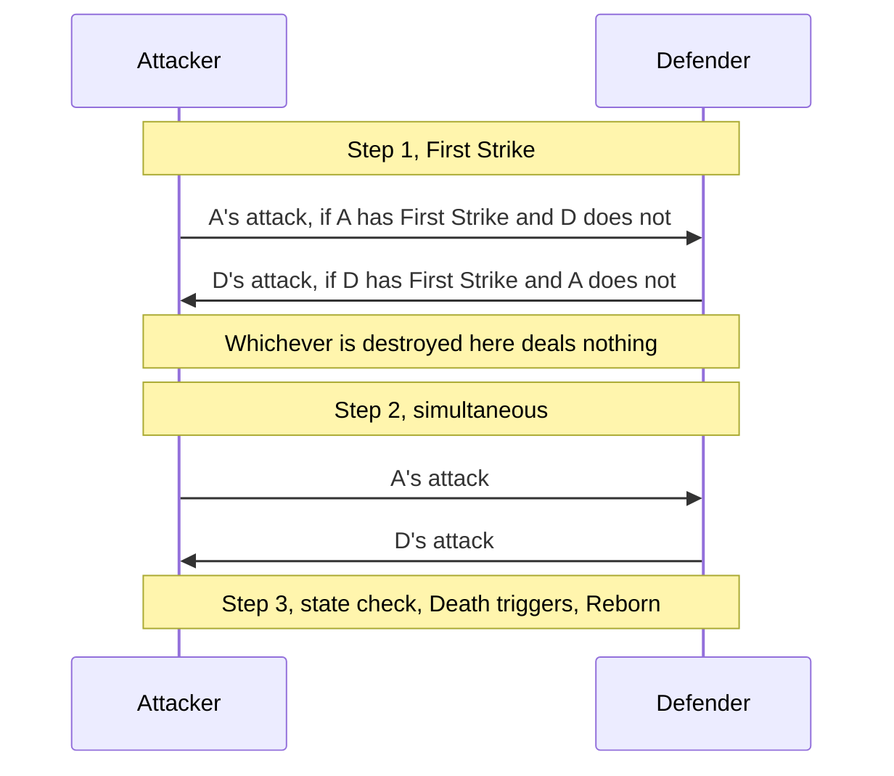
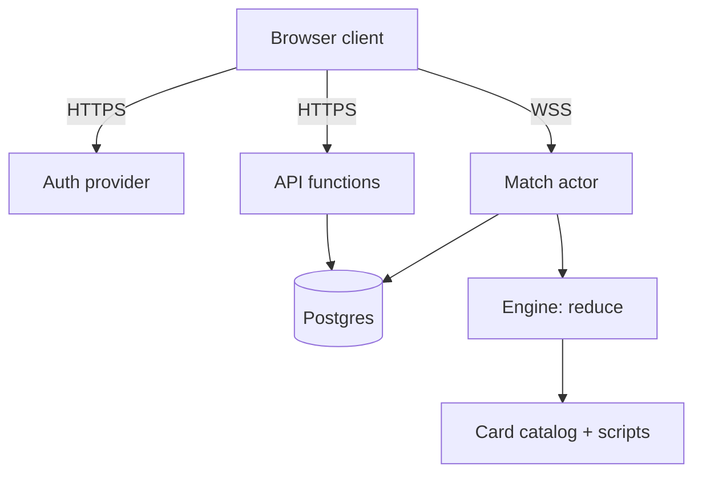
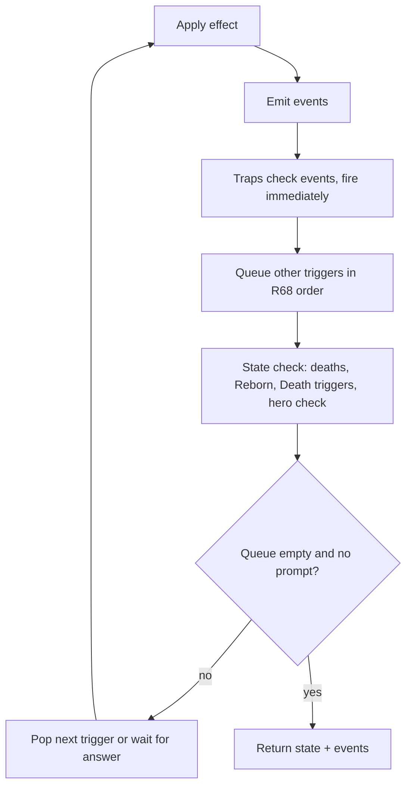

# JackiOh — Master Game Specification

2026-09-16, revision 5 of 2026-09-17, patch v0.2.0 of 2026-09-30 · @Someone

## 1. Overview

JackiOh is a 1v1 collectible card game: a Hearthstone-style mana curve, combat math and keyword vocabulary, played on Yu-Gi-Oh-style lanes with a hidden backrow of traps. This document is the complete specification: the rules, all 268 cards of the three sets (100 Core, 90 Classic, 78 Classic+) and their 49 tokens described by what they do to game state, and the architecture and engine they run on. Patch v0.2.0 (issue #40, R380 on) added Classic and Classic+.

Design pillars:

- Short, sharp games: 20-card decks with no duplicates, 4 max mana, 30 hero health, a 60-turn cap that is a backstop, fatigue being the usual end of a long game (§2.5).
- Two combat axes: Attack/Defense position (Defense = Taunt + Armor) layered over Hearthstone-style free-target attacking.
- Radiant: every card has an upgraded form, and upgrading cards mid-game is a core resource loop (the Glowy Jelly Bean family, Radiant Saintess, Gifted Program, Eugenics).
- Lanes matter: 5 shared lanes give adjacency (Cleave, Hit Job, Collateral Damage), rotation (Silly Silas) and per-lane traps (Zoomerbin Oomen).
- Chaos is a feature: coin flips, random keywords, Call to Chaos, Pocket Chaos, Transmogulate. All of it must run on a seeded RNG so any match replays exactly.

How to read this spec: sections 2 to 7 are the rules; 8 is the card catalog (mechanics, not flavor text), with each Core card's rarity assigned by mechanical complexity and each Classic and Classic+ card's rarity the designer's; 9 and 10 are the architecture and the engine design; 11 collects every ruling this spec makes where the source was silent or ambiguous, with the ones still open marked decide.

Source material: the original JackiOh design notes (a mechanics sheet, the Core card list and a CCG architecture document), and for Classic and Classic+ the designer's card list of 2026-09-30 (`JackiOh_Classic_Cards.md`, whose reading card by card is the design brief `docs/classic-sets.md`), referred to below as "the source". Wherever this spec goes beyond them it is marked **Ruling:** in place, and the same item appears in section 11 so it can be confirmed or overturned in one place. Card references read "#N" for Core, "C #N" for Classic and "C+ #N" for Classic+, and "T-AI-N" for the AI generated cards (§7).

## 2. Core systems

A game is two players with 30-health heroes and 20-card decks, alternating turns until a hero hits 0 or the turn cap ends it in a draw.

### 2.1 Setup

1. Both decks are shuffled with the match seed.
2. Player 1 draws 3, Player 2 draws 4 (the Nth player draws N+2, so the engine should treat this as a table, not two constants). Any Quickdraw card in a deck replaces one of these draws (section 6), so a player is dealt at most as many Quickdraw cards as they have draws, and the rest stay in the deck (**Ruling**, R640). A card that casts on draw is not dealt: it is set aside while the hands are dealt and mulliganed, and shuffled into the deck once the mulligan is done (**Ruling**, R635).
3. Mulligan: each player sees their opening hand, marks any subset to return, draws that many replacements from the top of the library, then the returned cards are shuffled back in. **Ruling:** replacements are drawn before the returned cards go back, which is what "without replacement" means in the source. Once both mulligans have resolved, each player's set-aside Cast on Draw cards are shuffled into their deck (R635); the first draw that can meet one is turn 1's. Both players mulligan at the same time (**Ruling**, Hearthstone convention): either may answer first, an answer is sealed until both are in, and the other player learns only that it is in; then both resolve, Player 1's first, so the game is the same whichever answered first (R265–R267). The mulligans share one clock, and a player whose clock runs out keeps their hand (R268). Once both players have answered, Player 2, who goes second, adds The Coin (§7) to their hand, so it is never part of the mulligan (**Ruling**, Hearthstone convention; R244).
4. Start-of-game effects resolve: every Heroic Power in either player's hand or library picks its random power, including one the mulligan returned (R43).
5. Player 1 takes the first turn and does draw on turn 1 (**Ruling**, Hearthstone convention).

### 2.2 Turn loop


```mermaid
flowchart LR
  A[Start of turn] --> A2[Board snapshot]
  A2 --> B[Refresh mana]
  B --> BT[Brittle tick]
  BT --> AN[Animated on your turn: animate]
  AN --> DE[Start-of-turn delayed effects]
  DE --> C[Start-of-turn triggers]
  C --> D[Draw 1]
  D --> E[Main phase]
  E --> F[End-of-turn triggers]
  F --> F2[End-of-turn trap window]
  F2 --> F3[End-of-turn delayed effects]
  F3 --> G[Cleanup]
  G --> G2[Animated on your turn: return]
  G2 --> H{Turn cap hit?}
  H -- no --> I[Opponent's turn]
  H -- yes --> J[Game is a draw]
```

This is the only turn sequence; §6.2 and §10.3 follow it (R62). The start of a turn first records a snapshot of the field for C+ #35 Rollback (R419), then refreshes mana; then every Brittle count of the active player's cards that is due drops by 1, and a card whose count reaches 0 crumbles (§6.1, R385); then the active player's "Animated on your turn" cards step from their backrow zones into unit zones (§6.1, R383); then start-of-turn delayed effects (K-Pop Fanatic's steal) resolve, then start-of-turn triggers in queue order (R68), then the draw, so start-of-turn triggers fire before the draw. At the end of the turn, end-of-turn triggers resolve first (Combo-Index and the "add this back to your hand" spells included); then the end-of-turn trap window, where the Field Traps that watch turn ends (Bread and Butter, Intern Stimmy) fire on both sides; then end-of-turn delayed effects (Recycling Initiative, /fullsend's exile, CN-Virus's copies, R350); then cleanup, which discards the active player's Temporary cards from their hand (R637) and whose last step returns the active player's animated "Animated on your turn" cards to their backrow zones (R383), so their own end-of-turn text has run while they were Units. Main-phase actions are: play a card (pay cost, pick modes and targets), attack with a unit, switch a unit's position, activate a card's ability (Activate, §6.2, R384, Heroic Power's power among them), offer or answer a draw, concede, end turn. Actions resolve one at a time; the engine never has two in flight. Cleanup expires every "this turn" effect (the Lunar Eclipse discount, /fullsend's modifiers, Professor Curvature's discount on its turn); Twinspell's pending Echo is not turn-scoped and survives cleanup.

### 2.3 Mana

- Max mana = min(number of turns you have started, 4), plus persistent modifiers. It refreshes to max at the start of your turn. Turn 1: 1 mana; turn 4 onward: 4.
- Temporary mana (Mana Well, Fed Fauci, Efficiency Dividend, Genn's Greed, Call to Chaos, The Coin) adds to current mana and can exceed 4. A Refresh (/fullsend) gives back spent mana instead and never takes current above max (R364). GIGA Glowy Jelly Bean costs 6 and is castable only after such gains.
- Hinder subtracts from the opponent's next refresh. Mana never goes below 0.
- X-cost cards: X is chosen at play time, 1 ≤ X ≤ current mana (`MIN_CHOSEN_X`, R348), and is stored on the played instance, so a card whose X the player chooses cannot be cast for X = 0, and with no mana it cannot be played at all. Heroic Power is the exception: its X is fixed by its power (R43). Cost modifiers never apply to an X-cost card (R65). On the field an X-cost card costs the X it was played for wherever a rule compares or counts costs, and 0 when it arrived without a chosen X (R396). A Unit may print its stats in X (C+ #69 Buff Billy's 3X/3X), which it is summoned with (`xStats`, §5). Embiggen cards offer two prices; the choice is stored the same way and drives the card's effect.
- Cost modifiers stack additively and floor at 0, in the order given by Cost in §6.3 (R65); a temporary modifier ("this turn", "next turn") is stored with an expiry turn number. A card may also carry a floor of its own (C+ #14 Forever&'s "can't cost less than (2)"), applied after every discount, and a rule may forbid a play outright ("can't be played"), which is checked last (R65).

### 2.4 Drawing, fatigue, hand size

- One draw at the start of every turn. A draw limit ("your opponent can't draw more than 1 card each turn", C #4 Palantir, C #49) caps a player's draws in one turn, whoever's turn it is, the start-of-turn draw included: a draw beyond it does not happen at all, so no card moves, no fatigue is taken and nothing is cast on draw, and a public `drawLimited` reports it (R457); with several limits on one player the lowest holds. Cast-on-draw cards resolve immediately and the draw repeats, which can chain (CN-Virus into CN-Virus). A cast-on-draw card is cast even when the hand is full, since it never enters the hand. Setup draws none: the opening draw and the mulligan's replacements skip them (R635). **Ruling (R58):** one draw casts at most `CAST_ON_DRAW_CHAIN_CAP` (20) cast-on-draw cards; the next cast-on-draw card drawn in that chain goes to the hand uncast (burned if the hand is full), which ends the chain. "Draw N" is N separate draws, each with its own chain, and "draw your whole library" draws the library size as it was when the effect started.
- Fatigue: the source names it but not its effect. **Ruling:** the Nth draw from an empty library deals N damage to your hero (Hearthstone). Infinite Reserves replaces each such draw with a Rush Token card. Each fatigue draw is reported by a `fatigue` event ahead of its hit, which both players see (R315).
- Hand size: unspecified. **Ruling:** 10. A card drawn or added to a full hand is sent to the graveyard ("burned"), and Call to Chaos's "draw your deck" respects this. Both players see which card burned (R317).
- Decks may exceed 20 during play (Unstable Clone Machine, CN-Virus, whose copies go in at the end of the turn it is cast on, R350); 20 is a deckbuilding limit only. **Ruling (R80):** a library holds at most `LIBRARY_CAP` (60) cards; a card that would be shuffled into a full library is not created, and an existing card goes to its owner's graveyard instead. Either way a `libraryOverflow` event reports the card the library turned away (R316).

### 2.5 Ending the game

| Condition | Result |
| --- | --- |
| A hero at 0 or less health at a state check | That player loses |
| Both heroes at 0 or less in the same check | Draw |
| Concede | That player loses |
| Disconnect grace period expires | That player loses (section 9.5) |
| Draw offered and accepted | Draw |
| End of the 60th turn | Draw ("auto-draw") |
| Hard match ceiling reached (120 minutes) | Draw (R79) |

**Ruling:** the cap counts player-turns, so 60 means 30 turns each (patch v0.2.0 doubled it from 30, R2, R389). It is a backstop rather than the usual end of a long game: one draw a turn empties a 20-card deck on the first player's 17th turn and the second player's 16th (3 or 4 opening cards, §2.4), and fatigue, N damage on the Nth empty draw, then kills a hero at 30 health on the eighth, so two decks that do nothing end by fatigue on the second player's 24th turn, player-turn 48. Only a game that heals, gains Armor, refills a deck (C #30 Recycle) or replaces fatigue (#75 Infinite Reserves) reaches the cap, and CN-Virus, C #60 Pile On, C #37 Last Hurrah, C #26 Rapid Draw and C #28 Second Wind bring fatigue sooner. The hard match ceiling is 120 minutes, since 60 player-turns at a full 75-second clock take 75 (R79). Draw offers: once per player per turn, and a declined offer blocks that player from offering again for 3 of their turns; both numbers are config values. An offer stands until it is answered or its offerer's turn ends, both players see it standing, and one that lapses unanswered blocks nothing (R269). If at any point in their main phase a player's only legal actions are ending the turn, conceding and draw offers, the turn auto-ends (R82). Only the active player offers a draw, during their main phase; the opponent answers it (R36). When the active player's turn clock runs out, their open prompts are answered by the AI policy and the turn ends. A prompt held by the non-active player has its own clock, which on expiry answers only that prompt (R79).

### 2.6 Deckbuilding

Exactly 20 cards, no duplicate card ids, no Token-tagged cards. There is one format: a deck may mix Core, Classic and Classic+ cards under these rules, and nothing is set-restricted (R380). The three decks of a trio, which Conquest plays (section 9.5), share no card (section 9.4), so a trio needs 60 distinct cards, now from 268 non-token cards. A saved deck may be incomplete while it is being built; these rules are checked when it is queued (R250, R253).

## 3. Zones and board layout

Each player owns a hand, a library, a graveyard, an exile pile, a hero, 5 unit zones and 5 backrow zones; a lane is a column of four zones, two yours and two the opponent's.

| Zone | Holds | Visible to | Ordering | Engine notes |
| --- | --- | --- | --- | --- |
| Hand | Any card | Owner | Index order for triggers (R68); random picks are uniform | Cap 10 (ruling) |
| Library | Any card | The order: nobody. The contents: its owner, as a list without order of the cards they were shown going in, so a dealt deck's starting cards stay unknown until they leave it (R310–R312, R433); the count is public | Top to bottom | Recruit scans top down; "bottom card" = last |
| Graveyard (GY) | Cards that were destroyed, discarded or resolved, except unit tokens (R11) | Both | Chronological | Unit tokens never enter it; spell tokens do |
| Exile | Exiled cards | Both | Chronological | Count feeds Echoes of the Forgotten and Spiteful Stab |
| Unit zone x5 | Units, or a Stack pile | Both | Lane 1 to 5, left to right from the owner's seat | Lock flag per zone |
| Backrow zone x5 | Field Spells, Traps, Field Traps, or a backrow pile (§3.2) | Field Spells: both; Traps: the controller only, and the other player sees a face-down card and its cost even if they own it (R33, R351) | Lane 1 to 5 | Lock flag per zone; traps hidden until they fire |
| Hero | Health, hero armor, Heroic Power | Both |  | Health has no upper cap |

### 3.1 Lanes and adjacency

Your lane N faces the opponent's lane N. "This lane" (Zoomerbin Oomen) means the backrow zone in the same column as the unit. Adjacent means index N-1 and N+1 on the same side and same row: Cleave hits the units beside the target, radiant Hit Job destroys the units beside the target, radiant Collateral Damage exiles the permanents beside the target in its row.

**Ruling:** attacks are not lane-restricted. Any unit may attack any enemy unit or the enemy hero, subject to Taunt. Lanes only matter for adjacency, lane-targeted summons, Silly Silas's rotation, and the cards that restrict who may attack them (C+ #19.1 Top Loser: only Units in its lane, §4.2); `LANE_RESTRICTED_ATTACKS` stays false (R5).

**Ruling (rotation topology):** for Silly Silas the ten unit zones form a ring: your lane 1 to 5, then the opponent's lane 5 down to 1, and back to your lane 1; the backrow forms a second ring the same way. "Rotate right" moves every card one step around its ring, so your lane-5 card becomes the opponent's lane-5 card and changes control. Both rings rotate together.

### 3.2 Zone rules

- A summon with no named zone goes to the leftmost empty, unlocked zone of the right row (R64). A summon into a full row fails silently and the effect that summoned it continues. A summon aimed at a specific zone ("this lane", Reborn's original zone) fails if that zone is occupied or Locked. A zone reserved for a dying Reborn unit (§4.5), or held for an animated card's return to its backrow zone (below, R383), counts as occupied for every other card that would enter it.
- Playing a Unit, Field Spell or Trap from hand requires an empty, unlocked zone in the right row; the player picks the zone. **Ruling:** a zone the play's own Tribute empties counts (R391): a unit zone whose pile is exactly one tributed unit, which has no Reborn (its zone would be reserved for the return, R64), and which is not Locked. Tributing the top of a pile frees nothing, since the card beneath resumes (R13). The Tribute is paid at §10.5 step 2 and the card placed at step 4, so only the validator reads the zone as open; the same holds for a backrow card with a Tribute cost, and never for an activation cost, which needs no zone.
- Lock: the zone accepts no summons until the game ends or an Unlock opens it again (§6.3). The current occupant is unaffected and the lock persists after it leaves.
- Stack: a Stack card may be played onto an occupied zone of the right row, in the unit row or the backrow. The zone becomes an ordered pile whose top card is the only active one: it attacks, is targeted, and projects auras. Cards underneath are dormant: not "on the field" for effects, not targetable, keep their damage; in a backrow pile a face-down trap under the top cannot fire and an aura under it is off. When the top card leaves, the next card resumes. **Ruling:** Felinor Fiender's "including those under a Stack" is the one exception where dormant cards count (R13). C+ #33 Ivory Tower is the one backrow pile a Unit may top (R418, R446). Both seats see a backrow pile's count, never what lies beneath (R447).
- Animated (§6.1, R383): an Animated Field Spell, Trap or Field Trap prints attack and health and steps from its backrow zone into a unit zone of its controller when it animates — the unit zone in its own lane when that is open, else the leftmost open, unlocked, unreserved one (R64). That move, and an "Animated on your turn" card's return to its backrow zone at cleanup, is not leaving the field: it keeps damage, buffs, counters, memory and granted keywords (R78 does not apply), and entering the unit zone is entering it on that turn (R83, R171), so it is summoning sick. While it is a Unit it is a Unit for every rule; in the backrow it is not.
- Unit tokens cease to exist when they leave the field for any reason (bounce, destroy, exile, transform), so "Bounce all units" clears them; a unit-token card in hand or library (Infinite Reserves, or a copy made by Unstable Clone Machine, Recycling Initiative or Combo-Index) ceases to exist if it leaves that zone other than by being drawn or played, burning included (R11). Spell tokens (section 7) behave as ordinary hand and library cards. Sheep Tokens are worth 2 Tributes while on the field, and a Radiant one is worth 3 (section 7), so the value is read off the face that is up rather than off the definition.
- Control vs ownership: Steal and rotation change the controller of a card on the field. Off the field a card always goes to its owner's hand, library, graveyard or exile. Two effects change owners: Pocket Chaos's library swap (R73), and a steal off the field — a Spell taken as it is cast, or a card taken from a hand or a deck, whose owner becomes the thief (§6.3 Steal, R12). **Ruling:** a stolen unit that dies goes to its owner's graveyard.
- Backrow cards go to the owner's graveyard when their effect ends (Twinspell after it fires, traps after firing unless Field Trap).

## 4. Combat

A unit has Attack, Max Health and Damage; current health = max health minus damage, and a unit at 0 or less is destroyed at the next state check. Damage stays on a unit between turns: no phase and no cleanup step clears it, and only a heal (§6.3) or leaving the field (R78) takes it off.

### 4.1 Positions and exertion

- Units enter in Attack Position. Defense Position grants Taunt and Armor +1, stacking with printed Armor and Big D-fender's aura. An Indestructible unit never has Taunt, so in Defense Position it gets only the Armor (R347).
- Each unit has one exertion per turn: one attack or one position switch. Deft Duelist may do both. A unit with Windfury may attack twice (R636), and its first attack spends the exertion a switch needs.
- **Ruling:** only Attack-Position units may attack. A unit that switched to Attack this turn has spent its exertion and cannot attack (except Deft Duelist).
- Summoning sickness: a unit cannot attack the turn it entered the field. Rush lifts this for unit targets only; Charge lifts it for units and the hero. A sick unit may still switch to Defense. A unit that enters the field again, a Reborn body included, entered it on that turn like any other (R83). A unit whose controller changes (stolen, swapped with the board, or rotated across the centre line) has entered its new controller's side on that turn: it is summoning sick in exactly the same way, and its exertion is fresh for its new controller. A unit that only moves between lanes on its own side has not entered anything (R171).
- **Ruling:** a unit with 0 attack cannot declare an attack; it still deals 0 back when attacked. Spikey Pillow cannot be switched to Defense, nor can any unit whose text says "Cannot be in Defense Position" (C+ #19.1, C+ #48, C+ #51).
- A unit whose text lets it attack again (C+ #73.1 Classic Golem's transformed Unit after a kill) has a fresh exertion for that turn and is not summoning sick for it; nothing else gives a unit a second attack.

### 4.2 Declaring an attack

1. Choose an attacker that can attack (exertion unspent, Attack Position, not sick or has Rush/Charge, attack above 0, no "can't attack", not "can't attack or be attacked").
2. Choose a target: an enemy unit, or the enemy hero (not with Rush on the summon turn). The target's restrictions hold here (§6.1): a unit that "can't be attacked" (C+ #51) or "can't attack or be attacked" is never a target, and one that "only Units in this lane can attack" (C+ #19.1 Top Loser) is a target only for an attacker in the enemy unit zone of its own lane. Immune to Spells is no restriction on attacks.
3. Taunt check: if any enemy unit has Taunt (printed, granted, or from Defense Position; never an Indestructible unit, R347), the target must be one of them. Only a Taunt the attacker may legally attack under step 2 binds it.
4. Declaring the attack has now spent the attacker's exertion, before any damage. Trap window: My Pawn checks whether the hit would be lethal and, if so, cancels the attack; the exertion is not given back, so the attack is gone either way (R44).
5. Resolve combat, then run the state check.

Forced attacks (Moths to the Flame, Bear Honeypot) skip steps 1 to 3: the named units attack the named target in lane order, regardless of position or sickness, without spending their exertion, and stop when the target is gone. Each forced attack is a separate combat followed by its own state check (R53). A forced attack still obeys step 2's restrictions: one on a target its attacker may not attack does not happen, and a forced attack on "a random enemy" (C+ #19.2 Jungle Loser) is drawn from the targets its attacker may attack. A forced attack may be made on the attacker's own hero (C+ #19.5 Bot Loser while Berserk); a hero never strikes back.

### 4.3 Combat resolution


```mermaid
sequenceDiagram
  participant A as Attacker
  participant D as Defender
  Note over A,D: Step 1, First Strike
  A->>D: A's attack, if A has First Strike and D does not
  D->>A: D's attack, if D has First Strike and A does not
  Note over A,D: Whichever is destroyed here deals nothing
  Note over A,D: Step 2, simultaneous
  A->>D: A's attack
  D->>A: D's attack
  Note over A,D: Step 3, state check, Death triggers, Reborn
```

First Strike moves **that unit's** strike into step 1, on whichever side of the combat it is: an attacker with it hits a defender without it before that defender answers, and a defender with it hits an attacker without it before that attacker's blow lands. Either way the unit that struck in step 1 takes nothing back if its target falls there — §6.1's "deals damage before non-First-Strike units", stated as a sequence. Both units with First Strike strike simultaneously in step 1. When the defender is a hero, only the attacker deals damage. A defender in Defense Position still strikes back with its full attack.

### 4.4 One damage instance

Every point of damage in the game (combat, Cry, spell, end-of-turn, fatigue) goes through this pipeline, in this order. A hit whose amount is 0 before step 0, such as a 0-attack unit striking back, is not a damage instance: nothing happens and Divine Shield stays (R63).

0. Spell Damage: if the source is a Spell (the Spell type, not a Field Spell or a Trap), add the Spell Damage of every unit on its controller's side (Spell Damage +X, §6.1; C+ #38 Solarius, C+ #38.1). It raises each hit the Spell deals, a split one's included, and not the hits its Units or the cards it summons deal.
1. Divine Shield: if the target has it, negate the whole hit and remove the shield. Stop.
2. Armor: subtract the target's total Armor (printed + Defense +1 + auras; hero uses Going Long's value). A source with Pierce skips this, on a unit and on a hero alike: a unit's Pierce through the layers, a spell's printed on its face (True Strike, R346). Floor at 0. Then, on a hero, its damage multipliers: an aura that halves or quarters the damage its controller's hero takes (C #75 Argusland) divides the amount, rounded up, and several multiply.
3. Hit cap: the lowest cap on the target holds — a hero with Anti-oneshot Armor clamps to 5 (radiant 3), and C+ #11 Anime Armor's hero to 1.
4. Indestructible: takes no damage; stop.
4a. Lethal replacement: if the target is a hero and this hit alone would leave it at 0 or less — the amount after steps 0 to 3, judged as My Pawn judges an attack (R44) — a replacement that watches for lethal damage (§6.2 Replacement; C #52 Final Gambit) acts here, before anything is dealt, and may re-aim the hit (§6.3 Redirect). Fatigue is damage and counts; losing health (R18) is not damage and never opens it.
5. Apply damage; emit `damage` with source, target and amount dealt. The amount dealt is not capped at the target's health, except that a Trample source's damage to a unit counts only up to that unit's health, the rest being the step 9 instance (R63).
6. On-damage triggers (Fed Fauci gains a Plague Token, Corpse Eater does not, that is a GY trigger).
7. Poisonous: if the source is a unit with Poisonous, the target is a unit, and 1 or more was dealt, mark the target destroyed.
8. Lifesteal: if the source has Lifesteal, or the effect stated that its own damage has Lifesteal (R85), heal the source's controller's hero by the amount dealt.
9. Trample: if the source is a unit with Trample, or a Spell that prints it (C #83 Flame Lance, read off its face as a spell's Pierce is, R346), and the target is a unit, the amount dealt beyond the target's health before this hit goes to the target's controller's hero as a new damage instance. This applies to any damage the unit deals, not only combat (R63).
10. Cleave (combat only): if the attacker has Cleave, deal its attack to each unit adjacent to the target as separate instances.

If the amount is 0 after step 3, the hit stops there: no `damage` event and none of steps 5 to 9, so Fed Fauci gains no Plague Token. The one exception is a fatigue draw whose hit Armor takes whole: the draw still happened, so it is reported by a `damage` event of 0 from no source, which nothing answers (R240). Cleave belongs to the attack rather than to the hit, so it still happens when step 1, step 4 or this zero rule stopped the hit on the defender (R63).

### 4.5 Deaths and the state check

The check runs after every resolved action, every fully resolved effect or trigger (a card's whole Cry, spell, trap or triggered script, or one cast-on-draw cast), and every combat (Trample and Cleave hits included; each forced attack is its own combat, R53). It never runs between the damage instances of a single effect, so every hit of Jlockeed Shredder lands before anything dies (R59); the one card that repeats an effect list with a check after each round is C+ #32.3 Blade Storm (R59).

1. Collect units with health 0 or less or marked destroyed, and backrow cards marked destroyed. Before anything moves, a replacement that watches for a death (§6.2 Replacement: "would die", C #14 Shadowstep's Radiant face) acts on the units it names, which then leave the collection. Move the rest to their owners' graveyards at once (tokens vanish), each through any "would go to a graveyard" replacement (§6.2). A collected unit with Reborn reserves its zone until step 4 (R64). Indestructible units take no damage and ignore destroy marks; a marked Indestructible unit instead switches to Attack Position and loses Taunt until end of turn (R46). An Indestructible unit whose max health is 0 or less (Suppressive Aura) is collected like any other unit; one at 0 or less health whose max health is still above 0 stays (R69).
2. Check heroes: 0 or less health ends the game (both = draw).
3. Fire Death triggers of the collected units in R68 order, a backrow card's included: a Field Spell, Trap or Field Trap that prints Death fires it when it goes from its backrow zone to a graveyard, as a Unit's does (C+ #12.8 Frostspatula); each reads its unit's last-known state from just before it left (R78); every other trigger reads the `destroyed` event instead, which carries what the unit was as it died (R89).
4. Reborn: each collected unit that had Reborn returns to its reserved zone (unless the zone was Locked meanwhile) at 1 health without Reborn, as a reset instance (R78); its Cry does not fire, and because it has entered the field again it is summoning sick for the rest of that turn (R83).
5. Repeat until nothing changes, and at most `STATE_CHECK_PASS_CAP` (100) times. A check still finding work on the hundredth pass is an engine bug rather than a game state, so the engine throws there instead of returning a state no rule produced.

**Ruling:** Death triggers fire on both deaths of a Reborn unit, so radiant Right-house defender summons a base copy on its first death and again on its second.

## 5. Card anatomy and card types

A card is a definition in the catalog plus an instance in a game; the definition carries both the base form and the Radiant form, and the instance carries a `radiant` flag.

Every card carries the fields below; the catalog stores the base and Radiant forms under one id, and the Radiant form always has the same cost.

| Field | Values | Catalog field |
| --- | --- | --- |
| Cost | 0 to 6, 10 (C+ #64 Mulch Muncher), 100 (Ceaseless Void), X, or "A embiggen B" | `cost: number or 'X' or {base, embiggen}` |
| Type | Unit, Spell, Field Spell, Trap, Field Trap; a face may carry its own type, which is the card's while that face is up (C+ #22 Blood Moon's Radiant face is a Field Trap, §5.2) | `type`, `base.type?`, `radiant.type?` |
| Tribes and tags | Human, Felinor, KY, CN, Fruit, Call to Chaos, Quickdraw, Jlockeed, Book, Pancake, AI, Token (Jlockeed: R278; Book on every "Book of …" card, Pancake on C+ #12, #13 and the eight Pancake tokens, AI on the ten AI generated cards) | `tags: string[]` |
| Rarity | Common, Rare, Epic, Legendary, Mythic; Token for every token. A Classic+ token may print a rarity on its frame, a display field for the card frame and the summon sting that no pool ever reads | `rarity`, `printedRarity?` |
| Set | Core, Classic, Classic+ (Boss, Boss-X reserved) | `set` |
| Id | `core-043`, `classic-043`, `classicplus-043`; a token a card defines `core-051-1`, `classicplus-012-1`; a shared token `core-t-rush`, `classicplus-t-ai-01` … `-10`. The set part has no hyphen inside it, so an id splits one way | `id` |
| Index | 1 to 100 in Core, 1 to 90 in Classic, 1 to 78 in Classic+; tokens N.1 (Core) or N.k (Classic+, C+ #12.1–#12.8) when card N defines them, T-name when shared (Rush, Sheep, Felinor, Bread), dealt by a rule (Coin), a card of its own (Ghoul, R353), or made by two cards (T-AI-1 … T-AI-10). An index is unique only within its set, so every lookup by index names the set, `(set, index)`, or uses the id | `index: string` |
| Stats | Attack/Health, base and radiant; a Unit may print them in X (C+ #69 Buff Billy's 3X/3X), summoned with the X it was played for through `statsOverride`, X at least 1 (R348); an Animated Field Spell, Trap or Field Trap prints the stats of its unit face (R383) | `base.stats`, `radiant.stats`, `base.xStats?`, `radiant.xStats?` |
| Text | keywords + scripted effects, base and radiant; a number Degrade, Upgrade or C+ #41 KY's Constant may tune is written `{key}`, or `{key|singular|plural}` for a count and the words that agree with it, and declared in `params` (R386, R482); a client prints a face's text only through `fillParams`, which fills it from the printed or the instance's current values | `base.script`, `radiant.script` |
| Tunable numbers | `{ key, base, radiant, better: "up" or "down", step?, min?, max? }` per number; the view carries each instance's current value and a script reads `param(ctx, key)`; the ten AI generated cards declare none, their numbers being printed (R386, R482) | `params?` |
| Lines of code | the non-blank, non-comment lines of the card's script file, imports excluded, computed by a generator in `packages/cards/scripts/` and held current by a test; a fused card's is its ingredients' sum. It is public (the inspect overlay prints it), C #48 Hired Shrimp and C+ #44, #45 read it, and it is part of the card's patch history (R388), so a refactor that moves it is a balance change | `loc` |

### 5.1 Types

- Unit: a permanent in a unit zone with stats; does combat.
- Spell: one-shot. Resolves, then goes to the graveyard, or to exile when it says "exile this". Spells with "End of turn: add this back to your hand" are flagged `returnToHandAtEndOfTurn` when played and return from the graveyard at the end of that turn, as graveyard triggers (R68).
- Field Spell: a permanent in the backrow with a lasting effect. May have a Cry (Anti-oneshot Armor), start/end-of-turn triggers, or an activated ability (Heroic Power, and any Activate, §6.2). A Field Spell's unlabelled one-time text is its Cry, after which it stays in the backrow with no further text (C+ #12.6, #12.7, R408). An Animated Field Spell animates as it enters the field (§6.1, R383).
- Trap: paid for and placed face-down in the backrow. Fires automatically the moment its condition is met, on either player's turn, then goes to the graveyard — unless it is Animated, when it animates as the last step of its firing and, with no open unit zone, stays face-up in its zone as a Field Trap does (R383). Only its controller sees its identity before it fires; the other player sees a face-down card and its cost, even if they own it (R33, R351).
- Field Trap: a Trap that stays after firing and can fire again.
- Permanent = anything occupying a unit or backrow zone.
- Token: generated only when a card names it, or a rule does (The Coin, §2.1). Random pools ("a random card", "Discover a (2) Cost card") never include Token-tagged cards, with two exceptions the designer wrote (R382): a Fruit pool is the non-token Fruit cards plus the five Grapes (C+ #65.1–#65.5), which any Fruit card may generate, and C+ #23 Dropshipping's pool "(including tokens)" takes every token of every set.
- Pools reach every set (R380): a pool whose card does not name a set draws from Core, Classic and Classic+ alike, Hearthstone's reading of "a random card". A card that names a set keeps to it: #82 KY's Trial and #97 Zephyrs stay Core, and C+ #27, #73, #73.1 and #75.1 name Classic or Classic+.
- A card never generates itself (R387): every way a card makes a card from a pool — added to a hand, shuffled in, summoned, Discovered, cast, transformed into, fused in, or put in another card's place — excludes the generating card's own definition, by its id (indices repeat across sets), and a fused card excludes each of its ingredients' definitions. The one exception is a card that names a pool holding itself: Call to Chaos's "cast a random Call to Chaos" draws from the Call to Chaos tag, which holds #95 and C+ #73 alike, and C+ #73's deck replacement names the same pool. A copy is not generation: "summon a copy of this unit" (#12), "fill your board with copies of this" (C+ #46.1), Echo repeats and C+ #14 Forever& are unaffected.

Rarity, tribe and set are pure filter tags. The catalog needs one query function, `catalog.query({type, cost, costRange, tags, notTags, rarity, set, excludeDefId, withTokens})`, that every random-generation and Discover effect uses: `set` absent is every set (R380), `excludeDefId` is R387's self-exclusion by id, and `withTokens` lets tokens into the pool (C+ #23's, R382). Nothing looks a card up by index alone: an index lookup names its set, `defByIndex(set, index)`.

### 5.2 Radiant

The source defines Radiant only as "upgraded versions of normal cards". Rulings that make it implementable (R74):

- Radiant is a boolean on an instance, never a separate card id. Making a card Radiant sets it; nothing in any set un-sets it.
- In hand or library: cost unchanged, stats and text swap to the radiant form, and a face with its own type swaps the card's type with it: a C+ #22 Blood Moon made Radiant in hand is a Field Trap there, which pools and filters then read.
- On the field (Radiant Saintess, Knockoff Temu Glowy Jelly Bean, radiant GIGA Glowy Jelly Bean, Snom Bunny Mind Control, radiant K-Pop Fanatic's steal): the base-stat layer swaps immediately, damage taken and buffs are kept, newly gained keywords apply at once, ongoing triggers use the radiant text from then on, and Cry does not re-fire.
- A copy of a Radiant card is Radiant. A card an effect generates "Radiant" is Radiant. Tokens can be Radiant (Radiant CN-Virus, Radiant Reminisce).
- Every card has a Radiant face, so making any card Radiant changes it (R276). The five the source left without one (Quickstriker, Zao Gao, Combo-Fodder, Chaos Golem and My Pawn) were given one by the Radiant pass of 2026-09-24, and the unit tokens have theirs in §7. The Classic and Classic+ cards whose source faces were identical or missing were given one by patch v0.2.0 (C #63 Crop Dusting, C #86 Genn, C+ #63 Fruit Tree, C+ #75 J-lease J-Jungle EX-plorer), as `docs/radiant-audit.md` records.
- A Unit that prints no Radiant form of its own (the Ghoul Token, §7) is, made Radiant, its base face with its attack and health doubled: the same keywords and text, and a summon's X/X doubled with it (R349). The catalog marks such a card `radiantFallback` and prints that fallback as its Radiant face. A fused or crafted card is not one of these: R77 builds its Radiant form from its ingredients' Radiant forms, an ingredient without one lending its fallback.
- A Radiant face is about twice its base face (R275): a Unit's attack and health are each at least double its base face's, and its effect is 100–150% stronger — 2 to 2.5 times the amount, a broader scope (one target to all, one side to a choice), or an added rider or keyword; a Spell, Field Spell, Trap or Field Trap scales its effect the same way and may add a draw or a tangential rider instead. `docs/radiant-audit.md` records every card against it, and names the few Classic and Classic+ faces where the designer's word stands against the standard (R275).
- A Radiant face prints its whole text, §8's Radiant cell read by §8's Conventions and written out (the catalog's `radiant.text`), and a client marks the words that differ from the base face's text (§10.10, R277).

### 5.3 Catalog data decisions

Places where the source card list was inconsistent, with the value the catalog uses; section 11 records them together as R75, and #94's reading as R26.

| Card | Issue in source | Catalog value used here |
| --- | --- | --- |
| #2 Bigot | No set listed | Core |
| #15 Me and Mr Token, #16 Hit Job | Radiant separator is `~~` | Treated as `~~~` |
| #12, #31, #51 | Header typos: tag "Felinors", name "KY’s, …" | Tag Felinor; names as in section 8 |
| #68 Twisted Sorcerer | Listed as "Spell, Unit" with stats | Unit |
| #90.1 | Named "CN-Viral Injection" like #90 | Named CN-Virus |
| #94 Genn's Greed | "exile all cost cards" is garbled | Exile every card with an odd Cost (Genn Greymane reference) |
| #29 GIGA Glowy Jelly Bean | Cost 6 exceeds max mana 4 | Kept at 6; only castable with mana gain |
| #15, #34, #66, #86, #99, #100 | No card type in the header | Unit, Spell, Unit, Unit, Spell, Unit, from stats and text |

Classic and Classic+ (patch v0.2.0) have their own, recorded under R381 (names) and the rows cited:

| Card | Issue in source | Catalog value used here |
| --- | --- | --- |
| Classic+ #11, #25, #28, #42 (second of each), #47, #75 (second) | Five numbers used twice, and two tokens numbered as cards (#47, and #75's second, R381) | Jogg's Box C+ #47, Brother Lar C+ #76 and Brother Ping C+ #76.1, Anti-Softlock C+ #77, Claude's Datacenter C+ #78, Felinor Flagbearer Prime C+ #46.1, the J-lease Pack C+ #75.1: the first card under a number keeps it (§8.7) |
| C #16, C #55 | Two cards named Book of Flame, one text | C #16 is Book of Flame, the one C #23 and C #29 name; C #55 is **Book of Wildfire**, a distinct name so nothing names it by accident (R381) |
| C #17, C #72 | Two cards named Counterspell | C #72 is **Grand Counterspell** (R381) |
| C #10 Exile, C #36 Burn, C #57 Echo, C #30 Recycle | Names that are also rules words | Kept; R279's proof treats a rules word as a reference only where `refs` lists the card (R381) |
| C+ #48, #51, #52 | "Jlockheed", where Core's #13 and #14 are "Jlockeed" | Names as the designer spelled them; one tag, `Jlockeed`, on all five (R278) |
| C #78 Mutate Spell, C+ #60 Doctors Orders, C+ #74 Twice Forward One Step Backwards | Typed Spell, "Unit, Spell" and Trap | Field Spell (R402), Field Spell (R421), Field Trap (R425), as Core #68's type was settled |
| C+ #12.6 Frozen Wastes, C+ #12.7 Legion of the Hungry | Field Spells whose text has no label | The text is a Cry (R408) |
| C #69 Plague Charger | Radiant separator is `~~` | Treated as `~~~` |
| C #70 Book of Plague | Tag written "book" | Book |
| C #67 Felinor Feeler, C #32 Felinor Feelings, C+ #39 Book Worm, C+ #60, C+ #64 Mulch Muncher | Tags that look unintended (a Human "Felinor Feeler", no Book or Fruit tag) | Kept as written |
| C #1, C #7, C #63, C #86, C+ #17, C+ #63, C+ #66, C+ #75 | A Radiant face that drops a clause, is missing, repeats the base face, or copies another card (C+ #17's base face too, which repeated C+ #16's: 6 keywords on both faces) | The faces §8.6 and §8.7 print (the audit's reasons, `docs/radiant-audit.md`) |
| C #23 "are this turn", C #36 "at 4", C #42 "a 2", C #68 "cost can't", C #78, C #81 and C #84 "Active", C #90 "work of stats", C+ #11 "Year", C+ #12.3 "deck Deck", C+ #14 "Then next", C+ #17 "Conjure Tush Token++", C+ #41 "number number", C+ #65 and C+ #66 "Graphes" and "roles", C+ #73.1 "Firststrike" | Typos | Read as meant: "this turn", "4", "2", "can't", Activate, "worth of stats", "Your", "deck", "The next", Conjure Rush Token++, "a number", Grapes and "rolls", First Strike |

## 6. Keyword glossary

Every keyword below maps to one engine primitive; a card script only ever composes these primitives.

Players read two of this spec's words differently (v0.1.1, R373): the rules' library is shown to players as the Deck, and Sacrifice as Tribute. The rules, the engine's identifiers and this spec keep "library" and "Sacrifice".

### 6.1 Unit keywords (computed as a set per unit)

Animated, Brittle and Temporary are printed on, or given to, cards that are not Units as well; their rows say how. The Cards column names Core cards as #N and the new sets' as C #N and C+ #N; for a keyword Core already had, it lists the Core cards, and §8.6 and §8.7 show which Classic and Classic+ cards print it.

| Keyword | Rule | Engine semantics | Cards |
| --- | --- | --- | --- |
| Taunt | Enemies must attack Taunt units first | Attack-target validator; Defense Position adds it; an Indestructible unit never has it, whatever grants it (R347) | #19, #55, #56, all units in Defense |
| Armor X | Reduce each damage instance by X | Pipeline step 2; stacks (printed + Defense 1 + auras); "Armor 1" when unnumbered | #1 aura, #9r, #25, #45r, #84 (hero) |
| Rush | May attack units, not heroes, on summon turn | Sickness exemption for unit targets | #11, #14, #32, #56, #86r, #89, #91, Rush Token, Felinor Token r, Chaos Golem |
| Charge | May attack units and heroes on summon turn | Full sickness exemption | #11r, #45, #95.1r, #100r |
| First Strike | Deals damage before non-First-Strike units | Combat step 1 | #11, #14, #20, Chaos Golem |
| Poisonous | Destroys any unit it damages | Pipeline step 7 | Random-keyword pool only |
| Lifesteal | Damage dealt heals your hero | Pipeline step 8; also on spells (#93 A, Combo-Fodder) | #56, #93, #93.1, Chaos Golem |
| Reborn | First death: return at 1 health without Reborn | State check step 4 | #3, #25r, #56r |
| Divine Shield | Negate the first damage instance, then lose it | Pipeline step 1 | #3, #20r, #50r, #56, #89r, Chaos Golem |
| Trample | Excess damage hits the hero | Pipeline step 9; any damage the unit deals (R63) | Random-keyword pool only |
| Cleave | Also damages units adjacent to the target | Pipeline step 10, combat only, belongs to the attack (R63) | #32r, Rush Token r |
| Pierce | Its damage ignores Armor | Pipeline step 2 skipped for each of its hits, on a unit or a hero; a unit's keyword read through the layers, or a spell's printed on its face (R346) | #44, Ghoul Token, random-keyword pool |
| Indestructible | Can't be destroyed or damaged; can be exiled or sacrificed | Pipeline step 4; state check skips it unless its max health is 0 or less (R69); on would-destroy: Attack Position, lose Taunt this turn (R46); while Indestructible it has no Taunt to lose (R347) | #66, #98 |
| Immutable | Text can't be changed or transformed | Blocks Transform, Vanilla, Fuse-onto, Degrade and Upgrade (R23, R386), Silence-like effects; Radiant still allowed (it is the card's own text) | #19r, #66r |
| Stack | May be played onto an occupied zone | Zone becomes a pile; only the top is active (section 3.2) | #92 |
| Lucky X | Repeat a luck-based roll X extra times, keep the best | RNG helper `lucky(x, roll, better)` with a per-effect comparator | #23r, #42r |
| Can't attack | Cannot declare attacks | Attack validator flag | #86 |
| Cannot be in Defense Position | Never switches to Defense | Position validator flag, as Spikey Pillow's (§4.1) | #65.1, C+ #19.1, C+ #48, C+ #51 |
| Can't be attacked | No attack may target it | §4.2 step 2, forced attacks included; still targeted by effects and hit by "all" effects | C+ #51 |
| Only Units in this lane can attack this | An attack on it is legal only from the enemy unit zone of its own lane | §4.2 step 2, forced attacks included; its Taunt binds only the attackers that may legally attack it (§4.2 step 3) | C+ #19.1 |
| Can't attack or be attacked | Neither declares nor receives an attack | §4.2 steps 1 and 2, forced attacks included | C+ #33's carried Unit |
| Immune to Spells | Spells can't target it or affect it | A Spell's target validator and every Spell's effect list skip it (§10.5 step 1, R81); Field Spells, Traps and Units still reach it, and it is no restriction on attacks (§4.2) | C+ #19.1 radiant |
| Berserk | While Berserk, at the start and end of its controller's turn this attacks its own hero | A flag on the instance, set by an effect (C+ #19.2), lost when the unit leaves the field (R78); the attacks are forced (R53) on its controller's hero, which never strikes back; "This can't go Berserk" makes the flag never set (R412) | C+ #19.2, C+ #19.5 |
| Spell Damage X | Your Spells deal X more damage per hit | §4.4 step 0: each hit of a Spell (not a Field Spell or a Trap) its controller casts is raised by the sum of the Spell Damage on that player's side; printed "Spell Damage +X"; a numbered keyword Degrade and Upgrade move (§6.3) | C+ #38, C+ #38.1 |
| A keyword while a condition holds | "Has First Strike while it has a Plague Token" | The keyword is in §10.4's set exactly while the condition is true, read on every read like an aura | C #69 |
| Animated | A Field Spell or Trap that becomes a Unit in an open unit zone when it fires or enters the field | Printed with attack and health, which do nothing in the backrow. To animate is §3.2's move from its backrow zone to a unit zone of its controller (its own lane's when open, else R64's leftmost open, unlocked, unreserved one), in Attack Position unless its text says otherwise (C #5 Tesla: Defense); with no open unit zone it does not animate and stays, a fired Trap staying face-up as a Field Trap does. An Animated Trap or Field Trap animates as the last step of its firing, and one already a Unit when it fires again stays where it is; an Animated Field Spell animates as it enters the field. While animated it is a Unit for every rule (it attacks and is attacked, counts among your Units, is hit by "all Units", fires Death when it dies, and is no Field Spell, Trap or backrow card to an effect that counts or hits those) and keeps all its text (a Field Trap's trigger still fires, an aura still applies); in the backrow it is not a Unit, cannot attack or be attacked, "all Units" skip it and backrow effects reach it. Moving between the two zones keeps damage, buffs, counters, memory and granted keywords (R78 does not apply) and is an entry (R83, R171), but not a summon: it emits `animated`, never `summoned`, so nothing answering a summon answers it (R445). A face-down Animated Trap is hidden like any trap until it fires (R33). Events `animated` and `deanimated` (R383) | C #5, C #38 |
| Animated on your turn | A Unit on your turn; back in its backrow zone on your opponent's | Animated's move on a clock: the card animates at the start of its controller's turn (§2.2, after the Brittle tick) and when it enters the field during its controller's turn, and returns to its backrow zone at the end of that turn's cleanup, so its own end-of-turn text runs while it is a Unit and nothing that attacks can reach it on the opponent's turn. While it is animated its backrow zone is reserved for its return (like R64's Reborn reservation); it does not return, and stays a Unit until its next cleanup, when that zone has been Locked since or when it lies dormant under a Stack; one whose controller has changed has no home on its new side and returns to its new controller's leftmost open backrow zone, or stays a Unit if there is none (R383) | C+ #12.8 |
| Brittle X | At the start of your turn, after a full turn cycle, the count drops by 1; at 0 the card is destroyed | A count on the instance, kept in every zone the card passes through (like `radiant` and `costMod`, R78) but ticking on the field only (R638): a card in a hand or a deck holds the count it has. A count given by an effect ("Give Brittle N" sets it to N; "gain +N Brittle" adds N) is held until the card enters the field, and a printed Brittle starts when the card enters the field; either way the count's turn cycle starts at that arrival (a move from one field zone to another is no arrival). The tick is §2.2's step after the mana refresh, at the start of the turn of the card's controller, for the cards they control on the field: a count started on turn t first ticks at the first such start numbered t + 2 or later (`BRITTLE_FIRST_TICK_TURNS`), then at each one after. At 0 it is an ordinary destroy, so Indestructible ignores it (R46) and the count stays 0, checked again at each tick. Degrade lowers it by 1 and Upgrade raises it by 1 (§6.3); a Vanilla removes a printed Brittle and keeps a given one, as §10.4 keeps every granted keyword; a copy never inherits a count (R57). Public on the field, except on a face-down card, whose count only its controller reads until it is revealed (C+ #74); the owner's in hand; `counterChanged` carries the kind `brittle`, and the destroy is reported by `crumbled` | C+ #23, C+ #74, T-AI-3 |
| Windfury | Can attack twice each turn | A Unit with Windfury, read through the layers (§10.4), may declare up to `WINDFURY_ATTACKS` (2) attacks in a turn, each a full attack (§4.2). The first spends the exertion a position switch needs (§4.1, R6), so it cannot switch afterwards; a Unit that declared one attack before gaining Windfury may attack once more, and one that loses it after its first attack may not attack again (R636). `legalActions` and the reducer's refusal read the same count (`combat.hasExertion`). An effect's attack spends no exertion (R20, R53) and is not counted. It is in R21's random keyword pool, so Plastic Surgery, Zao Gao and an Upgrade can reach it | No card prints it yet |
| Temporary | Discarded from its owner's hand at the end of their turn | A card keyword, in the set of a card in a hand (`cardKeywords`): printed on its running face or given by an effect ("Add … to your hand. They are Temporary"). Cleanup (§2.2), after every end-of-turn step, discards each Temporary card in the ending player's hand, in hand order, with no choice and no rng draw; it is a discard (§6.3), so "whenever you discard" sees each one and a unit-token card ceases to exist (R11). It does nothing on the field, in a deck or in a graveyard, and a card played before the end of the turn escapes it; a Vanilla loses a printed Temporary and keeps a given one (§10.4). Not temporary mana (§2.3), a different thing that only shares the word. R637 | C+ #54's Books (its base and Radiant faces both) |

**Ruling (random keyword pool):** Plastic Surgery and Zao Gao draw from Taunt, Armor 1, Rush, Charge, First Strike, Poisonous, Lifesteal, Reborn, Divine Shield, Trample, Cleave, Pierce (added by patch v0.1.1, R346), Windfury (R636). Indestructible, Immutable, Stack and Lucky are excluded as too swingy or meaningless on a token, and so is Temporary, which does nothing on the field (R637). A unit never gets a keyword it already has.

### 6.2 Triggers and timing words

| Keyword | Rule | Engine semantics |
| --- | --- | --- |
| Cry | When a card enters the field for the first time | **Ruling:** fires only when played from hand (or by Cast on draw / Echo / Call to Chaos casting), and since patch v0.2.0 also when played from a graveyard under a permission (§6.3 Play) or cast by any other effect (§6.3 Cast) (R1). Copies, Recruit, Reborn, tokens and Transform results do not fire it, nor does a Flicker, with one exception: a summon that names the card it summons fires its Cry (C+ #19 League of Losers' Mid Loser, R411). Otherwise Duplicating Felinors fills the board for 2 mana. "Trigger a Cry" (§6.3) runs one by effect. Targets are chosen at play time. |
| Death | When sent from the field to the GY | Fires on destroy, sacrifice or combat death, a Brittle crumble on the field included; not on bounce, exile, transform, Flicker or steal, nor when an Animated card moves between its zones. A backrow card that prints Death fires it as a Unit does (§4.5). A token with Death still fires it after vanishing. |
| Cry and Death | Both hooks share one script | #22 |
| Start of turn | Controller's turn start, before the draw | After the mana refresh, the Brittle tick and the "Animated on your turn" step; delayed effects first (K-Pop Fanatic's steal), then the trigger queue in R68 order (§2.2, R62) |
| End of turn | Controller's turn end, before cleanup | Same queue; "add this back to hand" spells and Combo-Index resolve here; then the end-of-turn trap window (Bread and Butter, Intern Stimmy), then end-of-turn delayed effects (§2.2, R62); an "Animated on your turn" card is still a Unit for all of it and returns at the end of cleanup (R383) |
| Start of Game | After mulligan, before turn 1 | Only Heroic Power |
| Once per Turn | Activated ability limit | The instance stores the turn it was last used (`memory.usedTurn`, R43); an Activate counts its uses the same way (below) |
| Activate / Activate X / Activate ♾️ | Once per turn on your turn, click the card to do an effect; "Activate X" up to X times per turn, "Activate ♾️" any number of times (R384) | The card's controller activates it in their own main phase, with no prompt open and the game not over, while the card is on the field and acting (the top of its pile, or a face-up backrow card); summoning sickness and exertion do not apply. Uses are counted per card per turn on the instance (`memory.activations = { turn, count }`) and reset when it leaves the field (R78), so a bounced card or a copy starts fresh. ♾️ is bounded by `ACTIVATE_UNLIMITED_CAP` (100 per card per turn). A cost written into the ability ("Tribute a Unit", "Discard a random card", "Spend (X)") is paid as it is activated, and an ability whose cost cannot be paid cannot be activated. Its declared targets and modes travel in the `activate` action (§10.2, R81); choices made during resolution are prompts. Activating is not a play: nothing that counts or answers plays sees it (Combo, Quickstriker, "whenever you play", Ceaseless Void), while what the effect plays or casts counts as usual (R70). One check is both `legalActions`' list and the reducer's refusal, as for Heroic Power (R43). Degrade and Upgrade move X by 1, never below 1, and Upgrade turns "Activate" into "Activate 2"; neither touches ♾️ (R386). Event `activated` |
| Hand and deck triggers | "While this is in your hand / deck: when … , summon this" | A trigger answered from its owner's hand or deck, like Corpse Eater's hand trigger; "summon this from your hand/deck" moves the card straight to the field (a summon, no Cry, R1). A card in a deck is hidden, so the summon is the first either player sees of it (R97). A library card answers only its deck triggers, after the hand's and before the graveyard's in instance creation order, never by library position (R464) |
| Replacement ("would … instead") | An effect changes an event before it happens | A replacement acts at a fixed point and nowhere else: *would take lethal damage* (§4.4 step 4a), *would be healed* (inside Heal, §6.3), *would die* (§4.5 step 1, before cards move), *would go to a graveyard* (every zone move into a graveyard; "exiled instead" or "put on the bottom of your deck instead"), and *a friendly unit is targeted* (§4.2 step 2 for an attack; §10.5 step 1 and every target prompt for an effect). A trap that watches one fires there; an aura that watches one applies there. My Pawn's attack cancel (R44) was the first. Several replacements of one event apply one at a time in R68's order, each card at most once, each re-checking the changed event (R460); a unit exiled instead of dying has no Death, no Reborn and no `destroyed` (R461); would-die is §4.5 step 1's collection only, never a Sacrifice (R462); targeting means a declared `target` pick or a `target` prompt's answer (R450) |
| Aura | Effect while in play | Static modifier layer, recomputed on every state change (section 10.4) |
| Combo X | Extra effect if X or more cards were played earlier this turn | `turnLog.cardsPlayed` counter checked at play time; X defaults to 1 |
| Echo X | Recast this card X more times | Play resolves, then the same instance re-resolves X times with fresh mode/target prompts; Twinspell grants Echo +1 to the next spell. The repeats outstanding live in `state.echoQueue` and resolve one at a time in the resolution loop, so a prompt inside one repeat pauses the rest until it is answered (§10.5 step 6) |
| Cast on draw | Plays itself on draw, then draw again | Draw pipeline hook; a Cast (§6.3): costs nothing, counts as played (R40, R70); chains capped by R58. Not dealt in setup: set aside through the opening draw and the mulligan, then shuffled into the deck (R635) |
| Targets chosen randomly | The effect picks its own target | Random target from the legal set (used by AI turns and My Pawn) |
| Quickdraw | Starts in your opening hand instead of a draw | Setup step 2: replaces one of the opening draws, so at most as many as the hand holds are dealt and the rest stay in the deck (R225, R640) |
| Fatigue | Drawing from an empty library | Nth fatigue draw deals N damage (ruling) |

### 6.3 Actions and verbs

| Verb | Rule | Engine semantics |
| --- | --- | --- |
| Summon | Put onto the field from anywhere else | `summon(card, controller, zone?)`; with no zone named, the leftmost empty unlocked zone of its row (R64); fails if there is none; no Cry, except a summon that names the card it summons (R1, R411) |
| Play | Pay cost and cast from hand | `play(instance, X?, embiggen?, targets, modes)`; increments play counters; fires Cry. While a permission is active (C #28 Second Wind, C #74 Corpse Plantation, C #90's reward L), `legalActions` also offers a play of a card in its owner's graveyard and §10.5 takes it from there: cost, choices and counting as from hand, its Cry fires (R1), and R65's player discounts apply, since they are prices for a play. C #74 lets Plague Tokens on it pay part of the price, the `play` action carrying how many (R454) |
| Destroy | Field to GY | Marks destroyed; state check moves it; Indestructible ignores |
| Sacrifice | Your own card (or an enemy unit a Tribute allows, #55), field to GY, bypasses Indestructible | `sacrifice(instance)`; counts as a death |
| Exile | To the exile pile from anywhere | Increments the game exile counter; no Death trigger |
| Bounce | Return to owner's hand | Tokens vanish; hand cap applies; the instance resets per R78 (buffs and damage included) |
| Discard | Hand to GY, except a unit-token card, which ceases to exist instead (§3.2, R11) | **Ruling:** the player chooses unless "random" is stated (Zao Gao's is random, R354; #21 Hinder's base face discards by the caster's choice, R16, R431). A card that crumbles from Brittle (§6.1) is destroyed on the field and is not discarded; a Temporary card (§6.1, R637) is discarded at the end of its owner's turn, as a discard |
| Counter | Cancel a card being played or cast | In §10.5's announce window (step 3a), before the card moves: it never resolves or enters the field and goes to its owner's graveyard, or to exile when the text says so. It is treated as never played: no Cry, no Death, no `cardPlayed` and no `cardResolved`, and it counts for nothing that counts plays (`turnLog.cardsPlayed`, the game's `played` counter, Combo, Quickstriker, Ceaseless Void); the mana and Tributes paid stay spent (Hearthstone). The first counter to resolve cancels the play and the rest find no card and stay set; a countered card's Echo repeats never happen. Event `countered`. A countered card goes to its owner's graveyard, to exile, or, stolen, to the countering player's hand as theirs (R448) |
| Steal | Take control | Moves the card to the stealer's side, same lane if free else first free zone (ruling); excess stay put. **Steal off the field** (R12): a Spell as it is cast (countered, then moved), or a card in a hand or a deck, moves to the thief's hand and its owner becomes the thief; the hand cap applies (a burned card goes to its new owner's graveyard). The same ownership change carries every card that moves between the players' piles: cards given from one hand to the other (C #9), a card drawn from the opponent's deck (C #58), a card taken from it (C+ #12.3). Event `stolen`, hidden per zone (R97) |
| Transform | Replace a card with another in place | New instance in the same zone, no Cry, without the old card's `tuning` (§6.3 Degrade); blocked by Immutable. Variants: a unit becomes a random non-token Unit of the sets its text names (C+ #73.1); the dormant cards beneath a Stack become copies of the top card (C+ #4) |
| Vanilla | Remove a unit's text | Clears printed keywords and scripts; keeps stats, buffs and damage. On a backrow card (C+ #9's Radiant face reaches any permanent) it leaves no text: a Field Spell's aura stops, a face-down trap can never fire, and an Animated card loses Animated where it stands; granted keywords stay (§10.4) and an Immutable card is untouched (R23, R407) |
| Heal X | Remove up to X damage from a unit, or give a hero X health with no cap | `heal(target, x)`; "Heal to full" removes all damage; "Heal up to 30" sets health to max(current, 30). A "would be healed" replacement (§6.2) acts inside it: C+ #22 Blood Moon turns a heal of X on a matching target into X Pierce damage from Blood Moon (R413) |
| Recruit | Summon from library, scanning top down | First permanent card (Unit, Field Spell, Trap, Field Trap) that matches the filter, summoned into its row per R64, traps face-down; then the library keeps its order. Recruit stays permanents-only (R43). Variants: from the opponent's exile, newest first (C #1 radiant; the owner is unchanged); N at once, or "your entire deck" until each row is full (C #60); with a type or cost filter |
| Discover | Choose 1 of 3 options | Pending choice; options drawn without replacement from the stated pool, shown only to the chooser. "Reveal N matching cards, then choose one" (KY's Private Tutor) is this same primitive with the library as the pool: the revealed cards are that prompt's options, so only the chooser ever sees them (§10.8) |
| Tribute X | As an additional cost of playing a card, sacrifice X of your units; a card whose own text tributes (Carnivorous Cube) sacrifices what that text names instead, one of your other Units (R41, R428) | The play-time cost is the play validator's, and the choice travels in the play action (R81); the Sheep Token counts as 2 toward that X while it is on the field, or 3 if it is Radiant (§3.2, §7), a unit whose text says "Worth N Tributes" (C #82 Sheeople) counts N, and Lava Golem may pick enemy units, its base face then being summoned for the opponent (R360). A zone the Tribute empties may be the zone the card is played into (§3.2, R391). An activation's Tribute cost (C #21 Turtinator) is one unit, whatever it is worth. A tribute written into a card's script is an ordinary Sacrifice of the permanent that script names, where the Sheep Token's 2 never applies |
| Fuse | Combine effects, stats and cost, cost capped at 4 | A new transient definition and instance per R77: summed stats, union of keywords, concatenated scripts, cost min(sum, 4); a target already on the field survives as the fused card and the other ingredients cease to exist; `tuning` is summed (R102). Variants (all R77 and R102; "keeps its cost" is a `costOverride` of the cost it had): fuse into a hand card keeping its cost (C+ #31); fuse a random card into every deck card keeping each one's cost (C+ #73); fuse the opponent's played card into your permanent (C+ #74); fuse three generated cards (C+ #43); Discover and fuse onto self (C+ #30); fuse an enemy card onto one of yours of its type (C #78 radiant). An ingredient the text makes Radiant lends its Radiant form to both of the fusion's forms, so it shows whatever the kept card's face (C+ #31 radiant); with no kept card and every ingredient Radiant, the result is Radiant (C+ #43 radiant). A fused id spells its ingredients up to `FUSED_ID_CAP` characters, then becomes a digest (R468); an ingredient fused as a Radiant card lends its Radiant face to both forms (R469); a kept hand or deck card stays where it is and keeps its cost (R470) |
| Embiggen | Two prices, bigger effect for the bigger one | Play-time choice stored on the instance; scripts read `instance.embiggened` |
| Lock | Zone can't be summoned into | Zone flag. Variants: a whole lane's four zones (C #71), the zone a permanent was just played into (C #84, C+ #34), a random zone not already Locked (C+ #34), the firing trap's own zone (C+ #1). A Lock evicts nothing |
| Unlock | A Locked zone accepts summons again | Clears the zone flag; "unlock every zone" clears all twenty. Event `unlocked` (C+ #77) |
| Choose one | Modal effect | Pending choice with the listed modes |
| Plague Token | Counter on a permanent, any number, reset on leaving the field | `instance.counters.plague`. "Place N Plague Tokens" with no card named is N placements, each on a permanent (either side, face-down cards included) the placer chooses, repeats allowed, one prompt per token; "Place N Plague Tokens on X" is one placement of N. A placement multiplier (C #27 Pestilent Slime: ×2, ×3) multiplies each placement on it; "when Plague Tokens are placed on this" answers once per placement. Cards may read tokens as stats per token (an aura, or on itself), spend them as mana (C #74), or remove them (C #78). `counterChanged` carries `plague`. Every gain is a placement on a permanent on the field, never a dormant card, and tokens are public: a face-down card shows its count on its back (R471) |
| Mana / gain mana | Add to current mana this turn | May exceed 4; "next turn" mana is stored as a modifier for the next refresh |
| Refresh X | Give back spent mana | Current mana rises by up to X and never above max mana; nothing happens at or above max (R364) |
| Damage | Deal X damage to a unit or hero | `damage(source, target, x)`: one instance through §4.4. "Deal N damage split among enemies" (C+ #3) is N hits of 1, each to a random enemy (the hero or a unit) still standing |
| Lose health | A hero loses X health | Lowers hero health directly: no pipeline, no Armor, no cap, no on-damage effects (R18) |
| Draw | Take the top card of your library | §2.4: cast on draw, fatigue, hand cap, chain cap (R58), and a draw limit, past which a draw does not happen at all. "Draw the bottom card of your opponent's deck" (C #58) is a draw of yours taken from their deck, the card becoming yours (Steal off the field) |
| Add to hand | Put a card into a hand | Creates or moves the card; a full hand burns it (§2.4), and a unit-token card burned that way ceases to exist instead of reaching the graveyard (§3.2, R11) |
| Shuffle into | Put a card into a library | Inserted at a uniformly random position drawn from the match rng |
| Make Radiant | Upgrade a card | Sets `radiant` (§5.2); no effect on a Radiant card; random picks follow R60 |
| Switch position | Flip Attack and Defense | As a player action it spends exertion (§4.1); as an effect it does not (R20); Spikey Pillow never enters Defense |
| Forced attack | Named units attack a named target, whether or not they could have declared it | `forceAttack` / `forceAttacksOn`: skips §4.2 steps 1 to 3, so position, summoning sickness and Taunt are all ignored and no exertion is spent; the target still strikes back; the named attackers go in lane order, each attack its own combat followed by its own state check, and the run stops once the target has left the field (R53); a card dormant under a Stack neither attacks nor is hit (R13) |
| Cancel an attack | Call off an attack already declared, before any damage | `cancelAttack`, inside §4.2 step 4's trap window: marks the open `declaredAttack` cancelled, so no combat resolves and `attackCancelled` is emitted in its place; the attacker's exertion was spent on the declaration, so the attack is gone either way (R44) |
| Cost | What a card costs to play now | `effectiveCost`: start from `costOverride`, else the printed cost (Ceaseless Void's computed cost, the chosen embiggen price); add the instance's `costMod`; add player discounts (this-turn, next-spell); then apply Professor Curvature if the result is 4 or more (R363); floor at 0. X-cost cards cost exactly X and ignore modifiers (R65). Cost rules of the new sets go through the same function (R65): a discount on the next Trap or Field Spell (C #2), "your Traps cost (0)" (C #6), a surcharge on a threshold (C #68, C #77, T-AI-7), a card's own floor applied after every discount (C+ #14 Forever&), a price set to (1), a `cost` hook counting Fruit played (C+ #64); "can't be played" (C #68 radiant) is checked last and removes the play from `legalActions`. An X-cost card on the field costs the X it was played for (R396). Their order, after R65's discounts: flat rules, then threshold rules, then a set price "costs (N)", then the card's own floor, then 0; X cards ignore all but the floor and a ban; a ban reads the final price and never refuses a cast (R455) |
| Cast | Play a card without paying for it | Free; counts as a play for every rule that counts or reacts to plays, with cost paid 0; fires the Cry or spell script; the caster picks targets and modes (R70). A card may be cast from anywhere: from a graveyard (C #56), as a copy (C #7), as a named card (C #47) or as a random catalog card (C+ #38.1, C+ #47). A random cast makes every choice at random — targets, modes, Discover picks — as "Targets chosen randomly" does (§6.2), with X the caster's current mana, at least 1 (R348); "target enemies when possible" narrows each random target pick to enemies when one is legal. Casting a Field Spell or Trap places it and needs a zone; with none it fizzles to the graveyard. A cast takes a card that exists (from a hand, a deck, a graveyard or exile, never the field) or makes a new one of a named definition; a non-random X card asks its caster for X before its targets; a cast's choices come after §10.5 step 3 and before the announce (R453). A random cast and the casts inside it make at most `RANDOM_CAST_CHAIN_CAP` casts (R452) |
| Swap | Exchange something between the two players | Pocket Chaos: hero health, board contents lane by lane, or library contents (R73) |
| Rotate | Move every card on the field one step around its ring | Silly Silas: the two rings of §3.1; control changes on crossing; damage and buffs travel; a Locked destination bounces the card to its owner's hand (R14), as it does for any effect that moves a whole board at once (R88) |
| Replace | Put a new card where an old one was | New instance in the same zone and position, with the old card's owner and controller; on the field this is a Transform; the old card's fate is per card (R31, R35) |
| Flicker | The card leaves the field then re-enters the same zone at once | R78's reset, summoning sick, no Cry and no Death; it counts as summoned (C #14 radiant). It re-enters in Attack Position on the same side; a unit token comes back like any card, a Trap face-down under a fresh id (R227), and an animated card stays a Unit; events `flickered` then `summoned` (R444) |
| Set health | A hero's health becomes N | Not damage and not a heal (like Lose health, R18): no pipeline, no Armor, no cap, no on-damage or on-heal effects. Event `healthSet` (C #29) |
| Redirect | A hit, a chosen target or an attack moves to another | A damage instance re-aimed at another hero is a new instance from the same source, through that hero's Armor and caps (C #52); a chosen target or a declared attack re-aimed at another unit keeps its source and its declaration (C #33). Event `redirected` |
| End the turn | The turn ends from an effect | The rest of the effect list resolves, then the turn ends as if the player had pressed End turn, every end-of-turn step running (C+ #26's base face; T-AI-8 ends the turn once the play that set it off resolves); "you may take one more action, then your turn ends" is a count of actions left, the turn ending after the next main-phase action resolves (C+ #26's Radiant face, R415). An effect on the other player's turn has no turn of theirs to end. `turnCutShort` reports it; "N more actions" counts plays, attacks, switches and activations, and two riders keep the sooner end (R456) |
| Trigger a Cry | Run a unit's Cry again | Runs a unit's `cry` hook with that unit as `self`, on the field or in a graveyard, under the triggering card's controller, who makes its choices (R70); a Cry that acts on "this" finds nothing when the unit is in a graveyard (C #54). It is not a play: no `cardPlayed`, no counters; its declared targets and modes are asked as prompts in declaration order, and a Unit that leaves before its choices are made triggers nothing (R467) |
| Look at a hand | See the opponent's hand in a prompt | Their hand cards are the prompt's options, seen by the chooser only, as #51 reveals library cards (§10.8); the opponent sees that a prompt is open, then which cards left their hand (C #11) |
| Degrade / Upgrade | Weaken / strengthen a card: one change per application (R386) | Only a card that is not Immutable, in any zone its text names (the field, a hand, a deck). Each application draws one change uniformly (match rng) from those that can apply to that card now; a card none can change is left alone without a draw, and "N times" is N draws. **Cost**: Degrade +1, never above (4); Upgrade −1, never below (0); never an X-cost card (R65). **Stats** (a Unit or an Animated card): roll k in 0–4 (`TUNE_STAT_TOTAL`), −k attack and −(4 − k) health for a Degrade (attack floors at 0, current health never falls below 1, and what the floors refuse is lost), +k and +(4 − k) for an Upgrade; on the field it moves max health, in a hand or deck the face the card will enter with. **Keyword**: Degrade removes one it has (never a harmful one: Can't attack, Brittle, Cannot be in Defense Position); Upgrade adds one it lacks from R21's pool (a Unit). **X**: one X gets 1 worse or better — an X-cost card's X counts 1 less or more when it resolves, never below 1, and a numbered keyword (Armor, Lucky, Echo, Activate, Brittle, Spell Damage: more is better; Tribute: less is better, never below 1). **Number**: one of the card's declared `params` (§5) moves one step worse or better — by default 1 for a number up to 5, 2 for 6 to 12, a quarter (rounded) above that; an amount never drops below 1, so a Degrade weakens an effect and never deletes it, and a threshold ("the 3rd card", "(4)+ mana") moves toward harder for a Degrade. The change is part of the card, stored as `tuning` (a stat delta beside `buffs`, keywords added and removed, X and number deltas; the cost change is `costMod`), kept in every zone and through leaving the field (R78), kept by a copy (R57), summed by a Fuse (R102), dropped by a Transform. Events `degraded` and `upgraded`, hidden like any hand or deck event (a deck's change is seen when the card leaves the deck, R311). One application draws the row (cost, stats, keyword, X, number) first, then the item, then the stats split; it removes only a keyword the card has of its own, never one an aura or Defense Position lends (R442); an application on a card someone may not read is reported every time, with change `none` where nothing changed, so no count leaks (R440) |


## 7. Tokens

Forty-nine token definitions cover every token of the three sets. Eleven are Core's: the ten a Core card can generate, the Ghoul Token among them (a card of its own in patch v0.1.1, R353), and The Coin, which §2.1's setup deals to the player going second (R244). Thirty-eight are Classic+'s (patch v0.2.0): the eight Pancake tokens (C+ #12.1–#12.8), the five Losers (C+ #19.1–#19.5), Otherworldly Removal's three (C+ #32.1–#32.3), Bone Storm (C+ #36.1), Solarius-Prime (C+ #38.1), KY's Gift (C+ #42.1), Felinor Flagbearer Prime (C+ #46.1), the five Grapes (C+ #65.1–#65.5), Classic Golem (C+ #73.1), the J-lease J-Jungle EX-plorer Pack (C+ #75.1), Brother Ping (C+ #76.1), and the ten AI generated cards (T-AI-1 to T-AI-10). Classic defines none. A token is only ever created by an effect or a rule that names it, or as a copy of one, with the pools R382 names (a Fruit pool holds the Grapes; C+ #23 Dropshipping's takes every token), and the records a card brings back (C+ #29's last boards, C+ #35's snapshots), which can hold one. Each Classic+ token row below is repeated with its Engine cell in §8.7, and the AI generated cards are there too. A unit token vanishes when it leaves the field; a spell token lives in hand and library like a real card and goes to the graveyard after it resolves.

| Token | Index | Cost | Type | Stats and text | Radiant form | Generated by |
| --- | --- | --- | --- | --- | --- | --- |
| Rush Token | T-rush | 1 | Unit | 3/3, Rush | 6/6, Rush, Cleave | #15, #58, #60, #75, #80, #95 (Radiant), #98, C+ #15, C+ #16, C+ #17, C+ #53, C+ #59, C+ #23 (Dropshipping's pool) |
| Sheep Token | T-sheep | 1 | Unit | 1/1, worth 2 Tributes | 2/2, worth 3 Tributes | #41, C+ #23 (Dropshipping's pool) |
| Felinor Token | T-felinor | 1 | Unit, Felinor | 1/1 | 2/2, Rush | #62, #98, C #32 (Radiant), C+ #23 (Dropshipping's pool) |
| Bread Token | T-bread | 0 | Unit | Printed 0/0; always summoned as X/X through `statsOverride` (X = unspent mana, or 3X); no text | X/X, Armor X — the same X, carried as `armorOverride` beside the stats because the printed `n` can no more be known at print time than the printed 0/0 | #18, C+ #23 (Dropshipping's pool) |
| KY's Empty Notebook | 51.1 | 1 | Spell, KY | Draw 1 | Draw 2 | #51, C+ #23 (Dropshipping's pool) |
| Spikey Pillow | 65.1 | 1 | Unit | 0/2, cannot be in Defense Position, your units have -2 attack | 0/4, cannot be in Defense Position, your non-Spikey-Pillow units have -2 attack | #65, C+ #23 (Dropshipping's pool) |
| CN-Virus | 90.1 | 1 | Spell, CN | Cast on draw: take 1 damage; at end of turn, shuffle 2 copies into your deck (R350) | Take 2 damage, 3 copies | #90, and itself on each draw, C+ #23 (Dropshipping's pool) |
| Combo-Fodder | 93.1 | 0 | Spell | Deal 2 damage, Lifesteal | Deal 4 damage, Lifesteal | #93 radiant, C+ #23 (Dropshipping's pool) |
| Chaos Golem | 95.1 | 4 | Unit | 10/10, Rush, Lifesteal, Divine Shield, First Strike | 20/20, Charge, Lifesteal, Divine Shield, First Strike | #95, C+ #23 (Dropshipping's pool) |
| The Coin | T-coin | 0 | Spell | Gain 1 mana this turn | Gain 2 mana this turn | §2.1: the player going second, once both mulligans are answered (R244, R245); C+ #42 (its Easy reward, three); C+ #23 (Dropshipping's pool) |
| Ghoul Token | T-ghoul | 0 | Unit | Printed 0/0; always summoned as X/X through `statsOverride`; Pierce | None printed: R349's fallback, 2X/2X with Pierce | #74 (X/X, radiant 3X/3X), C+ #23 (Dropshipping's pool) |
| Devour | 12.1 | 0 | Spell, Pancake | Destroy a Unit; your hero takes damage equal to its health | Destroy a Unit; heal your hero by its health | C+ #12, C+ #13, C+ #23 (Dropshipping's pool) |
| Death Boil | 12.2 | 1 | Spell, Pancake | A Unit or hero: an enemy takes 6 damage, one of yours is healed 6 | 12 damage, heal 12 | C+ #12, C+ #13, C+ #23 (Dropshipping's pool) |
| Fluffy Grip | 12.3 | 1 | Spell, Pancake | Steal a random Unit from the opponent's deck into your hand, which it now belongs to; it costs (0) | Also it becomes Radiant | C+ #12, C+ #13, C+ #23 (Dropshipping's pool) |
| Powder Spray | 12.4 | 1 | Spell, Pancake | Deal 3 damage to each enemy | 6 damage | C+ #12, C+ #13, C+ #23 (Dropshipping's pool) |
| Anti-Waffle Shell | 12.5 | 1 | Field Spell, Pancake | Cry: your Units gain Divine Shield; Aura: your Units have +2/+2 | Aura +4/+4 | C+ #12, C+ #13, C+ #23 (Dropshipping's pool) |
| Frozen Wastes | 12.6 | 2 | Field Spell, Pancake | Cry (R408): destroy all Units; exile the top card of your deck for each one destroyed | The top card of the opponent's deck instead | C+ #12, C+ #13, C+ #23 (Dropshipping's pool) |
| Legion of the Hungry | 12.7 | 2 | Field Spell, Pancake | Cry (R408): exile 5 random cards from your deck; summon the Units among them | The Units are made Radiant | C+ #12, C+ #13, C+ #23 (Dropshipping's pool) |
| Frostspatula | 12.8 | 2 | Field Spell, Pancake | A 10/3 unit face; Animated on your turn (R383), Rush; Death: summon a copy of every Unit this destroyed (R409) | 20/6; the copies are made Radiant | C+ #12, C+ #13, C+ #23 (Dropshipping's pool) |
| Top Loser | 19.1 | 2 | Unit | 5/5, Armor 3; cannot be in Defense Position; only Units in this lane can attack this | 10/10, Armor 6, Immune to Spells; the same restrictions | C+ #19, C+ #23 (Dropshipping's pool) |
| Jungle Loser | 19.2 | 2 | Unit | 5/5; end of turn: 25% chance to attack a random enemy Unit; if it destroys the enemy Unit across from your Bot Loser, that Bot Loser goes Berserk | 10/10; 50% chance; Bot Loser gets the kill instead | C+ #19, C+ #23 (Dropshipping's pool) |
| Mid Loser | 19.3 | 2 | Unit | 5/5; Cry (fires when C+ #19 summons it, R411): flip a coin; heads +5/+5; tails −3/−3 and the opponent gains 1 mana next turn | 10/10, Lucky 1; heads +10/+10 | C+ #19, C+ #23 (Dropshipping's pool) |
| Support Loser | 19.4 | 2 | Unit | 0/5, Divine Shield; end of turn: heal your hero and each of your Units 3 | 0/10, Divine Shield, Reborn; heal 6 | C+ #19, C+ #23 (Dropshipping's pool) |
| Bot Loser | 19.5 | 2 | Unit | 5/5, Rush, First Strike; whenever this destroys a Unit, +5 Attack; while Berserk it attacks your hero at the start and end of your turn | 10/10, Charge, First Strike; +10 Attack; can't go Berserk (R412) | C+ #19, C+ #23 (Dropshipping's pool) |
| Execute | 32.1 | 1 | Spell | Destroy a damaged Unit | Destroy every damaged enemy Unit | C+ #32, C+ #23 (Dropshipping's pool) |
| Brawl | 32.2 | 2 | Spell | Destroy all Units but one chosen at random | Destroy all Units but one of your choice | C+ #32, C+ #23 (Dropshipping's pool) |
| Blade Storm | 32.3 | 1 | Spell | Deal 1 damage to all Units; repeat until a Unit dies, up to 30 rounds (`BLADE_STORM_ROUNDS`) | All enemy Units instead | C+ #32, C+ #23 (Dropshipping's pool) |
| Bone Storm | 36.1 | 1 | Spell | Cast on draw: deal 1 damage to each enemy | Plus Echo | C+ #36, C+ #23 (Dropshipping's pool) |
| Solarius-Prime | 38.1 | 4 | Unit | 9/5, Spell Damage +3; Cry: cast 5 random Spells, targeting enemies when they can | 18/10, Spell Damage +7; the Spells are Radiant | C+ #38, C+ #23 (Dropshipping's pool) |
| KY's Gift | 42.1 | 4 | Field Spell, KY | Start of turn: gain 1 mana; your opponent discards a card; heal your hero 5; add a random Book, a random KY card, a random Legendary card and a random (4) Cost card to your hand; they cost (0) | 2 mana, 2 discards, heal 10; the four cards are Radiant | C+ #42 (the Hard reward, at (0)), C+ #23 (Dropshipping's pool) |
| Felinor Flagbearer Prime | 46.1 | 2 | Unit, Felinor | 5/5, Rush; Cry: fill your board with copies of this; Aura: your other Felinors have +1/+1 | 10/10, Rush; same Cry; Aura: +2/+2 | C+ #46 (Death), and itself (its Cry's copies); C+ #23 (Dropshipping's pool) |
| Rotten Grape | 65.1 | 1 | Spell, Fruit | Your hero loses 5 health (R18) | Loses 1 health | C+ #65, C+ #66 (12% of their rolls); any Fruit pool (R382): C+ #58, C+ #63, C+ #68 (its Cry), C+ #73 (its Fruit entry); C+ #23 (Dropshipping's pool) |
| Normal Grape | 65.2 | 1 | Spell, Fruit | A Unit or hero: 2 damage if an enemy, heal 2 if yours; draw 1, and the drawn card costs (1) less | 4 and 4; draw 2, the drawn cards cost (1) less | C+ #65, C+ #66 (60% of their rolls); any Fruit pool (R382): C+ #58, C+ #63, C+ #68 (its Cry), C+ #73 (its Fruit entry); C+ #23 (Dropshipping's pool) |
| Large Grape | 65.3 | 3 | Spell, Fruit | A Unit or hero: 5 damage if an enemy, heal 5 if yours; draw 1, and the drawn card costs (0) | 10 and 10; draw 2, the drawn cards cost (0) | C+ #65, C+ #66 (20% of their rolls); any Fruit pool (R382): C+ #58, C+ #63, C+ #68 (its Cry), C+ #73 (its Fruit entry); C+ #23 (Dropshipping's pool) |
| Golden Grape | 65.4 | 1 | Spell, Fruit | Make a card on your side of the field or in your hand Radiant | Also the cards next to it, in its row or in your hand | C+ #65, C+ #66 (7% of their rolls); any Fruit pool (R382): C+ #58, C+ #63, C+ #68 (its Cry), C+ #73 (its Fruit entry); C+ #23 (Dropshipping's pool) |
| Mythic Grape | 65.5 | 0 | Spell, Fruit | Replace your hand with random Mythic cards; they cost (0) | Random Radiant Mythic cards | C+ #65, C+ #66 (1% of their rolls); any Fruit pool (R382): C+ #58, C+ #63, C+ #68 (its Cry), C+ #73 (its Fruit entry); C+ #23 (Dropshipping's pool) |
| Classic Golem | 73.1 | 4 | Unit | 10/10, Rush, First Strike, Trample; after it attacks a Unit it transforms into a random Classic or Classic+ Unit, which may attack again this turn if the Golem destroyed that Unit (R424) | 20/20, plus Divine Shield; same | C+ #73, C+ #23 (Dropshipping's pool) |
| J-lease J-Jungle EX-plorer Pack | 75.1 | 2 | Spell | Cast on draw: add 5 random Radiant Classic or Classic+ cards to your hand | Same; they cost (0) | C+ #75 (its Radiant face shuffles the Radiant Pack), C+ #23 (Dropshipping's pool) |
| Brother Ping | 76.1 | 2 | Unit, CN, Human | 4/4, Pierce; Activate: deal 1 damage | 8/8, Pierce; Activate 2: deal 1 damage | C+ #76, C+ #23 (Dropshipping's pool) |
| Helpful Assistant | T-AI-1 | 1 | Unit, AI | 1/3, Taunt; Cry: Discover a card from your deck | 2/6, Taunt, Divine Shield; the chosen card costs (1) less | C+ #43, C+ #78, C+ #23 (Dropshipping's pool) |
| Scaling Law | T-AI-2 | 2 | Unit, AI | 2/2; +1/+1 for each AI generated card you've played this game | 4/4; +2/+2 for each | C+ #43, C+ #78, C+ #23 (Dropshipping's pool) |
| Hallucination | T-AI-3 | 0 | Spell, AI | Add a copy of a random card in your opponent's deck to your hand; give it Brittle 2 | Copies of 2 different random cards, each given Brittle 2 | C+ #43, C+ #78, C+ #23 (Dropshipping's pool) |
| Chain of Thought | T-AI-4 | 1 | Spell, AI | Draw 1; if it costs (1) or less, repeat, up to 4 more times | If it costs (2) or less | C+ #43, C+ #78, C+ #23 (Dropshipping's pool) |
| Autocomplete | T-AI-5 | 0 | Spell, AI | Add a copy of the last Unit, Spell or Field Spell your opponent played to your hand | Same; it costs (0) | C+ #43, C+ #78, C+ #23 (Dropshipping's pool) |
| Datacenter Fire | T-AI-6 | 2 | Spell, AI | Destroy all Field Spells; deal 1 damage to each hero for each one destroyed | Destroy all enemy Field Spells; 2 damage to the enemy hero for each | C+ #43, C+ #78, C+ #23 (Dropshipping's pool) |
| Alignment Tax | T-AI-7 | 1 | Spell, AI | Your opponent's cards cost (1) more during their next turn | (2) more | C+ #43, C+ #78, C+ #23 (Dropshipping's pool) |
| Rate Limit | T-AI-8 | 1 | Trap, AI | When your opponent plays their 3rd card in a turn: after it resolves, their turn ends | Their 2nd card | C+ #43, C+ #78, C+ #23 (Dropshipping's pool) |
| Refusal | T-AI-9 | 1 | Trap, AI | When your opponent plays a Spell that targets one of your Units: Counter it | A Spell that targets you or any of your cards: Counter it; draw 1 | C+ #43, C+ #78, C+ #23 (Dropshipping's pool) |
| Fine-Tuning | T-AI-10 | 2 | Field Spell, AI | End of turn: Upgrade a random card in your hand | Upgrade 2 random cards in your hand | C+ #43, C+ #78, C+ #23 (Dropshipping's pool) |

Token rules:

- Stat overrides: Adaptive UI summons a Ghoul Token with X/X (or 3X/3X), its printed 0/0 being a placeholder as the Bread Token's is; Rush Token Farm radiant gives all your Rush Tokens +3/+3 as an aura. Implement as the token's definition plus a `statsOverride` on summon. A Radiant Ghoul Token doubles that X (R349); a Radiant Rush Token or Bread Token keeps it. Call to Chaos is NOT one of these any more: it summons the token's own Radiant face (6/6) rather than a bespoke 5/5, so the only card that invented a Rush Token size no longer does.
- Bread Token has no name in the source ("a X/X Token"). **Ruling:** name it Bread Token, no keywords, cost 0, and it counts as a Token for every filter.
- Spell tokens (Notebook, CN-Virus, Combo-Fodder, The Coin) live in hand and library like real cards and go to the graveyard after resolving; they are still excluded from random pools and from Discover unless named. **Ruling:** Reminisce can Discover a spell token from the graveyard because it discovers "a card in your GY", not from a pool.
- CN-Virus damage is a normal damage instance to your own hero (Armor and Anti-oneshot Armor apply). Its "shuffle copies" makes an opponent's deck grow without bound; the cast-on-draw chain cap (R58) keeps each draw finite and the turn cap keeps the game finite.
- "Fill your board" summons into every empty, unlocked unit zone left to right (R64).
- Zao Gao's Rush Tokens each roll 2 distinct keywords from the random-keyword pool (section 6.1), and its Radiant face's Radiant Rush Tokens each roll 3 (R354).
- The Ghoul Token is its own card, not #74's (R353): named, with a T- index, because the designer listed it as a new card rather than as Adaptive UI's token. It costs 0 like the other X/X token, and prints no Radiant form, so R349's fallback is its Radiant face.
- The Coin's mana is §2.3's temporary mana: it can exceed the cap and is gone at the next refresh. Playing it is a play like any other card's (R245).
- A Classic+ token prints a rarity on its frame (`printedRarity`, §5), a display field; its `rarity` is Token like every token's, so no pool finds it by rarity.
- The five Grapes are Tokens "that can be generated by any Fruit card": a Fruit pool is the non-token Fruit cards plus the five Grapes, each definition weighed once (R382), while C+ #65 and #66 roll a Grape by `GRAPE_ODDS`. They appear in no other pool but C+ #23 Dropshipping's, which takes every token of every set (R382).
- The ten AI generated cards reach play through C+ #43 AI Slop and C+ #78 Claude's Datacenter, which hand them out and make them cost (0), and through C+ #23's pool at their printed cost, which matters there and to Degrade, Upgrade, C+ #41 KY's Constant and a Fuse. Each is built from systems the sets need anyway, and each Radiant face meets R275; their theme is a language model's habits.

## 8. Complete card catalog

All 268 cards of the three sets — Core's 100 (§8.1–§8.5), Classic's 90 (§8.6) and Classic+'s 78 (§8.7) — plus the tokens a card defines (Core's 5, index N.1, and Classic+'s 28, index N.k, each after its card) and the ten AI generated cards (§8.7's end), in index order (Core's 4 shared tokens, The Coin and the Ghoul Token are in section 7), described by what they do to the game state rather than by their printed text; stats read base → radiant, and the Engine column names the primitive from section 6 or the ruling from section 11 that the implementation depends on. Every Radiant face meets R275's standard, and `docs/radiant-audit.md` records each card against it. The catalog prints each Radiant face in full: its `radiant.text` is the Radiant cell read by the Conventions below and written out (R277). A card's `refs` list the cards and tokens its text names (R279).

Conventions: "target" means the player picks at play time from all legal units and heroes on either side unless narrowed. "Your" means the controller. A Cry or spell whose target set is empty fizzles: the unit still enters, the spell still counts as played. Damage always goes through the pipeline in section 4.4; "lose health" does not. Reading a Radiant cell: a cell that lists keywords without "Plus" gives the radiant form's complete keyword list; "Plus X" adds keyword X to the base keywords; a cell that names no keywords keeps the base keywords. A clause the cell restates replaces the base version and every base clause it does not restate is kept; a cell that changes only a number ("+10 attack", "5 damage") changes only that number. "same" says so explicitly, and "Also" and "Then" add effects.

Core's rarity is assigned by mechanical complexity and game impact, and is the value the catalog's `rarity` field carries. Common: keywords only, one primitive with at most one target, or one fixed start-of-turn, end-of-turn or cast-on-draw effect. Rare: a trigger that reads state or asks for a choice, a modal choice or prompt, a cost or mana modifier, or a simple trap. Epic: chained prompts, delayed or cross-turn effects, traps that act on the opponent's turn, or effects that read several zones. Legendary: control changes across the board, zone-wide rewrites, recursion, or a stat layer that exists for one card. Mythic: a subsystem of its own. Distribution: 35 Common, 37 Rare, 16 Epic, 7 Legendary, 5 Mythic. This supersedes the rarities printed in the source list (#1–20 Common, #21–50 Rare, #51–80 Epic, #81–95 Legendary, #96–100 Mythic); a review comparing catalog to source should treat that difference as intended. Classic and Classic+ keep the designer's rarities: their source list gives rarity card by card, so each is a choice rather than an index block, and rarity feeds pools (a random Legendary, a random Book). Classic: 42 Common, 25 Rare, 13 Epic, 9 Legendary, 1 Mythic (90). Classic+: 13 Common, 25 Rare, 25 Epic, 13 Legendary, 2 Mythic (78). A Classic+ token carries `rarity: "Token"` like every token, so no pool ever finds one by rarity, and the rarity the designer printed on it as `printedRarity` (§5), which the Rarity column shows in parentheses: Legendary on the eight Pancakes, the five Losers, KY's Gift, Felinor Flagbearer Prime, Classic Golem and the J-lease Pack; Epic on Otherworldly Removal's three and Solarius-Prime; Rare on Bone Storm and Brother Ping; Common, Common, Rare, Legendary and Mythic on the five Grapes; none on the AI generated cards.

### 8.1 Cards #1–20

| # | Name | Rarity | Cost | Type, tags | Stats | Base effect | Radiant effect | Engine |
| --- | --- | --- | --- | --- | --- | --- | --- | --- |
| 1 | Big D-fender | Common | 2 | Unit, Human | 0/7 → 0/14 | Aura: your units in Defense Position have +2 Armor | +4 Armor | Aura layer keyed on `position == DEF`; 0 attack so it never attacks |
| 2 | Bigot | Common | 2 | Unit, Human | 6/1 → 12/2 | Cry: destroy target enemy non-Human unit | Cry: destroy all enemy non-Human units | Targeted Cry with tag filter |
| 3 | Right-house defender | Common | 1 | Unit, Human | 1/1 → 2/2 | Taunt, Divine Shield, Reborn | Taunt, Divine Shield, Reborn; Death: summon a base Right-house defender | Death fires on both deaths (4.5); the summoned card is a new base Right-house defender (not a copy) with its own Reborn, so the chain ends; it is placed per R64 while the dying one's zone stays reserved |
| 4 | Gary the Gambler | Common | 1 | Unit, Human | 1/1 → 2/2 | Cry: flip 5 coins; +1 attack per heads, +1 max health per tails | 7 coins; +2 per heads, +2 per tails | 5 or 7 seeded rolls; permanent buff layer; Lucky has no defined "best" here so does not apply |
| 5 | Stockpile | Common | 1 | Spell |  | Draw 2; heal your hero 2 | Draw 5; heal 5 | Hand cap applies |
| 6 | Mana Well | Common | 3 | Field Spell |  | Start of turn: gain 1 mana | Gain 2 | Temporary mana, may exceed 4 |
| 7 | Jewelosco Scarab | Rare | 1 | Unit | 1/1 → 2/2 | Cry: Discover a (2) Cost card | Cry: Discover a (3) Cost card; it costs (1) less | `catalog.query({cost, excludeDefId})` over every set (R380), never #7 itself (R387), with costs read per R65 (embiggen cards at their base price, X cards as 0); permanent −1 `costMod` on the chosen instance |
| 8 | Mr. Vanilla | Common | 1 | Unit, Human | 4/4 → 12/12 | No text | No text; the Radiant face is its tripled stats (patch v0.1.1) | No keywords and no script, so Transform, Vanilla and Fuse-onto reach it like any unit |
| 9 | Moths to the Flame | Rare | 2 | Unit | 1/14 → 2/28 | Start of turn: every enemy unit attacks this | Armor 1; same | Forced attacks in enemy lane order (4.2); stops when Moths dies |
| 10 | Rapid Replenish | Common | 0 | Spell |  | Combo 3: draw 3; otherwise nothing | Combo 3: draw 6 | Checks `turnLog.cardsPlayed >= 3`; always playable |
| 11 | Tempo Timmy | Common | 1 | Unit, Human | 3/3 → 6/6 | Rush, First Strike | Charge, First Strike | Keywords only |
| 12 | Duplicating Felinors | Rare | 2 | Unit, Felinor | 3/4 → 6/9 | Cry: summon a copy of this unit | Same (the copy is the Radiant 6/9, so the effect doubles with the stats, R275) | Copy per R57, placed per R64; the copy's Cry does not fire (6.2) |
| 13 | Jlockeed Shredder-10 | Common | 3 | Unit, Jlockeed | 8/10 → 16/20 | End of turn: deal 2 damage to each enemy unit and the enemy hero | 5 damage | One damage instance per target, controller's end of turn |
| 14 | Jlockeed's Weapons | Common | 4 | Field Spell, Jlockeed |  | Aura: your units have +4 attack, Rush, First Strike | +10 attack | Aura grants keywords; removed when it leaves |
| 15 | Me and Mr Token | Common | 1 | Unit, Human | 1/1 → 2/2 | Cry: summon a Rush Token | Cry: summon 3 Rush Tokens | Board full → fewer |
| 16 | Hit Job | Common | 3 | Spell |  | Destroy target unit | Destroy target unit and the units adjacent to it on its side | Adjacency 3.1; Indestructible survives |
| 17 | Flood | Rare | 4 | Spell |  | Bounce all units on both sides | Choose one: bounce all units, bounce all enemy units, destroy all enemy units; then draw 1 | Tokens vanish on bounce; hand cap burns extras |
| 18 | Bread and Butter | Epic | 1 | Field Trap |  | When any player ends a turn with unspent mana: summon a Bread Token X/X for the trap's controller, X = that player's unspent mana | X = 3 × unspent | Fires in the end-of-turn trap window of both players' turns (R62) |
| 19 | Midrange Menace | Common | 3 | Unit | 9/9 → 18/18 | Taunt; End of turn: heal to full | Taunt, Immutable; same | Heal removes all damage |
| 20 | Pointmaster | Common | 2 | Unit, Human | 7/1 → 14/2 | First Strike | First Strike, Divine Shield | Keywords only |

### 8.2 Cards #21–50

| # | Name | Rarity | Cost | Type, tags | Stats | Base effect | Radiant effect | Engine |
| --- | --- | --- | --- | --- | --- | --- | --- | --- |
| 21 | Hinder | Common | 0 | Spell |  | Cast on draw: the opponent's next mana refresh is 1 lower; then discard 1 | Cast on draw: the opponent's next mana refresh is 2 lower; no discard | `mana.nextTurnMod` on the opponent, floors at 0; the base face's discard is the caster's choice (R16, R431), a hand prompt during the draw (R158), and nothing with an empty hand; the Radiant face has no discard (patch v0.2.0) |
| 22 | Carnivorous Cube | Epic | 3 | Unit | 4/6 → 8/12 | Cry: Tribute one of your other Units and remember it. Death: summon 2 copies of the remembered card | Death: fill your board with copies | `memory.eaten = {defId, radiant, statsOverride}`; only a Unit may be eaten, never a backrow card (R41, R428); nothing to tribute → Cry fizzles and Death does nothing; cannot eat itself |
| 23 | Reoccurring Dream | Rare | 1 | Spell |  | 30% chance a random card in your hand becomes Radiant. End of turn: returns from the GY to your hand | Lucky 1 (two rolls, keep the success) at 40% | Random pick per R60; return-at-end-of-turn flag; hand full → burned |
| 24 | Efficiency Dividend | Epic | X | Spell |  | Choose one: deal X damage to a target; heal a target 2X; gain floor(X/2) mana next turn. End of turn: returns to hand | Uses 2X: deal 2X damage, heal 4X, gain X mana next turn | X chosen at play; positive `mana.nextTurnMod` |
| 25 | 4-mana 7/7 | Common | 4 | Unit | 7/7 → 14/14 | Armor 7 | Plus Reborn | Keywords only |
| 26 | Glowy Jelly Bean | Rare | 3 | Spell |  | Choose a card in your hand; it becomes Radiant | Choose 2 | A declared `hand` pick, so it travels in the play action's `targets` (R81); radiant takes both cards it can when the hand holds only one other |
| 27 | Blood Ridden Glowy Jelly Bean | Common | 1 | Spell |  | Cast on draw: a random card in your hand becomes Radiant; you lose 5 health | 2 random cards | "Lose health" bypasses Armor and the Anti-oneshot cap (R18); random picks per R60 |
| 28 | Knockoff Temu Glowy Jelly Bean | Common | 2 | Spell |  | 2 random cards among your library, hand and field become Radiant | 5 | Uniform over the union's non-Radiant cards, all different (R60); field cards convert in place (5.2) |
| 29 | GIGA Glowy Jelly Bean | Rare | 6 | Spell |  | Every card in your hand becomes Radiant | Hand and all your permanents | Cost 6 requires mana gain |
| 30 | Archivist | Rare | 2 | Unit, Human | 4/5 → 8/10 | Cry: choose one: draw the card with the highest Cost in your library, or the one with the lowest | Cry: draw both | Ties → nearest the top; costs per R65, so X-cost counts as 0 and embiggen cards as their base price (R24) |
| 31 | KY's Math Equation | Rare | 1 | Spell, KY |  | Deal Fib(times played + 1) damage to a target. End of turn: return this to your hand; it costs (1) more, to a maximum of (4) | Fib(times played + 3) | Times played counts this card's plays, a Cast included (R70), the current one included, kept on the instance in every zone like `costMod` (`timesPlayed`, R78), so the 1st play deals Fib(2) = 1, the 2nd Fib(3) = 2, the 3rd 3, the 4th 5, the 5th 8 (Radiant: 3, 5, 8, 13, 21) (R429); the return adds +1 to the instance's permanent `costMod` and never lifts its cost above (4); Fib = 0,1,1,2,3,5,8,13,21,34,55,89, index clamps at 11 (R25, R67); its preview is the damage (R280) |
| 32 | Prem Panther | Rare | 2 | Unit | 5/4 → 10/8 | Rush; after this attacks and survives the combat, draw 2 for each Unit that attack destroyed | Rush, Cleave; same | An attack is its own declared or forced attack; the Units it destroyed are those whose killer (R42) it is in that combat: the attacked Unit, and on the Radiant face its Cleave kills. It never draws while defending, and never when it dies in the combat (R426) |
| 33 | Unstable Clone Machine | Rare | 2 | Field Spell |  | After you play a card, shuffle 3 copies of it into your library | The 3 copies are Radiant | Post-play trigger; copies are fresh instances with the played card's radiant flag, all three Radiant on the radiant face; token cards get copied too (R34); nothing is added to a full library (R80) |
| 34 | Collateral Damage | Rare | 4 | Spell |  | Exile target permanent and a random card from the opponent's library | Also the permanents adjacent to the target in its row | Exile bypasses Indestructible; bumps the exile counter |
| 35 | Lunar Eclipse | Rare | 1 | Spell |  | Deal 3 damage to a target; the next Spell you play this turn costs (1) less | 6 damage; 2 less | Player-level "next spell" discount, consumed on use or at cleanup |
| 36 | Magic Jammed | Rare | 1 | Spell |  | Destroy target backrow card; Lock its zone | Steal target backrow card; Lock its original zone | Stolen backrow lands in your same-lane zone if free, else first free (6.3); you see a stolen trap's identity (ruling) |
| 37 | Gravedigger | Rare | 2 | Unit | 4/5 → 8/10 | Start of turn: add a random card from your GY to your hand | Discover one from your GY; it costs (1) less | Empty GY → nothing |
| 38 | Quickstriker | Epic | 3 | Field Spell |  | Your cards gain "Combo X: deal X damage to the enemy hero", X = cards you played earlier this turn | Combo X: deal 2X damage | On each play except the one that put it on the field (R119): damage = `turnLog.cardsPlayed` before this card; the radiant face deals twice that as one damage instance, `QUICKSTRIKER_COMBO_MULTIPLE` (R281) |
| 39 | Recycling Initiative | Epic | 0 | Spell |  | Exile this on play. End of turn: add a copy of every other card you played this turn to your hand | Copies are Radiant and cost (1) less | End-of-turn delayed effect: a fresh copy (radiant flag kept) of every card in `turnLog.playedIds` except this one, including cards played after it (R71); instances that no longer exist are skipped rather than fizzling (R86) |
| 40 | Echoes of the Forgotten | Common | 2 | Field Spell |  | Start of your turn: deal damage to the enemy hero equal to the cards in your exile; then exile the bottom card of your library | Twice the cards in your exile | Counts your own exile pile (R72); empty library → no exile, no fatigue |
| 41 | Sheepish | Epic | 1 | Trap |  | When the opponent plays a Unit: after it resolves, Transform it into a Sheep Token | Also add a Lava Golem to your hand; it costs (0) | Fires once the played Unit has resolved, its Cry included (R17, R427), so the Cry is not lost; a countered Unit never reaches it (§10.5); Immutable target → trap still fires and is consumed with no effect (R17) |
| 42 | Eugenics | Common | 2 | Spell |  | Exile 7 random cards from your library; each remaining library card has a 30% chance to become Radiant | Lucky 1 at 40% | Fewer than 7 → exile all |
| 43 | Big Felinor | Rare | 4 | Unit, Felinor | 3/10 → 6/20 | Cry: destroy all non-Felinor units on both sides | Enemy non-Felinor units only | Simultaneous destroy, one state check |
| 44 | True Strike | Common | 1 | Spell |  | Pierce. Deal 4 damage to a target; exile this | 9 | Pierce on a spell is its own damage ignoring Armor: skips pipeline step 2; Divine Shield still applies (R346) |
| 45 | Deft Duelist | Rare | 2 | Unit, Human | 4/3 → 8/6 | Charge; may attack and switch position in the same turn | Charge, Armor 1; same | Two exertions: one attack plus one switch |
| 46 | Suppressive Aura | Rare | 2 embiggen 4 | Field Spell |  | Aura: all units −1/−1 (paid 4: −2/−2) | Aura: enemy units −2/−2 (paid 4: −4/−4) | Aura lowers max health; units at 0 die at the state check; leaving restores them |
| 47 | Fig of Life | Common | 3 | Spell, Fruit |  | Heal a target 20 | 50 | Any unit or hero (ruling) |
| 48 | 5pek Controller | Common | 0 | Spell |  | Switch the position of every unit | Choose: all enemy units, or all units | Does not spend exertion (ruling) |
| 49 | Snom Bunny Mind Control | Rare | 4 | Spell |  | Steal target enemy permanent | It also becomes Radiant | Steal per 6.3 |
| 50 | K-Pop Fanatic | Epic | 1 | Unit, Human | 1/1 → 2/2 | Cry: choose an enemy permanent; at the start of your next turn, steal it | Divine Shield; same; the stolen permanent also becomes Radiant | Delayed effect (`state.delayed`) keyed to the target instance; fires even if K-Pop Fanatic died; fizzles if the target left the field (R76); the radiant rider lands only on a card the steal took (R282) |

### 8.3 Cards #51–80

| # | Name | Rarity | Cost | Type, tags | Stats | Base effect | Radiant effect | Engine |
| --- | --- | --- | --- | --- | --- | --- | --- | --- |
| 51 | KY's Private Tutor | Epic | 1 | Spell, KY |  | Choose a type (Spell, Unit, Field Spell, Trap), then a cost bracket (0–1, 2, 3, 4+), offering only options with a match in your library; reveal 3 random matching library cards; choose one to hand. No match at all → add a KY's Empty Notebook | Echo (resolves a second time) | Three chained pending choices; Field Trap counts as Trap; brackets read costs per R65 (X cards as 0, embiggen cards at their base price) |
| 51.1 | KY's Empty Notebook | Token | 1 | Spell, KY, Token |  | Draw 1 | Draw 2 | Token; section 7 |
| 52 | Silly Silas | Legendary | 3 | Unit, Human | 4/4 → 8/8 | Cry: choose left or right; rotate every card on the field one step around its ring (3.1); cards crossing sides change control | Cards that would move to the opponent are bounced to their owner's hand instead, where they cost (0) | Silas rotates too; damage and buffs travel with the card; a Locked destination bounces the card (ruling) |
| 53 | Reno | Common | 3 | Unit, Human | 4/6 → 8/12 | Cry: heal your hero up to 30 health | Up to 60 | §6.3 Heal up to: `health = max(health, 30)` |
| 54 | Straaza | Common | 4 | Unit | 8/8 → 16/16 | Cry: add 2 random (3) or (4) Cost Units to your hand; they cost (1) | They are Radiant and cost (0) | Non-token Units of every set (R380), never #54 (R387); `costOverride` |
| 55 | Lava Golem | Rare | 3 | Unit | 10/5 → 20/10 | Taunt, Tribute 3; can use opposing units as Tributes; if opposing units are used, it is summoned for the opponent | Taunt, Tribute 3; can use opposing units as Tributes, and it stays with you whoever paid | Validator counts both sides' units, Sheep = 2 (R101); every tributed unit dies as a Tribute; the base face paid with any opposing unit lands in the opponent's zone in the lane the play named, else their leftmost open one, under their control, still the player's card and play (R360); Sheepish's copy that costs (0) still needs Tribute 3 |
| 56 | Jilliax | Common | 2 | Unit | 3/2 → 6/4 | Rush, Taunt, Lifesteal, Divine Shield | Plus Reborn | Keywords only |
| 57 | Conjure KY | Common | 2 | Spell, KY |  | Add 3 random KY cards to your hand | 2 random plus 2 random Radiant KY cards | KY pool = every non-token KY card of every set but #57 (R380, R387): #31, #51, #82, C+ #41, C+ #42, C+ #62; repeats allowed |
| 58 | Rush Token Farm | Common | 2 | Field Spell |  | Start of turn: summon a Rush Token | Aura: your Rush Tokens +3/+3; same | Aura keyed on def T-rush |
| 59 | Unbiased Immigration | Rare | 2 embiggen 4 | Field Spell |  | Start of turn: add a random card to your hand (paid 4: it costs (0)) | A random Radiant card (paid 4: it costs (0)) | Non-token pool of every set (R380), never #59 (R387) |
| 60 | Bear Honeypot | Epic | 1 | Trap |  | When the opponent plays a (1) Cost or less card: summon 2 Rush Tokens; if it was a Unit, they attack it | Any card; fill your board with Rush Tokens; same | Fires after the played card resolves (R17), so the unit is on the field; stays face-down, neither firing nor consumed, while its controller has no empty, unlocked, unreserved unit zone (R430); forced attacks per 4.2 during the opponent's turn; cost = cost paid (R56) |
| 61 | Prejudiced Postdoc | Rare | 2 | Unit, Human | 2/4 → 4/8 | Cry: choose a Human unit on the field; summon a Vanilla copy | Any unit | Copy per R57 with `vanilla` set and no granted keywords: the target's form, radiant flag and buffs, no damage; auras apply to it afresh; an Immutable target is legal (R23) |
| 62 | Friend of Felinors | Common | 1 | Spell, Felinor |  | Fill your board with Felinor Tokens | Then your units get +2/+2 | Permanent buff on those instances |
| 63 | Plastic Surgery | Common | 1 | Spell |  | Target unit gets +3/+3 and 1 random keyword | +6/+6 and 2 random keywords | Pool in 6.1 |
| 64 | Gifted Program | Rare | 2 | Field Spell |  | The first (1) Cost or less card you play each turn becomes Radiant as it is played | 2 or less | Pre-resolution (§10.5 step 3); cost = cost paid; "first" counts the player's plays this turn, not a flag on the card (R213) |
| 65 | Masochism Mask | Epic | 1 | Field Spell, Quickdraw |  | Start of turn: choose one: exile the bottom card of your library, lose 3 health, or summon a Spikey Pillow | Choose twice from: nothing, exile bottom, lose 3, summon Spikey Pillow | Two sequential pending choices; "lose" is not damage |
| 65.1 | Spikey Pillow | Token | 1 | Unit, Token | 0/2 → 0/4 | Cannot be in Defense Position. Aura: your units have −2 attack | Aura: your non-Spikey-Pillow units have −2 attack | Position validator flag; aura floors attack at 0 |
| 66 | The Rock | Common | 4 | Unit, Human | 10/10 → 20/20 | Tribute 1, Indestructible | Plus Immutable | Tribute validator; Indestructible per 6.1 |
| 67 | Zoomerbin Oomen | Rare | 1 | Unit, Human | 1/2 → 2/4 | Cry: summon a random (1) Cost Trap face-down into your backrow zone in this lane | A random Radiant Trap | The base pool is every non-token (1) Cost Trap and Field Trap of every set (R380): #18, #41, #60, #71, #96 and C+ #22 (#85 costs 2 since patch v0.1.1); the radiant face's is every non-token Trap and Field Trap of every set, #85 included, summoned Radiant; zone occupied or Locked → fizzles |
| 68 | Twisted Sorcerer | Common | 2 | Unit | 5/5 → 10/10 | Cry: deal 4 damage to a target, 8 if your hero is below 10 | 8, or 16 | Threshold read at resolution |
| 69 | Call to Arms | Common | 2 | Spell |  | Recruit 3 (1) Cost or less Units | 2 or less | Three top-down scans; stops when the board is full |
| 70 | Spiteful Stab | Common | 3 | Spell |  | Deal 2 damage to a target, +1 per full 5 health your hero is below 30, +1 per card in your exile | 4 base, per full 3 health, +2 per card in your exile | `missing = max(0, 30 − health)`, floor division; your own exile (R72) |
| 71 | Intern Stimmy | Rare | 1 | Field Trap |  | At the end of any turn, if your library has more cards than the opponent's: Recruit a (1) Cost or less Unit | 2 or less | Fires at every qualifying turn end; never consumed |
| 72 | Reminisce | Rare | 1 | Spell |  | Discover a card from your GY; it costs (1) less; exile this | It costs (0) | Options drawn from the GY without replacement; chosen card moves GY → hand |
| 73 | Anti-oneshot Armor | Rare | 2 | Field Spell |  | Your hero can't take more than 5 damage in one instance. Cry: draw 1 | Cap 3; Cry: draw 2 | Pipeline step 3; a Field Spell with a Cry |
| 74 | Adaptive UI | Rare | X | Spell |  | Deal X damage to a target, heal your hero X, draw X, summon an X/X Ghoul Token | 2X damage, heal 3X, draw 2X, a 3X/3X token | X is at least 1 (R348); the token is the Ghoul Token with a `statsOverride` (R353), summoned on its base face, so the radiant card's 3X is not doubled again (R349) |
| 75 | Infinite Reserves | Rare | 0 | Field Spell |  | Draws from an empty library give you a Rush Token card instead of fatigue | Cry: draw 3; same | Draw hook; the token is a (1) Cost hand card |
| 76 | Field of Dreams | Rare | 3 | Spell |  | Replace your hand with the same number of Reminisce; exile this | Radiant Reminisce | Replaced cards go to the GY (ruling), so Reminisce can find them |
| 77 | Professor Curvature | Rare | 2 | Unit, Human | 3/3 → 6/6 | Cry: during your next turn, (4)+ Cost cards cost (1) less | 2 less | Delayed player modifier, checked against current cost at play (R48, R363); expires at that turn's cleanup |
| 78 | /fullsend | Epic | 4 | Spell |  | Refresh 3 mana; this turn your cards cost (1) less; at end of turn, exile your hand | Also: this turn your cards gain "Combo: draw 1" | A Refresh gives back spent mana up to max and no further (R364); turn-scoped player modifiers plus an end-of-turn delayed exile |
| 79 | Twinspell | Rare | 2 | Field Spell |  | The next Spell you play gains Echo +1 | Echo +2 | Consumed to the GY when it applies (ruling); survives cleanup |
| 80 | Zao Gao | Rare | 2 | Spell, CN |  | Discard 2 random cards; summon 2 Rush Tokens, each with 2 random keywords | The Rush Tokens are Radiant and roll 3 keywords each | The discard is random, so no prompt (R16, R354); fewer than 2 in hand → discard what you have; each token is summoned Radiant and then rolls its keywords, which never repeat one it has (R21) |

### 8.4 Cards #81–95

| # | Name | Rarity | Cost | Type, tags | Stats | Base effect | Radiant effect | Engine |
| --- | --- | --- | --- | --- | --- | --- | --- | --- |
| 81 | Radiant Saintess | Epic | 1 | Unit, Human | 2/2 → 4/4 | Death: all your other units become Radiant | Death: all your other units and every card in your hand become Radiant | Death hook only. The Cry was cut (she used to radiate the board on arrival), and patch v0.1.1 took Reborn off both faces, so she dies once and the effect is paid for with her body. "other" is written on the card rather than left to R78: by the time Death runs she is already in the graveyard, so "your units" never included her |
| 82 | KY's Trial | Rare | 1 | Spell, KY |  | Discover among 3 distinct random numbers 1–100; add the Radiant Core card with that index to your hand | It costs (0) | Reroll 82; token indices are never rolled; the options are the numbers themselves and name no card (R247); the text names the Core set, so the pool stays Core and the index is looked up there (R380) |
| 83 | Transmogulate | Legendary | 2 | Spell |  | Replace every card in your hand, library, board, GY and exile with a random Legendary | Random Radiant Legendaries | Same counts per zone; board cards are replaced in place by a random Legendary of the same type (Field Trap counts as Trap; Immutable cards stay, since this is a Transform); other zones, the hand included (R365), by any Legendary; replaced cards cease to exist (R35); pool = every non-token Legendary card of every set except #83 (R35, R380, R387) |
| 84 | Going Long | Rare | 2 embiggen 4 | Field Spell, Quickdraw |  | Your hero has Armor 2 (paid 4: 4) | Armor 4 (paid 4: 8) | Hero armor in pipeline step 2 |
| 85 | Unlicensed Experimentation | Legendary | 2 | Trap |  | When the opponent plays a permanent whose type matches one you control: Fuse it onto a random permanent of yours of that type | Onto every such permanent | Played or cast permanents only, after their Cry resolves (R17, R61); Field Trap counts as Trap; this trap is neither matched nor a Fuse target; Immutable permanents are never chosen (R23), and with no legal target the trap still fires and is consumed with no effect (R61); the opponent's card ceases to exist; Fuse per R77 |
| 86 | "Miss" Mrow | Epic | 1 | Unit, Felinor | 1/1 → 2/2 | Can't attack. Death: take control of the unit that destroyed this | Rush; same | The unit that destroyed it is R42's killer, taken per R15 while it is a Unit acting on the field; a destroy effect, a Tribute or a Spell's damage leaves none, so nothing is taken (R361) |
| 87 | Pocket Chaos | Legendary | 2 | Spell |  | Choose one: swap hero health, swap boards (every zone, lane-preserving), or swap libraries with the opponent; then add a Pocket Chaos to the opponent's hand; exile this | You may skip adding it | Swaps per R73: the board swap changes control of everything including face-down traps, ownership unchanged; the library swap changes the owner of the swapped cards |
| 88 | Twisting Nether | Epic | 4 | Spell |  | Destroy all permanents | Choose: all enemy permanents, or all | Indestructibles survive; backrow included |
| 89 | Corpse Eater | Epic | 4 | Unit | 2/2 → 6/6 | Rush. While in your hand: whenever a unit on either side dies, this gains its attack and max health | Rush, Divine Shield; gains double | Hand-zone trigger reading the `destroyed` event (R89); a death is a unit going from the field to a graveyard, a sacrifice included (§6.2), and it counts the dying unit's current attack and max health (R38); a card that reaches a graveyard from a hand (#80's discard, #76's replaced hand) never died, so it does not count, and tokens never reach a GY at all (R11) |
| 90 | CN-Viral Injection | Rare | 2 | Spell, CN |  | Shuffle a CN-Virus into the opponent's deck | A Radiant CN-Virus | The opponent owns the token, so its cast-on-draw chain runs on their draws; a full library refuses the shuffle (R80) |
| 90.1 | CN-Virus | Token | 1 | Spell, CN, Token |  | Cast on draw: take 1 damage; at end of turn, shuffle 2 copies of this into your deck | Take 2 damage; 3 copies | Damage goes through the pipeline at once; cast-on-draw chains, capped by R58; the copies are an end-of-turn delayed effect of the turn it is cast on, whoever's (R350); copies stop at the library cap (R80) |
| 91 | Fed Fauci | Rare | 2 | Unit, Human | 1/6 → 2/12 | Rush. Whenever this takes damage, +1 Plague Token. Start of turn: +1 mana per Plague Token | Rush; +2 mana per token | Counters reset when it leaves the field |
| 92 | Felinor Fiender | Legendary | 2 | Unit, Human | 5/7 → 10/14 | Stack. Stats = printed plus the combined stats of all your Felinors, including ones under a Stack | Stack; printed plus twice that sum | Set-stat layer recomputed continuously (R39, R362); the one dormant-card exception (3.2) |
| 93 | Combo-Index | Legendary | 2 | Field Spell |  | Grade counter, starts at E (E,D,C,B,A,S = 1–6). End of turn: if cards played this turn ≥ grade, grade +1 and run every step from E up to the new grade. E: add a copy of a random card played this turn to your hand. D: 2 different random hand cards cost (1) less. C: opponent exiles a random hand card. B: a random hand card becomes Radiant. A: 8 damage to the enemy hero with Lifesteal. S: run E–A again | Start of turn: add a Combo-Fodder to your hand; same | `counters.grade`; nothing further at S; steps run in order (R27); random picks per R60; in play the view names the grade's letter and the plays it asks for (R372) |
| 93.1 | Combo-Fodder | Token | 0 | Spell, Token |  | Deal 2 damage to a target, Lifesteal | 4 damage | Token; section 7 |
| 94 | Genn's Greed | Epic | 4 | Spell |  | Draw every (2) Cost card from your library; exile every card with an odd Cost in your library, hand and GY, except (X) Cost cards; gain 2 mana | Gain 6 | Uses current cost (R66); hand cap applies |
| 95 | Call to Chaos (Core Edition) | Legendary | 4 | Spell, Call to Chaos |  | One random effect: summon 3 random (3) Cost Units; heal your hero 30; draw your whole library and gain 4 mana; add 3 random cards to hand, which cost (0); your hand becomes Radiant; summon five Radiant Rush Tokens; every card in your hand and library costs (2) less; summon a Chaos Golem; summon 5 random Field Spells or Traps (Field Traps included, traps face-down) into your backrow; cast a random Call to Chaos | Three different random effects from the list | The Call to Chaos tag holds both editions, #95 and C+ #73, so "cast a random Call to Chaos" casts either (a Cast, R70), and the engine caps the chain at 20 casts of either (R28); the random Units, cards, Field Spells and Traps come from every set (R380); generated cards may repeat (R60); the Radiant face's three effects are different entries resolved in the list's order, the recursion where it falls (R423); a recursion roll made once the chain is at the cap, and where a cast card goes when it resolves, are per R87; both players' views name the effects it rolled (R436) |
| 95.1 | Chaos Golem | Token | 4 | Unit, Token | 10/10 → 20/20 | Rush, Lifesteal, Divine Shield, First Strike | Charge, Lifesteal, Divine Shield, First Strike | Token; section 7 |

### 8.5 Cards #96–100

| # | Name | Rarity | Cost | Type, tags | Stats | Base effect | Radiant effect | Engine |
| --- | --- | --- | --- | --- | --- | --- | --- | --- |
| 96 | My Pawn | Mythic | 1 | Trap |  | When the opponent declares an attack that would be lethal to your hero: cancel it, and an AI plays the rest of their turn with random legal actions | Also destroy the attacker | Lethal = projected damage after Armor and cap ≥ health; the AI is the same random-legal-action policy as "Targets chosen randomly"; the opponent's client is locked out until end of turn (`aiTurn` on their PlayerState); the radiant face destroys the attacker after the cancel and before the AI turn (R283) |
| 97 | Zephyrs | Mythic | 0 | Spell |  | Discover the "perfect" card from the Core set; exile this | A perfect Radiant card | Scorer in 10.7 ranks every non-token Core card except #97 for the current state (the text names the Core set, R380; #97 excluded by id, R387); Discover offers the top 3 (R29) |
| 98 | Heroic Power | Mythic | X | Field Spell, Quickdraw |  | Indestructible. Start of game: gain one of 8 random powers, each "Once per turn, spend X": (3) Recruit a permanent; (1) lose 2 health, draw 1; (1) deal 1 damage to a target; (1) deal 2 damage to each opposing hero; (2) summon a Rush Token; (1) summon a Felinor Token; (2) Discover a Unit; (2) Stitching — Discover 2 Units that cost (2) or less, Fuse them and add the result to your hand. Playing it costs the power's X and activates it once | Powers become: Recruit and make it Radiant; lose 2, draw 2; deal 2; 4 to each opposing hero; two Rush Tokens; two Felinor Tokens; Discover a Radiant Unit; Stitching Discovers 2 Radiant Units and the result is Radiant | `memory.power` and `memory.usedTurn` (R43); the power is used through `activate {instanceId, targets[]}`, of which `activatePower` is an alias (R384; patch v0.2.1 moves the card onto Activate); "each opposing hero" future-proofs multiplayer; its Discover and Stitching pools reach every set (R380); Stitching is two chained Discovers fused per R77 with no target, at R77's fused cost (R352) |
| 99 | Craft a Card | Mythic | 4 | Spell |  | Discover a Unit, then Discover another; Fuse them; the result costs (0) and goes to your hand | Three Discovers; then draw 1 | Fuse per 6.3 creates a transient definition stored in match state; the Discovers draw non-token Units of every set (R380) |
| 100 | Ceaseless Void | Mythic | 100 | Unit | 10/10 → 20/20 | Cry: exile all other permanents on both sides. Costs (1) less per card drawn, played, destroyed or exiled this game by either player | Plus Charge | Four game-level counters; cost recomputed on read; floor 0 |

### 8.6 Classic

Ninety cards, `classic-001` to `classic-090`, from the designer's list of 2026-09-30 (patch v0.2.0, R380 on). Classic generates only cards that exist elsewhere (the Felinor Token, C #16 Book of Flame, C #34 Ancient Acquisition), so it defines no token. The Engine column ends with "Tunes:", the numbers Degrade, Upgrade and C+ #41 KY's Constant may change (`params`, §5, R386; a numbered keyword's number, such as C+ #19.1's Armor 3 or C+ #38's Spell Damage +2, is listed too, though the catalog keeps it on the keyword, where R386's X change moves it, and not in `params`): ↑ means more is better for the card's controller, ↓ less; a step is 1 for a number up to 5, 2 for 6 to 12 and a quarter (rounded) above that, read off the base face's value (one step serves both faces), unless the cell names one; an amount never drops below 1, and a threshold moves toward harder for a Degrade.

| # | Name | Rarity | Cost | Type, tags | Stats | Base effect | Radiant effect | Engine |
| --- | --- | --- | --- | --- | --- | --- | --- | --- |
| 1 | Curse of the Forgotten Classic | Rare | 1 | Spell |  | Deal 1 damage to the enemy hero for each card in their exile; draw 1 | Also Recruit a card from their exile; if it is a Unit, it attacks the enemy hero at once | One hit of N on the enemy hero, N = the opponent's exile size as it resolves: "for each card" in one sentence is one hit, so Armor applies once, as Hearthstone reads it, and N = 0 is no hit (R63); then the draw. The Radiant face keeps the draw ("Also" adds to the base face, and R275 wants it stronger). Recruit (§6.3) from the opponent's exile: exile is chronological (§3), so Recruit's top-down scan is newest first, and the most recently exiled permanent card there is summoned under your control, no Cry (R1), its owner unchanged, so it goes to its owner's piles when it leaves the field (§3.2); a Unit then makes one forced attack on the enemy hero (R53), summoning sickness ignored; with no permanent in their exile, or no open zone for the newest one, nothing is recruited (never an older card), and a recruited Trap is set face-down, read by you alone (R33). A `preview` (R280) shows N. Tunes: damage per card 1 ↑; draw 1 ↑. |
| 2 | The Trickster | Common | 1 | Unit, Human | 2/1 → 4/2 | Cry: your next Trap or Field Spell costs (2) less | Cry: your next Trap or Field Spell costs (0) | A price rule on its controller that lasts until used (`addCostRule`; Cost, §6.3, R65, R455) for Traps, Field Traps and Field Spells, spent by the next such card you play, even one that already costs (0), and never by a cast (R70); "next" has no "this turn", so it waits across turns until used; Field Trap counts as Trap. The Radiant face sets that card's cost to (0) instead of discounting it. Tunes: discount 2 ↑. |
| 3 | Book of Heal | Common | 1 | Spell, Book |  | Heal a target 9 | Heal 18 | §6.3 Heal on any unit or hero, as #47 Fig of Life reads "Heal" (R19). Tunes: heal 9 ↑ (step 2). |
| 4 | Palantir | Legendary | 1 | Field Spell |  | Aura: your opponent can't draw more than 1 card each turn. When your opponent plays a Book, you may Tribute this to steal it | Same Aura; when your opponent plays a Spell, steal it, with no Tribute; once the Spells this has stolen total (2) Cost or more, Tribute this | A draw limit (§2.4, R457) on the opponent, on every turn: draws past it do not happen at all. The steal answers the opponent's announce of a Spell with the Book tag as a Counter (§6.3), in §10.5's announce window (step 3a): the base face asks its controller a `mode` prompt (steal or pass), after the traps the announce woke (R448), during the opponent's turn on R79's 30-second prompt clock; yes sacrifices Palantir, counters the Book and moves it to your hand as yours (Steal off the field, §6.3 Steal; the owner changes, §3.2, R12, R466; the hand cap applies, and a burned card goes to its new owner's graveyard). The base steal is optional, since "Tribute this to steal it" is a price. The Radiant face steals every Spell with no question, adds each one's own cost (R65, out of play; an X Spell 0, R396) to `memory.stolenCost` (a Spell a trap has already countered is neither stolen nor counted, R448), and sacrifices itself once that reaches (2). A cast by an effect is a play (R70) and is answered too. Tunes: draw limit 1 ↓ (never below 1); Radiant threshold 2 ↑. |
| 5 | Tesla | Epic | 2 | Field Trap | 1/4 → 2/8 | Animated, Lifesteal; when your opponent summons a Unit: deal 4 damage to it, then summon this as a Unit in Defense Position | 8 damage | A Field Trap answering each Unit that arrives on the opponent's side, however it is summoned (§6.3 Summon: played, cast, token, Recruit, Reborn); a card already on the field that crosses to that side by a steal (R171) or steps into a unit zone by animating (R383, R445) was not summoned and does not set it off; a played Unit is answered after it resolves, as #60 Bear Honeypot answers (R17, Hearthstone's Snipe), so its Cry happens first. The hit's source is Tesla, whose Lifesteal heals you (§4.4 step 8). Then it animates in Defense Position (Animated, §6.1, R383), into the unit zone in its lane when open, else the leftmost open, unlocked, unreserved one (R64); already a Unit, it stays put. It keeps firing while animated, a turret, and is never consumed; with no open unit zone it stays face-up in its backrow zone and fires from there. Face-down it is hidden like any trap until it first fires (R33). Tunes: damage 4 ↑. |
| 6 | Cloaked Toe Cracker | Common | 2 | Unit, Human | 3/4 → 6/8 | Aura: your Traps cost (0) | Also: after you play a Trap, gain 1 mana | A cost aura (Cost, §6.3, R65), "costs (0)", which wins over every add (R455), on its controller's Traps and Field Traps in hand. Radiant: a trigger on your `cardPlayed` of a Trap or Field Trap, a cast included (R70), +1 temporary mana (§6.3 Mana). Tunes: Radiant mana 1 ↑. |
| 7 | InfiniScepter | Legendary | 1 | Field Spell |  | Cry: exile a (1) Cost or less Spell from your hand. Activate: cast a copy of that Spell | Cry: exile a (2) Cost or less Spell from your hand; same Activate | The Cry (a Field Spell's Cry, as #73 Anti-oneshot Armor's) declares a hand pick (R81) filtered to Spells that cost (1) or less (Radiant (2)) per R65, exiles it and remembers it (`memory.scepter = { defId, radiant }`); the Radiant face keeps "from your hand", since the Cry has nowhere else to look; with no such Spell the Cry fizzles. Activate (§6.2, R384, once per turn): Cast (§6.3) a fresh copy of the remembered Spell, its radiant flag kept, its choices made by you in prompts as the cast begins (R70, R81), the `activate` action carrying none (R453); a held X-cost Spell (it costs (0) in hand, so the Cry may exile it) is cast with the X you choose then, 1 to your current mana, unpaid (R520); a card cast from no zone goes to your graveyard after it resolves (R87). With nothing remembered the ability can't be activated. The exiled card stays in exile. Leaving the field clears the memory (R78). Tunes: cost limit 1 ↑. |
| 8 | Pickle | Rare | 1 | Spell |  | Your opponent chooses three times: they discard a card, they exile the bottom card of their deck, or you draw a card | Your opponent chooses three times: they discard 2 cards, they exile the bottom 2 cards of their deck, or you draw 2 cards | Three mode prompts held by the opponent (§10.6), one after another, repeats allowed; "discard" opens their own hand pick (R16). Only choices that would do something are offered, and "you draw" always is. The opponent answers during your turn, a non-active player's prompt on its own clock (R79); a timeout answers with the AI policy. Tunes: choices 3 ↑; discard 1 ↑; exile 1 ↑; draw 1 ↑. |
| 9 | Income Tax | Common | 2 | Trap |  | When your opponent draws their 2nd card in a turn: they keep one card of their choice and give you the rest of their hand | Also the cards you get cost (1) less | The opponent's draws this turn as R521 counts them (§10.1, R457), on either player's turn: it fires on the draw that brings the count to exactly 2 when that draw draws a card, so on their own turn, the start-of-turn draw being the first, any extra draw sets it off. The trap fires once that draw is complete (a cast-on-draw card is cast first, R58). The opponent picks the one hand card to keep (a `hand` prompt they hold, its options read by them alone, R177); the rest move to your hand and become yours (cards between players' piles, §6.3 Steal, §3.2; the owner changes, R12, R466); your hand cap burns the overflow into your graveyard. A hand of one card or none gives nothing and asks nothing. Radiant: `costMod` −1 on each card you get. Tunes: trigger draw 2 ↓ (never below 2); Radiant discount 1 ↑. |
| 10 | Exile | Common | 2 | Trap |  | When your opponent plays a card that costs (1) or less: Counter it and exile it | When your opponent plays a card that costs (3) or less: Counter it and exile it; then exile random enemy permanents whose costs total at most (3) minus its cost | Counter (§6.3, R448), in §10.5's announce window, the countered card exiled rather than sent to the graveyard. "Costs" is the cost paid, as #60 Bear Honeypot reads it (R56), so a card cast for free (R70) always qualifies. Radiant: a budget of the threshold ((3) on the Radiant face, tuned with it) minus the countered card's cost paid, as the designer's "until the difference in cost is made up" reads; repeat: pick a random enemy permanent (the top of a unit pile or a backrow card, face-down ones included, R13) whose cost (R65 as it stands on the field; an X card at the X it was played for, 0 with none chosen, R396) is at most the budget, exile it, subtract its cost; stop when the budget is 0 or nothing fits; a (0) Cost permanent always fits while the budget is above 0. The name is also a rules word, which the reference proof never reads as this card unless `refs` lists it (R381). Tunes: threshold 1 ↑ (Radiant 3). |
| 11 | Mind Melt | Common | 1 | Spell |  | Look at your opponent's hand; exile a card from it | Look at your opponent's hand; choose a cost; exile every card of that cost from it | Look at a hand (§6.3, §10.8): their hand cards are the options of a `hand` prompt of one card (§10.6), seen by you alone. Radiant: a `mode` prompt whose options are their hand grouped by cost (the cost each would be played for now, R65); every card of the chosen cost is exiled. The opponent sees that a prompt is open, then which cards left their hand (exile is public). An empty hand opens no prompt. Tunes: cards exiled 1 ↑. |
| 12 | Book of Blood | Common | 1 | Spell, Book |  | Lifesteal; deal 5 damage to a Unit | 10 damage | A Unit target, either side; the effect states its own Lifesteal (R85), so your hero heals the amount dealt. Tunes: damage 5 ↑. |
| 13 | Boots on the Ground | Common | 1 | Unit, Human | 2/1 → 4/2 | Charge; after this attacks, draw 1 | Charge; after this attacks, Recruit a card | Its `afterAttack` hook, run after the state check that closes each combat it attacked in, declared or forced (R53), on its last-known state whether or not it survived (R78, R89); defending does nothing. Radiant: Recruit (§6.3), the first permanent from the top of your deck, no Cry (R1), a Trap face-down (R33); none, or its row full, nothing. Tunes: draw 1 ↑; Radiant recruits 1 ↑. |
| 14 | Shadowstep | Common | 2 | Trap |  | When any of your Units die: return them to your hand; they cost (0) | When any of your Units would die: Flicker them instead, so they survive; add a copy of each to your hand; the copies cost (0) | Base: one firing covers every Unit you controlled as it died (R172) that one state-check pass collects (§4.5); each card still in a graveyard afterwards goes to its owner's hand (§3.2) with `costOverride` 0, the hand cap applying (R4). Tokens have ceased to exist (R11); a Reborn unit that came back is on the field, not in a graveyard, and is skipped. Radiant: a replacement (§6.2 Replacement) at the "would die" point, §4.5 step 1, before cards move: those units leave the collection (would-die is §4.5 step 1's collection only, never a Sacrifice, R462) and Flicker (§6.3, R444): back in their zones, reset (R78), at full health, summoning sick, no Cry, no Death; a fresh copy of each (radiant flag kept, R57) goes to your hand with `costOverride` 0. Tunes: cost 0 ↓. |
| 15 | Nose Hunter | Common | 1 | Unit, Human | 3/1 → 6/2 | Activate: discard a random card; exile the bottom card of your opponent's deck | Activate: discard a random card; exile the bottom card of your opponent's deck and a random card from their hand | Activate (§6.2, R384) with a cost, a random discard paid as it is activated; with no card in hand it can't be activated. A printed "cost: effect" is an activated ability, once per turn (R392): the designer's new keyword is how a card is "clicked to do an effect". Usable the turn it arrives, since activating is not attacking. "Each opponent" in the designer's text is the multiplayer-proof phrasing Heroic Power uses (R45); with two players it is the opponent. An empty deck exiles nothing and deals no fatigue. Tunes: exiled 1 ↑. |
| 16 | Book of Flame | Common | 1 | Spell, Book |  | Deal 4 damage to a target | 8 damage | One targeted hit ("deal N damage" with no target named is targeted, as #68 Twisted Sorcerer's is). This is the Book of Flame that C #23 Devil's Pact and C #29 Book of Vital Kill name; C #55 Book of Wildfire is a different card with its own name (R381). Tunes: damage 4 ↑. |
| 17 | Counterspell | Common | 2 | Trap |  | When your opponent plays a Spell: Counter it | Also add a copy of it to your hand; the copy costs (0) | Counter (§6.3, R448), in §10.5's announce window, on the announce of a Spell (the Spell type, not Field Spells), played or cast (a cast is a play, R70); the countered Spell goes to its owner's graveyard. Radiant: a fresh copy (radiant flag kept) in your hand, yours, `costOverride` 0. C #72 is Grand Counterspell, so the two names no longer collide (R381). Tunes: Radiant cost 0 ↓. |
| 18 | Glitch in the System | Common | 3 | Spell |  | Choose a number; exile every card on the field, in hands and in decks that costs that much | Choose a number; exile every card on your opponent's field, in their hand and in their deck that costs that much | A `number` choice (§10.6), declared with the play (R81) from a fixed list, 0 to 10 (`GLITCH_NUMBERS`), so the options reveal nothing. Costs read per R65 at resolution, as R66 reads #94 Genn's Greed's: a hand card at its hand cost, a deck or field card at its own; an X-cost card counts the X it was played for on the field and 0 anywhere else or with none chosen (R396). The field is the top of each pile and every backrow card, face-down and Indestructible ones included; a card dormant under a Stack is not on it (R13). The Spell itself is resolving, in no pile, and is spared. The base face reaches both players' field, hand and deck, the zones its Radiant face names: the Radiant narrows whose, not where. Graveyards and exile are untouched. Tunes: none (the number is chosen). |
| 19 | Lizard's Breath | Rare | 1 | Spell |  | Deal 2 damage to a target; your largest pile adds its effect: deck, draw 1; graveyard, gain 2 mana; exile, deal 4 more damage; ties go to the pile listed first | Deal 4 damage to a target; your two largest piles add their effects (same list, same ties) | Your own deck, graveyard and exile, counted as it resolves. The damage is one hit on the play's target: 2, or 6 with exile (Radiant 4, or 8); then the draw and the temporary mana. A `preview` (R280) names the pile or piles that would count now. Tunes: damage 2 ↑; draw 1 ↑; mana 2 ↑; extra damage 4 ↑. |
| 20 | The Power to Punish | Rare | 2 | Field Spell |  | Activate: choose one: deal 2 damage to a target; your opponent discards a card; or choose a Unit, which is destroyed at the start of your next turn | Activate: choose one: deal 4 damage to a target; your opponent discards 2 cards; or all enemy Units are destroyed at the start of your next turn | Activate (§6.2, R384, once per turn), its mode and target declared in the action (R81). The discard is the opponent's choice (R16), a `hand` prompt they hold; an empty hand asks nothing. The delayed destroy is a delayed effect (§10.1) keyed to the chosen unit, which may be on either side (R174, R458: it fizzles if that unit left the field meanwhile, even if it came back; an Indestructible unit survives it, R46; it still fires after this card has left the field, as R76). The Radiant's third mode destroys the enemy Units there then, not a list fixed now. Tunes: damage 2 ↑; discards 1 ↑. |
| 21 | Turtinator | Common | 2 | Unit | 5/4 → 10/8 | Activate ♾️: Tribute a Unit; deal damage equal to its attack to any target | Damage equal to twice its attack | Activate ♾️ (§6.2, R384) with the cost "sacrifice one of your units", a declared pick (Turtinator itself allowed), then one hit from Turtinator equal to that unit's attack as it stood (last-known, R78), at a declared target; 0 attack is no hit (R63), and the activation needs no zone (R391). One unit is one Tribute here: a Sheep's "worth 2" counts only toward a Tribute X (§6.3). Bounded by `ACTIVATE_UNLIMITED_CAP` and by the units there are to Tribute. Tunes: multiplier 1 ↑ (Radiant 2). |
| 22 | Mid Runner | Common | 1 | Unit, Human | 2/1 → 4/2 | Cry: if this is in lane 3, Tribute it; if you had 4 or more mana when you played this, bounce 2 random enemy permanents | Same (its Radiant face is its doubled stats, the designer's word, recorded against R275 in `docs/radiant-audit.md`) | Two independent checks. Midlane is lane 3 (`MID_LANE`). "When you played this" is the mana before paying for it, recorded as the play (or cast, R70) begins (§10.5 step 1) and carried to the Cry as `ctx.manaBeforePlay`; a Cry another card triggers (R467) reads the mana as it runs. A `conditionMet` glow (R195) reads your mana now. Two different random enemy permanents (R60) go to their owners' hands (Bounce, §6.3: the hand cap applies and tokens vanish). Tunes: mana threshold 4 ↓; bounces 2 ↑. |
| 23 | Devil's Pact | Rare | 2 | Field Spell |  | Cry: discard 666 cards. Activate: this turn, each card you play is replaced by a Book of Flame | Cry: discard 6 cards. Activate: this turn, each card you play is replaced by a Radiant Book of Flame | The Cry discards your choice of N cards (R16), or, with no more than that in hand, the whole hand with no prompt; 666 is the whole hand. Activate (§6.2, R384, once per turn) installs a this-turn player modifier (`replacePlays`, R449): at §10.5 step 3 a card you play is replaced (§6.3 Replace) by a new C #16 Book of Flame instance (Radiant on the Radiant face), which resolves as that play and asks its target then; the old card ceases to exist (R35); the price paid was the old card's, and a Unit or Trap replaced this way takes no zone. Casts are plays (R70) and are replaced too. The Radiant's smaller discard is the joke and the upgrade. Tunes: discards 666 ↓ (step 167; Radiant 6). |
| 24 | Book of Knowledge | Epic | 1 | Spell, Book |  | Draw 3 | Draw 6 | Three draws, each its own cast-on-draw chain (R58); the hand cap applies (R4) and a draw limit stops the rest (R457). Tunes: draw 3 ↑. |
| 25 | Lag in the System | Common | 0 | Spell |  | Exile every card on the field, in hands and in decks that costs (1) or less | Exile every card on your opponent's field, in their hand and in their deck that costs (1) or less | C #18 with the numbers fixed at 0 and 1: the same zones, the same cost reading (R65 at resolution; an X card in a hand or deck costs 0, so it goes, and on the field it costs its X, 0 with none chosen, R396), the Spell itself spared, graveyards and exile untouched. Tunes: threshold 1 ↑. |
| 26 | Rapid Draw | Common | 0 | Spell |  | Draw 4; then discard 4 cards | Draw 5; then discard 4 cards | Four draws (Radiant five; the hand cap applies, R4, and a draw limit stops the rest, R457), then your choice of 4 to discard, a `hand` prompt (R16; with 4 or fewer in hand, all of them and no prompt). Tunes: draw 4 ↑; discard 4 ↓. |
| 27 | Pestilent Slime | Common | 0 | Unit | 1/1 → 2/2 | Plague Tokens placed on this are doubled | Tripled | Plague Tokens (§6.3): a placement multiplier (×2, Radiant ×3) on every placement onto it, whoever places them, each still one placement with one `counterChanged` carrying `placed` (R471); a Vanilla Slime multiplies by 1, and its tokens go when it leaves (R78). Tunes: multiplier 2 ↑. |
| 28 | Second Wind | Epic | 0 | Field Spell |  | Cry: exile your deck; discard your hand. Aura: you may play cards from your graveyard; cards that would go to your graveyard are exiled instead | Same Cry; Aura: you may play cards from your graveyard that cost (1) or more, and cards go to your graveyard as usual | Play from the graveyard (§6.3 Play, R454) for every card type while this is on the field: such a play costs, chooses and counts as one from hand, fires its Cry (R1) and takes R65's player discounts. The base face adds a replacement (§6.2 Replacement) at the "would go to a graveyard" point for cards you own: they are exiled instead. The Radiant's play from the graveyard needs a price of at least (1) as it would be paid, which stops a loop of free plays. The Cry's own discard lands in the graveyard before the Aura starts exiling, so the discarded hand is playable (R393), the reading that gives the card its name. With no deck left, every draw is fatigue (§2.4). Tunes: Radiant minimum price 1 ↓. |
| 29 | Book of Vital Kill | Epic | 1 | Spell, Book |  | Set a hero's health to 13 | Also add a Book of Flame to your hand | Set health (§6.3) on either hero, a declared target (R81): no pipeline, not damage and not a heal, like R18's lose health. Radiant: adds C #16's base face (a card named without "Radiant" is its base face); the hand cap applies. Tunes: none (13 is good or bad depending on whose hero). |
| 30 | Recycle | Rare | 1 | Spell |  | Shuffle your graveyard into your deck; draw 1 | Shuffle your graveyard into your deck; they cost (1) less; then draw 1 | Every card in your graveyard (this Spell is resolving, not in it) at random positions; R80's cap: cards that don't fit stay in the graveyard, each reported by `libraryOverflow` (R316). Radiant: `costMod` −1 on each shuffled card. Then the draw. The name sits inside C #64 Malzahar's Recycler and is a rules word the reference proof never reads as this card unless `refs` lists it (R381). Tunes: draw 1 ↑; Radiant discount 1 ↑. |
| 31 | Cookie Guild | Common | 2 | Unit, Human | 2/4 → 4/8 | Cry: Recruit a (2) Cost or less Unit | Cry: Recruit 3 (2) Cost or less Units | Recruit (§6.3) filtered to Units whose deck cost (R65) is (2) or less, an X Unit counting 0 there (R396); three scans on the Radiant face, as #69 Call to Arms does, stopping when the board is full. Tunes: cost limit 2 ↑; units 1 ↑. |
| 32 | Felinor Feelings | Rare | 0 | Spell, Felinor |  | Steal an enemy permanent in a lane where you control a (1) Cost Unit | Summon a Felinor Token; then steal an enemy permanent in a lane where you control a (1) Cost Unit | Base: a declared target (R81), any enemy permanent (a unit, a backrow card, a face-down card, whose identity you see from then on, R33) in a lane where a Unit you control has its own cost (R65; an X Unit its X, R396) of exactly (1). With no such target the play is still legal and the steal fizzles (R90). Steal per §6.3 and R15, an entry (R171). Radiant: the Felinor Token, a (1) Cost Unit, lands first in your leftmost open zone (R64), so the target is a `target` prompt after it lands rather than a play-time pick; a full board summons no token, and with no such permanent no prompt opens. Tunes: none. |
| 33 | Joro | Legendary | 0 | Unit | 1/1 → 1/1 | While this is in your hand: when your opponent targets one of your Units, summon this and make it the new target | Indestructible; same | A hand trigger (§6.2 hand and deck triggers) on the replacement point "a friendly unit is targeted" (§6.2 Replacement): an enemy attack declared at one of your units (§4.2 step 2, before the trap window) or an enemy play, cast, activation or prompt answer that picks one of your units. Joro is summoned (the leftmost open zone, R64; with none, nothing happens), no Cry, summoning sick, and the attack or pick is redirected to it (Redirect, §6.3). "Targeted" means chosen: an attack's target or a declared or prompted pick; random picks, "all" effects and forced attacks (R121) target nothing (R450). One Joro answers one targeting; a play that names several of your units redirects the first. Joro answers from the hand only, a Yu-Gi-Oh hand trap (R394). Its Radiant face keeps 1/1 and adds Indestructible, an endless decoy, and is named as the exception to R275's stat half. Tunes: none. |
| 34 | Ancient Acquisition | Rare | 1 | Spell |  | Return 2 cards from your graveyard to your hand | Return 4 cards from your graveyard or exile to your hand | Your choice of up to 2 (Radiant 4) from the pile or piles: a `pick` prompt (§10.6) budgeted by count, without Discover's three-option limit; the hand cap applies (R4). C #47 Recurring Felinor casts it. Tunes: cards 2 ↑. |
| 35 | Prep | Common | 0 | Spell |  | Your next Spell this turn costs (2) less | (4) less | #35 Lunar Eclipse's modifier (`costDiscount`, `onlyType: "Spell"`, `oncePerTurn`, this turn: spent by the first Spell played, a (0) one included, never by a cast (R70), or gone at cleanup; Cost, §6.3, R65). Tunes: discount 2 ↑. |
| 36 | Burn | Common | 0 | Spell |  | Deal 2 damage to a target; if you have 4 or more mana left, draw 1 | Deal 4 damage to a target; if your max mana is 4 or more, draw 1 | Mana left is current mana as it resolves, after paying for Burn; max mana is §2.3's. A `conditionMet` glow (R195) reads the mana that paying for it now would leave (Radiant: max mana). The name is also a rules word, which the reference proof never reads as this card unless `refs` lists it (R381). Tunes: damage 2 ↑; threshold 4 ↓; draw 1 ↑. |
| 37 | Last Hurrah | Epic | 0 | Spell |  | Draw your deck; at the end of this turn, discard your hand | Draw your deck; at the end of your next turn, discard your hand | Draw your whole library (R58: its size as it starts; the hand cap burns everything past 10, §2.4), a draw limit stopping the rest (R457) and an empty deck drawing nothing, with no fatigue; then a delayed effect (§10.1, R458) discards the whole hand with no prompt in the end-of-turn delayed-effect step (R62) of this turn (Radiant: of your next turn, taking the hand held then). It is a discard, so C #64 Malzahar's Recycler sees it. By design a fatigue clock. Tunes: none. |
| 38 | Jackiestan Auctioneer | Rare | 2 | Field Trap, Human | 4/4 → 8/8 | Animated; when a player plays their 3rd card in a turn: summon this as a Unit. Once this has activated: whenever a player plays a card, draw 1 and deal 2 damage to the enemy hero | Their 2nd card; 4 damage | A Field Trap answering any player's 3rd `cardPlayed` of a turn (the per-turn / per-game counts, §10.1, count plays per player per turn; casts count, R70; a countered card was never played, R448), then it animates in Attack Position (Animated, §6.1, R383, R445). From then on, animated or stuck face-up in the backrow for want of a unit zone, a trigger on every `cardPlayed` by either player: draw 1 and one hit of 2 from it on the enemy hero ("each enemy hero" in the designer's text is the multiplayer phrasing, R45). While face-down only the activation condition is live; the "whenever" text starts with the play after the one that set it off (R395, as R119 rules a permanent's own arrival). A later firing animates one still in the backrow once a unit zone is open; one already a Unit stays put (R383). Tunes: trigger play 3 ↓ (never below 2); draw 1 ↑; damage 2 ↑. |
| 39 | Outbreak | Epic | 1 | Spell |  | Place a Plague Token on a permanent; if it is an enemy permanent with at least as many Plague Tokens as its cost, steal it; otherwise, draw a card for each Plague Token on it | 2 Plague Tokens | One declared target (R81), either side, one placement of 1 (Radiant 2) (Plague Tokens, §6.3, R471; a C #27 Pestilent Slime multiplies it). Its cost is R65's where it stands, an X card its X on the field and 0 with none chosen (R396). Steal per §6.3 and R15, an entry (R171); with no free zone it stays with them and nothing is drawn, the "otherwise" being the condition's. Otherwise, and always for your own permanent, draw N (the hand cap applies). Tunes: tokens 1 ↑. |
| 40 | MC Tech | Rare | 1 | Unit | 3/3 → 6/6 | Cry: if your opponent controls 4 or more permanents, steal a random one | Cry: if your opponent controls 4 or more permanents, steal one of your choice | The count and the pick at resolution (the Radiant's pick is a prompt, since the condition is read then); a random pick (R60) over their permanents, the tops of the unit piles (a dormant card doesn't count, R13) and the backrow, face-down cards included; the Radiant's is a `target` prompt, a face-down option carrying only its id (R177). A `conditionMet` glow (R195) reads their count now. R15's placement, an entry (R171); with no free zone, it stays with them (the Radiant prompt still opens). A stolen face-down trap is readable by you from then on (R33). Tunes: threshold 4 ↓. |
| 41 | State of the Game | Common | 1 | Unit | 3/3 → 6/6 | Indestructible | Indestructible, Lifesteal | Keywords only; under R347 it never has Taunt. The Radiant adds Lifesteal (Taunt is out, R347), since a keyword-only Unit's Radiant owes one more keyword or a stronger one (R275). Tunes: none. |
| 42 | Transmutable Toxins | Rare | 2 | Field Spell |  | Aura: your Units have +1/+1 for each Plague Token on them; enemy Units have −1/−1 for each Plague Token on them. Activate: place a Plague Token on each of 2 random Units | +2/+2 and −2/−2 | An aura (§10.4 layer 5) reading each unit's `counters.plague`; −1/−1 lowers max health, so an enemy can die of it at the state check, an Indestructible one too (R69; #46 Suppressive Aura's rule). Activate (§6.2, R384, once per turn): one Plague Token (§6.3) on each of two different random units on the field, either side (R60: a random pick of N picks N different cards; with one unit on the field, it gets one token); a C #27 Pestilent Slime multiplies its own (R471). Tunes: tokens 2 ↑; stats per token 1 ↑. |
| 43 | Plague Nuke | Epic | 3 | Spell |  | Destroy all Units; gain 1 mana for each Plague Token that was on them | Then summon under your control, from its owner's graveyard, each of those Units that had a Plague Token | Count the tokens on every unit first (the top of each unit pile, R13), destroy all (one state check, §4.5), then the temporary mana. An Indestructible unit survives, but its tokens count ("on them" is every Unit the Spell hit). Radiant: after that check, each non-token unit card that had a token and is now in a graveyard is summoned to your side (control yours, owner unchanged, §3.2; no Cry, R1), into your leftmost open zones in lane order (R64); a Reborn unit already back on the field is not summoned again; tokens are gone (R11); a Unit exiled instead of dying (C #50) is not summoned (R461). A `preview` (R280) shows the mana. Tunes: mana per token 1 ↑. |
| 44 | Back from the GY | Legendary | 4 | Spell |  | Summon Units from your graveyard totalling (5) Cost or less; exile this | Summon every Unit from your graveyard; exile this | A `pick` prompt (§10.6) from your graveyard, budgeted by cost, costs per R65 out of play (an X Unit counts 0, R396); then each is summoned (no Cry, R1) into your leftmost open zones (R64); a full board leaves the rest. Radiant: every Unit, oldest first, until the board is full. "Exile this" is the Spell's landing (§5.1, R178). Tunes: budget 5 ↑. |
| 45 | Nature Titan | Legendary | 2 | Unit | 6/6 → 12/12 | Tribute 1; Cry and whenever this attacks: draw 1 and heal your hero 3 | Draw 2; heal 6 | A Tribute cost (§6.3, R101), which may pay for its own zone (§3.2, R391). One script for the Cry and the attack trigger, as #22 Carnivorous Cube's Cry and Death share one; the trigger answers `attackDeclared` for this unit, forced attacks included (R53), after that combat's state check, so a Titan that died in it does nothing (R212); defending does nothing. Tunes: draw 1 ↑; heal 3 ↑. |
| 46 | Divine Favor | Rare | 1 | Spell |  | Draw until you have as many cards in hand as your opponent | Draw until you have twice as many cards in hand as your opponent | Read as it resolves, with this Spell already out of your hand: before each draw it compares your hand with the opponent's (Radiant: with twice the opponent's) and draws one card while yours is smaller; a draw that adds no card to your hand (a fatigue hit, a burn at the hand cap, a card cast on draw, R58, or a draw the draw limit stops, §2.4) ends it, so it can't loop; a hand already at the mark draws nothing. A `preview` (R280) shows how many cards it would draw now. Tunes: multiplier 1 ↑ (Radiant 2). |
| 47 | Recurring Felinor | Rare | 2 | Unit, Felinor | 3/2 → 6/4 | Cry: cast Ancient Acquisition (C #34); while this is in your graveyard, when one of your Traps activates, return this to your hand | Same; it costs (0) when it returns | The Cry is a Cast (§6.3, R70) of a generated C #34 on its base face, on both faces: free, with your choices (return 2 cards from your graveyard to your hand), after which it goes to your graveyard (R87). The return is a graveyard trigger (R68's order) on your `trapFired`, a Field Trap's firing included, live only while this card is in your graveyard; the card moves to your hand, where the hand cap applies (R4). Radiant: it returns with `costOverride` 0, which persists in every zone (R78). Tunes: Radiant cost 0 ↓. |
| 48 | Hired Shrimp | Common | 2 | Unit | 4/3 → 8/6 | Cry: destroy target permanent whose card takes more lines of code to implement than this one | Same; only permanents that qualify are offered as targets (highlighted) | `loc` (§5), public and printed in the inspect overlay. Base: the Cry's declared target (R81) may be any permanent on either side, and at resolution it is destroyed only if its `loc` is greater than Hired Shrimp's; otherwise the Cry fizzles. The base face does not filter its targets, so a wrong guess fizzles, and since `loc` is public the guess can be informed (R397). Radiant: only permanents whose `loc` is greater are offered, except a face-down card the chooser may not read, which is always offered and judged at resolution as on the base face, so the offer never reveals it (§10.8). A fused card's `loc` is its ingredients' sum; Indestructible stays (§6.1). Tunes: none. |
| 49 | Anti-Greed Machine | Common | 3 | Unit | 9/9 → 18/18 | Rush; Aura: players can't draw more than 1 card each turn | Aura: your opponent can't draw more than 1 card each turn | A draw limit (§2.4) of 1 on both players (Radiant: on the opponent only) while it is on the field, on every turn, the start-of-turn draw included, read against the per-turn draw count (§10.1), so draws made earlier in the turn count: a draw beyond it does not happen at all (no card moves, no fatigue, no cast on draw), and with several limits the lowest holds. Tunes: Radiant limit 1 ↓ (never below 1). |
| 50 | Voidwalker | Rare | 2 | Unit | 6/3 → 12/6 | Cry: exile every card in both graveyards; Aura: cards that would go to a graveyard are exiled instead | Cry: exile every card in your opponent's graveyard; Aura: cards your opponent owns that would go to a graveyard are exiled instead | The Cry moves each card in the named graveyards to its owner's exile. The aura is a replacement (§6.2 Replacement) at "would go to a graveyard", live while Voidwalker is on the field, for a card of either owner (Radiant: a card the opponent owns), whatever sends it there (a death, a discard, a resolved Spell, a burn at the hand cap, a consumed trap): it goes to its owner's exile instead. Voidwalker's own card reaches the graveyard when it dies: it has left the field, and its aura with it, as its move begins (R398). Tunes: none. |
| 51 | Back Breaker | Common | 1 | Unit | 3/2 → 6/4 | Stack; Death: destroy every backrow card | Death: destroy every enemy backrow card | Both backrows (Radiant: the enemy's), face-down cards included: the top card of each backrow zone (a dormant card under a backrow pile is not on the field, R13, §3.2). Indestructible cards stay (#98 Heroic Power, C #84 Lockdown, C #90 In Too Deep). An animated card (Animated, §6.1, R383) is in the unit row and is not backrow. Tunes: none. |
| 52 | Final Gambit | Epic | 2 | Trap |  | When a hit would bring your hero to 0 or less health: redirect that hit to the enemy hero; then heal your hero 10 and draw 3 | Then heal your hero 20 and draw your deck | A replacement (§6.2 Replacement) at "would take lethal damage" (§4.4 step 4a, after Spell Damage, Armor, the hero damage multipliers and the hit caps, before step 5): when this hit alone would leave your hero at 0 or less, the trap fires and the instance is redirected (Redirect, §6.3) at the enemy hero as a new instance from the same source, through their Armor, multipliers and caps; then the heal and the draws ("draw your deck" uses the deck's size as it starts, R58, most of it burning at the hand cap). Lethal is this hit alone, as My Pawn judges an attack (R44); fatigue is damage and counts, losing health is not (R18). It fires on either player's turn. If the redirected hit kills the opponent, the state check ends the game (a draw if both heroes are at 0, §2.5). Tunes: heal 10 ↑; draw 3 ↑. |
| 53 | Plague Crawler | Common | 1 | Unit | 2/2 → 4/4 | Cry: place a Plague Token on another target permanent; whenever Plague Tokens are placed on this, draw 1 | 2 Plague Tokens; draw 2 | Plague Tokens (§6.3): the Cry's declared target (R81) is another permanent on either side, face-down cards included, and gets one placement of 1 (Radiant 2). The draw is a trigger on a placement on this card, by any card of either player, once per placement however many tokens it places. Tunes: tokens 1 ↑; draw 1 ↑. |
| 54 | Rewind | Common | 1 | Spell |  | Trigger the Cry of target Unit of yours on the field or in your graveyard | Trigger the Cry of target Unit on the field or in either graveyard, twice | Trigger a Cry (§6.3): the unit's `cry` hook runs with that unit as `self`, under your control, and you make its choices (R70), as prompts. The declared target (R81) is a Unit that has a Cry: the top of a pile on the field, or a Unit card in a graveyard; a Cry that acts on "this" finds nothing when the unit is in a graveyard. Radiant: either side, two separate resolutions, each with its own choices. Tunes: repeats 1 ↑ (Radiant 2). |
| 55 | Book of Wildfire | Epic | 1 | Spell, Book |  | Deal 4 damage to a target | 8 damage | One targeted hit, as C #16 Book of Flame. The designer's second "Book of Flame" is renamed so that the two names never collide and no text that names Book of Flame (C #23 Devil's Pact, C #29 Book of Vital Kill) finds it (R381). Tunes: damage 4 ↑. |
| 56 | Spell Tyrant | Legendary | 4 | Unit | 5/5 → 10/10 | Cry: choose up to 3 Spells in your graveyard; cast them, then exile them | Cry: cast every Spell in your graveyard, oldest first, then exile them | Cast (§6.3, R70) from the graveyard: one at a time, each free and counted as played, each with your choices, each exiled after it resolves instead of going to the graveyard. "Cast 3 Spells" has no "random", so the three are your pick from your graveyard as the Cry resolves (a `pick` prompt, §10.6, its budget 3 cards). "Spell" is the Spell type. The Radiant face casts the Spells in the graveyard as the Cry begins, oldest first; a Spell a cast puts in the graveyard is not cast. Tunes: spells 3 ↑. |
| 57 | Echo | Epic | 1 | Spell |  | This has the text of the last Spell either player played | Echo 1; same | The per-game record of the last Spell played by anyone (§10.1), `lastSpell = { defId, radiant }`, overwritten by every Spell play and cast (R70) and never cleared; a countered Spell was never played and is not recorded. In hand, Echo's view carries that Spell's text on the face it was played on, under Echo's name (as R243 carries a fused card's); played, Echo declares and resolves that Spell's choices and script. Echo keeps its own name, type and (1) Cost. A played Echo records the Spell it copied, never Echo, so it can't copy itself into a loop; with no Spell played yet it has no text and does nothing (R399). "Spell" is the Spell type. Radiant: plus Echo 1 (§6.2), which repeats the copied text. Tunes: Radiant Echo 1 ↑, a numbered keyword that Degrade and Upgrade move as an X (R386), not a `params` entry. |
| 58 | Common Resources | Common | 2 | Field Spell |  | Start of turn: draw the bottom card of your opponent's deck | Start of turn and end of turn: draw the bottom card of your opponent's deck | Cards between players' piles (§6.3 Steal, §3.2): a draw of yours taken from the bottom of the opponent's deck, at the start of your turn (Radiant: and at the end of it); it is your draw for your hand cap, cast on draw, your draw limit (§2.4) and your per-turn draw count (§10.1), and the card becomes yours (its owner changes, R12). An empty enemy deck gives nothing, and fatigue for no one. Tunes: cards 1 ↑. |
| 59 | Plague Doctor | Common | 1 | Unit, Human | 2/3 → 4/6 | Cry: deal damage to a target equal to the number of Plague Tokens on the field | Cry: place 2 Plague Tokens on this, then deal damage to a target equal to the number of Plague Tokens on the field | A declared target (R81); one hit of N, N = every Plague Token on both sides, counted as it resolves, after the Radiant's own placement (N = 0 is no hit, R63). A `preview` (R280) shows N. Tunes: Radiant tokens 2 ↑. |
| 60 | Pile On | Rare | 5 | Spell |  | Recruit every permanent in your deck; if this would go to your graveyard, put it on the bottom of your deck instead | Recruit every permanent in your deck; this goes to your graveyard as any Spell does (no return to your deck) | Recruit (§6.3): your deck scanned top to bottom, each permanent summoned into its own row while that row has an open, unlocked, unreserved zone (Units into unit zones, the rest into backrow zones, Traps face-down), no Cry (R1); Spells stay. The base clause is a replacement (§6.2 Replacement) at "would go to a graveyard" on this card's own move to your graveyard, whatever sends it there (resolving, a discard, a burn): it goes to the bottom of your deck instead (a full deck turns it away to the graveyard, R80). The Radiant face drops the clause on purpose: a (5) Cost Spell coming back is a dead draw later, so losing it is the upgrade, the designer's word, recorded against R275 in `docs/radiant-audit.md`. A (5) Cost card needs mana gain (§2.3). Tunes: none. |
| 61 | Plague Bringer Goliath | Legendary | 3 | Unit | 7/7 → 14/14 | Tribute 1, Rush, Trample; Cry: place 3 Plague Tokens; draw 1 | Draw 3 | Tribute (§6.3, R101), which may pay for its own zone (R391, §3.2). Plague Tokens (§6.3): three placements of 1, each on a permanent you choose (either side, face-down cards included, repeats allowed), one prompt per token; then the draw. Tunes: tokens 3 ↑; draw 1 ↑. |
| 62 | Living Bomb | Rare | 1 | Field Spell |  | At the start of each player's turn: destroy every permanent that player controls with a Plague Token on it | At the start of your opponent's turn only: destroy every permanent they control with a Plague Token on it | A start-of-turn trigger on both players' turns (Radiant: the opponent's only), in R68's order; the designer's "Plague Counter" is the Plague Token. "They destroy all cards" is the turn player's own permanents, face-down ones included (R400): the only reading under which the Radiant face is the stronger one. Indestructible permanents stay (§6.1). Tunes: none. |
| 63 | Crop Dusting | Common | 2 | Trap |  | At the start of your turn this activates: place a Plague Token on each permanent; draw 1 | 2 Plague Tokens on each permanent; draw 2 | A Trap whose condition is its controller's start of turn, fired with the start-of-turn triggers (§2.2, R62); it fires once and goes to the graveyard. Each permanent on the field, both sides, face-down ones included, gets one placement (Plague Tokens, §6.3) of 1 (Radiant 2). The designer wrote no Radiant face; this one doubles both numbers (R275, R276). Tunes: tokens 1 ↑; draw 1 ↑. |
| 64 | Malzahar's Recycler | Rare | 2 | Field Spell |  | End of turn: discard 2 cards; whenever you discard cards, draw that many | Whenever you discard cards, draw your deck | The end-of-turn discard is your choice (R16), a hand pick of 2 (fewer in hand: all of them). The draw answers your `discarded` events one effect at a time: an effect that discards 2 draws 2. Radiant: "draw your deck" (R58, the deck's size as it starts) once per discarding effect. Every discard of yours counts: your own, C #15 Nose Hunter's random one, C #8 Pickle's, C #37 Last Hurrah's; a card crumbling from Brittle (§6.1, R385) is not a discard. Tunes: none. |
| 65 | Ace in the Hole | Common | 2 | Trap |  | At the end of your turn: flip a coin; on heads this activates: Recruit a card | At the end of your turn: flip a coin; on tails, Recruit a card; on heads this activates: Recruit 3 cards | A check in the end-of-turn trap window of its controller's turns (§2.2, R62), one seeded coin each time. Heads fires it (consumed, to the graveyard); Recruit (§6.3) summons the first permanent from the top of your deck, and "3 cards" is three such scans. The Radiant's tails recruits one without firing, so the trap stays set, face-down, and flips again at your next end of turn. Tunes: recruits 1 ↑ (Radiant 3). |
| 66 | EU Striker | Common | 2 | Unit, Human | 5/4 → 10/8 | In your hand: after you play a Unit, summon this; on the field: after you play a card, return this to your hand | Rush; same | Hand and deck triggers (§6.2): a hand trigger on your play of a Unit once it has resolved (its `cardResolved`, R548), summoning this (no Cry, R1; summoning sick, §4.1) into your leftmost open, unlocked, unreserved unit zone (R64; none open: it stays in hand); a field trigger on your play of any card once it has resolved (its `cardResolved`, R548), returning this to your hand (R78's reset; the hand cap applies). Neither trigger answers the play that moved the card (R401, R119): the Unit that summons it doesn't bounce it, and the card that bounces it doesn't summon it back. Tunes: none. |
| 67 | Felinor Feeler | Common | 1 | Unit, Human | 2/4 → 4/8 | Pierce; Cry: switch every enemy Unit to Defense Position | Pierce, Rush; same | An effect's switch, which spends no exertion (R20); units already in Defense stay (R91); #65.1 Spikey Pillow never enters Defense. Tagged Human, not Felinor, as the designer tagged it. Tunes: none. |
| 68 | Small Card Lobbyist | Common | 4 | Unit | 11/13 → 22/26 | Aura: (3)+ Cost cards cost (1) more | Aura: your opponent can't play (3)+ Cost cards | Cost (§6.3, R65) on both players' cards where a play takes them from (a hand, or a graveyard a permission lets its owner play from, §6.3 Play), as a price for a play; "(3)+" is read where R363 reads Professor Curvature's "(4)+", on the cost before this aura adds its (1). Radiant: `legalActions` offers the opponent no play of a card that costs (3) or more at that moment (R65); casts (R70) are not plays from hand and are unaffected. Tunes: surcharge 1 ↑; threshold 3 ↓. |
| 69 | Plague Charger | Rare | 2 | Unit | 4/2 → 8/4 | Charge; has First Strike while it has a Plague Token; +2 attack for each Plague Token on it | +4 attack for each Plague Token on it | A conditional keyword (§6.1) and a self stat layer (§10.4) reading its own `counters.plague`, both following the count as tokens are placed and consumed. Tunes: attack per token 2 ↑. |
| 70 | Book of Plague | Epic | 1 | Spell, Book |  | Place 5 Plague Tokens | 10 Plague Tokens | Plague Tokens (§6.3): five (Radiant ten) placements of 1, each on a permanent you choose (either side, face-down cards included, repeats allowed), one prompt per token. Tunes: tokens 5 ↑. |
| 71 | Lane Eater | Common | 3 | Unit | 4/4 → 8/8 | Cry: destroy every other card in this lane; Lock this lane | Cry: destroy the enemy cards in this lane; Lock the enemy side of this lane | The lane's four zones (§3.1): Lane Eater's own, your backrow zone and both of the opponent's. The top card of each other zone is destroyed (a dormant card under a Stack is not on the field, R13, and resumes); then all four are Locked (Lock / Unlock, §6.3). Lock evicts nothing, so Lane Eater stays and its zone stays Locked after it leaves. Radiant: the opponent's two zones only. Unlabelled one-time text on a Unit is its Cry. Tunes: none. |
| 72 | Grand Counterspell | Rare | 2 | Trap |  | When your opponent plays a Spell, Field Spell, Trap or Field Trap: Counter it | When your opponent plays a Spell, Field Spell, Trap or Field Trap: steal it | Counter (§6.3), in §10.5's announce window, on the opponent's announce of any non-Unit card, so a Field Spell or a Trap is countered before it reaches the backrow: it never resolves and goes to its owner's graveyard (a face-down set is announced to you by its zone only, but the engine knows what it is). Radiant: Steal off the field (§6.3 Steal; the owner changes, §3.2, R12): the card is countered and moves to your hand as yours, where your hand cap applies (a burned card goes to your graveyard). The designer named it Counterspell, as C #17; it is renamed so the two never collide (R381), and no card names either. Tunes: none. |
| 73 | Nurse Cleaver | Common | 2 | Unit | 3/6 → 6/12 | Rush, Cleave, Lifesteal | Charge, Cleave, Lifesteal | Keywords only. Tunes: none. |
| 74 | Corpse Plantation | Epic | 2 | Field Spell |  | Cry: place 2 Plague Tokens on this; you may play Units from your graveyard, paying with Plague Tokens from this: each token pays (1), and each such play spends at least 1 token | 4 Plague Tokens | A Field Spell's Cry fires as it is played. Play from the graveyard (§6.3 Play) for Units, live while this is on the field, with a second way to pay: the `play` action carries how many tokens pay (at least 1, at most the tokens on this and the price), the rest in mana, and each paying token is removed from this card; so a Unit that costs (0) can't be played this way. The designer's "cast" here is a play: the Unit's Cry fires and it counts as played (not R70's free cast); its choices and counting are as from hand, and R65's player discounts apply. Tunes: tokens 2 ↑. |
| 75 | Argusland | Rare | 1 | Field Spell |  | Aura: damage to your hero is halved, rounded up | Aura: damage to your hero is quartered, rounded up | A hero damage multiplier (§4.4 step 2, after Armor and before the hit caps); several multiply. Fatigue is damage and is reduced too (R125); losing health is not damage (R18). Tunes: divisor 2 ↑ (Radiant 4), never below 2. |
| 76 | Plague Bringer | Common | 2 | Unit | 4/4 → 8/8 | Rush; Cry: place 2 Plague Tokens; draw 1 | 4 Plague Tokens; draw 2 | Plague Tokens (§6.3): two (Radiant four) placements of 1, each on a permanent you choose (either side, face-down cards included, repeats allowed), one prompt per token. Tunes: tokens 2 ↑; draw 1 ↑. |
| 77 | Anti-Magic Monkey | Common | 2 | Unit | 5/5 → 10/10 | Stack; Aura: Spells cost (1) more | Aura: Spells cost (2) more | Cost (§6.3, R65) on both players' Spells (the Spell type, not Field Spells) where a play takes them from (a hand, or a graveyard a permission lets its owner play from, §6.3 Play), as a price for a play; a cast pays nothing (R70). Tunes: surcharge 1 ↑ (Radiant 2). |
| 78 | Mutate Spell | Rare | 1 | Field Spell |  | Activate ♾️: remove a Plague Token from target permanent; if it's an enemy permanent, exile it; if it's your backrow card, draw 2; if it's your Unit, it attacks a random enemy | Activate ♾️: remove a Plague Token from target permanent; if it's an enemy permanent, fuse it onto a card of yours of its type on your field, in your hand or in your deck, or exile it if you have none; if it's your backrow card, draw 4; if it's your Unit, it attacks a random enemy twice | Activate ♾️ (§6.2, R384) with a declared target (a permanent with a Plague Token, either side), bounded by `ACTIVATE_UNLIMITED_CAP` and by the tokens on the field; removing the token is the ability's cost. "Attacks a random enemy" is a forced attack (R53) on a random enemy, hero or unit, drawn from the targets it may attack (§4.2); the Radiant's second attack is its own combat and happens only if the unit is still on the field (R96). The Radiant's fuse is Fuse (§6.3, R77, R102; the enemy card ceases to exist) onto the card you choose: the designer's "a valid card" is a choice, a `pick` prompt of one card (§10.6) over your cards of its type on the field, in your hand and in your deck, the deck's shown to you only (§10.8, as #51 shows library cards); an Immutable card of yours is not offered (R23). The card is a Field Spell, not the Spell the designer wrote: an Activate needs a card that stays on the field (R402). "Active" is Activate. Tunes: draw 2 ↑; attacks 1 ↑. |
| 79 | Risky Die | Common | 1 | Spell |  | Draw 3; they cost (1) less; then exile each of them that costs (1) or more | Then exile each of them that costs (2) or more | The cards the three draws put in your hand (a card cast on draw never gets there, R58; a burned one isn't there): `costMod` −1 each, then exile those whose cost in hand (R65) is above 0 (Radiant: above 1); an X-cost card counts 0 in hand (R65) and is kept. Tunes: draw 3 ↑; kept threshold 0 ↑. |
| 80 | BOOM! Big Max | Legendary | 4 | Unit | 26/8 → 26/16 | Tribute 2, Rush, Trample, Indestructible | Tribute 2, Charge, Trample, Indestructible | Keywords only. Tribute 2 (§6.3, R101) may pay for its own zone (R391, §3.2); Indestructible gives no Taunt (R347). The Radiant attack stays 26 by the designer's number, a named exception in the Radiant-standard test (R275), and the Radiant face trades Rush for Charge to meet the keyword half. Tunes: none. |
| 81 | The Power to Thrive | Rare | 2 | Field Spell |  | Activate: choose one: heal your hero 3; draw 1; or gain 1 mana | Activate: choose one: heal your hero 6; draw 2; or gain 2 mana | Activate (§6.2, R384), once per turn, the mode declared in the action (R81); the mana is temporary (§2.3) and may exceed 4. "Active" is Activate. Tunes: heal 3 ↑; draw 1 ↑; mana 1 ↑. |
| 82 | Sheeople | Common | 1 | Unit | 1/1 → 2/2 | Worth 2 Tributes; Death: draw 2 | Worth 3 Tributes; Death: draw 3 | The Sheep Token's `tributeWorth` (§3.2, §7), 2 (Radiant 3), counted toward a Tribute X only (R101); a Tribute that takes one unit (C #21 Turtinator's) counts it once. A Tribute is a death (§6.2), so the draw happens when it is tributed. Tunes: draw 2 ↑; worth 2 ↑. |
| 83 | Flame Lance | Common | 3 | Spell |  | Trample; deal 11 damage to target Unit | 22 damage | Trample on a Spell (§4.4): the excess over the target Unit's health hits that Unit's controller's hero as a new instance, as R346 put Pierce on a Spell. Tunes: damage 11 ↑ (step 2). |
| 84 | Lockdown | Rare | 2 | Field Spell |  | Indestructible; after a permanent is played, Lock its zone; Activate: Tribute this | After your opponent plays a permanent, Lock its zone | A trigger on `cardPlayed` of a permanent (either player's; Radiant: the opponent's) that Locks (Lock / Unlock, §6.3) the zone the card entered; the card stays, since Lock evicts nothing. The designer's "cast" is "played": a cast by an effect counts (R70); a summon that is no play (a token, a Recruit) does not; Lockdown doesn't answer its own arrival (R119). Activate (§6.2, R384), once per turn: Tribute this, which bypasses Indestructible (§6.3 Sacrifice). Tunes: none. |
| 85 | King Wagtoggle | Legendary | 4 | Unit | 5/5 → 10/10 | Cry: swap decks with your opponent | Then Recruit a card from your new deck | R73's library swap: contents swap, each swapped card's owner becomes the player whose deck now holds it (R12), and fatigue counters stay. The Radiant recruits (Recruit, §6.3) the first permanent from the top of your new deck. Tunes: Radiant recruits 1 ↑. |
| 86 | Genn | Common | 4 | Unit | 14/14 → 42/42 | No text | No text; the Radiant face is its tripled stats | A vanilla Unit: no keywords and no script, as #8 Mr. Vanilla, whose Radiant face triples its stats too. The designer printed 14/14 on both faces; R276 refuses identical faces, so the Radiant face is 42/42. Tunes: none. |
| 87 | Plague Chalice | Epic | X | Field Spell |  | This enters with X Plague Tokens on it; Aura: Counter every card played whose cost equals the number of Plague Tokens on this | Aura: Counter every card your opponent plays whose cost equals the number of Plague Tokens on this | X is at least 1 (R348), and on the field it costs the X it was played for (R396). Counter (§6.3), in §10.5's announce window, on every announce whose cost paid equals the current count (both players'; Radiant: the opponent's). "Cost" is the cost paid, as #60 Bear Honeypot reads it (R56), so a free cast (R70) is countered only at a count of 0. The count moves: C #78 Mutate Spell consumes tokens, other cards add them. It is not on the field during its own announce, so it never counters itself. Tunes: none. |
| 88 | Siphon Squad | Rare | 2 | Field Trap |  | Aura: enemy Units have −X attack, X = twice the number of Units your opponent controls; when your opponent controls no Units, Tribute this | Aura: enemy Units have 0 attack | A layer-5 aura (§10.4), attack floored at 0; the Radiant's "0 attack" sets attack last, after every other layer. The self-Tribute is a condition checked at every state check, the one right after it is set included. A Trap or Field Trap whose text has no activation condition is live while face-down: its aura works from the moment it is set, and it stays face-down until something reveals it; the opponent sees their attack drop and can deduce the card, since R33 hides identity, not consequences (R403). The base face's `preview` (R280) shows X, to its controller only while it is face-down (§10.8). Tunes: multiplier 2 ↑. |
| 89 | Paul Allen's Ghost | Rare | 2 | Unit | 5/6 → 10/12 | Divine Shield; to target this with anything but an attack, a player must also discard 2 cards | Divine Shield, Reborn; same | A replacement at "a friendly unit is targeted" (§6.2 Replacement) that adds a cost: a declared target (a play or an activation) naming it carries a 2-card discard pick in the action, as a Tribute carries its paying set (R101); a prompt answer naming it asks for the 2 cards next. With fewer than 2 other cards in hand it is not a legal target. It binds both players, its controller included; the discarding player picks the cards (R16). "Target" is as R394 reads it: a declared or prompted pick, while random picks and "all" effects target nothing. Tunes: discard 2 ↑. |
| 90 | In Too Deep | Mythic | 1 | Field Spell, Quickdraw |  | Indestructible; Quest: draw 2 cards; each quest you complete offers rewards, and the reward you choose sets your next quest | Each quest you complete gives every reward it offers, and you follow every path | Quests (§10.1, R404): `memory.quest = { active, progress, done, auras }`, the tree data in the card file. Quest 1 opens as the card enters the field. Each quest, what completes it (counted from the moment it opens), and its rewards → next quest: 1, you have drawn 2 cards: A → 2, B → 3; 2, 2 enemy permanents have been destroyed by anything: C → 4, D → 5; 3, you control 3 or more permanents at once: D → 5, E → 6; 4, you end a turn with 3 or more unspent mana: F → 7, G → 8; 5, your cards have dealt 12 damage to enemies in total: G → 8, H → 9; 6, your Units have 10 or more total attack and 10 or more total health at once: H → 9, I → 10; 7, you end a turn with 5 or more unspent mana: J, the end of the line; 8, 3 cards have entered either exile pile: K, the end; 9, a draw of yours takes the last card of your deck (a deck already empty when the quest opens completes it at once): L, the end; 10, your graveyard holds 6 or more Units: M, the end. Rewards: A, heal your hero 6; B, deal 3 damage to a target; C, return 2 random cards from your graveyard to your hand; D, place 3 Plague Tokens (§6.3); E, a random Unit of yours gets +3/+3; F, bounce target permanent; G, your opponent discards 2 cards of their choice (R16); H, draw 2; I, Recruit a card; J, gain 100 mana; K, exile your opponent's deck; L, Aura: you may play cards from your graveyard (Play from the graveyard, §6.3 Play); M, Aura: your Units have Indestructible. Completion is noticed at the state check after the event that completes it, on either player's turn, and the reward choice is a `reward` prompt (§10.6) for the card's controller then (a non-active player's prompt on the opponent's turn). The auras L and M hold while In Too Deep is on the field; it is Indestructible, so usually for the rest of the game, but a Tribute or an exile ends them, and leaving the field resets the quest line (R78). The view shows the open quest or quests with their progress ("1/2") and the rewards on offer; the collection prints the whole tree. Radiant: each completed quest grants all of its rewards and opens all of their quests, with no reward prompt; a quest reached by two paths opens once, and a reward two completed quests offer (D, G, H) is granted by each. The conditions read the designer's quests as countable (R404): "Destroy 2 cards" counts enemy permanents destroyed by anything, "Deal 12 damage" counts damage your cards deal to enemies, "Exile 3 cards" counts cards entering either exile, "Float" is unspent mana at the end of your turn, and "Draw your entire Deck" is done by the draw that empties it, never by cards leaving it any other way. Quickdraw: it starts in your opening hand (§2.1). Tunes: none. |

### 8.7 Classic+

Seventy-eight cards, `classicplus-001` to `classicplus-078`, from the designer's list of 2026-09-30 (patch v0.2.0, R380 on), each token a card defines right after it (index N.k, id `classicplus-NNN-k`), then the ten AI generated cards (T-AI-1 to T-AI-10, `classicplus-t-ai-01` to `-10`), which C+ #43 AI Slop and C+ #78 Claude's Datacenter hand out. The designer used five numbers twice and numbered two tokens as cards (one of them under a doubled number); the first card listed under a number keeps it, and the others are renumbered: Jogg's Box #47, Brother Lar #76, Brother Ping #76.1, Anti-Softlock #77, Claude's Datacenter #78, Felinor Flagbearer Prime #46.1 and the J-lease J-Jungle EX-plorer Pack #75.1 (§5.3). "Tunes:" is as in §8.6.

| # | Name | Rarity | Cost | Type, tags | Stats | Base effect | Radiant effect | Engine |
| --- | --- | --- | --- | --- | --- | --- | --- | --- |
| 1 | Doom Shroom | Epic | 3 | Trap |  | When an enemy Unit attacks your hero: exile all Units; Lock this zone | Exile all enemy Units | Fires in §4.2 step 4's trap window, as #96 My Pawn does, on an attack declared on your hero. It exiles every Unit on the field at once, the tops of piles only: a card dormant beneath resumes (§3.2) and stays. The attacker is gone, so the attack is cancelled and no combat happens (R44). The trap goes to the graveyard as it fires, and the backrow zone it stood in is Locked (Lock / Unlock (§6.3)); the Lock evicts nothing and outlasts the trap (§3.2). Tunes: none. |
| 2 | Groom Shroom | Epic | 3 | Trap, Felinor |  | When an enemy Unit attacks your hero: fill your board with random Felinor Units; give them Taunt | Random Radiant Felinor Units | The same window as C+ #1. Fill your board (R64): one random non-token Felinor-tagged Unit of every set (R380) for each empty, unlocked, unreserved unit zone, left to right, repeats allowed (R60), summoned, so no Cry (R1); each is granted Taunt, a granted keyword it keeps while it stays on the field (§10.4). "Felinors" are Felinor-tagged Units, here and on C+ #30 (R405). The declared attack still hits your hero: the Taunts arrived after §4.2 step 3, so the attack is not redirected to one of them (R405). With no open unit zone the trap still fires and is consumed with no effect. Tunes: none. |
| 3 | Second Amendment Snake | Rare | 2 | Unit | 1/6 → 2/12 | End of turn: place 2 Plague Tokens on this. Death: deal 1 damage to a random enemy for each Plague Token on this | 3 Plague Tokens | At its controller's end of turn, one placement of 2 (3) on itself (Plague Tokens (§6.3), `counters.plague`). Death reads its last-known Plague Tokens (R78) and deals split damage (§6.3 Damage): that many hits of 1, each a separate instance through §4.4 on a random enemy drawn anew for each hit, the enemy hero or an enemy unit still standing (not at 0 health or less and not marked destroyed); all the hits land before the state check (R59). A `preview` (R280) shows the hits its Death would deal now. Tunes: tokens per turn 2 ↑; damage per token 1 ↑. |
| 4 | Juhan Biggest Bat | Common | 3 | Unit, CN | 9/6 → 18/12 | Stack. When this is played onto a pile, the cards beneath it become copies of this | Plus First Strike | Stack (§3.2). As it arrives on a pile, every dormant card beneath it is transformed (Transform (§6.3), the pile variant) into a fresh Juhan Biggest Bat on this card's face, so a Radiant Juhan makes Radiant copies; Immutable cards stay as they are (R23). Each new card keeps the old card's owner and controller (§6.3 Replace), stays dormant (R13) and fires no Cry (R1); when the top leaves, the next Juhan resumes (§3.2). Played onto an empty zone it does nothing. Tunes: none. |
| 5 | Guy Att | Common | 2 | Unit, Human | 6/8 → 12/16 | Cry: destroy every backrow card you control | Cry: destroy every backrow card | Every backrow card at once, face-down ones included, the tops of backrow piles (§3.2). An Animated card in its backrow zone is a backrow card and is hit; one animated into a unit zone is a Unit and is not (R383). An Ivory Tower beneath the Unit it carries is found, and that Unit is not (R418). Indestructible ones stay (§6.1); one state check (R59); a backrow card that prints Death fires it (§4.5). Tunes: none. |
| 6 | Wrong-House Attacker | Common | 1 | Unit, Human | 1/1 → 2/2 | Rush, Lifesteal, Poisonous | Plus Reborn | Keywords only. The evil twin of #3 Right-house defender; C+ #7 The House summons both. Tunes: none. |
| 7 | The House | Rare | 3 | Field Spell |  | Cry and start of turn: summon a Right-house defender (2 in 3) or a Wrong-House Attacker (1 in 3) | Cry and start of turn: summon a Right-house defender and a Wrong-House Attacker | "Right-House Protector" is #3 Right-house defender, the Wrong-House Attacker's twin, and 2 in 3 and 1 in 3 are the odds (R406): one `rng.chance(2/3)` picks #3, else C+ #6; the Radiant face summons #3, then C+ #6. The Cry fires when it is played or cast (R1; a Field Spell's Cry, §5.1), then again at each start of its controller's turn (§2.2). The Units are generated from the catalog on their base faces as cards, not tokens, owned and controlled by you, and summoned per R64 (no Cry, R1); they go to your graveyard when they die; a full board summons fewer. Tunes: none. |
| 8 | Withering Storm | Rare | 2 | Spell |  | Degrade 4 random cards in your opponent's deck. Draw 1 | Degrade every card in your opponent's deck | Degrade / Upgrade (§6.3, R386): one Degrade on each of four different random cards of their library (R60; all of them if fewer), drawn among the cards a Degrade can change, as R60 draws a "becomes Radiant" pick among the cards it can change, so Immutable cards and cards no change reaches are passed over; the Radiant face degrades every card of their library once, leaving those alone. Nobody sees a change until its card leaves the deck (R311, R386): each `degraded` event is hidden, and both players learn only that a card of that library changed. Then you draw 1 (§2.4). Tunes: cards 4 ↑; draw 1 ↑. |
| 9 | Silence | Common | 0 | Spell |  | Vanilla a Unit | Vanilla a permanent | §6.3 Vanilla on a target, blocked by Immutable (R23). The Radiant face reaches backrow cards, face-down ones included (an option the caster may not read carries only its id, R177). A Vanilla backrow card has no text (R407): a Field Spell's aura stops; a face-down trap can never fire and sits there as an inert card, still face-down; an Animated card loses Animated where it stands (in its backrow zone it never animates; animated, it stays a Unit and no longer returns). As on a unit, granted keywords stay (§10.4). Tunes: none. |
| 10 | New Wraps | Common | 0 | Spell |  | Give a Unit Reborn | Also make it Radiant | A target Unit on either side gains Reborn as a granted keyword (§10.4; R21's pool already grants it), which a Vanilla keeps and leaving the field clears (R78). The Radiant face then makes the same Unit Radiant (§5.2: its stat layer swaps at once, damage and buffs kept, no Cry). Tunes: none. |
| 11 | Anime Armor | Rare | 2 | Unit | 4/4 → 8/8 | Aura: your hero can't take more than 1 damage at a time | Plus Reborn | A per-hit cap on its controller's hero at §4.4 step 3 while it is on the field; beside #73 Anti-oneshot Armor's cap the lowest cap wins. Lose health (R18) is not damage and is not capped. Tunes: cap 1 ↓ (never below 1). |
| 12 | The Mother Pancake | Legendary | 3 | Unit, Pancake | 8/8 → 16/16 | Taunt. End of turn: add a random Pancake token to your hand | Add 2 random Pancake tokens | At its controller's end of turn. The pool is the eight Pancake tokens, C+ #12.1 to #12.8, which the text names (§5.1), each added on its base face, repeats allowed (R60); a full hand burns what doesn't fit (§2.4). Tunes: tokens 1 ↑. |
| 12.1 | Devour | Token (printed Legendary) | 0 | Spell, Pancake, Token |  | Destroy a Unit. Your hero takes damage equal to its health | Destroy a Unit. Heal your hero by its health | A target Unit on either side. Its current health is read before the destroy; the self-hit is one damage instance from Devour to your hero through §4.4 (your Armor and hit caps apply); the Radiant face's gain is a Heal (§6.3). An Indestructible target survives (R46) and the damage or the heal still happens, as with Hearthstone's Obliterate. Tunes: none. |
| 12.2 | Death Boil | Token (printed Legendary) | 1 | Spell, Pancake, Token |  | Choose a Unit or hero: if it's an enemy, deal 6 damage to it; if it's yours, heal it 6 | 12 damage; heal 12 | One target on either side; which clause applies is read at resolution from who controls the target. The damage is one instance through §4.4, the heal a Heal (§6.3). Tunes: amount 6 ↑ (step 2). |
| 12.3 | Fluffy Grip | Token (printed Legendary) | 1 | Spell, Pancake, Token |  | Steal a random Unit from your opponent's deck and put it in your hand. It costs (0) | It costs (0) and becomes Radiant | Steal off the field (§6.3 Steal; the owner changes, §3.2, R12), one of the cards between players' piles (§6.3 Steal, §3.2): a random Unit card of their library becomes yours, in your hand, with `costOverride` 0 (the Radiant face also makes it Radiant), and it stays yours in every zone. A full hand burns it into your graveyard, its new owner's (§2.4); no Unit in their deck → nothing. Its `stolen` event names the card to you only; the opponent learns that a card left their library. Tunes: none. |
| 12.4 | Powder Spray | Token (printed Legendary) | 1 | Spell, Pancake, Token |  | Deal 3 damage to each enemy | 6 damage | One hit each on the enemy hero and every enemy unit on top of its pile, all landing before the state check (R59). Tunes: damage 3 ↑. |
| 12.5 | Anti-Waffle Shell | Token (printed Legendary) | 1 | Field Spell, Pancake, Token |  | Cry: give your Units Divine Shield. Aura: your Units have +2/+2 | +4/+4 | The Cry, when it is played or cast (R1), grants Divine Shield as a granted keyword (§10.4) to each Unit you control then. The aura (§10.4 layer 5) covers every Unit you control while this is on the field, later arrivals included, and ends when it leaves. Tunes: aura 2 ↑. |
| 12.6 | Frozen Wastes | Token (printed Legendary) | 2 | Field Spell, Pancake, Token |  | Cry: destroy all Units. Exile the top card of your deck for each one destroyed | Cry: destroy all Units. Exile the top card of your opponent's deck for each one destroyed | A Field Spell's unlabelled one-time text is its Cry, and the card then stays in the backrow with no further text, a body for backrow effects to hit (R408). "A card" is the top card, as Hearthstone's Doom Pact removes it. "Each one" counts the Units that died (R408), read as the Units the destroy dooms, since the exile follows in the same effect, before the state check collects them (R59): an Indestructible survivor (R46) doesn't count and a Reborn unit does; an empty deck stops the exile, with no fatigue. A `preview` (R280) shows the cards it would exile now. Tunes: none. |
| 12.7 | Legion of the Hungry | Token (printed Legendary) | 2 | Field Spell, Pancake, Token |  | Cry: exile 5 random cards from your deck. Summon the Units among them | Summon the Units among them and make them Radiant | The Cry reading is R408's. Five different cards (R60), all of them if fewer. The Units among them are summoned out of exile in the order they were exiled (no Cry, R1), per R64, until your board is full, and the rest stay exiled; a unit-token card exiled from the deck has ceased to exist (R11) and is not summoned. Tunes: cards 5 ↑. |
| 12.8 | Frostspatula | Token (printed Legendary) | 2 | Field Spell, Pancake, Token | 10/3 → 20/6 | Animated on your turn, Rush. Death: summon a copy of every Unit this destroyed | Death: summon a copy of every Unit this destroyed and make them Radiant | Animated on your turn (§6.1, R383): it steps from its backrow zone into a unit zone (its lane's when open, else the leftmost open, unlocked, unreserved one; none → it stays) as it enters the field during your turn and at each start of your turn, and returns at the end of your cleanup, its backrow zone reserved for it meanwhile. On the opponent's turn it hides in the backrow, where no attack reaches it and backrow effects do. Moving is not leaving the field, and entering the unit zone is entering the field that turn (R83, R171), so it is always summoning sick and its Rush lets it attack Units only. It remembers each Unit it killed (R42's killer) as `{ defId, radiant }` in its memory, kept through those moves (R383). Its Death, as a Unit or destroyed in the backrow (§4.5 fires a backrow card's printed Death), summons for you a fresh card of each remembered definition and face, tokens included, per R64 until your board is full, with no Cry (R1). Resummon makes copies, as Hearthstone's Frostmourne does; the originals stay in their owners' graveyards (R409). Tunes: none. |
| 13 | Mommy Barker | Legendary | 1 | Unit, Human, Pancake | 2/2 → 4/4 | Death: add a random Pancake token to your hand | Plus Reborn | The pool is C+ #12's, the eight Pancake tokens C+ #12.1 to #12.8 (§5.1), added on their base faces. Death fires on both deaths of a Reborn unit (§4.5), so the Radiant face adds two; a full hand burns it (§2.4). Tunes: tokens 1 ↑. |
| 14 | Forever& | Epic | 1 | Spell |  | The next Spell you play gains "After this resolves, return it to your hand. This can't cost less than (2)." | The next Spell you play gains "After this resolves, return it to your hand. This can't cost less than (1)." Draw 1 | A player modifier that waits until it is used, not turn-scoped (it survives cleanup), and stamps an enchantment on the instance (§10.1) of the next Spell you play, a cast one included (R70), as it is played. The enchantment rides the card in every zone, so each time the card resolves it returns to your hand from the graveyard or exile it went to (a full hand burns it, §2.4), time after time; its floor applies after every discount (Cost (§6.3, R65)). "Leaves your hand" is read as "is played and resolves": a discarded or countered copy does not come back (R410). Tunes: floor 2 ↓ (never below 1); Radiant draw 1 ↑. |
| 15 | Conjure Rush Token | Common | 1 | Spell |  | Summon a Rush Token. It gains a random keyword | Summon 3 Rush Tokens. Each gains a random keyword | §7's Rush Token (3/3, Rush) on its base face, summoned per R64 (a full board summons fewer); the keyword comes from R21's pool (§6.1), never one it already has, so never Rush. Tunes: keywords 1 ↑. |
| 16 | Conjure Rush Token+ | Rare | 2 | Spell |  | Summon a Rush Token. It gains 3 random keywords | Summon 3 Rush Tokens. Each gains 3 random keywords | As C+ #15, with three different keywords per token from R21's pool (§6.1), none it already has. Tunes: keywords 3 ↑. |
| 17 | Conjure Rush Token++ | Epic | 4 | Spell |  | Summon a Rush Token. It gains 6 random keywords | Summon 3 Rush Tokens. Each gains 6 random keywords | As C+ #16, with six different keywords per token, twice C+ #16's (R21's pool holds eleven besides Rush). Tunes: keywords 6 ↑. |
| 18 | Gullible Treatler | Common | 2 | Unit, Human | 8/9 → 16/18 | Start of turn: if you control no Field Spell or Trap, Tribute this | Start of turn: if no player controls a Field Spell or Trap, Tribute this | At its controller's start of turn, reading the backrow as it stands: Field Traps count as Traps and face-down cards count, while an animated Field Spell or Trap standing in a unit zone is a Unit and doesn't count (§6.1 Animated, R383). The Tribute is a Sacrifice of itself (§6.3), so Indestructible doesn't save it and a Death would fire. Tunes: none. |
| 19 | League of Losers | Legendary | 4 | Spell |  | Summon the five-stack: Top Loser, Jungle Loser, Mid Loser, Support Loser and Bot Loser into your unit zones 1 to 5 in that order; an occupied or Locked zone is skipped | Same, all five Radiant | Five summons of C+ #19.1 to #19.5, each aimed at your unit zone in its lane (§3.2: an aimed summon fails when its zone is occupied, reserved or Locked). Mid Loser's Cry fires when League of Losers summons it: the one summon that fires a Cry, since this summon names the card it summons (R411, the exception to R1); the other four print no Cry. Tunes: none. |
| 19.1 | Top Loser | Token (printed Legendary) | 2 | Unit, Token | 5/5 → 10/10 | Armor 3. Cannot be in Defense Position. Only Units in this lane can attack this | Armor 6; Plus Immune to Spells | The restrictions and statuses of §4.2 and §6.1: an attack on it is legal only from the enemy unit zone of its lane, a forced attack included (one it may not take does not happen); Immune to Spells means a Spell can't target it and doesn't affect it (Field Spells and Traps still do); it can't be switched to Defense, as #65.1 Spikey Pillow can't. A Taunt on it binds only attackers that could legally attack it (§4.2 step 3 counts the Taunts an attacker may reach). Tunes: Armor 3 ↑. |
| 19.2 | Jungle Loser | Token (printed Legendary) | 2 | Unit, Token | 5/5 → 10/10 | End of turn: 25% chance: this attacks a random enemy Unit. If it destroys the enemy Unit across from your Bot Loser, your Bot Loser goes Berserk | 50% chance; if it destroys the enemy Unit across from your Bot Loser, your Bot Loser gets the kill instead (its "whenever this destroys a Unit" triggers) | At its controller's end of turn, one `rng.chance`; the attack is a forced attack (R53) on a random enemy Unit drawn from the targets it may attack (the restrictions of §4.2 and §6.1); no such Unit → nothing. "Destroys" is R42's killer. "Your Bot Loser" is the Bot Loser on top of your unit zone in the destroyed Unit's lane; with none there, nothing more happens. Base: that Bot Loser gains Berserk (§6.1), unless it can't. Radiant: the kill is credited to that Bot Loser instead of this, so its kill trigger fires as if it had destroyed the Unit (C+ #19.5). Tunes: chance 25% ↑ (step 10%). |
| 19.3 | Mid Loser | Token (printed Legendary) | 2 | Unit, Token | 5/5 → 10/10 | Cry: flip a coin. Heads (Fed): this gets +5/+5. Tails (Int): this gets −3/−3 and your opponent gains 1 mana next turn | Plus Lucky 1; heads +10/+10 | `rng.coin`, the Radiant face's Lucky 1 flipping twice and keeping heads (§6.1); permanent buffs (§10.4 layer 4); tails adds +1 to the opponent's `nextTurnMod` (§2.3). Its Cry fires when C+ #19 League of Losers summons it (R411) and, as any Cry does, when it is played from hand (C+ #23 Dropshipping hands it out as a card) or cast (R1). Tunes: heads 5 ↑; tails 3 ↓. |
| 19.4 | Support Loser | Token (printed Legendary) | 2 | Unit, Token | 0/5 → 0/10 | Divine Shield. End of turn: heal your hero and each of your Units 3 | Plus Reborn; heal 6 | At its controller's end of turn, one Heal (§6.3) each on your hero and every Unit you control, itself included. With 0 attack it never attacks (§4.1). Tunes: heal 3 ↑. |
| 19.5 | Bot Loser | Token (printed Legendary) | 2 | Unit, Token | 5/5 → 10/10 | Rush, First Strike. Whenever this destroys a Unit, it gets +5 Attack. While Berserk: at the start and end of your turn, this attacks your hero | Charge, First Strike; whenever this destroys a Unit, it gets +10 Attack; this can't go Berserk, in place of the Berserk line | A kill trigger on R42's killer, as #32 Prem Panther's, giving a permanent buff (§10.4 layer 4); C+ #19.2's Radiant credit fires it too. Berserk (§6.1) is a flag C+ #19.2 sets and leaving the field clears (R78); while it is set, at its controller's start and end of turn this makes a forced attack (R53) on its own controller's hero, which obeys the restrictions of §4.2; the hit goes through §4.4 and a hero never strikes back. "Tranquility makes this unit not be able to go Berserk" is written "This can't go Berserk": the Radiant face never gains the flag and prints no Berserk attacks, so a Berserk Bot Loser made Radiant stops attacking its hero (R412). Tunes: attack gained 5 ↑. |
| 20 | Mushroom Power | Common | 1 | Unit | 2/2 → 4/4 | Cry: give the Units next to this +2/+2 | +4/+4 | §3.1's adjacency: the Units on top of your unit zones in lanes N−1 and N+1; permanent buffs (§10.4 layer 4). Tunes: buff 2 ↑. |
| 21 | Whirlwind | Common | 0 | Spell |  | Pierce. Deal 1 damage to all Units | Also: end of turn: return this to your hand | A Spell's Pierce (R346): one hit on every Unit on either side, the tops of piles, skipping Armor, all landing before the state check (R59). The Radiant face is #23's `returnToHandAtEndOfTurn` (§5.1), a graveyard trigger (R68); a full hand burns it (§2.4). Tunes: damage 1 ↑. |
| 22 | Blood Moon | Rare | 1 | Trap |  | When an enemy would be healed: for the rest of this turn, healing on enemies deals that much Pierce damage to them instead | Field Trap; when an enemy would be healed: from now on, healing on enemies deals that much Pierce damage to them instead | A replacement (§6.2 Replacement) at the "would be healed" point, where heal becomes damage (§6.3 Heal): the heal that sets it off is converted too (R413). "Enemy" is the enemy hero or an enemy unit; Lifesteal is healing, and so are "heal up to" (#53 Reno) and "heal to full"; Set health (§6.3) is not. A heal of X becomes X damage ("heal to full" and "heal up to" convert what they would restore), one Pierce instance from Blood Moon through §4.4 (Armor skipped, R346; Divine Shield, hit caps and Indestructible still apply). The base face is a Trap: it fires once, goes to the graveyard and leaves its controller a player effect that converts until that turn's cleanup. The Radiant face has its own type, Field Trap (a face's own `type`, §5), so a Blood Moon made Radiant in hand or deck is a Field Trap there; it stays after firing, turns face-up (R33) and converts for as long as it is on the field. Tunes: none. |
| 23 | Dropshipping | Epic | 1 | Spell, CN |  | Add 3 random cards to your hand. They may be tokens. Give them Brittle 2 | Also they cost (1) | The pool is every card and token of every set (R380) but Dropshipping (R387), the one pool that takes every token (R382): it reaches the Grapes outside the Fruit pool, the Losers outside C+ #19 and the AI generated cards outside C+ #78 and C+ #43. Repeats allowed (R60); a unit-token card may sit in a hand (R11). Each card arrives on its base face at its printed cost (Radiant: `costOverride` 1). Brittle 2 (§6.1, R385, R638) is a given count: the card holds it in your hand, where it does not tick, and it starts when the card enters the field (first tick at the start of your turn t + 2 of that arrival), so a card you never play never crumbles. A full hand burns what doesn't fit (§2.4). Tunes: cards 3 ↑; Brittle 2 ↑. |
| 24 | Crushing Walls | Epic | 3 | Spell |  | Destroy every card in lanes 1 and 5 | Destroy every enemy card in lanes 1 and 5 | §3.1 numbers each side from its owner's seat and faces lane N with lane N, so each player's outermost lanes are 1 and 5 on both sides: the top card of each of those eight zones, unit and backrow, face-down cards included (Radiant: the enemy's four), destroyed at once with one state check (R59). An Animated card is hit in whichever zone it stands (R383). A Unit an Ivory Tower carries is passed by, as backrow effects pass it, while the Tower beneath it is found and destroyed (R418). Indestructible ones stay (§6.1). Tunes: none. |
| 25 | Soul Shot | Common | 2 | Spell |  | Destroy a random enemy Unit | Plus Lucky 1 (two picks, keep the better) | A random pick among the enemy Units on top of their piles that a Spell may affect (an Immune to Spells Unit is not among them, §6.1); no enemy Unit → nothing; an Indestructible pick survives (R46). Lucky 1 (§6.1) needs a "best": the Unit with the higher attack plus current health, then the higher cost (R65), then the lower lane (R414). Tunes: none. |
| 26 | Tommy Tempo | Common | 3 | Unit, Human | 9/9 → 18/18 | Taunt. Cast on draw: end your turn | Cast on draw: you may take one more action, then your turn ends | A Unit cast on draw (§6.2) is played for free into your leftmost open unit zone (R70, R64); with no open zone it goes to your hand uncast, as R58's cap sends one. Then End the turn (§6.3): the rest of the effect list that drew it resolves, then the turn ends as if you had pressed End turn, every end-of-turn step running. Drawn on the opponent's turn, there is no turn of yours to end and only the summon happens; drawn at the start of your turn, it ends that turn before your main phase, the price of a free 9/9 Taunt. The Radiant face leaves you one main-phase action (a play, an attack, a position switch or an activation; ending the turn yourself also uses it), and the turn ends once that action resolves (R415). Tunes: Radiant actions 1 ↑. |
| 27 | Zephrys Zealotism | Mythic | 4 | Spell |  | Replace your hand with the perfect hand of Classic and Classic+ cards. Refresh your mana | The perfect Radiant hand | The perfect-hand scorer (R416): §10.7's Zephyrs scorer (R29), run over every non-token card of Classic and Classic+ (§5.1: the text names the sets) but this one (R387), scores each candidate on the face it would arrive with (Radiant on the Radiant face) by the same dry run against the state as this card resolves, drawing nothing from the rng; candidates rank by score, ties by card id, and the new hand is the top N distinct cards, N being the number of other cards in your hand as this resolves. Each of those N cards is replaced (§6.3 Replace): it goes to your graveyard, as #76 Field of Dreams's hand does (a unit-token card ceases to exist, R11), and the N new cards arrive in rank order at their printed cost, owned by you. Both faces draw only on Classic and Classic+, and the hand keeps its size, so with no other card in hand nothing arrives (R416). Then a Refresh (R364) of your max mana, which gives back this card's (4) when your max is 4. The new cards are hidden from the opponent like any hand card. Tunes: none. |
| 28 | Nuestro hogar, nuestras tumbas | Common | 2 | Unit | 3/4 → 6/8 | Taunt, Reborn. Death: heal your hero 3 | Plus Divine Shield; heal your hero 8 | Death fires on both deaths of a Reborn unit (§4.5), so it heals twice. Tunes: heal 3 ↑. |
| 29 | Portal to the Past | Epic | 3 | Spell |  | Discover a card from the board your last game ended with. It costs (0) | Add 3 random cards from the board your last game ended with to your hand. They cost (0) | Last boards as a setup input (R417): each seat's last board is an input of `createGame` beside the decks and handicaps, frozen into the match state, so `(seed, decks, handicaps, lastBoards, log)` still replays. It lists `{ defId, radiant }` for every card on the field (the tops of piles and the backrow cards, both sides) when that player's previous game ended, except the cards that player could not read then (the opponent's face-down cards, R33); a fused card is listed by its R179 id, from which the engine rebuilds its definition (§10.1). "Your last game" is your last finished game of the same kind, however it ended: server matches for a server match, stored per profile by the server when a game ends and sent at the match's start; practice games for practice, kept on the device for each seat; hotseat has none. Only card and face come back, never stats, buffs or damage. The base face Discovers among three different entries (fewer if there are fewer), shown only to you (§10.8); the Radiant face adds three different random entries. Each arrives as a new card you own, on the entry's face, with `costOverride` 0, and a token comes back as a card in hand (R11). An empty list (hotseat, a first game) gives nothing and the Spell still counts as played; an entry whose definition the match's catalog lacks is dropped when the match is created. `viewFor` never sends the last boards. Tunes: Radiant cards 3 ↑. |
| 30 | Felinor Fuser | Epic | 3 | Unit, Felinor | 3/3 → 6/6 | Cry: Discover a Felinor Unit, then another. Fuse both into this | Discover Radiant Felinor Units | Two chained Discovers, as #98's Stitching makes them (R352), each offering three different non-token Felinor-tagged Units of every set (R380) but this one (R387); "Felinors" are Units (R405). Then Fuse (§6.3, R77, R102) with this unit as the target on the field: it keeps its instance, zone, damage and radiant flag, sums the stats, unions the keywords and joins the texts, and the Discovered cards cease to exist; their Cries never run, since this is already on the field. On the Radiant face the Discovered cards are Radiant, and the kept Radiant instance reads their Radiant forms (R77). Tunes: none. |
| 31 | Fusion Lab | Epic | 2 | Field Spell |  | Cry and end of turn: choose a card in your hand. Fuse a random card into it. Its cost doesn't change | Fuse a random Radiant card into it | The Cry's hand pick is declared at play and travels in `targets` (R81); the end of turn's, at its controller's end of turn, is a hand prompt (§10.6). "A card in your hand" has no "random", so you choose; an empty hand does nothing, and an Immutable card can't be chosen (R23). The random card is a non-token card of every set (R380) but Fusion Lab (R387). Fuse (§6.3, R77, R102) into a hand, the hand card being the kept instance, whose type wins, with a `costOverride` of the cost it had (R65), so its cost doesn't change. On the Radiant face the random card is fused in on its Radiant face: it lends its Radiant form to both of the fusion's forms, so the rider holds whether or not the hand card is Radiant. Tunes: none. |
| 32 | Otherworldly Removal | Epic | 2 | Spell |  | Add an Execute, a Brawl and a Blade Storm to your hand | Add a Radiant Execute, a Radiant Brawl and a Radiant Blade Storm to your hand | The three spell tokens C+ #32.1 to #32.3, created in that order and added to your hand; a full hand burns what doesn't fit (§2.4). Tunes: none. |
| 32.1 | Execute | Token (printed Epic) | 1 | Spell, Token |  | Destroy a damaged Unit | Destroy every damaged enemy Unit | A damaged Unit has damage above 0 (§4). The base face's target is one damaged Unit on either side, and with none it fizzles (§8's Conventions); an Indestructible Unit survives (R46). Tunes: none. |
| 32.2 | Brawl | Token (printed Epic) | 2 | Spell, Token |  | Destroy all Units but one chosen at random | Destroy all Units but one of your choice | The survivor is one of the Units on the field that a Spell may affect (either side, the tops of piles; an Immune to Spells Unit is not among them and stays anyway, §6.1): drawn by the match rng on the base face, a Unit target declared at play on the Radiant face (R81). The rest are destroyed at once, one state check (R59), and Indestructible ones survive anyway (R46). Tunes: none. |
| 32.3 | Blade Storm | Token (printed Epic) | 1 | Spell, Token |  | Deal 1 damage to all Units. Repeat until a Unit dies, up to 30 times | Deal 1 damage to all enemy Units; repeat until a Unit dies, up to 30 times | Each round is one effect list followed by its own state check, one of the two effect lists R59 lets check inside themselves (the other is R283's). It stops after a round in which any unit died (a Reborn death counts), after 30 rounds (`BLADE_STORM_ROUNDS`), or when no Unit it hits is left. Tunes: rounds 30 ↑ (step 8; the printed cap is `BLADE_STORM_ROUNDS`, which a Degrade or Upgrade moves on this card only). |
| 33 | Ivory Tower | Rare | 2 | Field Spell |  | Aura: your cards have Stack. A Unit may be played on top of this. That Unit can't attack or be attacked | Also that Unit becomes Radiant | Backrow piles (§3.2): the aura grants Stack to your cards in hand and on the field, so your Units stack on your units and your backrow cards on your backrow cards. A Unit you play may name the Tower's zone and top its pile: a Unit in the backrow row that acts (its own text works), is targeted and hit by "all Units" effects as usual, and can neither attack nor be attacked (the restrictions of §4.2 and §6.1); the Radiant face makes it Radiant as it arrives. The Tower is the one backrow pile a Unit may top, and it stays active beneath that Unit, the one exception to "only the top of a pile acts" beside R13's #92 Felinor Fiender, so its aura and its protection keep working and "all Field Spells" effects still find it. It carries one Unit, and that Unit is a Unit for every rule, not a backrow card, so backrow effects (C #51 Back Breaker, C+ #24 Crushing Walls) pass it by. If the Tower leaves the field, the Unit moves to its controller's unit zone in that lane, or the leftmost open one (R64), without leaving the field (no Cry, no reset: R78 doesn't apply); with no open unit zone it is destroyed (R418). Tunes: none. |
| 34 | Memory Leak | Epic | 3 | Field Spell |  | Choose one: "End of turn: Lock a random zone on your opponent's side"; or "After your opponent plays a Unit or Field Spell, Lock its zone" | Both: end of turn: Lock a random zone on your opponent's side; after your opponent plays a Unit or Field Spell, Lock its zone | The mode is declared at play (R81) and remembered on the instance (`memory.mode`). Lock / Unlock (§6.3). "A random zone" is one of their ten zones not already Locked, at its controller's end of turn; an occupied one is fine, since a Lock evicts nothing (§3.2); all ten Locked → nothing. "Its zone" is the zone the played Unit or Field Spell entered, Locked after that card resolves; a cast counts as a play (R70); a Trap or Field Trap never sets it off. Tunes: none. |
| 35 | Rollback | Legendary | 4 | Spell |  | Choose 1, 2 or 3. Return the board to how it was that many turns ago | Choose 1, 2 or 3, and your side, your opponent's side or both. Return that part of the board to how it was that many turns ago | Board snapshots (R419): at the start of every turn, before the mana refresh, the state records the field (both sides' unit piles and backrow zones as full instance data, dormant cards included, and each side's Locks) and keeps the last four (`state.boardHistory`: this turn's and the three before). "N turns ago" is the snapshot taken at the start of the player-turn N before this one. N, and on the Radiant face the side, are declared at play (R81). Restoring a side takes three steps, each done on every restored side before the next: 1. each card on that side now that the snapshot doesn't hold leaves the field for its owner's hand (R78's reset; a full hand burns it, §2.4; a unit token ceases to exist, R11); 2. each card the snapshot holds is put back in its zone and place in its pile with the snapshot's instance data (damage, buffs, granted keywords, position, counters, memory, radiant flag, face-down or face-up, controller, and its definition, so a card transformed or fused since is restored as it was), moved from wherever it is now (a hand, a deck, a graveyard, exile, the other side) or recreated from the snapshot if it has ceased to exist (a token, a card transformed or fused away), and a card that goes back face-down into the backrow from anywhere else takes a fresh id as it goes (R227); 3. that side's Locks become the snapshot's. Nothing else changes: health, mana, decks and graveyards stay, bar the cards that moved, and any home-zone reservation of a moved card is cleared. The moves are not plays, summons or deaths, so no Cry and no Death: one `rolledBack` event names N and the sides, followed by each moved card's own event, hidden per zone (§10.8). `viewFor` never sends the history. Tunes: none. |
| 36 | Conjure Bones | Rare | 2 embiggen 4 | Spell |  | Shuffle 7 Bone Storms into your deck. Paid (4): 17 instead | Shuffle 7 Radiant Bone Storms into your deck. Paid (4): 17 instead | Embiggen (§6.3 Embiggen, R81): the price is chosen at play. Each Bone Storm (C+ #36.1) is a fresh token shuffled in at a random position (§6.3 Shuffle into), and your own deck list shows them, since both players watched them go in (R311); R80's cap (60) turns the rest away, each reported by `libraryOverflow`. Tunes: count 7 ↑ (step 2); paid count 17 ↑ (step 4). |
| 36.1 | Bone Storm | Token (printed Rare) | 1 | Spell, Token |  | Cast on draw: deal 1 damage to each enemy | Plus Echo (it resolves a second time) | Cast on draw (§6.2): cast for free as it is drawn (R70), one hit each on the enemy hero and every enemy unit, all landing before the state check (R59), and the Radiant face's Echo repeats the hits once. Chains stop at R58's cap (20). A spell token goes to the graveyard after it resolves (§7). Tunes: damage 1 ↑. |
| 37 | Wardrum | Legendary | 5 | Unit, Quickdraw | 5/5 → 10/10 | While this is in your hand or deck: after you play your 3rd Spell, Field Spell or Trap in a turn, summon this. End of turn: cast a copy of a random Spell, Field Spell or Trap you played this turn | End of turn: cast a copy of each Spell, Field Spell and Trap you played this turn | Hand and deck triggers (§6.2): once your 3rd non-Unit play of the turn resolves (Field Traps count as Traps, a cast counts as a play, R70, and the per-turn / per-game counts of §10.1 count them), it is summoned from your hand or deck into your leftmost open unit zone (R64), with no Cry (R1); with no open zone it stays where it is. It fires on the 3rd such play only. At its controller's end of turn it casts (Cast (§6.3)) fresh copies of the non-Unit cards `turnLog.playedIds` holds, each by definition and on its card's face, skipping cards that no longer exist (R86): on the base face one of them at random, on the Radiant face each of them in play order. The caster makes each copy's choices (R70); a cast Field Spell or Trap is placed (a Trap set face-down) and needs a zone, else it fizzles to the graveyard; a cast Spell goes to your graveyard when it resolves (R87). Quickdraw puts it in your opening hand (§2.1), so the deck clause matters after a mulligan returns it. Tunes: threshold 3 ↓ (never below 2). |
| 38 | Solarius | Epic | 2 | Unit | 3/2 → 6/4 | Spell Damage +2. Cry: draw 1. Death: shuffle a Solarius-Prime into your deck | Spell Damage +5; Cry: draw 2; Death: shuffle a Radiant Solarius-Prime into your deck | Spell Damage +X, a numbered keyword (§6.1): at §4.4 step 0 each hit of a Spell (not a Field Spell or Trap) its controller plays or casts is raised by the Spell Damage on that player's side. Death shuffles a fresh C+ #38.1 in at a random position (§6.3 Shuffle into); R80's cap turns it away. Tunes: Spell Damage 2 ↑; draw 1 ↑. |
| 38.1 | Solarius-Prime | Token (printed Epic) | 4 | Unit, Token | 9/5 → 18/10 | Spell Damage +3. Cry: cast 5 random Spells. They target enemies when they can | Spell Damage +7; Cry: cast 5 random Radiant Spells; they target enemies when they can | Cast (§6.3), random casts: five non-token Spells of every set (R380), repeats allowed (R60), cast one after another, free and each counting as a play (R70), with every choice random (targets, modes, Discover picks; an X is the caster's current mana, at least 1), each target pick narrowed to enemies whenever one is legal; each goes to your graveyard when it resolves (R87). Its own Spell Damage counts, since it is on the field during its Cry. The Cry fires when it is played or cast (R1): shuffled in by C+ #38, it is drawn and then played from hand. Tunes: Spell Damage 3 ↑; casts 5 ↑. |
| 39 | Book Worm | Common | 1 | Unit | 1/4 → 2/8 | Death: add N random Books to your hand; N starts at 1. Start of turn: N increases by 1 | N random Radiant Books | `counters.books`: 1 as it arrives, +1 at each start of its controller's turn; Death reads it last-known (R78). The pool is the non-token Book-tagged cards of every set (R380), repeats allowed (R60); Book Worm is no Book. A full hand burns what doesn't fit (§2.4). A `preview` (R280) shows N. Tunes: growth 1 ↑. |
| 40 | Appropriations | Epic | X | Spell |  | Choose one: Military: your Units on the field, in your hand and in your deck get +2X attack and Rush; Education: shuffle 2X random Radiant Books into your deck, each with Cast on draw and targeting enemies when it can; Culture: each card on your field, in your hand and in your deck has a 10X% chance to become Radiant; Healthcare: your Units on the field, in your hand and in your deck get +2X health and Armor X | Military +5X attack; Education 5X Books; Culture 25X%; Healthcare +7X health and Armor 2X | X is at least 1 (R348) and the mode is declared at play (R81). Military and Healthcare: permanent buffs and granted keywords on each Unit you control on the field (tops of piles) and each Unit card in your hand and deck, the hand and deck ones carried onto the field when the card enters (hand and deck buffs, §10.4); Armor X is a granted Armor X that stacks with every other source (§6.1). Education: random non-token Books of every set (R380), repeats allowed (R60), made Radiant, each shuffled in at a random position with an enchantment on the instance (§10.1): Cast on draw (§6.2, R58), and every target pick of that cast narrowed to enemy targets whenever one is legal, the caster still picking among them (R70); R80's cap turns the rest away. Culture: one roll per non-Radiant card (R60), so at X = 4 it is 40% (Radiant 100%); a card rolled Radiant inside the deck is listed as it went in (R311). Tunes: none beyond X. |
| 41 | KY's Constant | Rare | 1 | Spell, KY |  | Choose a card in your hand; change a random number on it to 3 | Choose a card in your hand; Discover a number on it and change that number to 3 | "A number on a card" is Degrade / Upgrade's (§6.3, R386): its own cost (never an X), its attack, its health, a numbered keyword's value (Armor, Lucky, Echo, Activate, Brittle, Spell Damage, Tribute) or a number it declares (`params`, §5). The card is a declared hand pick (R81, as #26's) among your other hand cards with at least one such number not already 3; with none the spell fizzles. Base: one of those numbers, uniformly at random. Radiant: a Discover (§6.3) among up to 3 different such numbers on it, shown to you only. The change is kept on the instance as `tuning` (a cost through `costMod`, set so the card's own cost per R65 is 3), so it stays with the card in every zone and through leaving the field; the change is reported by `numberChanged` (§10.3), hidden per zone, so the opponent learns only that a card in your hand changed. In the KY pool (#57). Tunes: none. |
| 42 | KY's Test | Legendary | 1 | Spell, KY |  | Offer an Easy, a Medium and a Hard problem, each showing a random reward from its list; choose one and answer it; if you're right, gain its reward. Easy (addition): 3 The Coins; a random (2) Cost KY card; a random Legendary card that costs (0); or 2 random Books. Medium (double integrals): 2 random (4) Cost cards that cost (1); 5 random Books; 5 random KY cards; or fill your hand with random Books. Hard (proofs, Markov chains, statistics, PDEs, linear algebra): KY's Gift; it costs (0) | Same; every reward card is Radiant | The question bank (R420). As the Spell resolves, one reward is rolled per difficulty (an entry of its list, uniformly; Hard has one), then two prompts open (§10.6). First a `mode` prompt of the three difficulties, each labelled with its rolled reward. Then an `answer` prompt, the multiple choice: a problem of the chosen difficulty (match rng), its statement and its four options in an rng-shuffled order; the answer is one option. The bank is data in `packages/cards`, public like the catalog, versioned with it (R388): entries `{ id, difficulty, statement, options (4), answer }`, at least 30 Medium and 30 Hard (`KY_TEST_MIN_PROBLEMS`); Easy problems are generated from the rng instead: a + b with a and b drawn from 10 to 99 (`KY_TEST_EASY_ADDENDS`) and three different wrong sums, each a + b moved by one of ±1, ±2, ±10 (`KY_TEST_EASY_MISSES`). Statements are plain text with Unicode maths (∫, ², √, subscripts), so a client needs no maths renderer. The engine checks the answer and the key never leaves it: it stays in the prompt's resume data (problem id or generated addends, option order, answer index), which `viewFor` never sends (§10.8); the chooser sees the reward labels, the statement and the options, the opponent only that a prompt is open (§10.6) and then the reward's ordinary events. A right answer gains the reward shown on that difficulty; a wrong one gives nothing, and the Spell was still played. Rewards: pools of non-token cards of every set (R380) but KY's Test (R387), repeats allowed (R60), the hand cap burning extras (§2.4); 3 The Coins are three Core The Coin tokens (§7), named, so no pool; the (2) and (4) Cost cards are priced per R65; the Legendary is any non-token Legendary set to (0) (`costOverride`), as the Medium (4) Cost cards are set to (1); "fill your hand" adds random Books until the hand holds 10; KY's Gift is C+ #42.1 with `costOverride` 0. The turn clock keeps running while a problem is open, as for every prompt (R79). The bank ships in the client bundle, so a determined player can look answers up; keeping the keys server-only would cost hotseat and practice the card. Tunes: none. |
| 42.1 | KY's Gift | Token (printed Legendary) | 4 | Field Spell, KY, Token |  | Start of turn: gain 1 mana; your opponent discards a card; heal your hero 5; add a random Book, a random KY card, a random Legendary card and a random (4) Cost card to your hand; they cost (0) | 2 mana; 2 discards; heal 10; the four cards are Radiant | Its controller's start-of-turn trigger (§6.2, R62), resolving in the order written. The mana is temporary mana (§2.3). The discard is the opponent's choice (R16): a hand prompt they hold on your turn, with its own clock (R79); fewer cards than asked → all they have, none → nothing. The four cards come from non-token pools of every set (R380), the (4) Cost read per R65, each with `costOverride` 0; the hand cap burns extras (§2.4). `printedRarity` Legendary is display only (§5). Tunes: mana 1 ↑; discards 1 ↑; heal 5 ↑. |
| 43 | AI Slop | Legendary | 4 | Spell |  | Fuse 3 random AI generated cards and add the result to your hand; it costs (0) | Fuse 3 random Radiant AI generated cards; same | Three random picks from the ten AI generated cards (T-AI-1 to T-AI-10, §7), a pool the text names, so tokens reach it; repeats allowed (R60). They are fused with no target into your hand (Fuse, §6.3, R77, R102): stats summed, keywords and tags united, texts joined, the type the shared one else the first's, a Token since every ingredient is one, its `loc` their sum (§5); then `costOverride` 0, and the hand cap burns it (§2.4). The result carries the AI tag, so it counts for T-AI-2 and T-AI-5 never copies it. Radiant: the ingredients are Radiant, so the fused card is. Tunes: cards 3 ↑. |
| 44 | Simplicity Audit | Rare | 2 | Spell |  | Exile every permanent whose card has fewer lines of code than this one | Choose all permanents or only your opponent's; exile each of them whose card has fewer lines of code than this one | Compares each permanent's `loc` (§5: the non-blank, non-comment lines of its script file, imports excluded; a fused card's is its ingredients' sum) with this card's. The permanents are the cards acting on the field: tops of piles and backrow cards, face-down ones included (a card dormant under a Stack is not on the field and resumes when its top goes, §3.2). The Radiant's choice is a mode declared at play (R81). "Highlight targets" is the Radiant face's alone: in hand its view marks the permanents it would exile now, a `preview` (R280) carrying a set of instance ids, never one the viewer may not read (an enemy face-down trap, R177); the base face marks nothing. Exile bumps the exile counter (§6.3). `loc` is public and part of each card's patch history (R388). Tunes: none. |
| 45 | Complexity Audit | Rare | 2 | Spell |  | Exile every permanent whose card has more lines of code than this one | Choose all permanents or only your opponent's; exile each of them whose card has more lines of code than this one | C+ #44 with the comparison reversed: a permanent whose `loc` (§5) is greater than this card's. Tunes: none. |
| 46 | Felinor Flagbearer | Legendary | 2 | Unit, Felinor | 4/4 → 8/8 | Rush, Cleave; Cry: your hero gains +1 Armor for the rest of the game; Aura: your other Felinors have +1/+1; Death: shuffle a Felinor Flagbearer Prime into your deck | Cry: your hero gains +2 Armor for the rest of the game; Aura: your Felinors have +2/+2 | Hero Armor is §4.4 step 2's per-hit reduction: `hero.armor` +1 (Radiant +2), kept for the game and stacking with every such Cry. The aura (§10.4 layer 5) reaches your Felinor-tagged Units, the Radiant's including itself. The Death shuffles a base C+ #46.1 in at a random position (§6.3), turned away at R80's cap. Tunes: Armor 1 ↑; aura 1 ↑. |
| 46.1 | Felinor Flagbearer Prime | Token (printed Legendary) | 2 | Unit, Felinor, Token | 5/5 → 10/10 | Rush; Cry: fill your board with copies of this; Aura: your other Felinors have +1/+1 | +2/+2 | A unit-token card that lives in the deck and hand until it is played (R11). Its Cry fills every empty, unlocked unit zone left to right (R64) with copies per R57 (Radiant flag, buffs and granted keywords kept), which do not fire their Cry (R1), so nothing loops; copies are not generation (R387). Every copy's aura lifts the others. Tunes: aura 1 ↑. |
| 47 | Jogg's Box | Legendary | 4 | Spell |  | Cast 10 random Spells | Echo 1; same | Random casts (Cast, §6.3), one after another: each a random non-token card of the Spell type (not Field Spell or Trap) of every set (R380) but Jogg's Box (R387), repeats allowed (R60), cast from no zone. Every choice of a random cast is random, targets, modes and Discover picks alike, as "Targets chosen randomly" (§6.2), and its X is your current mana, at least 1; so nothing pauses for a prompt. Each cast is free and counts as a play (R70), and each cast Spell goes to your graveyard when it resolves (R87). Echo 1 runs the ten again (Hearthstone's Yogg-Saron). Tunes: casts 10 ↑ (step 2). |
| 48 | Jlockheed's Lobbyist | Legendary | 1 | Unit, Jlockeed | 0/3 → 0/6 | Cannot be in Defense Position; Death: add a random Jlockheed card to your hand; it costs (0) | No Defense restriction; Death: add a random Radiant Jlockheed card to your hand; it costs (0) | The pool is the non-token cards with the `Jlockeed` tag (#13, #14, C+ #48, C+ #51, C+ #52) but this one (R387): #13, #14, C+ #51 and C+ #52; `costOverride` 0; the hand cap burns it (§2.4). The Defense restriction is a position validator flag (as #65.1's), which the Radiant face drops. With 0 attack it never attacks. Tunes: none. |
| 49 | Jay Fungus | Rare | 2 | Unit | 3/6 → 6/12 | Taunt; End of turn: a random card in your hand costs (2) less | A random card in your hand costs (20) less | `costMod` −2 (Radiant −20) on a random card in your hand it can make cheaper: current cost above 0 and not an X-cost card (R65: modifiers never reach X); with none, nothing. The cost floors at 0 (§2.3). Tunes: discount 2 ↑. |
| 50 | Adaptive Growth | Epic | 1 | Spell |  | Cast on draw: if you control fewer Units than your opponent, give all Units −3/−3; otherwise give all Units +2/+2 | Cast on draw: if you control fewer Units than your opponent, give enemy Units −4/−4; otherwise give your Units +3/+3 | Cast on draw (§6.2, R58); the counts are read as it resolves (Units on top of their piles). Permanent buffs (§10.4 layer 4); −3/−3 lowers max health, so units at 0 die at the state check. Tunes: buff 2 ↑; Radiant debuff 4 ↑. |
| 51 | Jlockheed's J15 Fighter | Epic | 3 | Unit, Jlockeed | 7/2 → 14/4 | First Strike, Rush; Cannot be in Defense Position; Can't be attacked | Plus Divine Shield | Can't be attacked (§6.1, §4.2 step 2): no attack may name it, a forced one included (a forced attack on it does not happen, and "a random enemy" never draws it); it is still targeted by effects and hit by "all" effects. A Taunt it gains binds nobody, since it cannot be attacked. The Defense restriction is a position validator flag. Tunes: none. |
| 52 | Jlockheed's Permanent Defense Contract | Epic | 2 | Spell, Jlockeed |  | For the rest of the game: at the start of your turn, add a random Jlockheed card to your hand | For the rest of the game: at the start of your turn, add a random Radiant Jlockheed card to your hand; it costs (1) less | A player effect for the rest of the game (§10.1): a `never`-expiry player modifier on the caster that acts at their start of turn, among the start-of-turn triggers (R62). The pool is the non-token `Jlockeed` cards but this one (R387): #13, #14, C+ #48, C+ #51. Several contracts stack, one card each. Radiant: `costMod` −1 on the card. The hand cap burns extras (§2.4). Tunes: cards 1 ↑; Radiant discount 1 ↑. |
| 53 | Book of Tokens | Epic | 1 | Spell, Book |  | Summon 2 Rush Tokens | 2 Radiant Rush Tokens | Rush Tokens (§7) placed per R64; a full board takes fewer. Tunes: tokens 2 ↑. |
| 54 | Book of Books | Epic | 1 | Spell, Book |  | Add 2 random Books to your hand; they cost (0) | 2 random Radiant Books; same | Non-token Books of every set (R380) but this one (R387), repeats allowed (R60); `costOverride` 0; the hand cap burns extras (§2.4). Tunes: books 2 ↑. |
| 55 | Book of Greed | Epic | 1 | Spell, Book |  | Add 3 random Legendary or Mythic cards to your hand | 3 random Radiant Legendary or Mythic cards | Non-token cards whose rarity is Legendary or Mythic, every set (R380); a token's rarity is "Token" and its `printedRarity` never feeds a pool (§5), so none is found; repeats allowed (R60); the hand cap burns extras. Tunes: cards 3 ↑. |
| 56 | Book of Pain | Epic | 1 | Spell, Book |  | Your opponent discards 2 cards | 4 cards | Their choice (R16): a hand prompt the opponent holds during your turn, with its own clock (R79); fewer cards → all they have, none → nothing; a discarded unit-token card ceases to exist (R11). Tunes: discards 2 ↑. |
| 57 | Book of Stats | Epic | 1 | Spell, Book |  | Give a Unit +5/+5 | +10/+10 | A target Unit on either side, declared at play (R81); a permanent buff (§10.4 layer 4). Tunes: buff 5 ↑. |
| 58 | Fruit Basket | Rare | 1 | Spell, Fruit |  | Add 3 random Fruits to your hand | 3 random Radiant Fruits | The Fruit pool (R382): the non-token Fruit cards of every set plus the five Grapes (C+ #65.1 to C+ #65.5), Fruit Basket excluded (R387); each pick uniform over the pool, a Grape one entry like any card; repeats allowed (R60); the hand cap burns extras. Tunes: fruits 3 ↑. |
| 59 | All Purpose Apple | Rare | 1 | Spell, Fruit |  | Summon a Rush Token; heal your hero 2; deal 1 damage | A Radiant Rush Token; heal 4; 2 damage | Resolves in the order written. The damage's target, any unit or hero, is declared at play (R81); a full board summons nothing and the rest still happens. Tunes: heal 2 ↑; damage 1 ↑. |
| 60 | Doctors Orders | Rare | 1 | Field Spell |  | Cry and start of turn: add an All Purpose Apple to your hand | A Radiant All Purpose Apple | A Field Spell (R421): the designer wrote "Unit, Spell" and gave no stats, and "Cry and start of turn" is how this set writes a Field Spell (C+ #7, C+ #31), as §5.3 settled #68's "Spell, Unit". The Cry fires as it enters from a play (§6.2); the start-of-turn trigger is its controller's (R62). The Apple is C+ #59, named, so no pool; the hand cap burns it (§2.4). No Fruit tag. Tunes: apples 1 ↑. |
| 61 | Bauble Bubble | Rare | 1 | Field Spell, Fruit |  | Death: add 2 Stockpiles to your hand; they cost (0) | 2 Radiant Stockpiles; same | A Death on a backrow card (§4.5): it fires when the card goes from the field to a graveyard, destroyed or sacrificed, as a Unit's does; not on bounce, exile, transform or steal (§6.2). Stockpile is #5; `costOverride` 0; the hand cap burns extras. A bait card: nothing until it pops. Tunes: cards 2 ↑. |
| 62 | KY's Papaya | Epic | 1 | Spell, Fruit, KY |  | Draw a curve y = ax³ + bx² + cx + d across the board, where x is the lane (0 to 4 from your lane 1) and y the row (0 your backrow, 1 your units, 2 their units, 3 their backrow); exile every card on the curve | Exile every enemy card on the curve | Curve targeting (R422). The board is a grid of 20 cells from the caster's seat: x = lane − 1 on both sides (§3.1 faces lane N with lane N), y = 0 the caster's backrow, 1 the caster's unit row, 2 the opponent's unit row, 3 the opponent's backrow. The player picks points, not coefficients: as the Spell resolves, board-cell prompts (`cell`, §10.6) ask for one cell at a time, each offering the 4 cells of every lane not yet used (empty, occupied or Locked alike) and, after the first, "done"; a fourth cell ends the picking (`PAPAYA_MAX_CELLS`). Each prompt so has at most 21 answers, under `MAX_PROMPT_ANSWERS` (256), and every curve stays reachable by `legalActions`, the fuzz suite and the AI, which one prompt of all ≈2,100 cell sets would not allow. The curve is the lowest-degree polynomial through the chosen cells (Lagrange interpolation in exact rationals, degree at most 3: one cell a constant, two a line, three a parabola, four a cubic). It is read at every lane, x = 0 to 4: a zone is on the curve when its cell satisfies y = p(x) exactly, so the curve also meets cells in lanes nobody picked (one cell's constant crosses its whole row, and a line through two cells may meet a third); between lanes it touches nothing. The card at each such cell is exiled: the top of each pile, face-down cards included, a card dormant beneath resuming (§3.2). The Radiant exiles only the enemy's (rows 2 and 3). A client may show the equation the chosen cells make. The opponent sees that a prompt is open, then the exiles. Tunes: none. |
| 63 | Fruit Tree | Rare | 2 | Field Spell, Fruit |  | Start of turn: add a random Fruit to your hand; it costs (0) | A random Radiant Fruit; same | Its controller's start of turn (R62). The Fruit pool (R382) but Fruit Tree (R387); `costOverride` 0; the hand cap burns it (§2.4). Tunes: fruits 1 ↑. |
| 64 | Mulch Muncher | Rare | 10 | Unit | 9/9 → 18/18 | Rush, Trample; costs (1) less for each Fruit you've played this game | Plus Divine Shield; same | A `cost` hook (#100's pattern, R55) reading its owner's per-game count of Fruit-tagged plays (`playedByTag`, §10.1), which never resets: casts count (R70), a Grape is a Fruit, and so is a fused card that carries the tag. The cost floors at 0 (§2.3). No Fruit tag of its own. Tunes: discount per Fruit 1 ↑. |
| 65 | Two Grapes | Rare | 1 | Spell, Fruit |  | Add 3 Grapes to your hand, each rolled: Rotten 12%, Normal 60%, Large 20%, Golden 7%, Mythic 1% | Lucky 1; the 3 Grapes are Radiant (same odds) | Three independent weighted rolls (`GRAPE_ODDS` in `config.ts`) over C+ #65.1 to C+ #65.5, a pool the text names; Lucky 1 (§6.1) rolls twice and keeps the better, in the order Rotten < Normal < Large < Golden < Mythic. The hand cap burns extras (§2.4). Three Grapes from "Two Grapes" is the designer's joke, kept. Tunes: grapes 3 ↑. |
| 65.1 | Rotten Grape | Token (printed Common) | 1 | Spell, Fruit, Token |  | Your hero loses 5 health | 1 health | Lose health (§6.3, R18): no pipeline, no Armor, no cap. The Radiant's smaller loss is its upgrade (R275). A Fruit for every Fruit rule (C+ #64, C+ #68). Tunes: none. |
| 65.2 | Normal Grape | Token (printed Common) | 1 | Spell, Fruit, Token |  | Choose a Unit or hero: if it's an enemy, deal 2 damage to it; if it's yours, heal it 2. Draw 1; the drawn card costs (1) less | 4 damage or heal 4; draw 2; the drawn cards cost (1) less | The target, any unit or hero, is declared at play (R81); an enemy is one the opponent controls, the heroes included. The drawn card gets `costMod` −1 (never an X-cost card, R65); a card cast on draw never reaches the hand (R58) and a burned one isn't there, so neither gets it. Tunes: amount 2 ↑; draw 1 ↑. |
| 65.3 | Large Grape | Token (printed Rare) | 3 | Spell, Fruit, Token |  | Choose a Unit or hero: if it's an enemy, deal 5 damage to it; if it's yours, heal it 5. Draw 1; the drawn card costs (0) | 10 damage or heal 10; draw 2; the drawn cards cost (0) | As C+ #65.2, the drawn card taking `costOverride` 0. Tunes: amount 5 ↑; draw 1 ↑. |
| 65.4 | Golden Grape | Token (printed Legendary) | 1 | Spell, Fruit, Token |  | Make a card on your side of the field or in your hand Radiant | Also the cards next to it (beside it in its row, or beside it in your hand) | A declared pick (R81): a card in your hand or one of your permanents. Make Radiant (§6.3): a field card converts in place (§5.2); a Radiant card changes nothing. "Next to it" is §3.1's adjacency on the field (your side, the same row, N − 1 and N + 1) and the neighbours by index in the hand. Tunes: none. |
| 65.5 | Mythic Grape | Token (printed Mythic) | 0 | Spell, Fruit, Token |  | Replace your hand with random Mythic cards; they cost (0) | Random Radiant Mythic cards | Each other card in your hand goes to your graveyard (a unit-token card ceases to exist, R11) and is replaced one for one by a random non-token Mythic of every set (R380), #76 Field of Dreams' reading; repeats allowed (R60); `costOverride` 0. An empty hand gets nothing. Tunes: none. |
| 66 | Vine of Grapes | Rare | 3 | Spell, Fruit |  | Add 5 Grapes to your hand, each rolled at Two Grapes' odds | Lucky 1; the 5 Grapes are Radiant | As C+ #65: five independent rolls (`GRAPE_ODDS`), the Radiant's with Lucky 1; the hand cap burns extras. Tunes: grapes 5 ↑. |
| 67 | Pear | Rare | 2 | Spell, Fruit |  | Summon 2 random (1) Cost Common Units | 2 random Radiant (1) Cost Common Units | Non-token Units printed at (1) Cost (R65) with rarity Common, every set (R380); repeats allowed (R60); summoned, so no Cry (R1), placed per R64; a full board takes fewer. Tunes: units 2 ↑. |
| 68 | Organic Produce | Epic | 4 | Field Spell, Fruit |  | Cry: add a random Fruit to your hand; Aura: Fruits you play are Radiant | Cry: add 2 random Fruits to your hand; they cost (0) | The Cry's pool is the Fruit pool (R382) but Organic Produce (R387). The aura is #64 Gifted Program's static flag at §10.5 step 3, for the Fruit-tagged cards its controller plays, casts included (R70, R213), so each resolves with its Radiant face (R214). Tunes: fruits 1 ↑. |
| 69 | Buff Billy | Rare | X | Unit, Human | 3X/3X → 7X/7X | This is a 3X/3X; Cry: Upgrade this X times | This is a 7X/7X; Cry: Upgrade this 2X times | X in the stats (`xStats`, §5): summoned with a `statsOverride` from the X it was played for, at least 1 (R348). Outside a play (a Recruit, a summon, a copy with no X) its X is 0, so it arrives 0/0 and dies at the state check, as a Ghoul Token with no X would. On the field it costs the X it was played for wherever a rule compares or counts costs (R396). The Cry is X (Radiant 2X) separate Upgrades of itself (Degrade / Upgrade, §6.3, R386), each drawn from the changes that can apply to it on the field: its X has resolved there, so neither the cost change (an X-cost card, R65) nor the X change is among them, which leaves the stats and keyword changes. Tunes: none. |
| 70 | Chaos Machine | Rare | 2 | Field Spell |  | Start of turn and end of turn: Upgrade a random card in your hand or on your side of the field; Degrade a random card in your opponent's hand or on their side of the field | Two random cards each | Degrade / Upgrade (§6.3, R386) at its controller's start and end of turn (R62). Each pick is uniform over the named hand and field cards (tops of piles, face-down ones included), different cards on the Radiant (R60); a picked card none of the changes can apply to changes nothing. The Degrade's pick reaches cards its controller may not read (the opponent's hand, their face-down traps), so it is cued as R177's hidden picks are and split per R242; `degraded` and `upgraded` on a hand card show the other player only that a card of that hand changed. Tunes: cards 1 ↑. |
| 71 | Book of Buff | Epic | 1 | Spell, Book |  | Upgrade a card 5 times; it may be a card in your hand | 10 times | A declared target (R81): a permanent on either side or a card in your hand. Five (Radiant ten) separate Upgrades (Degrade / Upgrade, §6.3, R386), each its own draw; an Immutable target is left alone. Tunes: times 5 ↑. |
| 72 | Book of Nerf | Epic | 1 | Spell, Book |  | Degrade a permanent 5 times | Degrade a card 10 times; it may be a card in your hand | A declared target (R81): on the base face a permanent on either side, on the Radiant also a card in your hand (a broader scope, R275). Separate Degrades (Degrade / Upgrade, §6.3, R386), each its own draw; an Immutable target is left alone. Tunes: times 5 ↑. |
| 73 | Call to Chaos (Classic+ Edition) | Legendary | 4 | Spell, Call to Chaos |  | One random effect: add 5 random Fruits to your hand, they cost (0); add 3 random Books to your hand, they cost (0); destroy all enemy permanents; add 3 random Classic cards to your hand, they cost (0); Upgrade every card in your hand and deck twice; fuse a random card into each card in your deck, each keeping its cost; Degrade every card on your opponent's field and in their hand three times; summon a Classic Golem; replace your deck with random Call to Chaos cards, they cost (0); cast a random Call to Chaos | Three different random effects from the same list | #95's subsystem (`subsystems/callToChaos.ts`) with a second table of ten entries, one drawn uniformly. The entries: (1) Fruits from the Fruit pool (R382), the Grapes included; (2) non-token Books of every set (R380); (3) every enemy permanent on the field (tops of piles, face-down cards included) is destroyed, Indestructible ones staying; (4) non-token cards of the Classic set only; (5) two separate Upgrades (Degrade / Upgrade, §6.3, R386) of each card in your hand and in your deck, the deck's unseen by its owner until the card leaves it (R311); (6) each card in your deck has a random non-token card of every set but this one (R387) fused into it (Fuse, §6.3, R77, R102), the deck card the kept instance whose type wins, with a `costOverride` of the cost it had (R65); (7) three separate Degrades of each card on your opponent's field and in their hand, hidden in their hand as C+ #70's are; (8) a Classic Golem (C+ #73.1) summoned per R64; (9) each card in your deck replaced one for one by a random card of the "Call to Chaos" pool with `costOverride` 0, the replaced cards ceasing to exist (R35) and the new ones unknown cards in their owner's list (R311); (10) a Cast (R70) of a random Call to Chaos. Entries (1), (2), (4) and (6) allow repeats (R60); cards added to the hand take `costOverride` 0 and the hand cap burns extras (§2.4). The "Call to Chaos" pool holds both editions, #95 and this card, and names itself, so (9) and (10) may bring this card back (R387, R28); `CALL_TO_CHAOS_CHAIN_CAP` (20) counts casts of either edition, a recursion roll at the cap resolves into nothing, and a card cast from no zone goes to the graveyard when it resolves (R87). Radiant (R423): three different entries, drawn without replacement and resolved in the list's order, the recursion where it falls. Both players are told which entries were rolled, by `chaosRolled` (R436). In play its rules box reads "???", and "!!!" on the Radiant (the tag's rule, §10.10). Tunes: none. |
| 73.1 | Classic Golem | Token (printed Legendary) | 4 | Unit, Token | 10/10 → 20/20 | Rush, First Strike, Trample; after this attacks a Unit, it transforms into a random Classic or Classic+ Unit; if it destroyed that Unit, the new Unit may attack again this turn | Plus Divine Shield; same | R424: the transform comes after the combat of an attack the Golem declared on a Unit, so the Golem's own stats fight (First Strike, Trample's excess to the hero, §4.4); a Golem that left the field in that combat transforms into nothing. It is transformed (Transform, §6.3) in place into a random non-token Unit of the Classic or Classic+ set (the text names the sets, R380), on its base face, with no Cry (R1); a Transform on the field keeps the type (R35), and an Immutable Golem is not transformed. If the Golem was the defender's killer (R42), "may attack again" passes to the new Unit: its exertion is fresh and it is not summoning sick this turn. Tunes: none. |
| 74 | Twice Forward One Step Backwards | Mythic | 2 | Field Trap |  | Brittle 4; every second card your opponent plays is fused into this after it resolves, and this gains +1 Brittle | Brittle 10; every second card your opponent plays: a Radiant copy of it is fused into this, and this gains +1 Brittle | A Field Trap (R425): a Trap is consumed when it fires, which would leave nothing to gain Brittle. Its printed Brittle starts when it is set (Brittle, §6.1, R385), first ticking at its controller's next start of turn (t + 2), and at 0 it is destroyed (Indestructible ignores that). It counts the opponent's plays since it was set (`memory.plays`; casts count, R70; a countered card was never played). On each even count, once that card has resolved (§10.5 step 7), the card, if it still exists (a Unit on the field, a Spell in the graveyard, a trap in the backrow), is fused into this (Fuse, §6.3, R77, R102): this is the kept instance and stays a Field Trap, and the opponent's card ceases to exist. The Radiant fuses in a Radiant copy of the card's definition instead and leaves the card where it is. Either way this then gains +1 Brittle, on every even count. The texts fused in work for you where they can: a fused Unit's end-of-turn line runs on your side, a fused aura covers your side; a fused Cry never runs, since this is already on the field. It turns face-up, public, the first time it fuses (R33); until then its Brittle count and its play count are read by its controller only (§6.1). Tunes: Brittle 4 ↑ (its X); every 2 ↓ (never below 2); Brittle gained 1 ↑. |
| 75 | J-lease J-Jungle EX-plorer | Legendary | 2 | Unit | 5/5 → 10/10 | Cry: shuffle a J-lease J-Jungle EX-plorer Pack into your deck | Cry: shuffle a Radiant J-lease J-Jungle EX-plorer Pack into your deck | The Pack is C+ #75.1, shuffled in openly at a random position (§6.3), so its owner's list shows it (R311); R80's cap turns it away. The Radiant Pack's five cards cost (0), so the effect grows with the stats (R275). Tunes: packs 1 ↑. |
| 75.1 | J-lease J-Jungle EX-plorer Pack | Token (printed Legendary) | 2 | Spell, Token |  | Cast on draw: add 5 random Radiant Classic or Classic+ cards to your hand | Same; they cost (0) | Cast on draw (§6.2, R58). Non-token cards of the Classic and Classic+ sets (the text names them, R380), repeats allowed (R60), made Radiant; the hand cap burns what doesn't fit (§2.4); the Radiant sets `costOverride` 0. A spell token, so it goes to the graveyard after it resolves (§7). Tunes: cards 5 ↑. |
| 76 | Brother Lar | Rare | 1 | Unit, CN, Human | 1/1 → 2/2 | Death: summon a Brother Ping | Death: summon a Radiant Brother Ping | Brother Ping (C+ #76.1) goes into your leftmost open unit zone (R64): Brother Lar's own zone is free again unless a Reborn reserves it, and a full row summons nothing. Summoned, so no Cry. Tunes: none. |
| 76.1 | Brother Ping | Token (printed Rare) | 2 | Unit, CN, Human, Token | 4/4 → 8/8 | Pierce; Activate: deal 1 damage | Activate 2: deal 1 damage | Activate (§6.2, R384): its controller, in their own main phase with no prompt open, while it is on the field; once per turn (Radiant twice), counted in `memory.activations` and reset when it leaves the field (R78); summoning sickness and exertion don't apply, and it is not a play. The target, any unit or hero, is declared with the activation (`activate { instanceId, targets }`, §10.2). The hit's source is Brother Ping, so its Pierce applies (R346). Tunes: Activate 1 ↑ (its X); damage 1 ↑. |
| 77 | Anti-Softlock | Rare | 2 | Spell |  | Draw 1; every card on the field, in hands and in decks gains Stack and Pierce; unlock every zone | Draw 2; choose all cards or only yours: each of them on the field, in hands and in decks gains Stack and Pierce; unlock every zone | Resolves in the order written, so the drawn card gains the keywords too. Granted keywords on the field, and in hands and decks carried onto the field when the card enters (hand and deck buffs, §10.4); a card dormant under a Stack is not on the field, and this card, resolving, is in none of those zones. Stack on a backrow card lets it be played onto an occupied backrow zone (backrow piles, §3.2: only the top acts). Unlock (Lock / Unlock, §6.3) clears every Locked zone on both sides. On a Spell, Pierce is R346's spell Pierce and Stack does nothing. The Radiant's choice is a mode declared at play (R81). A softlock is a board too full or too Locked to play on; this undoes both. Tunes: draw 1 ↑. |
| 78 | Claude's Datacenter | Legendary | 2 | Field Spell |  | End of turn: add a random AI generated card to your hand; it costs (0) | A random Radiant AI generated card; same | Its controller's end of turn (R62). The pool is the ten AI generated cards (T-AI-1 to T-AI-10, §7), named by the text, so tokens reach it; `costOverride` 0; the hand cap burns it (§2.4). Tunes: cards 1 ↑. |
| T-AI-1 | Helpful Assistant | Token | 1 | Unit, AI, Token | 1/3 → 2/6 | Taunt; Cry: Discover a card from your deck | Taunt, Divine Shield; Cry: Discover a card from your deck; it costs (1) less | A Discover whose pool is your own deck, as #51 reveals library cards: up to 3 different cards of it, shown to you only (§10.8); the chosen card moves from the deck to your hand, which is not a draw (no Cast on draw, no fatigue, nothing counted by a draw limit, §2.4), and the hand cap burns it; an empty deck offers nothing. Radiant: `costMod` −1 on the chosen card. Tunes: none. |
| T-AI-2 | Scaling Law | Token | 2 | Unit, AI, Token | 2/2 → 4/4 | Has +1/+1 for each AI generated card you've played this game | +2/+2 for each | A §10.4 layer-2 `setStat` reading its controller's per-game count of AI-tagged plays (`playedByTag`, §10.1): casts count (R70), itself once it is played, and a fused card carrying the tag (C+ #43's). Tunes: none. |
| T-AI-3 | Hallucination | Token | 0 | Spell, AI, Token |  | Add a copy of a random card in your opponent's deck to your hand; give it Brittle 2 | Add copies of 2 different random cards in your opponent's deck to your hand; give them Brittle 2 | The copy is a new card you own, carrying the picked card's definition, radiant flag, `statsOverride` and `tuning` (R57, R386), and the original stays in their deck; only you see which card it copied, and the pick over a deck neither player may read is cued as R177's are. Brittle 2 is given now (Brittle, §6.1, R385) and held in your hand, where it does not tick (R638): it starts when the copy enters the field, ticks at the start of your next turn after that and crumbles it (a destroy) at the start of the one after. An empty deck gives nothing; the hand cap burns extras (§2.4). Tunes: none. |
| T-AI-4 | Chain of Thought | Token | 1 | Spell, AI, Token |  | Draw 1; if it costs (1) or less, repeat this, up to 4 more times | If it costs (2) or less | "It" is the card the draw put in your hand, its cost read per R65 as it arrives (an X-cost card as 0). A card cast on draw never gets there (R58), a burned one isn't there, and a fatigue draw brings none, so each ends the chain, as does a draw the draw limit stops (§2.4, `drawLimited`). At most five draws (`CHAIN_OF_THOUGHT_REPEATS`, 4 repeats after the first); a prompt inside one parks the rest on `state.work` (R158). Tunes: none. |
| T-AI-5 | Autocomplete | Token | 0 | Spell, AI, Token |  | Add a copy of the last Unit, Spell or Field Spell your opponent played to your hand | Same; it costs (0) | Reads the last face-up card the opponent played (the per-game counts, §10.1: a record each play overwrites and nothing clears) and adds a copy of its definition and face. Traps and Field Traps are set face-down, so they never count and nothing hidden is copied; the record never takes an AI generated card (the AI tag, a fused one included), so two Autocompletes can't feed each other forever. Casts count (R70); a countered card was never played. Nothing played yet: nothing. Tunes: none. |
| T-AI-6 | Datacenter Fire | Token | 2 | Spell, AI, Token |  | Destroy all Field Spells; deal 1 damage to each hero for each one destroyed | Destroy all enemy Field Spells; deal 2 damage to the enemy hero for each one destroyed | The Field Spells on both sides (Traps and Field Traps are not), an Ivory Tower beneath a Unit included (R418); Indestructible ones (#98) survive and don't count. The damage is one instance per hero, 1 (Radiant 2) times the count, through §4.4, so Spell Damage raises it once (§4.4 step 0); none destroyed, no damage. Its preview (R280) is the damage each hero would take now. The base face burns your own Claude's Datacenter too. Tunes: none. |
| T-AI-7 | Alignment Tax | Token | 1 | Spell, AI, Token |  | Your opponent's cards cost (1) more during their next turn | (2) more | A player modifier on the opponent (Cost, §6.3, R65), #77 Professor Curvature's timing turned outward (R48, R363): it holds only during their next turn and expires at its cleanup; X-cost cards ignore it (R65). Tunes: none. |
| T-AI-8 | Rate Limit | Token | 1 | Trap, AI, Token |  | Activates when your opponent plays their 3rd card in a turn: after it resolves, their turn ends | Their 2nd card | Counts the opponent's plays that turn (`turnLog.cardsPlayed`, casts included, R70; a countered card is never played) and fires as the 3rd (Radiant 2nd) is played (`cardPlayed`, §10.5 step 4), and on that play only, going to the graveyard as it fires (§3.2). The play that set it off resolves first (§10.5 step 7); then End the turn (§6.3, `turnCutShort`): the rest of that effect list resolves and the turn ends as if they had pressed End turn, every end-of-turn step running. Tunes: none. |
| T-AI-9 | Refusal | Token | 1 | Trap, AI, Token |  | Activates when your opponent plays a Spell that targets one of your Units: Counter it | Activates when your opponent plays a Spell that targets you or one of your cards: Counter it; draw 1 | Counter (§6.3), in §10.5's announce window (`cardAnnounced`): a Spell whose declared targets (R81) include a Unit you control (Radiant: your hero or any card you control or hold). The countered Spell goes to its owner's graveyard, treated as never played: no `cardPlayed`, no counts, no Echo repeats; its mana stays spent. Picks made during resolution are not targets of the play. The Radiant's draw is its controller's. Tunes: none. |
| T-AI-10 | Fine-Tuning | Token | 2 | Field Spell, AI, Token |  | End of turn: Upgrade a random card in your hand | Upgrade 2 random cards in your hand | Upgrade (Degrade / Upgrade, §6.3, R386) at its controller's end of turn (R62); the picks follow R60 (two different cards); a picked card none of the changes can apply to changes nothing; the opponent learns only that a card in that hand changed. Tunes: none. |

## 9. Architecture

The match runs on the server as a pure, seeded reducer inside one actor per match; the client sends intent and receives a filtered view.

### 9.1 Trust model

| Domain | Truth lives | Client may | JackiOh specifics |
| --- | --- | --- | --- |
| Identity and entitlement | Server | Read a projection | Everyone owns every card at launch; keep the ledger anyway |
| Decks and trios | Server validates and stores | Propose | Up to 10 named decks and 5 trios of 3 decks; a queued deck or trio passes §9.4's rules, and a trio's decks share no card; an imported trio is checked and saved whole or not at all (R341) |
| Tutorial progress | Device, and the server for an active account | Propose (merged, never removed) | Lessons won and the Hide/Show choice; the union of both copies (R320, R321) |
| Game settings | Device, and the server for an active account | Propose (the newer group wins) | The settings dialog's switches, volumes and choices, in four groups, each with the time it last changed; a group replaces the stored one only when later (R633, R634) |
| Match | Server | Read `viewFor(state, playerId)`, submit actions | Hidden: library order, the opponent's library, a card in your own library you were never shown (R312), opponent hand, face-down traps, the other player's pending-choice options |

One rule: the client sends intent ("play instance 7 in zone 3 with target 12"), never state.

### 9.2 Topology


```mermaid
flowchart TD
  B[Browser client] -->|HTTPS| A[Auth provider]
  B -->|HTTPS| F[API functions]
  F --> P[(Postgres)]
  B -->|WSS| M[Match actor]
  M --> P
  M --> E[Engine: reduce]
  E --> C[Card catalog + scripts]
```

The match actor (Durable Object or equivalent) is the only stateful component: it holds the state in memory, one WebSocket per player, an alarm for the turn clock, and it appends every resolved action to the log. Idle actors hibernate.

### 9.3 Engine requirements (binding on section 10)

- `reduce(state, action, rng)` is pure: no I/O, no clock reads, no framework. Timestamps arrive as action data.
- Seeded RNG only, `Math.random` banned by lint. `(seed, log)` reconstructs any match.
- Mid-action choices are state, not callbacks: a choice made during resolution (Discover, mulligan, chained steps, Echo repeats, triggered effects) sets `state.pending` and returns; the answer is another action. The choices a card declares for its own play (zone, X, embiggen, Tribute, targets, modes) travel in the `play` action instead (R81). This is what makes prompts identical in live play, replays and tests.
- Every action carries a client nonce, deduped server-side.
- `reduce` refuses illegal actions itself and returns the reason; client greying-out is UX only.
- Append-only action log per match; snapshots are a later optimisation.

### 9.4 Accounts, collection, loadouts

- Managed auth provider; `profiles.status` in pending, active, banned. A pending account can log in, verify its email and see the code screen, and nothing else: no collection, loadout, queue or match. Redeeming an invite code flips pending to active.
- Codes: 16 characters (80 bits) from a 32-symbol alphabet without 0/O/1/I/l, formatted `XXXX-XXXX-XXXX-XXXX`, stored hashed. Redemption is one server-side transaction: (1) reject unless the account is pending with a verified email; (2) reject if this profile made more than 5 attempts in the last hour; (3) reject if this IP hash made more than 20; (4) log the attempt either way; (5) look up by hash and reject if revoked, expired or exhausted; (6) increment uses and set the account active, atomically. Missing, expired and exhausted codes return an identical error in identical time. A global circuit breaker disables redemption and alerts when system-wide failures cross a threshold in a window. Trusted devices (a signed device token that skips the code screen after a reinstall) are optional and never authorise an account.
- The client's code screen and sign-in screens are UX over the rules above and decide nothing the server does not. The code is typed into one field drawn as four groups, read exactly as the server reads it (R191), and submitted only when complete, so a partial code costs no attempt. The screen shows how many attempts the account has left in the window and, with none left, when one comes back. A refusal at steps 2 or 3 is shown as a rate limit with its wait (R192), never as the identical error. A code refused with R145's identical error is not sent again until the player changes it, since it cannot turn good and each try counts, and the field is locked while a code is being redeemed. Sign-in, sign-up, confirmation resend and password reset go straight to the auth provider (§9.2). Every refusal is mapped to the client's own sentence, and none reveals whether an account exists (R160, R192). Emailed links are read once and scrubbed from the address bar (R193), and a session is renewed or ended as R194 says. Every screen on the way (landing, sign-in, reset, the code screen, the gate's own panels, a screen whose code failed to load, and a check that runs long) offers a way back. The per-IP limit of step 3 counts the address R190 names.
- Collection is an entitlement ledger (`collection` plus append-only `collection_grants`); catalog is static, versioned, shipped with the client; stale catalog version is rejected at save and queue. The catalog version is the latest card patch's (R105, R388): every patch is kept as a snapshot of the whole catalog, in order, so an older version of a card can still be read (the collection's History, a public Patch notes page, and the server's `GET /api/catalog/:version`), and a match folds under the version it started with. A patch's new cards are granted to every account through `collection_grants`, as the launch grant was (R111). Every collection change writes `collection` and `collection_grants` in one transaction, and no client path writes either.
- Decks and trios. A player saves up to `MAX_SAVED_DECKS` (10) named decks and builds up to `MAX_SAVED_TRIOS` (5) trios from them; a trio is three of the player's saved decks, in order (R250, R252). Both are drafts, so a save checks structure and never legality: a deck's **D1** name of 1 to `DECK_NAME_MAX_LENGTH` (40) characters, **D2** at most `DECK_SIZE` cards, **D3** every card a deckable card of the catalog, **D4** at most `MAX_COPIES` of a card; a trio's **T1** name, **T2** three slots, any of them empty, **T3** no deck twice. An incomplete deck, a card the player does not own and a trio whose decks share a card are all kept, and judged when queued. A card is its catalog id: Radiant is a flag on a card in play (§5.2), never a second card (R251). Every deck and trio has an id the client mints, and saving one is an idempotent upsert of it alone (R256); deleting a deck empties the trio slots that held it. The catalog version the client holds is checked at save. A deck travels between players as a versioned deck code (R255), and a trio with its three decks as a versioned trio code (R339); both are at version 2 since patch v0.2.0, which writes each card's number with its set (Core n, Classic 1000 + n, Classic+ 2000 + n), and a version 1 code, which every code minted before it is, still reads as Core numbers; importing one makes the decks and the trio together, under both caps, or makes nothing and says how many slots it needs (R340, R341). The single loadout of three decks that came before became three saved decks and one trio (R254).
- An active account also keeps its tutorial progress (§9.10, R320): the player reads its own row, and the server merges into it and never removes a lesson.
- An active account also keeps its game settings (§10.11, R633): the player reads its own row, and the server replaces a group of it only with a strictly later one (R634).
- Queue rules, checked by one validator module shared by client and server, when a deck or a trio is queued or brought to a room: **L1** a trio holds exactly 3 decks; **L2** exactly `DECK_SIZE` (20) cards per deck; **L3** at most `MAX_COPIES` (1) of a card per deck and no Token-tagged cards; **L4** a card id appears in at most one deck of a trio; **L5** copies never exceed the quantity owned; **L6** every card exists in the current catalog version and is not banned. A Best-of-1 deck must pass L2, L3, L5 and L6, and a Conquest trio all six (R253). A queue-time failure names the deck and the card. The chosen deck or trio is frozen into the queue ticket or the room.

### 9.5 Matchmaking and lifecycle

- Direct challenge by room code (6 characters from the invite-code alphabet) ships before the ranked queue and is the primary mode while the player base is small. Enqueue asserts the account is active and not in a match or a series, validates the chosen deck or trio (§9.4), freezes it into the ticket and returns the ticket id. Pairing runs on enqueue plus a sweeper every few seconds; the window widens ±50 rating every 10 s from ±100 and is uncapped after 60 s; both tickets are claimed in one atomic statement. The client shows the queue population instead of an endless spinner.
- The turn clock (75 s) ends a stalled turn. A prompt held by the non-active player has its own 30 s clock. The two mulligans share one 45 s clock, which a player's answer neither stops nor extends for the other (R268). Disconnect grace (60 s) and concede end the match as a loss, and the hard wall-clock ceiling (120 minutes since patch v0.2.0, R389) ends it as a draw through the `ceilingReached` action. Every ending records a result and clears both players' in-match state, and a reaper resolves anything past the ceiling. Ranked games move the hidden Glicko-2 rating (§9.12, R603). The clocks, the ceiling, the grace window and the room codes are server config values (R79).
- Reconnect gets a fresh full view, never a log replay. The clock keeps running while a player is disconnected, and the grace countdown is stored on the match so both clients show it. A crashed actor rebuilds its state by folding `(seed, log)`.
- Modes. The queue and the room challenge offer three modes, and a ticket pairs only with a ticket of the same mode (R257): **Best of 1**, one saved deck; **Conquest**, a trio (below; its queue name is still `bo3`, R330); **All Random**, both players dealt a deck by the weighted random deck-builder §9.9 names, with no saved deck needed (R258). A room is made in its host's mode, and a joiner plays that mode (R264).
- Conquest. A player takes the series by winning one game with each of the three decks of the trio frozen when they queued: `SERIES_WINS_NEEDED` (3) game wins, one per deck, because a deck that wins is locked for the rest of the series, while a deck that lost or drew may be picked again (R330). Before each game both players pick at once, from their decks that have not won, on the series screen: a pick is sealed, final once made and hidden from the other player, who sees only that it is in, and the game starts as soon as both are in (R331, R338). A player with one deck left has it picked for them, and when both do the game starts at once (R332). Picking has a clock, which gives a late player their first deck that has not won (R333). A drawn game counts for neither side and locks nothing, and a series plays at most `SERIES_MAX_GAMES` (7) games, after which more wins takes it and equal wins is a series draw; a concede or a disconnect loses the game, not the series; between games a player may forfeit the series (R334). Series seat p1 goes first in odd games (R335). Each side sees which of both sides' decks have won, and nothing else of the other side's trio (R336). A series moves the rating once, when it ends (R262). It lives in the database, picks included, and survives a server restart (R263); one begun as a Best of 3 goes on as a Conquest (R337).

### 9.6 Build order

| Step | Scope | Spec sections it needs |
| --- | --- | --- |
| 1 | Pure seeded `reduce`, local hotseat, every Core card | 2–8, 10 |
| 2 | Auth, profiles, invite gate | 9.4 |
| 3 | Collection ledger; grant everything to everyone | 9.4 |
| 4 | Loadout builder and shared validator with the unique index | 2.6, 9.4 |
| 5 | Match actor, WebSocket, `viewFor`, action log, room-code challenge | 9.1–9.3, 10.8 |
| 6 | Turn clock, disconnect grace, concede, results | 2.5, 9.5 |
| 7 | Ranked queue with frozen decks | 9.5 |
| 8 | Economy through `collection_grants` | out of scope |

Out of scope: spectating, tournaments, player-facing replays (the action log makes them cheap later), behavioural anti-cheat, economy design.

### 9.7 Suggested repository layout

```
packages/
  engine/      reduce, state, events, rng, combat, triggers, zones, viewFor
  cards/       catalog.json (268 cards + 49 tokens across Core, Classic, Classic+), patches/ (one snapshot per
               card patch), scripts/<index>-<slug>.ts (Core), scripts/classic/, scripts/classic-plus/,
               one test per card (test/, test/classic/, test/classic-plus/)
  validator/   deck, trio and queue rules (D1–D4, T1–T3, L1–L6), shared by client and server
  shared/      action and event types, catalog types
apps/
  web/         client (board, hand, prompts, animations driven by events)
  server/      API functions, match actor, matchmaking
e2e/           Cypress: hotseat games and networked room-code games
```

### 9.8 Abuse surface

| Vector | Mitigation |
| --- | --- |
| Claiming unowned cards | The collection is server-owned; loadouts are validated against it (9.4) |
| Deck swapped after matchmaking | Decks are frozen into the ticket (9.4) |
| Reading a Conquest opponent's pick or decks | A pick leaves the server only in its owner's projection, and the other side's deck names and lists never do (R331, R336) |
| Illegal actions | `reduce` rejects them; client checks are UX only (9.3) |
| Reading deck order or the opponent's hand | Never sent; `viewFor` sends counts (10.8) |
| Stalling | Server clock, disconnect grace, hard match ceiling (9.5) |
| Action flooding | Per-match rate limit in the actor, per-account rate limit at the API |
| Invite code brute force | 80-bit hashed codes, per-account and per-IP limits, verified email, circuit breaker (9.4) |
| Multi-accounting to farm rating | Invite codes; watch for clusters of accounts sharing an IP hash |

Every rejected action is logged with its reason, and accounts with an unusual rejection rate raise an alert.

### 9.9 Practice against the AI

Practice is a single-player game against a computer opponent, on the client's `/practice` route. It needs no account and no server. The engine and the AI run in the player's browser, in a Web Worker, and the page receives only `viewFor(state, human)`, the human's `legalActions` and whether the AI owes an action. The worker stands where §9.1 puts the server. A practice game records no result, no rating and no collection change, and it replays exactly from `(seed, decks, handicaps, log)` (R187).

The human always plays with this spec's resources. The AI seat gets a handicap (R180) by difficulty, held as `AI_DIFFICULTY` in `config.ts`:

| | Easy | Medium | Hard |
| --- | --- | --- | --- |
| Deck size | 20 | 25 | 30 |
| Max mana | min(turns, 4), as a human | min(turns + 1, 5) | min(turns + 1, 7) |
| Opening hand | as a human | +1 card | +1 card |
| Draws per turn | 1 | 1 | 2 |

"+1" means one more crystal than a human has on every turn, up to the tier's cap, with persistent and temporary mana modifiers on top exactly as for a human (R181). Hard includes Medium's extra opening card (R182), and its second draw is a separate draw (R183). An AI deck holds its tier's number of distinct, token-free cards of every set (R184, R380). The Coin is not a resource of a tier: whichever seat goes second, the AI's or the human's, is dealt it after the mulligan at every tier (R244). The tiers change resources only: the AI's search, evaluation and budget are the same at every tier. Below Easy sits one more handicap, the tutorial's (`AI_TUTORIAL`, §9.10, R290), which lowers the AI seat's resources instead of raising them; no player picks it, the tutorial deals it.

The AI (`packages/ai`) is pure and seeded like the engine.

- **Information.** It decides from what its seat may know and nothing else (R185). Before it simulates, it determinizes: the opponent's hand, the backrow it cannot read and the opponent's library are resampled from the non-token cards of every set the opponent has not shown (R185), its own library is shuffled, and the seed is its own.
- **Search.** Each action is chosen by a turn-level beam search over `legalActions` sequences played through `reduce` on several determinizations. The search starts with a lethal solver, a bounded search for a line that wins this turn on every determinization, answers the AI's prompts the same way, and re-plans after every action. The Coin is one more card to the search: the AI plays it when a line that spends its mana scores better than one that keeps it. The mulligan returns cards costing more than 3, and the AI answers it as soon as the mulligans open, without waiting for the human's, so the human sees the AI ready (R265, R266).
- **The opponent's reply.** The best lines are scored one turn deeper. On each determinization the opponent answers the line by a fixed rule and ends its turn, and the line is scored at the start of the AI's next turn. The opponent plays a card the line itself put in its hand (a Pocket Chaos handed back, units a Flood bounced), when that improves its position, because the AI watched that card arrive. Otherwise it swings with its board by static trade value: lethal first, then a kill it survives, a trade up, or the face. It plays none of the cards it held unseen, because those are samples. Every step is a real `reduce`, so traps, First Strike, Taunt and end-of-turn effects happen as they would in the game.
- **Evaluation.** Hero health (concave, so the last points weigh most), hero armor, board stats and keywords through §10.4's layers, cards in hand, library, unspent mana at the end of the turn, the enemy's face damage next turn against the AI's health and the reverse, and the enemy's face-down cards. A unit in Defense Position counts only part of its attack, since it cannot attack until it switches back, and the position's Taunt and Armor count only through the damage they stop (§4.1). Every point of damage on the enemy hero also counts at a flat rate, and more as the turn cap nears, because a game that reaches the cap is a draw (§2.5). A position scored after the opponent's reply counts the enemy's threat at a discount, because the AI moves first and can still answer it.
- **Budgets.** Budgets count `reduce` calls, so the same state and AI seed give the same decision. The browser adds a wall-clock cap. The quality gates and the shadow-ban sweep play at the browser's budget, and one decision at that budget takes under 1.5 s on the development machine. The timing gate reads the clock against a yardstick, a fixed piece of engine work timed just before each decision, and converts the ratio to the development machine's milliseconds, so a busy or slower machine slows both and fails nothing.
- **Quality gates.** Three matchups measure the AI at the browser's budget on a frozen seed series that no tuning run plays, the subject alternating seats and every game folded back to its hash: the Easy AI against §10.7's random policy (100 games), the Easy AI against a one-ply greedy baseline at equal resources whose evaluation weights tuning never moves (50 games), and the Hard AI against the Easy AI (50 games). `pnpm test` plays the first 20 games of each. Only wins count; a draw at the turn cap is reported beside them. The brief asked for 95%, 70% and 80% wins. On fresh deals the AI wins 94.5% ± 0.7 of 1,000 against random and 68.0% ± 1.5 of 1,000 against greedy, and as Hard 91.3% ± 1.6 of 300 against Easy. Against greedy that is short of the brief, and no change tried moved it past noise (a four-times search, perfect information, weights tuned by paired self-play, a reply that plays the opponent's sampled hand, kills on the last turn): the dealt decks decide most of these games. **Proposed, pending the user's acceptance:** a run of n games needs the brief's share of them, or the count that an AI as strong as measured reaches in 95% of runs of n games, whichever is lower (`gateNeeded`). That asks for 91 of 100 and 17 of 20 wins against random, 28 of 50 and 10 of 20 against greedy, and the brief's 40 of 50 and 16 of 20 for Hard against Easy. An AI at the measured rates fails any one of these runs by chance at most once in twenty, and one of the three about once in thirteen. A gate of this size catches a broken AI, not a lost point or two: a run fails with 90% probability only once the win rate falls to 86% (full) or 70% (smoke) against random, 46% or 34% against greedy, and 71% or 64% for Hard against Easy. A 5-point loss against greedy fails the full run one time in eight. A claim about strength needs hundreds of fresh deals, not the gate. Until the user accepts this rule, the brief's counts stand as the target. On the frozen series this AI reaches them against random (98 of 100 in the full run, 20 of 20 in the smoke run) and as Hard against Easy (45 of 50, and 16 of 20), and falls short against greedy only (31 of 50 where the brief asks 35, and 11 of 20 where it asks 14). Those are the counts since The Coin (R244) changed every game of the series. Before it they were 98 and 19 against random, 46 and 18 as Hard against Easy, and 34 and 13 against greedy (the full run against greedy then drew 4 games at the turn cap, and now draws 7); those were the counts once the edge-case hunt's rounds 9 and 10 changed how some of the games play, and docs/polish/3-ai.md, "Fix pass 2", gives the ones before that, one lower in every run but the smoke run against random. Every run still clears its proposed count, the smoke run of Hard against Easy exactly. Three games in fifty is inside what the gate itself cannot tell apart (above), so these runs do not say whether The Coin made the AI weaker against greedy; hundreds of fresh deals would. The Radiant pass (R275, R276) changed the games in which a card turns Radiant, and the shadow ban swept again after it (R186) changed the AI's decks. With both, the full runs are 93 of 100 against random (3 turn-cap draws), 35 of 50 against greedy (2) and 48 of 50 as Hard against Easy (1), and the smoke runs 19, 14 and 18 of 20: every one clears its proposed count, and greedy's full run now reaches the brief's 35 while random's falls short of its 95. Five games fewer in a hundred against random is inside what the gate cannot tell apart, as above.
- **Decks.** An AI deck is a curve- and tag-aware random draw of distinct non-token cards of every set, minus the shadow ban (R186). The shadow-ban sweep judges every card at the Easy and the Hard handicap, because the ban holds at every tier and a tier's mana decides what the AI can do with a card. Since patch v0.2.0 it runs in two passes and leans toward the cards at risk of a ban (R390): pass 1 forces each of the 268 cards into AI decks as before; a card is at risk when a pass's numbers meet a flag's condition at half strength, or it is banned or on the watch list (`SHADOW_WATCH`, the cards that were at risk and cleared, which the next sweep counts as at risk from the start); pass 2 sweeps only the at-risk cards, with more games each (`seedsPerCardAtRisk`, 24), and in every pass-2 game the filler draw multiplies at-risk cards' weights (`atRiskBoost`, 4) and lifts the ban for those banned as `neverPlayed` or `selfHarm`, never for `error` or `timeout`. A ban for `neverPlayed` or `selfHarm` needs pass-2 evidence: 6 affordable turns with no play, or 8 plays, at that tier, a card's numbers adding up over every game it was dealt in, forced or as filler; `error` and `timeout` ban as before, only the game's forced card, and are listed against at-risk filler of that game as suspects. Pass 1's at-risk list is a pure function of pass 1's results and pass 2's seeds are named, so a sweep of record replays. The sweep never rewards the search for playing a card, which would measure another AI than the one that plays, and the ban's scope is unchanged: AI deck-building only.
- **Draw offers.** The AI never concedes or offers a draw, and it declines every draw offer at once (R188). The practice page does not show the Offer draw control for that reason; the action itself stays legal.

The human's deck is one of their saved decks (an active account's, complete ones only), a fresh random deck, or one of three named practice decks: Human Vanguard, Blitz and Fortress, each hand-built from Core cards outside the AI's shadow ban. Before the game starts the setup shows the chosen deck's cards and mana curve, read from the catalog the worker sends. The AI's turns are paced for the player to follow: each step waits while the board still animates the last one, or while the page marks a voice line as playing (`data-speaking`, capped so a mark nobody clears cannot stop the game). A practice game is not saved, so while one is in progress the page asks before a reload or a closed tab ends it.

### 9.10 The tutorial

The practice page opens with a tutorial: a path of four lessons, each a practice game (§9.9) against a computer opponent weaker than Easy, with two fixed decks, a fixed seed and a coach that walks the player through it. Like any practice game it needs no account and no server, runs in the practice worker, and records no result (R187).

| # | Lesson | What it teaches | The human |
| --- | --- | --- | --- |
| 1 | First steps | Heroes and their health, mana, playing units into lanes, summoning sickness, attacking the hero, trading with units, winning | goes first |
| 2 | Spells and keywords | Spells and their targets, removal, a Cry with a target, Taunt, Divine Shield, Reborn, Rush, Charge, First Strike, Armor, Defense Position | goes first |
| 3 | The backrow | Traps set face-down and springing on either turn, the opponent's face-down cards, Field Spells, a hero's Armor, tokens, Quickdraw | goes first |
| 4 | Tricks of the trade | The mulligan, going second and The Coin, Radiant cards, a tribe and its payoff, tokens, Tribute, the yellow glow | goes second |

- **The tutorial opponent.** The AI seat plays with the tutorial handicap, `AI_TUTORIAL`, the one below Easy (R290): a 12-card deck, at most 3 mana crystals, and a hero that starts at 20 health instead of 30. Its search, evaluation and budget are every tier's, so it plays sensibly with less. Its deck is the lesson's own fixed list, not a dealt one, and holds nothing the lessons before it have not taught: no Spell in lesson 1, no Trap or Field Spell before lesson 3 (R291).
- **Fixed deals.** Each lesson has a fixed seed, a fixed seat and two fixed decks; the human's is a legal twenty-card deck of mostly Common, Rare and Epic cards. So a lesson deals the same opening hands and the same draws every time, and the coach can name the cards it points at. A lesson replays from `(seed, decks, handicaps, log)` like any practice game (R187), and The Coin goes to the seat going second as always (R244), which is why only the lesson that teaches it seats the human second.
- **The coach.** Each lesson has a script: steps in order, and tips for moments the AI brings about (it plays The Coin, it springs a trap). A step points at the board element it is about — a card in hand, a unit, a lane, the mana, the backrow, a hero, End turn, the open prompt — with a short line of plain language, and advances when the view shows it done, however the player did it. The coach reads the human's view, the human's legal actions and whether the AI owes a move, and nothing else, so it shows nothing the board does not and decides nothing (R292). There is no Skip step (R314), and nothing strands the player: only a tip or an info step holds the AI, and each shows Got it; a step whose moment has passed, or that is still current after a few of the player's own turns, retires by itself; and the player can always exit the tutorial. It works with drag-to-play and with click-click, at desktop and phone sizes, honours reduced motion, and its buttons take keyboard focus.
- **Winnable.** Every lesson is won by doing what the coach asks, every step of it shows and completes on that line, and each mechanic the lesson lists actually comes up on it; a sensible player who ignores the coach wins too, and one who ignores it with random moves neither breaks it nor stalls it (R293).
- **Progress.** Lessons open in order: the first is always open, and winning one opens the next. A win says what it opened and offers the next lesson; a loss offers a retry with a tip for that lesson. Progress is kept on the device and, for a player signed in with an active account, on the account too, the two merged so a won lesson stays won on both (R294, R320, R321). A player can hide the lesson path while a lesson is still to do and show it again; the choice travels the same way, the newest one winning (R322).

### 9.11 Card statistics

Every finished game leaves a record, and card win rates are read off the records, so balance decisions rest on data: the live games, and the AI's development runs played on a build before its patch ships (R376–R378).

- **The record.** A game's record holds its match type (§9.5's mode), its patch (the newest patch in R388's `patches.json` of the build that played it, which is also its catalog version), each seat's pilot (human or AI), which seat took the first turn, each seat's decklist, opening hand, the cards it drew into its hand and the cards it played from it, and the result. The engine reads it off `(seed, decks, log)` (`summarizeGame`), so the game state and the log are unchanged. The server files a live match under its match id once the result has committed; the record names no account, outlives the log's retention, and never costs a result (R376). A practice game records nothing and sends nothing (R187), so it leaves no record.
- **Sources.** A record is live, a match the server ran, or development, a game of an internal AI run (`pnpm ai:stats`): AI-against-AI All Random games, both decks dealt by R258's deal and both seats on this spec's resources at the browser's budget, filed under the patch the run says it tests. A development record enters the database only through `stats:import`, which refuses any other kind, and no figure counts one unless the query asks for development data (R378).
- **The breakdowns.** A card's figures come from the decks that held it, each deck once per game: in deck, in the opening hand, going first, going second, and played against its baseline, drawn but not played. Each is a win rate, wins over games with a draw a game not won, with its number of games beside it. The played delta is the played win rate minus the drawn-but-not-played win rate, in percentage points (R377).
- **Player statistics.** The player's own tally (R639) is kept on the device, not in these records: games finished and how they ended, and for each card how many games it was seen in, how often the player played it, how often the opponent played it where the player could read it, how often a copy of the player's own was destroyed and how often one of the opponent's was. It counts the player's online matches and practice games, and not a tutorial lesson or a hotseat game. It is read off the views the client already holds, so it can name only a card the player was shown (§9.1, R97): a trap the opponent sets face-down is not counted until it is revealed. It sits in the browser's `localStorage`, makes no request and leaves no trace on the server, and no figure above reads it.
- **Queries.** `pnpm --filter @jackioh/server stats:cards` reads any combination of match type, patch and pilot (human, AI, or both together, "unified"), over live data, development data or both, for every card or one. Naming a patch reads that patch's games alone, so its pre-release run and its live games compare as two queries of the same patch, one with `--source=dev` and one without; no one query sets the two side by side (R377, R378).

### 9.12 Ranked ladder

Every player has a hidden skill rating to climb with and a visible Grape tier to show for it, and the top 100 compete on a numbered global leaderboard (R603–R612).

- **The hidden rating.** Each player carries a hidden Glicko-2 rating — rating, deviation and volatility — starting at a new player's values. One rated game is one rating period for both sides, each rated against the other's rating from before the game, so the order of computation changes nothing. Draws, offered or by the turn cap, score 0.5 for both; concedes and disconnects are losses like any other ending. The update is deterministic: the same inputs give the same outputs on every machine (R603).
- **What rates.** Only the ranked match type moves a rating or a rank: a match the queue paired. A room challenge is unranked and records both ratings unchanged. A game of a Conquest series is recorded but not rated; a ranked series moves the rating once, as one game between its two sides, when it ends (R604).
- **The visible tiers.** A player who has not finished the season's placement games is shown as Raisin, with how many placements they have played. Past them, the ladder is one integer per player — pips above the bottom of Rotten Grape III — read as Rotten Grape, Normal Grape, Large Grape, Golden Grape and Mythic Grape, each of three divisions (III at the bottom, I at the top) of pips per division. The tiers below Jlorious target the Grape drop rates as percentiles of the season's placed players — Rotten 12%, Normal 60%, Large 20%, Golden 7%, Mythic 1% — and the boundaries are config values, tuned without code changes (R605).
- **How pips move.** A win gives pips and a loss takes pips; a draw moves nothing. The move leans gently toward the hidden rating: a game played a division or more away from the rank the rating calls for leans one pip extra toward it when the game's own move already heads that way — a win below the called-for rank or a loss above it — so the visible rank converges on true skill without big point swings. Wins in a row earn bonus pips below Mythic Grape (R606).
- **Floors and peaks.** A player cannot drop below the Grape tier they have reached this season, though divisions inside a tier can still drop. Each season's best — the highest ladder reached, or the best Jlorious position held — is kept and shown as a badge on the profile (R607).
- **Jlorious.** The final tier is not a ladder position but the top 100 placed Mythic Grape players by hidden rating, shown as a numbered leaderboard position (#1–#100) instead of divisions. When fewer than 100 Mythic players qualify, every one of them is Jlorious. A player who falls out of the top 100 is Mythic Grape again, where the tier floor holds them (R608).
- **Seasons.** A new season opens on each minor version bump (v0.2 → v0.3), named by the minor version. Opening one soft-resets every rated player's hidden rating: pulled partway toward the players' mean, deviation widened and capped at a new player's, volatility kept. Everyone starts the season back in Raisin placements; the first season resets nothing (R609).
- **Bots.** Each AI bot keeps its own internally maintained Glicko-2 rating, rated like a player's when a rated game seats one — which no live mode does today, practice being client-side and unrated (R187). Bots have no ladder rank and are labeled and excluded from the player leaderboard (R610).
- **Rated-game records.** Every rated game is recorded with the patch and build version, the pilot per player, the result, and the rating before and after for both sides, with each side's visible rank before and after alongside (R611).
- **Reads.** The client reads its own rank, the leaderboard, and both seats' ranks on the match screen; the profile shows its tier, division and pips with its season badges. No read carries the hidden rating, not even to its owner (R612).

## 10. Engine implementation guide

The engine is a pure reducer over an immutable state that emits an event list; every card is a small script composed from shared primitives; every random and every prompt goes through state so replays and tests are exact.

### 10.1 State model

```ts
type GameState = {
  seed: string; rngCursor: number;
  turn: number;                 // player-turn counter, 1-based, cap 60 (R2, R389)
  active: PlayerId; phase: 'setup'|'mulligan'|'start'|'main'|'end'|'over';
  players: Record<PlayerId, PlayerState>;
  pending: PendingChoice | null; // exactly one open prompt at a time; the mulligans are the one exception (2.1, 10.6)
  triggerQueue: QueuedTrigger[];
  echoQueue: EchoRepeat[];      // Echo repeats a played card still owes (6.1, 10.5 step 6)
  declaredAttack: DeclaredAttack | null;  // the attack whose trap window is open (4.2 step 4, R44)
  dispatch: DispatchRecord[];   // events still owed to the traps and the trigger queue (10.3)
  work: WorkItem[];             // sequences a prompt interrupted, waiting to continue (9.3, 10.6, R113)
  workCursor: number;           // where the running pause cascade parks its next item (R113)
  delayed: DelayedEffect[];     // K-Pop Fanatic steal, Recycling Initiative, /fullsend exile
  counters: { drawn: number; played: number; destroyed: number; exiled: number }; // Ceaseless Void
  transientDefs: Record<string, CardDef>;  // Fuse and Craft a Card results, under ids that name their ingredients (R77, R179)
  reserved: ZoneRef[];          // zones a dying Reborn unit holds until it returns (R64)
  homes?: { instanceId: string; zone: ZoneRef }[];  // backrow zones an animated "on your turn" card returns to (R383)
  announcing?: { instanceId: string; player: PlayerId; faceDown?: true; countered?: true }[];  // plays and casts between their announce and §10.5 step 4, innermost last (R448)
  castsResolving?: { instanceId: string; player: PlayerId; random: boolean; targetEnemies: boolean; casts: number }[];  // casts in progress and their mode (R452, R453)
  lastSpell?: { defId: string; radiant: boolean };  // the last Spell either player played (C #57, R399, R451)
  marks?: { instanceId: string; mark: string; color: string; delayedId: string }[];  // marks on cards, such as #50's pending steal (R437)
  boardHistory: BoardSnapshot[]; // the field and its Locks at the start of each of the last BOARD_HISTORY_DEPTH turns (C+ #35, R419)
  lastBoards: Record<PlayerId, { defId: string; radiant: boolean }[]>;  // each seat's board as its last game ended, a setup input (C+ #29, R417)
  mulliganed: PlayerId[];       // whose mulligan has resolved, in seat order (2.1)
  mulligan?: Record<PlayerId, { prompt: PendingChoice; keep: string[] | null }>;  // both mulligans while they are open; keep is the sealed answer (R265, R266)
  result: null | { winner: PlayerId | 'draw'; reason: string };
  nextId: number; nextSeq: number;  // deterministic ids and R68's creation order
  applied: { nonce: string; events: GameEvent[] }[];  // nonce dedupe (9.3)
  castChain?: number;           // cards the running cast-on-draw chain has cast, so R58's cap bounds it (R217)
  fieldExits?: { count: number; last: Record<string, number> };  // the field's departures, which survive a pause (R174)
};
type PlayerState = {
  hero: { health: number; armor: number };  // Heroic Power lives on its instance (R43)
  mana: { current: number; max: number; nextTurnMod: number; permMod: number };
  hand: CardInstance[]; library: CardInstance[]; graveyard: CardInstance[]; exile: CardInstance[];
  units: (Pile | null)[5]; backrow: (CardInstance | null)[5];  // Pile = CardInstance[] top-first
  resolving: CardInstance[];    // cards mid-resolution: a Spell between its play and its GY (10.5 step 4)
  locks: { units: boolean[5]; backrow: boolean[5] };
  mods: PlayerModifier[];       // next-spell discount, this-turn discounts, Curvature, Twinspell echo, /fullsend's Combo draw; since v0.2.0 also price rules (`costRule`, R455), `enchantNextSpell` (C+ #14), `replacePlays` (C #23, R449), `turnEnds` (R456), `startOfTurnEffect` (a rest-of-game effect, R458) and `healToDamage` (C+ #22)
  turnLog: { playedIds: string[]; cardsPlayed: number; unspentAtEnd?: number; costsPaid?: number[]; playedByType?: Partial<Record<CardType, number>> };  // costsPaid: what each play paid, beside playedIds (R213); plays by type counted on both players' turns (C+ #37, R451)
  draws?: { turn: number; count: number };  // this player's draws on the running turn, whoever's it is (C #9, R457)
  gameLog?: { playedByTag: Partial<Record<Tag, number>>; lastFaceUpPlay?: { defId: string; radiant: boolean; type: CardType } };  // never reset (C+ #64, T-AI-2, T-AI-5, R451)
  backrowPiles?: CardInstance[][];  // the cards beneath each backrow zone's top, lane by lane (R447)
  carried?: (CardInstance | null)[];  // the Unit each backrow zone carries (C+ #33, R446)
  drawOffer: { offeredTurn?: number; blockedUntil?: number }; fatigueCount: number;
  turnsStarted: number;         // drives the mana refresh (2.3)
  aiTurn: boolean;              // My Pawn: the AI policy plays out the rest of this turn
  handicap?: Handicap;          // an AI seat's resources in practice; absent = this spec's (9.9, R180)
};
type CardInstance = {
  id: string; defId: string; owner: PlayerId; controller: PlayerId; radiant: boolean;
  zone: Zone; position?: 'ATK'|'DEF'; summonedTurn?: number;
  damage: number; buffs: { attack: number; health: number }; grantedKeywords: Keyword[]; vanilla: boolean;
  costMod: number; costOverride?: number; x?: number; embiggened?: boolean;
  counters: { plague?: number; grade?: number }; memory: Record<string, unknown>;
  exertion: { attacked: boolean; switched: boolean }; statsOverride?: { attack: number; health: number };
  returnToHandAtEndOfTurn?: boolean;
  tauntSuppressedTurn?: number; // Indestructible would-destroy: no Taunt this turn (R46)
  faceUp?: boolean;             // backrow card revealed, e.g. a Field Trap that has fired (R33)
  lastDamagedBy?: string;       // instance id of the last damage source (R42)
  divineShieldSpent?: boolean;  // the shield absorbed a hit and is gone until granted again (6.1)
  markedDestroyed?: boolean;    // destroyed by an effect; the next state check collects it (4.5)
  rebornSpent?: boolean;        // came back through Reborn, so it no longer has it (4.5 step 4)
  knownAs?: { defId: string; radiant: boolean };  // what its owner was shown of it going into their library; absent = never shown (R311, R312, R433)
  tuning?: { attack?: number; health?: number; addKeywords?: Keyword[]; removeKeywords?: KeywordKind[]; x?: Record<string, number>; numbers?: Record<string, number>; set?: Record<string, number> };  // Degrade, Upgrade and KY's Constant (R386, R442); kept in every zone
  brittle?: { count: number; since: number; printed?: true };  // Brittle X (R385, R441, R638); kept in every zone but ticking on the field only, never copied
  berserk?: true;               // C+ #19.5's status, lost on leaving the field (R412)
  timesPlayed?: number;         // plays of this instance, the current one included (#31, R429); kept in every zone
  enchantments?: ({ kind: 'returnAfterResolve'; floor: number } | { kind: 'castOnDraw' } | { kind: 'targetEnemies' })[];  // riders kept in every zone (C+ #14, C+ #40, R443)
};
```

Everything a card needs to remember (Carnivorous Cube's meal, Heroic Power's chosen power, Combo-Index's grade, an Activate's uses in `memory.activations`, In Too Deep's quests in `memory.quest`, R404) lives on the instance so cloning, Fuse and replay stay trivial. `costMod`, `radiant`, `tuning`, the Brittle count, `timesPlayed` and the enchantments persist in every zone and through leaving the field (R78); `buffs` and `grantedKeywords` persist in a hand and a deck too, and are carried onto the field (§10.4). Every field patch v0.2.0 added is plain data, so a paused state, a Rollback's history and a KY's Test in progress survive `JSON.parse(JSON.stringify(...))` and fold exactly from the log. `Zone` names the pile or field slot a card sits in plus two states that are no pile: `{ z: 'resolving' }`, a Spell between its play and its graveyard (§10.5 step 4), and `{ z: 'gone' }`, a unit token that has ceased to exist and so is in no pile at all (§3.2, R11). Fused and crafted cards get a generated `defId` in `transientDefs`, and that id names the ids it was fused from (R179). The fused scripts are code, which state cannot hold, so they live in the process's script registry under that id. A `t-<n>` count alone is unique only within one match, and two matches in one server process, or the practice AI's simulated worlds beside the real game, would otherwise run each other's scripts; an id that names the ingredients names one set of scripts wherever it is minted, so no fusion replaces another state's. And because the id names them, the engine rebuilds from the id alone any fused scripts the registry lacks — a state that came through JSON into a process that never ran its Fuse — whenever `reduce`, `legalActions` or `viewFor` is entered.

### 10.2 Actions

`reduce(state, action, rng) → { state, events, error? }`. Action types: `mulligan {keep[]}`, `play {instanceId, zone?, x?, embiggen?, tributes[], targets[], modes[]}` (R81, its choices validated per R90; it may also carry a graveyard card under a play-from-graveyard permission, the Plague Tokens that pay part of C #74's price, and the discards C #89's targeting cost asks for), `attack {attackerId, targetId}`, `switchPosition {instanceId}`, `activate {instanceId, ability?, targets[], modes[], tributes[]}` (R384; like `play`, it may carry the discards C #89's targeting cost asks for; `activatePower {instanceId, targets[]}` is kept as its alias so old logs replay, R43), `answer {choiceId, selection}`, `offerDraw`, `answerDraw {accept}`, `concede`, `endTurn`, `setAutoEndTurn {enabled}` (the sender's own R82 preference: accepted from either seat at any moment of a live game, it emits nothing and `legalActions` never offers it, R345), plus server-only `timeout` (answers the open prompt of the player whose clock expired with the AI policy, and ends the turn only when that is the active player; while the mulligans are open it answers that player's own mulligan by keeping the whole hand, R268), `disconnectExpired` (that player loses) and `ceilingReached` (the match ends in a draw), all per R79. Every action carries `playerId` and `nonce`. `legalActions(state, playerId)` is exported and is what both the client UI and the My Pawn AI consume; it lists `activate` from the same check that refuses one (R384).

### 10.3 Events and triggers

Every visible state change emits an event. This is the complete list, and BUILD's animation table has one row for each: `cardPlayed`, `cardResolved`, `summoned`, `damage`, `healthLost`, `healed`, `divineShieldLost`, `destroyed`, `enteredGraveyard`, `exiled`, `bounced`, `burned`, `fatigue`, `libraryOverflow`, `discarded`, `drawn`, `addedToHand`, `shuffledIn`, `buffed`, `keywordGranted`, `counterChanged`, `costChanged`, `modifierChanged`, `radiantSet`, `transformed`, `fused`, `positionSwitched`, `controlChanged`, `rotated`, `swapped`, `locked`, `trapFired`, `attackDeclared`, `attackCancelled`, `manaChanged`, `turnStarted`, `turnEnded`, `turnAutoEnded`, `promptOpened`, `promptAnswered`, `drawOffered`, `drawAnswered`, `gameOver`, and since patch v0.2.0 `cardAnnounced` (a play entering §10.5's announce window, showing what `cardPlayed` would), `countered`, `stolen` (a steal off the field, hidden per zone), `unlocked`, `activated`, `animated`, `deanimated`, `crumbled` (a Brittle count reached 0), `degraded`, `upgraded`, `redirected`, `healthSet`, `questProgressed`, `questCompleted`, `rolledBack`, `chaosRolled` (the effects a Call to Chaos rolled, named to both players, R436), `flickered` (§6.3 Flicker), `drawLimited` (a draw a draw limit stopped, §2.4), `turnCutShort` (a turn an effect ended, §6.3 End the turn), `marked` (a mark on a card, such as #50's pending steal, R437) and `numberChanged` (a number C+ #41 KY's Constant set, hidden per zone) — 64 in all. Payloads patch v0.2.0 added to older events: `destroyed` names the controller it died under and whether it died Radiant (R89); `drawn` carries `turnDraw`, the draw's count on its turn, public (R457); `counterChanged` carries `placed` for a Plague placement (R471) and the kind `brittle` (R385). A new event type is added here and to BUILD M5-T4 together. Triggers are functions `(event, state) → Effect[]` registered by card scripts and by zone (hand triggers for Corpse Eater and C #33 Joro, deck triggers for C+ #37 Wardrum, graveyard triggers for C #47, backrow triggers for traps).

Resolution loop after any action or answer:


```mermaid
flowchart TD
  A[Apply effect] --> B[Emit events]
  B --> C[Traps check events, fire immediately]
  C --> D[Queue other triggers in R68 order]
  D --> E[State check: deaths, Reborn, Death triggers, hero check]
  E --> F{Queue empty and no prompt?}
  F -- no --> G[Pop next trigger or wait for answer]
  G --> A
  F -- yes --> H[Return state + events]
```

"Apply effect" means a whole script's effect list, so the state check never splits one effect (R59). Traps are checked before other triggers because they are responses (the end-of-turn trap window of §2.2 is the one scheduled exception, R62); a trap that fires during the opponent's turn resolves to completion (including forced attacks and prompts for the trap's owner) before the opponent's action continues. Start-of-turn and end-of-turn are events too, so Mana Well, Moths and Combo-Index are ordinary triggers, and Bread and Butter and Intern Stimmy fire in the end-of-turn trap window. A replacement (§6.2) is not a trigger: it acts at its fixed point before the event it changes, and a trap that watches one fires there.

### 10.4 Stat and keyword layers

Compute a unit's view on every read, never store totals:

1. Base: printed stats of the base or radiant form (per `radiant`), or `statsOverride` for tokens summoned with X/X. A card that prints no Radiant form (`radiantFallback`) doubles its base form's stats, `statsOverride` included, when Radiant (R349).
2. Set-stat: Felinor Fiender adds the sum of your Felinors' layer-4 stats, twice that on its Radiant face (R362); T-AI-2 Scaling Law adds per AI generated card its controller has played this game.
3. Fused stats: part of the transient definition's printed stats (R77), so no separate layer at runtime.
4. Permanent buffs: `buffs` (Gary, Plastic Surgery, Friend of Felinors, Corpse Eater), then `tuning`'s stat delta (R386). A buff and a granted keyword given in a hand or a deck stay on the instance and are carried onto the field (C+ #40, C+ #77).
5. Auras: Jlockeed's Weapons, Suppressive Aura, Big D-fender, Spikey Pillow, Rush Token Farm, and the stats per Plague Token of C #42 and C #69. Attack floors at 0; max health can fall to 0, which the state check turns into a death. An aura that sets attack to a value (C #88's Radiant "0 Attack") applies after every other layer.
6. Current health = max health − damage.

Keywords = printed (unless `vanilla`) ∪ `grantedKeywords` ∪ `tuning`'s added keywords ∪ aura grants ∪ position grants (Defense: Taunt, Armor +1) ∪ conditional keywords whose condition holds now (C #69), minus `tuning`'s removed keywords, minus Taunt while `tauntSuppressedTurn` is the current turn (R46) and minus Taunt whenever the union holds Indestructible (R347). Armor and Spell Damage are summed across all sources, and a numbered keyword carries `tuning`'s X delta. An animated card's unit face is layer 1 like any Unit's (R383).

### 10.5 Playing a card

1. Validate: legal zone, cost ≤ current mana after all modifiers, Tribute available, X or embiggen chosen, targets legal — every choice the play carried is checked against what the card declared and what the board allows (R90). The player's mana as this step begins is recorded for the card's Cry (`ctx.manaBeforePlay`, C #22).
2. Pay: mana, Tributes (sacrifice), and consume the next-spell discount if used.
3. A live `replacePlays` (C #23 Devil's Pact) replaces the play or cast by a new card here, and a tag rule makes a play carrying that tag Radiant (C+ #68), read at step 1 as R214 reads Gifted Program (R449). Gifted Program may set `radiant` now: each one on the playing player's side is a static flag the engine reads against the turn log's `costsPaid` (R213). Step 1 has already asked the same question, to know the face the play resolves with (R214). Then any `onPlayHook` runs (R153).
3a. Announce: once the price is paid and before the card moves, emit `cardAnnounced { instanceId, player, type, costPaid, targets }` and open a window in which counters answer it, as traps answer any event (traps first, then other triggers, §10.3). A card set face-down is announced to the other player by its zone, its cost and the type "Trap" only (R448). The first counter to resolve cancels the play (§6.3 Counter): it stops here, so step 4 never places the card or emits `cardPlayed`, nothing that answers `cardPlayed` (Sheepish, R17) sees it, and its Echo repeats never happen. The window can open a prompt (C #4 Palantir asks), so steps 4–8 park on `state.work` while it is open (R113). A cast is announced too (R70).
4. Move the card to the field (Units, Field Spells, Traps) or to a resolving state (Spells), a card set face-down taking a fresh id (R227) — from the hand, or from a graveyard under a permission (§6.3 Play); emit `cardPlayed`; increment `turnLog.cardsPlayed`, its plays by type, the game `played` counter, `gameLog.playedByTag` and the instance's `timesPlayed` (R429).
5. Resolve Combo checks, Quickstriker, /fullsend's Combo draw, then the card's own Cry or spell script (targets already chosen).
6. Echo: repeat step 5 with fresh prompts N times.
7. Spells go to the GY or exile (or back to hand under C+ #14's enchantment, or where a "would go to a graveyard" replacement sends them); Unstable Clone Machine and Bear Honeypot fire after resolution (Bear Honeypot only while its controller has an open unit zone, R430); Sheepish fires after a played Unit resolves, its Cry included (R427); Unlicensed Experimentation fires after a played permanent's Cry (R61).
8. Run the resolution loop.

### 10.6 Prompts (`state.pending`)

`PendingChoice = { id, playerId, kind: 'discover'|'target'|'mode'|'mulligan'|'hand'|'zone'|'tribute'|'direction'|'x'|'embiggen'|'number'|'answer'|'cell'|'reward'|'pick', options, min, max, resume }`. Patch v0.2.0's kinds: `number`, a number from a fixed range (C #18's 0 to 10, declared with the play); `answer`, one of a multiple-choice problem's options (C+ #42, whose key stays in `resume` and never leaves the engine, R420); `cell`, a board cell (C+ #62, one cell a prompt, R422); `reward`, a completed quest's reward (C #90, R404); and `pick`, a pick of one card or several, budgeted by count or by cost, from a pile, a hand or cards across zones (C #34, C #44, C #56, C #78's Radiant face). C #11 opens a `hand` prompt over the opponent's hand, and its Radiant face a `mode` prompt over the costs there. A mode prompt may be held by the other player (C #8): it is a `mode` prompt carrying that player's id, answered on the non-active player's clock (R79). `resume` names the script continuation and its captured data, so the reducer is re-entrant: `answer` re-invokes the script with the selection. Multi-step effects (Private Tutor, Craft a Card, Masochism Mask radiant) chain prompts. The opponent's view shows only that a prompt is open, never its options. The mulligan is the one exception to one prompt at a time: both players' mulligan prompts are open together, outside `state.pending`, as one sealed-bid step, and while it is open nothing moves but a mulligan and the actions that end a game (§2.1, R265, R266). A card's own play choices (zone, X, embiggen, Tribute, declared targets and modes) are not prompts; they travel in the `play` action, and the client builds them with the same pickers (R81). No card opens an `x`, `embiggen`, `zone`, `tribute` or `direction` prompt, since all five are play choices; the kinds stay for later sets. `hand` is reachable: an Echo repeat of Glowy Jelly Bean reopens its hand pick as a prompt, #21 Hinder's base face asks for its discard during the draw (R158, R431), and several Classic and Classic+ cards ask for a discard or a hand pick while they resolve. `number` is reachable the same way: C #18 declares its number with the play (in `modes`), an Echo repeat reopens the pick as a `number` prompt, and a cast of an X card that is not random asks its caster for X as a `number` prompt, never an `x` one (R453, R520; Zao Gao's discard was one too, until patch v0.1.1 made it random, R354).

### 10.7 Randomness, pools, scorers

- One PRNG (xoshiro128\*\* or mulberry32) seeded per match; `rng.next()` advances `rngCursor`, which is stored so replay resumes mid-log.
- `rng.pick(list)`, `rng.shuffle(list)`, `rng.coin()`, `rng.chance(p)`, `rng.lucky(x, roll, better)`.
- `catalog.query` (5.1) is the single source of random pools, over every set unless the card names one (R380); it never returns tokens, bar the Grapes in a Fruit pool and C+ #23's every-token pool (R382), nor the requesting def, by id, unless the effect names its pool (R387).
- Copy semantics: `cloneInstance(inst)` for "copy of this unit" keeps radiant, buffs, granted keywords, vanilla, `statsOverride` and `tuning`; resets damage, exertion, counters (a Brittle count included), the times-played count and summonedTurn (R57, R429).
- Zephyrs scorer: for each candidate, simulate a dry-run score: lethal available → max; can clear the enemy board → high; hero below 10 and card heals → high; otherwise stats-per-mana plus draw value. Deterministic, ranks all non-token Core cards except Zephyrs itself, Discover offers the top 3. The weights are engine constants, tested against fixed states. C+ #27 Zephrys Zealotism uses the same scorer over the non-token Classic and Classic+ cards but itself to choose a whole hand (R416).
- AI policy (My Pawn, "Targets chosen randomly"), described here once and only pointed at from R44 and R84: draw uniformly from `legalActions` minus the three action types the policy never takes — `concede`, `offerDraw` and `answerDraw`, held as one named constant (R84) — ending the turn when nothing else is left on that set and otherwise with probability 0.1 (`AI_END_TURN_PROBABILITY`); with a prompt open that set is only that prompt's answers (`legalActions` adds nothing to them but `concede`, R211), which is what answering prompts uniformly means (R44).

### 10.8 `viewFor(state, playerId)`

Returns the full public board, the viewer's hand and pending options (while the mulligans are open, the viewer's own mulligan until it answers, then only whether each player has answered and what the viewer kept, R266), the standing draw offer (R269), the viewer's own automatic-turn-end preference when they have turned it off (R345), counts for the opponent's hand and both libraries, the viewer's own library as a list without order (R310: each definition and face with a count, sorted by printed cost, then name, then id, never an instance id or a position; cards the viewer was never shown only as a count of unknown cards, R311, R312), face-down markers for the opponent's backrow (traps show as unknown but carry their cost, the number the controller's own view shows, a deliberate reveal, R351; Field Spells are public), the viewer's own face-down traps marked `unrevealed` (R351, R371), both graveyards and exile piles in full, mana, health, armor, clocks and the last N events for animation. A trap that changes control becomes visible to its new controller only (R33); a Field Trap that has fired is public. A card revealed out of a library (KY's Private Tutor) is revealed only as an option of the prompt that reveals it: the chooser sees it in full, the opponent sees only that a prompt is open (§10.6), and the rest of the library stays hidden from the opponent, and from the chooser beyond what their own list already says (R310).

The viewer's own cards also carry Hearthstone's yellow glow as `conditionActive: true`: a card in the viewer's hand during the viewer's own main phase with no prompt open, and a unit or backrow card the viewer controls, whenever the card's script `conditionMet` holds (§10.9, R195). The key is absent otherwise, never `false`, and never set on the opponent's cards.

A card whose text computes a number from the board carries what that number comes to now as `preview`, a list of `{ label, value }` its script's `preview` hook returns (§10.9, R280), a value carrying `display` (R372) or `ids`, the cards it counts (C+ #44, #45, which mark the permanents they would exile), or, on C+ #44 and C+ #45's Radiant faces, `{ label, ids }`, the permanents they would exile now, never one the viewer may not read (R177): on the viewer's own hand cards, on a unit on top of its pile and on a face-up backrow card of either seat, and on a face-down card only for its controller. It is never on an opponent's hand card, a library card, a card dormant under a Stack, or a card in a graveyard, exile or the resolving zone, and it is absent when the hook returns nothing.

Patch v0.2.0's cards add to the view, each under the same rules of who may read what (§9.1, R97, R177):

- **The cards' own state.** A card view carries its Brittle count (on the field to both players, except on a face-down card, whose count only its controller reads until it is revealed, C+ #74; in a hand to its owner, R385), its current `params` values filled into its `{key}` text and its `tuning` wherever the viewer may read the card (R386; a change made inside a deck is seen when the card leaves it, R311), its `loc` (public, §5), its Activate uses this turn and whether it may be activated now (R384), whether it is animated and the backrow zone it returns to (R383), and C #90's open quests with their progress and the rewards on offer (R404).
- **Prompts that show cards.** A prompt that shows the opponent's hand (C #11, §6.3 Look at a hand), deck cards (T-AI-1, C #78's Radiant fuse) or a last board's cards (C+ #29) reaches the chooser only, as #51's reveal does; C+ #42's options reach the chooser and its answer key reaches nobody, being in the prompt's `resume` data, which no view sends (R420). `state.lastBoards` and `state.boardHistory` never reach a view (R417, R419).
- **A dealt deck** (All Random, R258; practice's fresh random deck) is listed to its owner, like a built one, only as far as its owner has been shown its cards: the rest are unknown cards (R433).
- **The game's end** reveals both hands to both players once `result` is set (R434).
- **Call to Chaos's rolls.** The effects #95 or C+ #73 rolled are named in the event stream both players read, since the rules box reads "???" in play (R436).
- **A marked card** carries its mark in both views: #50 K-Pop Fanatic's pending steal on its target, for as long as the delayed steal waits (R437).

Two marks since v0.1.1 name what a client would otherwise have to work out. A backrow Trap or Field Trap that has not flipped face-up carries `unrevealed: true` on its controller's own view of it, exactly where the other player sees a face-down marker (R33, R351, R371); the key is absent otherwise. A backrow card with a grade counter carries the letter it stands for beside it, `counters.gradeLetter` (#93, E to S), and a `preview` value may carry `display`, the word it prints as, such as that letter (R372).

### 10.9 Card scripts and tests

Each card is one file exporting `{ def, base: Script, radiant: Script }` where `Script = { cost?, cry?, death?, startOfGame?, resume?, delayed?, setStat?, startOfTurn?, endOfTurn?, aura?, triggers?, activate?, onPlayHook?, handTriggers?, staticFlags?, targets?, modes?, conditionMet?, preview? }` (patch v0.2.0 adds: `activations`, a card's Activate abilities, R384; `deckTriggers` and `graveyardTriggers` beside `handTriggers`, R464; `replacements`, the card's replacements as data, §6.2, R460; `afterAttack`, run for the attacker after the state check closing each declared or forced combat it attacked in, on its pre-check snapshot, with `{ targetId, destroyedIds, survived, forced }`, C #13, #32, C+ #73.1, R426; `costAura`, `graveyardPlay`, `drawLimit`, `heroGuard`, `conditionalKeywords` and `plagueMultiplier`, pure reads like `aura`, R455, R454, R457, R463, R471; `targetingDiscards`, C #89, R450; `recordsPlayAs`, C #57, R451; `targetChecks`, a filter's named predicate; and `ctx.manaBeforePlay`, the player's mana as §10.5 step 1 began, C #22; a script reads a tunable number through `param(ctx, key)`, never a literal, R386) (`cost` is Ceaseless Void's computed cost, R55; `startOfGame` is Heroic Power's roll, R43) (`resume` is the named-continuation step table a prompt answer or a delayed effect re-enters, §10.6, R81, R113; `delayed` is the hook a scheduled delayed effect lands on unless the card names another key, resolved at its R62 point, and R126 is the rule that one reader resolves either spelling; `setStat` is §10.4 layer 2's hook, returning a delta added to the printed face, R116, summed across a Fuse's ingredients, R102) (`targets` and `modes` declare the card's play-time choices, R81) (`conditionMet` is R195's read-only predicate: no writes, no random draws. It answers whether the card's printed condition holds now for its controller, asked with `zone: 'hand'` as if the card were played now and with `zone: 'field'` as the card on the field reads it, and `viewFor` surfaces it as `conditionActive`, §10.8; a fusion's hook is its ingredients' hooks or-ed, R196) (`preview` is R280's read-only hook: no writes, no random draws; it returns the labelled numbers the card's formula comes to if it alone resolved now, asked with the same context `conditionMet` is, and `viewFor` surfaces them as `preview`, §10.8; a fusion's list is its ingredients' lists in order) and every hook returns `Effect[]` built from the primitives in section 6. A card never mutates state directly. Tests per card: one fixture per listed behaviour in section 8 (base and radiant), plus a replay test that folds the recorded log and compares the final state hash; a card with `conditionMet` also tests both answers of it against the branch its own resolution takes (R195). Property test: 1,000 random-policy games per seed set must never throw, never desync between two folds, and always terminate within the cap.

Catalog test: exactly 268 cards and 49 tokens — per set 100 and 11 (Core), 90 and 0 (Classic), 78 and 38 (Classic+) — with the indices, costs, types, tags, stats and rarities in section 8 and each set's rarity counts. End-to-end (Cypress) scope: a hotseat game to completion; each prompt kind exercised once; a trap firing on the opponent's turn; a reconnect mid-game restoring the same view; a room-code match between two browsers; a My Pawn turn played by the AI; the turn cap ending a game as a draw; an Animated trap springing; an Activate; a Counter on the opponent's turn; a Tribute onto a full board.

### 10.10 Client rendering

The client renders `viewFor` and animates from the event stream (each event type patch v0.2.0 added has its BUILD M5-T4 row too): `summoned` → card flies to zone; `damage` → number pops, shake; `destroyed` → dissolve; `radiantSet` → glow; `attackDeclared` → lunge; `promptOpened` → modal; `controlChanged` → slide across the centre line; `positionSwitched` → rotate 90°; `fatigue` → the deck pile (the library, R373) comes up empty under a "Fatigue N" badge before the hit lands; `burned` → the card burns over the full hand under "Hand full"; `libraryOverflow` → "Deck full" on the pile as the refused card fizzles or drops to the graveyard (R318). Keep a table `eventType → animation` so each animation has an acceptance criterion.

The effects layer (`apps/web/src/fx`) decorates the same stream: a pooled particle system on one `<canvas>` overlay and short CSS flourishes anchored to the table's elements. It covers fire and embers, holy light, arcane motes, poison, smoke, impact flashes with a trauma-scaled board shake, damage and heal splats, spell projectiles, a summon slam with Legendary and Mythic light rays, the Divine Shield cocoon, buff arrows, the trap-reveal burst, the turn banner, mana sparkles, card-draw flight and the game-over sequence, which opens by replaying the killing blow. Because the board shows the view from before a burst until the burst ends, three stage effects act on the board's own elements while it plays: a stand-in carries a card the burst moves (a unit played or stolen) to the zone the next view shows it in, a card the burst has taken away stays hidden once its own motion ends, and an attacker's lunge is aimed at what it attacks. Each BUILD M5-T4 row names its effect in the FX column. The layer is presentation only and paces nothing (R200). Its speed setting scales the table, from 0.25× to 3× (R201, R435). It reads the redacted stream and nothing else (R202).

A card face drawn in play shows the card as the view says it stands; the collection (the deck builder and its detail view) shows it as printed. In play — the hand, the field, the backrow, a prompt's options, the opponent's play held up, the log, a pile and the inspect overlays — a face reads the view's cost (a card in the viewer's library list, R310, has none in the view and shows its printed face, as it went in), attack and health (a Unit in its owner's hand with the buffs R243 names, a unit on the field through §10.4's layers), the keywords it has now, the Vanilla marker, a match-made definition's own name, text, tags, keywords, type and stats (R243), and a #98 Heroic Power's text as the one power it rolled (R43). The rules box of a card with the Call to Chaos tag (#95) reads "???" in play, and #82's options are numbers (R247). The inspect overlays in play show a card's printed text beside its face wherever the two differ, except where play reads "???"; the collection prints both faces' catalog text for every card.

A pile can be looked through where the view lists its cards: a graveyard and an exile pile on either seat, newest first, and the viewer's own library (R313). A resting mouse opens a preview beside the pile, and a click, a tap, a long-press or Enter opens every card in a dialog. The library's list is grouped, one face per definition and face with its count ("2×"), in the view's order, under a title that gives its size and says the order is hidden; a card the viewer was never shown is drawn as a card back and counted as unknown (R312). The opponent's library is a count and opens nothing.

Three marks ride on a face's text, in the collection and in play alike. A Radiant face prints its whole text, the catalog's `radiant.text`, and the words and numbers in it that the base face's text does not have are gold, bold and underlined, so the mark does not rest on colour alone; a Radiant unit's attack and health are marked the same way where a printed face shows them (R277). A name the card's `refs` list links (R279) is a reference: where the surface allows a control, a mouse or pen resting on it, a click, the keyboard focusing it, or a tap on a touch screen shows the named card's face beside it, the Radiant face where the text calls it Radiant and the base face otherwise; the hover preview, which takes no pointer events, shows the named cards' faces beside the card instead. And in play, a card whose view carries `preview` (§10.8, R280) prints each value in braces after its label, "{7}", on its face in hand and on the field and in the overlays that show that face; the collection prints no value. None of this is a rule: the client reads it off the view and the public catalog and decides nothing (CLAUDE.md rule 7).

The backrow says what is face-down (v0.1.1). A back there wears the cost its view gives it as a gem where a face wears its cost, on both seats' boards, and a resting mouse or a long-press on it opens the back with "Face-down trap", its "(N) Cost" and that only the player who set it can see what it is; the showcase's back for a card the opponent set, and the log's line for it, give the same cost (R370). The viewer's own face-down trap, which they read (R33), is drawn as its face under a dashed frame, a diagonal veil and a "Face down" tag with a struck-through eye, "Face down — your opponent can't see this card", each a shape as well as a colour, the veil still under reduced motion (R371). #93's grade badge prints its letter (R372). Players read "Deck" for the rules' library and "Tribute" for Sacrifice in every word the client prints (R373), and "(N) Cost" for a specific cost as a noun, "costs (N)" as a verb (R432). None of this is a rule either.

Patch v0.2.0's client, which reads the view and decides nothing: an Activate control on any card whose view says it may be activated, generalising Heroic Power's (R384); Animated cards drawn in the unit row while animated and in the backrow otherwise, on both seats (R383); a Brittle badge (R385); Degrade and Upgrade marks and each `{key}` filled with its current value, every text drawn through `fillParams` so no placeholder shows (R386, R482); a picker for each new prompt kind (§10.6) and In Too Deep's quest panel (R404); the collection's History section and a public Patch notes page, drawn from the patch snapshots (R388); `loc` in the inspect overlay; glossary rows for every new keyword (§6's Rule column, R373); a set filter in the deck builder; a dealt deck's unknown cards drawn as backs (R433); the opponent's hand revealed at the game's end (R434); the effects Call to Chaos rolled named to both players (R436); a reusable corruption mark on a marked card, purple for K-Pop Fanatic's pending steal (R437); visuals for keywords on the board such as Taunt and Divine Shield (R438); a visual timer over the last 30 seconds of a turn clock (R439); a flashier cue when #21 Hinder or #27 Blood Ridden Glowy Jelly Bean is cast on draw, so the opponent sees it; shorter reminder text for Cry and Tribute; hands that keep their size during battle when empty; and no queue counts in the Find a Match box, which duplicated the mode selection above it.

The Card Almanac (R630) is a public page, `/almanac`, linked from the site footer beside Patch notes, where anyone, signed in or not, browses every card the catalog holds, tokens included. It is the deck builder's browse pane, its filter bar, its card grid and its detail view, rendered by the same components, read-only: no collection and no ownership, no "owned only" control, no way to put a card in a deck, and a detail view whose line under the glossary gives the rarity and, for a token, "Token · not deckable". Its tag chips add AI and Token, which only tokens carry. The catalog ships in the bundle, so the page calls no endpoint and needs no account. Presentation only (CLAUDE.md rule 7): nothing it shows is a rule, and L3 still keeps every token out of every deck.

The homescreen's hand of cards (R374) rotates once the device has logged `ROTATION_MIN_GAMES` (10) finished games (§9.11, R639). It is dealt from the non-token cards of every shipped set rather than Core's alone, a card whose name and rules text print at the largest size, the two shortest length tiers of the card face's fit, is `FEATURE_WEIGHT_PLAIN` (4) times as likely as one whose text must be shrunk to fit, and every `ROTATION_INTERVAL_MS` (7 seconds) one slot swaps, left to right, for a card of the same rarity the hand is not showing. The hand stands still under reduced motion, while a pointer or focus is on it, while a card is open and while the page is hidden. Each face is a control: a click, a tap, or Enter or Space opens the card's detail view at full size. Under the fold, "Your table" shows the record and the favourites the device kept, and a Clear control forgets them. Presentation only (CLAUDE.md rule 7).

### 10.11 Audio

The client plays sound from the same event stream it animates (§10.10), and none of it is a rule.
Audio reads the viewer's `PlayerView` and nothing else (CLAUDE.md rule 7), so it can reveal no more
than the screen does (R203).

- **Cue table.** `apps/web/src/audio/cues.ts` keeps `SOUND_CUES`, a total map over §10.3's event
  types like BUILD M5-T4's animation table. Each row names its sound effect or states why the event
  is silent, so a new event type does not compile until it has a row.
- **Timing.** A cue plays when the animation runner starts the entry for its event, so sound and
  motion land together. Events the runner never plays (under reduced motion, the zero-length
  `gameOver`, or a queue drained at a game's end) play once, condensed, when the runner goes idle.
  A hotseat hand-over plays nothing. An event the previous view's window already carried never
  sounds again, even when R97 has since revealed the card it names (the opponent playing a card it
  drew earlier in the window) or hidden it again.
- **Sound effects** are synthesized at runtime from Web Audio oscillators, filters and noise, one
  recipe per effect, with hits scaled by the amount of damage. The client ships no effect files.
  A card the viewer can name colours them from the public catalog (§5.1): a Unit's summon thud
  carries its family's accent (the card art's theme: its tribe or tag, Book, Pancake and AI included, else Token), a Legendary or
  Mythic Unit enters with a sting beside the effects layer's light rays (R202), and a Spell's
  shimmer rings in its family's chimes, a Field Spell's lower. R203 bounds what may vary.
- **Voice lines.** Every Unit, tokens included, has a play line and a death line. Every Spell,
  Field Spell, Trap and Field Trap has a cast line. R204 fixes the moment each is spoken. The lines
  are flavour and never restate rules text. They are pre-rendered to mono AAC at about 32 kbps under a total size cap that `gen:voice --check`
  holds (raised for patch v0.2.0's 206 new cards and tokens), and a missing file falls back to the
  browser's speech synthesis. One line speaks at a time, for its audible length only: a death line or a firing
  trap's line cuts in on a play or cast line, and any other line waits briefly for its turn (R204). The
  Almanac and the deck builder share a detail view whose mic dropdown previews the card's lines there;
  it changes nothing in a game.
- **Autoplay.** Nothing plays before the first user gesture, on any screen. The audio context is
  created and resumed inside that gesture, which is what iOS requires. Nothing is scheduled while
  the context is suspended (before the first gesture takes, or after the system interrupts it): a
  cue asked for then is dropped, never saved up to play all at once when it resumes.
- **Music** (R631). Music plays on its own bus, under the master volume and mute. Every screen
  without a board plays the main menu theme. On a board, each player hears music driven by their
  own view: their station, their hero's health and their turn. A priority stack decides what plays:
  the result first (a victory, defeat or draw sting and its loop), then a Mythic card's theme or the shared
  Legendary entrance theme, then the station's low-health track, then the station's in-game track. While the opponent has the turn,
  the in-game track plays low-passed and a little quieter. There are four stations: Tavern, EDM,
  Lo-fi and Epic Orchestral. Each has two in-game tracks, rotated from match to match, plus a
  low-health track and a match-start sting. A few cards switch their caster's station for the rest
  of the match. A change waits for the playing track's next bar line and crossfades. The music
  ducks under voice lines and the biggest effects. Every track quotes one motif. The tracks are
  composed as scores, rendered with an MIT-licensed SoundFont into AAC files under a size cap that
  `gen:music --check` holds, and loop seamlessly. Their sources and licences are in
  `assets/music/LICENSES.md`.
- **Settings.** Master, effects, voice and music volume, mute, voice on or off, the music station,
  dynamic music on or off, ducking, and keeping the music playing in a background tab. That last one
  is off by default: the music fades out when the page is hidden or the window loses focus, and back
  in on return, unless the player turns it on. The dialog groups them in tabs (Gameplay, Visuals,
  Audio and Account), and opens on the tab the player used last on that device. All are kept on the
  device, and for an active account on the account too (R633, R634), so they follow the player to
  another device; they change nothing in the game. Muting, or turning voice lines off, also stops the line
  that is speaking. With dynamic music off, only the station's in-game track plays.

## 11. Open rules questions and recommended rulings

Every place this spec decided something the source left open is listed here; each row is a config value or a named test in the engine. Rows marked decide change gameplay materially and are still open: R1, R4, R5, R14, R26 and R39 (R2 was decided by patch v0.2.0, R389). The spec reviews of 2026-09-17 added R58 to R90: R58–R75 in the first round, R76–R81 in the second, R82 and the refinements to R33, R43, R61, R64, R73, R76, R77, R79, R80 and R81 in the third and fourth, and R83–R90 in the milestone reviews of the same day, along with edits to §2.5, §3, §4, §4.4, §4.5, §5.1, §6.3, §8, §9.5, §10.1, §10.2, §10.6, §10.7 and §10.8: the designer chose R59, R60, R61 and the Transmogulate pool in R35, and the rest follow the source text or Hearthstone.

**R91 to R170 were added on 2026-09-18**, and this paragraph did not name them until it was corrected — which is why the provenance is now stated as a rule rather than a list: every row from R91 on was added by the milestone work or by a review of it, in the same change as the code it describes and the `it("R<n> …")` test that pins it, and `pnpm rulings:coverage` fails if either is missing. The sections they edit, beyond those above, are §4.3 (R93's First Strike, stated attacker-only against §6.1 until Part A r5 caught it), §9.1, §9.3, §9.4, §9.5, §10.3, §10.4, §10.5, §10.9 (R102, R113, R116, R126 and R153 all needed `resume`, `delayed` and `setStat`, which its `Script` listing omitted) and §10.8 (R168, R169). None of these is a designer choice: they are rulings the code had to make to run, written down after the fact where the spec was silent, and where one contradicted working code — R93, R119 — the code was right and the text was the defect.

**R171 on are the polish pass of 2026-09-22** (`docs/polish/`), under the same rule. Each task was given a block of numbers so the branches could be built at once, and a block need not be used up, so the table has gaps: R171–R179 and, past the blocks, R209–R226 and R240–R243 are the edge-case hunt (`docs/polish/4-edge-cases.md`), whose rounds filled its own block first. The sections it edits are §4.1 (R171), §4.4 (R240), §8 #64's Engine cell (R213), §10.1, §10.5 and §10.7.

**R244 on are features added after the polish pass**, under the same rule. R244 and R245 are The Coin (§2.1, §2.3, §5, §7, §9.9), which the user asked for on 2026-09-24.

**R247 is the live-cards change of 2026-09-24**, from the block R247–R249: what a card face shows in play against what the collection prints (§10.10). It edits §8 #82's Engine cell (R247) and §10.10.

**R250 to R264 are the decks-and-modes change of 2026-09-24**, which the user asked for: named decks and trios in place of the one three-deck loadout, deck codes and autosave (§2.6, §9.1, §9.4), and three queue modes with the Best-of-3 series (§9.5, §9.8, §9.9). Where the brief left a choice open — what a drawn game in a series counts for, how a series is rated, what happens when nobody picks — the row says so and gives the reason.

**R265 on are the concurrent mulligan and the draw offer of 2026-09-24**, from the block R265–R274, which the user asked for: both players mulligan at the same time (R265–R268), a draw offer's lifetime (R269), and the server's own nonces, which the review of the mulligan clock found a client could pre-empt (R270). They edit §2.1, §2.5, §9.5, §9.9, §10.1, §10.2, §10.6 and §10.8.

**R275 on are the Radiant pass of 2026-09-24**, from the block R275–R289, which the user asked for the same day: every Radiant face held to one power standard and the cards below it raised (`docs/radiant-audit.md`), the Radiant face printed in full with what differs from the base marked, the Jlockeed tag, the reference map a card's text links through, and the numbers a formula comes to now. It edits §5, §5.2, §6.1, §7, §8 (27 rows' Radiant or Stats cells, #13 and #14's tags, and the Engine cells of #33, #38, #50, #67, #80 and #96), §10.8, §10.9, §10.10, R67 and R74.

**R290 on are the tutorial of 2026-09-24**, from the block R290–R309: the tutorial opponent's handicap (R290), the lessons (R291), the coach (R292), lessons that are won by following it (R293) and progress kept on the device (R294). They add §9.10 and a sentence to §9.9.

**R310 on are the library list and the tutorial without Skip step of 2026-09-25**, from the block R310–R314, which the user asked for that day: a player may look through what is left in their own library, never its order (R310–R313), and the tutorial loses its Skip step (R314). They edit §3, §9.1, §9.10, §10.1, §10.8, §10.10 and R292.

**R315 on are the overflow animations of 2026-09-25**, from the block R315–R319, which the user asked for: an animation when a hero takes fatigue damage from an empty library, when a full hand burns a card, and when a full library turns one away. Nothing reported a fatigue draw apart from its hit, or a card R80 refused, so two events are new, `fatigue` (R315) and `libraryOverflow` (R316); a full hand already had `burned`, and R317 records what each player reads of it. R318 is what the board shows for the three and R319 what the speakers play. They edit §2.4, §10.3 and §10.10.

**R320 on are the account additions of 2026-09-25**, from the block R320–R329, which the user asked for the same day: a signed-in player's tutorial progress and hidden lesson path kept on their account as well as on the device (R320–R322), and emailed links that carry a PKCE code instead of tokens (R323, R324). They edit §9.2, §9.4 and §9.10.

**R330 on are Conquest and trio codes of 2026-09-25**, from the block R330–R344, which the user asked for: the trio mode became Conquest, a win with each deck of a trio, with a sealed pick of an unwon deck before every game (R330–R338), in place of R259–R261's first to two wins with each deck played once; and a trio travels with its three decks as a code, imported whole or not at all (R339–R341). R259, R260 and R261 keep their numbers and now say what of them still stands; R262 to R264 stand as written. They edit §2.6, §9.1, §9.4, §9.5, §9.8, R253, R257 and R264.

**R345 is the automatic-turn-end setting of 2026-09-25**, from the block R345–R349, which the user asked for: a setting that turns R82's automatic turn end off. It edits R82's row, §10.2's action list and §10.8.

**R346 on are patch v0.1.1 (issue #27)**, from the block R346–R359 (R345's block left R346–R349 unused), which the game's designer asked for on 2026-09-26: where the issue and this spec disagreed, the issue won, and this spec was changed to match. They are the engine and mechanics half of the patch: Pierce (R346), Indestructible without Taunt (R347), X of at least 1 (R348), the Radiant fallback (R349), CN-Virus's copies at the end of the turn (R350), face-down Traps' cost (R351), Heroic Power's Stitching (R352), the Ghoul Token (R353) and Zao Gao (R354). They edit §1, §2.2, §2.3, §2.4, §3, §4.1, §4.2, §4.4, §5, §5.1, §5.2, §6.1, §6.3, §7, §8 (#44, #74, #80, #90, #90.1 and #98), §9.7, §10.4, §10.6, §10.8, §10.9, R16, R21, R46, R103, R221 and R275.

**R360 on are the card patches of patch v0.1.1 (issue #27, 2026-09-26)**, from the block R360–R369, which the game's designer set. The designer's words and numbers are the cards' now — §8's rows for #1, #8, #20, #25, #30, #42, #46, #50 (renamed K-Pop Fanatic), #53, #55, #56, #62, #77, #78, #81, #83, #84, #85, #86, #87, #92 and #99 carry them, and docs/radiant-audit.md records each patched card against R275, where the designer's word stands — and these rows are what the new texts leave open: whose side a Lava Golem paid for with the opponent's units lands on (R360), which unit "Miss" Mrow takes (R361), what the Radiant Felinor Fiender's "twice" doubles (R362), which costs Professor Curvature's "(4)+ Cost" reaches (R363), what a Refresh is (R364), where Transmogulate's hand fits R35 (R365), and the words every card's text now uses (R366). They edit §2.3, §6.1's card columns, §6.2, §6.3 (Tribute, Cost and a new Refresh row), §8, §10.4, R8, R23, R35, R39, R48, R64, R65, R102 and R217.

**R370 on are the v0.1.1 patch's presentation and wording of 2026-09-26** (issue #27, from the block R370–R379), which the game's designer asked for: a face-down trap's cost on its back (R370), your own face-down trap marked as one the other player cannot see (R371), Combo-Index read by its letter grade (R372), "Deck" and "Tribute" for the rules' library and Sacrifice wherever a player reads them (R373), and a landing page that deals a random hand (R374). They edit §6's introduction, §8 #93's Engine cell, §10.8, §10.10, R313 and R318.

**R375 is the first build of the card patch history (issue #39, 2026-09-30)**, which patch v0.2.0's R388 and R507 replaced when the two met on main; the row stays so issue #39's versions keep their record.

**R376 on are card win-rate tracking (issue #48, "Patch v0.2.5", 2026-10-01)**, the next numbers free, which the game's designer asked for: the record every finished game leaves (R376), each card's win rates by match type, patch and pilot, with four breakdowns and the played delta (R377), and the AI's development runs, kept apart from live data (R378). They add §9.11.

**R380 on are patch v0.2.0**, from the design brief `docs/classic-sets.md` and issue #40, which the game's designer asked for on 2026-09-30: the Classic and Classic+ sets, the new keywords (Animated, Activate, Brittle, Degrade and Upgrade) and the mechanics the new cards need, the Core card patches and the cosmetic items. R380–R425 are the brief's proposed rulings, in its order; R426–R439 are the issue's card patches (R426–R431), its house style (R432) and its presentation items (R433–R439). Where the brief asked the designer a question, its default answer stands, except four that the patch's plan answered otherwise: Classic #55 is kept as Book of Wildfire and Classic #72 is renamed Grand Counterspell (R381), the turn cap is 60 player-turns under a 120-minute match ceiling (R389), and Brittle's first tick is at t + 2 (R385). The workstreams that build the patch each took a block for the rulings they find — the engine R440–R479, the catalog, patch history and server R480–R499, the client R500–R519, Classic #1–#45 R520–R539, Classic #46–#90 R540–R559, Classic+ #1–#39 R560–R579, Classic+ #40–#78 and the AI cards R580–R599, the AI R600–R609, and QA and end to end R610–R629 — their rows are ported here as each workstream lands them, and a block need not be used up, so the table may have gaps. They edit §1, §2.2–§2.6, §3, §3.1, §3.2, §4.1, §4.2, §4.4, §4.5, §5, §5.1, §5.2, §5.3, §6.1–§6.3, §7, §8 (with the new §8.6 Classic and §8.7 Classic+), §9.4, §9.5, §9.7, §9.9 and §10.1–§10.11; they rewrite R1, R2, R12, R13, R17, R25, R28, R35, R41, R43, R57, R59, R65, R67, R73, R78, R79, R87, R105, R184, R185, R186, R201, R255, R278, R279, R310, R339, R366 and R370, and edit R5, R275 (its named exceptions), R16, R23, R44, R53, R62, R70, R77, R101, R118, R119, R153, R173, R174, R175, R204, R212, R213, R215, R222, R244, R245, R280, R283, R316, R350 and R363, whose words the patch made untrue.

**R603 on are the ranked ladder (issue #49, "Patch v0.2.6", 2026-10-02)**, the next numbers free, which the game's designer asked for: a hidden Glicko-2 rating (R603), the ranked match type as the only thing that moves it (R604), the Grape tiers (R605), the gentle convergence and the win-streak bonus (R606), the tier floors and season peaks (R607), Jlorious as the top 100 Mythic players by rating (R608), seasons on the minor version with a soft reset (R609), the bots' own ratings (R610), the record every rated game leaves (R611), and the reads, which never show the rating (R612). They add §9.12.

**R630 is the Card Almanac (issue #54, "Patch v0.2.9", 2026-10-02)**: a public page that browses every card, tokens included, through the deck builder's own browse pane, read-only. It takes the first number past patch v0.2.0's blocks, since rows already in flight on other branches hold the numbers after R602. It edits §10.10.

**R631 is the music of patch v0.2.7 (issue #51, 2026-10-03)**: a main menu theme, and on the board
music that follows each player's own game, under four stations. It takes the next number after
R630. It edits §10.11.

**R633 and R634 are the game settings kept on the account (issue #129, 2026-10-03)**: an active
account's settings follow it to another device, as its tutorial progress does (R320, R321). They take
the next numbers after R632. They edit §9.1, §9.4 and §10.11.

**R636 to R638 are the keyword rules of the v0.2.X patch's first part (issue #123, 2026-10-03)**: Windfury,
Temporary, and Brittle ticking on the field only. They take the next numbers after R634, R635 being held
by the card patch history's pending fragments (issue #63). They edit §2.2, §4.1, §6.1 and §6.3.

**R639 is the player statistics and the homescreen's rotation of the v0.2.X patch's third part (issue
#125, 2026-10-03)**: a tally the device keeps of its player's games, shown on the homescreen, and a fan
that draws on every set once there is enough of it. It takes the next number after R638. It edits §9.11
and §10.10.

| # | Topic | Recommended ruling | Cards affected |
| --- | --- | --- | --- |
| R1 | When does Cry fire? (decide) | When the card is played — from hand, or, since patch v0.2.0, from a graveyard while a permission lets its player play from there (§6.3 Play) — or cast by an effect (R70). A summon fires it only when it names the card it summons (C+ #19 League of Losers summoning C+ #19.3 Mid Loser, R411); copies, Recruit, Reborn, Transform, Flicker and every other summon, a token's included, never fire it. "Trigger a Cry" (§6.3) runs one by effect, on the field or in a graveyard, without the card being played. A countered card is never played and fires none (§10.5) | #12 would fill the board for 2 mana otherwise; #3, #22, #61, #69; C #28, C #54, C #90, C+ #19, C+ #19.3; R70, R411 |
| R2 | 60-turn cap unit | 60 player-turns, 30 each, since patch v0.2.0 doubled the 30 (R389). No longer open: the designer set it | Turn cap, fatigue frequency; R389 |
| R3 | Fatigue effect | Nth empty draw deals N damage to your hero | #75 replaces it; #40 exiles bottom without fatigue |
| R4 | Hand size (decide) | 10; extra draws and adds are burned to the GY | #5, #17, #94, #95 draw-your-deck |
| R5 | Lane-restricted attacks? (decide) | No; any unit may attack any enemy unit or hero, unless a card restricts who may attack it (§4.2 step 2): since patch v0.2.0, Can't be attacked (C+ #51), Only Units in this lane can attack this (C+ #19.1) and Can't attack or be attacked (the Unit on C+ #33). `LANE_RESTRICTED_ATTACKS` stays false | All combat; lanes only for adjacency and rotation, and for the cards that restrict their attackers; C+ #19.1, C+ #33, C+ #51 |
| R6 | Attacking from Defense | Not allowed; switching to Attack spends the turn's exertion | #45 is the exception |
| R7 | 0-attack units | Cannot declare attacks | #1, #65.1 |
| R8 | Reborn and Death | Death fires on both deaths | #3 radiant |
| R9 | Mulligan order | Draw replacements, then shuffle returned cards in | Setup |
| R10 | First player's turn-1 draw | Yes, draws | Setup |
| R11 | Tokens leaving the field | Unit tokens cease to exist when they leave the field and never enter a GY or exile. A unit-token card can sit in hand or library (Infinite Reserves, copies) and ceases to exist if it leaves that zone other than by being drawn or played, burning included. Spell tokens go to the GY like any spell. A card that has ceased to exist is in no pile and its zone says so, tagged `gone` (§10.1), so nothing can reach it again | #17, #33, #39, #75, #86, #89 (tokens never feed Corpse Eater), #93 |
| R12 | Ownership off the field | Hand, library, GY, exile always belong to the owner; control matters only on the field. Two things change a card's owner: Pocket Chaos's library swap (R73) and, since patch v0.2.0, a steal off the field — a Spell stolen as it is cast (countered, then moved) or a card taken from a hand or a deck (§6.3 Steal) — which puts the card in the thief's hand as theirs, so it goes to the thief's piles from then on and a full hand burns it into the thief's graveyard. A steal on the field changes control only (R15, R171) | #36, #49, #50, #52, #86, #87, C #4, C #9, C #58, C #72 Radiant, C+ #12.3; R15, R73, R171 |
| R13 | Stack dormancy | Cards under a Stack are not on the field except for Felinor Fiender's count, in a backrow pile as in a unit pile (§3.2): only the top acts, so a face-down trap beneath cannot fire and an aura beneath is off. The one card beneath a pile that acts is C+ #33 Ivory Tower under the Unit it carries (R418) | #92, C+ #33, C+ #77; §3.2, R418 |
| R14 | Silly Silas topology (decide) | Two rings (units, backrow): your lane 1→5, opponent's 5→1; a Locked destination bounces the card, and radiant bounces go to the card's owner's hand (R12); damage and buffs travel with a rotated card. The radiant face bounces only the cards that would move to the opponent — the ones leaving Silas's controller's side — as §8 #52 and the source's "cards you would lose" say; a card crossing the other way, onto that side, still crosses and changes control like any other (§8 Conventions, R171) | #52 |
| R15 | Steal placement | Same lane if free, else first free zone; excess remain with the opponent | #36, #49, #50, #86 |
| R16 | Discard choice | Player's choice unless "random". #80's discard says "random" since patch v0.1.1 (R354); #21 Hinder's base face discards by its caster's choice since patch v0.2.0 (R431) | #80, #21; R354, R431 |
| R17 | Trap timing | A counter answers the play's announce, before the card is placed or `cardPlayed` goes out (§10.5), so a countered card reaches no other trap. Sheepish, Bear Honeypot, Unstable Clone Machine and Unlicensed Experimentation fire after the card resolves, its Cry included (Sheepish since patch v0.2.0, R427; Unlicensed Experimentation only for played permanents, R61), and Bear Honeypot waits, face-down and unspent, while its controller's unit row is full (R430). Sheepish on an Immutable unit still fires and is consumed with no effect | #41, #60, #33, #85, C #10, C #17, C #72, T-AI-9; §10.5, R61, R427, R430 |
| R18 | "Lose health" | Not damage: no Armor, no Anti-oneshot cap, no Fed Fauci tokens | #27, #65, #98 |
| R19 | Heal targets | Fig of Life may target any unit or hero | #47 |
| R20 | Position switches from spells | Do not spend exertion | #48 |
| R21 | Random keyword pool | Taunt, Armor 1, Rush, Charge, First Strike, Poisonous, Lifesteal, Reborn, Divine Shield, Trample, Cleave, Pierce (added by patch v0.1.1, R346), Windfury (R636); no repeats on one unit | #63, #80 |
| R22 | Radiant on the field | Base layer swaps, damage and buffs stay, Cry does not re-fire. The Saintess used to be the example that a card's own effect includes itself; her Cry is gone, so the rule is now carried by the others and by her Death, which R78 keeps her out of for the opposite reason — she is already in the graveyard | #28, #29, #49, #81 |
| R23 | Immutable scope | Blocks Vanilla, Transform (Transmogulate on the board included), Fuse-onto, Degrade and Upgrade (R386) on the Immutable card itself; Radiant still allowed; Prejudiced Postdoc may copy an Immutable unit because the Vanilla applies to the copy | #19, #66 vs #41, #83, #85; #61; R386 |
| R24 | Archivist and X-cost | Costs per R65 (X counts as 0, embiggen cards as their base price) for highest/lowest; ties go to the card nearest the top | #30 |
| R25 | Fib index overflow | Clamp at Fib(11) = 89. Since patch v0.2.0 the index is the times #31 has been played, this play included, + 1 (+ 3 Radiant) (R429), and it still clamps at 11 | #31; R429 |
| R26 | Genn's Greed text (decide) | "Exile every card with an odd Cost" (the source line is garbled) | #94 |
| R27 | Combo-Index details | E adds a fresh copy (radiant flag kept) of a random card played this turn to your hand; D picks 2 different random hand cards; grade S is terminal; steps run E→new grade in order | #93 |
| R28 | Call to Chaos recursion | Chain capped at 20 casts (`CALL_TO_CHAOS_CHAIN_CAP`), counting casts of either edition, a Call to Chaos a random cast makes (C+ #47, R452) included. Since patch v0.2.0 two cards share the Call to Chaos tag, #95 and C+ #73, so "cast a random Call to Chaos" finds either (R380), and C+ #73's "replace your deck with random Call to Chaos" names the same pool (R387). Each Radiant face casts three different random effects from its own list, the recursion where it falls in the list's order (R423), in place of #95's old pair of the recursion and one of the other 9 effects | #95, C+ #73; R87, R380, R387, R423 |
| R29 | Zephyrs | Scorer ranks non-token Core cards except #97; Discover shows the top 3 | #97 |
| R30 | Twinspell lifetime | Stays until a spell is played, then goes to the GY | #79 |
| R31 | Field of Dreams | Replaced hand goes to the GY | #76, #72 synergy |
| R32 | Lucky on coin-stat effects | No effect where "best" is undefined | #4 |
| R33 | Face-down traps changing control | Only the current controller sees a face-down trap's identity: after a steal, board swap or rotation the new controller sees it and the previous one stops seeing it, even though ownership is unchanged. A Field Trap that has fired is face-up to both | #36 radiant, #52, #87 board swap |
| R34 | Unstable Clone Machine and tokens | Token cards are copied too, spell tokens and unit-token cards alike (R11) | #33 |
| R35 | Transmogulate | Board cards: same-type replacement in place, Field Trap counts as Trap, Immutable cards stay (R23). Other zones, the hand included since patch v0.1.1 (R365): any card from the pool, same counts. Replaced cards cease to exist. Pool: since patch v0.2.0 every non-token Legendary-rarity card of every set except #83 (R380) — #52, #85, #87, #92, #93 and #95 in Core, and the Classic and Classic+ Legendaries beside them — never a token by its printed rarity (§5); the source's #81–95 grouping no longer applies (designer, 2026-09-17) | #83; R380 |
| R36 | Draw offers | Only the active player offers, during their main phase (the source said "at any time"); one offer per turn; a declined offer blocks that player for 3 of their turns | Draw offers |
| R37 | Unnamed X/X token | Named Bread Token, cost 0, no text | #18 |
| R38 | Corpse Eater stat source | The dying unit's current attack and max health | #89 |
| R39 | Felinor Fiender stats (decide) | Printed plus the combined Felinor stats, never below printed; its Radiant face adds twice that sum (R362) | #92 |
| R40 | Cast on draw and Combo | Counts as a card played this turn (a Cast, R70) | #21, #27, #90.1 with #10, #38, #93 |
| R41 | Carnivorous Cube | Since patch v0.2.0 it eats only Units (R428): one of its controller's other Units, never a backrow card. Cannot eat itself; must eat if able; nothing eaten → Death does nothing. Copies keep the eaten card's radiant flag and `statsOverride`; the copies of an eaten animated card (a Unit when it was eaten, R383) are summoned as the card they copy, into the backrow, and animate as R383 says | #22; R383, R428 |
| R42 | "Destroys a unit" | A death whose lethal damage instance came from this unit, Cleave included. A unit is killed once, by the first thing that dooms it before the state check collects it: the hit that takes it to 0 or less health, or the Poisonous hit that marks it (§4.4 step 7), whatever health that left. Nothing that lands on a unit already doomed changes who killed it — not a later hit (a second part of one effect list, a Death of the same pass), not a Poisonous one, and not a destroy — and a destroy that dooms a unit no hit has doomed leaves it with no killer | #32 |
| R43 | Heroic Power | The power is stored on the instance (`memory.power`, `memory.usedTurn`). At start of game every Heroic Power in either player's hand or library rolls its power, including one the mulligan returned; one created later rolls when it is created, and one that ends up in a hand or library with no `memory.power` (a bounced or reset instance, R78) rolls as it arrives. Its cost is always the power's X, never chosen by the player. Playing it pays X and activates the power once, which is that turn's use; afterwards `activatePower` uses it once per turn for X, and since patch v0.2.0 `activatePower` is an alias of the `activate` action every Activate ability uses (R384), kept so old logs replay. "Recruit a card" recruits a permanent. Patch v0.2.1 moves #98 onto Activate itself, and rewrites this row with it | #98; R384 |
| R44 | My Pawn and the AI policy | Lethal = projected damage to the hero after Armor, the hero damage multipliers and the hit caps (§4.4 steps 2 and 3), Trample excess from an attack on a unit included, ≥ health; the trap then cancels the attack. The AI policy is the one §10.7 describes and is not restated here; it plays out the turn while the opponent is locked out | #96; §4.4 |
| R45 | Multiplayer | Engine keeps players as a map and "each opposing hero" iterates; only 1v1 ships | #98, setup draw table |
| R46 | Indestructible would-destroy | A unit switches to Attack Position and loses Taunt this turn; an Indestructible Field Spell (Heroic Power) simply stays. Both halves are reported (§10.3): the switch by `positionSwitched`, and only when there is one (R91); the Taunt the knock-down takes — one the unit still has in Attack Position, printed, granted or from an aura — by a `keywordGranted` naming Taunt with `lost` set. So a unit already in Attack Position (#56 radiant Jilliax) does not lose the Taunt that decides what may be attacked (§4.2 step 3) with no event at all, and one with no Taunt left to lose (The Rock, or a unit knocked down twice in a turn) reports nothing more. No event type says a keyword went, and this adds none. Since R347 (patch v0.1.1) an Indestructible unit has no Taunt at all, so the knock-down finds none to take while the unit is still Indestructible and reports only its switch; the turn it stamps (`tauntSuppressedTurn`) still holds a Taunt off for the rest of that turn if the unit loses its Indestructible (a Vanilla) before the turn ends | #25r, #55r, #56r, #66, #98 |
| R47 | Lane-targeted summon into an occupied or Locked zone | Fizzles. A dying Reborn unit's zone is reserved for it (R64), so Reborn fails only if the zone was Locked meanwhile | #67, Reborn |
| R48 | Professor Curvature | Applies to cards whose current cost is 4 or more at play time (R363), and only during that player's own next turn: the discount is inert on the turn it was created and on the opponent's turn in between, and expires at the cleanup of that player's next turn | #77 |
| R49 | Deft Duelist | Two exertions: one attack and one switch per turn | #45 |
| R50 | Reminisce and spell tokens | Discovers from the actual GY, so tokens there are eligible | #72, #51.1, #93.1 |
| R51 | "All enemies" | Every enemy unit plus the enemy hero, one damage instance each | #13 |
| R52 | Bread and Butter's beneficiary | The token always goes to the trap's controller, whichever player ended the turn with unspent mana | #18 |
| R53 | Forced attacks | Skip the attack validator but for the restrictions §4.2 step 2 names (Can't be attacked, attacked only from its lane, can't attack or be attacked), so a forced attack on a target its attacker may not attack does not happen and "a random enemy" is drawn from the targets it may attack; ignore position and sickness, spend no exertion; the target still strikes back. Each forced attack is its own combat followed by a state check, and the next forced attacker attacks only if the target is still on the field | #9, #60, C #78, C+ #19.2, C+ #19.5; §4.2 |
| R54 | KY's Trial indices | Rolls 1–100 only, rerolls its own index, never a token index | #82 |
| R55 | Ceaseless Void counters | Count both players' draws, plays, destructions and exiles from the start of the game | #100 |
| R56 | Cost thresholds | "Costing 1 or less" and similar checks use the cost actually paid after modifiers | #60, #64 |
| R57 | Copy semantics | A copy of a unit on the field keeps its radiant flag, buffs, granted keywords, Vanilla state, `statsOverride` and `tuning` (R386) and resets damage, exertion and counters, so it never inherits a Brittle count (R385) or a times-played count (R429); copies shuffled into a library are fresh instances carrying only the radiant flag, `statsOverride` and `tuning` | #12, #22, #33; R385, R386, R429 |
| R58 | Cast-on-draw chains | One draw casts at most 20 cast-on-draw cards (`CAST_ON_DRAW_CHAIN_CAP`); the next one goes to the hand uncast (burned if the hand is full) and ends the chain. A cast-on-draw card is cast even with a full hand. "Draw N" is N draws; "draw your whole library" uses the library size when the effect starts | #21, #27, #33, #90.1, #95 |
| R59 | When the state check runs | After each action, each whole effect or trigger, each cast-on-draw cast and each combat (each forced attack counts as one, R53); never between the hits of one effect. Two heroes at 0 or less in that check is a draw (designer, 2026-09-17). A Sacrifice is one effect of the list that makes it (§6.3), so when the sacrificed unit's Death asks, finishing that Death pass after the answer runs no check: the check waits for the rest of the list, as it does when nothing asks (R113), and a heal later in the same Cry still saves a unit the Cry brought to 0 first. Only the state check's own pass goes round again once a Death question is answered (§4.5 step 5, R156); a Tribute paid at §10.5 step 2 leaves the check to step 4's loop (R118). Two effect lists also check inside themselves, each for a reason of its own: Radiant My Pawn's, between its destroy and the AI turn it hands over (R283), and, since patch v0.2.0, C+ #32.3 Blade Storm's, whose every round of 1 damage is an effect list with its own check, so the storm stops after a round in which any unit died (a Reborn death included), after its round cap, `BLADE_STORM_ROUNDS` (30) as printed, which only a Degrade or Upgrade of that card moves (R386), or when no target is left | #13, #86, #96, C+ #32.3, all combat; R283 |
| R60 | Random picks | A random "becomes Radiant" pick chooses among non-Radiant cards and changes nothing if none are left, though a pick over cards the other player may not read is still cued (R177), and a pick whose zones mix cards everyone reads with cards someone may not is split between them first (R242); a random pick of N existing cards picks N different cards, or all of them if fewer exist (designer, 2026-09-17). Cards generated from the catalog may repeat unless the card says "different"; Discover options are always different | #23, #27, #28, #54, #57, #93, #95 |
| R61 | Unlicensed Experimentation trigger | Fires only when the opponent plays or casts a permanent from hand, after its Cry (a cast is a play, R70); tokens, Recruit, copies, Reborn and Transform results never set it off. Field Trap counts as Trap, and the firing trap is neither matched nor fused onto. Immutable permanents are never chosen as the Fuse target (R23); when no legal target of that type remains, the trap fires, is consumed and does nothing, and the played permanent stays (designer, 2026-09-17) | #85 |
| R62 | Turn sequence | C+ #35's board snapshot (R419) → Refresh → Brittle tick (R385) → "Animated on your turn" cards animate (R383) → start-of-turn delayed effects → start-of-turn triggers → draw → main (Activate among its actions, R384) → end-of-turn triggers (Combo-Index and "add back to hand" spells included) → end-of-turn trap window (Bread and Butter and Intern Stimmy on both sides, in R68 order) → end-of-turn delayed effects → cleanup, which discards the ending player's Temporary cards (R637) and at whose end an "Animated on your turn" card returns to its backrow zone (R383) → turn-cap check | #18, #23, #24, #31, #39, #50, #71, #78, #93, C+ #12.8, C+ #35; R383, R384, R385, R419, R637 |
| R63 | Trample, Cleave and zero hits | Trample applies to any damage a Trample unit deals to a unit: the amount beyond the target's health before the hit goes to the target's controller's hero (the source's "maximum health" and "owner" are read as current health and controller). Cleave is combat-only and belongs to the attack, so it happens even when the hit on the defender was stopped. A hit whose amount is 0 before step 1 (a 0-attack unit striking back) is not a damage instance, so Divine Shield stays; a hit that is 0 after Armor and the cap emits no `damage` event and triggers nothing (a fatigue draw so absorbed is still reported, by a `damage` of 0 that nothing answers, R240). A Trample source's damage to a unit counts only up to the unit's health and the rest is the Trample instance, so Lifesteal heals the total once. Poisonous only affects units | #32, #63, #80, #91 |
| R64 | Summon placement and Reborn | A summon with no named zone takes the leftmost empty, unlocked zone of its row, and "fill your board" summons into every empty, unlocked unit zone left to right. A unit collected with Reborn reserves its zone until it returns, and nothing else may enter that zone meanwhile | #3, #12, #15, #22, #62, #69 |
| R65 | Cost calculation | Start from `costOverride`, else the printed cost (Ceaseless Void's computed cost, the chosen embiggen price); add `costMod`; add player discounts and increases (since patch v0.2.0 also Traps that cost (0), (3)+ Cost cards that cost (1) more, Spells that cost (1) more, and a next Trap or Field Spell discount); apply Professor Curvature if the result is then 4 or more (R363); floor at 0; then apply any floor the card carries (C+ #14 Forever&'s, R410), which holds after every discount; and last, a rule that says a card can't be played (C #68's Radiant face) takes it out of play whatever it costs. Outside play (library, hand, GY, pools, filters, comparisons) an embiggen card's printed cost is its base price and an X-cost card's is 0, except that an X-cost card on the field costs the X it was played for wherever a rule compares or counts costs (R396). An X-cost card being played costs exactly X: `costMod` and discounts don't change it, and a `costOverride` makes it free while X is still chosen up to current mana. Heroic Power's X is its power's X (R43). The player discounts and Professor Curvature are prices for a play — §6.3's cost is what a card costs to play now, #35's discount is for "the next Spell you play" and #78's for "your cards" this turn — so they apply to a card where a play takes it from (its controller's hand, or a graveyard its controller may play from, §6.3 Play, R393) and to no other: a card in a library, or in a graveyard no permission lets its controller play from, is read at its own cost, its `costOverride` or printed cost plus its `costMod`, by #30 (R24), #94 (R66) and a Recruit's filter alike, as Hearthstone's hand discounts never reach the deck or the graveyard | #7, #31, #35, #54, #77, #78, #100, C #2, C #6, C #10, C #18, C #25, C #28, C #32, C #35, C #39, C #68, C #77, C #90, C+ #14, C+ #23, C+ #49, C+ #64, C+ #69, T-AI-7; R393, R396, R410 |
| R66 | Genn's Greed costs | Both the 2-cost draw and the odd-cost exile read each card's cost per R65 at resolution; X-cost cards are exempt from both. Each clause reads its set once, as it begins: a card the draw clause drew that is cast on draw and asks its caster something has left the library by the answer, and the draws still owed after it are the ones the clause began with (R113), as the exile's set is fixed once (R135) | #94 |
| R67 | KY's Math Equation cost | Since patch v0.2.0 (R429) the Fib index is the times the card has been played, this play included, + 1 (Radiant + 3, R275), read off the instance (§10.1), and its cost plays no part: `costMod`, player discounts and the cost paid change its price, never its damage, so a 1st play deals Fib(2) = 1 on the base face and Fib(4) = 3 on the Radiant whatever it cost. The index clamps at 11 (R25). The end-of-turn return raises its own cost (printed plus `costMod`, R65) by 1 and never above (4), so at (4) or more it adds nothing | #31, #95; R25, R65, R275, R429 |
| R68 | Trigger order | Delayed effects due now resolve at their R62 point (at start of turn before any trigger; at end of turn after the trap window), in the order they were created; the ones due are those that exist as the point begins, so one made while it resolves — by the answer to an earlier one's question too — is due at the next such point. Each is a whole effect (R59), so its events reach the traps, which fire at once as responses (§10.3), before the next one resolves — and so do the events of the state check that follows it, the deaths it collects and the Reborn bodies it returns, checked in turn until nothing more is said — a trap that answers #50's first steal by returning its units to hand leaves the second nothing to take (R174) — while the other triggers it wakes wait for the rest of that point's delayed effects. Other triggers: the active player's cards, then the opponent's; within a side, unit zones by lane 1–5, then backrow by lane 1–5, then hand triggers in hand order, then graveyard triggers (the `returnToHandAtEndOfTurn` spells) in graveyard order. Death triggers use the same side and lane order (§4.5) | All triggers |
| R69 | Indestructible at 0 max health | An Indestructible unit whose max health falls to 0 or less (Suppressive Aura) is collected like any other unit, because no destroy effect is involved: it dies, fires Death, may Reborn and counts toward Ceaseless Void's destroyed counter (Hearthstone). An Indestructible unit at 0 or less health whose max health is still above 0 (damage taken before it became Indestructible) stays | #25, #46, #55, #56, #66 |
| R70 | Cast | A cast is free and counts as a play for every rule that counts or reacts to plays, with cost paid 0 (Combo, Quickstriker, Unstable Clone Machine, Gifted Program, Bear Honeypot, Ceaseless Void); it fires the card's Cry or spell script; the caster picks its targets and modes. A cast never uses a cost discount, since it pays nothing, but a cast Spell does use Twinspell's Echo. The caster picks as the cast begins, before its announce (§10.5 step 3a) and before the card is placed, as a play's choices are made with the card still in hand (R90), so a cast Unit is never offered as a target of its own Cry and a counter reads a cast's declared targets as it reads a play's (T-AI-9). The announce and step 4 are windows for a cast as for a play: every event so far reaches the traps there, which fire at once as responses, so a trap answering an earlier cast of the same draw chain fires before the next cast resolves, while Sheepish, which waits for a Unit to resolve, turns a cast Unit into a Sheep after its Cry (R17, R427); the other triggers those events wake, and the work owed around the cast, wait for the loop of the effect that cast it (§2.4, #95, R117) | #21, #27, #90.1, #95; R427 |
| R71 | Recycling Initiative | At end of turn it copies every other card played this turn, including cards played after it | #39 |
| R72 | Exile and missing health | "Cards in exile" means your own exile pile; missing health counts from 30 even when the hero has more | #40, #70 |
| R73 | Pocket Chaos swaps | Health: the two values swap and armor stays. Board: zone contents swap lane by lane, locks stay with their zones, control changes, ownership doesn't, and a face-down trap stays face-down but is now readable by its new controller only (R33). Libraries: contents swap, and each swapped card's owner becomes the player whose library now holds it (one of R12's two changes of owner; since patch v0.2.0 a steal off the field is the other, §6.3); fatigue counters stay | #87; R12 |
| R74 | Radiant model | The §5.2 bullets: an instance flag that is never unset, the in-hand swap, the on-field layer swap without a Cry, copies and generated Radiant cards, and every card having a Radiant face that changes it (R276) | All cards |
| R75 | Catalog data corrections | The §5.3 table: missing set and types filled in, `~~` read as `~~~`, #68 is a Unit, #90.1 is CN-Virus, #29 keeps cost 6, header typos normalised | #2, #12, #15, #16, #29, #31, #34, #51, #66, #68, #86, #90.1, #99, #100 |
| R76 | K-Pop Fanatic's delayed steal | Fires at your next start of turn even if K-Pop Fanatic has died; fizzles if the target has left the field or is already under your control | #50 |
| R77 | Fuse | Fuse creates a transient definition. Its base form sums the ingredients' base attack and health, unions their base keywords and tags, and concatenates their base scripts; its radiant form does the same with their radiant forms. Its cost is min(sum of the printed costs per R65, 4). Its type is the target's, or the ingredients' shared type when there is no target on the field (Field Trap if any ingredient is one). Radiant Unlicensed Experimentation fuses the played permanent onto each matching permanent separately, one fusion at a time. One ingredient may be a target already on the field: the result then keeps that instance, with its zone, position, damage, exertion, summonedTurn, counters, memory and radiant flag, and only the other ingredients cease to exist, without a Death trigger and without counting as destroyed. The result's buffs are the sum of every ingredient's buffs, its `tuning` the sum of theirs (R386), and its granted keywords their union; every other field of the kept instance is unchanged, its Brittle count and times-played count included (R385, R429), the Vanilla flag included, except for two things in its memory. What the kept card's own texts remembered moves with those texts: they become one ingredient of the fusion, and each entry they wrote is kept under the place they now run at, so they still read it and the texts fused onto them read none of it (R102: a Cube kept under a played Cube copies its one meal once). And the memory gains one entry when the ingredients were not all played at the kept card's embiggen price (§6.3 Embiggen): each ingredient's price, which that ingredient's text reads as its own (R102). With one price throughout it gains none. A token's `statsOverride`, and the Bread Token's `armorOverride`, are that token's printed face (§7, R175), so the sum reads them in place of the printed 0/0 — a 3/3 Bread Token fused with a 7/7 is a 10/10 — and the X stands in for that token's own Armor only, never for an Armor another ingredient prints; summed into the fused definition, they leave the kept instance. A fused trap has every ingredient's trigger condition, runs only the script whose condition was met, and is consumed unless it is a Field Trap. Craft a Card fuses two or three cards with no target on the field, and its result is a fresh, non-Radiant hand card with `costOverride` 0 | #85, #99 |
| R78 | Leaving the field | Leaving the field resets an instance's damage, buffs, granted keywords, Vanilla flag, counters, memory (its Activate uses included, R384), exertion, position, summonedTurn, `statsOverride`, `tauntSuppressedTurn` and controller; `costMod`, `costOverride`, `radiant`, and since patch v0.2.0 `tuning` (R386), the Brittle count (R385), the times-played count (R429) and an enchantment that rides the card (C+ #14, R410) persist in every zone. Animating is not leaving the field: a move between a backrow zone and a unit zone resets nothing (R383), nor does the Unit C+ #33 Ivory Tower carries moving down when the Tower leaves (R418). Effects that react to a card leaving (Death, Corpse Eater, Carnivorous Cube's meal) read its last-known state from just before it left. A Reborn unit returns reset, at 1 health, without Reborn | #3, #22, #31, #37, #54, #72, #81, #89, C+ #14, C+ #23, C+ #33, C+ #74; R383, R384, R385, R386, R410, R418, R429 |
| R79 | Match lifecycle defaults | Server config: turn clock 75 s, disconnect grace 60 s, hard match ceiling 120 minutes (60 before patch v0.2.0, R389), room codes of 6 characters from the invite-code alphabet. Ranked games move the hidden Glicko-2 rating (§9.12, R603). The turn clock belongs to the active player and pauses while a prompt is open for the non-active player (a trap firing on the opponent's turn), which runs its own prompt clock of 30 s. `timeout` answers only the prompts of the player whose clock ran out, using the AI policy, and ends the turn only when that is the active player. One `timeout` answers at most `TIMEOUT_ANSWER_CAP` (500) prompts, so a card that kept asking could not hold it forever: if a prompt is still open after that many, the timeout stops with the turn still running and the next expiry carries on (no Core card asks that often). `disconnectExpired` is a loss; reaching the ceiling is a draw | Match lifecycle; R389 |
| R80 | Library cap | A library holds at most 60 cards (`LIBRARY_CAP`); a card that would be shuffled into a full library is not created, and an existing card goes to its owner's graveyard instead, or ceases to exist if it is a unit-token card (R11) | #33, #90, #90.1 |
| R81 | Play-time choices | Zone, X, embiggen, Tribute and the targets and modes a card's script declares travel in the `play` action, which `legalActions` enumerates; the client builds them with the prompt pickers. A declared `hand` or `zone` pick travels in `targets` and a declared `direction` pick in `modes`, so Glowy Jelly Bean's hand card and Silly Silas's direction are chosen with the play and never pause resolution. Every choice made during resolution (Discover, chained steps, Echo repeats, casts, triggers, mulligan) opens a `PendingChoice` | #2, #17, #22, #24, #26, #30, #46, #48, #52, #55, #59, #66, #74, #84, #87, #88 |
| R82 | Automatic turn end | A turn ends by itself when the active player's only legal actions are ending the turn, conceding and offering a draw; the engine emits `turnAutoEnded` and ends the turn. A draw offer does not hold the turn open, so a player with nothing else to do cannot offer on that turn (R36). A player may turn this off for themselves (R345) | Turn loop |
| R83 | Reborn re-entry | A unit that returns through Reborn enters the field again and takes that turn as its `summonedTurn`, so it is summoning sick exactly as a unit summoned this turn is: with neither Rush nor Charge it cannot attack at all for the rest of that turn, Rush lets it attack a unit and Charge lets it attack a unit or the hero (§4.1). A second attack in that turn follows the same enumeration rather than a rule of its own: the attack validator checks the spent exertion first and the fresh `summonedTurn` after (`isSick` and `whyCannotAttack` in `combat.ts`), so a Reborn body with neither keyword cannot attack again because it is sick, while one the board has granted Rush (#14 Jlockeed's Weapons) or Charge may attack again within that keyword's limits. R78 has already cleared its exertion, so it may still switch position that turn, exactly as a unit summoned that turn may. A unit that returns during the opponent's turn attacks freely on its controller's next turn | #3, #81r, any granted Reborn (R21) |
| R84 | What the AI policy never picks | The policy of §10.7 and R44 never picks `concede`, `offerDraw` or `answerDraw`: those three are always on offer, so a literal uniform draw would have My Pawn resign or draw the game it is playing out, and §10.7's uniform draw and its 0.1 end-turn rule both read on the set with these three removed. The skipped set is a named constant (`AI_SKIPPED_ACTIONS`), and the engine's own random-game harness and fuzz runs use the same one, so a fuzz game ends by hero death or the turn cap rather than by a conceding robot | #96, §10.7 |
| R85 | Lifesteal stated by an effect | §4.4 step 8 reads Lifesteal off the source's keywords, but an effect whose own text says its damage has Lifesteal heals its controller's hero all the same, without granting the source the keyword. The heal is the amount actually dealt, so Armor, the Anti-oneshot cap and R63's zero rule apply to it exactly as they do to the hit | #93 grade A |
| R86 | Pools of cards played this turn | A pool built from the cards a player played this turn skips instances that no longer exist — a unit token that left the field (R11), a card that ceased to exist — rather than fizzling at random on them. A card that merely moved zone is still in the pool | #93 grade E, #39 |
| R87 | Call to Chaos details | Since patch v0.2.0 a Radiant Call's three different effects resolve in the order its list writes them, the recursion and its whole chain where it falls (R423). A roll that lands on the recursion once the chain is at `CALL_TO_CHAOS_CHAIN_CAP`, which counts casts of either edition (R28), resolves into nothing and no substitute effect is rolled, so a Radiant Call at the cap runs only its other two. A card cast from no zone is generated from the catalog and goes to the caster's graveyard when it resolves (§10.5 step 7), so a long chain does feed Gravedigger and Reminisce; a cast Spell never feeds Corpse Eater, which reads unit deaths only (§8 #89, R38). "Draw your whole library" reads the library size when the effect starts (R58), so an empty library draws nothing and takes no fatigue. All of it holds for C+ #73 as for #95, and each effect rolled is named to both players (R436) | #95, C+ #73; R28, R423, R436 |
| R88 | A whole-board move into a closed zone | R14 rules that a rotation bounces a card whose destination is Locked to its owner's hand; a board swap (#87) does the same, and so does any other effect that moves a whole board at once. A zone reserved for a dying Reborn unit (R64) counts as closed the same way. The bounce is an ordinary return to the hand: R78 resets the instance, the hand cap applies (R4) and a unit token ceases to exist (R11) | #52, #87 |
| R89 | What a death tells a trigger | R78 resets an instance as it leaves the field, and every trigger but the Death hook is queued and runs after that, so the `destroyed` event carries what the card was: its owner, the player who controlled it as it died (R172; C #14), its attack and max health as the layers computed them at the moment it died, `radiant` when it died on its Radiant face (C+ #12.8, R409), and `killerId`, the unit whose damage instance was lethal (R42), or null. A Death hook still reads the whole snapshot (R78); every other trigger reads the event | #32, #89 |
| R90 | Validating a play's choices | The engine checks the choices a play carried against what the card declared and what the board allows, so a client can never name a card it may not see or reach: a unit pick offers the top of a Stack pile and never a dormant card (R13), a hand pick offers only the chooser's own hand (§9.1), and a card that declared nothing takes nothing. Several declarations read the flat `targets` list in order, each taking its own minimum, so a card that asks twice asks for a fixed number each time and the last declaration takes the remainder. One declaration may not pick the same card twice, and each declaration is checked on its own, so two different declarations may both name the same card. A declaration the board cannot satisfy does not refuse the play: the play is legal with the answers that exist and the effect fizzles on resolution (§8's conventions). `legalActions` enumerates every legal combination, bounded by `MAX_CHOICE_COMBINATIONS`. The bound drops combinations, never a pick: when the combinations of several declarations, or of targets and modes, do not fit under it, the ones kept first offer every pick of every declaration and every mode, and the rest follow in order. A Tribute's paying sets are the play's price and are listed whole, since the client builds a play only out of the plays listed (§10.2): #55 beside four of its player's units and five enemy ones is offered the three enemy units too (R101). The board bounds them: ten units stand at most, so Core's largest Tribute, 3, has at most 120 minimal sets | #2, #17, #22, #24, #26, #30, #46, #48, #52, #55, #59, #66, #74, #84, #87, #88 |
| R91 | Switching to the position a unit already holds | Does nothing: no error, no event and no exertion spent. §4.1 describes a flip, and 5pek Controller's "switch every unit" (#48) reaches units already in the position it would set | #48, #65.1 |
| R92 | Only a card on the field has a position | A card dormant under a Stack, or off the field, cannot be switched at all, the same way R13 stops it being attacked | #92 |
| R93 | A First Strike unit strikes once | §4.3's step 1 is when its strike happens, not an extra one: each unit deals its damage once per combat, and First Strike only moves **that unit's** strike earlier — on whichever side of the combat it is, since §6.1 says "deals damage before non-First-Strike units" without naming a side. A defender with First Strike therefore hits a plain attacker first and takes nothing back if that attacker falls: #20 Pointmaster, a 7/2, kills a 3/3 that attacks into it and survives. Two First Strikers trade in step 1 | §4.3, §6.1, #11, #14, #20 |
| R94 | Attack values are read once per combat | Both units' attack is read at the start of the combat, which is what makes the simultaneous step simultaneous (R59). A First Strike survivor is struck back with the attack the defender had before the hit landed | All combat |
| R95 | Where Cleave lands | Cleave rides the attacker's own hit, immediately after it, never the defender's strike-back, and a hero target cleaves nothing, since no unit is adjacent to a hero (§4.4 step 10, R63) | #32 |
| R96 | A forced attacker that is already gone | It is skipped in silence, with no `attackDeclared`, and the sequence also stops once the game has a result — R53 states only that it stops when the target is gone | #9, #60 |
| R97 | Hidden information in the event stream | A view's event list is redacted, not truncated: an event that names a card the viewer may not read keeps its type and every field the animation table needs (§10.10) and shows the sentinel `"hidden"` in place of that card's `instanceId` and `defId`. Readability is judged by where the card sits **now**, not where it was: in a library never, in a hand only for its owner, in the backrow by §10.8's trap rule, and anywhere else public. So a card drawn last turn and played this turn reads openly in both events, and a unit bounced into the enemy hand stops reading the moment it lands. `shuffledIn.position` is blanked for both players, since §9.1 makes library order hidden without qualifying by player `trapFired` is the one exception: its `instanceId` and `defId` are keyed to the trap's **controller** rather than to the card's current zone, because firing the trap consumes it into a public graveyard and the event is what animates the flip (R154). The identity is not thereby concealed — the graveyard shows it — the event simply does not name it. `stolen` (patch v0.2.0) reads to whoever could read the card where it was taken or can read it where it is now, the union of the two (R466). | All hidden zones |
| R98 | A card that asks a question while it resolves | It is still itself: the resolving zone (§10.5 step 4) is searched like any other, so a continuation resumed after the prompt finds the card as `ctx.self` with its counters, its X and its radiant face, and a step that says "this unit" means the card that asked. A card that has left the resolving zone before its own prompt is answered resumes with no self, and a step that needs anything about the card must have captured it in `resume.data` | #22, #26, #74 |
| R99 | A trap's condition | A trap fires when its trigger's `on` matches the event **and** its `when` predicate admits it. The predicate is separate from the effect list on purpose: R61 makes `run` returning nothing mean "fired, consumed, did nothing", so a trap whose condition simply was not met cannot say so through `run` and would be spent by an event it should ignore. With the predicate satisfied, an empty effect list still spends the trap (R61). A trap that declares no predicate answers every event it names, whichever side caused it | #52, #56, #67, #85 |
| R100 | The trap window's events are its alone | An event the §2.2 end-of-turn trap window is scheduled to deliver is not also offered to the immediate trap check, so a `turnEnded` trap fires once per turn end rather than twice. R62's order for the end of a turn is therefore exactly end-of-turn triggers, then the window (active player's traps, then the opponent's), then delayed effects, then cleanup | #52, #62 |
| R101 | Paying a Tribute | The tributed set must meet its X — printed, or as a Degrade or Upgrade left it (R386) — and be minimal — no unit could be dropped from it and still pay — because the Sheep Token counts 2, or 3 Radiant (§3.2, §7) makes overshooting unavoidable while wasted sacrifices are not what "sacrifice X" asks for. Unlike a target, a Tribute the board cannot pay makes the play illegal rather than fizzling on resolution (message `<name> needs Tribute N`), and only a card that says so may tribute the opponent's units | #55, #66; R386 |
| R102 | What a Fuse composes (extends R77) | The fused def is built member by member, so nothing about an ingredient is silently dropped. Stats sum; keywords dedupe, except Armor, which every ingredient keeps because its number stacks from every source (§6.1, §10.4) — Armor 7 and Armor 7 print 14 as Armor 7 and Armor 3 print 10; tags union literally, so a `Token` tag can outlive `token: false`. Identity: `token` only when **every** ingredient is one, rarity the rarest, name `"A + B"`, text both texts joined, index the generated `t-<n>` id, which R179 follows with the ingredients' ids. Cost is the capped sum of the printed costs and any ingredient `cost` hook is dropped, so R77's cap wins over a cost-rewriting hook. Type is the target's, else the shared type, else the first ingredient's, promoted to `Field Trap` only when the result is already a trap type and some ingredient was one. Scripts concatenate by shape: hooks into one hook returning both effect lists, arrays appended, `staticFlags` OR'd with `tribute` taking the **max** rather than the sum — except a flag that is an amount of what the text does, #79's Echo grant, #38's granted Combo and #84's hero Armor, which adds up, so a Twinspell fused onto a Twinspell grants Echo +2 and a Going Long fused onto a Going Long gives its hero Armor 4, as two standing apart do (R124) — layer-2 `setStat` summed, declared `targets`/`modes` (R81) concatenated in ingredient order, and `resume` step tables merged. Each ingredient's text runs in its own place in the fusion, at the price its own card was played for (§6.3 Embiggen, R65) rather than the kept card's, so a Suppressive Aura played for 4 and fused onto a Mana Well is still −2/−2; and what it leaves behind is its own: a continuation it leaves — the step its prompt re-enters, a delayed effect it schedules — comes back to its list alone, so answering one Masochism Mask's "choose one" on a Mask + Mask is that Mask's pick and not one for each ingredient that names its step the same, and a continuation the engine left for the card as a whole rather than for one of its texts — the prompt of the one power R43 activates on a Heroic Power fused onto a Heroic Power — comes back to the first ingredient that has the step, once; and what it remembers it remembers apart, so a Carnivorous Cube + Carnivorous Cube remembers two meals and each Death copies its own, while a card the Fuse kept still reads what it remembered before (R77): its texts become one ingredient of the new fusion, and what they remembered goes with them to the place they now run at, so the texts fused onto it read none of it — a Cube kept under a played Cube copies its one meal once, not once per Cube text, and a Cube + Cube kept under a third Cube still copies both of its meals. Triggers concatenate with ids namespaced `<ingredientDefId>:<id>`, each keeping its own `on` and its own R99 predicate, so a fused trap holds every ingredient's condition and only the one that fired runs; a trigger the kept card queued under its old definition before the Fuse is found under that namespace and still resolves, since the card has not moved (R212): a Fed Fauci hit by the Cry that #85 then fuses onto it still gains its Plague Token. A Fuse into a hand (Craft a Card) consumes its ingredients too, and every consumed ingredient ceases to exist per R86 — no graveyard, no Death trigger, no destroyed counter. The whole verb does nothing at all, leaving state untouched, with fewer than two ingredients, with an Immutable target (R23), with a target that is not on the field, or with neither a target nor a destination hand A Fuse with several targets resolves its ingredients **once** and reuses those same resolved instances for every fusion: an ingredient that has ceased to exist is held by no pile at all (R86's `gone`), so it contributes only its definition and cannot be found again by id. That is what lets radiant #85 fuse one played permanent onto every matching permanent in turn, and why the repetition belongs inside the one effect rather than in a card looping over it. Each combined hook builds its ingredients' lists in turn, as the combined list reaches each one, so an ingredient's list reads the board the ingredients before it left — #68's "8 if your hero is below 10" after Reno has set the hero to 30, #22's meal after #100 has exiled it, so nothing is eaten (R41) — and a pause inside one resumes into the rest of it and then every ingredient after it (R113). A Sheep Token's worth toward a Tribute is its face's text (§3.2), so a card fused onto a Sheep is worth the larger of its ingredients' worth. | #22, #38, #65, #79, #85, #99 |
| R103 | The Heroic Power surface (extends R43) | The stored power names are `recruit`, `draw`, `ping`, `burn`, `rush`, `felinor`, `discover` and, since patch v0.1.1, `stitching` (R352); they are state, so they stay stable across versions, and a new power is added at the end. A Heroic Power that has not yet rolled costs 0, and the printed `X` is answered by the card's `cost` hook rather than by a special case in the cost rules. Once-per-turn is checked **before** mana, turn and phase, so a player who has already used the power is told that and not that they cannot afford it, and the use is marked before the effects run, so a power that pauses on a prompt cannot be spent twice. "Discover a Unit" adds the pick to the hand, Radiant when the power is. A ping reaches any unit or hero on either side, taking its target from the action (R81) when one is given and prompting otherwise. A power that summons a token resolves it by catalog index and fizzles in silence if that token is absent | #98 |
| R104 | The code alphabet, written out | `23456789ABCDEFGHJKLMNPQRSTUVWXYZ`. §9.4's "32-symbol alphabet without 0, O, 1, I or l" cannot be met as written: removing `0`, `1`, `I`, `O` and `L` from the 36 alphanumerics leaves 31 symbols, not 32. Codes are therefore upper-case only and drop `0`, `1`, `I` and `O`, which leaves exactly 32, so a 16-character code carries exactly 80 bits and a 6-character room code 30. A lower-case `l` cannot occur because input is normalised to upper case before it is read | §9.4 |
| R105 | Catalog version format | A short opaque string stamped on every `cards` row and mirrored in the server's settings. Since patch v0.2.0 it is the latest patch's version, which every patch bumps everywhere it lives, so each patch reseeds (R388); the Core set shipped as `core-1`. §9.4 requires a version and a rejection when it is stale but never says what a version looks like, so nothing may parse or order it — it is compared for equality only, and the order of patches comes from the patch list, never from comparing versions (R388) | §9.4; R388 |
| R106 | Circuit-breaker threshold and window | 100 failures system-wide in 600 seconds opens the breaker. §9.8 asks for "a threshold in a window" and names neither number | §9.4, §9.8 |
| R107 | The constant-time failure floor | Every redemption response is padded to 250 ms, which is what makes §9.4's "identical time" for a wrong and a revoked code observable rather than aspirational. It is a server responsibility: SQL alone cannot deliver it | §9.4 |
| R108 | Sweeper and reaper cadence | The sweeper runs every 3 seconds (§9.5's "every few seconds") and the reaper every 30 | §9.5 |
| R109 | Action-flooding limits | 5 actions per second per match and 300 requests per minute per account. §9.8 requires both limits and names no numbers | §9.8 |
| R110 | Room-code reuse | A room code is unique among matches that are not yet `over`, so a finished match releases its code back into the pool rather than burning it for ever | §9.5, R79 |
| R111 | The launch grant | Becoming `active` grants one copy of every non-token card, written by a trigger on the `pending → active` transition and idempotent, so a repeated redemption cannot double a collection | §9.4, §9.5 |
| R112 | A match the reaper resolves | The reaper finishes a stuck match itself rather than flagging it for a server that may be the very component that crashed. The consequence is deliberate and visible: a reaper-resolved ceiling draw records `turns = 0` and leaves both ratings unchanged, where the same draw resolved by a live match actor records the real turn count and applies the ordinary Glicko-2 move | §9.5, R79, R2 |
| R113 | The order paused sequences resume in | `state.work` is neither a plain queue nor a plain stack, because both give a wrong answer. When a scope pauses it parks its remainder at `workCursor` and advances the cursor, so the sequences parked by one pause land innermost-first; taking an item resets the cursor to 0, so a pause that happens *during* a resumption is inserted ahead of everything still owed. A Cry's parked tail therefore runs before the play steps that follow it (those steps come after the Cry, not inside it), while a prompt opened inside that tail runs before both. Resuming an item resolves its `hook` against the engine's sequence handlers **and** the card's script table, and **raises** when neither knows it: a work item that cannot be resumed is a lost sequence — a Spell that never reaches the graveyard, an Echo repeat that never happens — and must never be dropped in silence | §9.3, §10.5, §10.6 |
| R114 | Trample into a unit with no health left | A Trample source's hit on a unit already at 0 or less health deals nothing to that unit: no `damage` event, no on-damage trigger, no Poisonous mark and no Lifesteal off it, exactly as R63's zero rule. The whole amount becomes the step 9 Trample instance on the target's controller's hero, where Lifesteal heals it once, so the total healed is unchanged (§4.4 step 5, R63) | #21, #32 |
| R115 | Vanilla and a card's own projected text | Vanilla clears a card's scripts, and both an aura and a set-stat hook are scripts, so a Vanilla'd permanent stops projecting its aura at §10.4 layer 5 and stops setting its own stats at layer 2, keeping its printed face. It still *receives* aura grants from other cards, because another card's aura is that card's text and not this one's | #92, all auras |
| R116 | What a set-stat hook returns | A delta, not a total: §10.4 layer 2 **adds** the hook's result to the printed face of layer 1, each component floored at 0, before layer-4 buffs and layer-5 auras. Returning an absolute total would double-count the printed stats, and a Fuse sums its ingredients' `setStat` returns (R102), which only composes for deltas. The hook measures other units at layers 1 to 4 (printed plus permanent buffs, before auras), which excludes layer 2 itself, so two set-stat cards on one board never read each other and the layers cannot recurse | #92 |
| R117 | Who owns a paused sequence's remaining steps | A sequence owes its remainder to `state.work` only at the moment it pauses, never in advance. While its driver is on the stack those steps belong to the driver alone, so a resolution loop running *inside* one of them — §10.5 step 4's own `settle`, which drains work before popping a trigger — can neither take nor re-run the steps it is standing in. Pre-parking the remainder makes a played card's Cry fire twice. Nor can it take what is owed behind the item it runs inside: those are the enclosing sequences' remainders — #96's AI turn, owed behind a play of the AI's that the other player's trap interrupted, must not be played out inside that play's step-4 loop and end the turn before the play reaches step 5 — and only the drain that took the running item comes back for them, once it is done. R113's order follows from this rule rather than being separate: the tail parked by the pausing step lands ahead of the sequence's own remainder | §9.3, §10.3, §10.5, R1, R113 |
| R118 | A trap's prompt does not eat the play's Cry | A trap that interrupts a play resolves to completion first (§10.3), and the play then resumes at the step after the one that paused, so the Cry still fires — exactly once (R1). A Cry is lost only where a trap has taken the card off the field before it resolves (R174), which the resolving check already covers; Sheepish no longer does, since it waits for the played Unit to resolve (R427), and a counter stops the play before the card is placed (§10.5) | #41, #85, all Cry units; R174, R427 |
| R119 | A permanent does not answer its own arrival | A permanent whose trigger watches card plays does not fire on the play that put it onto the field: it starts counting from the next play. This is a deliberate exclusion, not a consequence of timing — §10.5 step 4 places the card **before** it emits `cardPlayed` and only then runs the resolution loop, so the arriving card is already a registered watcher when §10.3 dispatches its own arrival, and something has to take it out. For traps the engine does it, in `traps.ts`'s `isOwnArrival`: a trap is never offered the `cardPlayed`, `summoned` or `cardResolved` event naming the trap itself, which is where R17's moments after the announce land (a trap is not on the field at its own announce, §10.5), and a trap is itself a card someone plays. A permanent that is **not** a trap gets no such filter for its own arrival and owes the check inside its own trigger, comparing the event's `instanceId` against `ctx.self`, as #33 does. A permanent that arrived on the field while the play resolved, whatever put it there — a unit its Cry recruited (#98's Recruit bringing out #33), the cards #95 summons, a body that came back through Reborn meanwhile, a unit a trap answering the play summoned — is in the same place and starts counting from the next play too: the play's `cardResolved` names those arrivals (`arrivedDuring`, the engine's bookkeeping, which a view never forwards), and neither a trap nor an ordinary trigger answers it for them. #38 Quickstriker has no trigger: §10.5 step 5 reads it as a static flag off the playing player's side and leaves out the played card by its id, so a Quickstriker being played is on the field by step 5 and still does not count its own play. A granted Combo that is a modifier (#78's `comboDraw`) answers by ordering instead: step 5 resolves the granted parts before the played card's own `cry`, so a card that installs such a modifier has not installed it yet when its own play is counted. #64 Gifted Program, also a static flag, never meets its own arrival, since step 3 reads it before step 4 places the played card (R213). The arrivals are counted from the moment the play begins — §10.5 step 1, or the start of a cast (R70) — so what a Tribute's Death puts on the field at step 2 (R210: #22's copies of what it ate) is an arrival as well: a Sheepish copy answers neither the play's `cardResolved`, where Sheepish now answers (R427), nor its `cardPlayed` or `summoned` at step 4, which name their arrivals as `cardResolved` does, and a Quickstriker or Clone Machine copy answers neither step 5 nor step 7. An Echo repeat is the same play resolving again (§10.5 step 6), so its granted Combo parts count neither a Quickstriker the first resolution put on the field (#95) nor a Combo modifier the play itself installed: /fullsend echoed by Twinspell draws nothing from its own "Combo: draw 1". A card that lay dormant under a Stack pile as the play began, and resumed as its pile's top while the play resolved — the play's own Hit Job killed the card above it — is an arrival too: dormant, it registered nothing when the play began (§3.2, R153), so it does not answer the play's `cardResolved` | §10.3, §10.5, R17, R210, R427, #33, #38, #41, #64, #78, #95 |
| R120 | An "Also" clause stands on its own | §8's conventions make a sentence beginning "Also" an independent clause, so it resolves even when the clause before it did not. A Transform refused by an Immutable target (R23) therefore still delivers the rest of the card's text, and the trap is still consumed (R61) — the refusal is not a fizzle of the whole card | #41, #53 |
| R121 | A forced attack is declared by the effect, not the player | §4.2 and R53: a forced attack skips declaration steps 1 to 3, spends no exertion, and may happen on the compelling player's own turn, so it is not "the opponent declaring an attack". The `forced` flag on the event exists for exactly this distinction, and a trap or trigger keyed to an opponent's declaration does not arm on one | #9, #60, #96 |
| R122 | Who continues an interrupted sequence | The action that answers a prompt finishes what the prompt interrupted: `answer` re-enters the step its `resume` names and then drains `state.work` in R113's order, stopping at the next prompt, which parks its own tail. The state check and the trigger queue stay with the resolution loop, which drains again and finds nothing owed. So a sequence is completed by the action that answered it and never by whatever happens to run next — which matters for any caller driving the engine directly rather than through the reducer, since otherwise a Spell stops short of its graveyard. The engine has one entry point for every answer: a prompt the play pipeline opened for itself — an Echo repeat's fresh pick, a cast's own choices (§10.5 steps 4 and 6) — names that pipeline rather than a card's script, and the entry point hands it on, so a caller answering it directly finishes the repeat and lands the Spell as the `answer` action does | §9.3, §10.5, §10.6, R113 |
| R123 | How a declared Tribute travels | A `tribute` declaration is two things at once. Its chosen permanents travel in `targets`, like every other declared pick, which is where the script reads them (#22 reads `ctx.targets[0]`). Its `amount`, when it has one, is §6.3's Tribute **cost**, which travels in the play's `tributes`, counts a Sheep Token as 2 (§3.2) and refuses the play outright when the board cannot pay it (R101). A card that declares both therefore names its units in both lists, and `legalActions` enumerates them that way: every pick of the declaration is one of the units the play tributes, so a play whose pick names a unit it keeps is never offered and is refused | #22, #55, #66 |
| R124 | Hero Armor from several sources | It adds up. §4.4 step 2 says "hero uses Going Long's value" in the singular because one copy is the ordinary case, but §6.2 already makes Armor stack (printed + Defense +1 + auras), so a second granting card contributes like any other layer: two Going Longs paid 2 give the hero Armor 4, plus any Armor written on the hero itself. This is the opposite of the Anti-oneshot cap of step 3, which takes the smallest cap any such card provides, because a cap is a ceiling and Armor is a reduction | #84, #73 |
| R125 | Armor and fatigue | Fatigue (§2.4, R3) is an ordinary damage instance on its own hero, so it takes the whole §4.4 pipeline including Armor and the Anti-oneshot cap — the same treatment §5.3 already gives CN-Virus's damage to its own controller. Only "lose health" bypasses the pipeline (R18). So a hero behind Going Long draws through the early fatigue steps unharmed, and the escalating Nth-draw damage is what eventually beats the Armor | #84, #90 |
| R126 | Which `Script` key a delayed continuation lands on | A delayed effect is re-entered exactly the way a prompt answer is: `resume.hook` names a key of the card's `Script`, which may be a hook (`delayed`) or the step table (`resume`, where `resume.step` picks the entry), and the engine resolves **both** shapes through one reader. §10.6 never said which, so the two readers in the engine disagreed and three cards each guessed differently — a card whose continuation sat only in `resume` resolved to nothing at all, with no error. A card must never have to register one continuation under two keys | #39, #50, #78 |
| R127 | A continuation with no instance still resolves | A parked continuation names its script by stored def id, so it re-enters even when the instance is gone — with `ctx.self === null`, and whatever the step needs carried in `resume.data`. Dropping such an item would silently lose a sequence, which R113 forbids; a delayed effect scheduled by a Spell that has since left play is the ordinary case, not an error | #39, #50, #78 |
| R128 | Hero order in a two-sided sweep | An effect that hits every unit and both heroes resolves the units in R68 order, then one damage instance per scoped side's hero in that same order. The target list is fixed when the effect begins, so a unit summoned by an earlier hit in the same sweep is not struck and one destroyed by it is still struck (R59: the state check waits for the whole effect) | #13, #17, #88, #100 |
| R129 | A fizzle takes no randomness | An effect that finds nothing to do draws no random numbers, so `rngCursor` never depends on the board at that moment. This is what lets a replay stay in step with a game whose boards diverged only in ways the effect ignored, and it is why a whole-hand discard is its own verb rather than a random discard repeated by hand size. What counts as nothing to do over cards a player may not read is R177's: whether a hidden card is already Radiant is that card's face, so #42 rolls every library card, a Radiant one included, and #23 rolls over any hand that holds a card, and only an empty hand or library is nothing to do there. A random pick that finds no non-Radiant card left still draws nothing, though it is cued (R60, R177) | #23, #42, #76, §10.7, R177 |
| R130 | Lucky X needs a better outcome to improve (extends R32) | R32 already rules that Lucky has "no effect where best is undefined"; this records why that matters mechanically. A re-roll draws again, and `rngCursor` is part of state (§10.7), so a Lucky that rolled twice and then discarded a draw would desynchronise a replay against a game that never had Lucky at all. So a verb either offers Lucky or does not, and a coin paying on both faces takes exactly one draw per coin (R129) | #4, #23, #42 |
| R131 | Felinor Fiender never counts itself | Not even when Fuse has given it the `Felinor` tag (R77 unions an ingredient's tags): "all your Felinors" means every **other** Felinor you control, matched by instance rather than by tag. And because layer 2 reads each Felinor's layer-4 stats (R116), a second Felinor Fiender contributes only its printed and buffed stats and never its own layer-2 total — the layer cannot recurse | #92 |
| R132 | Where R39's floor applies | The "never below printed" floor of R39 applies to the combined total of each stat separately — not per Felinor, and not to the two stats together. So a Felinor carrying a negative permanent buff can pull the attack sum toward 0 without touching the health sum, and neither sum can go below 0 | #92 |
| R133 | A card played twice in one turn is one entry in a play pool | `turnLog.playedIds` records one entry per play, so a card played, bounced and replayed appears twice. A random pick over "a card you played this turn" weights it once: the pool is the set of cards played, not the list of plays. R86 already drops an id whose card has ceased to exist | #93, #39 |
| R134 | A grade counter through a change of control | Combo-Index's grade stays on the instance when control changes (#87's board swap, #36 radiant, #49), and its end-of-turn check then reads its **current** controller's turn log. The counter is the card's, the threshold is the controller's | #93, #87, #49 |
| R135 | The order Genn's Greed exiles in | Library, then hand, then graveyard — the order §8 names — and each card is its own exile. Which cards are odd-cost is read once, as the clause resolves (R66), so an exile that moves #100 Ceaseless Void's cost (R55) partway through does not change whether the Void goes, so R55's counter moves once per card and anything watching an exile sees them one at a time rather than as a batch. The draw clause runs first, so a card drawn by it is never exiled by the same play | #94 |
| R136 | A per-script event window | A card that asks "what did I just do" reads only the events its own script emitted, not every event of the action. Without that window a second copy of a card, or a trap firing mid-action, feeds the first card's own condition. The context therefore records where the script's events begin | #24, #31, #33, #38 |
| R137 | The scope of the action flood limit | Per seat, not per match. §9.8 asks for "a per-match rate limit" and R109 names 5 actions per second, but a single shared counter lets a flooding player spend the **opponent's** budget so the victim's legitimate clicks are refused — turning an anti-abuse limit into the abuse. Each socket therefore gets R109's allowance, the match's aggregate ceiling is twice it, and neither player can consume the other's | §9.8, R109 |
| R138 | A cast permanent with no zone to enter | A cast cannot be refused the way a play can (R70), so a cast permanent that finds no free unlocked zone of its row (R64) still counts as played and still resolves its script; the card is then in no zone, and §10.5 step 7 sends it to its owner's graveyard. It never becomes a summon that "fails if there is none" (§6.3), because it was played | §6.3, §10.5, R64, R70 |
| R139 | Once per turn across a turn boundary | "Once per turn" is stored as the turn number the ability was last used on, so it is spent only while the game is still on that turn. A player asking about the ability on a later turn is therefore told whose turn it is, not that the ability is spent: R103's priority puts the per-turn limit ahead of mana, turn and phase, but the limit has already lapsed by the time the turn check could lose to it | #98, R43, R103 |
| R140 | A Stack card played with no named zone | It still takes the leftmost empty, unlocked zone (R64). Stack lifts the occupancy refusal only for a zone the play **names**, so a full row refuses a zone-less Stack play even though every lane would accept a named one. The asymmetry is confined to the convenience path; a named zone answers the same in both directions, which is what R81 and R90 govern | §3.2, #92, R64 |
| R141 | L5 is never a sole failure | With R111's launch grant of one copy of every non-token card and a one-copy limit, no loadout can break L5 without also breaking L3, L4 or L6: using more copies than are owned requires a second copy of a card, a Token, or an id outside the catalog. A test for L5 therefore asserts it alongside the rule that made it reachable | §9.4, R111 |
| R142 | Where R110 is verified | R110's reuse is not observable from a client, because nothing lets a caller ask for a specific room code. It is proved by a server test that mints a code, finishes its match and re-mints the same code; the end-to-end suite asserts only the consequence — once the match is `over`, both players' in-match state is cleared and both are queue-eligible | §9.5, R110 |
| R143 | Who chooses a match's seed | The server mints it; a client never supplies one. In end-to-end mode the room and queue endpoints accept an optional seed and use it verbatim so a networked spec can be seeded, and outside that mode the field is rejected. §9.3 makes `(seed, log)` the truth without saying who picks the seed, and BUILD requires every spec to set one, so the exception is confined to the test mode | §9.3, §9.5 |
| R144 | Fixture accounts are reseeded per run | In end-to-end mode the server reseeds its fixture accounts and invite codes at boot, so a spec that activates the pending account or spends an invite code is repeatable. Without this the invite-gate spec passes once and fails on every later run, which is indistinguishable from a regression | §9.4 |
| R145 | The scope of the identical error | The identical redemption error covers every outcome that depends on the **code** — missing, revoked, expired, exhausted and malformed. A refusal that depends on neither — R106's circuit breaker, which depends on the service — is its own 503 and is not covered by the identical error either, from whichever breaker answers it. Outcomes that depend only on the caller's own account, such as already active, banned or an unverified email, are reported distinctly, because they leak nothing about the code space. §9.4 names only the first three, and this settles the rest on the same principle | §9.4, R107 |
| R146 | Seat attribution for a lifecycle result | A result that ends a match is stamped with the seat it belongs to rather than whoever happened to be active, so folding the log never has to guess: a disconnect timeout belongs to the player who disconnected, because the loss is theirs, while reaching the turn ceiling belongs to neither and is stamped with the active seat as a convention. R79 makes the ceiling a draw and R112 covers the reaper's version; neither settles the seat | §9.5, R79, R112 |
| R147 | A grace window cannot be extended | A second disconnect grace starting before the first is cleared keeps the first deadline, so a socket that flaps cannot extend its own grace indefinitely and stall the match | §9.5, R79 |
| R148 | WebSocket close codes | 4401, 4403 and 4404 are private-use mirrors of the HTTP statuses the REST side returns for the same three refusals, with 1011 for an internal fault, so a client reuses one table. Every refusal answers with the same error code and only the close code varies, which is what §9.1 requires — a socket learns that it may not have this match, never which check said so | §9.1, §9.2 |
| R149 | Room-code collision retries | A room code is minted by retrying a bounded number of times against the codes still in use and then reporting that no code is available, rather than retrying without limit. R110 settles code reuse; this settles the mint | §9.5, R110 |
| R150 | Where a stat floor lives in a summing read | A read that sums other units' stats must not floor each contributor at 0 before adding, or a negative buff contributes nothing instead of pulling the total down, which is what R132 requires. The layer-4 reading has no per-unit floor, so the summing read must not invent one; a floor belongs where the value is finally used — on the combined total for R132, and at the point of display for a card's own stats | #92, R39, R116, R132 |
| R151 | When a Heroic Power rolls | A Heroic Power rolls its power as it **arrives** anywhere a card can be looked at — the opening hand, a draw, a return from the graveyard — not only at the start of the game. R43 says it rolls as it arrives, and a copy that reached a hand some other way would otherwise carry no power and cost 0 for ever. A start-of-game clause is an effect list like any other (§10.9), and a Choose is one of the primitives it may return, so one that asks pauses where it asks (§9.3): the effects after the question wait for the answer (R113) rather than applying over the open prompt, and a second question is asked in its turn rather than dropped. At §2.1 step 4 the clauses after it, and turn 1, wait too | #98, R43, R78 |
| R152 | How long an AI turn lasts | The lockout that hands a turn to the AI policy is cleared at the end of the turn it was set for, not at that player's next turn start. §8 says "until end of turn", and clearing it later leaves a player locked out of a turn that is no longer the one the effect took | #96, R44, R84 |
| R153 | Which hooks a card answers from each zone | **This row is the trigger registry and nothing else** — `triggers.ts`'s `cardsInTriggerOrder` and `triggerHoldersWithHook`, which serve §10.3's event triggers and exactly three hooks: `startOfTurn` and `endOfTurn`, queued in R68's order (§6.2, R62), and `onPlayHook`, enumerated in the same order at §10.5 step 3. Within that registry: on the field or in the backrow a card answers its `triggers` and all three of those hooks; in a hand only its `handTriggers` (#89) and no hook at all; in a graveyard only the `endOfTurn` of a Spell its own play flagged `returnToHandAtEndOfTurn` (R155), so no `triggers` and no other hook (#23, #24, #31); in a library only its deck triggers (C+ #37, §6.2's hand and deck triggers) and no hook at all; in exile, in the resolving zone, or dormant under a Stack it registers nothing (R13). `aura` and `setStat` are field-and-backrow for the same reason, though §10.4's layers read them off the board rather than queueing them. A hook the zone does not register does not fire from it, which is the bug this row fixes: a Field Spell held in hand was taking a turn and summoning tokens onto a board it had never been on (#58), and #64, then an `onPlayHook`, made a play Radiant from a hand. No Core card has an `onPlayHook` now: #64 is a static flag that §10.5 step 3 reads off the playing player's side of the field (R213), as #38's is read at step 5 (R119), so a copy in hand does nothing. **The registry is not the whole of a script**: four hooks reach a card at their own moment, are never registered, and this row neither grants nor withholds them — `startOfGame`, which §2.1 step 4 runs over both players' hands **and libraries**, so a library card does answer that one and R43 is not narrowed here (R151); `cry`, which §10.5 step 5 runs on the Spell in the resolving zone or on the unit step 4 has just placed; `death`, which §4.5's state check runs off the snapshot of the card as it left the field, so it belongs to no zone at all (R89); and `activate`, which the `activate` action runs, `activatePower` being its alias (R43), on the card it names while that card is on the field and acting — the top of its pile or a face-up backrow card (R384) — so its zone rule is R384's and not this registry's. The readers that are not triggers at all — `cost` (R55, R65, R103), `staticFlags`, `targets`, `modes`, `resume` and `delayed` — are answered wherever the card is | §10.3, §10.5, #23, #24, #31, #58, #64, #89, #98, R43, R103, R151, R155, R384, C+ #37 |
| R154 | What a `trapFired` event carries | The trap's `row` and `lane` alongside its controller, so a client can point at the zone that flipped without being told which card it was. Its `instanceId` and `defId` follow §10.8's redaction (R97): the controller reads them and the other player reads the sentinel, while the flip still animates in the right lane for both. Without the lane the opponent's face-down trap has nothing to animate on, since a face-down card is given no instance id | §10.8, §10.10, R33, R97 |
| R155 | When the return-to-hand flag is set | §10.5's play pipeline sets it as step 7 sends a Spell whose resolving face declares an end-of-turn return to the graveyard, and cleanup clears it at the end of that turn — once more after cleanup's own events are answered (R62), so a return Spell cast then, by a draw a trigger answering them made, does not come back at the end of its caster's next turn. It is also cleared the moment the card leaves the graveyard: the return belongs to the landing its own play made, so a Spell taken back to hand (#72) and discarded into the graveyard again the same turn (#76) stays there (R153). §5.1 says such spells "are flagged when played" but names no step that does the flagging, so the flag was declared on the instance and written by nothing: the three cards and the graveyard's R153 gate both fell back on reading the turn log, which cannot distinguish a spell that asked to return from a unit that merely died on the turn it was played Two Core cases show why the turn log cannot stand in for it: a Spell that exiled itself (#39) is never in the graveyard at step 7 and so is never flagged, and a Unit with an end-of-turn hook (#13) that died on the turn it was played is in the log and in the graveyard but is not a Spell. R70 makes a cast flag the same way a play does, and cleanup clears the flag of every Spell played that turn, whoever's turn it was: a Spell cast on the other player's turn (a cast on draw) is flagged too, but §6.2's "End of turn" is its controller's own turn end, which that turn's is not, so it stays in the graveyard rather than coming back at the end of a later turn it was not played on. Setup is no player's turn (it runs at turn 0, BUILD M1-T1, and p1 takes the first turn after it, §2.1 step 5), so a Spell cast there — by the opening deal or a mulligan's replacement draw (§2.4, R70) — was played on no turn of its controller's, and its flag is cleared before turn 1 begins, for either seat. | #23, #24, #31, #72, #76 |
| R156 | A state check that begins while a prompt is open | It fires no Death hook. §4.5 steps 1 and 2 still run — the collected cards move (a token vanishes rather than reaching a graveyard, R11, R86), a marked Indestructible unit is resolved as R46 says, and the heroes are checked, because those are the board settling and not a choice — and steps 3, 4 and 5 are then owed together, as one continuation that runs when the answer drains `state.work` (R122). Step 3 is owed in full, in R68's order; step 4 waits behind it, so while the question stands a collected Reborn unit sits in its owner's graveyard with its zone reserved and empty (R64) rather than back on the board, and it returns only once the last Death hook has run. No turn can pass while a prompt is open, so R83 still gives it the turn it died on as its `summonedTurn`. Step 5 waits too: the check goes round again from the action that answered, and a collected card's `enteredGraveyard` is reported there rather than at step 1, so a Reborn that came straight back is never reported at all (R47). Firing a Death hook into an open prompt would silently discard whatever that hook asks, because a second prompt can never overwrite an unanswered one; this is the same treatment R62 and R100 give the end-of-turn trap window | §4.5, §9.3, §10.6, R11, R46, R47, R64, R83, R86, R113, R117, R122 |
| R157 | What an API request with no account is counted against | R109's 300 requests a minute are per account, which an open endpoint and a request whose token did not verify do not have. Such a request is counted against its IP hash instead, in a namespace of its own, so an anonymous flood is bounded without ever sharing a bucket with a signed-in one. A single shared counter would let one caller spend everybody else's budget, which is the abuse R137 refuses for the per-match half — and the account is keyed on the profile id rather than the auth user or the bearer token, either of which one account may hold several of | §9.8, R109, R137 |
| R158 | A draw interrupted by a prompt | §2.4's Cast on draw fires a whole play, and a play can ask, so both of §2.4's loops stop at the prompt and owe their remainder to `state.work`. The cast-on-draw chain owes one more draw **together with the chain count it had**, so R58's cap bounds a chain a pause split in half exactly as it bounds an uninterrupted one and a chain can never resume at zero; a "draw N" owes the whole draws it has not made, each of which still starts its own chain. The answering action makes those draws (R122), so R4's hand cap and R3's fatigue apply to them normally and the draw the chain paused on is counted once. A prompt that was **already open** when the draw began is not the draw's own pause and does not stop it. §2.1's mulligan answer closes its prompt before it draws R9's replacements, so a question one of their draws asks (a start-of-game clause as its card arrives in a hand, R151; setup draws no cast-on-draw card, R635) is the draw's own pause, and setup waits for it (R224) | §2.1, §2.4, R3, R4, R9, R58, R113, R117, R122 |
| R159 | How long a verified email stays verified | §9.4 step 1's "verified email" is read from the auth provider, and only the **positive** answer may be remembered, briefly and per user id. Caching the yes is safe because confirmation does not go backwards in normal use; refusing to cache the no is what lets an account that has just clicked its link see the code screen unlock at once rather than after a cache window. Asking the provider on every request would put a round trip in front of every authenticated call. A provider that cannot be reached fails closed — the identity stands and the email counts as unverified — so the cache can only ever shorten the path to a yes the provider already gave | §9.2, §9.4 |
| R160 | The scope of the identical sign-up and sign-in error (extends R145) | Sign-up and sign-in answer identically for every outcome that depends on **whether an account exists** — no such account, wrong password, already registered — so neither becomes an account-enumeration oracle. This is R145's principle one door earlier: R145 makes the redemption error identical for everything that depends on the code and distinct for what depends only on the caller's own account, and an email address is exactly the fact an unauthenticated caller must not be able to probe. §9.8 asks the invite gate to resist enumeration, which a sign-up endpoint answering "that address is taken" undoes. One error per endpoint, not one shared between them, since the route already distinguishes them. R192 names the one carve-out: sign-up's own 429 for the provider's mail interval, which says that an unconfirmed sign-up for the address was mailed in the last interval | §9.2, §9.4, §9.8, R145, R192 |
| R161 | How many accounts one invite code activates | One, unless its mint says otherwise. §9.4 gives a code a `uses` counter and an "exhausted" state but fixes no default, and one use is what makes the counter worth having: a code that activates a single account is a unit of invite an operator can hand out and account for, while a multi-use default silently turns one leaked code into an open door — the same failure §9.8's brute-force row guards at the other end. A larger maximum stays available to whoever mints deliberately | §9.4, §9.8, R106, R107 |
| R162 | The CORS contract for the REST surface | The API answers a browser from an allowed origin by echoing **that one origin**, never `*`, and never sends `Access-Control-Allow-Credentials`: §9.1's client authenticates with a bearer token in a header, so no cookie is in play and a response carrying credentials would let every allowed origin act as the player. Every response the layer touches carries `Vary: Origin`, because the answer depends on the request's origin and a shared cache must not serve one origin's answer to another. An unlisted origin is **not** an error — it gets the ordinary response with no CORS headers, which is what the browser needs in order to refuse it; a 403 would tell a page nothing it could not already tell and would change the answer a non-browser caller gets, and §9.1 puts the rules in the server, so CORS must never be load-bearing for a refusal. The list is the same one §9.2's WebSocket origin check reads, so the two doors cannot diverge | §9.1, §9.2, §9.8 |
| R163 | The catalog a client that ships none can read | §9.4's "static, versioned, shipped with the client" describes the end state; until the client ships one the server serves the same bytes, whole and unprojected. Whole, because §9.4 requires one validator module shared by client and server and the validator's snapshot **is** the card definitions: a trimmed card would be a second, weaker copy of the catalog, and the deckbuilder's verdict (UX) would stop being the verdict the save runs (law). Unauthenticated, like the file it stands in for — the same bytes for everybody, naming no profile, and §9.4's gate on a pending account is about collection, loadout, queue and match, which card data is not. It carries R105's version, so a stale client learns it is stale before it builds a deck rather than at save time. It is transport, never a second source of truth: the day the client ships its own catalog this route may go away without a rule changing | §9.1, §9.4, R105 |
| R164 | Where L6's ban list lives | A ban is server state, not catalog data. Nothing in §8 is banned at launch and a card definition carries no ban flag, so L6's two halves are answered from two places: catalog membership from the catalog both sides ship, and the ban list from the server alone. A flag on the card would put the ban inside the catalog data, so banning one card would mean a new R105 version and §9.4's stale-version rejection would invalidate every saved loadout in the game at once; it would also hand the client a copy of a list it has no business being able to disagree with. The shared validator therefore reads bannedness through the catalog handle and never off a card definition | §9.4, R105 |
| R165 | Queueing with no loadout at all | A profile that has never saved a loadout fails the queue-time check as a **loadout** failure, not a missing resource. §9.4's L1 assumes a loadout exists and so cannot state the case, but the player is in exactly the position L1 describes — they do not have three decks — and the remedy is the same: go and build one. A 404 would say the endpoint found nothing, sending a client looking for a route that is working correctly, and it is not a staleness problem either. The rule generalises: a queue-time refusal the player fixes in the deckbuilder reports as a loadout failure, and only a catalog mismatch reports as stale. Since R253 it covers a profile with no saved deck to queue, and a deck or trio that has since been deleted, the same way | §9.4, §9.5, R141, R253 |
| R166 | Which qualifying opponent a sweep pairs | The oldest ticket is paired first, and against the oldest opponent its window admits — not the closest in rating. §9.5 fixes the window and says nothing about the choice inside it, and the window **is** the rating rule: picking the closest rating inside a window that was widened precisely because nobody closer was there applies the same criterion twice and leaves the player who has waited longest waiting again. Wait time is also the one thing a queued player can watch going up, which is what §9.5's queue population is for. Ties break on ticket id, so a sweep is deterministic and a replay of the same open set pairs the same way | §9.5, R108 |
| R167 | How a player leaves the queue | A queued player may cancel, and cancelling is idempotent: a client that cancels twice, or whose ticket was paired a moment earlier, is told nothing was cancelled rather than given an error it cannot act on. §9.5 describes enqueue and pairing and never says how a player leaves, but its own enqueue condition — active and **not in a match** — has no other way to become satisfiable again: without cancel, a player who queued by mistake is held until somebody pairs with them. It must be idempotent because the race is unavoidable and one-sided: the sweeper can pair a ticket between the client deciding to cancel and the request arriving, and at that point the match exists and the player belongs in it. So cancel never unmakes a pairing; it only closes a ticket that is still open | §9.5, R108, R143 |
| R168 | The view's event window is a floor, not a cap | §10.8's "last N events" never ends **inside** the newest action: the window is at least N, and at least the whole of the action that has just been applied. BUILD M5-T4 gives every §10.3 event an animation and the view's event list is the client's only channel for them, so a fixed length silently drops the **front** of any single action that emits more — the client then animates the tail of something whose beginning it was never told about. One #96 My Pawn cancel plus the §10.7 AI turn it hands over is 38 events in one reduction, and the three the cancel is made of (`attackDeclared`, `trapFired`, `attackCancelled`) were precisely the ones lost, which made M5-T4's `attackCancelled` row unreachable | §10.8, §10.10, #96, R44, R84 |
| R169 | The player modifiers travel in the view, on both seats | §10.8 lists what each side of a `PlayerView` carries and does not mention §10.1's `mods`, so a modifier could be active with nothing on screen saying so — which is what happened: BUILD M5-T4 gives `modifierChanged` an animation whose target is `modifiers-<side>`, and no component rendered that element, so #77 Professor Curvature and #78 /fullsend changed the game invisibly. The list travels as `{ id, label }` on **both** seats, because every modifier in the Core set is installed by a card played **face-up** (#35 and #78 are Spells, #79 and #64 install theirs without a Cry, and only #77 is a Cry — what they share is the public play, not the hook) and `modifierChanged` already names the player and the modifier id to both players unredacted; the caption is built from the modifier's own kind and numbers and never from its `sourceId`, so no card identity leaves through a badge (§9.1, §10.8). Per R48 a modifier that covers its controller's *next* turn is installed at once and bites later, so its caption says so while it is not yet live — a badge that claimed #77's discount on the turn the discount does nothing would be worse than no badge. The next refresh's rider is one of the modifiers too (§6.3 Mana: "'next turn' mana is stored as a modifier for the next refresh"), though it lives on the player's mana rather than in `mods`: while it is not 0 the list carries one badge for it, under the id `nextTurnMana`, and `modifierChanged` names that id as the rider is set or changed (#21, #24), and as it goes, when a second rider cancels it or the refresh spends it. A change of 0 announces nothing | §10.1, §10.3, §10.8, #21, #24, #35, #77, #78, #79, R48, R97 |
| R170 | A profile that vanishes mid-redemption is a conflict, not an unauthorized caller | §9.4's redemption resolves the caller, then runs the transaction; SPEC does not say what happens if the profile row is gone between the two. It is a **409 conflict**, not a 401: the caller's token was valid and was verified, so nothing about their authorization failed — what changed is the state the request was about, which is what a conflict means. The race does not date from making the redemption one database call: `resolveCaller` has always read the profile before the transaction, and the six-step version re-read it inside and could answer "no such profile" itself. What one call changes is that the re-read now happens inside `app.redeem_invite_code`, whose `select … for update` answers `not_pending` for a missing row, a banned row and an already-active one alike — so the three collapse into one result the server must name, and it names the case that dominates them. 401 is owned a layer earlier by token verification, which already returns nothing for a user the auth server says is gone; a handler answering 401 after authorization has passed is re-answering a settled question. Rare rather than unreachable: `profiles.id` is `references auth.users(id) on delete cascade`, so an account deletion removes the row, and R159's 30-second positive-email cache leaves a window in which that account's unexpired token still verifies. The refusal is logged like the other two, which is to say not at all — §9.4 rejects at steps 1 to 3, before step 4 writes anything | §9.4, R106, R145, R159 |
| R171 | A change of control is an entry | A card whose controller changes on the field has entered its new controller's side on that turn, which is Hearthstone's rule for a minion that changes control. It takes that turn as its `summonedTurn`, so it is summoning sick exactly as a unit summoned that turn is (§4.1, R83): with neither Rush nor Charge it cannot attack that turn, Rush lets it attack units and Charge units or the hero, whether the keyword is printed, granted, or comes from an aura on its new side. Its exertion is reset for its new controller, so it may switch position that turn, and a Rush or Charge unit may attack even if it had already acted for the player it left. Every path applies it: Steal (#36 radiant, #49, #50's delayed steal, #86's Death), the board swap (#87) and a rotation across the centre line (#52). It applies to every card that changes sides, a card dormant under a Stack and a backrow card included, and to every change, so a unit handed back the same turn to the player who held it when the turn began is sick again, and a Charge unit that already attacked may attack once more. A card that moves between lanes on its own side (a rotation that does not cross) keeps both. A change on the opponent's turn leaves the unit free to attack on its new controller's next turn, as R83 says of a Reborn body. Forced attacks still ignore sickness and spend nothing (R53) | #36 radiant, #49, #50, #52, #86, #87 |
| R172 | A stolen unit dies as its controller's | A unit that dies under a player who does not own it dies as that player's: its Death hook runs with that player as "you" (R78's last-known state, R89), and a Reborn body returns to the zone it reserved on that player's side (R64), under that player's control and still owned by its owner, as the re-entry R83 describes, so it is summoning sick for the rest of that turn. Between the two it passes through its owner's graveyard (R12). Hearthstone resolves a Deathrattle and a Reborn for the minion's controller in the same way | #3, #81, #86, any granted Reborn (R21) |
| R173 | A forced attack is made on an enemy | §4.2 step 2 makes every attack's target an enemy unit or the enemy hero, and a forced attack skips steps 1 to 3 only for what R53 names — position, sickness and Taunt — never for whose side the target is on — but for a Berserk unit's forced attack on its own controller's hero, which its text names (§4.2, R412). So a forced attacker whose target is not its enemy when its turn in the run comes does not attack it: it is passed over in silence, as R96 passes over an attacker that is gone, and the run goes on to the next attacker. A target changes sides mid-run when a Death inside the run steals it (#86 "Miss" Mrow dying to #9 Moths to the Flame's strike back takes Moths), and a played unit can already be on the trap's own side before the run begins (#52 Silly Silas rotated across the centre line into radiant #60 Bear Honeypot). Hearthstone never has a minion attack a friendly character, and here only a printed Berserk does | #9, #52, #60, #86, C+ #19.5; R412 |
| R174 | A card that leaves the field and comes back is a new arrival | An effect aimed at a card on the field is aimed at that stay on the field. Once the card has left it — died, bounced, exiled or transformed — the effect treats it as gone even if the same card is back by the time the effect acts, bounced and replayed or returned by Reborn, because what came back is a reset instance that has entered the field again (R78, R83): #50 K-Pop Fanatic's delayed steal fizzles (R76) — even when an earlier delayed effect at the same point is what killed its target — a forced run stops (R53), a forced attacker the run named that died in an earlier combat of the run and is back through Reborn is passed over like one that is gone (R96: #9's run, a #92 Felinor Fiender dying in the check after Big Felinor's combat), a trap answering a play meets it as no longer in play once an earlier trap answering the same play has taken the card off the field (#60's tokens do not attack its Reborn body, #85 fuses nothing out of a graveyard), and a target the play's own Tribute sacrificed at §10.5 step 2, or a trap answering the play took off the field at step 4, is gone for its step 5 (#55's enemy tribute crafted onto #68: the damage fizzles rather than landing on a card in a graveyard; #63's buff and #34's exile find nothing). The play itself is aimed at the stay step 4 put the card on: a played unit a step-4 trap killed and Reborn brought back has no Cry to resolve (R1, R118), and one that died in its own resolution and is back by step 7 is not in play there (R61: #85 fuses nothing, #60's tokens attack nothing); a trap answering the play behind one that took the card off the field is not offered it at all (#41, which answers at step 7 since R427, does not turn the unit bounced to a hand, or its Reborn body, into a Sheep); and step 3 runs the `onPlayHook` holders on the stays it began with, not a Reborn body that came back meanwhile. So is an effect later in the same effect list, aimed at "this" card as much as at another: a fused card's part aimed at a card an earlier part has taken off the field (#22's sacrifice, radiant #52's Locked-zone bounce, R14) fizzles even once the card is back — #68's damage does not land on the meal's Reborn body, #61 copies nothing out of a graveyard, and #50's steal is never scheduled for a card that is replayed before it would fire; a crafted Silas + Gary that its Silas part bounced to hand is not buffed there by its Gary part, a Cry that sacrificed its own Reborn unit does not buff the body that came back, and nothing is remembered onto a card that has left. The same holds for what the card itself had pending: a trigger or a start- or end-of-turn hook it queued while it stood there ends with that stay, so #91's Plague Token for the hit that killed it never lands on its Reborn body, and #37's start-of-turn hook queued before it died does not fire for the body that came back. A card dormant under a Stack pile is not on the field either (R13), so the steal fizzles on a target that is buried when it fires, while a card that resumes on top when the card above it leaves has not left and come back (§3.2). A change of control is not leaving (R171). A card named by its id — the played unit #60's trigger read off the event, a card a continuation's data carries, a forced run's target — is aimed at its stay as much as one named as the chosen card, a card a Transform replaced has left the field like any other (a second Sheepish is not offered the play the first turned into a Sheep), and an Echo repeat's fresh picks are aimed at the stays they were made on, so a pick its own granted Combo draw killed is gone for the repeat's script (R81). A card picked at a prompt, though, is picked on the stay the prompt offered it on: a Reborn body the list's own sacrifice put back before it asked is a new arrival that can be chosen anew (R83), and the answered step's effect lands on it, however the step names it — as the chosen card, or by the id it read off the selection, as a delayed effect that watches it (#50's shape), a steal, a Transform or a Make Radiant by id do. A response the loop hands an event some time after it happened is aimed at the stays the event happened on (R212): a cast's step-7 `cardResolved` waits for the rest of the list that cast it (R70), and a cast Unit that died in that list and is back through Reborn is not in play for it (#60's tokens attack nothing, #85 fuses nothing); and a trigger queued on an event that names its card by the event's id does not land on the Reborn body an earlier trigger on the same event and the check between them made (R59). Only the cards the event names are judged from when it happened: a card the trigger reads off the board as it resolves is on the stay it has then, so a Reborn body an earlier trigger made is among "each of your units" for it, whether its buff reaches them over the board or one by id. Hearthstone makes a minion that leaves play and returns a new entity A prompt that splits the effect list, the traps' answer to the play, the attack's window or the forced run changes none of this: the part that resumes reads what has left the field since the whole began, in whichever action that happened (R113). | #9, #22, #41, #50, #52, #55, #60, #61, #68, #85, #92; R427 |
| R175 | Reborn brings back a unit token, and returns onto a pile | §4.5 step 4 returns a collected Reborn unit to the zone it reserved in two cases the step did not spell out. A unit token that has Reborn — granted by #63 Plastic Surgery, or rolled by #80 Zao Gao, since §6.1's pool keeps Reborn for tokens — ceases to exist as it leaves the field (R11), and Reborn brings it back all the same, as a reset token at 1 health without Reborn: one of the two ways back past R11's "nothing can reach it again" — C+ #35 Rollback's restore, which recreates a token from its snapshot, is the other (R419) — as Hearthstone resummons a token with Reborn. A token summoned X/X comes back as that X/X: §7's `statsOverride` (and the Bread Token's `armorOverride`) is its printed face, §10.4's layer 1, so the reset keeps it, where R78 takes it off a card that leaves the field for good — a Bread Token back as a printed 0/0 at 0 health would only die again. And a Reborn unit that died on top of a Stack pile returns on top of that pile: the card beneath resumed in the zone as the top left (§3.2), which is not entering it, so the zone is still the one R64 reserved and R47's Lock is still the only thing that stops the return. The resumed card goes dormant again | #18, #63, #74, #80, #85, #92, C+ #35, any granted Reborn (R21); R419 |
| R176 | My Pawn's projection follows the combat | R44's projection is the damage the declared attack would really deal the hero. An attacker that a First Strike defender destroys in §4.3's step 1 deals nothing at all (R93), so none of its Trample excess can reach the hero and the attack is not lethal. And every hit of the attack counts, Cleave's included, because Cleave belongs to the attack (R63, §4.4 step 10): each hit on a unit passes its own Trample excess to that unit's controller's hero as its own instance, each through Armor and the cap (§4.4 steps 2 and 3) And the hero it projects is the one the combat leaves: a defender's Lifesteal strike back heals its controller in the same combat (§4.3's simultaneous step, §4.4 step 8), so a Trample swing that strike back outheals is not lethal. It heals what the strike back really deals: with Trample, the strike back counts on the attacker only up to its health, and the rest is its own instance on the attacking hero through that hero's Armor and cap (§4.4 steps 5 and 9, R63), which Going Long's Armor can stop at 0 so it heals nothing. | #96, #20, #32 radiant |
| R177 | Hidden information R97 did not name | Three more fields are judged the way R97 judges an event. A prompt option that offers a card the chooser may not read — an enemy face-down trap a target prompt reaches (#49, #50, an Echo repeat's fresh pick) — carries only the id to answer with: no definition, and a label and key that do not name the card; a card revealed out of a library is the opposite case, since the prompt is its reveal (§10.8). A `costChanged` event on a card the viewer may not read shows `-1` for its cost as well as the sentinel for its id, because a hidden hand card's cost is the card's, and the costs of a library's cards in order would spell out that order (§9.1). A `transformed` event whose new card the viewer may not read hides the old card too: a Replace puts the new card where the old one was (§6.3) and the old one has ceased to exist (R35), so its replacement's zone is the only one left to judge it by — and that holds in every event that names it, so the earlier `cardPlayed` of a face-down trap, or the `costChanged` of a library card, that #83 later replaced stays hidden. A card fused away is judged by the fused card the same way (R77). A `destroyed` event's `killerId` names a card too and is judged like any other: the #31 that killed a unit and is back in its owner's hand is hidden from the opponent. A card that ceased to exist where a viewer could not read it — replaced in a library, or as that viewer's enemy's face-down trap — stays unread by that viewer even once its replacement reaches a public pile, since it never was public: the `transformed` event records who could not read it (`hiddenFrom`), and the view reads that record and never forwards it. A `buffed` event on a card the viewer may not read shows 0 for both amounts, since the size of a buff is the card's (#89 gains double on its radiant face). And a Make Radiant on such a card — a hand card #26, #29 or #95 names, a face-down trap #29 radiant names, the trap #64 makes Radiant as it is set (§10.5 step 3) — is reported by `radiantSet` whether or not the card was Radiant already, since whether the flag changed is that card's face: the event stays in the other seat's stream, redacted (R97), so a cue for the changed cards only would count the Radiant ones. And no number the view carries is taken by a hidden card: the entry a hand card's trigger queues (#89 answers every death from its owner's hand, a token's included) takes none from the counter the modifiers' ids come from (R169), and nor does the entry that owes an event to the traps a prompt kept it from — on the trigger queue, or the end-of-turn window's remainder (§10.3) — since whether one exists hangs on whether a face-down trap still to be offered the event watches it (a second #96 watches a declaration, a Sheepish does not). #42 Eugenics rolls every remaining library card, a Radiant one included, since it is no random pick (R60), and cues each success the same way, so neither its draws nor its cues count the library's Radiant cards. A random pick (R60: #23, #27, #28, #93 grade B) that finds fewer non-Radiant hidden cards than it wants changes only those, and cues the picks it could not make on the zones' Radiant cards, as many as the zones hold, so an all-Radiant hand under #27 is cued as a hand the pick changed; nothing else changes and nothing is drawn for them (R129). Over zones that mix cards read by different players, R242 first splits the pick between the cards everyone reads, the owner's hidden ones and the library's by the groups' sizes, and each group cues the picks it could not make on its own Radiant cards, so the number of cues landing in the owner's hand never counts their base-face library cards; the picks and cues go out group by group, each group in the zones' own order, never with a group's cues after its picks, which would mark a hidden card's event ahead of a public pick as a real pick of a base-face card. #23's 30% is rolled whenever its controller's hand holds a card, since the hand's size is public and its faces are not, and a success over an all-Radiant hand is cued the same way; only an empty hand is R129's nothing to do. Such a cue on the other player's card carries that player's hand as its zone, wherever the card is: #28 picks among the hand's, the library's and the field's non-Radiant cards (R60, R242), so a cue located in the library, or at a face-down trap's lane, would say where a base-face card still was. The action protocol's only handle for a face-down card is its instance id (a play's target, a prompt option's answer), and a card keeps its id across zones, so `legalActions` could name a face-down trap by an id its viewer saw while the card was public — a trap returned from its owner's graveyard to hand and set again. R227 closes that channel: a card set face-down takes a fresh id. A change made to a card while it sat in a library — #95's discount over the whole library, #42's Make Radiant roll over every card — happened where nobody could read it (§3), so its `costChanged` or `radiantSet` stays unread by both players for good, even once the card reads openly: those events go out one per card in library order, and a recruited card's place in the batch would say where it lay | #31, #42, #49, #50, #83, #89, #93, #95, #96 |
| R178 | A Spell's "exile this" is its landing | "Exile this" in a Spell's text names where §10.5 step 7 sends the Spell instead of the graveyard. The Spell stays in the resolving zone until then, so it is still itself for the rest of its text and for its Echo repeats (§6.2, R98), and step 7 exiles it, which is when R55's exile counter moves. A Spell gains its Echo as it is played — "the next Spell you play gains Echo +1" — so Twinspell's grant is taken at §10.5 step 4 from the player who played it, and Twinspell is consumed then (R30), whatever the Spell's own text goes on to do to it | #39, #44, #72, #76, #79, #87, #97 |
| R179 | A fused definition's id names its ingredients | R102's generated id is `t-<n>:<a>+<b>…`: the `t-<n>` count, then the ids of the definitions fused, in ingredient order, an ingredient that is itself a fused definition written in parentheses (`t-2:(t-1:<a>+<b>)+<c>`) so that the id reads back one way — without them, `t-1:a+b` fused with c and d and `t-1:a+b+c` fused with d would both be `t-2:t-1:a+b+c+d`. A fused definition is match state, but its scripts are code, which a process registers under the definition's id (§9.3), and one server process runs many matches (§9.2): with the count alone, two matches that fused different cards into the same slot shared one id, and the later fusion's scripts replaced the earlier match's. The fused scripts depend on the ingredients' ids and on nothing else, so an id that names them names the same scripts in every match that can mint it. For the same reason the scripts can be rebuilt from the id alone, and the engine does so, on entry to `reduce`, `legalActions` and `viewFor`, for any of a state's fused definitions the process's registry lacks (§10.1): a state that came through JSON into a process that never ran its Fuse still runs its own scripts | #85, #99 |
| R180 | Handicaps | A game's setup may give each seat a handicap: `deckSize`, `manaBonus`, `manaCap`, `extraOpeningCards` and `extraDrawsPerTurn` (§9.9). A seat without one plays with this spec's resources (`HUMAN_HANDICAP`: 20, 0, 4, 0, 0), and a handicap equal to that is not stored, so a game with none hashes and replays exactly as before. The handicap lives on the seat's `PlayerState`, and `fold` takes the handicaps `createGame` took, so a handicapped game replays from `(seed, decks, handicaps, log)`. Only practice sets one; the server never does. The three practice tiers are `AI_DIFFICULTY` in `config.ts` and differ in the handicap alone: the AI's search, evaluation and budget are the same at every tier | §2.1, §2.3, §2.4, §2.6, §9.9 |
| R181 | Max mana under a handicap | Max mana = min(turns started + `manaBonus`, `manaCap`), plus persistent modifiers, floored at 0. With no handicap that is §2.3's min(turns, 4) plus persistent modifiers. A next-turn modifier moves that turn's refresh and never max mana, as for a human (§2.3: #24's next-turn mana is temporary mana, and #21 lowers one refresh). Temporary mana, Hinder and every cost rule apply on top exactly as for a human: Medium refreshes to 2 on its first turn and 5 from its fourth, and Hard to 7 from its sixth | §2.3, #6, #21, #24 |
| R182 | Opening hand under a handicap | The opening draw is §2.1's table entry plus `extraOpeningCards`, so a Medium or Hard AI seated second draws 5 and seated first draws 4. Quickdraw cards replace draws out of that total, and the mulligan works on the whole hand as §2.1 says. Hard carries Medium's extra card rather than adding a second one | §2.1, #65, #84, #98 |
| R183 | Extra draws per turn | A seat's start-of-turn draw is `DRAWS_PER_TURN` + `extraDrawsPerTurn` separate draws, each exactly a §2.4 draw. Each has its own cast-on-draw chain under R58 and its own hand-cap check, and from an empty library each is its own fatigue step, so a Hard seat with an empty library takes N and then N + 1. A prompt opened inside the first draw owes the rest to `state.work` like any "draw N" (R158) | §2.4, R3, R58, R158 |
| R184 | Deck size for a handicapped seat | A seat's deck holds exactly its handicap's `deckSize` cards (25 for Medium, 30 for Hard), an AI's dealt from the non-token cards of every set since patch v0.2.0 (R380), and still obeys §2.6's other rules: no duplicate ids and no Token cards. §2.6's 20 and §9.4's loadout rules govern a player's loadout. An AI deck is never a loadout, so the validator is unchanged and a 30-card deck never reaches a server match | §2.6, §9.4 L2, L3, R380 |
| R185 | What the AI may know | The AI decides from what its seat may know: everything `viewFor(state, seat)` shows, plus the public history the state records about face-up cards (damage and buffs, exertion, summoning turn, turn logs, modifiers, delayed effects, game counters). Everything else is redacted before the AI reads the state: the opponent's hand and library, the backrow cards the seat cannot read (R33), cards in its own library that came from the opponent's deck (R73), the order of its own library, the match seed and the event history. Every simulation runs on a determinization, in which those hidden cards are resampled from the non-token cards of every set the opponent has not shown (R380) (face-down backrow from Traps and Field Traps) under a seed of the AI's own, so no simulation can foresee a real draw or a real coin flip. Two states that differ only in hidden cards give the same decision under the same AI rng | §9.1, §9.9, §10.8, R33, R73, R380 |
| R186 | The AI's shadow ban | `packages/ai`'s shadow ban lists the cards the AI never puts in its own decks, each with the reason a sweep flagged: an engine or search error, a decision over time, a card drawn and affordable but never played, or plays that lowered the AI's own evaluation. The sweep forces each non-token card of every set into AI decks at the Easy and at the Hard handicap, in two passes since patch v0.2.0 (R390): the second sweeps the cards at risk of a ban with more games each and deals them more often as filler, a ban for a card never played or for self-harm needs its evidence, and the cards found at risk and cleared stay on a watch list the next sweep starts from. A flag at either tier bans the card at every tier, and its reason names the tier. A card that was never affordable at any tier has given no evidence either way, so the sweep reports it as unswept rather than clearing it. It governs AI deck-building and nothing else. A banned card stays legal for every player, a human may play it against the AI, and the AI must still answer it. It is not §9.4 L6's ban, which is server state (R164) | §9.9, R164, R390 |
| R187 | Practice games | A practice game (§9.9) needs no account and no server. The engine and the AI run in a Web Worker in the player's browser, and the page receives only `viewFor(state, human)`, the human's `legalActions` and whether the AI owes an action, with the worker standing where §9.1 puts the server. It records no result, no rating and no collection change, and it replays exactly from `(seed, decks, handicaps, log)` | §9.1, §9.9, R180 |
| R188 | The AI and draw offers | The AI never concedes and never offers a draw (the action types R84 skips), and it declines every draw offer at once: when the human offers, the AI answers `answerDraw` with `accept: false`, which blocks the human's next offers as R36 says. An AI that let offers stand would leave the human with an unanswered offer and no way to tell a refusal from a hang | §2.5, R36, R84 |
| R190 | Which address a per-IP limit counts | §9.4 step 3 and R157 key on "the IP hash". Behind a proxy, a request arrives from the proxy's address, so the client's address is read from `X-Forwarded-For`, but only from the entry the deployment's own proxies wrote. The server trusts `TRUSTED_PROXY_HOPS` hops and takes that many entries from the **right**. Everything to the left of that entry was written by the caller and is ignored, and so are `CF-Connecting-IP` and `X-Real-IP`. A request carrying fewer entries is keyed on the socket's peer address. The default (`DEFAULT_TRUSTED_PROXY_HOPS`) is 0, which ignores the header: with no proxy in front, every entry is the caller's, so a deployment behind a proxy must say how many hops it has, counted from its own requests (docs/architecture.md says how; Render's blueprint starts at 1, which can only over-group). Reading the leftmost entry, as the server once did, let a caller choose a fresh bucket for every request by changing one header, which made both per-IP limits no limit at all. Too few trusted hops can only over-group callers behind a proxy; too many hands the key back to the caller. So the server logs the **fewest** entries any request has carried: a caller can add entries but never remove its proxies', so that minimum is the hop count, and one sample (which a caller may have written) is never the calibration. The address is then keyed as a network, not a host: an IPv4 address whole, an IPv6 address by its first `IPV6_RATE_LIMIT_PREFIX_BITS` bits (a /56: a line or a cloud host is handed at least a /64, so the full address would give one host 2^64 buckets, and many ISPs delegate a whole /56 to one home, so keying on the /64 would still give it 256; the price is that IPv6 neighbours sharing a /56 share a bucket), and an IPv4-mapped IPv6 address as its IPv4 address | §9.4, §9.8, R157 |
| R191 | How a typed or pasted code is read (extends R104) | Client and server read a code the same way, through one shared function: Unicode compatibility normalisation (NFKC), upper case one character at a time, and every space, dash and invisible separator removed. What remains must be exactly the code's length in R104's alphabet. A character the alphabet leaves out (`0`, `1`, `I` or `O` after upper-casing) is never dropped, mapped or guessed at. The server treats the input as malformed (R145's identical error), and the client refuses the keystroke and names the character. Dropping it, as the code screen once did, shifts every later character and turns a typo into a different code. Mapping it the way Crockford's base32 does is impossible here, because both halves of each look-alike pair are excluded. Input longer than `CODE_INPUT_MAX_LENGTH` is malformed without being read, so config bounds the work a redemption does, not the caller | §9.4, §9.5, R104, R145 |
| R192 | A rate limit is reported as a rate limit | A refusal because the caller is going too fast is shown as exactly that, with how long to wait. That covers §9.4 steps 2 and 3, R109's API limit and the auth provider's own limits. It is never folded into R145's identical code error or R160's identical sign-in error. R145 is not weakened: a rate limit depends on the caller's own account or address, or on the service, never on whether a code exists. R160 has one carve-out, sign-up's own 429 for the mail interval, named at the end of this row. The API states the wait as `Retry-After` and `details.retryAfterMs`. For a redemption refused at step 2 or 3 the wait is the whole attempt window, an upper bound, because the exact time would depend on the IP window and so on other accounts' attempts. The code screen's status does say exactly when this account's own tries come back (its oldest counted attempt leaving the window), and when a paused breaker reopens, and the screen reads the status again then, so neither state waits for a reload. Every wait the screen states is a deadline on the clock: its sentence counts down, and a page shown again after it passed acts at once, since a sleeping tab's timers are frozen. A redemption refused because redemption is paused (a 503, which the database's own switch answers too) turns Redeem off at once, and the server keeps saying paused in its status from then on, so a player does not spend tries on a paused service. Two provider requests are an exception. Resending a confirmation and asking for a password reset answer the same neutral sentence for every provider answer except an unreachable provider and an invalid address, because the provider answers an unknown address without ever reaching its mailer: a rate limit (its per-address interval), a failed send or an allow-list refusal can only happen to an address that has an account. Instead, the client waits out the provider's per-address interval (`AUTH_EMAIL_RESEND_COOLDOWN_SECONDS`) for the address it mailed, a sign-up included, before it offers that address the button again. The interval is counted on the clock from the send this browser remembers, so a reload or a tab the browser put to sleep neither restarts nor stalls it; a send this browser does not remember (another device's) starts nothing here. The neutral sentence says, for every address alike, that a send asked for inside the interval (from any device) cannot go out yet, and the wait beside the button says only how long, never that a mail went out. Sign-up's own 429 for the mail interval is the one provider signal left visible, and so R160's one carve-out: the provider gives it to any direct caller whatever the client says, it only tells that an unconfirmed sign-up for the address was mailed in the last interval, and the same answer is the project's overall mail limit, which a new player must be told about rather than sent to an empty inbox | §9.4, §9.8, R109, R145, R160 |
| R193 | What an emailed auth link may do | A confirmation or recovery link carries its tokens in the URL fragment (one mailed since R323 carries a one-time code instead, which `/login` exchanges for the same session, and this row then judges that session). The client reads them once and removes them from the address bar and history before anything renders, on whatever path the link lands (the provider falls back to the project's Site URL), and the link is then handled on the sign-in screen. It then goes to a fixed route, never to a URL found in a query string or fragment. The provider's own error text is never shown: a known error code maps to the client's own sentence. A **confirmation** link never signs this browser in, not even for the sign-up this browser started: the email is confirmed (the provider did that when the link was opened), the session the browser already has is untouched, and the player is asked to sign in with their password. Accepting a token from a link would let an attacker sign a victim into the attacker's pending account, where the victim's own invite code would activate the attacker. Nor is a link proof of the password: the provider leaves an existing unconfirmed account unchanged when the same address signs up again, so an address someone else registered first keeps that person's password through the owner's own sign-up and confirmation, and a session taken from the link would hide it for as long as renewal lasts. Signing in by hand exposes it: the owner's password is refused, and the reset that follows replaces the other one. A **recovery** link is held (for the reset screen, never as the stored session) at once if its address matches a reset this browser asked for. Otherwise (a reset asked for on another device or in another browser, which is the common case) nothing is held until the player types their account's address, and the link is held only if that matches its checked address. Someone sent another person's link types their own address, which does not match, so they are not signed into that account, and the session this browser has is untouched; the owner on a second device gets through. Leaving that question revokes the link. The guard is only as good as the address it compares, so nothing from a link is ever shown or filled into a form, not even its checked address: a mailer form holding an address the player did not type would arm the guard with it at one click. Nor is anything filled in from storage: `/login?mode=forgot` is a public link, and the reset address a shared computer remembers may be another person's. A link's session is renewed once as soon as it is read, before the server is asked whose it is, because its tokens were in a URL that the browser's history keeps: the refresh token that URL carried is then spent whatever the tab does next (closing it while the link is being checked included), and everything after (the check, holding, revoking) uses the renewal. A renewal the provider refuses means the link was opened before, and nothing is held. A link's session that is not held (every confirmation, a reset whose address was not typed, a dashboard invite, a confirmation that could not be checked, one the player moved on from) is revoked, renewed first if its access token has run out (R194). A recovery link the game server could not check is kept on the sign-in screen, and only there, so it can be checked again (it works only once), and is revoked when the player moves on. The sign-in screen says when the browser already holds a session, and whose, because signing in replaces and revokes it. The recovery session lives in this tab only, in memory and mirrored to the tab's `sessionStorage` so a reload does not spend the reset, and never in `localStorage`. It becomes the stored session only once a new password is saved, and the reset screen says so when that will sign this browser out of another account. Leaving the reset screen unsaved abandons it (forgets and revokes it), but its own exits ask first, because the link works only once | §9.2, §9.4, §9.8, R160 |
| R194 | When a session is renewed and when it ends | An access token within `AUTH_SESSION_REFRESH_MARGIN_SECONDS` of expiring is renewed with the session's refresh token before it is used, and while a screen is open the gate renews that far ahead of the expiry of the token it handed down and hands down the new one, so a screen's own requests (a queue wait, a deckbuilder save) never carry an expired token. A renewal of the same session in another tab does not replace a token that still has longer than the margin to live, so nothing keyed on it (a match socket) is reopened for nothing. A token the API refuses as unauthorised when the gate or the code screen made the call is renewed once, and the request is retried. A session's expiry is counted on this device's clock, from the lifetime the provider states (`expires_in`), never from its absolute `expires_at`, so a device whose clock is off does not read a fresh session as expired. Concurrent renewals share one provider call, because the provider rotates refresh tokens and treats a reused one as stolen. A renewal the provider refuses ends the session, and the sign-in screen says so rather than failing silently. Signing out revokes the session at the provider as well as clearing the device, so a copied token cannot outlive the sign-out. The API honours an access token only while the provider still has its session: a token that names its session is checked with the provider, and only a live answer is remembered, for `AUTH_SESSION_LIVE_CACHE_SECONDS`, so a session ended by a sign-out, a revoked link or a password reset stops working at the API within that time rather than when its access token expires. A provider that cannot be reached signs nobody out (sign-in is down with it), and the email then counts as R159 says. The provider refuses to revoke with an expired access token, so an expired session is renewed first and then revoked (a signed-out session, and an abandoned recovery session or link, alike), with sign-out waiting at most `AUTH_SIGN_OUT_WAIT_SECONDS` for the two, and saying so; a second press meanwhile joins the first rather than leaving before the revocation is sent. A live one is revoked without waiting. A session belongs to its tab (R632), so a sign-out in another tab ends only that tab's; what the tabs still share (the end-to-end fixtures' `localStorage` session, and one an older build left there) is watched, and its removal in another tab is noticed. A session with no refresh token (the end-to-end fixtures) is never renewed. A recovery session held for the reset screen (R193) is renewed the same way before the new password is sent, and once more if the provider refuses its access token, so a slow player is not told the link was spent; only a renewal the provider refuses means it was | §9.2, §9.4 |
| R195 | When a card glows yellow (`conditionActive`) | Hearthstone lights a playable card yellow when its special condition is met; §10.8 did not say whether the view may carry that. It does, as `conditionActive: true` on the **viewer's own** cards only, computed by the engine and never by the client (CLAUDE.md rule 7). A card whose script declares `conditionMet` (§10.9) is asked with `zone: "hand"` for a card in the viewer's hand, and only during the viewer's own main phase with no prompt open and no result, the only time it could be played. It is asked with `zone: "field"` for a unit on top of its pile or a backrow card the viewer controls. The flag is absent otherwise (never `false`) and never set on the opponent's cards. A hook reads only what its controller may see (§9.1), so it reveals nothing. A hook is a pure read (no writes, no random draws) and must agree with the branch the card's own resolution would take if it resolved now. The Core cards with a printed condition implement it: #10 (Combo 3: three or more cards played earlier this turn, in hand), #53 (your hero below 30, radiant 60, in hand), #68 (your hero below 10, in hand), #71 (your library larger than the opponent's, in hand and on the field) and #93 (on the field, during its controller's turn, when the cards played reach its grade and it is not at S). Scaling amounts (#70), conditions a player modifier grants to other cards (#38, #64, #78), trap triggers that wait for an event, and cost reductions (#100) are not conditions for this flag | §10.8, §10.9, #10, #53, #68, #71, #93, C #22, C #36, C #40 |
| R196 | How a fused card glows yellow | R77 fuses two or three cards into one definition whose Cry, Death and trigger lists run every ingredient's in turn, so each ingredient's printed condition still picks its own branch when the fused card resolves; R195 did not say whether such a card glows. It does when **any** ingredient's condition holds: the fused script's `conditionMet` asks each ingredient's hook with the fused card's own context (the fused instance as `self`, the face it runs, the zone it is asked about) and answers `true` if one of them answers exactly `true`. An ingredient with no hook adds nothing, so one hooked ingredient's hook is the fusion's unchanged and a fusion with none never glows. The hook is or-ed rather than concatenated like the list hooks because it answers a boolean (§10.9), as `setStat` is summed rather than concatenated (R102). Or, not and: the glow says that playing or keeping the card now takes a branch its text makes conditional, and one ingredient's branch is enough for that. Each hook is asked about the board as it stands, while at resolution a later ingredient's list reads the board the earlier ones left (R102), so a Reno + Twisted Sorcerer played with its hero at 5 glows, and Reno's half sets the hero to 30 before the Sorcerer's half reads it and deals 4 | §6.3, §10.9, R77, R102, R195 |
| R200 | The effects layer paces nothing | §10.10's table owns every duration the client waits on, and the effects layer (`apps/web/src/fx`) only decorates it. An effect starts with the table entry that carries its event. Anything it times, such as a projectile's arrival, an impact or a splat, lands inside that entry's duration, and whatever trails after it (particles, splats, rays, cracks, the board shake) is gone within `FX_MAX_TAIL_MS` of the entry's end, counted in real time even when frames stall. The layer's own elements never carry a `data-animating` of their own (a stand-in's copy echoes the one the board puts on the card it carries and drops it in the same task, so `cy.settled()` waits exactly as long), never take a pointer event and never delay the view swap, so a burst settles exactly when it would without effects and no click is blocked by one. The stage effects act on the board's own elements instead, and are bounded by the view swap rather than the tail: a stand-in that carries a moved card to its new zone and a card hidden because the burst has taken it away both last until the board shows the next view, which only the runner decides, and never longer than `FX_HOLD_MAX_MS`. A hidden card takes no pointer event, like any card mid-animation, since the view the board is about to show no longer has it. An aimed lunge ends with its entry and is never shorter than BUILD's lunge distance. Under `prefers-reduced-motion`, or the viewer's reduce setting, no effect is drawn at all (the Divine Shield cocoon included), and the setting stops the table's CSS motion exactly as the media query does. The game-over sequence and the hot-seat hand-over banner run off the shown view rather than an entry. The game-over sequence first replays the killing blow that the finished view's drain cut short, in at most `FX_LETHAL_LEAD_MAX_MS`, then runs within `FX_RESULT_MS`; the banner has its own constant; neither holds anything either | §10.10, BUILD M5-T4, BUILD M8 (`cy.settled()`) |
| R201 | The effects-speed setting scales the animation table | The viewer's effects speed `s` runs from `FX_SPEED_MIN` 0.25 to `FX_SPEED_MAX` 3 (0.5 to 2 before patch v0.2.0, R435), set by a slider, and defaults to 1. It divides every non-zero BUILD M5-T4 duration, never below `MIN_ENTRY_MS`, and divides the burst budget the same way. At `s = 1` the durations are exactly BUILD's. The CSS keyframes follow the duration the runner actually gives an entry (`--anim-squeeze`, covering both the speed and the burst budget), so a shortened entry plays its whole motion instead of being cut off. It is a per-viewer presentation setting: nothing in the engine, the view or the event stream changes, and the reduce setting and `prefers-reduced-motion` still collapse every duration to 0 | §10.10, BUILD M5-T4, R435 |
| R202 | Effects draw from the redacted stream only | An effect is chosen from the event, the view the runner planned it against and the public catalog, and from nothing else, so it can never say more than §10.8 lets the viewer read. A card moving out of or into a hidden zone is drawn as a back. An id or `defId` redacted to `"hidden"` gets the same effect whatever card it hides. The rarity entrance plays only for a unit whose `defId` the viewer can read as it is summoned. A face-down trap's reveal is anchored to its zone (R154) and looks the same for every trap until the view names the card | §10.8, §10.10, R97, R154 |
| R203 | What audio may reveal | Sound reads the viewer's `PlayerView` and nothing else, so it follows R97's and R154's redaction exactly: an event whose card is the sentinel plays a generic sound and never that card's voice line. Setting a Trap never speaks on either seat, because a line on the set would name a face-down card to anyone within earshot of the device: its owner hears the set sound every Trap shares, and the other seat, whose event carries the sentinel, hears the plain play sound of any card it cannot name. A Trap speaks when it fires, and only on its controller's seat, because R154 withholds its identity from the other seat at that moment. A hotseat hand-over plays nothing the arriving seat's view did not produce. A sound may vary with the public catalog's facts about a card the viewer can read (its type, tags and rarity): a Unit's arrival on the field and a cast Spell do, a card behind the sentinel never does, and a Trap never does, so its set and its arrival in the backrow sound like every Trap's | #18, #41, #60, #71, #85, #96; §10.8, §10.11, R33, R97, R154, R202 |
| R204 | Which moments speak | A Unit speaks its play line on its `cardPlayed`, whether played or cast by an effect (the plays R1 fires a Cry on), and whether or not the Cry then resolves (a trap can take the card off the field first, R174); a countered card is never played and has no `cardPlayed` (§10.5). A Unit an effect puts onto the field without playing it (a token, a copy, Recruit or Reborn) speaks that line on its `summoned` instead, at the lowest priority; a played Unit's own `summoned` adds nothing, and a Transform speaks nothing. It speaks its death line on its `destroyed`, whose `defId` R89 carries, tokens included, and never on a bounce, an exile or a Transform, which are not deaths. A Spell or Field Spell speaks its cast line on its `cardPlayed`, casts included (R70). A Trap or Field Trap speaks on its `trapFired`, per R203. One line speaks at a time. A death line or a firing trap's line cuts in on a play or cast line, because it answers something that has just happened: that is how R17's play-reactive traps (#41, #60, #85), whose `trapFired` comes in the same action as the play it answers, are heard over that play's line. Any other line waits briefly behind the one speaking and is dropped if it has waited too long. A fused transient definition (R77) has no lines | every card; §10.11, R1, R17, R70, R77, R89, R174, R203 |
| R209 | A permanent's lasting effect lasts while it is on the field | A lasting effect a permanent installs on its player — #79 Twinspell's "the next Spell you play gains Echo +1", which §5.1's "a permanent in the backrow with a lasting effect" describes — belongs to that permanent's stay on the field. It is the permanent's and not a Cry's (#79 prints no "Cry:", R169), so a Twinspell has it however it came to stand on the field — played, summoned (#22's copies, #95's backrow, #98's recruit), or carried onto another permanent by a Fuse (#85, R77), whose controller it then serves (§8 Conventions). It ends the moment the permanent leaves, however it leaves (destroyed by #36 or #88, bounced by #52's radiant face or a Locked rotation, exiled, eaten by #22, replaced by #83, fused away by #85), and a Twinspell that comes back installs its own, so one Twinspell on the field grants one Echo (R174). While it stands the effect follows the permanent: to its new controller when control changes (R171, §8 Conventions), and to its current face, so a Twinspell made Radiant on the field (#49 radiant) grants Echo +2 from then on without its Cry firing again (§5.2). R30's consumption is unchanged: the Spell that takes the grant sends that Twinspell to its owner's graveyard. Hearthstone ends a minion's or a location's effect when it leaves play | #36, #49, #52, #79, #83, #85 |
| R210 | The zone a play names is held for it | §10.5 step 1 accepts the zone a play names and step 4 puts the card in it, and between them step 2 pays the Tribute — whose units die (§6.3), so a Death can land cards in the very row the play is going to: #3 radiant's base copy and #22's copies by R64, #86's steals by R15. The named zone is held for the play from step 2 to step 4 exactly as a zone is held for a dying Reborn unit (R64), so those cards take another zone and the played card lands where the player put it; a played card is never left in no zone (§10.1). A tributed unit with Reborn comes back to its own zone at 1 health like any other first death (§6.1, §4.5 step 4), since a sacrifice counts as a death | #3, #22, #55, #66, #86 |
| R211 | Concede is always on offer | A player may concede at any moment of a live game (§2.5), and `reduce` accepts a concede from either seat while a prompt is open (BUILD M1-T3), so `legalActions` offers it to both seats then too: the prompt's holder is offered its answers and concede, the other seat concede alone. §10.7's policy draws from `legalActions` minus R84's skipped actions, concede among them, so the AI policy and a timeout (R79) still answer only the prompt. Hearthstone offers the concede button at any time | §2.5, §10.2, §10.7, R79, R84 |
| R212 | An event is answered as the board stood when it happened | §10.3's loop hands an event to the triggers some time after it happened — after the state check that follows a combat, an Echo repeat or a whole Cry (§4.5), and inside that check after the Death hooks and Reborn — so the board it is offered to can have moved on. The cards that answer it are the ones that stood where they are now when it happened: a card that has moved zones since — returned through Reborn, drawn or put in a hand, played or summoned — is on a stay that did not see the event and does not answer it (R174), so #91's Plague Token for the hit that killed it never lands on its Reborn body, a #32 Prem Panther that traded and came back through Reborn draws nothing for the kill of its last stay, and a #89 Corpse Eater drawn after a death does not feed on it. A card whose controller has changed since answers for the player who controlled it when the event happened, and a change of control is not a move (R171): a #32 that attacks and kills #86 "Miss" Mrow draws for its controller (R426), even though Mrow's Death steals it before the draw resolves. The events that happened after the one being dispatched are what say so — those still owed behind it, and those another loop has already dispatched, #96's AI turn among them: a #89 drawn during the AI turn My Pawn hands over does not feed on a death a trap dealt earlier in the same window. A card that resumes as its Stack pile's top when the card above it leaves (§3.2) lay dormant until then and registered nothing (R153): it does not answer the event whose removal of the top uncovered it — the top's death, bounce, exile or steal — nor any event before it, as a Reborn body does not answer the hit that killed its unit; no event reports a resume, so the engine keeps it against the card that left, for that removal alone: a later move of the card that left (exiled out of the graveyard it died into, discarded, shuffled back) uncovers nothing, and the card that resumed long before answers what happened before it. Traps are its first responders and answer the same way (§10.3): a trap that reached the field after the event — summoned by the rest of the list whose draw cast the card — is not offered it, and one whose controller has changed since answers for the player who controlled it then, whose tokens it makes (R52), in an immediate dispatch and in the end-of-turn window alike. Hearthstone makes a Reborn minion a new entity, and resolves a minion's kill trigger for its controller before a Deathrattle | #32, #86, #89, #91, any granted Reborn (R21); R426 |
| R213 | Gifted Program counts its controller's plays | #64's "the first (1) Cost or less card you play each turn" counts the player's plays that turn — every card they played and what each actually paid (R56), a cast's 0 included (R70) — and not a flag on the Field Spell. So a card costing 1 or less played before a Gifted Program arrived that turn was already the first; a Gifted Program that fired for its owner and is then stolen (#36 radiant, #49), swapped (#87) or rotated across (#52) has not spent its new controller's first cheap card, nor its old controller's on the way back; and one that leaves and comes back (R174) does not give its player a second. Each Gifted Program asks with its own face's threshold (2 or less on the radiant one), and only the ones on the playing player's side of the field count (§8 Conventions). The turn log records what each play paid (`costsPaid`), and the engine reads the card as a static flag at §10.5 step 3 (R214). Hearthstone's Pint-Sized Summoner counts the minions its player played that turn the same way | #36 radiant, #49, #52, #64, #87 |
| R214 | A play's choices are its resolving face's | §10.5 step 3 can make the played card Radiant as it is played (#64), after step 1 has checked the play's targets and modes and before step 5 resolves them, and the Radiant face can declare other choices: #87's "you may skip adding it", #48's "all enemy units, or all units", a crafted card whose radiant Bigot names no target (R102). The targets and modes a play carries (R81) are therefore the choices of the face step 5 will resolve — which step 1 already knows, because the cost the play pays is what decides it (R56, R213) — and step 1 checks them, and `legalActions` offers them, against that face (R90). The Tribute is paid at step 2, before the face changes, so it is the face in hand's | #48, #64, #87, #99 |
| R215 | A card that reaches a graveyard or exile from a hand or a library is the printed card again | R78 resets a card that leaves the field, and a hand or library card that reaches a graveyard or an exile pile is reset the same way — discarded (#80), burned by a full hand (§2.4), put there with a replaced hand (#76) or a full library (R80), exiled (#40, #78, #94) — keeping only what R78 keeps in every zone: `costMod`, `costOverride`, `radiant`, `tuning`, the Brittle count and the times-played count. So a #89 Corpse Eater that fed in hand and was discarded comes back by #72 Reminisce as the printed 2/2, and a #98 Heroic Power returned from a graveyard rolls its power again (R151). A card that lands from the resolving zone at §10.5 step 7 is reset the same way, its play being over: a #95 Call to Chaos an earlier one cast (R87) carries no link of that chain (R28) into a play of its own once #72 or #37 has brought it back. A price a card is given as it reaches a hand — #31's +1, #37r's and #72's 1 less, #72r's and radiant #52's 0, #54's 1 or 0, #95's 0, #99's crafted 0 — is its price in that hand, so a card a full hand burns instead reaches the graveyard without it. Hearthstone returns a card from the graveyard without the enchantments it had in hand | #31, #37, #52, #54, #72, #76, #80, #89, #95, #98, #99; R78 |
| R216 | Nothing happens after the game is over | The state check that finds a hero at 0 or less ends the game at once (§2.5, §4.5 step 2), and nothing still to resolve then resolves: the rest of the effect list the check ran inside (#5 Stockpile's "heal your hero 2" after its draw cast a CN-Virus that killed its own hero, #74's summon after its draw), owed work, queued triggers, or a trap's consumption after the AI turn it handed over ended the game (#96). R96 already stops a forced run this way. `gameOver` is the last event of the action that ended the game, and a question still open when it ends — a Discover the other seat conceded under (R211) — is closed with it, since nothing can answer it. Hearthstone ends the game at the death phase that finds a hero dead and resolves nothing after it | #5, #74, #90.1, #96, R59, R96 |
| R217 | A draw a cast makes continues its chain | R58 caps the cast-on-draw chain one draw sets off at 20 casts (`CAST_ON_DRAW_CHAIN_CAP`), and a cast can draw: radiant /fullsend's "Combo: draw 1" rides on every card played that turn, a cast included (R70), and a cast Spell's own text can draw. A draw a cast-on-draw cast makes is part of that cast, so it continues the chain's count instead of beginning a chain of its own, and the cap bounds everything the first draw set off, however deeply its casts draw: once the chain has cast 20 cards, the next cast-on-draw card any draw of it meets goes to the hand uncast. The draw that began the chain ends it, when its own repeat is done. Every other draw — a played card's, a trigger's, each of "draw N"'s N — begins a chain of its own, as R58 says. Without this a CN-Virus cast under /fullsend drew the next CN-Virus before its script shuffled two more in, and the nested chains never ended. Hearthstone has no cast-on-draw loop to bound, and this keeps the designer's cap whole | #21, #78, #90.1, R58, R70 |
| R218 | A Recruit passes over a unit-token card | A unit-token card in a library — one of the copies #33 shuffles in when the Rush Token card #75 gave is played (R34) — leaves it only by being drawn (R11), so a Recruit (#69 Call to Arms, #71 Intern Stimmy, #98's Recruit power) passes over it to the next card its filter matches, as it passes over a Spell (§6.3), and finds nothing when no other card matches. Summoning it would take it out of the library some other way, and R11 would have it cease to exist on the way The same holds for a reveal from the library that puts the pick in a hand (#51 KY's Private Tutor): it passes over a unit-token card, and the Tutor offers no type or bracket that only such a card matches. | #33, #69, #71, #75, #98 |
| R219 | A gain is never a loss | A card that gains another card's numbers gains nothing below 0. #89 Corpse Eater gains the dying unit's attack and max health (R38), read off the `destroyed` event (R89), and a unit #46 Suppressive Aura starved below 0 max health (R69) reports that number: the Eater gains 0 from it rather than shrinking, on either face. §10.4 floors attack at 0 already. Hearthstone's "gain its stats" never lowers a stat either | #46, #89 |
| R220 | A declared attack resolves only as it was declared | §4.2 step 4's window stands between a declaration and its combat, and a trap in it can change the attack: destroy or bounce the attacker or its target, steal either, swap the boards. The attack is aimed at the stays that were declared (R174), so step 5 resolves the combat only while both still stand as declared: the attacker on the field on the stay that declared it and still its declarer's, and the target on the field on its stay and still the attacker's enemy (§4.2 step 2, R173). An attacker or a target that has left the field is gone even when a Reborn body is back in its zone: that is a new arrival (R83), which declared nothing and was declared on by nobody. Otherwise the attack is over, like one My Pawn cancelled: no combat, and the exertion stays spent (R44), unless the attacker changed sides, whose exertion R171 resets for its new controller. A trap later in the same window meets no attack either, so a My Pawn after the trap that ended it stays armed and face-down (R99). Hearthstone cancels an attack whose attacker or defender has left play | #96, R44, R171, R173, R174 |
| R221 | A prompt's answer is a set | The picks of an answer are the options it names, taken in the order the prompt offered them, whatever order the answer lists them in. R60 makes N picks N different cards, `legalActions` offers each set once, in that order (§10.2), and `reduce` accepts any listing of it, so a listing must never mean something no offered answer does: #80 Zao Gao discarded its picks in turn until R354 made its discard random, and the order of a graveyard is public; a radiant #26's Echo repeat picks two the same way. The same holds for one declaration's picks in a play: they are taken in the order the declaration offers its options, which is the order `legalActions` lists them in (R90), whatever order the play lists them in | #80, R16, R60 |
| R222 | Zephyrs' dry run reads only what its player may read | §10.7's dry run plays each candidate on a copy of the state, and the three cards #97 offers must not tell the caster anything §9.1 hides from them. So on that copy every card the caster may not read — the opponent's hand, both libraries (the caster's own too, §3) and a face-down trap the caster does not control (R33) — stands in its place as a card with no text, which answers nothing, casts nothing when drawn and fires on nothing; every count the caster can see is unchanged. Played on the real cards, a Sheepish turned every Unit candidate into a Sheep, and a cast-on-draw card on top of the caster's library hurt the caster, so the offer said which trap it was and what lay on top. Hearthstone's Zephrys ignores the opponent's Secrets and does not know the order of the deck | #97, R29, R33, R427 |
| R223 | An instance id says nothing about the deck it came from | The numbers a deck's cards take when the game is created (`createGame`) are handed out in an order drawn from the match seed's own stream, not in the order the deck was handed over in. The store returns a deck sorted by card id, so numbered in list order a public card's id was its rank in its owner's sorted deck, and told the opponent how many of that deck's cards — hidden ones included — sort before it (§9.1, R97). The library is still built in the handed-over order for §2.1's shuffle, and the numbering stream is not the match's rng, whose draws are unchanged. Like the library's order, the numbering is known only to the seed. The same holds for a batch of cards made mid-game in a library: #83 Transmogulate's replacements take their new numbers in an order drawn from that stream, not the library's top-down walk, so the first number of the next public card does not tell its owner where a library card they are later shown lies (§10.8). An id seen while its card was public is a different matter, and R227 settles it: a card set face-down takes a fresh id | §2.1, §9.1, R97, R177 |
| R224 | Setup waits for a question | §2.1's opening draw and R9's replacement draws are draws, and a draw can ask: a card's start-of-game clause runs as the card arrives in a hand (R151), and its question is its owner's (R81). (A cast-on-draw card, whose cast asked, was the other source until R635 set those cards aside; setup draws none now.) That question is state until it is answered (§9.3), and §10.1 allows one prompt at a time, so setup does not open the mulligans over it, or go on resolving them: the draw owes its own remainder (R158) and setup owes the rest of itself — the other seats' opening draws and the mulligans, or the returned cards' shuffle-back, the seats still to resolve and the game (R265) — which the answer's drain finishes (R122). The returned cards wait with that remainder, in no pile, until they go back, and are read meanwhile as the library cards they are about to be: nobody reads them (§3, §9.1), so the events of the opening deal that name them stay redacted in the other seat's view, as they are once the cards are back. The mulligan's answer names the prompt it answers, as every other answer does (§10.6) | §2.1, §2.4, R9, R81, R151, R158, R635 |
| R225 | A Quickdraw card is one of the opening draws | §2.1's "any Quickdraw card in a deck replaces one of these draws" and §6.2's "instead of a draw" are read literally: each Quickdraw card replaces one of its seat's opening draws, the last ones, and no seat is dealt more of them than it has draws (R640). The seat draws its other opening cards first, off a library whose dealt Quickdraw cards wait at the bottom, and then each goes to the hand as the draw it replaces — reported as a draw (`drawn`, then `addedToHand`) and counted as one by #100's draw counter (R55). So nothing the other seat sees says whether the opening hand holds one (§9.1): not #100's price or whether it can be paid, not the deal's events (R97 keeps a redacted event's type), and not the hand and library counts while a question the opening draw made is being asked (R224). Hearthstone has no Quickdraw; this keeps the rule's own words | §2.1, §6.2, R55, R97, R224, R640, #65, #84, #98, #100 |
| R226 | A card that leaves the hand before it is placed is not played | §10.5 step 4 moves the played card out of its owner's hand, and until then it is still there, so a Tribute's Death at step 2 or an `onPlayHook` at step 3 can move it first — a discard whose question offers it, a random or whole-hand discard. A card that is no longer in its owner's hand at step 4 stays where that move put it, in one zone (§10.1), and is not played: it is not placed, no `cardPlayed` goes out, it is not counted as a play and nothing of it resolves. What steps 2 and 3 did stands — the mana is spent and the Tribute paid — the zone step 2 held is released (R210), and step 8 settles it. A cast is a play (R70), and its card waits in the resolving zone from the start of the cast rather than in a hand: one a step-3 `onPlayHook`, or that hook's answer, has moved out of it — exiled it — stays where that move put it and is not played, and is never pulled back out of exile to be placed. Hearthstone takes a card out of the hand as it is played, so nothing could discard it mid-play; this engine holds it in the hand until step 4, and this is what that costs. The Hearthstone reading was weighed and not taken. SPEC is not silent on where the card is: §10.5 step 4 is the step that moves it out of the hand, so through steps 2 and 3 it is a hand card for every reader, and the Hearthstone default is for a decision SPEC does not make; this row decides only what step 4 does when the card has already gone. Keeping it in the hand but out of what hand-reading effects see would give the hand two sizes, the one the other seat is shown (§9.1) and the one effects count. Taking it out of the hand at step 1 instead reorders §10.5 for every reader at steps 2 and 3 (a Tribute's Death that draws would meet a hand one card smaller), a rules change far wider than this row, for a case no Core card reaches: no Core card has an `onPlayHook` (R153), and no Core Death discards | §10.1, §10.5, R90, R210 |
| R227 | A card set face-down takes a fresh id | A Trap or Field Trap that goes face-down into a backrow — played from hand, cast (R70) or recruited (§6.3) — takes a fresh instance id as it goes, the next number, as a new card takes one. So the only handle the action protocol has for a face-down card (a play's target, a prompt option's answer, R177) is an id no player has seen before: an id seen while the card was public — a trap returned from its owner's graveyard to hand and set again, a card revealed from a library — never names it in its zone. It is the same card, not a new one: its flags and its cost history go with it. The `cardPlayed` and `summoned` events that set it carry the id it had as `formerId`, so the events that named the old id are judged by where the card is now, exactly as they were before (R97), and its controller's client finds the hand card it came from; a view that hides the card hides `formerId` too. Whether a card goes face-down is public (§10.8 shows the zone occupied), so the number it takes says nothing. A Unit, a Field Spell, and a face-down card that moves or changes controller keep their ids | §3.2, §9.1, §10.5, R33, R97, R177, R223 |
| R240 | An absorbed fatigue draw is reported | A fatigue draw (§2.4, R3) is a draw that happened even when the hero's Armor takes its whole hit (R125; §4.4 step 3's cap only clamps a hit, to 5 or 3, and never takes all of it): the fatigue count both seats read goes up and the next one deals more. §4.4's zero rule leaves that hit no `damage` event, which would leave a visible change with none (§10.3), so the draw is reported by a `damage` event of 0 from no source on that hero. It is a report and not a damage instance (R63): no trap and no trigger answers it, and nothing else about the pipeline changes | §2.4, §4.4, §10.3, R3, R63, R125, #84, #90 |
| R241 | An end-of-turn clause belongs to the turn it was made on | §6.2's "End of turn" is the controller's turn end, and a delayed effect a card arms for it (#39's copies, #78's exile) is the end of the turn the card was played on. One armed on the other player's turn — the card was cast on draw there (R70) — has no end of its controller's turn to wait for, so it is not armed at all: waiting for the next one would run it at the end of a later turn the card was never played on, when its own "this turn" riders have long ended (§2.2) and #39 would read a turn log it was never in (R71). R155 keeps a return Spell cast then in the graveyard for the same reason. Setup is no player's turn either (it runs at turn 0, BUILD M1-T1, though the engine names p1 active there until p1 takes the first turn, §2.1 step 5), so a clause a card cast during setup makes — a mulligan's replacement draw cast it — is not armed, for either seat alike. A clause armed on its controller's own turn, even as that turn's delayed effects resolve, still waits for its point as R68 says | §2.2, §6.2, R68, R70, R71, R155, #39, #78 |
| R242 | A random pick over cards read by different players | A random "becomes Radiant" pick (R60) whose zones mix cards everyone reads — a unit, a face-up backrow card — with cards only their owner reads (their hand, their face-down trap: §9.1, R33) or nobody reads (a library, §3) is made in two draws, so its odds never read a face a player may not. First it draws how many of its picks each of those three groups takes: `count` different slots drawn uniformly among them all, where a public card is a slot only while it is not Radiant (its face is public) and a hidden card is a slot whatever its face (that face is what the other player may not read). Then each group picks its share among its own non-Radiant cards uniformly (R60), and cues the picks it could not make on its own Radiant cards (R177). So the chance that a public card is picked, and how many picks land among each player's unread cards, hang on the groups' sizes alone, which both players can count: drawn from the non-Radiant cards alone, #28's two picks always took a public unit when every hidden card was Radiant and sometimes passed it over when one was not, which told the other seat that a hidden card was base-face. The events go out group by group — the public cards', then the owner's hidden ones, then the library's — each in the zones' own order (hand order, lane order, the library top down), since in the zones' order a hidden pick's place beside a public one said whether it was a hand card, before the unit row, or a face-down trap, after it. When every slot is taken, or the zones hold one group only, nothing is drawn for the split and the pick is R60's as written (R129). Hearthstone has no face-down cards on the board, so this decides what it does not | #28, R60, R129, R177 |
| R243 | The view carries what a card is made of | §10.8 gives each viewer what they may read, and the client renders the view alone (§10.10, CLAUDE.md rule 7), so what a viewer may read about a card that its printed definition does not say is in the view, not only in an event that scrolls out (R169). A Unit card in its owner's hand shows its owner its stats as they stand — its face (the radiant one when it is Radiant, a fused card's summed one) plus the permanent buffs it has gained there (§10.4 layers 1, 3 and 4: #89 Corpse Eater's meals), attack floored at 0 — and a #98 Heroic Power in hand names the power it rolled as it arrived (R43, R151), which its cost does not (four of the seven powers cost 1). A unit whose text a Vanilla took (§6.3, R115) is marked Vanilla in both seats' views, since its definition still names the keywords and scripts it no longer has (#61's copy of #91). And a definition made during the match — a Fuse's (R77) or a crafted card's (R102, R179) — travels in the view beside it, by id, whenever the view names a card of it that the viewer may read; a card the viewer may not read is the sentinel by then (R97), so its definition stays in the match | #61, #85, #89, #98, #99, R77, R169, R179 |
| R244 | Who is dealt The Coin, and when | Hearthstone gives the player going second The Coin after the mulligan, and the source now says so too (JackiOh_Mechanics.md, at the user's request of 2026-09-24), without fixing the moment exactly. Player 2, who takes the second turn, is dealt one (§7) once both mulligans are answered and before §2.1 step 4's start-of-game effects, as the last card of their hand: never offered in, returned by or redrawn for a mulligan (R9). It is an add to hand, not a draw (§6.3): `addedToHand` alone, #100's draw counter unmoved (R55), and a full hand would burn it to the graveyard like any card (§2.4, R4), though no Core opening hand gets near one (five cards at most, R182). The seat going second gets it whatever its handicap: a handicap is a tier's resources (R180), and The Coin answers going second, so a Medium or Hard AI seated second holds five opening cards and The Coin, a human seated second against an AI gets it the same way, and the seat going first gets none at any tier. Setup deals it from the seed and the decks alone, with no rng draw, so a game still folds exactly from `(seed, decks, handicaps, log)` (§9.3, R187). It changes neither the turn order nor the cap: Player 1 still takes the first of the 60 player-turns (R389) and Player 2 the last (§2.5, R2). A Coin in hand is always an affordable play, so, like any 0-cost card, it keeps R82 from ending its holder's turn by itself | §2.1, §2.4, §2.5, §6.3, §9.9, R4, R9, R55, R82, R180, R182, R187, R389 |
| R245 | What The Coin is | The Coin (T-coin) is a Token-tagged Spell costing 0: "Gain 1 mana this turn", Radiant "Gain 2 mana this turn". The mana is §2.3's temporary mana: it adds to current mana, may take it past the cap (4, or a handicapped seat's `manaCap`, R181), and the next refresh takes it away, as with #6 Mana Well's. Every card has a Radiant face (§5.2), and a hand card can be made Radiant (#23, #26, #27, #29, #93's B step) or become Radiant as it is played (#64), so the Coin's doubles its number as #51.1's does (§8 Conventions). As a Token it is in no deck (§2.6, §9.4 L3, R184), an AI's included, and in no Discover, determinized hidden card or random pool but C+ #23 Dropshipping's, which takes every token (§5.1, R54, R185, R382): §2.1 deals one, C+ #42 KY's Test's Easy reward names three, and beyond those only Dropshipping or an effect that copies one (#33, #39, R34) makes one. Otherwise it is an ordinary spell token: playing it is a play for every rule that counts or answers plays (Combo, #38, #60, #64, #100, R70), it takes #79 Twinspell's Echo, and it goes to the graveyard when it resolves (R11), where #72 Reminisce can find it (R50) | §2.3, §5.1, §5.2, §7, R11, R34, R50, R54, R70, R181, R184, R185, R382, R420, C+ #23, C+ #42 |
| R247 | KY's Trial offers numbers | §8 #82 Discovers "among 3 distinct random numbers 1–100", and the prompt offers exactly that: each option is a Core card's §5 index, keyed and labelled by the number, and the answer adds the Radiant Core card with that index (R54, R74). Neither the option nor anything the view attaches to it names the card behind a number (§10.8), so the chooser is shown three numbers and not three cards, and a client draws them as numbers. Nothing is hidden by it: the catalog, which prints every card's index, is public (§5.1, §9.4), so a player may know which card a number is — knowing the Core set by number is the trial — and the options are simply what the card says they are. Every other Discover still offers the cards themselves, by name | #82, R54, R74 |
| R250 | Saved decks are drafts | A profile saves up to `MAX_SAVED_DECKS` (10) named decks. A save checks structure only — D1 a name of 1 to `DECK_NAME_MAX_LENGTH` (40) characters once trimmed, with no control characters; D2 at most `DECK_SIZE` cards; D3 every card a deckable card of the catalog (it exists and is not a Token); D4 at most `MAX_COPIES` of a card — and never legality: an incomplete deck, a card the player does not own and a banned card are all saved, and judged when the deck is queued (R253). A refused save names its first issue and lists at most `DRAFT_ISSUES_REPORTED_MAX` (50) of them. The loadout this replaces was one all-or-nothing save of three legal decks, so a half-built deck could not be kept at all, and the brief asks for the opposite: "save partial progress" and "never lose work" | §2.6, §9.4 |
| R251 | What "a card" is across a trio | A card is its catalog id. Radiant is a flag on a card in play (§5.2), never a second id, so a deck cannot hold a Radiant copy and "no card shared" compares catalog ids; Token-tagged cards are never deckable (§2.6). The builder's mark on a card "used in" another deck of the trio and L4 read the same fact, one list of shared ids | §5.2, §9.4 L4 |
| R252 | Trios | A profile saves up to `MAX_SAVED_TRIOS` (5) named trios, each three ordered slots naming the profile's own saved decks, any of them empty: T1 a name as D1, T2 three slots, T3 no deck twice. A trio is a draft like a deck: decks that share cards may be saved together, and the builder marks every shared card with the deck that also holds it. Deleting a deck empties every slot that named it and keeps the trio | §9.4 |
| R253 | What may be queued | A Best-of-1 deck must pass L2, L3, L5 and L6, the §9.4 rules about one deck, and a Conquest trio (R330) all of L1–L6, an empty slot failing L1: a trio is the loadout §9.4 first described. Checked by the shared validator at enqueue and at room create and join, with the decks' own names in its messages; the deck or trio is then frozen into the ticket or the room. The catalog version a client sends is checked at save; a saved deck's own version is no reason to refuse it, because the queue checks its cards against the current catalog (L6) | §9.4, §9.5, R165 |
| R254 | The loadouts that existed | Migration 0007 turns every saved loadout into three saved decks, named and filled as its three decks were, plus one trio named "My trio" holding them in their slot order. The loadout tables stay where they are, no longer read or written, so nothing a player saved is lost | §9.4 |
| R255 | Deck codes | A deck is shared as a code: `JKO`, `DECK_CODE_VERSION`, a dot, then base64url of the deck's name, its cards as catalog numbers and a checksum. Since patch v0.2.0 `DECK_CODE_VERSION` is 2 and each number carries its set, since a §5 index is unique only within one (R380): Core n, Classic 1000 + n, Classic+ 2000 + n, still LEB128; a version 1 code, as every code minted before it is, is read as Core numbers. Input longer than `DECK_CODE_MAX_INPUT_LENGTH` (512) is refused unread, as are a wrong prefix, a version other than 1 or 2 and a failed checksum, each with its own sentence. An import always makes a new deck: numbers the catalog does not have and Tokens are dropped, copies past `MAX_COPIES` and cards past `DECK_SIZE` are dropped, every drop is reported, and cards the player does not own are kept and marked, since a deck is a draft (R250). The code is the client's: the server checks the saved deck like any other | §5, §9.4, R380 |
| R256 | Autosave | Every deck and trio has an id the client mints, so saving one is an idempotent upsert of it alone that can be retried after a dropped connection without making a second. The builder saves `DECK_AUTOSAVE_DEBOUNCE_MS` (800) after the last edit, keeps every unsaved edit in the browser's storage, retries a failed save after `DECK_AUTOSAVE_RETRY_SECONDS` (5), and on return puts unsaved local edits back over the server's copy; it always shows which of Saved, Saving, Offline (kept on this device) or Couldn't save is true. A refused save is shown and not retried until the player edits again | §9.4 |
| R257 | Queue modes | The queue and the room challenge offer Best of 1 (one saved deck), Conquest (a trio, R330; called Best of 3 before it, and still `bo3` on the wire and in the database) and All Random (R258). A ticket pairs only with a ticket of the same mode; inside a mode §9.5's window and R166's order are unchanged, and the queue population is reported per mode. A request that names no mode is Best of 1 and may name its deck by its place in the saved list, oldest first (`deckIndex`), which is what a client from before the modes sends | §9.5, R166 |
| R258 | All Random | Both players are dealt a deck by the game's weighted random deck-builder — §9.9's curve- and tag-aware draw, with nothing banned, the deck practice deals a human who asks for a random one — seeded from the match seed and the seat, and the dealt decks are frozen into the match, so `(seed, decks, log)` still replays it. The collection is not consulted and no saved deck is needed | §9.5, §9.9 |
| R259 | The trio series (amended by R330–R336) | Until 2026-09-25 a series was Best of 3: first to two game wins, each deck played once, in at most three games, with a pick that could be changed until the other player picked. Conquest replaced that (R330–R334). What stands of this row: a series is played from the trio each player froze when they queued, one deck per side per game; a pick is hidden from the other side until both have picked, and the game starts as soon as they have (sealed now, R331); game n's seed is the series seed and n, and the seats alternate (R335); neither side is shown the other's deck names or lists (R336) | §9.5, R330, R331, R335, R336 |
| R260 | The pick clock (replaced by R333) | Picking closes `SERIES_PICK_SECONDS` (60) after it opens, and a series in which neither player has picked by then is abandoned, with no winner and no rating move. R333 keeps both, and gives a player who has not picked their first deck that has not won, where this row gave them their first deck not yet played | §9.5, R79, R333 |
| R261 | Endings inside a series (replaced by R334) | Each game ends as §2.5 says, a concede or a disconnect loses that game and not the series, a drawn game counts for neither side, and between games a player may forfeit the series, which the other side then wins: R334 keeps all of it. What R334 replaced is the end: after three games more wins took the series and a drawn game still spent both decks; now a draw locks nothing and the cap is `SERIES_MAX_GAMES` (7) | §2.5, §9.5, R334 |
| R262 | How a series is rated | A ranked series moves each rating once, when it ends: a win, a loss or a draw scored as one Glicko-2 game between its two sides (R603), from the ratings at the time it ends. Its games are recorded in `results` with both ratings unchanged. An abandoned or unranked series is unrated | §9.5, §9.12, R603, R604 |
| R263 | A series survives a restart | A series is a database row, written only by compare-and-set on its version, and a game's result, the series' record of it and, when the game ends the series, the rating move commit in one transaction. The next game's match id is reserved when its pick phase opens. A sweeper every `SERIES_SWEEP_INTERVAL_SECONDS` (5) runs the pick clock and starts any game whose picks are in and whose match is not running once the series has sat unchanged for `SERIES_START_GRACE_SECONDS` (15), so a restart between the picks and the match heals itself. A game that still has no match `SERIES_START_GIVE_UP_SECONDS` (120) after its picks cannot be started — its frozen decks no longer build a game, after a catalog change say — and the series ends abandoned, unrated, with that game off the record, so no player is held in a series that cannot go on. A series that ends before its first game releases the id it reserved | §9.3, §9.5 |
| R264 | Rooms carry a mode | A room is created in a mode, with the host's deck or trio frozen into it. A joiner plays the room's mode: a join in another mode is refused with the room's mode named, so the client can ask for the right deck or trio. Joining a Conquest room makes the series; joining an All Random room deals both decks. A profile in a series that is not over can neither queue nor create or join a room | §9.5, R257 |
| R265 | Both players mulligan at the same time | §2.1 step 3's two mulligans are open at once. Once the opening deal is done (a question it asked answered first, R224), both players' prompts open together, and either player may answer first. An answer changes nothing when it is given; the second one resolves both, always in seat order — Player 1's replacement draws and shuffle-back, then Player 2's (R9) — and then The Coin and the start-of-game effects follow (R244, R43). So the game dealt is the same whichever player answered first, `(seed, decks, log)` folds it in either order (§9.3), and it is the game the one-at-a-time mulligan dealt before. The two prompts are not `state.pending`, which stays §10.1's one prompt: they are one sealed-bid step (`state.mulligan`, §10.6), and while it is open nothing moves but a mulligan and the actions that end a game (R79, R211); a game that ends then closes both, as it closes an open prompt (R216). Hearthstone's mulligan is simultaneous too | §2.1, §9.9, §10.1, §10.2, §10.6, R9, R43, R216, R224, R244 |
| R266 | A mulligan answer is sealed | Until both players have answered, an answer is read by nothing: the answering player's hand stays as it was dealt, and the other player learns only that it is in (its `promptAnswered`, public like every prompt's, and the view's `mulligan.opponentReady`), never what was kept or offered (§9.1). Each player's view shows their own prompt until they answer, then `pending: { forYou: false, pendingFor: <the other player> }` and their own kept ids (§10.8); the AI's `redact` strips the other player's options and answer the same way (R185). Sealing is what makes the two simultaneous: an answer that resolved at once could show the other player a replacement's cast, a public play, before they had chosen | §2.1, §9.1, §9.9, §10.8, R97, R185 |
| R267 | A sealed answer meets the hand it resolves against | A player's answer is read when their turn to resolve comes (R265): the cards returned are the ones their prompt offered, that the answer did not keep, and that are still in that hand. Player 1's resolution can reach Player 2's hand before Player 2's resolves — a replacement draw's cast (§2.4, R70) that discards from it or adds to it — so a card that has left the hand is not returned, and a card that arrived after the prompt opened was never offered and stays. No Core cast-on-draw card touches the other player's hand; the rule is there so an answer never names a card its hand no longer holds | §2.1, §2.4, R9, R70, R224 |
| R268 | The mulligan's clock | The two mulligans share one clock: the server starts one deadline for both players when they open (`MULLIGAN_CLOCK_SECONDS`, 45 s, a server config value beside R79's), and one player's answer neither stops nor extends it for the other. When it runs out the actor sends a `timeout` for each player who still owes a mulligan, and a `timeout` while the mulligans are open answers only that player's own mulligan, by keeping the whole hand — Hearthstone confirms the hand as it stands when its mulligan timer runs out — with no draw from the rng. It never ends a turn there, since setup is no one's turn (§2.1). A match actor rebuilt while the mulligans are open (§9.5) starts their clock afresh, as it restarts the turn clock from full: the deadline is kept in the running actor, and the stored copy is written after the fact. R79's AI policy is not used for it: its uniform draw over the subsets would send back part of a hand the player never chose to send back | §2.1, §9.5, §10.2, R79 |
| R269 | How long a draw offer stands | An offer (R36) stands until the other player answers it or its offerer's turn ends. Nothing clears it at the turn's end, it simply stops standing, and one that lapses unanswered is not a declined one, so it blocks nothing (R36's block is a decline's). Both players' views carry the standing offer (`drawOffer: { by }`, §10.8): it was a public action (`drawOffered`), and a reconnect shows it (§9.5). How often a player may offer is R36's — once per turn, and not for three of their own turns after a decline — whose numbers are engine config values (`DRAW_OFFERS_PER_TURN`, `DRAW_OFFER_BLOCK_TURNS`), because hotseat and practice have no server to hold them. The answer comes only from the player who did not offer, and only while no prompt is open (§9.3). Practice's AI declines at once (R188); a hotseat hands the device to the other player to answer and back to the active player after, which is presentation and no rule | §2.5, §9.5, §9.9, §10.8, R36, R82, R188 |
| R270 | A client cannot send the server's nonce | The actor answers a nonce it has seen with the ack it gave then and applies nothing (§9.3), and it mints the nonces of its own actions — a clock's `timeout`, `disconnectExpired`, `ceilingReached` — from the log seq they will take, which a player can predict. So a client frame whose nonce starts with the server's prefix (`srv-`) is refused as malformed: otherwise a player could send the nonce of the next expiry first and swallow it, and a turn, or the other player's mulligan, would never time out short of the ceiling (R79, R268) | §9.3, §9.5, §9.8, R79, R268 |
| R275 | The Radiant power standard | §5.2 made Radiant an upgrade and the source says only "upgraded versions of normal cards", so how much stronger was never fixed, and a quarter of Core fell short of the rest (`docs/radiant-audit.md`). A Radiant face is about twice its base face. A Unit's attack and health are each at least double its base face's — a 0 stays 0, so #1 Big D-fender and #65.1 Spikey Pillow keep their 0 attack, and a token summoned X/X (the Bread Token, an Adaptive UI Ghoul Token) takes its X from the card that summons it, which scales X itself — and its effect is 100–150% stronger: 2 to 2.5 times the amount, a broader scope (one target to all, one side to a choice of sides), or an added rider or keyword, where a keyword-only unit's rider is one more keyword or a stronger one (Rush to Charge). A Spell, Field Spell, Trap or Field Trap scales its effect the same way and may add a draw or a tangential rider instead. A card whose base effect has no number is raised in scope or by a rider; an X-cost card's X is scaled (#24's 2X, #74's 2X and 3X); a formula is scaled as a formula (#31's Fib index moves two places, about 2.6 times; #40 and #70 double their exile term). The stat half is mechanical and a catalog-wide test holds every Unit face to it, listing any exception by name: there was none in Core, and patch v0.2.0 names two, both the designer's printed numbers — C #33 Joro's Radiant face stays 1/1 (a decoy whose Radiant Indestructible makes its health moot, R394) and C #80 BOOM! Big Max keeps its 26 attack (its health doubles and it gains Charge for Rush). An Animated card's unit face (R383) is held to it as a Unit is, and C+ #69 Buff Billy's X stats as multipliers. The effect half is the audit's judgement, recorded card by card, where the designer's word stands for C #22 Mid Runner, C #60 Pile On and C+ #3 Second Amendment Snake | §5.2, §7, §8, #8, #12, #24, #25, #31, #33, #38, #39, #40, #50, #54, #67, #68, #70, #73, #80, #81, #86, #87, #90.1, #93.1, #95.1, #96, #99, #100, T-rush, T-felinor |
| R276 | Every card has a Radiant face | §5.2 listed five cards with no Radiant form, which becoming Radiant left unchanged, so a Make Radiant spent on them (#26, #28, #29, #81, #93's B step) bought nothing, and R275 has nothing to hold them to. Each now has one: #38 Quickstriker's Combo deals 2X, #80 Zao Gao's Rush Tokens are Radiant, #93.1 Combo-Fodder deals 4, #95.1 Chaos Golem is a 20/20 with Charge for Rush, and #96 My Pawn also destroys the attacker. So every card's Radiant face differs from its base face, in its text, its stats or its keywords, and a test holds every catalog entry to that. R74's flag is unchanged: it is set, never unset, and now always changes the card | §5.2, §7, §8, R74, #38, #80, #93.1, #95.1, #96 |
| R277 | A Radiant face prints its whole text and marks what changed | The collection printed a Radiant face as its base clauses and then §8's shorthand cell ("9", "+3 damage") under a gold rule, which a player had to fit back into the sentence it changes. The catalog now carries each Radiant face's whole text — the cell read by §8's Conventions and written out — and a client prints it whole wherever a Radiant face's text is shown: the collection and its detail view, the hand, the field, a prompt's options, the showcase, a pile, the log's cards and every inspect overlay. The words and numbers in it that the base face's text does not have are marked: gold, and bold with an underline, so the mark does not rest on colour alone, in a gold dark enough to read on the light face and bright enough on the dark one. The mark is a word-level diff of the two catalog texts, compared without regard to case, so what it marks is public catalog text and the same in play as in the collection; a word the Radiant face drops is simply absent. A Radiant unit's attack and health, which R275 doubles, are marked the same way where a printed face shows them. It is presentation only: no rule reads it (CLAUDE.md rule 7) | §5.2, §8, §10.10, R243 |
| R278 | The Jlockeed tag | "Jlockeed" is a tag (§5) on the five cards whose names make them Jlockeed's: #13 Jlockeed Shredder-10, #14 Jlockeed's Weapons, and, since patch v0.2.0, C+ #48 Jlockheed's Lobbyist, C+ #51 Jlockheed's J15 Fighter and C+ #52 Jlockheed's Permanent Defense Contract, which keep the designer's spelling in their names and are one faction with Core's two under one tag (R381). It is no longer only a filter: C+ #48's and C+ #52's pools ("a random Jlockheed card") are the non-token cards with the tag, each leaving itself out (R387), so they find Core's two as well. No Core card's text or rule reads it, the deck builder offers it among its tag filters, and it is not a tribe any card counts. One spelling for the tag and every name would be a patch (R388) | §5, §5.1, §8, #13, #14, C+ #48, C+ #51, C+ #52; R381, R387, R388 |
| R279 | A card's text links the cards it names | A card's text names other cards and tokens — #90's CN-Virus, #41's Sheep Token and Lava Golem, #76's Reminisce — which a player could not read without leaving the card. The catalog lists them per card (`refs`, by id), and the list is proved against the texts both ways: every card or token whose name, or name before a parenthesis ("Call to Chaos", which #95 and C+ #73 share, so either edition's text names both), appears in a card's base or Radiant text, alone or plural, is in that card's `refs`, and every id in `refs` is named in one of its texts, a card naming itself included (#3, #65.1, #87, #95). Since patch v0.2.0 the proof keeps a named list of rules words — Exile, Burn, Echo, Recycle and the like — that it never reads as naming the card that bears the word (C #10 Exile, C #36 Burn, C #57 Echo, C #30 Recycle) unless that card's `refs` lists it, so a Core text's "Exile" or #79's "Echo 1" is no reference, and `refs` stay curated (R381). Every token is named by at least one card, or reached only through a pool a card's text names (C+ #12's Pancake tokens, the AI cards C+ #43 and C+ #78 hand out, and C+ #23's every-token pool, R382); The Coin, which a rule deals (§2.1, R244), is named by C+ #42 KY's Test's Easy reward. A client marks each such name as a reference, and where the surface lets a reference be a control (the collection's detail view, the touch inspect sheet) a mouse or pen resting on it, a click, the keyboard focusing it, or a tap on a touch screen shows that card's face beside it — its Radiant face where the text calls it Radiant ("a Radiant CN-Virus"), its base face otherwise — the reference is focusable and describes itself to assistive technology, and Escape closes the face and not the view around it. Where it cannot be a control (a face inside a button, a hover preview that takes no pointer events) the name is only marked, and the hover preview shows the faces of the other cards the text names beside it. The faces it shows are printed catalog faces, public by §5.1, so it reveals nothing; it is presentation, not a rule | §5, §7, §10.10, R244, #3, #15, #18, #41, #51, #58, #60, #62, #65, #65.1, #74, #75, #76, #80, #87, #90, #93, #95, #98, C #10, C #30, C #36, C #57, C #64, C+ #12, C+ #23, C+ #42, C+ #43, C+ #73, C+ #78; R381, R382 |
| R280 | The number a formula comes to now | A card whose text computes a number from the board by more than a plain X — a Fibonacci of the times it has been played (#31, R429), a sum over missing health and exile (#70), twice the exile (#40 radiant) — left the player to do the arithmetic, and a client may not (CLAUDE.md rule 7). The engine does it: a card's script may declare `preview`, a pure read (no writes, no random draws) that returns labelled numbers for the card's situation now — the label the formula as the running face prints it, the value what it would come to if this card alone resolved now — built on the same function its own resolution uses so the two cannot disagree. Something else resolving first can still move the number (two #40s at one start of turn: the first exiles a card before the second counts), which a value asked of one card cannot foresee. `viewFor` carries the result as `preview` on a card view the viewer may read and nowhere else: the viewer's own hand, a unit on top of its pile and a face-up backrow card (either seat's, since those are public), and a face-down card only for its controller; never an opponent's hand card, a library card or a card dormant under a Stack. A hook reads only what the card's controller may read (§9.1), and each Core hook says what: #18 the active player's current mana, #31 the times it has been played, #38 its controller's plays this turn, #40 and #70 its controller's exile count and hero health, #91 its own Plague Tokens — never a library's contents or order or a hidden hand. A client prints each value in braces after its label, "{7}", in hand and on the field; the collection prints none. Values the view already shows elsewhere are not repeated: #92's stats, #100's cost and #89's hand stats are on the face, and #24's and #74's X is chosen at play | §9.1, §10.8, §10.9, §10.10, R195, R429, #18, #31, #38, #40, #70, #91, C #1, C #19, C #43 |
| R281 | Radiant Quickstriker's damage is one hit | §8 #38's Radiant face grants "Combo X: deal 2X damage to the enemy hero", and 2X is dealt as one damage instance (§4.4), so Armor and Anti-oneshot Armor's cap apply to it once, as they do to the base face's X. Each Quickstriker on the field still grants its own Combo (R102, R119), each at its own face's multiple, so a base and a Radiant Quickstriker together deal X and then 2X. A card fused from Quickstrikers has one face (R77), so each Combo its texts grant is at that face's multiple: X each on its base face, 2X each on its Radiant one | #38, #73, #84, R77, R102, R119 |
| R282 | Radiant K-Pop Fanatic's rider rides its steal | §8 #50's Radiant face makes the stolen permanent Radiant, and it does so only to a card the delayed steal took: a target that has left the field (R76, R174), lies dormant under a Stack (R13), was already its controller's, or stays with the opponent because the row is full (R15) is not made Radiant, since the rider names "the stolen permanent" and there is none, and a Make Radiant on a card that has left the field could land in a hand the controller may not read. The rider is the face the Cry ran: the delayed steal carries it (§10.6, R126), so a base K-Pop Fanatic made Radiant after its Cry steals without the rider, and a Radiant one that has died since still applies it | #50, R13, R15, R76, R126, R174 |
| R283 | Radiant My Pawn destroys the attacker | §8 #96's Radiant face destroys the unit whose lethal attack it cancels, as part of the cancel and before the AI turn it hands over: an ordinary destroy (§6.3) of the attacker the cancelled declaration names, on the stay it declared from (R174), so an Indestructible attacker is knocked down instead (R46), a Reborn attacker comes back, and a My Pawn whose cancel finds no open attack — the second half of a My Pawn fused onto a My Pawn, which runs once the first has played the turn out (R102) — destroys nothing. The attack is cancelled either way (R44). The AI then takes over a settled board: inside the trap's list, between the destroy and the AI turn, the state check collects the attacker, the traps answer what it said, and the ordinary triggers its death woke resolve (a Corpse Eater in the AI's hand eats it) — as they would between two actions of a turn, which the AI's are — while the triggers the enclosing action had queued before keep their place (R117). This is a check inside one effect list, an exception to R59's check after the whole list made because the list's last effect is a whole turn; C+ #32.3 Blade Storm's rounds are the other (R59) | #96, R44, R46, R59, R102, R117, R174, R212, C+ #32.3 |
| R290 | The tutorial opponent's handicap | §9.9's tiers raise the AI seat's resources; the tutorial needs one that lowers them. `AI_TUTORIAL` is a handicap like the three tiers (R180) — deck size 12, no mana bonus, mana cap 3, no extra opening cards and no extra draws — plus one new, optional handicap field, `heroHealth`: the health the seat's hero starts the game with, in place of §2's 30. Absent means 30, and `createGame` stores it on the seat only when it moves the hero off 30, so no tier's state, hash or replay changes. A handicap's `heroHealth` is a positive integer; the tutorial's is 20. Nothing else about the hero changes: its health has no upper cap (§3), fatigue and every damage rule apply, and an effect that sets health to a number (#53 Reno's 30) does exactly that. The tutorial handicap is not one of `DIFFICULTIES`: no player picks it, the tutorial deals it. The AI's search, evaluation and budget stay every tier's (§9.9), so the opponent is easier by its resources alone, and the lesson decks (R291) do the rest | §2, §2.3, §2.6, §9.9, §9.10, R180, R181, R184 |
| R291 | The tutorial's lessons | A lesson is a practice game (R187) with a fixed seed, a fixed seat for the human and two fixed decks, named by the lesson's id in the worker's start; nothing else the page sends changes them. The human's deck is a legal §2.6 deck of 20, mostly Common, Rare and Epic cards (at most two Legendary or Mythic). The AI's is a fixed list of exactly `AI_TUTORIAL.deckSize` distinct non-token cards in place of `buildAiDeck`'s draw: none on the shadow ban (R186) unless the lesson names it with its reason — the ban keeps a card out of a dealt deck because a sweep saw the AI hold it unplayed at some tier, and a fixed list's own tests show what the AI does with it (a lesson has named one: #3, whose Taunt, Divine Shield and Reborn lesson 2 teaches, until patch v0.1.1's sweep took it off the ban; no lesson's list holds a banned card since) — none Legendary or Mythic, none that reads its hero's health against 30 (#53 Reno would lift a hero that starts at 20 to 30, and #70 Spiteful Stab would count ten health as already missing, R72), and none the lessons have not taught yet — units only, none whose keywords change combat, in lesson 1, and no Trap, Field Trap or Field Spell before lesson 3. The Coin goes to the seat going second as always (R244), so the lesson that teaches The Coin seats the human second and every other lesson seats the human first | §2.1, §2.6, §9.9, §9.10, R72, R184, R186, R187, R244, #3, #53, #70 |
| R292 | What the coach reads, and how it moves on | The coach reads what the page already holds — `viewFor(state, human)`, the human's `legalActions` and whether the AI owes an action — and nothing else, so it can show no more than the board does, and it decides nothing (CLAUDE.md rule 7). A step that asks for an action points at it and waits: the engine accepts or refuses whatever the player does, and the coach offers an attack or a play only while `legalActions` holds it. A step shows once its moment comes, completes when the view shows it done (even when the player did it before the step showed), and retires without a word when it can no longer happen. A step still current after `TUTORIAL_STEP_TURNS_MAX` (2) of the player's own turn starts retires by itself, except the last, which ends with the game; and the coach is finished once the game is over. There is no Skip step (R314). A tip shows once, the first time its moment comes. A tip or an `info` step that asks the player to read something first may hold the AI's next step until it goes, as §9.9's pacing holds for a voice line; an `act` step never does (R314) | §9.9, §9.10, §10.8, R187 |
| R293 | Every lesson is won by following the coach | For every lesson: a player who does what the coach asks, and the simplest sensible move where it asks nothing, wins; every step shows and completes on that line; and each mechanic the lesson lists actually comes up on it. A sensible player who ignores the coach also wins, and a player who ignores it with random legal moves neither breaks it nor stalls it. Each is a test that plays the lesson through the real practice core with the gates' budget and a frozen clock, where the AI's decisions are a pure function of the game (R187) | §9.10, R291, R292 |
| R294 | Tutorial progress is kept on the device | Which lessons a player has won is kept in the browser (`localStorage`, read and written inside try/catch); an active account keeps a copy on the server too (R320), merged with the device's (R321), and without one nothing is sent: the tutorial needs no account (§9.9) and none of it is a rule. Lesson 1 is always open, lesson n opens once lesson n − 1 has been won, and a won lesson stays won. A lesson counts as won the moment the view shows the human's victory. Storage that is blocked or fails to write keeps progress in memory for the session | §9.9, §9.10 |
| R310 | A player's own library, without its order | §9.1 hides a library's order from both players and its contents from the opponent; nothing requires hiding the contents from their owner, who built the deck, drew and returned their own opening hand, and watched every card go in that went in openly. So `viewFor` gives the viewer their own library as a list without order (`SideView.ownLibrary`): one entry per definition and face with a count, sorted by the definition's printed cost (R65: X is 0, an embiggen card its base price), then its name, then its id, the base face before the Radiant one. That order depends on the cards alone, so two libraries holding the same cards in any order give the same view, and the list carries no instance id, no position, no cost as it stands (#95's discount, R177) and no rolled power (#98, R43). The opponent's library stays a count. A deck the player was dealt rather than built (All Random, R258; practice's fresh random deck) lists, since patch v0.2.0, only what its owner has been shown of it (R433): its starting cards are unknown until they leave the library, and what goes in openly afterwards is listed as for any deck | §3, §9.1, §10.8, R433 |
| R311 | What the owner was shown going in | Each library card records what its owner was shown of it as it went in, its definition and its face (`knownAs`, §10.1), and the list reads that record, never the card. The record is written where a card goes in openly: the starting deck, a mulligan's returns, and a shuffle-in, which in Core is always done by a card both players watched resolve: CN-Virus's copies, Unstable Clone Machine's copies, and the opponent's CN-Viral Injection, whose play is public and whose text names the virus and, on its Radiant face, the virus's face. A change made inside a library, where nobody reads it, does not show: a card #28 picks or #42 rolls Radiant there is listed with the face it went in with until it leaves, and #95's discount and #98's roll never show | §10.1, §10.8, #28, #33, #42, #90, #90.1 |
| R312 | Cards the owner was never shown | A library card with no record counts as unknown, and a client draws it as a card back. That is every card of a library Pocket Chaos swapped (#87, R73): its new owner never saw it, and what its old owner was shown goes with neither, so a library swapped back is unknown too. It is also every card Transmogulate puts in a library (#83, R35), a new instance that the `transformed` event names to nobody (R177). A card stays unknown until it leaves the library, even one a prompt has since shown its owner (#51's options): the list may show less than its owner could piece together, never more. A path that forgets to write the record shows a back, never a card. The practice AI hides the same cards from its own seat when it redacts the state it decides from (R185) | §9.1, §9.9, §10.8, #51, #83, #87 |
| R313 | Looking through your library | The client draws the list the view gives and nothing else (CLAUDE.md rule 7). On the viewer's own library pile a resting mouse opens a preview, and a click, a tap, a long-press or Enter opens a dialog, as for a graveyard (§10.10). The title gives the size and says the order is hidden ("Your deck — 14 cards (order hidden)", in players' words since R373). The faces are grouped with their counts in the view's order, each printed on the face it went in with and with no cost from play, and unknown cards are backs. The opponent's library pile opens nothing. It is the same board in hotseat (for the seat whose view is shown), online, practice and the tutorial | §10.10 |
| R314 | The tutorial has no Skip step | The user asked on 2026-09-25 for the tutorial's Skip step to go, from the HUD and from the coach's bubble. Nothing needs it to keep a player moving. Only a tip or an `info` step may hold the AI, and each shows Got it; an `act` step never holds it, whatever its script says. A step still current after `TUTORIAL_STEP_TURNS_MAX` of the player's own turn starts retires by itself, except the last, which ends with the game. A step never blocks an action, since the engine takes whatever the board sends, and Exit tutorial is in the HUD throughout | §9.10, R292 |
| R315 | Fatigue is reported before its hit | §2.4 and R3 made the Nth draw from an empty library deal N damage, and the only event it produced was that damage instance: a hit from no source that looked like any other, and none at all to a viewer whose hero's Armor took it whole (R240's zero report aside). Every fatigue draw now emits `fatigue { player, count, amount }` first — `count` is the owner's fatigue count after the draw (the Nth), `amount` the hit before Armor, `FATIGUE_DAMAGE(count)` — and its `damage` follows at once, R240's zero report when Armor takes it all. It names no card, and the fatigue count is already public (§10.8), so both players read it in full. It is a report, like R240's: no card answers it. A draw #75 Infinite Reserves replaces is not a fatigue draw and emits none; the Rush Token card's `drawn` reports it. The draw itself is unchanged: the same count, the same hit, the same rng | #75, §2.4, §10.3, R3, R240 |
| R316 | A full library reports what it turned away | R80 had a card that would be shuffled into a full library either never created (#33's and #90's copies) or sent to its owner's graveyard (an existing card; a unit-token card ceases to exist, R11), and the first case emitted nothing at all. Every refusal now emits `libraryOverflow { player, instanceId, defId, outcome }`, with `player` the library's owner and `outcome` `notCreated`, `graveyard` (followed by the card's `enteredGraveyard`) or `ceased`, and `radiant` when the refused card is Radiant (#33's Radiant face), which a view hides with the card. No Core card shuffles an existing card into a library, so a Core card's refusal is always `notCreated`; C #30 Recycle does, and a card of it that does not fit stays in its owner's graveyard (R80), while `ceased` is R80's rule made whole. The card is judged by R97: one sent to the graveyard reads while it is there. One never created is in no pile, so it is judged by the card it would have copied: #33 copies whatever its controller plays, a Trap set face-down included, and a refused copy of that trap names it to the other player no more than the trap does, until the trap is public. The event carries the copied card's id for this (`copyOf`), which the view never forwards. A card that copies nothing (#90's CN-Virus) reads openly to both, as the play that made it did. A refused existing card has moved, as a `shuffledIn` card has (R212); a copy never created has not. The copy still takes its instance id from the counter as it did before, so no later id moves | #33, #90, #90.1, §2.4, §10.3, R11, R80, R97, R212, C #30 |
| R317 | What each player sees of a burned card | §2.4's full hand sends a drawn or added card to the graveyard, and `burned` is the event that says so: it is the hand cap's only event, so it is what "hand full" means on the board (R318). A burned card never enters the hand, and R97 judges it where it is now, the owner's graveyard (or nowhere, a unit-token card having ceased to exist, R11), so both players read which card burned, and read the `drawn` that brought it too; Hearthstone shows both players a burned card the same way. If the card later goes somewhere a player may not read it (#72 Reminisce returns it to its owner's hand), that player's copy of the event is the sentinel from then on, and the board shows a back | #5, #17, #72, #94, #95, §2.4, R4, R11, R97 |
| R318 | The board shows the three overflows | The client shows each of §2.4's overflows on both seats from its event alone (CLAUDE.md rule 7). `fatigue`: the owner's library pile shakes and dims as it comes up empty and a "Fatigue N" badge (the event's `count`) rises from it, then the `damage` after it lands on the hero with its number; a hit Armor took whole still shows the badge, and the hero takes R240's hit of 0. `burned`: the card rises over its owner's hand under a "Hand full" tag, catches fire and burns away toward the graveyard, showing its face when the viewer reads the event and a back when the event carries the sentinel. `libraryOverflow`: a "Deck full" tag (R373) flashes on the owner's library pile and the refused card, face or back by the same test, bounces off it and fizzles into smoke (`notCreated`, `ceased`) or drops toward the graveyard (`graveyard`). The notices are the board's own elements, named by testid, and stay up until the board shows the next view, as a damage number does, each entry drawing its own, so #33's three refused copies are three refusals; a fatigue hit that ends the game, which the finished view's drain cuts short, is replayed by the effects layer with the empty library it came out of (R200's killing blow); the motion is BUILD M5-T4's rows, whose durations R201's speed scales and reduced motion zeroes, when nothing is drawn at all. The effects layer adds its recipes (`fatigue`, `overflow`, `burn`) under R200 and R202. Like every event, each plays once on each seat, however R97 has rewritten the window it arrives in (the event diff of §10.10) | §2.4, §10.10, BUILD M5-T4, R97, R200, R201, R202, R315, R316, R317 |
| R319 | The overflows' sounds | Each of the three has a sound of its own, played when the runner starts its entry (§10.11): `fatigue` a hollow knock on the empty library before the hit's impact, `libraryOverflow` a dull two-note refusal, `burned` the burn crackle. None varies with the card, so a card behind the sentinel sounds like any other (R203), and none speaks a line, being no play, cast, death or trap firing (R204) | §10.11, R203, R204, R315, R316, R317 |
| R320 | Tutorial progress kept on the account | An active account keeps its tutorial progress on the server as well as on the device (R294), so a player who signs in on another device finds it there: one `tutorial_progress` row per profile, holding the ids of the lessons it has won and its newest Hide/Show choice (R322) with the time that choice was made. A player reads only its own row and writes none of it directly (RLS, §9.1). The server writes it through `GET` and `PUT /api/tutorial`, which are `active` routes (a pending account has only the code screen, §9.4) and take the profile from the verified token, never from the body. A write merges and never replaces: the stored lessons become the union of the stored and the sent, so a stale device can never remove a completed lesson; and the stored choice is replaced only by one made strictly later, a time after the server's clock counting as now, so a device whose clock runs ahead cannot pin its choice. The body is checked first: at most `TUTORIAL_LESSONS_MAX` (32) distinct lesson ids, each a lower-case slug of at most `TUTORIAL_LESSON_ID_MAX_LENGTH` (40) characters, and a choice that is a boolean with a whole-millisecond time. The server does not know the lessons, which are the client's: an id it is sent is kept, and a client that does not list it ignores it. None of it is a rule: a lesson is still a practice game and records no result (R187), and nothing the server does reads the row | §9.1, §9.4, §9.9, §9.10, R187, R294 |
| R321 | Merging the device's progress with the account's | The device's progress and the account's are merged as a union of completed lessons, and for Hide/Show the newest explicit choice wins, by the time it was made on the device that made it (a new choice is always stamped later than the one it replaces, and a tie keeps the device's). So a completed lesson never becomes uncompleted, and Show on one device is not undone by an older Hide on the account. On `/practice`, a page with an active account reads the account's progress once, merges it into the device, and sends the merged progress up if the device holds something the account lacks: a lesson it does not list, or a later choice that says otherwise. After that, each change on the device (a lesson won, Hide or Show) is sent up as it happens, one request at a time, and the answer merged back in. The device's copy is the one the page renders and is authoritative for the session: a request that fails or never answers changes nothing on screen and raises nothing, and the next load catches the account up. Signed out, pending or banned, progress stays on the device and nothing is sent (R294). Progress belongs to the device as much as to the account, so signing in on a device adds that device's lessons to the account | §9.9, §9.10, R294, R320, R322 |
| R322 | Hiding the lesson path | While a lesson is still to do, the lesson path's header offers Hide tutorial. It folds the whole path to one line in its place ("Tutorial hidden", the lessons done, and Show tutorial, which brings the path back). Both are buttons that take keyboard focus, focus moves to the one that undoes the press, and both are 44 px touch targets that fit a phone's width. The choice is stored with the progress, on the device and on the account (R321), and holds whatever the progress: a path hidden before its last lesson stays hidden after it. A finished path offers no Hide, because it already folds to its header by itself (§9.10), and its Show lessons opens it for the session as before | §9.10, R294, R321 |
| R323 | Emailed links carry a PKCE code, not tokens | The implicit flow put a session's tokens in the link's URL fragment, where history, a shared screen or a referrer could read them. So the three mailers (the sign-up's confirmation, its resend and the password reset) send a `code_challenge`, the SHA-256 of a random verifier in base64url, with `code_challenge_method` `s256`, and keep the verifier in the browser's `localStorage` inside try/catch, one per kind of link; a resend reuses the sign-up's verifier, so the first email's link keeps working. The link comes back to `/login?code=…`, or to the Site URL `/`, which moves it to `/login`. The code is read on those two paths only, is scrubbed from the address bar before anything renders, and is exchanged at `/auth/v1/token?grant_type=pkce` with `auth_code` and `code_verifier`, newest verifier first; one the provider answers `bad_code_verifier` belongs to another link and the next is tried. The session that comes back is judged exactly as R193 judges a link's session: a confirmation signs nothing in and is revoked, and a recovery is held only for the reset this browser asked for (or once the player types its address). No token is ever in a URL, so nothing in history needs spending | §9.2, R193, R194 |
| R324 | A link opened elsewhere, and a link from before | A code this browser holds no verifier for was opened on another device or browser, or after its storage was cleared. The provider sends a code only after it has confirmed the address, so `/login` says "Your email is confirmed. Sign in to continue." rather than showing an error; a reset link opened there cannot be used, and the forgot-password form asks for a new one. A code the provider refuses (spent or expired) reads as R193's spent link, with its ways forward. A link mailed before the switch, or mailed to a browser that could not hash (no `crypto.subtle` outside a secure context, where the mailer sends no challenge), carries the implicit flow's tokens in its fragment and is read exactly as before. The Supabase project's Site URL (`https://jackioh.vercel.app`) and Redirect URLs (`https://jackioh.vercel.app/**`, `http://localhost:5173/**`) are dashboard settings, listed in docs/architecture.md's bring-up checklist | §9.2, R193 |
| R330 | Conquest | The trio mode is Conquest (its queue name stays `bo3`, R257): a player takes the series by winning one game with each deck of their trio, `SERIES_WINS_NEEDED` (3) game wins. A deck that wins a game is locked for the rest of the series, so no deck wins twice and a side's wins are its decks that have won; a deck that lost or drew may be picked again, as often as its player likes. Hearthstone's Conquest format is the model. Which decks have won is read off the series' record of its games, so the series row R263 describes kept its shape and needed no migration. It replaces R259's first to two wins with each deck played once | §9.5, R257, R259, R263 |
| R331 | The sealed pick | Before each game both players pick at once, from their own decks that have not won (R330), the way the concurrent mulligan is answered (R265, R266): a pick is final once made — a second pick for the same game is refused, and the same pick sent again is answered as the success it was, even after the clock ran out, so a retried request is harmless; a pick names the game it is for, and one naming another game is never applied, so a late duplicate of one game's pick cannot become the next game's — and until both are in, the other player learns only that it is in ("Opponent has picked"), never which deck. The pick that completes both starts the game at once. A pick is written to the series row before it is acknowledged, so a server restart keeps it (R263), and it leaves the server only in its owner's projection (§9.1). It replaces R259's pick, which could be changed until the other player picked | §9.1, §9.5, §9.8, R259, R263, R265, R266 |
| R332 | The last deck is picked for you | When a pick phase opens and a player has one deck left that has not won, it is picked for them; when both players are down to one, there is nothing to choose and the game starts at once, without a pick phase. A pick made this way is a pick like any other: sealed, shown to the other player only as "picked", and one for R333's clock. It widens R259's "the third game's picks are made for them" | §9.5, R259, R333 |
| R333 | The pick clock | Picking closes `SERIES_PICK_SECONDS` (60) after it opens: one deadline for both players, which a pick neither stops nor extends. A player who has not picked by then is given their first deck in trio order that has not won, and the game starts; if neither player has a pick in by then — a pick R332 made counts — the series is abandoned, with no winner and no rating move (R262). It replaces R260, which gave a late player their first deck not yet played | §9.5, R79, R260, R262, R332 |
| R334 | Draws, the game cap and leaving | A drawn game counts for neither side and locks neither deck (R330). Without a draw a series is decided by its fifth game at the latest (2 × `SERIES_WINS_NEEDED` − 1), and a series plays at most `SERIES_MAX_GAMES` (7) games, which leaves room for two drawn games in the longest series and stops a run of draws from holding both players for ever: when the cap is reached with neither side at `SERIES_WINS_NEEDED`, more wins takes the series and equal wins is a series draw (`exhausted`). Each game ends as §2.5 says: a concede or a disconnect loses that game, not the series. Between games a player may forfeit the series, which the other side then wins; during a game the way out is to concede the game. It replaces R261, whose cap was three games | §2.5, §9.5, R261 |
| R335 | Who goes first | Series seat p1 is the player who queued first, or hosted the room; it goes first in odd games and series p2 in even games. Drawn games count, so the seats alternate game by game whatever the results, and game n's seed is the series seed and n. This is R259's order, kept: alternating by game number is simple, known before anyone picks, and does not make the first seat a prize for losing | §9.5, R259 |
| R336 | What each side sees | The series screen and the board's series banner show the score and which of each side's decks have won and are locked: your own decks by name, with their cards and how many games each has played; the other side's only by slot number and whether each has won, and whether their pick is in. A game's history shows the slot each side played once the game has begun. Neither side is shown the other's deck names, card lists or pending pick at any point (§9.1) | §9.1, §9.8, R259, R330, R331 |
| R337 | A series under way when Conquest shipped | A series begun as R259's Best of 3 goes on as a Conquest series from its next change: every game it has played counts as Conquest counts it — a win locks the deck it was won with — so a series at one win each after two games does not end after its third, and one that R259 had already ended stays ended. Nothing in the row had to change for this (R330) | §9.5, R259, R330 |
| R338 | Where the pick happens | The pick is on the series screen, between games, not on the board: no match exists until both decks are known, because a match starts with both decks frozen into it (§9.4) and replays from `(seed, decks, log)` (§9.3), so the engine never learns there was a choice and a pick survives a restart in the series row. The screen offers it as the board offers the mulligan: the player selects a deck that has not won, locks it in, and waits ("Waiting for your opponent…") with the other player's readiness and the one clock on screen; a deck that has won is shown locked and cannot be selected, and a player on the screen when both picks are in is taken to the game. It is presentation: the server decides what may be picked (CLAUDE.md rule 7) | §9.3, §9.4, §9.5, R265, R266, R331 |
| R339 | Trio codes | A trio is shared as a code: `JKT`, `TRIO_CODE_VERSION`, a dot, then base64url of the trio's name, one byte saying which of its three slots hold a deck, each of those decks as R255 writes one (its name, then its cards as catalog numbers, each carrying its set), and one checksum over all of it. Since patch v0.2.0 `TRIO_CODE_VERSION` is 2, its decks written as R255's version 2 writes them, and a version 1 code is read as Core numbers. Input longer than `TRIO_CODE_MAX_INPUT_LENGTH` (2048) is refused unread, as are a wrong prefix, a version other than 1 or 2, a slot byte naming a fourth slot, a payload that declares more than it holds or holds more than it declares, and a failed checksum, each with its own sentence; a deck code pasted as a trio code, or a trio code as a deck code, is sent to the other import. Each deck is read as R255 reads one — what no deck could hold dropped and listed, unowned cards kept and marked — and a name D1 or T1 would refuse arrives as "Imported deck" or "Imported trio". Decoding never throws. The code is the client's, as a deck code is; the server checks what an import sends (R341) | §9.4, R251, R252, R255, R380 |
| R340 | A trio import fits under both caps or makes nothing | Importing a trio code makes one new deck per filled slot and one new trio naming them in their slots; nothing the player has is changed. If that would pass `MAX_SAVED_DECKS` or `MAX_SAVED_TRIOS`, nothing is made, and one sentence from the shared validator says how many deck and trio slots the import needs, how many are free and how many to delete; the workshop says it before the player asks, and the server says it again, with the numbers in `details`. Unowned cards and cards the imported decks share are kept, because a trio is a draft (R252): the preview says so, and the trio editor marks each shared card (R251) | §9.4, R250, R251, R252 |
| R341 | The server checks a trio import, all or nothing | `POST /api/trios/import` takes the decks and the trio the client decoded, with ids the client minted (R256), and checks them as any save is checked: the catalog version, D1–D4 for each deck (a refusal names the deck), T1–T3 for the trio, the body's shape and every id a UUID. It then checks R340's room and writes every deck, one millisecond apart in slot order so the saved list shows them in their slots' order, and then the trio, in one transaction, so a failure part-way leaves nothing behind; ids the caller already owns are a retried import and take no new slot, so the client may send the same import again after a lost answer, and does, with the same ids. It never goes through the autosave, which would leave half an import behind a refusal, and the workshop sends it only once every earlier edit has landed, so the caps it checked are the ones the server holds | §9.1, §9.4, R250, R252, R256, R340 |
| R345 | A player may turn the automatic turn end off | Each player's own preference, on by default, as R82 has it. `setAutoEndTurn {enabled}` sets it for its sender; it is accepted from either seat at any moment of a live game, the mulligans and an open prompt included; it emits nothing; and `legalActions` never offers it, so no policy ever sends it (§10.7). Off, a turn with nothing left in it but ending it, conceding and offering a draw waits for that player's End turn, and they may offer a draw on it (R36); the turn clock still runs (R79). Turned back on with nothing left to do, the turn ends at once, as R82 says. It is part of the state, so a match folds exactly from its log (§9.3), and it is stored only while off, so a game in which nobody touched it hashes as before. The view carries the viewer's own preference only (§10.8), never the opponent's. The web client sends it from its "End turn automatically" setting whenever the view disagrees, and a tutorial lesson keeps it on, since its coach is written around R82 | §2.5, §9.3, §10.2, §10.7, §10.8, R36, R79, R82 |
| R346 | Pierce | A new keyword (§6.1): a hit whose source has Pierce skips §4.4 step 2, on a unit and on a hero alike, and nothing else — Divine Shield, the hero cap and Indestructible still apply. A unit's Pierce is read through the layers like its Lifesteal and Trample, so a granted one counts; a spell's is printed on its face and read off the card while it resolves (#44 True Strike), and #44's effect states it as well, as R85's `lifesteal` states Lifesteal, so an Echo repeat that has no source left still pierces. My Pawn's lethal projection (R44) and Zephyrs' scorer read it the same way. Pierce joins R21's random-keyword pool, at the end | §4.4, §6.1, R21, R44, R85, #44, #63, #74, #80, T-ghoul |
| R347 | An Indestructible unit has no Taunt | A unit with Indestructible never has Taunt, whether printed, granted, from an aura or from Defense Position: §10.4's keyword set drops Taunt whenever it holds Indestructible, so an Indestructible unit in Defense Position has the Armor +1 and no Taunt, and §4.2 step 3 never makes it the only legal target. It is a reading, not a removal: take the Indestructible away (a Vanilla) and any Taunt the unit has is back, unless R46's stamp still names the turn. The patch drops Indestructible from the two faces that printed both, #55 and #56 radiant | §4.1, §4.2, §6.1, §10.4, R46, #55, #56 |
| R348 | X is at least 1 | An X-cost card whose X the player chooses — #24 Efficiency Dividend and #74 Adaptive UI; #98's X is its power's (R43) and no other Core card costs X — is played for 1 ≤ X ≤ current mana (`MIN_CHOSEN_X`). One check (`playChoices.whyXRefused`) is both what `legalActions` offers and what the play refuses, so a play naming X = 0, or naming no X, is refused ("X must be at least 1"), and with no mana the card cannot be played at all, even when a `costOverride` makes it free (R65) | §2.3, R65, R81, R90, #24, #74 |
| R349 | The Radiant fallback | A Unit that prints no Radiant form of its own is, made Radiant, its base face with its attack and health doubled (`RADIANT_FALLBACK_FACTOR`): the same keywords and text, and a summon's X/X (`statsOverride`) doubled with it, so a Radiant Ghoul Token summoned 3/3 is a 6/6. It is §10.4 layer 1's reading, so it holds whenever the flag is set, on the field at once like any Radiant swap (§5.2) with buffs and damage kept, and the X on the instance is never rewritten. The catalog marks such a card `radiantFallback` and prints the fallback as its Radiant face, which `validate-catalog` holds it to; in Core only the Ghoul Token is one. A fused or crafted card is not: R77 builds its Radiant form from its ingredients' Radiant forms, and an ingredient with none lends its fallback, its doubled X included | §5.2, §7, §10.4, R74, R77, R275, R276, T-ghoul |
| R350 | CN-Virus's copies wait for the end of the turn | #90.1's "shuffle copies of this into your deck" happens at the end of the turn it is cast on, whoever's turn that is — a draw can come on either player's turn (C #38 Jackiestan Auctioneer draws on every card either player plays) — as an end-of-turn delayed effect (§2.2, R62), in R68's creation order among that turn's others; its damage is still dealt at once. The copies go into the caster's own library, its owner's, with the flag of the face that was cast (R57), each at a random position, and R80's cap and R316's `libraryOverflow` apply to each. So a chain casts only the viruses the library held when it began (R58), and each cast arms its own shuffle. A virus cast after that turn's end-of-turn delayed effects have begun is due at the next such point for the same player (R62); one cast during setup, which is no player's turn, waits for the end of turn 1. R241 does not drop it, since "this turn" is never another player's | §2.2, §2.4, §7, R57, R58, R62, R68, R80, R241, R316, R426, #90, #90.1, C #38 |
| R351 | A face-down Trap shows its cost | A face-down Trap or Field Trap shows its cost to both players: the other player's view of its zone is `{ faceDown: true, cost }`, the cost the controller's own view shows (§6.3's cost read on the field: its `costOverride` or printed cost, plus its `costMod`, R65), and nothing more. It is a deliberate reveal, which the designer asked for; R33 is otherwise unchanged. The controller's own view marks each card the other player sees face down `unrevealed`, until it is public (a Field Trap that has fired). This row is the view's half; R370 draws the cost and R371 the mark, on the client | §3, §10.8, R33, R65, R97, R370, R371 |
| R352 | Stitching | #98 Heroic Power's eighth power, `stitching`, X 2: "Discover 2 Units that cost (2) or less. Fuse them and add the result to your hand." Two chained Discovers from the non-token Units whose out-of-play cost (R65) is 2 or less, each answer carried in the next prompt's data; the second answer fuses the two per R77 with no target on the field, and the result goes to the activating player's hand at R77's fused cost, min(sum, 4), since the power names no price (#99's "costs (0)" is #99's). The Radiant face Discovers Radiant Units and makes the result Radiant. The use is spent as the power is activated (R103); a Discover with no pool fizzles, and fewer than two picks fuse nothing. The start-of-game roll picks from the eight | §8 #98, R43, R77, R103, #98 |
| R353 | The Ghoul Token | A card of its own in patch v0.1.1: `core-t-ghoul`, index T-ghoul, a 0-cost Unit Token, printed 0/0 and always summoned X/X through `statsOverride` like the Bread Token, with Pierce (R346). The designer printed no Radiant form, so R349's fallback is its Radiant face. #74 Adaptive UI summons it where it summoned a Rush Token, X/X and on the radiant card 3X/3X, always on the token's base face | §5, §7, R11, R346, R349, #74 |
| R354 | Zao Gao, patched | #80's discard is random: two picks from the match rng over the hand as it stands, never a prompt (R16), fewer than two in hand discarding what there is. The Radiant face's tokens stay Radiant and each rolls three keywords where it rolled two, the designer's "Modify" read as a change to the face the Radiant pass gave it (R276) rather than a replacement of it. It carries the CN tag | §6.3, §7, §8 #80, §10.6, R16, R21, R221, R276, #80 |
| R360 | Lava Golem is summoned for the opponent | §8 #55's base face: "Can use opposing Units as Tributes. If opposing Units are used, summon for your opponent." A play whose Tribute takes at least one unit the opponent controls — read as §10.5 step 2 pays it, before those units die — puts the Golem, at step 4, into the opponent's zone in the lane the play named when that zone is open, else their leftmost open unit zone (R15's placement for a card that changes sides), under the opponent's control. It is still the player's play, so the `cardPlayed` is theirs and the opponent's traps answer it as a play by the opponent, and still the player's card, which goes to its owner's piles when it leaves the field (§3.2); it has entered its controller's side on that turn, as R171 has any change of side. With no open zone on the opponent's side once the Tribute is paid — a tributed Reborn unit's zone is reserved for its return (R64) — it lands where the play named, on the player's side, as a steal that finds no free zone leaves the card where it is (R15). The Radiant face keeps the permission and drops the clause, so it stays with the player whoever paid | #55, R15, R64, R101, R171 |
| R361 | "Miss" Mrow takes the unit that destroyed her | §8 #86's Death: "Take control of the Unit that destroyed this." The unit that destroyed her is R42's killer: the unit whose damage instance took her to 0 or less health, or whose Poisonous hit marked her — in combat, as attacker or defender, or through its own text's damage (#68's Cry). Her Death reads it off her last-known state (R78) and takes that unit with §6.3's Steal while it is a Unit acting on the field, placed per R15. Nothing is taken when no unit destroyed her — a destroy effect, a Tribute or a Spell's damage leaves no killer (R42) — when the killer has since left the field (a mutual combat death) or lies dormant under a Stack (R13), or when her controller already controls it | #86, R13, R15, R42, R78 |
| R362 | Radiant Felinor Fiender counts twice | §8 #92's Radiant face: "Has twice the stats of all your Felinors, including those under Stack." R39 reads "has the stats of" as the printed stats plus the combined Felinor stats, and the patch changed no stats, so the Radiant face is its printed 10/14 plus twice that sum; the floor at 0 (R39) and R131's exclusion of itself apply to the sum before it is doubled | #92, R39, R116, R131 |
| R363 | Professor Curvature's "(4)+ Cost" | §8 #77: "Cry: (4)+ Cost cards cost (1) less on your next turn." A card qualifies when its cost is 4 or more at the point R65 applies Curvature, after every other modifier, so a 6 costs 5 (4 on the Radiant face) and a card another discount has taken below 4 is not reached. R48's timing is unchanged, and an X-cost card still ignores it (R65) | #77, R48, R65, R432 |
| R364 | Refresh | §8 #78: "Refresh 3 mana." Hearthstone's "Refresh Mana Crystals": current mana rises by up to X and never above max mana, and a player already at or above max — holding temporary mana (§2.3) — gains nothing. It is not temporary mana: paying 4 of 4 for /fullsend leaves 3, and paying 4 of 6 leaves 4, not 5 | #78, §2.3, §6.3 |
| R365 | Transmogulate replaces the hand too | §8 #83 now names the hand among its zones. The hand is one of R35's other zones: every card in it is replaced, one for one, by any Legendary of the pool, and ceases to exist (R35). The zones are walked board, hand, deck, graveyard, exile, which fixes the order of the rng draws. The opponent reads the hand as a count throughout and learns nothing of what it became (R177) | #83, R35, R177 |
| R366 | The words a card's text uses | Patch v0.1.1 asked for card text that is short, neatly formatted and consistent. A card's printed text calls the library the deck and a tribute a Tribute; writes a specific cost as the noun "(N) Cost" ("(4)+ Cost cards", "a (1) Cost or less card", "Discover a (2) Cost card") and a price as the verb "costs (N)" ("costs (1) less", "costs (0)"), never "Cost (N)", "N-cost" or "costing N", since patch v0.2.0 (R432); writes an embiggen card's bigger price as "Paid (4): …"; prints its keywords first, as one comma-separated list on a line of its own; starts each labelled ability ("Cry:", "Death:", "Start of turn:", "End of turn:", "Aura:", "Paid (4):", and since patch v0.2.0 the Activate labels "Activate:", "Activate 2:" and "Activate ♾️:", R384) on a line of its own, as the designer's own texts do; and writes every other line as sentences that start with a capital letter and end with a full stop. Patch v0.2.4 (issue #45) standardises terminology across all sets and retires variants via the vocabulary table: Deck (retires "library"), Tribute (retires "sacrifice"), "Return … to hand" (retires "Bounce"; Return names no owner — it always reaches the owner's hand — while Add keeps "Add … to your hand"), labelled turn triggers "Start of turn:" / "End of turn:" (retires "Start of your turn", "End of your turn", "At the start of your turn", "Activates at the start of your turn"), "(N) Cost" as noun and "costs (N)" as verb (retires "Cost (N)", "that costs (N)", "costing (N)"), "backrow" (retires "backrow zone"), "all" / "each" / "every" kept as written (no two faces resolve them the same way), standard casing "Start of game" and "Once per turn" (retires "Start of Game" and "Once per Turn"), and prose "costs (1) less" (retires "cost 1 less"). Glossary aliases for retired variants are emptied so exact term labels are used, retaining grammatical plurals (such as Plague Tokens) and specific card prompts (Look at your opponent's hand). Card text is presentation: no rule reads it (CLAUDE.md rule 7), §8's cells stay the mechanics in their own shorthand, and the engine's identifiers (`library`, `LIBRARY_CAP`, `sacrifice`) keep their names | §8, R277, R279, R384, R432 |
| R370 | A face-down trap shows its cost | v0.1.1 shows a face-down Trap's cost to both players, and the view carries it on the face-down marker as `cost` (§10.8), the number R351 fixes. The client draws that and nothing more (CLAUDE.md rule 7). A back in a backrow wears the cost as a gem where a face wears its cost, on both seats' boards, and is labelled "Face-down trap, (N) Cost"; a resting mouse or a long-press opens an overlay with the back, "Face-down trap", "(N) Cost" and that only the player who set it can see what it is, and draws no face. The showcase's back for a card the opponent set wears the cost its back shows where it landed, and the log's line for it ends ", (N) Cost", each read off the view's backrow while the card stands there face-down. A back the view gives no cost is drawn as before, and a back in a hand, which is no trap, shows nothing. A specific cost a player reads is written "(N) Cost", as card text writes one since patch v0.2.0 (R432) | §10.8, §10.10, R33, R97, R227, R351, R432 |
| R371 | Your own face-down trap says the other player can't see it | R33 lets a trap's controller read it while the other player sees a back, and the board drew it like any public card, so nothing said it was still hidden. `viewFor` marks the controller's view of a Trap or Field Trap that has not flipped face-up `unrevealed: true` (R351), from the same answer that gives the other player a back (`preview.isFaceDown`), so the mark and the back cannot disagree; it follows control as R33 does, and a Field Spell or a fired Field Trap never carries it. The client draws the face, since the controller reads it, under three marks that each read by shape, so none rests on colour: a dashed frame, a diagonal veil over the face that drifts slowly and holds still under reduced motion (R200), and a "Face down" tag with a struck-through eye, whose tooltip and hidden text say "Face down — your opponent can't see this card" and which keeps only the eye on a card too narrow for the word. Its hover preview and its sheet carry the same line over the face | §10.8, §10.10, R33, R200, R351 |
| R372 | Combo-Index shows its grade by its letter | #93's grade is a counter from 1 to 6 that the board drew as a bare number, while its text names grades E to S. The engine names the letter: `viewFor` carries `counters.gradeLetter` beside `counters.grade` on a backrow card, and #93's `preview` (R280) returns "Grade", with the grade as its value and its letter as `display`, and, below S, "N = the grades from E to the current one", with the plays the end of turn asks for, which is the number `gradeRises` compares the turn's plays with, so the value and the rise cannot disagree. A preview value may carry `display`, the word it prints as; a client prints it in the braces, "Grade {C}", and never derives one from the other. The preview is on the field only, since in hand the card has no grade and its text says it starts at E. The board's grade badge prints the letter ("C", titled "Grade C"); it sits on the compact backrow face, which prints no text, and the full face in hand and in the inspect overlays has no badge, so each shows the letter once, as R280 asks. The printed text is rewritten short (the grade, the rule, then a line per step, E to S), and Combo-Fodder's faces are a keyword line and an effect line. No behaviour changes | #93, #93.1, §8, §10.8, §10.9, §10.10, R27, R280 |
| R373 | Players read Deck and Tribute | v0.1.1: the rules' library is shown to players as the Deck, and Sacrifice as Tribute, wherever a player reads them outside card text, which is the catalog's: the deck pile ("Deck", "Your deck — 14 cards (order hidden)", "Deck full"), the log ("Your deck is empty: fatigue 3", "shuffled a card into the deck"), a prompt (#51's reveal), a Choose one's words (#30, #87), the glossary and the tutorial's coach. This spec keeps "library" and "Sacrifice" as its rules terms (§6), as the engine's identifiers (`library`, `LIBRARY_CAP`, `ownLibrary`, `libraryOverflow`) and the testids do. The glossary copies §6's Rule column verbatim and puts it into players' words as it builds, and a test over the client's sources refuses any string, template or JSX text with a space in it that says either old word | §3, §6, §10.10, R313, R318, #30, #51, #87 |
| R374 | The landing page deals a random hand | The designer asked for the homescreen's cards to be randomized. The landing page deals a fresh hand on each visit from every non-token Core card, read from the catalog: four cards of four different rarities, chosen at random and in a random order, the middle one on its Radiant face, then a card back, which is the fixed hand's shape. The deal is drawn once per visit and holds still while the page is up. Its randomness is the page's own (`Math.random`), which CLAUDE.md rule 4 does not bind outside the engine, the cards and the AI, and the source is injected, so a test deals the same hand every run | §9.2 |
| R375 | A card's patch history, first build | Issue #39 (2026-09-30) asked for card patches to be tracked, retroactively too, so older versions of cards can still be read (docs/classic-sets.md B4.2), and its first build landed on main beside patch v0.2.0's own (R388). When the two met, R388 and R507 kept the rule and the first build (`snapshots/`, `changes.json`, `src/history.ts` and the client's `History.tsx`) was removed, so this row now only fixes what both agreed on: the versions before v0.2.0 are, in order, v0.1.0 (the initial commit), v0.1.0b (the balance changes of issue #1), v0.1.0c (#95's text and The Coin), v0.1.0d (the Radiant pass, R275–R279) and v0.1.1, the first four labels given later to states git recorded (the three revisions were v0.1.0-r1 to -r3 until #85 gave a revision a letter, docs/issues-and-patches.md); the order of versions is `patches.json`'s, never a comparison of version strings; and the newest version's name is what every game record is filed under (R376) | §10.10, R105, R376, R388, R507 |
| R376 | Game records | The designer asked for card win rates backed by data (issue #48). Every finished game leaves one record: its match type (§9.5's mode, read off what made the match: `bo3` for a game of a Conquest series, else its room's mode or its queue tickets'; the match row is unchanged), its patch (the newest version in R388's `patches.json` of the build that played it, so a game is filed under the cards it was played with; since patch v0.2.0 that is also the catalog version, R388), each seat's pilot, `human` or `ai`, which seat took the first turn (§2.1's Player 1), each seat's decklist, its opening hand (its hand as the first turn begins: the cards it kept, its replacements and, for the seat going second, The Coin; empty when the game ended before a turn began), every card it drew into its hand after that (a card burned or cast on its draw never reached the hand), every card it played from its hand (a cast, §2.4 and R70, is not a play from hand; a play #96 My Pawn makes for the player it springs on is that player's; since patch v0.2.0, a play countered in its announce window was never played, §10.5 and R448, a play from a graveyard is not from the hand, and a play §10.5 step 3 replaced, C #23 Devil's Pact and R449, is the card it resolves as), and the winner, the reason and the turn count. The engine reads it off `(seed, decks, log)` by `replay.fold`'s fold (`summarizeGame`), so the game state and the log are unchanged, and a log that leaves the game without a result makes no record. The server files a live match under its match id, with two `human` pilots, once the result's transaction has committed, and never at the result's expense: a failure is logged and the result stands, a second write of the same match files nothing, and the reaper's ceiling draws (R112), whose actor stopped answering, file none. A record names no account, outlives the match's action log, and only the server reads or writes it. A practice game records nothing and sends nothing (R187), so it leaves no record | §9.5, §9.11, §10.5, R112, R187, R375, R448, R449 |
| R377 | Card win rates | A card's figures come from the records a query reads and, in them, the seats it counts, each seat's deck once per game: a game in which both decks held the card counts once for each, and a card is its catalog id, so a copy made in play counts as the card for a deck that held it, and a card no counted deck held has no figures. Its breakdowns are four: in deck (every such deck); in the opening hand; going first and going second (the deck's seat took the first turn, or did not); and played (the seat played it from its hand at least once) against its baseline, drawn but not played (the card reached the seat's hand, in its opening hand or by a later draw, and the seat never played it; a card neither played nor drawn is in neither). Each is a win rate, wins over games with a draw a game not won, as the AI's quality gates count them (§9.9), shown with its number of games beside it, and with no games it shows no rate. The played delta is the played win rate minus the drawn-but-not-played win rate, in percentage points, and shows nothing while either has no games. A query names any combination of match type (`bo1`, `bo3`, `random`, or every mode), patch (one, or every) and pilot (`human`, `ai`, or `unified`, every seat), and one card or all; `stats:cards` prints the four breakdowns for each card with its games beside every rate, or the same as JSON | §9.9, §9.11, R376, R378 |
| R378 | AI development runs | An internal AI development run (`pnpm ai:stats`) plays AI-against-AI games on the build in the checkout and files each finished one as a record of source `dev`, under the patch the run says it tests (the newest in `patches.json` unless it is told another), so a patch's run before it ships and its live games after compare by naming the patch in two queries, one of development data and one of live data. A development game is an All Random game (R258): both decks dealt by R258's deal from `${seed}:p1-deck` and `${seed}:p2-deck`, both seats AI on this spec's resources (no handicap, R180) at the browser's budget, its seeds a series of their own that no gate or tuning run plays. A card the shadow ban keeps out of the AI's own decks (R186) is dealt like any other, and the AI is known to play it badly, so its development figures say more about the AI than about the card. Live data is the default and development data is never mixed in unless asked for: a query reads `live` unless it names `dev` or `all`, the source is kept beside every record, a development record's id is `dev:`, its patch and its game's seed (`dev:v0.2.5:dev:7`) where a live one's is its match id, so neither can take the other's place and the same seeds run for another patch are other records, and `stats:import`, the one way a run's file enters the database, refuses a file holding any record but a development one, writing none of it, and skips a game already imported | §9.9, §9.11, R180, R186, R258, R376, R377 |
| R380 | One format; a pool that names no set draws from every set | Core, Classic and Classic+ are one format: a deck may mix all three under §2.6's rules (20 cards, no duplicate ids, no Tokens), and a Conquest trio needs 60 distinct cards, now from 268 (R251, R253). Nothing asks for a format per set, and the patch history keeps a later one that pins a version possible (R388). A random pool whose card names no set draws from every set, which is Hearthstone's reading of "a random card" and the only one that lets Core's generators see the new sets: #7, #54, #59, #67 (whose base pool gains C+ #22 Blood Moon, the one new (1) Cost Trap), #57 (whose KY pool gains C+ #41, C+ #42 and C+ #62), #83 (R35), #95 (its random Units, cards, Field Spells and Traps, and "cast a random Call to Chaos", R28), #98's Discover and Stitching (R352) and #99 reach every set, and so do the AI's decks and determinizations (R184, R185). A card that names a set keeps to it: #82 KY's Trial and #97 Zephyrs stay Core, C+ #73 takes Classic cards, C+ #73.1 a Classic or Classic+ Unit, and C+ #27 and C+ #75.1 Classic and Classic+ cards. A card's `index` is unique only within its set, so every lookup by index names the set or goes by id (§5); a Token is still in no pool its card does not name (§5.1) but R382's; and a token's printed rarity is display only, never a pool. The tutorial's fixed decks do not change (R291) | #7, #54, #57, #59, #67, #82, #83, #95, #97, #98, #99, C+ #27, C+ #73, C+ #73.1, C+ #75.1; §2.6, §5, §5.1, R184, R185, R251, R291 |
| R381 | Name collisions and rules-word names; Book of Wildfire, Grand Counterspell | No two cards share a name. C #16 is the Book of Flame, the one C #23 Devil's Pact and C #29 Book of Vital Kill name; C #55, which the designer's list printed as a second Book of Flame, is Book of Wildfire, a (1) Spell, Book, Epic: "Deal 4 damage.", Radiant "Deal 8 damage.", to a target, as C #16 — a name of its own, so nothing names it by accident. C #17 keeps Counterspell and C #72 is Grand Counterspell; no card names either. Cards named like a rules word keep their names — C #10 Exile, C #36 Burn, C #57 Echo (also the keyword Echo X) and C #30 Recycle (also inside C #64 Malzahar's Recycler) — and R279's proof keeps a named list of rules words that it never reads as a reference to such a card unless the card's `refs` lists it, so "Exile" in twelve Core texts and #79's "Echo 1" are not references to C #10 or C #57, and `refs` stay curated. The Classic+ cards spelled "Jlockheed" keep the designer's spelling under the one Jlockeed tag (R278). Classic+ numbers the designer wrote twice move: Jogg's Box is C+ #47, Brother Lar C+ #76 and his Brother Ping C+ #76.1, Anti-Softlock C+ #77 and Claude's Datacenter C+ #78, and the two tokens the list numbered as cards take the number of the card that makes them, Felinor Flagbearer Prime C+ #46.1 and the J-lease J-Jungle EX-plorer Pack C+ #75.1 | C #10, C #16, C #17, C #23, C #29, C #30, C #36, C #55, C #57, C #64, C #72, C+ #46.1, C+ #47, C+ #48, C+ #51, C+ #52, C+ #75.1, C+ #76, C+ #76.1, C+ #77, C+ #78; R278, R279 |
| R382 | Fruit pools include the five Grapes; Dropshipping's pool takes every token | A Fruit pool — a card that makes random Fruit — is the non-token Fruit cards of every set plus the five Grapes, C+ #65.1 to C+ #65.5, Tokens the designer made to be generated by any Fruit card; each definition in it is one entry, a Grape weighing as much as any card (only C+ #65 and C+ #66 roll a Grape by `GRAPE_ODDS`), and the card that makes the pool is still left out of it (R387). The Grapes are in no other pool but one: C+ #23 Dropshipping's "(including tokens)" is the designer's own exception to every token-free pool, and it draws from every card and token of every set but Dropshipping itself (R387) — a Grape, a Loser (R411), an AI card, The Coin (R245) — each at its printed cost (the Radiant face makes it cost (1)), repeats allowed (R60); a unit-token card it hands out sits in the hand as R11 allows | C+ #23, C+ #58, C+ #63, C+ #65, C+ #65.1–C+ #65.5, C+ #66, C+ #68, C+ #73; §5.1, R11, R60, R245, R387 |
| R383 | Animated | Animated is a keyword a Field Spell, Trap or Field Trap may print together with attack and health, its unit face; "Animated on your turn" is its variant (§6.1). To animate is to move the card from its backrow zone to a unit zone of its controller's — the one in its lane when that is open, else the leftmost open, unlocked, unreserved one (R64) — in Attack Position unless its text says otherwise (C #5 Tesla: Defense); with no such zone it does not animate and stays where it is, and a Trap that has fired then stays face-up in its zone, as a Field Trap does. An Animated Trap or Field Trap animates as the last step of its firing, and one already a Unit when it fires again neither moves nor changes position; an Animated Field Spell animates as it enters the field; an "Animated on your turn" card animates at the start of its controller's turn, after the mana refresh and the Brittle tick and before start-of-turn delayed effects and triggers (§2.2), and as it enters the field on its controller's turn, and it returns to its backrow zone at the end of its controller's cleanup, after every end-of-turn step, so its own end-of-turn text runs while it is a Unit. While animated it is a Unit for every rule: it attacks and is attacked, takes damage, counts among "your Units", is hit by "all Units" effects, is face-up, and keeps all of its text (a Field Trap's trigger still fires, an aura still applies); when it dies it goes to its owner's graveyard and fires Death. Moving between the two zones is not leaving the field: it keeps its damage, buffs, counters, memory and granted keywords (R78 does not apply), but entering the unit zone is entering it on that turn, so it is summoning sick (R83, R171). While an "on your turn" card is animated its backrow zone is reserved for its return, as a dying Reborn unit's is (R64). At a cleanup it does not return, and stays a Unit until its next one, when that zone has been Locked since (as R175 says of Reborn) or when it lies dormant under a Stack; one whose controller has changed has no home on its new side, and returns to its new controller's leftmost open backrow zone, or stays a Unit when there is none. In the backrow it is not a Unit: it cannot attack or be attacked, "all Units" effects skip it, and backrow effects reach it. A face-down Animated Trap is hidden like any trap until it fires (R33). The moves are reported by `animated` and `deanimated` (§10.3) | C #5, C #38, C+ #12.8; §2.2, §3.2, §6.1, R33, R64, R78, R83, R171, R175 |
| R384 | Activate | A card that prints "Activate: …" may use that ability once per turn, "Activate X: …" up to X times, and "Activate ♾️: …" any number of times, bounded by `ACTIVATE_UNLIMITED_CAP` (100) per card per turn so a game still ends. Only its controller activates it, in their own main phase with no prompt open and the game not over, while the card is on the field and acting — the top of its pile or a face-up backrow card; summoning sickness and exertion do not apply, since activating is not attacking. Uses are counted per card per turn on the instance (`memory.activations`), and leaving the field resets them (R78), so a card bounced and played again starts afresh, as a copy does. A cost written into the ability ("Tribute a Unit.", "Discard a random card.", a mana price) is paid as it is activated, an ability whose cost cannot be paid cannot be activated, and everything after the cost is the effect. The targets and modes the ability declares travel in the action, `activate { instanceId, ability?, targets?, modes?, tributes? }`, as a play's do (R81, R90), a Tribute cost's paying unit travelling in `tributes` as a play's does (R101), `ability` naming which one when a card has several, and choices made while it resolves are prompts. Activating is not a play: it counts for nothing that counts plays (Combo, Quickstriker, Ceaseless Void, "whenever you play a card"), though what its effect plays or casts counts as usual (R70). `legalActions` lists `activate` from the same check that refuses it, as it lists #98's power (R43), and `activatePower` is kept as its alias so old logs replay; patch v0.2.1 moves #98 onto Activate. Degrade and Upgrade move an Activate X by 1, never below 1, and Upgrade turns "Activate" into "Activate 2"; neither touches ♾️ (R386). An activation is reported by `activated { instanceId, ability }` | C #7, C #15, C #20, C #21, C #23, C #42, C #78, C #81, C #84, C+ #76.1, #98; §2.2, §6.2, §10.2, R43, R70, R78, R81, R90, R386 |
| R385 | Brittle X | Brittle N is a count on a card instance, kept in every zone the card passes through, hand to field included, as `radiant` and `costMod` are (R78), but ticking on the field only (R638). A count an effect gives is held until the card enters the field, and a printed Brittle starts when the card enters the field. At the start of its controller's turn, as a step right after the mana refresh (§2.2), the count of each card they control on the field drops by 1, but only once the card has had a full turn cycle with it: a count started on turn t (R638: the turn the card entered the field) first ticks at the first start of its controller's turn numbered t + 2 or later, and then at each start of its controller's turn, so a card that enters the field on its controller's turn 5 with Brittle 2 ticks to 1 at the start of turn 7 and crumbles at the start of turn 9. At 0 the card is destroyed: an ordinary destroy, which Indestructible ignores (R46), the count staying at 0 and checked again at each tick. "Give Brittle N" sets the count to N and "gain +N Brittle" adds N; Degrade lowers it by 1 and Upgrade raises it by 1 (R386); a Vanilla removes a printed Brittle and keeps a given one (§10.4); a copy never inherits a count (R57). The count is public on the field, except on a face-down card, whose count only its controller reads until it is revealed (C+ #74, R33), and shown to its owner in a hand; a card crumbling is reported by `crumbled { instanceId, zone }`, and the count's changes by `counterChanged` of kind `brittle`, which the other player reads only where they may read the count | C+ #23, C+ #74, T-AI-3; §2.2, §6.1, §6.3, R11, R33, R46, R57, R78, R386, R638 |
| R386 | Degrade and Upgrade | A Degrade applies one change to a card, drawn uniformly with the match rng from the changes that can apply to it now, and an Upgrade one from the mirror list; "Degrade a card 5 times" is five draws, and a card no change can reach is left alone with no draw (R129). An Immutable card is never changed (no draw); otherwise either reaches a card in any zone its text names — the field, a hand, a deck. The changes, Degrade then Upgrade: its cost 1 more, never above (4), or 1 less, never below (0), for a card whose own cost (R65, out of play) is below 4 or at least 1, never an X-cost card; its stats −4 or +4 split by a roll of k from 0 to 4 as k attack and 4 − k health, attack floored at 0 and current health never below 1, what the floors refuse being lost, for a Unit or an Animated card; a keyword it has removed (never Immutable and never a harmful one: Can't attack, Cannot be in Defense Position, Brittle) or one it lacks added from R21's pool (a Unit only); one X 1 worse or better — an X-cost card's X as it resolves (never below 1) or a numbered keyword's number (Armor, Lucky, Echo, Activate, Brittle and Spell Damage, more being better; Tribute, less being better, never below 1); or one number the card declares one step worse or better. The changes are the card's: kept on the instance as `tuning` (the cost change as `costMod`) in every zone and through leaving the field (R78), kept by a copy (R57), summed by a Fuse (R102) and gone with a Transform. A card declares its tunable numbers per face in the catalog as `params` — each with its base and Radiant value, whether more or less is better, a step (1 up to 5, 2 from 6 to 12, a quarter above, unless the card says otherwise) and its bounds — writes them into its text as `{key}`, and its script reads `param(ctx, key)`; an amount never drops below 1, and a threshold moves toward harder for a Degrade. The view carries the current values, which a client fills in (R280), and R277's mark compares the two faces with their values filled in. On the field the stats change moves max health; in a hand or a deck it changes the face the card enters with. A changed card shows its current cost, stats, keywords and numbers wherever its viewer may read it, and its owner does not see a change made inside a deck until the card leaves it (R311); `degraded` and `upgraded { instanceId, change }` are hidden like any other hand or deck event. C+ #41 KY's Constant reads "a number on a card" the same way: its cost (not X), attack, health, a numbered keyword's value or a declared number | C+ #8, C+ #41, C+ #69, C+ #70, C+ #71, C+ #72, C+ #73, T-AI-10; §6.3, R21, R57, R65, R78, R102, R129, R277, R280, R311 |
| R387 | A card never generates itself | A card never Discovers or makes a random copy of itself unless its text names a pool that holds it. The exclusion is by definition id, not index, since an index repeats across sets (§5), and it holds on every path by which a card makes a card from a pool: added to a hand, shuffled in, summoned, Discovered, cast (C+ #47 Jogg's Box, C+ #38.1 Solarius-Prime), transformed into (C+ #73.1), fused in (C+ #31 Fusion Lab, C+ #43 AI Slop, C+ #73's deck fusion) or put in another card's place; a fused card excludes every ingredient's definition. Only the Call to Chaos cards name such a pool — "cast a random Call to Chaos" (R28) and C+ #73's "replace your deck with random Call to Chaos" — so every other generator leaves itself out: C+ #54 Book of Books makes no Book of Books, C+ #58 Fruit Basket no Fruit Basket, C+ #23 Dropshipping no Dropshipping (R382), C+ #47 Jogg's Box never casts itself, and C+ #27 Zephrys Zealotism never offers itself. Copies are not generation: "summon a copy of this" (#12), "fill your board with copies of this" (C+ #46.1), Echo repeats and C+ #14 Forever&'s return are unaffected. A test sweeps every generating script with a seeded rng and asserts that its own id never comes out | #12, C+ #14, C+ #23, C+ #27, C+ #31, C+ #38.1, C+ #43, C+ #46.1, C+ #47, C+ #54, C+ #58, C+ #73, C+ #73.1; §5, §5.1, R28, R382 |
| R388 | Card patch history; the catalog version is the patch | Card patches are tracked, back to the first catalog: `packages/cards/patches/patches.json` lists every patch in order (version, date, title, source, notes), each patch's snapshot is the whole catalog as that patch left it, and a generated index maps each card id to the versions in which it changed. The history before this patch is rebuilt from the catalog's git history: v0.1.0 (the first Core catalog, 2026-09-18), v0.1.0b (the Core balance changes of 2026-09-22), v0.1.0c (#95's text and The Coin, 2026-09-24), v0.1.0d (the Radiant pass, R275–R279, 2026-09-25), v0.1.1 (patch v0.1.1, 2026-09-27) and v0.2.0 (this patch). The catalog version is the latest patch's version wherever it lives — the cards package, the server's env and the client's copy, and the `cards` rows and settings the catalog seed stamps — and a patch bumps it everywhere at once, so every patch reseeds (R105); patches are ordered by `patches.json`, never by comparing versions. A patch is made by one script that snapshots the catalog, diffs it against the previous snapshot and writes its notes card by card, and a test holds the catalog equal to the latest snapshot and the version equal to its version. An older version can be read: the collection's card detail shows each patch the card changed in, with its faces as they were and the words and numbers that changed marked as R277 marks a Radiant face; a public Patch notes page lists every patch and the cards it touched; the server serves any snapshot (`GET /api/catalog/:version`); and the engine can register an older snapshot, so a match folds under the version it started with. A patch that changes what a script does, not only a number, keeps the old script under `<id>@<version>`, so a match pinned to that version runs the old code. A card's `loc` (§5) is card data and part of its patch history | Every card; §5, §9.4, R105, R277 |
| R389 | Turn cap 60, ceiling 120 minutes | The game is a draw at the end of the 60th player-turn, 30 each (`TURN_CAP_PLAYER_TURNS`, §2.5, R2), twice the 30 before this patch, as the designer asked; the other limit in the game, the 75-second turn clock (R79), is unchanged. One draw a turn empties a 20-card deck on the first player's 17th turn and the second player's 16th, and fatigue (R3) then kills a hero at 30 health on the eighth empty draw, so two decks that do nothing end by fatigue at player-turn 48: the cap is now a backstop, reached only by games that heal, gain Armor, refill a deck (C #30) or replace fatigue (#75), and fatigue is the usual end of a long game. The hard match ceiling rises from 60 to 120 minutes (`MATCH_CEILING_MINUTES`, R79), since 60 player-turns at a full clock take 75. The AI reads the constant (§9.9), and every fuzz game still ends within the cap | Turn cap, fatigue, #75, C #30; §2.5, §9.9, R2, R3, R79 |
| R390 | The two-pass shadow-ban sweep | R186's sweep runs in two passes, so the AI is less inclined to ban a card and deals the cards on track to be banned more often. Pass 1 is the sweep as it was, over every non-token card of every set. A card is at risk when a pass's numbers meet a flag's condition at half strength — affordable on `minAffordableTurns` turns and played at most once, or an average evaluation change below half of `selfHarmDelta` — or when it is on the current ban or on `SHADOW_WATCH`, the cards an earlier sweep found at risk and cleared, which the next sweep counts as at risk from the start. Pass 2 sweeps only the at-risk cards, `seedsPerCardAtRisk` (24) games each per tier, and in every pass-2 game the AI's filler draw multiplies at-risk cards' weights by `atRiskBoost` (4), as `buildAiDeck`'s theme boost does, so an at-risk card is dealt as the forced card of its own games and as filler in everyone else's, and its numbers add up over every game it was dealt in. A `neverPlayed` ban needs pass-2 evidence at that tier — 6 affordable turns (not 3) and no play in any pass-2 game — and a `selfHarm` ban 8 plays (not 4); `error` and `timeout` ban as before, being bugs and not judgement. Pass 2's filler lifts the ban for at-risk cards banned `neverPlayed` or `selfHarm` and keeps out cards banned `error` or `timeout`, so a known bug is never filler; an `error` or `timeout` bans only its game's forced card, is listed against any at-risk filler in that game as a `suspect`, and bans that filler only if its own forced games repeat it. Pass 1's at-risk list is a pure function of pass 1's results and pass 2's seeds are named, so slices still run in parallel and a sweep of record replays. Rewarding the AI's search for playing at-risk cards was rejected: it would measure a different AI from the one that plays. The ban's scope is unchanged (R186) | §9.9, R186 |
| R391 | A Tribute can pay for its own zone | With its unit row full a Tribute card may still be played, into a zone its own Tribute empties: a unit zone whose pile is exactly one tributed unit (tributing the top of a pile frees nothing, since the card beneath resumes, R13), whose tributed unit has no Reborn (its zone would be reserved for the return, R64), and which is not Locked. `legalActions` pairs each zone with the paying sets that leave it open, and the play's check reads the pair (R90, R101); §10.5 already pays at step 2 and places at step 4, holding the named zone between (R210), so only the check changes, and a play reads its own side once the Tribute is paid as R360 reads the opponent's. It holds for a backrow card with a Tribute cost the same way, and never for an activation's Tribute cost, which needs no zone (R384) | #55, #66, C #45, C #61, C #80; §3.2, §10.5, R13, R64, R90, R101, R210, R360, R384 |
| R392 | C #15 Nose Hunter | C #15's "Discard a random card: Exile the bottom card of each opponent's deck" is an Activate ability used once per turn (R384): "cost: effect" is how a card is clicked to do an effect, and the random discard is its cost, so with an empty hand it cannot be activated. "Each opponent" is the multiplayer phrasing Heroic Power uses and means the opponent. The Radiant face also exiles a random card from the opponent's hand | C #15; R384 |
| R393 | C #28 Second Wind | C #28's Cry exiles its controller's deck and then discards their hand, and the discards land in the graveyard before its Aura begins, so the discarded hand is playable from there — the reading that gives the card its name. While it stands its controller may play cards of every type from their graveyard (§6.3 Play), and on the base face their cards that would go to their graveyard are exiled instead (a replacement, §6.2); the Radiant face drops the replacement and allows only a play that would pay at least (1), which stops a (0) loop. With no deck left every draw is fatigue (§2.4, R3) | C #28; §2.4, §6.2, §6.3, R3 |
| R394 | C #33 Joro | C #33 answers from its owner's hand only: when the opponent targets one of its owner's Units — an attack's target declared at §4.2 step 2, before the trap window, or a pick an enemy play, cast, activation or prompt answer makes — Joro is summoned into its owner's leftmost open unit zone (with none, nothing happens), with no Cry and summoning sick, and the attack or the pick is redirected to it (Redirect, §6.3), a replacement at "a friendly unit is targeted" (§6.2). "Targeted" means chosen: a random pick or an "all" effect targets nothing. One Joro answers one targeting, and a play that names several of its owner's Units redirects the first. The Radiant face adds Indestructible and keeps 1/1, a named exception to R275's stat standard | C #33; §4.2, §6.2, §6.3, R275 |
| R395 | C #38 Jackiestan Auctioneer | While C #38 is face-down only its activation condition is live: it fires when any player plays their 3rd card in a turn (their 2nd on the Radiant face; casts count, R70) and then animates (R383). Its "whenever a player plays a card" text works from the play after the one that set it off, as a permanent never answers its own arrival (R119), and goes on working animated or, for want of a unit zone, face-up in the backrow: on every card either player plays, its controller draws 1 and deals 2 damage (4 on the Radiant face) to the enemy hero | C #38; R70, R119, R383 |
| R396 | An X card on the field costs its X | An X-cost card on the field costs the X it was played for (the instance's `x`, which §2.3 stores) wherever a rule compares or counts costs; anywhere else, and on the field when it arrived with no X chosen (a Recruit, a summon), it costs 0, as R65 says. This amends R65's "outside play … comparisons", which would otherwise read a field card at 0, so C #25 Lag in the System does not exile a C+ #69 Buff Billy played for 3; C #10, C #18, C #25, C #32 and C #39 read costs this way | C #10, C #18, C #25, C #32, C #39, C #87, C+ #69; §2.3, R65 |
| R397 | C #48 Hired Shrimp | C #48's base Cry may target any permanent, and at resolution destroys it only if its card's `loc` (§5) is greater than Hired Shrimp's, so a wrong guess fizzles: the joke is kept as a rule. `loc` is public, printed in the inspect overlay, so the guess can be informed. The Radiant face offers only the permanents that qualify, which is its text's "valid targets are highlighted", except a face-down card its chooser may not read, which is always offered and judged at resolution as on the base face, so the offer never gives away that card's `loc` (R177, §10.8). A played Unit's Cry is chosen with the card still in hand, so Hired Shrimp never offers itself (R70, R90) | C #48; §5, §10.8, R70, R90, R177 |
| R398 | C #50 Voidwalker | C #50's Aura exiles the cards that would go to a graveyard (on its Radiant face, the opponent's cards only) while it is on the field, a replacement (§6.2). Its own card reaches the graveyard when it dies: it has left the field, and its aura with it, as its move begins | C #50; §6.2 |
| R399 | C #57 Echo | C #57 has the text of the last Spell either player played (a cast is a play, R70): the game records it by definition and face (§10.1), in hand the view carries that Spell's face under Echo's name, as it carries a fused card's (R243), and played, Echo declares and resolves that Spell's choices and script. A played Echo records the Spell it copied, never Echo, so it cannot copy itself into a loop; with no Spell played yet it has no text and does nothing. "Spell" is the Spell type, not a Field Spell. The Radiant face adds Echo 1 (§6.2) | C #57; §6.2, §10.1, R70, R243 |
| R400 | C #62 Living Bomb | C #62's "they destroy all cards with a Plague Counter" means each player's own: at the start of each player's turn, the permanents that player controls with a Plague Token on them are destroyed (on the Radiant face, only at the start of the opponent's turn), the only reading under which the Radiant face is the stronger. "Plague Counter" is the Plague Token (§6.3), and both players' turns take R68's order | C #62; §6.3, R68 |
| R401 | C #66 EU Striker | Neither of C #66's triggers answers the play that moved it (R119): a Unit its owner plays summons it from their hand (after that Unit resolves; no Cry, summoning sick, leftmost open zone) and does not bounce it, and each later card its owner plays returns it to their hand (R78), the card that bounces it not summoning it back | C #66; §6.2, R78, R119 |
| R402 | C #78 Mutate Spell | C #78 is a Field Spell (the designer wrote Spell), since an Activate ability needs a card that stays on the field, as §5.3 corrected #68's type. Its Activate ♾️ (R384) removes a Plague Token from a permanent, a target declared with the activation; then an enemy permanent is exiled, a backrow card of its controller's draws them 2 (4 on the Radiant face), and a Unit of theirs makes a forced attack on a random enemy, hero or unit (R53; twice on the Radiant face). The Radiant face fuses the enemy permanent onto a card of its controller's of that type which they choose — on the field, in their hand or in their deck, the deck's options shown to them only (§10.8) — the enemy card ceasing to exist (R77), or exiles it when there is none | C #78, #68; §5.3, §10.8, R53, R77, R384 |
| R403 | C #88 Siphon Squad | A Trap or Field Trap whose text has no activation condition is live while face-down: C #88's aura works from the moment it is set, and it stays face-down until something reveals it. The opponent sees their attack drop and may deduce the card; R33 hides a card's identity, not its consequences. Its self-Tribute is a condition checked at every state check, the one right after it is set included, and the Radiant face's "0 Attack" sets attack last, after every other layer (§10.4) | C #88; §10.4, R33 |
| R404 | C #90 In Too Deep | C #90's quests count from the moment each opens, on either player's turn, and completion is noticed at the state check after the event that completes it, when the card's controller chooses a reward (their prompt, even on the other player's turn), which sets the next quest: 1, draw 2 cards (rewards A or B); 2, two enemy permanents destroyed, by anything (C or D); 3, control 3 or more permanents at once (D or E); 4, end a turn with 3 or more mana unspent (F or G); 5, your cards deal 12 damage to enemies in total (G or H); 6, your Units have 10 or more total attack and 10 or more total health at once (H or I); 7, end a turn with 5 or more mana unspent (J); 8, three cards enter either exile (K); 9, a draw of yours takes the last card of your deck, one already empty when the quest opens completing it at once, and never a card leaving it any other way (L); 10, six or more Units in your graveyard (M). A leads to quest 2, B to 3, C to 4, D to 5, E to 6, F to 7, G to 8, H to 9 and I to 10, and J to M end a line: A heal your hero 6; B deal 3 damage to a target; C return 2 random cards from your graveyard to your hand; D place 3 Plague Tokens; E a random Unit of yours gets +3/+3; F bounce a target permanent; G your opponent discards 2, their choice; H draw 2; I Recruit a card; J gain 100 mana; K exile your opponent's deck; L Aura: you may play cards from your graveyard (§6.3 Play); M Aura: your Units have Indestructible — the two auras holding while In Too Deep is on the field. The quest state is on the instance (§10.1), and the view shows the open quests with their progress and the rewards on offer. The Radiant face grants every reward a completed quest offers and opens every quest they lead to; a quest reached by two paths opens once, and a reward two completed quests offer is granted by each | C #90; §2.3, §6.3, §10.1, §10.6 |
| R405 | C+ #2 Groom Shroom | C+ #2's "Felinors" are Felinor-tagged Units, the creatures (a Spell cannot fill a board), here and on C+ #30 Felinor Fuser: it fills its controller's empty, unlocked unit zones with random non-token Felinor Units of any set (R64, R380), repeats allowed (R60), with no Cry, and grants each Taunt (on the Radiant face they are Radiant). The declared attack that set it off still hits its controller's hero: the Taunts arrived after §4.2 step 3, as Hearthstone orders it | C+ #2, C+ #30; §4.2, R60, R64, R380 |
| R406 | C+ #7 The House | C+ #7's "Right-House Protector" is #3 Right-house defender, the twin of C+ #6 Wrong-House Attacker, and ⅔ and ⅓ are the odds: its Cry and each start of its controller's turn summon a Right-house defender with chance 2 in 3, else a Wrong-House Attacker (the Radiant face summons both), generated from the catalog and summoned for its controller with no Cry; being cards and not tokens, they go to the graveyard when they die | C+ #7, C+ #6, #3 |
| R407 | C+ #9 Silence | A Vanilla on a backrow card (C+ #9's Radiant face reaches any permanent) leaves it with no text: a Field Spell's aura stops, a face-down trap can never fire and sits in its zone as an inert card, and an Animated card loses Animated where it stands (R383). As on a unit, granted keywords stay (§10.4), and an Immutable card is untouched (R23) | C+ #9; §6.3, §10.4, R23, R383 |
| R408 | C+ #12 The Mother Pancake (a Field Spell's unlabelled text is its Cry) | A Field Spell's unlabelled one-time text is its Cry: C+ #12.6 Frozen Wastes and C+ #12.7 Legion of the Hungry resolve their text as a Cry when played and then stay in the backrow with no further text, a body for backrow effects to hit. Frozen Wastes' "a card" is the top card of the deck, as Hearthstone's Doom Pact takes it, and "each one" counts the Units that died, not an Indestructible survivor; Legion's five cards are five different random ones (R60), and the Units among them are summoned out of exile with no Cry until the board is full, the rest staying exiled | C+ #12, C+ #12.6, C+ #12.7; §6.2, R60 |
| R409 | C+ #12 The Mother Pancake (resummon makes copies) | C+ #12.8 Frostspatula's "Resummon all Units destroyed by this" makes copies, as Hearthstone's Frostmourne does, and the originals stay in their owners' graveyards: it remembers each Unit it killed (R42) by definition and face, and its Death — as a Unit, or destroyed in the backrow, since Death is leaving the field for a graveyard (§6.2) — summons a fresh copy of each for its controller, tokens included, until the board is full (on the Radiant face, made Radiant) | C+ #12.8; §6.2, R42, R383 |
| R410 | C+ #14 Forever& | C+ #14's "When this leaves your hand, add it right back to your hand" is read as "After this resolves, return it to your hand": the next Spell its player plays (a player modifier that waits until used, not only this turn) gains an enchantment that rides the card in every zone (§10.1), so after each resolution it returns to its owner's hand, and it can't cost less than (2) ((1) on the Radiant face, which also draws 1), a floor applied after every discount (R65). A discarded or countered copy does not come back: that would make it undiscardable and uncounterable, and the floor shows the aim was a repeatable Spell, not an indestructible one | C+ #14; §10.1, R65, R78 |
| R411 | C+ #19 League of Losers: Mid Loser's Cry fires | A summon that names the card it summons fires that card's Cry (R1): C+ #19.3 Mid Loser's Cry fires when C+ #19 League of Losers summons it. That is its only way onto the field but one — C+ #23 Dropshipping can hand a Loser out as a card, which fires its Cry when played from hand like any card — so under R1 alone its Cry would be nearly dead text. League of Losers summons its five into its controller's unit zones 1 to 5 in that order, skipping an occupied or Locked zone (§3.2) | C+ #19, C+ #19.3, C+ #23; §3.2, R1 |
| R412 | C+ #19 League of Losers: Tranquility and Berserk | C+ #19.5 Bot Loser's Radiant "Tranquility makes this unit not be able to go Berserk" is the designer's name for the immunity: "This can't go Berserk." Berserk (§6.1) is a flag C+ #19.2 Jungle Loser sets, lost when the unit leaves the field; while it is set, at its controller's start and end of turn the unit makes a forced attack on its own controller's hero (§4.2, R53), which never strikes back. Jungle Loser's "destroys" is R42's killer, and its Radiant face credits the kill to Bot Loser, firing Bot Loser's "whenever this destroys a Unit" as if it had made the kill | C+ #19.2, C+ #19.5; §4.2, §6.1, R42, R53 |
| R413 | C+ #22 Blood Moon | C+ #22's "is healed" is read as "would be healed" (a replacement, §6.2), so the heal that sets it off is converted too; otherwise the first heal would always escape it. From then, for the rest of the turn (on the Radiant face, a Field Trap, for as long as it is on the field), a heal on an enemy — the enemy hero or an enemy unit; Lifesteal, "heal up to" and "heal to full" are heals, setting health is not — deals that much Pierce damage to it instead, from Blood Moon (§6.3 Heal). The Radiant face's type is its own (§5.2), so making the card Radiant in hand turns it into a Field Trap there | C+ #22; §5.2, §6.2, §6.3 |
| R414 | C+ #25 Soul Shot | Lucky needs a "best" (§6.1: a comparator per effect). For C+ #25's random enemy Unit to destroy, the better of the two picks is the Unit with the higher attack plus current health, then the higher cost, then the lower lane | C+ #25; §6.1, R32 |
| R415 | C+ #26 Tommy Tempo | C+ #26's "one more action" is one main-phase action — a play, an attack, a position switch or an activation — and ending the turn by hand also uses it; once it resolves the turn ends (§6.3 End the turn). The base face ends its controller's turn when it is cast on draw on their turn, the rest of the effect list resolving first, so drawn at the start of their turn it ends that turn before the main phase; cast on the opponent's turn, there is no turn of its controller's to end and only the summon happens | C+ #26; §6.3, R70 |
| R416 | C+ #27 Zephrys Zealotism | C+ #27 keeps the hand's size ("replace"), and "only Classic & Classic+" covers both faces, as #97's "only from the core set" does: R29's scorer ranks every non-token Classic and Classic+ card but this one for the state now (R387), each other card in its caster's hand goes to their graveyard (#76's reading), and as many new cards arrive, the scorer's top distinct cards (Radiant on the Radiant face); then its caster's mana is Refreshed (R364), which gives back the 4 this cost. With no other card in hand it gives nothing but the Refresh | C+ #27, #76, #97; R29, R364, R387 |
| R417 | C+ #29 Portal to the Past | C+ #29's "your last game" is its caster's last finished game of the same kind — server matches for a server match, practice games for practice; a hotseat game has none, and the card fizzles. That game's board is every permanent on the field when it ended, on both sides, except the opponent's face-down cards, which the caster never saw, each as its card and face only: stats, buffs and damage are not carried, a fused card is kept by its id (R179), and a token may come back as a card in hand (R11). Each seat's last board is an input of `createGame` beside its deck and handicap and is frozen into the match, so the match still folds exactly from its inputs and log (§9.3); the server keeps it per profile and practice on the device. The base face Discovers among 3 different entries; the Radiant face adds 3 different random ones; each costs (0) | C+ #29; §9.3, R11, R179 |
| R418 | C+ #33 Ivory Tower (a backrow pile a Unit may top) | C+ #33's aura gives its controller's cards Stack, so backrow cards may pile on backrow cards (a backrow pile, §3.2), and a Unit its controller plays may name the Tower's zone and top its pile. That Unit is a Unit for every rule, not a backrow card — it acts, is targeted and hit by "all Units" effects, and can't attack or be attacked (on the Radiant face it also becomes Radiant) — so backrow effects pass it by. The Tower stays active beneath the Unit it carries, the one exception to "only the top of a pile acts", as R13 makes Felinor Fiender's count one: its aura and its protection keep working, and "all Field Spells" effects still find it. It carries one Unit. If the Tower leaves the field, the Unit moves to its controller's unit zone in that lane, or the leftmost open one (R64), without leaving the field (no Cry and no reset, R78), and with no open unit zone it is destroyed | C+ #33; §3.2, R13, R64, R78 |
| R419 | C+ #35 Rollback | At the start of every turn, before anything else happens, the state keeps a snapshot of the field — both sides' piles and backrow zones as whole instances, and their Locks — and holds the last four (§10.1). C+ #35's "N turns ago" is the snapshot taken at the start of the player-turn N before this one, and its Radiant face also chooses a side or both. Restoring a side: first each card on it now that the snapshot does not hold leaves the field for its owner's hand (a token ceases to exist, R11); then each card the snapshot holds is put back in its zone as it was (damage, buffs, position, counters, controller), moved from wherever it is now or recreated from the snapshot if it no longer exists (a token, a card transformed or fused away); then that side's Locks become the snapshot's. Nothing else changes: health, mana, decks and graveyards stay, but for the cards that moved. No Cry and no Death fire, and one `rolledBack` event reports it beside the moves | C+ #35; §2.2, §10.1, R11, R78 |
| R420 | C+ #42 KY's Test | C+ #42 asks two prompts: the three difficulties, each labelled with the reward rolled for it as the Spell resolves (one random entry of its list), then the chosen problem, its statement and four options in an rng-shuffled order, from a question bank that is data in the cards package, public like the catalog, with at least 30 problems per difficulty (the Easy ones generated from the rng). The engine checks the answer and the key never leaves it: the options go to the chooser, the key stays in the prompt's resume data, which the view never sends (§10.8), and the opponent sees only that a prompt is open, then the reward's ordinary events. A wrong answer gives nothing, the Spell still played. Statements are plain text with Unicode maths, so a client needs no maths renderer; the turn clock runs while a player works, as for any prompt (R79). "3 Coins" are three The Coin tokens (§7), and "fill your hand" adds random Books until the hand holds 10 (R4) | C+ #42, C+ #42.1; §7, §10.6, §10.8, R4, R79 |
| R421 | C+ #60 Doctors Orders | C+ #60 is a Field Spell (the designer wrote "Unit, Spell" and gave no stats), since "Cry and start of turn" is how the Classic+ set writes one (C+ #7 The House; C+ #31 Fusion Lab's "Cry and end of turn"), as §5.3 settled #68's "Spell, Unit": its Cry and each start of its controller's turn add an All Purpose Apple to their hand (a Radiant one on the Radiant face) | C+ #60, C+ #7, C+ #31, C+ #59, #68; §5.3 |
| R422 | C+ #62 KY's Papaya | C+ #62's player picks points, not coefficients: its curve over the board — x the lane (0 to 4 from its caster's lane 1), y the row (0 their backrow, 1 their units, 2 the enemy units, 3 the enemy backrow) — is the lowest-degree polynomial, at most cubic, through the 1 to 4 cells the caster picks in different lanes, in exact rationals (Lagrange), which is how a player "creates" one without typing it. The cells are asked one prompt at a time (a board-cell prompt, §10.6), each offering the 4 cells of every lane not yet used and, after the first, "done", so every curve stays reachable within the prompt answer bound. A card is on the curve when its cell satisfies y = p(x) exactly — cards are points at their cells, and between lanes the curve touches nothing — so four cells fix the curve, which may also cross the fifth lane. Every card on it is exiled (on the Radiant face, every enemy card), and a client may show the equation | C+ #62; §10.6 |
| R423 | Call to Chaos Radiant: three different random effects | The Radiant face of both Call to Chaos cards, #95 and C+ #73, casts three different random effects from its own list of ten, resolved in the list's order with the recursion ("cast a random Call to Chaos") where it falls, in place of #95's old Radiant pair of the recursion and one other, so one rule serves both editions (R28, R87). The three are different entries (R60), each resolving as the base face's one does, and a recursion drawn at `CALL_TO_CHAOS_CHAIN_CAP` resolves into nothing and is not replaced (R87) | #95, C+ #73; R28, R60, R87, R436 |
| R424 | C+ #73.1 Classic Golem | C+ #73.1 transforms after the combat of an attack it declared on a Unit, so its own stats fight: it becomes a random non-token Unit of Classic or Classic+ (a Transform on the field keeps the type, as R35's does, §6.3), and if the Golem was the defender's killer (R42) the new Unit may attack again this turn, with a fresh exertion and not summoning sick. "May attack again" passes to the new Unit, the one reading in which both of the Golem's lines can matter | C+ #73.1; §6.3, R35, R42 |
| R425 | C+ #74 Twice Forward One Step Backwards | C+ #74 is a Field Trap (the designer wrote Trap), since a Trap is consumed when it fires, which would leave nothing to gain Brittle. Its printed Brittle starts when it is set (R385). It counts the opponent's plays from then on, and on each even count, after that card resolves, the card — if it still exists: a Unit on the field, a Spell in the graveyard, a trap in the backrow — is fused into this (R77: this is the kept instance and stays a Field Trap, and the opponent's card ceases to exist; on the Radiant face a Radiant copy of it is fused in instead), and then this gains +1 Brittle. The texts fused in work for its controller where they can (an end-of-turn line runs on their side, an aura covers it), a fused Cry never runs, since this is already on the field, and it turns face-up the first time it fuses (R33) | C+ #74; R33, R77, R385 |
| R426 | Prem Panther draws only after it attacks and survives | #32 draws for its attacks and nothing else: once a combat it attacked in — declared or forced (R53) — is over and the state check after it has run (R59), if it is still on the field on the stay it attacked from (R174), the player who controlled it in that combat draws 2 for each Unit that attack destroyed (R42, R212): the attacked Unit and, on the Radiant face, each Unit its Cleave killed. It never draws while defending, and never when it dies in the combat, even one Reborn brings back. The issue asked for it: under R42 alone it drew when it traded itself away and when it killed an attacker | #32, #86; R42, R53, R59, R174, R212 |
| R427 | Sheepish fires after the Cry | #41 answers the opponent's play of a Unit after that Unit resolves, its Cry included, and then transforms it into a Sheep Token; the Radiant face still adds a Lava Golem that costs (0) to its controller's hand. So a Unit no longer loses its Cry to it, and a counter, which answers the play's announce before `cardPlayed` (§10.5), always comes first. It still fires and is consumed when the Unit is Immutable (R23) or has left the field in its own resolution (R174), its Transform finding nothing and the Radiant face's "Also" still adding the Golem (R120). It rewrites R17's Sheepish half | #41; §10.5, R17, R23, R120, R174 |
| R428 | Carnivorous Cube eats only Units | #22's Cry tributes one of its controller's other Units — the top of a unit pile, an animated card included (R383) — and never a backrow card: it must eat one if it can, cannot eat itself, and with no other Unit the Cry fizzles and its Death does nothing. The issue asked for it, and R41's backrow meals are gone | #22; R41, R383 |
| R429 | KY's Math Equation counts its plays; its cost stops at (4) | #31 deals Fib(times played + 1) damage to a target (Fib(times played + 3) on the Radiant face) and at the end of the turn returns to its owner's hand with its cost 1 higher, never above (4). Times played counts this card's plays, the current one included, on the instance (§10.1), kept in every zone and through leaving the field, like `costMod` (R78): so its 1st play deals Fib(2) = 1, its 2nd Fib(3) = 2, its 3rd 3, its 4th 5, its 5th 8, and the index still clamps at 11 (R25). A cast is a play (R70) and counts; a countered play is never played (§10.5) and does not; a copy or a Transform is a new card with a count of its own (R57). Its cost plays no part in the damage (R67). The return raises its own cost (R65: printed plus `costMod`) by 1 but never above (4), so at (4) it adds nothing | #31; §10.1, §10.5, R25, R57, R65, R67, R70, R78 |
| R430 | Bear Honeypot waits while its controller's unit row is full | #60 stays face-down — it does not fire and is not consumed — while its controller has no empty, unlocked, unreserved unit zone (R64, R383); that is part of its condition (R99), so it waits for a later play once a zone opens, and with one zone open it fires and summons what fits (R64). The issue asked for it: it used to fire, and be spent, into a full board | #60; R17, R64, R99, R383 |
| R431 | Hinder's base face discards 1, the caster's choice | #21's base face reads "Cast on draw: Your opponent has 1 less mana next turn. Discard 1." (the opponent's next mana refresh is 1 lower): its caster discards one card of their choice (R16), a hand prompt that pauses the draw (R158), and with an empty hand discards nothing. The Radiant face is unchanged, "Cast on draw: Your opponent has 2 less mana next turn.", with no discard | #21; R16, R158 |
| R432 | "(N) Cost" is the noun, "costs (N)" the verb | Card text, and every client string a player reads, writes a specific cost as the noun "(N) Cost" ("a (1) Cost or less card", "(4)+ Cost cards", "Discover a (2) Cost card", "Face-down trap, (2) Cost") and a price as the verb "costs (N)" ("costs (1) less", "costs (0)"), never "Cost (N)", "N-cost" or "costing N", as issue #40 asked; it replaces R366's "Cost (N)" and R370's label, and the text pass rewrites every Core text with it. Players still read Deck and Tribute (R373). It is presentation: no rule reads it (CLAUDE.md rule 7) | Every card; §8, §10.10, R366, R370, R373 |
| R433 | A dealt deck lists only the cards its owner has been shown | A deck its player was dealt rather than built — All Random's (R258) and practice's fresh random deck — is no longer listed in full from the start, as R310 had it: `createGame` learns which seats were dealt a deck, and for those no record is written for the starting deck (R311), so the view's list of the player's own library counts each such card as unknown, and a client draws it as a card back, until it leaves the library (R312). What goes in openly afterwards — a mulligan's returns, a shuffle-in both players watched — is recorded and listed as R311 says, so the list shows only what its owner has been shown going in. A deck its player built is listed from the start as before. It is a view rule; the client draws what the view gives (CLAUDE.md rule 7) | §9.9, §10.8, R258, R310, R311, R312 |
| R434 | The game's end reveals both hands | Once the game is over, each player's view carries the other player's hand face-up, the cards as they stand (§10.8), and a client shows the opponent's hand with the result. It reveals the hands and nothing else: libraries and their order and face-down traps stay hidden, and R97 still judges the events, so an event that named a card while it was hidden stays redacted. The game is decided, so nothing a hand held can change it. It is a view rule, drawn by the client (CLAUDE.md rule 7) | §2.5, §10.8, R97 |
| R435 | Effects speed runs 0.25× to 3× | The viewer's effects speed is a slider from `FX_SPEED_MIN` 0.25 to `FX_SPEED_MAX` 3, as issue #40 asked, in place of R201's 0.5 to 2; everything else R201 says stands. It is a per-viewer presentation setting: nothing in the engine, the view or the event stream changes | §10.10, R201 |
| R436 | Call to Chaos names the effects it rolled, to both players | Each effect #95 or C+ #73 rolls is named in the event stream to both players, unredacted — which entry of its list it is — before that effect resolves, and a client shows the rolled effect, or the three, on the card as it resolves, so it is plain which were chosen. The play is public and so is what it does, so naming the roll hides nothing it ought to keep. It is a view rule, drawn by the client (CLAUDE.md rule 7) | #95, C+ #73; §10.3, §10.8, R97, R423 |
| R437 | A marked card shows its mark: K-Pop Fanatic's pending steal on its target | A card an effect has marked for something still to come carries that mark in both players' views while it waits: #50 K-Pop Fanatic's pending steal (R76) marks its target from the Cry until the steal resolves or fizzles, and a client draws the mark on the card as a corruption sparkle in the mark's colour (purple for #50), one effect reusable in other colours for other marks. The target was chosen in a public play, so the mark tells neither player anything the play did not; on a face-down target the other player's back carries it (R33). It is a view rule, drawn by the client (CLAUDE.md rule 7) | #50; §10.8, R33, R76, R97 |
| R438 | Keyword visuals on the board | The board draws the keywords a unit has — Taunt, Divine Shield and the others the view carries for it (§10.4's computed set) — as visuals on the unit itself, not only in its text, so a player reads them at a glance on both seats. Each is drawn from the view alone and holds still under the reduce setting and `prefers-reduced-motion` (R200); none is a rule a client enforces (CLAUDE.md rule 7) | §6.1, §10.4, §10.10, R200 |
| R439 | The last 30 seconds of a turn clock | When the active player's turn clock (R79) has 30 seconds or less left, the board shows a visual timer effect for it, read off the deadline the server sends and still under reduced motion (R200). It is presentation: the server keeps the clock, and nothing changes in the game when the effect starts (CLAUDE.md rule 7) | §10.10, R79, R200 |
| R440 | Hidden piles reveal no counts | A change made to cards someone may not read (a hand, a deck, a face-down trap) never tells the other player how many cards a filter let through. A Degrade, Upgrade or KY's Constant reports every application on such a card, with change `none` where nothing changed (Immutable, nothing applicable, or left out by the scope's filters). A scope or random pick reaches every hidden card of its piles whatever its filters say, and its events go out in R242's group order. A Brittle tick, and a buff, keyword, count or enchantment given over a scope, is reported only on cards both players read; the rest change silently and their owners read the change off the view. A hidden card's Brittle count never appears in an event. | C+ #8, C+ #23, C+ #40, C+ #70, C+ #73, C+ #74, T-AI-10 |
| R441 | Brittle edge cases | A count that has crumbled its card is spent: R78's and R215's reset drop a count of 0, and a card that re-enters the field starts its printed Brittle afresh. "Gain +N" on a card with no count starts one now at N more than it prints; that count is a given one, so a Vanilla keeps it. A card dormant under a Stack does not tick (R13), and no card in a hand or a deck does (R638). | C+ #23, C+ #74, T-AI-3 |
| R442 | How a Degrade or Upgrade draws | One application first draws the row uniformly among cost, stats, keyword, X and number rows that can change the card, then the item within the row, then the stats split k; a choice of one draws nothing (R129). A Degrade removes only a keyword the card has of its own (printed, Upgrade-added or granted; every entry of that kind), never one an aura or Defense Position lends. Upgrade-added keywords are card text: a Vanilla hides them, and nothing is added to a Vanilla unit. An X-cost card with no chosen X always takes its X step. Immutable refuses KY's Constant, and its "random" picks among numbers not already at the value. | C+ #8, C+ #41, C+ #69–C+ #73, T-AI-10 |
| R443 | Enchantments on copies and fusions | A copy, on the field or shuffled into a deck, carries its source's enchantments with its tuning. A Fuse unites its ingredients' enchantments, each once. A Transform makes a card with neither. The same enchantment is never on a card twice; two of one kind that differ are both kept. | C+ #14, C+ #40 |
| R444 | Flicker and unit tokens | A Flickered card leaves the field (R174) and re-enters its zone in the same place, on the same side: R78's reset, summoning sick, Attack Position, no Cry, no Death, events flickered then summoned; a unit token comes back like any card, as R175 brings one back through Reborn; a Trap re-enters face-down under a fresh id (R227); an animated card stays a Unit. | C #14 |
| R445 | Animating is not summoning | The card was on the field already, so animating emits animated, never summoned, and nothing answering a summon (C #5 Tesla) answers it | C #5, C #38, C+ #12.8 |
| R446 | A carried Unit | A Unit on a carrier stands in its backrow zone, is a Unit for every rule, can neither attack nor be attacked (forced included) and binds no attacker with Taunt, may switch position; the zone takes nothing more; when the zone's acting card stops carrying (left the field, or Vanilla'd) the Unit steps down at the next state check to its lane's unit zone, else the leftmost open one, without leaving the field, not summoning sick (animated with carried); with none it is destroyed once, and an Indestructible one waits for a zone; a rotation or swap carries it with its carrier | C+ #33 |
| R447 | Backrow piles | A Stack card (keywords where it stands, hand auras and grants included) tops an occupied backrow zone unless it is Locked, held, or carrying a Unit; only the top acts (a trap beneath never fires, an aura beneath is off, a buried Heroic Power can't be used); both seats see a count, never an identity, and the AI's redaction hides a face-down card beneath (R185); a resumed card answers nothing of its uncovering (R212); whole-board moves carry the pile whole | C+ #33, C+ #77, C #51 |
| R448 | The announce window | The paid-for card waits in its player's resolving zone (out of every hand effect's reach) and `cardAnnounced` goes out. Traps answer first, then the triggers the announce woke, each followed by the state check. The first Counter sends the card to its owner's graveyard, to exile, or to the countering player's hand as theirs (their hand cap applies). Later traps stay set and later triggers fizzle. A countered play is never counted, has no Cry, `cardPlayed`, `cardResolved` or Echo, and its mana, Tributes and discards stay spent. A card being set face-down is its player's alone: the opponent sees its zone and cost, and the type "Trap" | C #4, C #10, C #17, C #72, C #87; T-AI-9 |
| R449 | Step 3's v0.2.0 rules | A live `replacePlays` replaces each play or cast by a new card. The old card ceases to exist, the price paid stays, the new card's choices are asked before the announce, and it takes its zone by R64. A card already identical to the named one is not replaced. A tag rule makes every play carrying that tag Radiant, read at step 1 as R214 reads Gifted Program | C #23; C+ #68 |
| R450 | The targeting point | Targeting means a declared `target` pick or a `target` prompt answer. A costly target carries its discards, or its prompt asks for them next. It is not a legal target with too few other cards in hand, and the cost binds both players. A Spell's declarations and prompts never offer a card Immune to Spells. A hand interceptor is summoned (no Cry, summoning sick) and the first pick moves to it if it fits that declaration; a cost already paid stays paid | C #33, C #89; C+ #19.1 |
| R451 | Play records | Plays by type this turn, plays by tag this game, the last Spell (a copy records what it copied) and each player's last face-up card (not Traps or AI cards). Casts count; countered plays never | C #57; C+ #37, C+ #64; T-AI-2, T-AI-5 |
| R452 | Random casts | A random cast (C+ #47, C+ #38.1) makes every choice its caster would make at random, uniformly: declared targets and modes, Echo repeats, and every prompt opened for its caster while it resolves (Discover, its text, nested casts), answered at once, so the caster is never asked; a cast made inside it is random too. The other player's prompts are theirs and asked as usual. Its X is the caster's mana, at least 1. "Target enemies when possible" (and the `targetEnemies` enchantment, §10.1) narrows each target pick, random or chosen, and the card's own prompts, to the enemies among the options when there are enough. A random cast and the casts inside it make at most RANDOM_CAST_CHAIN_CAP (20) casts; one past that resolves into nothing | C+ #38.1, C+ #40, C+ #47 |
| R453 | Casts from anywhere | Cast a card that exists (hand, deck, graveyard, exile, never the field; it leaves its pile as the cast begins and lands in its owner's piles), or a new card of a named definition (caster-owned, to the caster's graveyard, R87). A non-random cast X card asks its caster for X (1..mana, at least 1) before its targets and modes, and pays nothing. "Then exile them" exiles the resolved Spell at step 7. A cast Field Spell or Trap is placed (a Trap face-down); with no zone it fizzles: still played, nothing resolves, lands in the graveyard. A cast's choices come after step 3 and before the announce | C #7, C #47, C #56, C+ #37 |
| R454 | Playing from the graveyard | While a card on its controller's side grants it (every type, or Units only; an optional least price as it would be paid; or paid with that card's Plague Tokens), `legalActions` offers a play of a card in the player's own graveyard, taken out at step 4, with choices, counting, Cry and R65's prices as from hand; such a card is priced as a play wherever it is read. A Plague payment spends at least MIN_PLAGUE_PAYMENT token, at most the tokens there and the price, the rest in mana; `costPaid` is the whole price; a hand play spends none. A card gone from the graveyard by step 4 is not played (R226) | C #28, C #74, C #90 |
| R455 | Cost rules | After R65's discounts: flat price rules (modifiers and auras), then threshold rules (each reads the number the flat rules left, as R363 reads Curvature), then "costs (N)", which wins over every add, then the card's floor, then 0. X cards ignore every rule but the floor and a ban. A rule "until used" is spent by the next play it applies to, whether or not it moved that play's price (a Trap C #6 already sets to (0) spends C #2's), never by a cast. A ban reads the final price and refuses plays from hand and graveyard, never a cast. Forever&'s rider is taken at step 4 by the next Spell played or cast; that Spell returns to hand from where it landed | C #2, C #6, C #68, C #77, C+ #14, T-AI-7 |
| R456 | End the turn from an effect | The rest of the list and of the action resolve and any prompt it opened is answered; then `turnCutShort` and every end-of-turn step. "N more actions" counts the player's main-phase actions (play, attack, switch, activation); the action that set it, answers and draw offers do not count. The turn ends once the Nth has resolved; ending the turn yourself uses it up; two riders keep the sooner end. Nothing happens off-turn. | C+ #26, T-AI-8 |
| R457 | Draw counts and limits | Every draw that happens counts on its turn for its player, whoever's turn it is: fatigue and named draws included, setup excluded. `drawn.turnDraw` is public. Field cards set limits; the lowest holds; a draw past it does nothing at all and emits a public `drawLimited`. | C #4, C #9, C #49, T-AI-4 |
| R458 | Next-turn and rest-of-game effects | A delayed destroy of a unit is keyed to its stay on the field (R174) and Indestructible ignores it; a scope reads the Units standing then. "This turn" is the running turn; "your next turn" skips the current one. A rest-of-game effect is the player's own (no `self`), runs among the delayed effects by `seq`, once per turn, and stacks. | C #20, C #37, C+ #52 |
| R459 | Cast on draw | The `castOnDraw` enchantment casts the drawn card; a Unit with no open unit zone goes to hand uncast. | C+ #26, C+ #40 |
| R460 | Several replacements of one event | They apply one at a time in R68 order; each card replaces an event at most once; each later one re-checks the changed event, so a second Final Gambit stays set | C #50, C #60, C #28, C #52 |
| R461 | Exiled instead of dying | Not a death: no Death, no Reborn, no destroyed event or count | C #50 |
| R462 | What a replacement moment is | "Heal X" is X even on an undamaged unit; heal to full or up to is what it would restore (0 is no heal). Would-die is §4.5 step 1's collection only, never a Sacrifice. A unit token never reaches a graveyard (R11). A follow-up is owed work resolving after the effect that replaced, before queued triggers | C #14, C #50, C #52, C+ #22 |
| R463 | Leaving together; hidden texts | Collected cards all leave the field before any lands, so a Voidwalker dying with them exiles none. Several divisors multiply, rounded up once. A face-down Trap guards no hero and converts no heal by its text | C #50, C #75, C+ #11, C+ #22 |
| R464 | Deck triggers in R68's order | A library card answers only its deck triggers. Within a side they come after hand triggers and before graveyard triggers, in instance creation order, never library position (§9.1). A library card's queue entry takes no number (R177). | C+ #37 |
| R465 | An answer's key never leaves the engine | The key stays in the `answer` prompt's resume data. `viewFor` never sends it, and the AI's redaction (R185) strips it from its own prompt and from parked work, so the AI answers from what the prompt shows. Without the key, no answer is judged right. Options appear under letters in an rng-shuffled order. | C+ #42 |
| R466 | Cards between players' piles | A card taken from a hand, deck, stack or field becomes the taker's: owner and controller. `stolen` reads to whoever could read the card where it was taken (hand → its holder; face-down → its controller; face-up or public pile → both; library → nobody) or can read it where it is now. A card taken from the other player's library makes the rest of that library unknown to its owner (R312). A draw from the opponent's deck is the drawer's draw; an empty deck gives nothing and no fatigue. | C #9, C #58, C+ #12.3, every card that steals off the field (§6.3 Steal) |
| R467 | Trigger a Cry | Runs the Cry of a Unit on top of its pile or in a graveyard, for the triggering controller. Declared targets and modes are asked as prompts in declaration order: modes first when a target belongs to a mode; an unsatisfiable declaration is skipped; a Tribute's slots are left `none` and nothing is paid. On the field the Unit is "this"; from a graveyard "this" finds nothing and X reads 0. It is not a play: no `cardPlayed` and no counters. A Unit that leaves before its choices are made triggers nothing. The Cry's own tail runs before the triggering card's (R113). | C #54 |
| R468 | Bounded fused ids | A fused id spells out its ingredients only while that list is at most `FUSED_ID_CAP` (120) characters. Past that it is `t-<n>:#<16 hex>`, a pure 64-bit digest of the list, with no crypto. Every fused def keeps `ingredients: {defId, radiant?}[]`. A digest's scripts are rebuilt from it on entry to reduce, legalActions and viewFor. Self-exclusion from pools (R387) still covers every ingredient. | C+ #73, C+ #74; R179, R387 |
| R469 | A Radiant ingredient | An ingredient fused "as a Radiant card" gives its Radiant face, text and scripts to both fused forms. The readable id marks it `name*`. With no kept card and every ingredient Radiant, the result is Radiant. | C+ #31, C+ #43, C+ #74 |
| R470 | Fusing into a hand or deck card; "its cost doesn't change" | A Fuse may keep a hand or deck card, which stays where it is. Its type wins, and an Immutable card is never kept. Keeping the cost means: an existing costOverride stays; else its current printed cost becomes its costOverride; an X-cost or embiggen card keeps that printed form. costMod stays. The `fused` event is hidden as the card is. A refused random fusion draws no rng. | C+ #31, C+ #73, C #78 (Radiant) |
| R471 | Plague placements | Every token gain is a placement on a permanent on the field, never a dormant card. It is multiplied by the receiving card's multiplier (at least 1; a fused card's multipliers multiply). It emits `counterChanged` with `placed`, once per placement; a removal carries no `placed`. "Place N" is N target prompts in R68 order, repeats allowed, with the rest of the list parked (R113) and the state check after the whole effect (R59). Tokens are public: a face-down card shows its count on its back to both players. | C #27, C #39, C #42, C #53, C #61, C #63, C #70, C #76, C #90; C+ #3; #91 |
| R480 | Tokens named by their tag | The eight Pancake tokens and the ten AI generated cards reach play only as members of a pool a card names by its tag — "a random Pancake token" (C+ #12 The Mother Pancake, C+ #13 Mommy Barker), "a random AI generated card" (C+ #43 AI Slop, C+ #78 Claude's Datacenter) — never by name, so R279's rule that every token is named by some card counts a text that names that pool as naming each of its members. A card's `refs` still lists only the cards its texts name by name (R279, both ways), and The Coin, which a rule deals (R244), is now also named by C+ #42 KY's Test ("3 The Coins"). The five Grapes are named one by one in Two Grapes' and Vine of Grapes' odds, so they need no pool rule | §5, §7, R244, R279, C+ #12, C+ #12.1–C+ #12.8, C+ #13, C+ #42, C+ #43, C+ #65, C+ #66, C+ #78, T-AI-1–T-AI-10 |
| R481 | A catalog that grows is granted | Everyone owns every card (§9.1), and R111's launch grant rides only the pending → active transition, so an account already active when a patch adds cards would never own them. When `app.settings.catalog_version` changes — `db:seed-catalog` stamps it after writing every card row of the new version, in the same transaction — every active account is granted the launch quantity of each non-token card of the new version it holds no `launch` grant for, through `app.grant_launch_collection_all` and the ledger (reason `launch`, ref `launch:<version>`, migration 0015). It is idempotent: the same stamp again, or a round trip through another version, grants nothing twice; a pending account waits for its own activation; a card a later catalog drops is never taken back | §9.1, §9.4, R111, every Classic and Classic+ card |
| R482 | How a card writes its tunable numbers | R386 declares a card's tunable numbers as `params` and writes them `{key}`. Every number a Classic or Classic+ card's "Tunes:" lists (§8.6, §8.7) is one param `{ key, base, radiant, better, step, min, max? }`: `better` "up" when more is better for the card's controller (an item with no arrow is its effect's own strength, "up"); `step` as stated, else `PARAM_DEFAULT_STEP` from the base value (1 up to 5, 2 for 6–12, a quarter above); `min` as stated, else 1, or 0 for a number printed 0, and never so low that the effect stops (Argusland's divisor stops at 2); `max` only when stated, 100 for a percentage. The ten AI generated cards have no "Tunes:" and declare none: their numbers are printed, and Degrade has fewer options on them. The number is written in each face's text that shows it and nowhere as a literal: `{key}` for the number alone ("Deal {damage} damage."), `{key|singular|plural}` for a count and the words that agree with it ("Draw {draw|card|cards}." prints "Draw 1 card." and "Draw 2 cards."), and a sentence after a count that would need an agreeing pronoun says "Each …" ("Each costs (0)."), so a text reads right at every value a Degrade or an Upgrade can move it to; a Radiant-only number is written in the Radiant text alone, with the same value on both faces. A numbered keyword (Armor, Lucky, Brittle, Spell Damage) and an Echo, Tribute or Activate count is no param: R386's X change tunes those. `fillParams` (packages/shared) fills a face from its printed values or an instance's current ones, and R277's diff, R276's check and the text tests read a face through it | §5, R276, R277, R386, every Classic and Classic+ card with a Numbers line, T-AI-1–T-AI-10 |
| R500 | The glossary's Cry and Tribute rows are short reminders | Patch v0.2.0 asked for shorter Cry and Tribute reminder text. The keyword glossary the inspect views print beside a card copies SPEC §6's Rule column verbatim (R373 puts it into players' words), except two rows, which it writes as one short line each that is still true to the rule: Cry, "When you play this card or an effect casts it. Never when it enters play otherwise" (§6.2's ruling, which it already stated in place of the Rule column), and Tribute, "Playing this also costs X of your Units, which go to the graveyard" (§6.3's cost, without R41's backrow clause, which R428 removed). The glossary names the two rows as its short reminders, and a test pins their words, keeps each to one line of at most 16 words, and checks every other row against SPEC as before. Presentation only: no rule reads the glossary (CLAUDE.md rule 7) | §6.2, §6.3, §10.10, R373, R428 |
| R501 | The voice set renders on macOS or Windows, and may take 6 MiB | §10.11 pre-rendered every voice line with macOS `say` and capped the set at 3 MB for Core's 111 cards; Classic and Classic+ bring 206 more cards and tokens and 274 more lines. `gen-voice.mjs` has two backends, named per persona: macOS `say` (Core's personas, whose files and hashes are unchanged) and Windows SAPI (`System.Speech`, driven through `powershell.exe`, natively or from WSL) shaped by `ffmpeg` (silence trimmed, pitch shifted by the persona's semitones with the tempo kept, the persona's filter chain for character, peak-normalised) and encoded to the same mono AAC at 22050 Hz and about 32 kbps. A SAPI persona's hash covers its own fields (voice, rate, semitones, filter, text), and its lines take no per-card override. Generating renders only the stale keys whose backend the machine has and reports the others as needing theirs; `--check` stays OS-independent and gains `--catalog` to check against another catalog. The budget, `VOICE_BUDGET_BYTES`, is 6 MiB counted in 4 KiB blocks (the 429 files take about 4.8 MiB), and every line still stays within 4 s, flavour only, and speaks at R204's moments. A missing file still falls back to the browser's speech synthesis | every card; §10.11, R203, R204 |
| R502 | A cast on draw is shown on both seats | A card cast the moment it is drawn (§2.4, R58) is known in the redacted stream by its `cardPlayed` coming right after its own `drawn` (a `cardAnnounced` of the same card may stand between; the sentinel matches either id; a card set face-down matches by `formerId`, R227), never by its definition. On both seats, the drawer's own too, it bursts out of the drawer's Deck pile and the showcase holds it up under a "Cast on draw!" ribbon, longer than a play (`SHOWCASE_CAST_HOLD_MS` over the effects speed, at most `SHOWCASE_CAST_HOLD_CAP_MS`, under `PRACTICE_SHOWCASE_HOLD_MAX_MS`), as the runner reaches its `cardPlayed`; a hidden card is a back and is never named. `CARD_FX` gives a card its own recipe over its resolution: #21 Hinder cracks the crystals of the victim's tray that its next refresh will not fill, as many as the view's rider badge says (R169), and they stay frosted and cracked while the view lists the rider, drawn in every mode and still under reduced motion; #27 Blood Ridden Glowy Jelly Bean runs a crimson stream from the caster's hero into the card made Radiant, on the other seat into a back picked by the play's own event count, so it never says which card. It paces nothing (R200) | #21, #27; §2.4, §10.10, R58, R97, R169, R200, R202, R227 |
| R503 | Card art and set marks | Every face shows its set as a small mark on its frame: a ringed orb for Core, a columned temple for Classic, the temple with a plus for Classic+, and a plain diamond for a set the client has no glyph for. The mark is named by its title and label ("Classic+ set"), sits clear of the cost gem, name, rarity gem, rules box, stats, crest and Radiant marks, and is hidden only on faces under 100 px. A token that prints a rarity (§5's `printedRarity`) wears that rarity's frame, gem, crest and foil, on the board too; its rarity stays Token everywhere else. The procedural art gains the Book, Pancake and AI families (tag themes: AI after Call to Chaos, Book after KY, Pancake before Fruit, so a family's token reads as its family) and a motif read from each card's printed name. A plain card or Token wears its motif as its emblem; a tribe or family carries it beside its own emblem and skips the motif its own picture already draws. Every catalog entry draws a distinct picture on each face, and a Core card whose name calls up no motif draws exactly the picture it drew before. Presentation only: no rule reads the art, the mark or the printed rarity | every card; the tokens with a printed rarity (C+ #12.1–C+ #12.8, C+ #19.1–C+ #19.5, C+ #32.1–C+ #32.3, C+ #36.1, C+ #38.1, C+ #42.1, C+ #46.1, C+ #65.1–C+ #65.5, C+ #73.1, C+ #75.1, C+ #76.1) |
| R504 | An empty hand keeps its place | Patch v0.2.0 asked that empty hands not minimise during a battle. A hand with no cards, either seat's, keeps its row: the client draws one card-sized dashed outline worded "Hand empty" in it, sized in every layout (desktop, a tablet either way, a phone upright or on its side) exactly as that seat's cards are, so the row keeps a card's height and the field does not move when the last card leaves or the first arrives. The outline is not a card: nothing plays, drags or targets it, and the hand count reads 0. Presentation only (CLAUDE.md rule 7) | §10.8, §10.10 |
| R505 | The Find a match box repeats no queue count | Patch v0.2.0 asked to remove the queue counts from the Find a match box, which repeated the mode tiles above it. The lobby shows how many players are waiting (R257) once, on each mode's tile ("N waiting"). The box says only what the screen is doing (Find a match, Leave the queue, "Looking for a … opponent…"), and the notice after queueing names the queue joined, not its size. The room code is unchanged. Presentation only | §9.5, R257 |
| R506 | Card moments in sound | A sound may answer the readable play an event happens inside: the innermost `cardPlayed` whose `cardResolved` has not come, forgotten when a turn starts, never a play whose card is the sentinel. #21 Hinder's rider landing on its victim's next refresh (`modifierChanged` "nextTurnMana", whether it adds a rider or cancels one) is a glassy mana crack in place of the plain notice, on both seats, since that is where the victim's mana visibly changes. A card #27 Blood Ridden Glowy Jelly Bean turns Radiant is a blood drain and then a gold burst in place of the plain glint, the same on the opponent's seat, where the `radiantSet` carries the sentinel, because the sound reads the public cast and never the card it hit. A readable `drawn` directly followed by that card's `cardPlayed` is a card cast as it is drawn, and stings in place of the play whoosh, except a Trap's. A token's printed rarity (§5's `printedRarity`) gives its summon the Legendary or Mythic sting as a card's rarity does. Call to Chaos's roll (R436) spins like a slot machine and dings once for each effect it names, at most three. A mark (R437) brands its card as it lands and lets go softly as it lifts, whatever the mark, its colour or the card. Book, Pancake and AI are sound families like the other tags, following the card art's theme (R503). The last 30 seconds of the viewer's own running turn clock (R439) beat once a second through the effects bus, a heartbeat and then, in the last 10, a tick sharper each second; never the other seat's clock, and nothing while muted, at master or effects volume 0, or before the first gesture. None of this is a rule, and R203 bounds all of it | #21, #27, #50, #95, C+ #73, the Book, Pancake and AI cards, tokens with a printed rarity; §10.11, R202, R203, R436, R437, R439 |
| R507 | How the patch history marks and lists changes | Words and numbers a patch added to a face's text are marked bold, with a double underline, in a teal of their own, distinct from R277's gold and R279's dotted line; screen readers hear "new:". Where the patch took words away, the old text follows under "Was", with them struck through (read as "removed:"). Values read "(2) Cost → (1) Cost", "2/3 → 3/3". On the Patch notes page only the newest patch shows its cards on arrival; the others load their snapshot and the one before when opened. A patch's cards can be filtered by name. A changed card whose change shows on a face appears as one face from that patch's snapshot: the Radiant face if every printed change is the Radiant face's, else the base face, with its changes beside it. A card changed only in data no face prints (lines of code, cards named, tunable-number limits) is listed by name with what changed. Added cards are listed by name, grouped by set in catalog order, with each set's tokens as their own group; removed cards by name. A card opens as it stands now (the newest snapshot holding it, or the last before its removal) in the collection's detail view with its History open. Old faces in History mark referenced names but never make them controls. Every text is filled in (`fillParams`) before it is drawn or diffed, so no placeholder shows. Presentation only (CLAUDE.md rule 7) | §10.10, R105, R277, R279, R388, R432 |
| R508 | Practice's last board | A free practice game that ends gives the human the board R417 takes from it: the worker reads `lastBoardFor` of the final state from the human's seat, so the AI's face-down cards are left out, and sends it with the game's last snapshot. The page keeps that one board on the device, each finished game's replacing the one before; a read that fails or finds anything malformed is no board, and a write that fails keeps the old one. The next free practice game hands it to the human's seat as its `createGame` input, and the game's debug record keeps that input, so the game still folds from its inputs and log (§9.3). The AI's seat never has a last board: its board would name the face-down cards the human never saw, which the device must not hold, so the AI's C+ #29 fizzles. A tutorial lesson neither takes the board nor gives one (R291), and a game left before it ends gives none. Hotseat passes none (R417) | C+ #29; §9.3, §9.9, R187, R291, R417 |
| R510 | The Activate control | A card the viewer controls whose view lists `activations` wears one Activate control per ability on the card itself, since a click on the card stays its attack or its pick as a target: a lightning glyph and a badge with the uses left this turn ("∞" for Activate ♾️), and the ability's words, its numbers filled from the card's `params`, as its tooltip and accessible name. A control is live exactly when `legalActions` lists that card's `activate`; otherwise it is greyed, its tooltip gives the view's `reason`, and it sends nothing. A press builds the activation as a play's choices are built (R81): one listed activation is sent at once, and several wait for a target clicked on the board or dragged to from the control (or from a card of yours that has nothing to attack and one ability), a Tribute, or a mode in the inline picker. Heroic Power is built the same way from the hero panel, whichever of `activatePower` or `activate` is listed, and each power a player controls is its own control. The control flares while the `activated` row plays on its card, and under reduced motion shows a still ring instead. Presentation and intent only (CLAUDE.md rule 7) | Classic #7, #15, #20, #21, #23, #42, #78, #81, #84; Classic+ #76.1; Core #98; §6.2, §10.10, R43, R81, R384 |
| R511 | C #57 Echo's face shows the text it copies | Where the view gives a copier the Spell text it has (R399), its face prints that text, on the face it was played on and filled with the numbers the view gives it (R386), in place of its own copying sentence. Whatever else its face prints stays: a Radiant Echo reads "Echo 1" over the copied text. It keeps its own name, (1) Cost, type and art; its inspect notes say "Copying: <name>" ("(Radiant)" on a Radiant face) and its own printed text stands beside it. With no copy it prints its own text | C #57; R243, R386, R399, R546 |
| R512 | Glossary rows for patch v0.2.0's terms | The glossary has a row, in players' words, for every §6 term a v0.2.0 card prints: the §6.1 statuses Can't be in Defense Position (SPEC's "Cannot be…" an alias), Can't be attacked, Only Units in this lane can attack this and Berserk; §6.2's Activate (one term for "Activate", "Activate X" and "Activate ♾️"); §6.3's Counter, Steal, Unlock, Flicker, Plague Token, Set health, Redirect, End the turn, Trigger a Cry and Look at a hand, each matched by the words the cards print; and Degrade and Upgrade, which split the one "Degrade / Upgrade" row by pairing the words either side of its slash with the rest of its sentence. A rule is printed without the ruling numbers SPEC cites. Matching stays case-sensitive, so a lower-case "steal it" or "can't attack or be attacked" stays plain words. The glossary beside a face in play also explains the states it wears | §6, §10.10, R373, R500 |
| R513 | How a client marks a tuned card | A card the view reports changed by Degrade, Upgrade or KY's Constant is marked wherever the viewer may read it. Each change is better or worse for its controller: a stat, a numbered keyword or an X going up is better, except Tribute, which is better going down; a keyword added is better and one removed worse; a declared number follows its `better`; a value set outright that is not a declared number is neither. A moved number in the text sits in a dotted box with ▲ or ▼, a tuned stat carries the same glyph, an added keyword is a "+" chip and a removed one a struck "−" chip, and the card is marked Upgraded (▲, every change better), Degraded (▼, every change worse) or Tuned (◆). The inspect overlays list each change in words beside the printed text. A Brittle count shows as a cracked-glass badge with its number, an enchantment as a badge with its words, a backrow pile as its depth, and a card's lines of code in its detail line. Presentation only (CLAUDE.md rule 7) | Classic+ #8, #14, #23, #40, #41, #69–#74, T-AI-3, T-AI-10; §10.8, §10.10, R383, R385, R386 |
| R514 | Board cells answer a cell prompt | A `cell` prompt (Classic+ #62, one cell a prompt, R422) is answered on the board: the zones its options name glow green on both sides, filled or empty, as a play's zones do, and wear a crosshair while it is open; a click or a tap on one or on what stands in it, or Enter or Space on a focused one, sends that option. The picker lists the same cells, grouped by side and row and named by lane, with any option that names no cell ("Done") among them, for the keyboard and small screens. Which zones answer is read off the options alone; a zone not offered answers nothing. Presentation only (CLAUDE.md rule 7) | Classic+ #62; §10.6, R422 |
| R515 | A budgeted pick shows its total | A `pick` prompt with a budget (Classic #44's "total cost of (5) or less") draws each option as its card's face at the cost the option carries and keeps a running total in R432's words, "(3) of (5) spent"; every card not yet picked whose cost would take the total past the budget is greyed, says "Over the budget" and is not added when pressed, while a picked card can always be taken back. Confirm waits until the picks are within the prompt's `min` and `max` and the total within the budget. All of it is read off the prompt's `cost`s, `budget`, `min` and `max`; the engine still refuses an answer over the budget. Presentation only (CLAUDE.md rule 7) | Classic #34, #44; §10.6, R432 |
| R520 | C #7 InfiniScepter holding an X-cost Spell | An X-cost Spell costs (0) in a hand (R65), so C #7's Cry may exile one. Its Activate casts the copy with the X its caster chooses as the cast begins, from 1 to their current mana (R348), as a cast's other choices are its caster's (R70, R81); the cast pays nothing, so the X is not paid, and bounding it by current mana keeps the choice enumerable for `legalActions` and the prompt | C #7; R65, R70, R81, R348 |
| R521 | C #9 Income Tax: which draws count | The opponent's draws in a turn are every draw that happened that turn, whoever's turn it is: the start-of-turn draw, a draw an effect makes, a card burned on a full hand and a card cast on draw alike, since each left the deck by a draw (as R55's drawn counter counts them). A draw a draw limit stops never happened and does not count (§2.4). A draw from an empty deck happened and counts toward the number, but it draws no card, so it never sets the trap off itself. The trap fires on the draw that brings the count to exactly its number (2, tunable) when that draw draws a card, and on no other draw that turn: a fatigue draw that reaches the number sets nothing off, and the draws after it are past the number | C #9; §2.4, R55, R58 |
| R540 | C #90 reward J is next-turn mana | In Too Deep's reward J, "gain 100 mana", is next-turn mana: a +100 rider on its controller's next mana refresh (§2.3, R364's next-turn mana), not mana for the turn it is granted. Quest 7, the only quest that leads to J, completes as its controller's turn ends (end a turn with 5 or more unspent mana), so mana for that turn would lapse unused; the reward has its intended effect on the next turn. §8.6's row 90 reads "J, gain 100 mana" and is read this way | C #90; §2.3, R364, R404 |
| R541 | What counts as a draw for C #90 | Every draw of its controller that took a card from their deck counts toward quest 1 ("draw 2 cards"), whether the card was kept, burned at the hand cap (R4) or cast on draw (R58), as #100 Ceaseless Void's draw counter counts draws (R55, R225). A draw the draw limit stopped never happened (§2.4) and a fatigue draw takes no card, so neither counts | C #90; §2.4, R4, R55, R58, R225, R404 |
| R542 | Whose damage and whose deaths C #90 counts | Quest 5 ("your cards deal 12 damage to enemies") counts a hit whose source its controller controlled and whose target was the opponent's hero or a Unit the opponent controlled, both read as the hit landed. Quest 2 ("2 enemy permanents destroyed") counts a permanent the opponent controlled as it died, by anything, a stolen card included: the `destroyed` event names the controller a card died under (R172) | C #90; R404 |
| R543 | The order of C #90's Radiant rewards | The Radiant face's completed quest grants every reward it offers in the tree's order (A before B, C before D, …), then opens every quest they lead to. A reward that asks a question (B's target, D's placements, F's target, G's discards) still asks it; only the reward prompt itself is skipped | C #90; R404 |
| R545 | C #57 Echo copying an X-cost or embiggen Spell | Echo is played for its own printed (1) Cost, never for X or an embiggen price. When the text it has is an X-cost Spell's, the play chooses that X as a play's X is chosen (R81): at least 1, at most the player's current mana once Echo's price is paid (R348), so with nothing left after paying it cannot be played; a cast of it asks its caster for X as any cast X card's does. An embiggen Spell's text resolves at its base price | C #57; R65, R81, R348, R399 |
| R546 | C #57 Echo: which text runs, and when it is fixed | The copy is fixed as Echo's play begins (§10.5 step 1, or the start of a cast) and held until it lands: its declared choices, its resolution, its Echo repeats and its prompts' continuations run that Spell's face even if the play records a newer Spell; in hand and in a deck it follows the last Spell. The copied text is Echo's: "this" in it is Echo, its declared numbers are the copied definition's read on Echo's instance, and an Echo X the copied face prints adds to the Radiant face's Echo 1. Echo keeps its own name, (1) Cost, type and tags | C #57; R399 |
| R547 | C #57 Echo's static text | A copied Spell's Cast on draw casts an Echo as it is drawn (§2.4, R58), copying the Spell that is last as the cast begins, and the copied face's preview (R280) and yellow glow (R195) answer for Echo in hand. Text that acts from the graveyard after the play — §5.1's "End of turn: return this to your hand" (#23, #24, #31) — is not had: Echo lands at §10.5 step 7 and stays | C #57; §2.4, §5.1, R58, R155, R195, R280, R399 |
| R548 | C #66 EU Striker's timing | Both of C #66's triggers answer a play of its owner's once it has resolved (§10.5 step 7's `cardResolved`; a cast emits it, a countered play never does), as Hearthstone's "after you play" waits for resolution, and §8.6's row 66 reads "after it resolves" for both. R401 then holds by §10.3's dispatch, which offers an event to each card where it stands when it is dispatched: the `cardResolved` of the Unit that summons the Striker reaches it in hand, never on the field, and that of the card that bounces it reaches it on the field, never in hand | C #66; R70, R119, R401 |
| R549 | A cast on draw out of the opponent's deck repeats from your own | When a draw of yours takes a card from the opponent's deck (C #58 Common Resources, §6.3 Steal's cards between piles) and that card has Cast on draw, it is cast as yours (R58) and the draw it owes is drawn from the top of your own deck, as Hearthstone's "Casts When Drawn: draw a card" replaces the card with an ordinary draw of yours: the draw that took the cast card was yours, and only the effect that named the opponent's deck reached into it | C #58; §2.4, §6.3, R58 |
| R550 | C #63 Crop Dusting places on itself too | C #63's "each permanent" is every permanent on the field as it fires, the firing trap itself included: it takes its placement like any other, and its tokens go with it when it is spent to the graveyard as its firing ends (R78) | C #63; §6.3, R78 |
| R560 | C+ #26 Tommy Tempo with no zone | A Tommy Tempo cast on draw while its owner has no open, unlocked, unreserved unit zone is not cast: it goes to its owner's hand uncast (burned when the hand is full, R317), as R58's cap sends a card, and ends nothing. This follows the card's own text and is the exception to R138, under which a cast permanent with no zone still counts as played and resolves. A free 9/9 Taunt that ends your turn is worth casting only if it stands on the field; a cast that resolved with no body would take the turn for nothing. The engine's general rule for any Unit cast on draw (R459) gives the same result | C+ #26; §2.4, §6.2, R58, R70, R138, R317, R459 |
| R561 | C+ #31 Fusion Lab's Radiant ingredient (extends R77) | C+ #31's Radiant face fuses its random card in on that card's Radiant face, and that Radiant form is lent to both of the fusion's forms: the fused definition's base form and its Radiant form each join the ingredient's Radiant face to the kept hand card's matching face, so the rider shows whether or not the hand card is Radiant (a base hand card reads the ingredient's Radiant text), and the fused id marks that ingredient Radiant (R179). The kept card keeps its own radiant flag, its zone, its type and its cost (a costOverride of the cost it had, R65) | C+ #31; R77, R102, R179 |
| R562 | C+ #35 Rollback: too little history | "N turns ago" is the snapshot from the start of player-turn (this turn − N); when the history holds none that old it goes back to the oldest snapshot held (at most the start of turn 1, the empty board); `rolledBack` names how many turns it actually went back; with no history at all (a cast during setup) nothing happens and nothing is reported | C+ #35; R419 |
| R563 | C+ #35 Rollback: held zones | A zone held now on a restored side — a dying Reborn unit's (R64) or an animated card's home (R383) — is released, and it takes what the snapshot held there; a moved card's own home goes wherever it was; the snapshot's own homes come back for the cards standing there again; a Reborn unit whose zone a Rollback released does not return (as with a Lock, R47, R175) | C+ #35; R47, R64, R175, R383, R419 |
| R564 | C+ #29 Portal to the Past: a last board as the match keeps it | `createGame` keeps each seat's last board as a list of `{ defId, radiant }` in board order and nothing else, and drops, as the match is created, every entry the match could not rebuild from its id alone: an id its catalog lacks, a digest fused id (R468), whose list only the process that minted it can read, and a fused id (R179) any ingredient of which, all the way down, the catalog lacks. A seat left with no entry has no board, and a match with none hashes as one created without the input. C+ #29 picks among the different cards of its caster's board — each definition once, where it first appears, on its Radiant face if any of its entries was Radiant, never C+ #29 itself (R387) — so two copies of one card are one option, and Discover offers them all when there are fewer than 3. A fused entry's definition is rebuilt from its id into the match the first time it is offered or made, as R179 rebuilds its scripts: each ingredient as printed, priced as R65 reads it out of play | C+ #29; §9.3, §10.1, R65, R179, R387, R417, R468 |
| R565 | C+ #29 Portal to the Past: last boards on the server | The server keeps one last board per profile and kind (`public.last_boards`, migration 0017; kinds `server` and `practice`, only `server` written) and replaces it in the same transaction as each finished server match's result, however the match ended: each seat's board is the engine's `lastBoardFor` of the final state from that seat's side, so a face-down card the seat did not control never reaches its row. A match the reaper ends (R112) has no state to read, so it writes no board and the last one stays. Each match row freezes both seats' boards as it starts (`matches.p1_last_board`, `p2_last_board`, `[]` for older rows), so a rebuilt actor folds the same game whatever the profiles' rows say later (§9.3). No client role reads or writes either: RLS on with no policy and no grant, as `matches`; the server is the only reader and writer, and a profile's boards are deleted with it | C+ #29; §9.3, §9.5, R112, R417 |
| R566 | C+ #35 Rollback: what a put-back card keeps | It takes the snapshot's instance whole (definition, face, damage, buffs, keywords, position, counters, memory, Brittle, owner, face-up or face-down) except turn state: one that stood on the same side of the field just before and keeps its id keeps its present sickness and exertion (R171) and is reported only by `rolledBack`; any other entered on this turn — summoning sick, fresh exertion (R83, R171), a face-up trap re-set face-down on its own side included — and is named by `controlChanged`, with `formerId` when it took a fresh id (R227); a card mid-play in the resolving zone is not moved, and a carried Unit left with no carrier goes to its owner's hand | C+ #35; R73, R83, R171, R227, R419 |
| R569 | C+ #8 Withering Storm's random pick | C+ #8's "Degrade 4 random cards in your opponent's deck" draws its 4 different cards (R60) among the deck cards a Degrade can change now (§8.7), all of them when there are no more, drawing no random number when there are no more than 4 (R129). So that the number of `degraded` cues never tells either player how many deck cards a Degrade could change (R440), the pick is padded up to 4 (or the deck's size) with cards no change reaches, each cued with the change `none`. The Radiant face reaches every card of the deck once, as R440's sweep does | C+ #8; R60, R129, R386, R440 |
| R570 | C+ #10 New Wraps on a Unit that has Reborn | C+ #10's Reborn is a granted keyword (§10.4), recorded even on a Unit that already has Reborn: while the printed Reborn stands it changes nothing (keywords are a set, so the Unit still returns once, at 1 health, without Reborn), but a later Vanilla, which removes printed keywords and keeps granted ones, leaves it the granted Reborn | C+ #10; §10.4, R21, R78 |
| R572 | C+ #12.8 Frostspatula: a kill in its own last combat | "Every Unit this destroyed" counts a Unit whose death it caused in the same state-check pass as its own death (a mutual kill): its Death adds the Units this action's `destroyed` events name it the killer of (R42) to the ones it remembered, each once, so a 10/3 that trades with a 3/3 Rush Token still summons a fresh Rush Token for its controller | C+ #12.8; R42, R89, R409 |
| R578 | C+ #37 Wardrum: which play is the 3rd | Its controller's Spell, Field Spell and Trap plays of the turn (casts included, R70) are counted in the order they were played, a cast made inside a play's resolution coming after that play; Wardrum answers the resolution of the play whose place in that order is its threshold (3) and no other, so a 4th cast that resolves inside the 3rd's resolution does not set it off and the 3rd's own resolution does | C+ #37; R70, R464 |
| R580 | C+ #42 KY's Test's Easy problems | An Easy problem is generated from the match rng, never drawn from the bank: a + b with a and b each uniform from 10 to 99 (`KY_TEST_EASY_ADDENDS`), its three wrong options a + b moved by three different entries of ±1, ±2, ±10 (`KY_TEST_EASY_MISSES`, drawn as a shuffle of the six), so the four options always differ; the problem rides the answer prompt's resume data by its addends (`easy:<a>+<b>`), and the options are shown in an rng-shuffled order (R420, R465) | C+ #42; R420, R465 |
| R581 | C+ #40 Appropriations' Culture | Culture rolls every card of its caster's field (tops of piles and backrow cards), hand and deck, a Radiant one included, each its own roll of 10X% (Radiant 25X%, at most 100%), in field, hand, deck order — #42 Eugenics's reading (R177), not R60's pick among non-Radiant cards — so neither the draws nor the cues count the hidden Radiant cards; a success on a Radiant card changes nothing (cued when hidden), and a deck card made Radiant is listed as it went in (R311) | C+ #40; R60, R177, R311 |
| R582 | C+ #43 AI Slop at one card | AI Slop's declared `cards` may be Degraded to 1: a Fuse of one is no fusion (R77), so the one random AI generated card is added to the hand as it is, at `costOverride` 0 (Radiant on the Radiant face), the hand cap burning it | C+ #43; R77, R386 |
| R583 | C+ #44, #45 "highlight targets" | The Radiant face's preview (R280) has one value per choice its play declares, labelled "all permanents" and "only your opponent's": the count of permanents that choice would exile now, with their instance ids (`PreviewValue.ids`). An enemy face-down card is never named or counted, since its controller may not read its `loc` (R177), though the exile still takes it; the controller's own face-down cards are. The base face has no preview | C+ #44, C+ #45; R177, R280 |
| R584 | C+ #64 Mulch Muncher's discount prices a play | "Costs (1) less for each Fruit you've played this game" applies only where a play takes the card from: its player's hand, or a graveyard a permission lets them play it from (§6.3 Play, R454). It counts that player's Fruit-tagged plays this game (`playedByTag`, casts included, R70). Anywhere else (a deck, a graveyard with no permission, the field, a pool or a filter) it costs its printed (10), as Hearthstone's self-discounts work in hand only (R65). The cost floors at 0 | C+ #64; R55, R65, R70, R454 |
| R585 | C+ #70 Chaos Machine may pick itself | "A random card … on your side of the field" includes Chaos Machine itself, since the text does not say "other" (Hearthstone). Alone on its side with an empty hand, it Upgrades itself: its cost or its declared `cards`. The Upgrade is drawn and applied before the Degrade | C+ #70; R60, R386 |
| R586 | T-AI-3 Hallucination's copies and the deck's order | The copies reach the caster's hand in the order drawn, never the deck's, so the hand says nothing of where the originals lay (§9.1). A deck holding no more cards than it copies is copied whole with no draw (R129), in definition-id order. A copy the hand cap burns goes to the caster's graveyard and is given no Brittle | T-AI-3; §9.1, R57, R60, R129, R385 |
| R588 | T-AI-6 Datacenter Fire sweeps the backrow's Field Spells | "Destroy all Field Spells" takes the Field Spells acting in the backrow zones it names (the top of a backrow pile, and an Ivory Tower beneath the Unit it holds, R418); an Animated Field Spell standing in a unit zone is a Unit there (R383), so it is neither destroyed nor counted, and it is swept again once it is back in its backrow. Traps, Field Traps and Indestructible Field Spells are not destroyed and not counted | T-AI-6; R383, R418 |
| R589 | C+ #74 fuses only a card still on the field or in a graveyard | The card C+ #74 Twice Forward One Step Backwards fuses "if it still exists" is the played card on the field (either row) or in a graveyard as its play resolves. Exiled, returned to a hand or a deck, or ceased to exist, it is no card left to fuse: nothing is fused, and the even count still gives +1 Brittle, the trap staying face-down and unfired when it has fused nothing yet (R33) | C+ #74; R33, R385, R425 |
| R593 | A Call to Chaos a random cast makes is a link of its chain | A Call to Chaos (Core #95 or C+ #73) cast by a random cast — C+ #47 Jogg's Box, C+ #38.1 Solarius-Prime — is a cast of the R28 chain one link deeper than the card casting it, so its own recursion stops at `CALL_TO_CHAOS_CHAIN_CAP` casts in all; a later Call the same Box casts starts a chain of its own | C+ #47, C+ #38.1, #95, C+ #73; R28, R87, R452 |
| R594 | C+ #52's numbers are read as it resolves and carried | C+ #52 Jlockheed's Permanent Defense Contract reads its declared `cards` (and, Radiant, `discount`) through `param` as the Spell resolves and carries them in the rest-of-game effect's data, since each start-of-turn run re-enters with no card of its own (R127): a Degrade or an Upgrade made to the card before it was cast holds for the rest of the game, and nothing done to a later copy changes an effect already in force | C+ #52; R127, R386, R458 |
| R596 | "It" after a draw is the card that draw put in the hand | A text that draws and then acts on "it" or "the drawn card" — prices it (C+ #65.2 Normal Grape's "It costs (1) less", C+ #65.3 Large Grape's "It costs (0)") or reads it (T-AI-4 Chain of Thought's "If it costs (1) or less, repeat this") — means the card that one draw itself put in its player's hand. A card cast on draw never reaches the hand (R58), and the card the cast-on-draw chain's repeat then brings is that repeat's draw, not this one's; a burned card is in the graveyard (R4), a fatigue draw brings none (§2.4), a draw a limit stops is no draw (R457): each of these leaves "it" nothing, so nothing is priced and Chain of Thought's chain ends. Hearthstone's reading of "draw a card; it costs less" | C+ #65.2, C+ #65.3, T-AI-4; §2.4, R4, R58, R457 |
| R600 | Who stays on the shadow-ban watch list | R390's `SHADOW_WATCH` holds the cards a sweep found at risk by their own numbers and did not ban: some tier's pass-1 or pass-2 numbers meet a flag's condition at half strength (affordable on `minAffordableTurns` turns and played at most once, or a mean evaluation change below half of `selfHarmDelta`). A card that was at risk only because it stood on the old ban or the old watch list, and whose numbers in both passes are clean this time, comes off: it is no longer on track to be banned. So a card cleared once stays watched for one more sweep, and the list does not only grow. Each entry names the numbers that put it there, per tier and pass | §9.9, R186, R390 |
| R601 | The numbers a judgement ban reads | A `neverPlayed` or `selfHarm` ban reads pass 2's numbers at one tier and nothing else: the card's games of that tier in pass 2, the ones it was forced into and the ones it was dealt as at-risk filler, summed. `neverPlayed` needs `banAffordableTurns` (6) affordable turns and no play in any of them; `selfHarm` needs `banHarmPlays` (8) plays whose mean evaluation change is below `selfHarmDelta`. Pass 1's numbers are never added in: they only put a card at risk, so a card at risk that pass 2 did not sweep is not banned for either. `error` and `timeout` count the card's own forced games of both passes, as R186 always did | §9.9, R186, R390 |
| R602 | The AI sees what a hidden card visibly does | R403 makes a face-down Trap or Field Trap with no activation condition live, so a hidden card can change what both players see: C #88 Siphon Squad's aura shrinks the enemy's Attack while it stays face-down. R185's redaction turns the card into a placeholder, and without more the AI's determinizations would hand its units their Attack back and it would declare attacks the engine refuses. So the redaction keeps every unit's Attack and Health as the board shows them (the difference the placeholder made goes on the unit's buffs), while the card itself stays hidden. The AI learns nothing a player does not read off the board, and a determinization agrees with the board it was dealt from: a hidden backrow card is never sampled as a Trap or Field Trap whose live aura would change a unit's shown Attack, Health or keywords | §9.9, R33, R185, R403; C #88 |
| R603 | Hidden Glicko-2 rating | Every player carries a hidden Glicko-2 rating — rating, deviation and volatility — starting at `RATING_START` with a new player's deviation (`RATING_DEVIATION_START`) and volatility (`RATING_VOLATILITY_START`). One rated game is one rating period for both sides, each rated against the other's rating from before the game, so neither side's update depends on which is computed first. Draws, offered or by the turn cap, score 0.5 for both; concedes and disconnects count as losses like any other ending. The update is deterministic: the same inputs give the same outputs on every machine, checked against Glickman's worked example and independently computed reference values, draws included | §9.12, R79 |
| R604 | Only the ranked match type rates | Only a match the queue paired — `ranked` on the match row — moves a rating or a rank. A room challenge is unranked: its row records both ratings unchanged, and no season row is written. A game of a Conquest series is recorded but not rated; a ranked series moves the rating once, rated as one game between its two sides when it ends, from the ratings at the time it ends, and an abandoned series moves nothing | §9.5, §9.12, R262, R263 |
| R605 | Grape tiers | A player who has not finished the season's placement games (`RANK_PLACEMENT_GAMES`) is shown as Raisin, with how many placements they have played. Past them, the ladder is one integer per player — pips above the bottom of Rotten Grape III — read as Rotten Grape, Normal Grape, Large Grape, Golden Grape and Mythic Grape, each of three divisions (`RANK_DIVISIONS_PER_TIER`, III at the bottom, I at the top) of `RANK_PIPS_PER_DIVISION` pips. A rating's percentile among the season's placed players, read off `RANK_TIER_PERCENTS` (Rotten 12, Normal 60, Large 20, Golden 7, Mythic 1), is the rank it calls for; the percents are config values, tuned without code changes. The game that completes a player's placements puts them straight at the rank their rating calls for | §9.12 |
| R606 | Gentle convergence and win-streak bonus | A win gives `RANK_WIN_PIPS` pips and a loss takes `RANK_LOSS_PIPS`; a draw moves nothing. A game played a division or more (`RANK_CONVERGENCE_GAP_PIPS`) away from the rank the player's new rating calls for leans `RANK_CONVERGENCE_PIPS` pip harder toward it when the game's own move already heads that way — a win below the called-for rank gives one pip more, a loss above it takes one pip more — so the visible rank converges on true skill without big point swings; a game heading away moves its usual pip. A win streak of `RANK_STREAK_LENGTH` or more earns `RANK_STREAK_BONUS_PIPS` bonus pips per win below Mythic Grape; a loss ends the streak and a draw neither extends nor ends it | §9.12 |
| R607 | Tier floors and season peaks | A player never drops below the Grape tier they have reached this season — the floor rises with them — though divisions inside a tier can still drop, and wins past the top hold it. The season keeps each player's best: the highest ladder reached and the best (lowest) Jlorious position held. The season's badge shows on the profile: the Jlorious position, or the Grape tier and division of the highest ladder; a season whose placements were never finished has none | §9.12 |
| R608 | Jlorious is the top 100 Mythic players by rating | Jlorious is not a ladder position but the season's placed Mythic Grape players by hidden rating, highest first, ties broken by profile id: the first `JLORIOUS_SIZE` (100) of them, shown as a numbered leaderboard position (#1–#100) instead of divisions. When fewer than 100 Mythic players qualify, every one of them is Jlorious. A player who falls out of the top 100 is Mythic Grape again, where the tier floor holds them | §9.12 |
| R609 | Seasons on the minor version, opened with a soft reset | A season is named by the minor version of the game (`v<major>.<minor>` of the newest patch): every patch of v0.2 plays in season `v0.2`, and the first patch of v0.3 opens the next. Opening a season past the first runs the soft reset over every rated player in the same transaction as the season row: each rating pulled `SEASON_RESET_STRENGTH` of the way toward the players' mean, each deviation widened by `SEASON_RESET_DEVIATION_BOOST` in quadrature and capped at a new player's, volatility kept. Everyone starts the season back in Raisin placements; bots are not reset. The reset runs the same path against a copy of real data first (`--dry-run`, which reports and rolls back) before going live | §9.12 |
| R610 | Each AI bot keeps its own rating | Each AI bot keeps its own internally maintained Glicko-2 rating, starting at a new player's values, so a rated game that seats a bot rates it by the same rule as a player and records its side with the `ai` pilot and its bot id. A bot has no ladder rank, no season row and no place on the player leaderboard. No live mode seats a bot today — practice runs in the player's browser and records no result (R187) — and a rated game against the AI, when a mode produces one, counts like any other | §9.12 |
| R611 | Every rated game is recorded | Every rated game is recorded under its id — a match's, or a series' — once; rating the same id again changes nothing. The record carries the season, the patch and build version, the catalog version, each side's pilot (`human`, or `ai` with the bot id), the result (the winning side, or a draw) and the reason, and both sides' hidden ratings and visible ranks before and after | §9.5, §9.12 |
| R612 | Reads never show the hidden rating | The client reads its own season, tag, rank, streak, record and season badges (`GET /api/ranked`), the leaderboard (`GET /api/leaderboard`: Jlorious #1–#100, then every other placed player grouped by Grape tier, highest first, then how many are still placing), and both seats' ranks for the match screen. The profile shows its tier, division and pips with its badges. No read carries the hidden rating, deviation or volatility — not even to its owner — and a caller learns nothing about a match it is not in | §9.1, §9.12 |
| R630 | The Card Almanac | `/almanac` is public: it renders signed out, with no redirect to sign-in, and calls no endpoint (not the catalog's, the collection's, the decks' or the account's), reading the catalog the bundle ships. It shows every catalog card, tokens included, since L3's reason for leaving tokens out of the deck builder's pool is a deck's and the almanac builds none; with no filter, cost ascending, base faces. Its filter bar, card grid, empty state and detail view are the deck builder's own components, through one browse pane both screens render, so the two cannot drift apart: the filter bar without its "owned only" control and with AI and Token after the deck builder's tag chips, the grid read-only (no "+", no drag, no deck or ownership marks; a card's name is its name, type, cost and rarity), and the detail view with no action but Close and a mic dropdown previewing the card's voice lines, its line under the glossary the rarity, and for a token its printed rarity if any, then "Token · not deckable". The deck builder otherwise renders exactly as before. Linked from the site footer beside Patch notes, listed in the sitemap, and served by vercel.json. Presentation only (CLAUDE.md rule 7) | §2.6, §5.1, §9.4, §10.10, R251, R388, R503 |
| R631 | Music | The client plays music on its own bus, under the master volume and mute. Every screen without a board plays the main menu theme. On a board, each viewer hears music driven by their own view (R203), by a priority stack: the result first (a victory, defeat or draw sting and its loop), then a Mythic card's theme or the shared Legendary entrance theme, then the station's low-health track (the viewer's hero at or under a quarter of HERO_HEALTH, rounded down), then the station's in-game track. While the opponent has the turn, the in-game track plays through a low-pass at a lower level; the mulligan is nobody's turn. A match opens on its station's sting into one of the station's in-game tracks, rotated per device from match to match, unless its first view is past the first turn (a reconnect). A theme or a station switch starts at the moment R204 gives the card's cast line, and only for a card the viewer can read: a Trap's at its firing, never at its set. A Mythic's theme holds until the viewer's hero is next hit, another Mythic replaces it, or the game ends. A Legendary's shared entrance theme holds the same way, except that another Legendary replaces it with its own shared track. Away from low health a theme also ends once it has played twice. The same card cast again does not restart its theme. A card that switches its caster's station does so for the rest of the match, and the next match starts on the station the settings name. A hotseat hand-over plays the arriving seat's own music, and no theme carries over. A change waits for the playing track's next bar line (at most 3 s) and crossfades over 1.5 s. A track that opens on a sting comes in at once, and a station's tracks pick up within a match where they left off. With dynamic music off, only the station's in-game track plays. When the page is hidden or the window loses focus the music fades out, and fades back in on return, unless the player turned on "Keep playing music when this tab is in the background" (off by default; effects and voice lines stay quiet in a hidden tab either way) | Every Mythic (#96–#100, C #90, C+ #27, C+ #74); every non-token Legendary shares one of two entrance themes (`legendary-1` for the Core and Classic Legendaries, `legendary-2` for the Classic+ ones); the station switches #4 (Tavern), #50 and C #5 (EDM), C+ #39 and #23 (Lo-fi), C+ #37 and C+ #8 (Epic Orchestral) |
| R632 | A session belongs to its tab | The access token and its renewal are kept in the tab's `sessionStorage`, never in `localStorage`, so a script that reads the shared storage finds no token and a token does not outlive its tab on a shared computer. A reload keeps the session; a new tab, or a browser that was closed, asks the player to sign in again, and a duplicated tab starts with a copy of its original's. A session an older build left in `localStorage` moves into the first tab that reads it and is deleted there, and nothing writes that key again: every sign-in and renewal also deletes any copy left. A tab's own session is preferred to the shared storage's. Signing out clears the tab's session, any copy in `localStorage` and the end-to-end fixtures' session (`localStorage["jackioh.e2e.session"]`, e2e/README.md A6, read only when the tab has no session of its own), and revokes this tab's session at the provider (R194); a tab signed in separately keeps its own. Reading never throws on blocked storage: with none, the player is signed out at the next page load. The privacy policy says where the session is kept | §9.2, R193, R194 |
| R633 | Game settings kept on the account | An active account keeps its game settings on the server as well as on the device, so a player who signs in on another device, or clears site data, finds them there: one `player_settings` row per profile, holding the settings in groups (the client has four: `gameplay`, `audio`, `fx` and `cards`, one per store of the settings dialog), each `{ at, values }` with the time it last changed on the writing device and a flat object of booleans, numbers and short texts. A player reads only its own row and writes none of it directly (RLS, §9.1). The server writes it through `GET` and `PUT /api/settings`, which are `active` routes (a pending account has only the code screen, §9.4) and take the profile from the verified token, never from the body. The body is checked first: at most `PLAYER_SETTINGS_GROUPS_MAX` (8) groups, each a lower-case slug of at most `PLAYER_SETTINGS_NAME_MAX_LENGTH` (40) characters holding at most `PLAYER_SETTINGS_KEYS_MAX` (32) settings named by letters and digits of the same length, each a boolean, a finite number or a text of at most `PLAYER_SETTINGS_TEXT_MAX_LENGTH` (40) characters, and a whole-millisecond time; and the groups an account holds come to at most `PLAYER_SETTINGS_BYTES_MAX` (4096) bytes, a write past either cap answered 409 with nothing written. The server does not know the settings, which are the client's: a group or a setting it is sent is kept, and a client that does not have it ignores it. None of it is a rule: nothing the engine does reads a setting (CLAUDE.md rule 7) | §9.1, §9.4, §10.11, R320 |
| R634 | Merging the device's settings with the account's | A write names the groups a device has changed, and a group replaces the stored one only when its time is strictly later: a stale device can never undo a newer change, a tie changes nothing (so the same write twice is the same write once), a group a write does not name stays, and a change to one group never undoes another's. A time after the server's clock counts as now, so a device whose clock runs ahead cannot pin its settings. The merge runs under a lock on the profile, so two devices writing at once cannot lose each other's group. The client keeps, per group, when the device last changed it, and on a screen with an active account reads the account's copy once and takes the newer side of each group: a group the account holds with a later time than the device's, or one the device has never changed, is applied to the device's store (which keeps what it knows and clamps the rest); a group the device changed later than the account holds is sent up. After that each change on the device (a switch, a slider, a reset, another tab's change) is sent a moment later, so a dragged slider is one request, one request at a time, the answer reconciled again; a group the server kept, with this device's values, at an earlier time than the device's is held at the server's time, so a clock running ahead does not resend it for ever. The device's copy is the one the game reads and is authoritative for the session: a request that fails or never answers changes nothing on screen and raises nothing, and the dialog's Account tab says so and offers Try again, while a change, coming back online or the next load sends what is owed. Signed out, pending or banned, settings stay on the device and nothing is sent. Settings belong to the device as much as to the account, so signing in on a device adds its later changes to the account | §9.1, §9.4, §10.11, R320, R321, R633 |
| R635 | Cast on draw cards sit out setup | A card that casts on draw (§2.4: the printed keyword, the `castOnDraw` enchantment, or a copied Spell's text) is never dealt by §2.1's opening draw or by R9's replacement draws, so nothing is cast before turn 1 and a mulligan chooses between cards that are only what they look like. The cards stay in their owner's library through the deal and the mulligans, behind every card the draws can reach, so the library count says nothing of them (§9.1, as R225). Once both mulligans have resolved, each seat's are shuffled into its library, each at a uniformly random place by the match rng, before The Coin (R244) and the start-of-game effects (§2.1 step 4): they wait at the bottom of the library, so left where they lay they would be the last cards drawn, and they are taken out and put back one at a time instead. Nothing is reported for the shuffle-in: a `shuffledIn` per card would count them for the other seat (R97). A Quickdraw card that also casts on draw is a Quickdraw card first: dealt as the draw it replaces (R225) and never cast. A seat's setup draws are capped at the cards it may draw, so a deck with few cards besides cast-on-draw ones deals a short hand and one with none deals an empty hand, which still has its (empty) mulligan to answer, and a mulligan that returns more cards than the library holds besides them is dealt fewer back. Setup never deals fatigue (R3): the first draw that meets a library of nothing but cast-on-draw cards is turn 1's, a chain bounded by R58's cap like any other. What can still ask a question in setup is a start-of-game clause as its card arrives in a hand (R151), which R224 holds setup for. Not reachable with a legal deck (a deck holds one copy of a card, L3, so at most five non-token cards cast on draw), but `createGame` takes any deck | §2.1, §2.4, R3, R9, R58, R151, R224, R225, R244, R640, #21, #27 |
| R636 | Windfury | A Unit with Windfury, read through the layers (§10.4), may declare `WINDFURY_ATTACKS` (2) attacks each turn, where every other Unit declares one (§4.1). Each is a full attack: it is validated by §4.2's steps 1 to 3 and opens its own trap window, and a Unit that is dead, no longer in Attack Position or no longer legal to attack with is refused the second as it would be the first. Declaring the first spends the exertion a position switch needs, so the Unit cannot switch afterwards, and a Unit that switched cannot attack (R6); Deft Duelist (R49) keeps its independent switch. The count is read when the second attack is declared, not when the first was: a Unit that gains Windfury after one attack may attack once more, and one that loses it after the first may not attack again. `legalActions` and the reducer's refusal ask the same function (`combat.hasExertion`), so they agree on the second attack. An attack an effect forces (R53, R20) spends no exertion and is not counted. Windfury is a Unit keyword in the random keyword pool (R21), so Plastic Surgery, Zao Gao and an Upgrade can reach it; no card prints it yet | §4.1, §6.1; R6, R20, R21, R49, R53 |
| R637 | Temporary | Temporary is a card keyword: a card is Temporary while the set of keywords of a card in a hand (printed on its running face, or granted) holds it. At the end of its owner's turn, in cleanup after every end-of-turn trigger, trap and delayed effect (R62), each Temporary card in their hand is discarded, in hand order, with no choice and no rng draw; it is a discard (§6.3), so "whenever you discard" sees each one and a unit-token card ceases to exist (R11). A Temporary card in the other player's hand waits for that player's own turn end. It does nothing on the field, in a deck or in a graveyard; R215 takes a granted Temporary off a card that reaches a graveyard. A Vanilla card loses a printed Temporary and keeps a given one (§10.4). The keyword is not in R21's random pool, and it is not temporary mana (§2.3): the engine names the card keyword `Temporary` and the mana `gainMana`, so the two cannot be confused. C+ #54 Book of Books gives each Book it adds, in both its faces, a granted Temporary once the Book is in the hand (a Book the full hand burns carries none); the card's printed text names it in the next card patch | C+ #54; §2.2, §6.1, §6.3, R11, R62, R215 |
| R638 | Brittle ticks on the field only | A Brittle count is kept on the card in every zone (R78, R385) but ticks only while the card is on the field, in R68's order at the start of its controller's turn (units by lane, the top of each Stack pile only, then the backrow). A card in a hand or a deck holds its count: it does not drop, nothing crumbles there and no event reports it, however long it waits. A count a card holds off the field starts its turn cycle as the card enters the field from a hand, a deck, a graveyard or the resolving zone, so its first tick is the first start of its controller's turn numbered t + 2 or later of the arrival (`BRITTLE_FIRST_TICK_TURNS`, R385), however long it was held; a move from one field zone to another (a steal, a swap, a rotation, an Animated step) is no arrival and starts nothing. A card that leaves the field keeps the count it has, held until it is back. R13 and R441 stand: a card dormant under a Stack is not on the field, so it does not tick, and a spent count (0) is dropped by R78's and R215's reset. A Brittle crumble is a destroy on the field, so `crumbled` always reports `zone: "field"` | C+ #23, C+ #74, T-AI-3; §6.1, R13, R78, R385, R441 |
| R639 | Player statistics and the homescreen's rotation | The device keeps its player's tally (§9.11): games finished, won, lost and drawn, and per card the games it was seen in, the times the player played it, the times the opponent played it where the player could read it, the times a copy of the player's own was destroyed and the times one of the opponent's was. A game counts when its view says it is over, once, from the viewer's seat; online matches and practice games count, a tutorial lesson and a hotseat game do not. It is read off the `PlayerView`s the board is handed and the events new with each (the view's window slides, so only what the last view lacked is counted), so a card the view hides (the sentinel, a face-down trap, the opponent's hand, the viewer's own library) is never named. It lives in `localStorage` and nowhere else, tolerates a missing or hand-edited value, and is clearable. Once the device has logged `ROTATION_MIN_GAMES` (10) games the homescreen's hand is dealt from every shipped set's non-token cards, weighted so a card that prints at full size is `FEATURE_WEIGHT_PLAIN` (4) times as likely as one that needs shrinking (never excluded), and swaps one slot every `ROTATION_INTERVAL_MS` (7 s) for a card of the same rarity it is not showing; below the threshold R374's Core deal stands. The hand holds still under reduced motion, under a pointer or focus, with a card open and while the page is hidden. A face opens its card's detail view on a click, a tap, Enter or Space. The weighting draws from the page's injected random source like R374's deal. Presentation and bookkeeping only (CLAUDE.md rule 7) | §9.1, §9.11, §10.10, R97, R374, R376 |
| R640 | A Quickdraw card replaces an opening draw | §2.1's "any Quickdraw card in a deck replaces one of these draws" is read literally (R225): a card cannot replace a draw that does not exist, so a seat is dealt at most as many Quickdraw cards as its opening hand holds (§2.1's table entry plus its handicap's extra cards, R182), the first ones in the shuffle's order, and the others stay in the library as ordinary cards, drawn later like any other card. So the opening hand is always exactly that size, whatever the deck holds, and the other seat can never count a seat's Quickdraw cards from it (§9.1, R225), and a deal never overruns the hand cap (R4). A deck holds one copy of a card (L3), so five Quickdraw cards is the most it can hold (#65, #84, #98, C #90, C+ #37): the first seat's three draws take three of them, the second seat's four take four, and all five are dealt only to a seat with five draws, a Medium or Hard AI going second. The source's "add this to your starting hand" and BUILD M1-T5's "puts both in the opening hand" were silent on more Quickdraw cards than draws; the other reading, every Quickdraw card entering the hand with the random draws floored at 0, would have given a deck of five a hand larger than the table's. Issue #152 | §2.1, §6.2, R4, R182, R225, R635, #65, #84, #98, C #90, C+ #37 |
| R650 | A micro patch's version | An issue titled `Patch vA.B.Y: …` is a micro patch: the patch command names it after the newest version in the patch list (its last entry, R388), with the next letter — after v0.2.5 it is v0.2.5b, after v0.2.7c it is v0.2.7d — and refuses when that version is not an A.B one or has no vA.B.C form. This is the only place a version string is read, and only when a patch is made; everywhere else R105 holds (equality only, never parsed or ordered). `vA.B.X` is the designer's to replace before the patch is made | R105, R388; docs/issues-and-patches.md |
